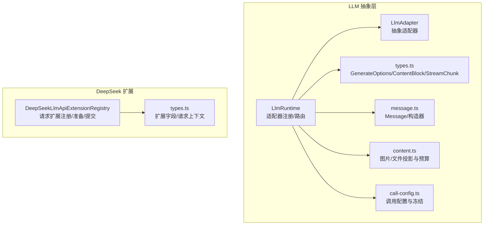
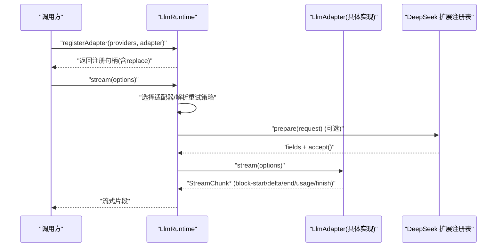
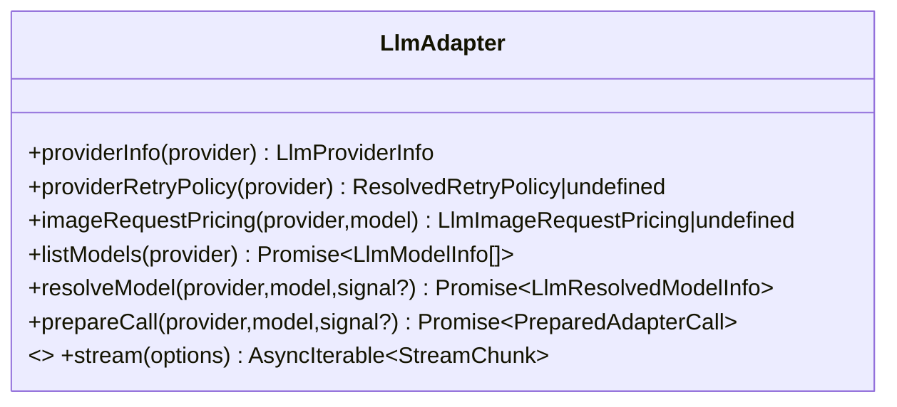
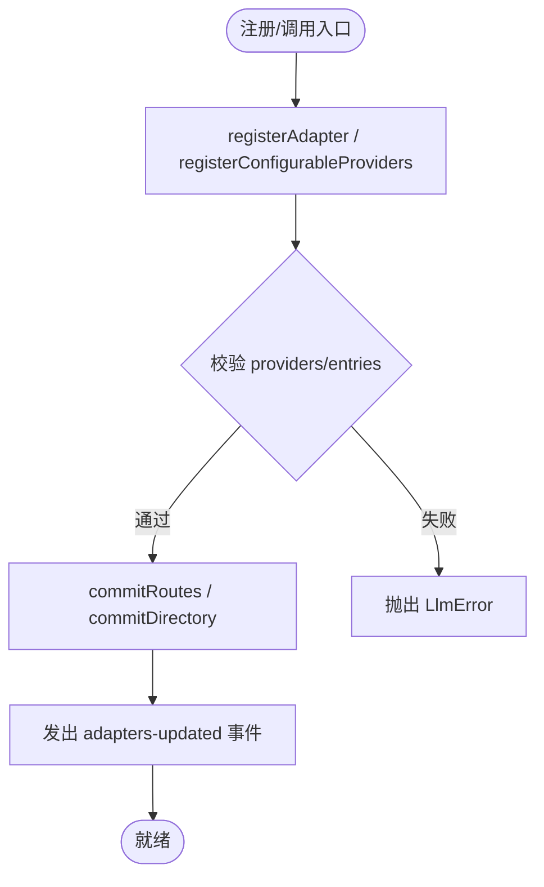
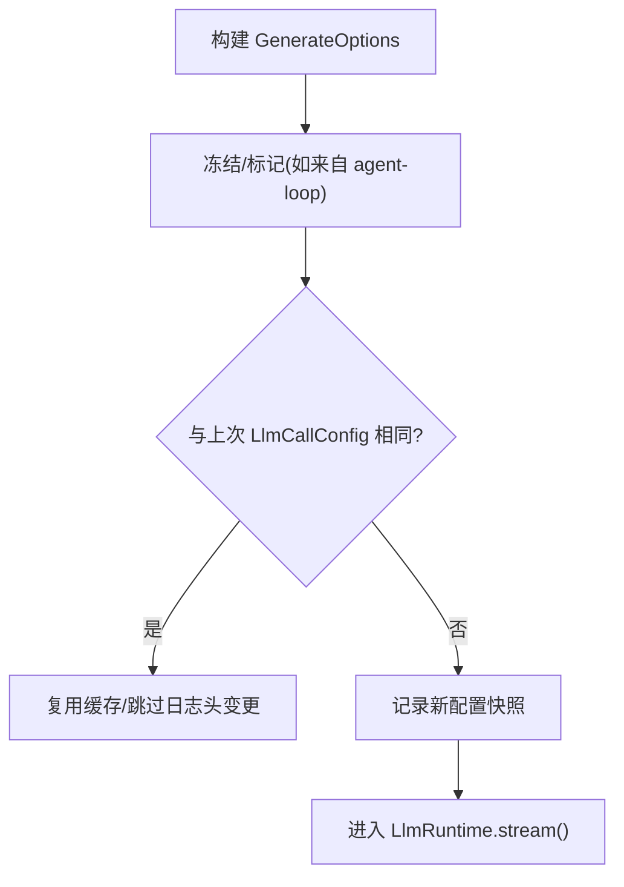
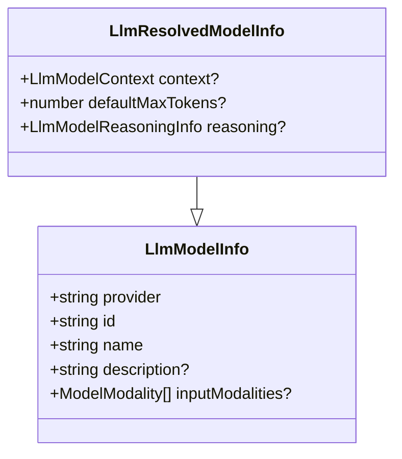
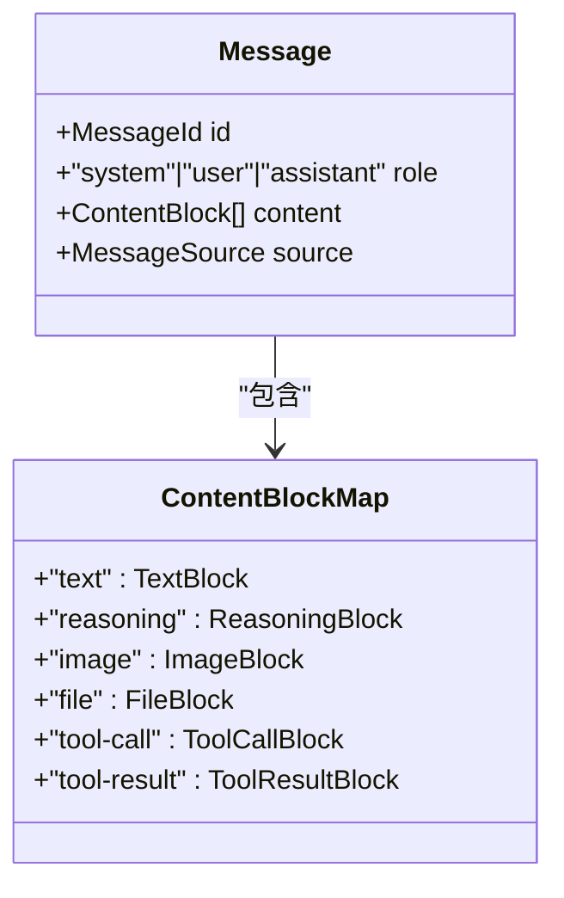
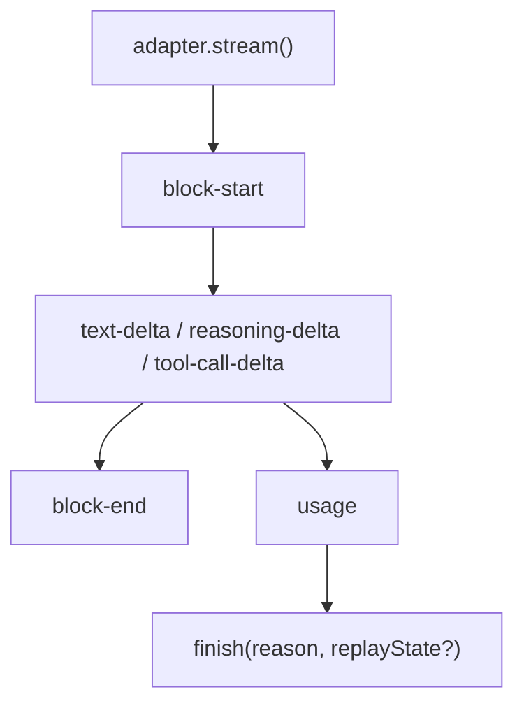
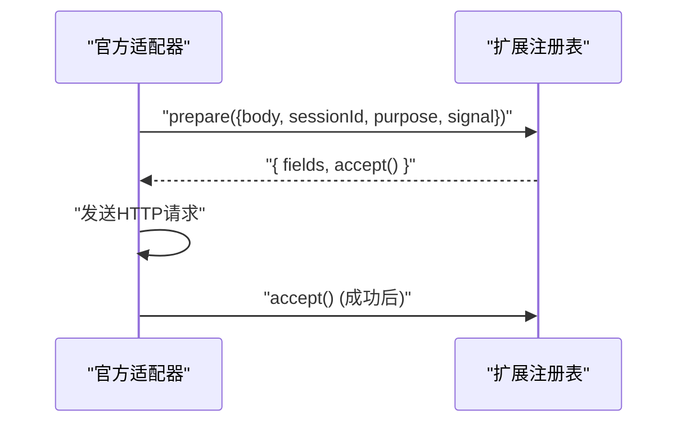
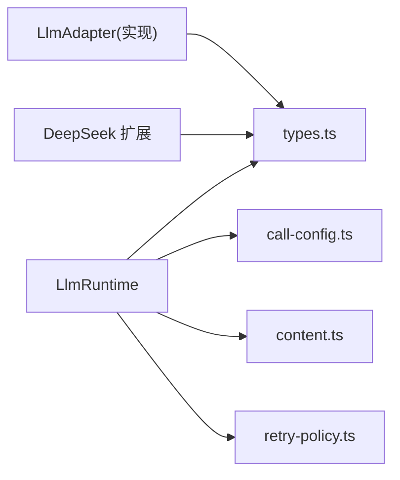

# 模型抽象接口

<cite>
**本文引用的文件**
- [packages/llm/llm/src/index.ts](file://packages/llm/llm/src/index.ts)
- [packages/llm/llm/src/types.ts](file://packages/llm/llm/src/types.ts)
- [packages/llm/llm/src/call-config.ts](file://packages/llm/llm/src/call-config.ts)
- [packages/llm/llm/src/content.ts](file://packages/llm/llm/src/content.ts)
- [packages/llm/llm/src/message.ts](file://packages/llm/llm/src/message.ts)
- [packages/llm/deepseek-llm-api-extensions/src/index.ts](file://packages/llm/deepseek-llm-api-extensions/src/index.ts)
- [packages/llm/deepseek-llm-api-extensions/src/types.ts](file://packages/llm/deepseek-llm-api-extensions/src/types.ts)
</cite>

## 目录
1. [简介](#简介)
2. [项目结构](#项目结构)
3. [核心组件](#核心组件)
4. [架构总览](#架构总览)
5. [详细组件分析](#详细组件分析)
6. [依赖关系分析](#依赖关系分析)
7. [性能考虑](#性能考虑)
8. [故障排查指南](#故障排查指南)
9. [结论](#结论)
10. [附录](#附录)

## 简介
本文件系统性说明 DeepSeek Harness 中“模型抽象接口”的设计与实现，覆盖统一模型接口规范、适配器契约、配置与元数据模型、消息与内容块处理、新适配器开发模板与注册流程、测试与验证最佳实践以及错误处理模式。目标是帮助开发者在不深入具体后端细节的前提下，快速理解并扩展模型能力。

## 项目结构
围绕 LLM 抽象的核心代码集中在 packages/llm 下：
- llm 包提供统一的适配器抽象、运行时注册、流式调用、消息与内容块类型、重试策略、错误与 API Key 校验等。
- deepseek-llm-api-extensions 包提供官方适配器的请求扩展机制（可插拔字段准备与提交）。

图表来源
- [packages/llm/llm/src/index.ts:191-279](file://packages/llm/llm/src/index.ts#L191-L279)
- [packages/llm/llm/src/types.ts:406-444](file://packages/llm/llm/src/types.ts#L406-L444)
- [packages/llm/llm/src/message.ts:130-158](file://packages/llm/llm/src/message.ts#L130-L158)
- [packages/llm/llm/src/content.ts:142-201](file://packages/llm/llm/src/content.ts#L142-L201)
- [packages/llm/deepseek-llm-api-extensions/src/index.ts:65-129](file://packages/llm/deepseek-llm-api-extensions/src/index.ts#L65-L129)

章节来源
- [packages/llm/llm/src/index.ts:1-50](file://packages/llm/llm/src/index.ts#L1-L50)
- [packages/llm/llm/src/types.ts:1-10](file://packages/llm/llm/src/types.ts#L1-L10)

## 核心组件
- LlmAdapter：统一适配器抽象，定义 providerInfo、listModels、resolveModel、prepareCall、stream 等必需方法；其中 stream 是唯一必须实现的方法。
- LlmRuntime：适配器注册中心与远程服务，负责路由注册、可配置提供者目录、模型发现、重试策略解析、图片定价查询、模型信息解析与校验、流式调用入口等。
- GenerateOptions：一次模型调用的完整入参，包含 provider、model、messages、system、tools、采样参数、停止序列、信号、会话标识与用途标记等。
- LlmCallConfig/LlmCallConfigAdapterDefaults：会话级调用配置快照与由适配器默认值填充的字段标记，用于缓存复用与日志记录。
- ContentBlock/Message：统一的消息与内容块模型，支持文本、推理、图片、文件、工具调用/结果等可扩展内容块。
- StreamChunk：适配器原始流式协议，包含块开始/结束、增量文本/推理/工具调用、用量统计与完成原因。
- DeepSeekLlmApiExtensionRegistry：为官方适配器的请求体提供可插拔字段准备与提交事务。

章节来源
- [packages/llm/llm/src/index.ts:191-279](file://packages/llm/llm/src/index.ts#L191-L279)
- [packages/llm/llm/src/index.ts:330-468](file://packages/llm/llm/src/index.ts#L330-L468)
- [packages/llm/llm/src/types.ts:406-444](file://packages/llm/llm/src/types.ts#L406-L444)
- [packages/llm/llm/src/call-config.ts:23-39](file://packages/llm/llm/src/call-config.ts#L23-L39)
- [packages/llm/llm/src/types.ts:53-124](file://packages/llm/llm/src/types.ts#L53-L124)
- [packages/llm/llm/src/types.ts:370-390](file://packages/llm/llm/src/types.ts#L370-L390)
- [packages/llm/deepseek-llm-api-extensions/src/index.ts:65-129](file://packages/llm/deepseek-llm-api-extensions/src/index.ts#L65-L129)

## 架构总览
下图展示从调用方到适配器的流式调用路径，以及适配器在运行时中的注册与发现过程。

图表来源
- [packages/llm/llm/src/index.ts:384-412](file://packages/llm/llm/src/index.ts#L384-L412)
- [packages/llm/llm/src/index.ts:688-715](file://packages/llm/llm/src/index.ts#L688-L715)
- [packages/llm/deepseek-llm-api-extensions/src/index.ts:108-129](file://packages/llm/deepseek-llm-api-extensions/src/index.ts#L108-L129)

## 详细组件分析

### LlmAdapter 抽象类与必需方法
- providerInfo(provider): 描述一个 provider 路由的显示元数据，id 必须等于传入的 provider。
- providerRetryPolicy(provider): 返回该 provider 的重试策略（未实现则使用默认）。
- imageRequestPricing(provider, model): 同步返回该模型路由的图片请求计价函数（无 I/O）。
- listModels(provider): 列出当前可声明的模型（建议性目录，不控制路由）。
- resolveModel(provider, model, signal?): 解析精确模型的元数据（名称、上下文窗口、默认 maxTokens、推理选项等）。
- prepareCall(provider, model, signal?): 绑定一次生成所需的模型元数据与最终流式入口，避免动态设置漂移。
- stream(options): 唯一必须实现的方法，按 StreamChunk 协议输出流。

图表来源
- [packages/llm/llm/src/index.ts:197-279](file://packages/llm/llm/src/index.ts#L197-L279)

章节来源
- [packages/llm/llm/src/index.ts:197-279](file://packages/llm/llm/src/index.ts#L197-L279)

### LlmRuntime 运行时与注册机制
- registerAdapter(providers, adapter): 原子注册一组 provider 路由，返回可替换句柄；重复或无效元数据会抛出 LlmError。
- registerConfigurableProviders(entries): 声明可由配置激活的 provider 目录，支持 replace 原子替换。
- discoverModels(settingsNs, request, signal?): 基于已注册的 discovery 回调探测端点可用模型。
- listModels/resolveModelInfo: 读取适配器提供的模型目录与精确模型信息，并进行严格校验与剥离。
- providerRetryPolicy/imageRequestPricing/fileRequestText: 暴露注册时捕获的策略与资源映射。

图表来源
- [packages/llm/llm/src/index.ts:384-459](file://packages/llm/llm/src/index.ts#L384-L459)
- [packages/llm/llm/src/index.ts:478-531](file://packages/llm/llm/src/index.ts#L478-L531)

章节来源
- [packages/llm/llm/src/index.ts:330-468](file://packages/llm/llm/src/index.ts#L330-L468)
- [packages/llm/llm/src/index.ts:552-614](file://packages/llm/llm/src/index.ts#L552-L614)
- [packages/llm/llm/src/index.ts:688-715](file://packages/llm/llm/src/index.ts#L688-L715)

### 模型配置：GenerateOptions 与 LlmCallConfig
- GenerateOptions：一次模型调用的完整入参，包括 provider、model、messages、system、tools、temperature、maxTokens、stop、signal、sessionId、purpose 等。
- LlmCallConfig：会话级调用配置快照（provider/model/reasoningEffort/temperature/maxTokens/stop），用于缓存复用与日志记录。
- callConfigEquals：字段级相等比较，用于判断是否产生新的配置快照。
- markAgentLoopRequest/isAgentLoopRequest：标记/识别由 agent-loop 组装的请求对象，便于流拦截器做不可变性与重放策略。

图表来源
- [packages/llm/llm/src/types.ts:406-444](file://packages/llm/llm/src/types.ts#L406-L444)
- [packages/llm/llm/src/call-config.ts:23-39](file://packages/llm/llm/src/call-config.ts#L23-L39)
- [packages/llm/llm/src/call-config.ts:49-78](file://packages/llm/llm/src/call-config.ts#L49-L78)

章节来源
- [packages/llm/llm/src/types.ts:406-444](file://packages/llm/llm/src/types.ts#L406-L444)
- [packages/llm/llm/src/call-config.ts:1-79](file://packages/llm/llm/src/call-config.ts#L1-L79)

### 模型能力声明：LlmModelInfo 与 LlmResolvedModelInfo
- LlmModelInfo：建议性目录项（provider/id/name/description/inputModalities）。
- LlmResolvedModelInfo：精确模型元数据（继承 LlmModelInfo，增加 context/defaultMaxTokens/reasoning）。
- LlmRuntime.resolveModelInfo：对适配器返回的精确模型信息进行强校验（provider/id/name/contextWindow/defaultMaxTokens/reasoning.efforts 非空等），并剥离内部对象。

图表来源
- [packages/llm/llm/src/types.ts:298-347](file://packages/llm/llm/src/types.ts#L298-L347)
- [packages/llm/llm/src/index.ts:726-800](file://packages/llm/llm/src/index.ts#L726-L800)

章节来源
- [packages/llm/llm/src/types.ts:298-347](file://packages/llm/llm/src/types.ts#L298-L347)
- [packages/llm/llm/src/index.ts:726-800](file://packages/llm/llm/src/index.ts#L726-L800)

### 消息与内容块：Message 与 ContentBlock
- Message：稳定 ID、角色（system/user/assistant）、内容块数组、来源（user/plugin/model/tool）。
- ContentBlockMap：可扩展的内容块类型，包括 text、reasoning、image、file、tool-call、tool-result。
- 构造器：createMessage/createUserMessage/createAssistantMessage/createToolResultMessage 提供不可变创建与冻结。
- 内容投影：projectFilesToText/projectImagesForTextModel/offloadRequestImagesWithPolicy 将文件/图片转换为模型可见的文本占位或按需移除，以适配不同模型能力与预算。

图表来源
- [packages/llm/llm/src/message.ts:130-158](file://packages/llm/llm/src/message.ts#L130-L158)
- [packages/llm/llm/src/types.ts:53-124](file://packages/llm/llm/src/types.ts#L53-L124)
- [packages/llm/llm/src/content.ts:142-201](file://packages/llm/llm/src/content.ts#L142-L201)
- [packages/llm/llm/src/content.ts:293-364](file://packages/llm/llm/src/content.ts#L293-L364)

章节来源
- [packages/llm/llm/src/message.ts:130-244](file://packages/llm/llm/src/message.ts#L130-L244)
- [packages/llm/llm/src/types.ts:53-124](file://packages/llm/llm/src/types.ts#L53-L124)
- [packages/llm/llm/src/content.ts:142-201](file://packages/llm/llm/src/content.ts#L142-L201)
- [packages/llm/llm/src/content.ts:293-364](file://packages/llm/llm/src/content.ts#L293-L364)

### 流式协议：StreamChunk 与 FinishReason
- StreamChunk：块开始/文本增量/推理增量/工具调用增量/块结束/用量/完成。
- FinishReason：stop、tool-calls、max-tokens、aborted、error，支持扩展。
- ReplayEnvelope：成功响应的可重放状态（响应级与块级元数据），用于历史重放与对齐。

图表来源
- [packages/llm/llm/src/types.ts:370-390](file://packages/llm/llm/src/types.ts#L370-L390)

章节来源
- [packages/llm/llm/src/types.ts:370-390](file://packages/llm/llm/src/types.ts#L370-L390)

### DeepSeek 请求扩展机制
- DeepSeekLlmApiExtensionRegistry：按字段键注册 provider，prepare 阶段并行准备各字段值并冻结，accept 阶段在 HTTP 2xx 后提交。
- 扩展请求上下文：包含 base body、sessionId、purpose、signal 等，供 provider 决定合并哪些顶层字段。

图表来源
- [packages/llm/deepseek-llm-api-extensions/src/index.ts:108-129](file://packages/llm/deepseek-llm-api-extensions/src/index.ts#L108-L129)
- [packages/llm/deepseek-llm-api-extensions/src/types.ts:18-28](file://packages/llm/deepseek-llm-api-extensions/src/types.ts#L18-L28)

章节来源
- [packages/llm/deepseek-llm-api-extensions/src/index.ts:1-133](file://packages/llm/deepseek-llm-api-extensions/src/index.ts#L1-L133)
- [packages/llm/deepseek-llm-api-extensions/src/types.ts:1-60](file://packages/llm/deepseek-llm-api-extensions/src/types.ts#L1-L60)

## 依赖关系分析
- LlmRuntime 依赖 types 中的消息/流式协议、call-config 的配置快照、content 的文件/图片投影、retry-policy 的重试策略、brand 的标记类型。
- LlmAdapter 的实现需遵循统一协议，并通过 LlmRuntime.registerAdapter 挂载到 provider 路由。
- DeepSeek 扩展与官方适配器解耦，通过扩展注册表注入请求字段，不影响核心抽象。

图表来源
- [packages/llm/llm/src/index.ts:9-37](file://packages/llm/llm/src/index.ts#L9-L37)
- [packages/llm/deepseek-llm-api-extensions/src/index.ts:7-14](file://packages/llm/deepseek-llm-api-extensions/src/index.ts#L7-L14)

章节来源
- [packages/llm/llm/src/index.ts:9-37](file://packages/llm/llm/src/index.ts#L9-L37)

## 性能考虑
- 图片预算与投影：通过 offloadRequestImagesWithPolicy 与 projectImagesForTextModel 控制请求大小与兼容性，避免超限导致失败。
- 配置快照与缓存：LlmCallConfig 与 callConfigEquals 减少不必要的头部变更与重建，提升缓存命中率。
- 流式增量：适配器应尽可能小粒度地推送 StreamChunk，降低端到端延迟。
- 重试策略：通过 providerRetryPolicy 与默认策略结合，平衡可靠性与吞吐。

[本节为通用指导，无需特定文件引用]

## 故障排查指南
- 认证与密钥：assertUsableApiKey 对空白或非法字符进行诊断，抛出 INVALID_CREDENTIAL_CODE。
- 适配器注册冲突：重复 provider 或无效元数据会抛出 DUPLICATE_ADAPTER/INVALID_ADAPTER。
- 模型信息校验：resolveModelInfo 对 provider/id/name/contextWindow/defaultMaxTokens/reasoning.efforts 等进行严格校验，失败抛出 INVALID_MODEL_*。
- 模型发现拒绝：discoverModels 在无 discovery 或无效请求时会抛出 NO_DISCOVERY/INVALID_DISCOVERY。
- 流式异常：适配器抛错会被 LlmRuntime 归一化为 finish(error/aborted)，便于上层统一处理。

章节来源
- [packages/llm/llm/src/index.ts:144-159](file://packages/llm/llm/src/index.ts#L144-L159)
- [packages/llm/llm/src/index.ts:384-459](file://packages/llm/llm/src/index.ts#L384-L459)
- [packages/llm/llm/src/index.ts:726-800](file://packages/llm/llm/src/index.ts#L726-L800)
- [packages/llm/llm/src/index.ts:584-614](file://packages/llm/llm/src/index.ts#L584-L614)

## 结论
DeepSeek Harness 通过 LlmAdapter 抽象与 LlmRuntime 运行时，提供了统一、可扩展且可重放的模型调用框架。借助 GenerateOptions/LlmCallConfig 的配置快照、ContentBlock/Message 的统一消息模型、以及 DeepSeek 请求扩展机制，开发者可以以最小成本接入新模型并提供一致体验。配合严格的校验与错误分类，系统具备良好的健壮性与可观测性。

## 附录

### 新模型适配器基础实现模板与开发指南
- 步骤概览
  - 实现 LlmAdapter：至少实现 stream(options)，其他方法可按需提供（如 listModels/resolveModel/providerRetryPolicy/imageRequestPricing）。
  - 注册适配器：通过 ctx.llm.registerAdapter([provider], adapter) 挂载；如需热更新，使用返回句柄的 replace(newProviders)。
  - 声明可配置提供者：若 provider 由用户配置驱动，使用 registerConfigurableProviders 声明目录项。
  - 实现模型发现：如需对外部端点进行模型探测，使用 registerModelDiscovery(settingsNs, discover)。
  - 处理请求扩展：若对接官方适配器，可使用 DeepSeekLlmApiExtensionRegistry 注册请求字段准备与提交。
- 关键要求
  - stream 必须遵守 StreamChunk 协议，正确处理 signal 取消。
  - resolveModel 返回的 LlmResolvedModelInfo 必须满足校验规则（provider/id/name/contextWindow/defaultMaxTokens/reasoning）。
  - 所有公开元数据需保持不可变与可序列化。
- 参考路径
  - 适配器抽象与运行时：[packages/llm/llm/src/index.ts:191-468](file://packages/llm/llm/src/index.ts#L191-L468)
  - 类型与协议：[packages/llm/llm/src/types.ts:53-124](file://packages/llm/llm/src/types.ts#L53-L124), [packages/llm/llm/src/types.ts:370-390](file://packages/llm/llm/src/types.ts#L370-L390)
  - 配置快照：[packages/llm/llm/src/call-config.ts:23-78](file://packages/llm/llm/src/call-config.ts#L23-L78)
  - 消息与内容块：[packages/llm/llm/src/message.ts:130-244](file://packages/llm/llm/src/message.ts#L130-L244), [packages/llm/llm/src/content.ts:142-201](file://packages/llm/llm/src/content.ts#L142-L201)
  - 请求扩展：[packages/llm/deepseek-llm-api-extensions/src/index.ts:65-129](file://packages/llm/deepseek-llm-api-extensions/src/index.ts#L65-L129)

### 模型测试与验证最佳实践
- 单元测试
  - 验证适配器对 StreamChunk 的产出顺序与终止条件。
  - 验证 resolveModel 返回的元数据符合约束。
  - 验证 callConfigEquals 对 stop 列表的元素级比较。
- 集成测试
  - 使用 LlmRuntime.registerAdapter 注册 mock 适配器，端到端验证流式消费与错误归一化。
  - 验证图片/文件投影在不同模型能力下的行为一致性。
- 回归与快照
  - 对消息与内容块进行冻结与快照比对，确保不可变性与稳定性。
- 参考路径
  - 消息冻结与构造：[packages/llm/llm/src/message.ts:171-244](file://packages/llm/llm/src/message.ts#L171-L244)
  - 内容投影与预算：[packages/llm/llm/src/content.ts:293-364](file://packages/llm/llm/src/content.ts#L293-L364)
  - 配置比较：[packages/llm/llm/src/call-config.ts:49-78](file://packages/llm/llm/src/call-config.ts#L49-L78)

### 错误处理模式
- 统一错误类型：LlmError 携带 code、status、providerRetryAfterMs、requestId 等结构化事实。
- 适配器失败归一化：适配器抛错将被转换为 finish(error/aborted)，保证上层一致的消费体验。
- 常见错误码
  - INVALID_CREDENTIAL：API Key 空白或非法。
  - DUPLICATE_ADAPTER/INVALID_ADAPTER：注册冲突或元数据无效。
  - INVALID_MODEL_INFO/INVALID_MODEL_CONTEXT/INVALID_MODEL_MAX_TOKENS/INVALID_MODEL_REASONING：模型元数据校验失败。
  - NO_DISCOVERY/INVALID_DISCOVERY：模型发现未注册或请求无效。
- 参考路径
  - 错误定义与校验：[packages/llm/llm/src/index.ts:76-124](file://packages/llm/llm/src/index.ts#L76-L124)
  - 模型信息校验：[packages/llm/llm/src/index.ts:743-800](file://packages/llm/llm/src/index.ts#L743-L800)
  - 模型发现校验：[packages/llm/llm/src/index.ts:584-614](file://packages/llm/llm/src/index.ts#L584-L614)