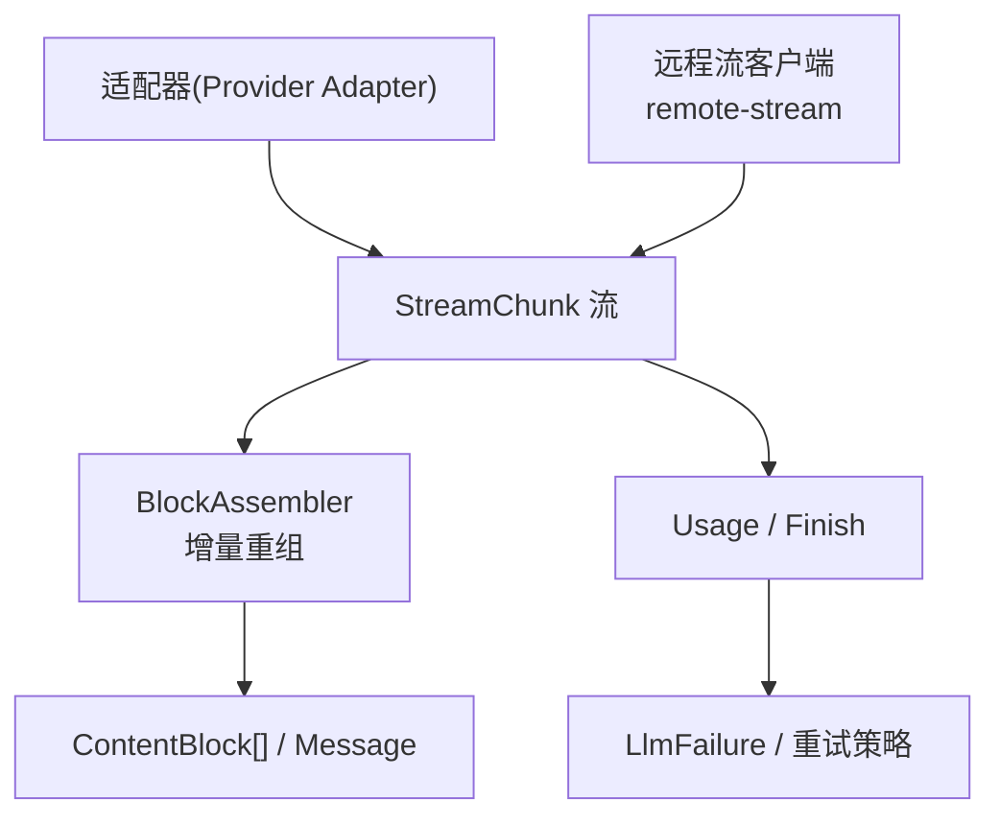
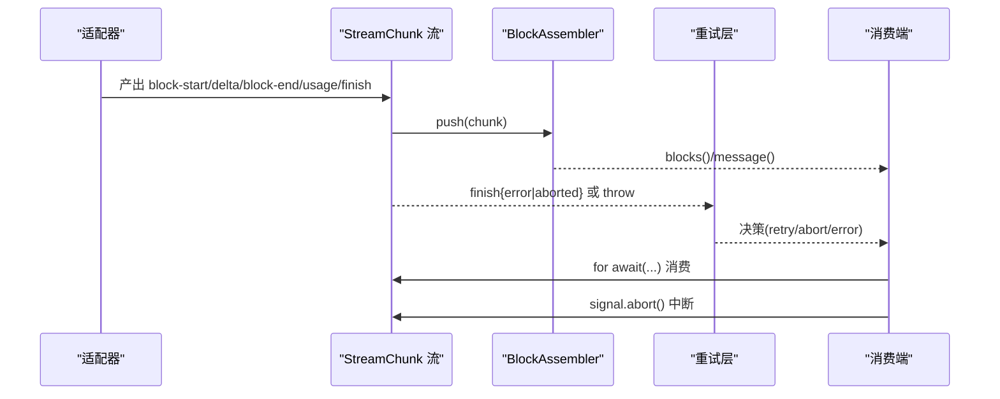
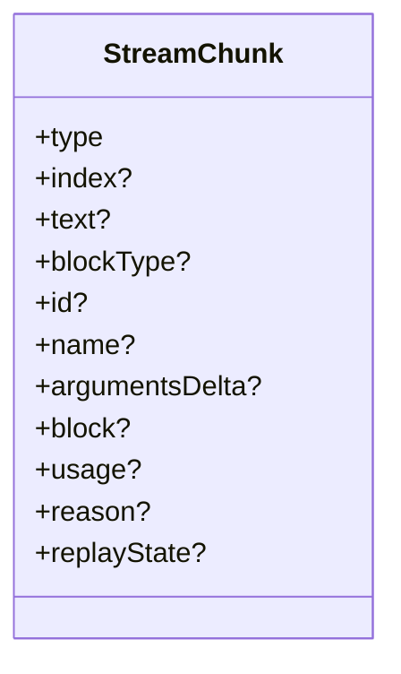
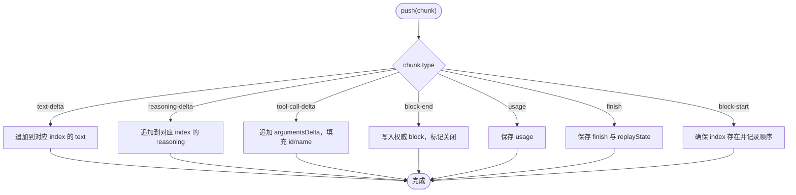
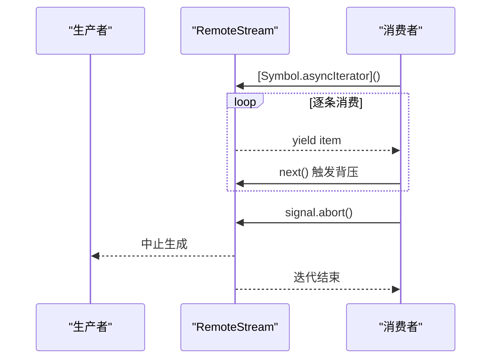
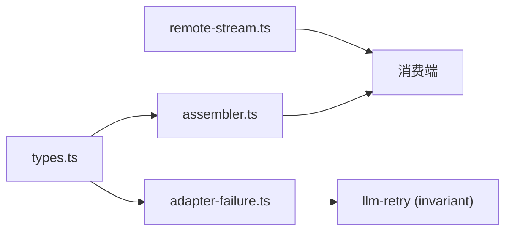

# 流式响应处理

<cite>
**本文引用的文件**
- [llm-streaming.md](file://docs/subsystems/llm-streaming.md)
- [assembler.ts](file://packages/llm/llm/src/assembler.ts)
- [types.ts](file://packages/llm/llm/src/types.ts)
- [adapter-failure.ts](file://packages/llm/llm/src/adapter-failure.ts)
- [index.ts](file://packages/llm/llm/src/index.ts)
- [invariant.ts](file://packages/llm/llm-retry/src/invariant.ts)
- [transport-recovery.spec.ts](file://packages/llm/llm-retry/tests/transport-recovery.spec.ts)
- [remote-stream.ts](file://packages/api/gateway/src/client/remote-stream.ts)
</cite>

## 目录
1. [简介](#简介)
2. [项目结构](#项目结构)
3. [核心组件](#核心组件)
4. [架构总览](#架构总览)
5. [详细组件分析](#详细组件分析)
6. [依赖关系分析](#依赖关系分析)
7. [性能考量](#性能考量)
8. [故障排查指南](#故障排查指南)
9. [结论](#结论)
10. [附录](#附录)

## 简介
本文件系统性说明 DeepSeek Harness 中的流式响应处理机制，重点覆盖：
- StreamChunk 协议的数据结构与传输格式（block-start、text-delta、reasoning-delta、tool-call-delta、block-end、usage、finish）
- 流式数据的接收、缓冲与重组逻辑，尤其是 BlockAssembler 的实现原理
- 断线重连与错误恢复策略，包括 LlmFailure 的规范化与重试边界
- 背压控制与流量管理，确保高性能流式数据传输
- 消费端异步迭代器使用模式与最佳实践
- 性能优化与内存管理方案（中断处理、资源清理）

## 项目结构
围绕流式响应的关键代码分布在以下位置：
- 协议与类型定义：packages/llm/llm/src/types.ts
- 块组装器：packages/llm/llm/src/assembler.ts
- 适配器失败与错误封装：packages/llm/llm/src/adapter-failure.ts、packages/llm/llm/src/index.ts
- 重试与恢复：packages/llm/llm-retry/src/invariant.ts、packages/llm/llm-retry/tests/transport-recovery.spec.ts
- 远程流与背压：packages/api/gateway/src/client/remote-stream.ts
- 子系统文档：docs/subsystems/llm-streaming.md



图表来源
- [types.ts:370-390](file://packages/llm/llm/src/types.ts#L370-L390)
- [assembler.ts:38-96](file://packages/llm/llm/src/assembler.ts#L38-L96)
- [remote-stream.ts:68-93](file://packages/api/gateway/src/client/remote-stream.ts#L68-L93)

章节来源
- [llm-streaming.md:167-229](file://docs/subsystems/llm-streaming.md#L167-L229)
- [types.ts:370-390](file://packages/llm/llm/src/types.ts#L370-L390)
- [assembler.ts:38-96](file://packages/llm/llm/src/assembler.ts#L38-L96)

## 核心组件
- StreamChunk 协议：提供 block-start/text-delta/reasoning-delta/tool-call-delta/block-end/usage/finish 等原子事件，用于跨适配器的统一流式契约。
- BlockAssembler：将 StreamChunk 流增量组装为 ContentBlock[] 与最终 assistant Message，并维护 usage、finish、replayState。
- LlmFailure 与错误封装：将适配器抛出的错误或终止 finish 中的错误统一为可序列化的 LlmFailure，供重试策略消费。
- 远程流与背压：通过 AsyncIterable 与 AbortSignal 实现可控的消费节奏，避免生产者过载。

章节来源
- [llm-streaming.md:167-229](file://docs/subsystems/llm-streaming.md#L167-L229)
- [assembler.ts:38-209](file://packages/llm/llm/src/assembler.ts#L38-L209)
- [types.ts:39-51](file://packages/llm/llm/src/types.ts#L39-L51)
- [index.ts:94-124](file://packages/llm/llm/src/index.ts#L94-L124)

## 架构总览
下图展示了从适配器到消费端的完整流式链路：适配器产出 StreamChunk；BlockAssembler 负责重组；错误被归一化为 LlmFailure；重试层根据策略决定是否恢复；远程流提供背压与生命周期管理。



图表来源
- [types.ts:370-390](file://packages/llm/llm/src/types.ts#L370-L390)
- [assembler.ts:49-96](file://packages/llm/llm/src/assembler.ts#L49-L96)
- [index.ts:1052-1080](file://packages/llm/llm/src/index.ts#L1052-L1080)
- [invariant.ts:18-42](file://packages/llm/llm-retry/src/invariant.ts#L18-L42)

## 详细组件分析

### StreamChunk 协议与数据模型
- block-start：声明一个块的开始及类型（text/reasoning/tool-call 等），并携带 index 用于关联后续 delta。
- text-delta / reasoning-delta：向对应 index 追加文本片段。
- tool-call-delta：向对应 index 追加工具调用参数（原始 JSON 字符串），并可携带 id/name。
- block-end：关闭该 index 对应的块，并提供已组装好的 ContentBlock，作为权威结果。
- usage：统计 token 用量，出现在 finish 之前。
- finish：流结束标记，包含停止原因 reason（stop/tool-calls/max-tokens/aborted/error）以及可选 replayState。



图表来源
- [types.ts:370-390](file://packages/llm/llm/src/types.ts#L370-L390)

章节来源
- [llm-streaming.md:167-229](file://docs/subsystems/llm-streaming.md#L167-L229)
- [types.ts:370-390](file://packages/llm/llm/src/types.ts#L370-L390)

### BlockAssembler 实现原理
BlockAssembler 维护每个 index 的部分块（PartialBlock），按顺序记录首次出现的 index，并在收到 delta 时拼接文本或参数，在 block-end 时锁定权威块。其关键特性：
- 容忍无 block-start/end 的 delta-only 协议，自动创建 PartialBlock。
- 对已关闭块的后续 delta 直接忽略，防止畸形流污染内存。
- max-tokens 截断时丢弃所有 tool-call 块，保证安全性；replayState 同步裁剪。
- interruptedBlocks 仅保留有非空白内容的 text/reasoning 块，便于中断前安全提交。



图表来源
- [assembler.ts:49-96](file://packages/llm/llm/src/assembler.ts#L49-L96)
- [assembler.ts:108-150](file://packages/llm/llm/src/assembler.ts#L108-L150)

章节来源
- [assembler.ts:38-209](file://packages/llm/llm/src/assembler.ts#L38-L209)

### 断线重连与错误恢复（LlmFailure）
- 适配器可能抛出错误或在 finish 中携带 error/aborted；两者均被归一化为 LlmFailure（含 message/code/status/providerRetryAfterMs/requestId）。
- 重试层在请求错误事件中依据 ResolvedRetryPolicy 决定重试（always/normal 模式），支持 provider 建议的重试延迟。
- 测试覆盖了 stream_disconnect/partial_disconnect 场景，确保失败 chunk 不被提交，重试后恢复成功。

```mermaid
sequenceDiagram
participant Adapter as "适配器"
participant Error as "错误归一化"
participant Retry as "重试层"
participant Loop as "循环/消费者"
Adapter-->>Error : 抛出异常 或 finish{error|aborted}
Error-->>Retry : LlmFailure(标准化)
Retry->>Loop : agent/request-error(附带 failure)
alt 可重试
Retry-->>Adapter : 重新发起请求
Adapter-->>Loop : 新的流式响应
else 不可重试
Retry-->>Loop : 终止并上报错误
end
```

图表来源
- [adapter-failure.ts:62-88](file://packages/llm/llm/src/adapter-failure.ts#L62-L88)
- [invariant.ts:18-42](file://packages/llm/llm-retry/src/invariant.ts#L18-L42)
- [transport-recovery.spec.ts:102-132](file://packages/llm/llm-retry/tests/transport-recovery.spec.ts#L102-L132)

章节来源
- [adapter-failure.ts:62-88](file://packages/llm/llm/src/adapter-failure.ts#L62-L88)
- [invariant.ts:18-42](file://packages/llm/llm-retry/src/invariant.ts#L18-L42)
- [transport-recovery.spec.ts:102-132](file://packages/llm/llm-retry/tests/transport-recovery.spec.ts#L102-L132)

### 背压控制与流量管理
- 远程流通过 AsyncIterable 暴露迭代器，支持一次性消费与 dispose 释放。
- 使用 AbortSignal 协调生命周期：当信号中止时，迭代器立即结束并清理资源。
- 生产端需遵循“先 usage 再 finish”的约束，避免尾随 usage 破坏顺序。



图表来源
- [remote-stream.ts:68-93](file://packages/api/gateway/src/client/remote-stream.ts#L68-L93)
- [llm-streaming.md:288-298](file://docs/subsystems/llm-streaming.md#L288-L298)

章节来源
- [remote-stream.ts:68-93](file://packages/api/gateway/src/client/remote-stream.ts#L68-L93)
- [llm-streaming.md:288-298](file://docs/subsystems/llm-streaming.md#L288-L298)

### 消费端示例与最佳实践
- 使用 for await...of 遍历流式响应，逐条处理 StreamChunk。
- 结合 AbortSignal 实现中断：在 UI 取消或超时场景中调用 signal.abort()，确保迭代器尽快退出。
- 使用 BlockAssembler.message() 获取最终 assistant Message，或使用 interruptedBlocks() 在取消时提交安全的前缀内容。
- 注意 usage 必须在 finish 之前出现；若适配器违反此约定，可能导致统计不一致。

章节来源
- [llm-streaming.md:288-298](file://docs/subsystems/llm-streaming.md#L288-L298)
- [assembler.ts:152-209](file://packages/llm/llm/src/assembler.ts#L152-L209)

## 依赖关系分析
- types.ts 定义了 StreamChunk、FinishReason、TokenUsage、LlmFailure 等核心类型，被 assembler.ts、adapter-failure.ts、重试层广泛引用。
- assembler.ts 依赖 types.ts 的类型，并通过 createMessage 构造最终消息。
- adapter-failure.ts 将任意失败载荷校验并冻结为 LlmFailure，供重试层与上层消费。
- remote-stream.ts 提供通用远程流抽象，配合 AbortSignal 实现背压与生命周期管理。



图表来源
- [types.ts:39-51](file://packages/llm/llm/src/types.ts#L39-L51)
- [assembler.ts:9-14](file://packages/llm/llm/src/assembler.ts#L9-L14)
- [adapter-failure.ts:62-88](file://packages/llm/llm/src/adapter-failure.ts#L62-L88)
- [remote-stream.ts:68-93](file://packages/api/gateway/src/client/remote-stream.ts#L68-L93)

章节来源
- [types.ts:39-51](file://packages/llm/llm/src/types.ts#L39-L51)
- [assembler.ts:9-14](file://packages/llm/llm/src/assembler.ts#L9-L14)
- [adapter-failure.ts:62-88](file://packages/llm/llm/src/adapter-failure.ts#L62-L88)
- [remote-stream.ts:68-93](file://packages/api/gateway/src/client/remote-stream.ts#L68-L93)

## 性能考量
- 增量组装：BlockAssembler 以 O(1) 追加 delta，整体复杂度与 chunk 数量线性相关；max-tokens 裁剪一次扫描完成。
- 内存控制：对已关闭块的后续 delta 直接忽略，避免恶意或畸形流导致内存增长。
- 背压与中断：通过 AsyncIterable 与 AbortSignal 控制消费速率与及时释放资源，避免堆积。
- 统计准确性：usage 必须在 finish 之前；适配器应严格遵循顺序，避免重复或遗漏计数。

[本节为通用指导，不直接分析具体文件]

## 故障排查指南
- 检查 finish 的 reason：若为 error/aborted，查看 LlmFailure.code 与 status，定位是传输错误还是提供者错误。
- 验证 usage 顺序：确认 usage 出现在 finish 之前，否则统计可能不准确。
- 重试策略：确认 ResolvedRetryPolicy 是否允许重试（always/normal 模式与 retryableCodes），必要时调整 provider 配置。
- 流中断：确认是否调用了 AbortSignal 的中断，确保迭代器正常结束并清理资源。
- 测试参考：transport-recovery.spec.ts 覆盖了断开与部分断开后的重试行为，可作为回归基线。

章节来源
- [index.ts:94-124](file://packages/llm/llm/src/index.ts#L94-L124)
- [invariant.ts:18-42](file://packages/llm/llm-retry/src/invariant.ts#L18-L42)
- [transport-recovery.spec.ts:102-132](file://packages/llm/llm-retry/tests/transport-recovery.spec.ts#L102-L132)

## 结论
DeepSeek Harness 的流式响应处理以 StreamChunk 协议为核心，借助 BlockAssembler 实现稳定、高效的增量重组；通过 LlmFailure 与重试策略保障容错能力；结合远程流的背压与中断机制，确保在高吞吐场景下的稳定性与性能。开发者应遵循协议约定、合理使用 BlockAssembler 与 AbortSignal，并基于重试策略进行健壮的错误恢复。

## 附录
- 协议参考：详见 llm-streaming.md 中关于 StreamChunk、AssistantStreamAccumulator、LlmFailure、ResolvedRetryPolicy 的详细说明。
- 类型参考：types.ts 提供完整的类型定义，包括 ContentBlock、FinishReason、TokenUsage、ReplayEnvelope 等。
- 实现参考：assembler.ts 提供 BlockAssembler 的完整实现；adapter-failure.ts 提供失败载荷的校验与冻结；remote-stream.ts 提供通用的远程流抽象。