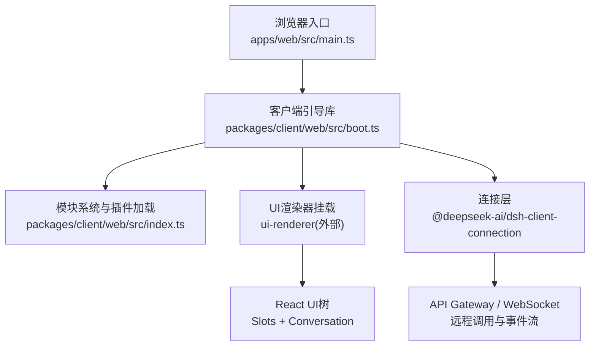
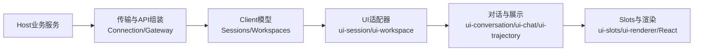
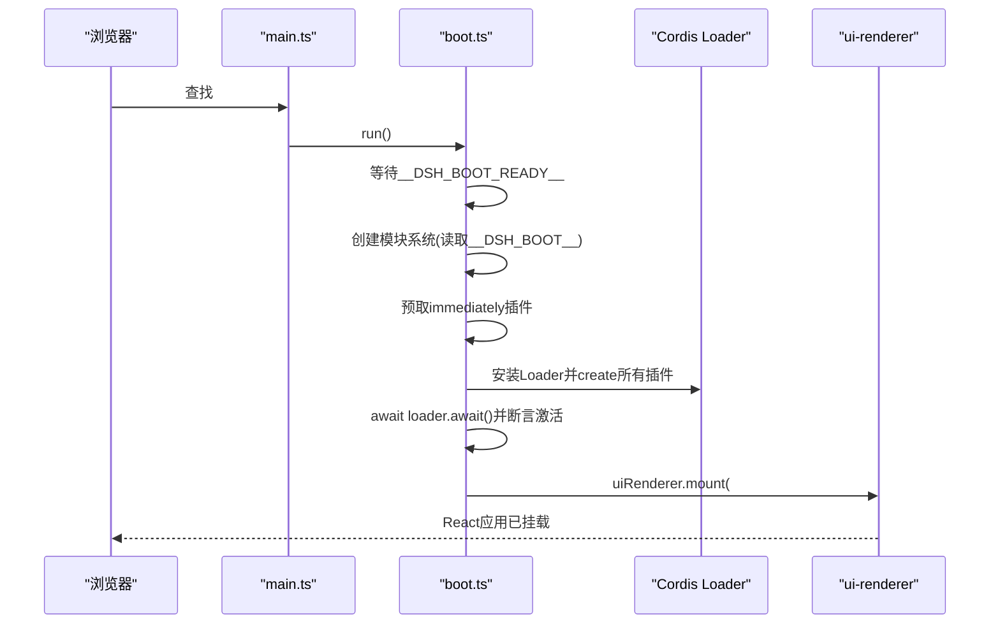
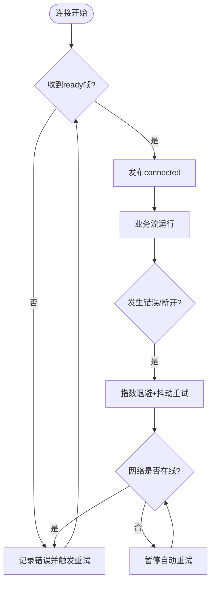
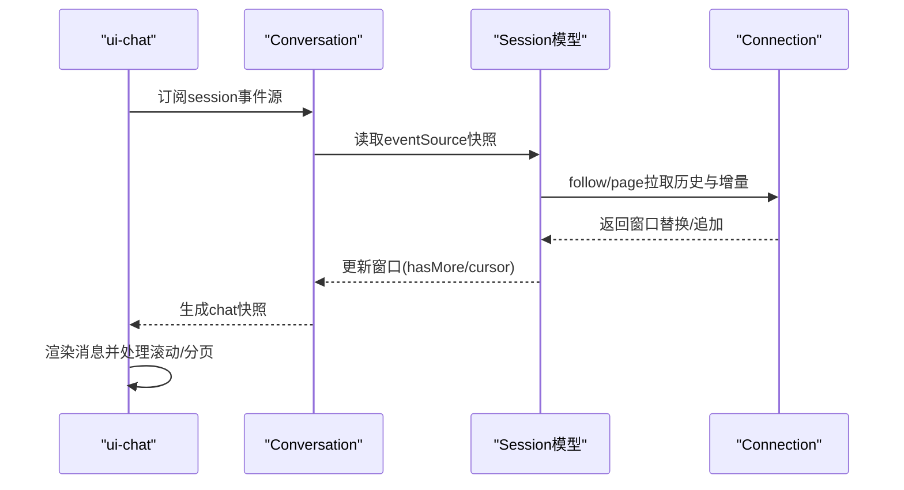
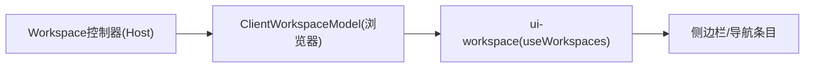
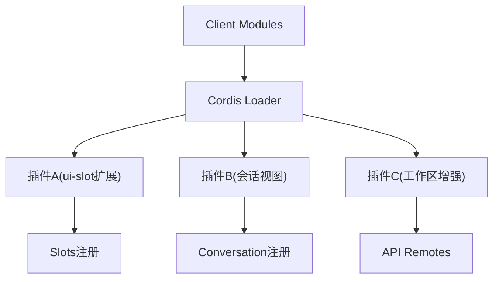
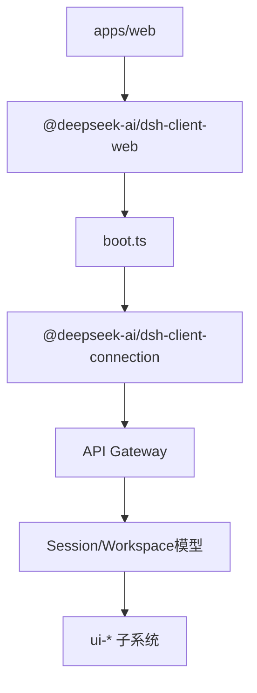

# Web客户端架构

<cite>
**本文引用的文件**
- [apps/web/src/main.ts](file://apps/web/src/main.ts)
- [apps/web/vite.config.ts](file://apps/web/vite.config.ts)
- [packages/client/web/src/index.ts](file://packages/client/web/src/index.ts)
- [packages/client/web/src/boot.ts](file://packages/client/web/src/boot.ts)
- [docs/subsystems/web-client.md](file://docs/subsystems/web-client.md)
- [packages/client/connection/README.md](file://packages/client/connection/README.md)
- [packages/api/session-controller/src/client/contract/events.ts](file://packages/api/session-controller/src/client/contract/events.ts)
- [packages/client/ui-chat/tests/chat-view.client.spec.tsx](file://packages/client/ui-chat/tests/chat-view.client.spec.tsx)
</cite>

## 目录
1. [简介](#简介)
2. [项目结构](#项目结构)
3. [核心组件](#核心组件)
4. [架构总览](#架构总览)
5. [详细组件分析](#详细组件分析)
6. [依赖关系分析](#依赖关系分析)
7. [性能考量](#性能考量)
8. [故障排查指南](#故障排查指南)
9. [结论](#结论)
10. [附录](#附录)

## 简介
本文件面向DeepSeek Harness Web客户端的开发者与集成者，系统性阐述前端应用的整体架构、状态管理、会话连接与重连策略、聊天界面渲染与滚动优化、设置与工作区管理、扩展机制以及性能优化方案。文档以仓库中的Web入口、构建配置、客户端引导、连接层与子系统文档为依据，提供从启动到渲染、从数据流到错误恢复的完整参考。

## 项目结构
Web客户端由浏览器入口、Vite构建配置、客户端引导库、连接层与UI子系统组成：
- 浏览器入口负责挂载根节点并启动AppWebEntry。
- Vite配置定义多入口（index与bootstrap）、分包策略、字体与语法高亮资源组织、开发保护与预览页面生成。
- 客户端引导库创建模块系统、加载插件、挂载UI渲染器。
- 连接层提供RPC、事件流、认证与重连能力。
- UI子系统通过Slots与Conversation将模型映射为React视图。

**图表来源**
- [apps/web/src/main.ts:1-7](file://apps/web/src/main.ts#L1-L7)
- [packages/client/web/src/boot.ts:21-100](file://packages/client/web/src/boot.ts#L21-L100)
- [packages/client/web/src/index.ts:1-11](file://packages/client/web/src/index.ts#L1-L11)
- [packages/client/connection/README.md:25-47](file://packages/client/connection/README.md#L25-L47)

**章节来源**
- [apps/web/src/main.ts:1-7](file://apps/web/src/main.ts#L1-L7)
- [apps/web/vite.config.ts:140-229](file://apps/web/vite.config.ts#L140-L229)
- [packages/client/web/src/index.ts:1-11](file://packages/client/web/src/index.ts#L1-L11)
- [packages/client/web/src/boot.ts:21-100](file://packages/client/web/src/boot.ts#L21-L100)

## 核心组件
- 浏览器入口：查找#root并运行AppWebEntry。
- 客户端引导：等待宿主注入的__DSH_BOOT_READY__，创建模块系统，预取立即执行包，初始化Cordis Loader，激活所有插件，最后挂载UI渲染器。
- 构建与打包：Vite双入口（index与bootstrap），vendor分包策略，语法高亮与数学公式字体归类，禁止独立serve模式，生成preview.html用于worker预览。
- 连接层：提供RPC、WebSocket事件流、认证与信任边界、连接生命周期与重连策略。
- UI与状态：通过Slots注册UI扩展点，Conversation将Session历史窗口转换为目标视图；Client模型维护Host状态的镜像与命令服务。

**章节来源**
- [apps/web/src/main.ts:1-7](file://apps/web/src/main.ts#L1-L7)
- [packages/client/web/src/boot.ts:21-100](file://packages/client/web/src/boot.ts#L21-L100)
- [apps/web/vite.config.ts:19-67](file://apps/web/vite.config.ts#L19-L67)
- [apps/web/vite.config.ts:89-192](file://apps/web/vite.config.ts#L89-L192)
- [packages/client/connection/README.md:25-47](file://packages/client/connection/README.md#L25-L47)
- [docs/subsystems/web-client.md:20-30](file://docs/subsystems/web-client.md#L20-L30)

## 架构总览
Web客户端采用分层与插件化设计：
- Host业务服务拥有权威状态、持久化、变更顺序与访问策略。
- 传输与API组装：Connection建立Client端生成、暴露生成的ctx.remote方法与流、转发选定的Cordis事件。
- Client模型：保持无React的状态镜像，处理流/单例请求竞态，暴露可观察快照与命令。
- UI适配器：将模型可观察值转为标准Slot源。
- 对话数据：将Session历史窗口转换为Chat/Trajectory等目标快照。
- 组合与渲染：Slots声明扩展位置，ui-renderer绑定可观察值并挂载根树。

**图表来源**
- [docs/subsystems/web-client.md:7-18](file://docs/subsystems/web-client.md#L7-L18)
- [docs/subsystems/web-client.md:54-61](file://docs/subsystems/web-client.md#L54-L61)

**章节来源**
- [docs/subsystems/web-client.md:7-18](file://docs/subsystems/web-client.md#L7-L18)
- [docs/subsystems/web-client.md:54-61](file://docs/subsystems/web-client.md#L54-L61)

## 详细组件分析

### 启动与引导流程
- 浏览器入口获取#root元素并实例化AppWebEntry后调用run。
- run等待__DSH_BOOT_READY__，读取window.__ModuleLoader__与__DSH_BOOT__，创建模块系统，预取immediately插件，初始化Cordis Loader，激活所有条目，校验激活状态，最后通过uiRenderer.mount挂载应用。
- 构建期通过Vite插件注入标题、阻止独立serve、生成preview.html并将bootstrap脚本插入到index之前。

**图表来源**
- [apps/web/src/main.ts:1-7](file://apps/web/src/main.ts#L1-L7)
- [packages/client/web/src/boot.ts:21-100](file://packages/client/web/src/boot.ts#L21-L100)
- [packages/client/web/src/boot.ts:103-158](file://packages/client/web/src/boot.ts#L103-L158)
- [apps/web/vite.config.ts:19-67](file://apps/web/vite.config.ts#L19-L67)

**章节来源**
- [apps/web/src/main.ts:1-7](file://apps/web/src/main.ts#L1-L7)
- [packages/client/web/src/boot.ts:21-100](file://packages/client/web/src/boot.ts#L21-L100)
- [apps/web/vite.config.ts:19-67](file://apps/web/vite.config.ts#L19-L67)

### 会话连接与重连策略
- Connection提供RPC与WebSocket事件流，维护当前“生成”（generation）与连接状态。
- API Gateway在内部$events逻辑流中发送ready帧，随后增量事件到达；ConnectionController在ready后才发布connected。
- 断开时按指数退避+抖动重试（上限与间隔受控），网络离线暂停自动重试，在线后重置序列并从首档重试；手动reconnect中断工作并立即重试。
- 物理连接恢复后，各RemoteStream重新打开其逻辑源；业务错误、协议违规为终止性错误。

**图表来源**
- [packages/client/connection/README.md:25-47](file://packages/client/connection/README.md#L25-L47)

**章节来源**
- [packages/client/connection/README.md:25-47](file://packages/client/connection/README.md#L25-L47)

### 聊天界面渲染与滚动优化
- Conversation将Session历史窗口转换为目标快照（如chat），ui-chat负责消息渲染与交互。
- 测试覆盖底部固定滚动行为、分页加载更早消息、滚动指标模拟等场景，体现虚拟列表与滚动优化的实现要点：
  - 使用data-conversation-scroll容器进行滚动跟踪。
  - 底部钉住状态下重渲染保持滚动到底部。
  - 分页按钮触发loadOlder并显示加载中状态。
- 会话事件窗口支持replace/prepend/append，配合page加载历史与修复间隙，保证长会话流畅体验。

**图表来源**
- [packages/api/session-controller/src/client/contract/events.ts:143-174](file://packages/api/session-controller/src/client/contract/events.ts#L143-L174)
- [packages/client/ui-chat/tests/chat-view.client.spec.tsx:477-494](file://packages/client/ui-chat/tests/chat-view.client.spec.tsx#L477-L494)
- [packages/client/ui-chat/tests/chat-view.client.spec.tsx:2593-2622](file://packages/client/ui-chat/tests/chat-view.client.spec.tsx#L2593-L2622)

**章节来源**
- [packages/api/session-controller/src/client/contract/events.ts:143-174](file://packages/api/session-controller/src/client/contract/events.ts#L143-L174)
- [packages/client/ui-chat/tests/chat-view.client.spec.tsx:477-494](file://packages/client/ui-chat/tests/chat-view.client.spec.tsx#L477-L494)
- [packages/client/ui-chat/tests/chat-view.client.spec.tsx:2593-2622](file://packages/client/ui-chat/tests/chat-view.client.spec.tsx#L2593-L2622)

### 设置管理与工作区管理
- 设置管理：通过Settings子系统提供配置卡片与选项，UI适配器将设置项暴露为标准Slot源，供用户修改与持久化。
- 工作区管理：Workspace控制器在Host侧维护变更策略与follow流；Client模型维护行、顺序、归档ID、命令回显与流/单例竞态解决；ui-workspace贡献useWorkspaces与导航回调，驱动侧边栏、英雄区与导航条目。

**图表来源**
- [docs/subsystems/web-client.md:48-52](file://docs/subsystems/web-client.md#L48-L52)

**章节来源**
- [docs/subsystems/web-client.md:48-52](file://docs/subsystems/web-client.md#L48-L52)

### 扩展机制与插件开发
- 客户端由独立加载的插件组成，通过Client Modules发现与加载插件图，Cordis Loader负责模块装载与服务注入。
- 插件可通过Slots扩展UI，通过API Gateway暴露或消费远程方法，通过Conversation注册目标视图。
- 跨包行为使用注入的Cordis服务与Slots，避免直接运行时导入其他特性包的实现。

**图表来源**
- [docs/subsystems/web-client.md:20-30](file://docs/subsystems/web-client.md#L20-L30)
- [docs/subsystems/web-client.md:84-95](file://docs/subsystems/web-client.md#L84-L95)

**章节来源**
- [docs/subsystems/web-client.md:20-30](file://docs/subsystems/web-client.md#L20-L30)
- [docs/subsystems/web-client.md:84-95](file://docs/subsystems/web-client.md#L84-L95)

## 依赖关系分析
- apps/web依赖@deepseek-ai/dsh-client-web作为壳库，通过Vite构建产物被CLI web服务提供。
- packages/client/web导出AppWebEntry与平台模块，boot.ts负责引导与挂载。
- 连接层与API Gateway构成通信基础，会话与工作区模型位于api/*-controller的client侧。
- UI子系统通过Slots与Conversation解耦业务与展示。

**图表来源**
- [apps/web/package.json:1-59](file://apps/web/package.json#L1-L59)
- [packages/client/web/src/index.ts:1-11](file://packages/client/web/src/index.ts#L1-L11)
- [packages/client/connection/README.md:25-47](file://packages/client/connection/README.md#L25-L47)

**章节来源**
- [apps/web/package.json:1-59](file://apps/web/package.json#L1-L59)
- [packages/client/web/src/index.ts:1-11](file://packages/client/web/src/index.ts#L1-L11)
- [packages/client/connection/README.md:25-47](file://packages/client/connection/README.md#L25-L47)

## 性能考量
- 分包与缓存：
  - vendor分包包含math、highlight、markdown解析等重型且变更频率低的依赖，减少索引包体积与哈希变化。
  - 语法高亮语言包按需懒加载，仅初始加载必要语法。
  - KaTeX字体归入assets/fonts，提升渲染性能与缓存命中。
- 构建优化：
  - 双入口分离bootstrap与index，避免共享chunk污染。
  - 禁止独立serve模式，确保通过完整宿主注入__DSH_BOOT__，避免白屏。
  - 使用es2022目标与sourcemap便于调试。
- 运行时优化：
  - 会话窗口使用replace/prepend/append与page加载历史，避免全量重建。
  - 聊天视图底部钉住与滚动指标优化，减少重排与重绘。
  - 连接层指数退避与抖动重试，降低网络波动对用户体验的影响。

[本节为通用性能讨论，不直接分析具体文件]

## 故障排查指南
- 启动失败：
  - 检查#root是否存在，若缺失会抛出错误。
  - 确认__DSH_BOOT_READY__与__ModuleLoader__已注入，否则引导阶段报错。
  - 查看插件激活状态，未激活或pending需检查服务依赖。
- 连接问题：
  - 确认$events ready帧已到达，否则不会进入connected。
  - 网络离线会中止工作并发布disconnected；在线后自动重试。
  - 业务错误或协议违规为终止性错误，需检查服务端日志。
- 聊天滚动异常：
  - 检查data-conversation-scroll容器与scrollHeight/clientHeight/scrollTop模拟是否正确。
  - 分页加载时确认hasMore与loading状态切换。
- 构建与预览：
  - 不要直接使用vite serve，必须通过dsh web或完整宿主。
  - preview.html需在构建后生成，并确保bootstrap脚本正确插入。

**章节来源**
- [apps/web/src/main.ts:1-7](file://apps/web/src/main.ts#L1-L7)
- [packages/client/web/src/boot.ts:46-84](file://packages/client/web/src/boot.ts#L46-L84)
- [packages/client/web/src/boot.ts:137-158](file://packages/client/web/src/boot.ts#L137-L158)
- [packages/client/connection/README.md:25-47](file://packages/client/connection/README.md#L25-L47)
- [packages/client/ui-chat/tests/chat-view.client.spec.tsx:2593-2622](file://packages/client/ui-chat/tests/chat-view.client.spec.tsx#L2593-L2622)
- [apps/web/vite.config.ts:30-38](file://apps/web/vite.config.ts#L30-L38)
- [apps/web/vite.config.ts:47-67](file://apps/web/vite.config.ts#L47-L67)

## 结论
DeepSeek Harness Web客户端以模块化与插件化为核心，通过引导库、连接层与UI子系统协同工作，实现了稳定的会话连接、高效的聊天渲染与可扩展的工作区与设置管理。构建配置在保证开发体验的同时兼顾了生产环境的性能与可维护性。遵循本文的分层职责与数据路径，开发者可以安全地扩展功能、优化性能并快速定位问题。

[本节为总结性内容，不直接分析具体文件]

## 附录
- 关键路径速查：
  - 浏览器入口：apps/web/src/main.ts
  - 客户端引导：packages/client/web/src/boot.ts
  - 连接与重连：packages/client/connection/README.md
  - 会话事件窗口：packages/api/session-controller/src/client/contract/events.ts
  - 聊天滚动与分页：packages/client/ui-chat/tests/chat-view.client.spec.tsx
  - 构建与分包：apps/web/vite.config.ts

[本节为参考信息，不直接分析具体文件]