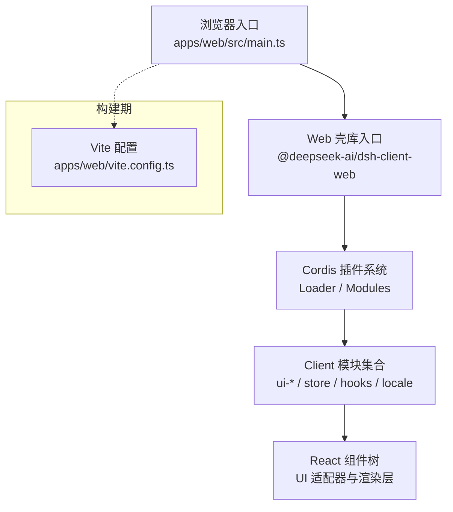
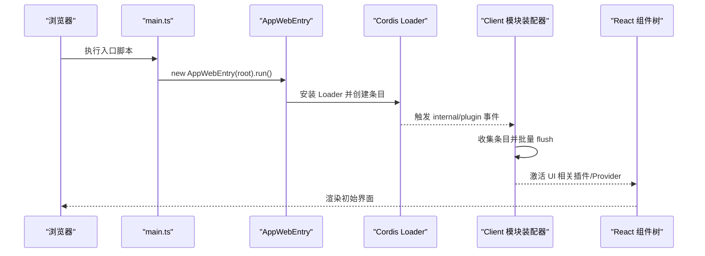
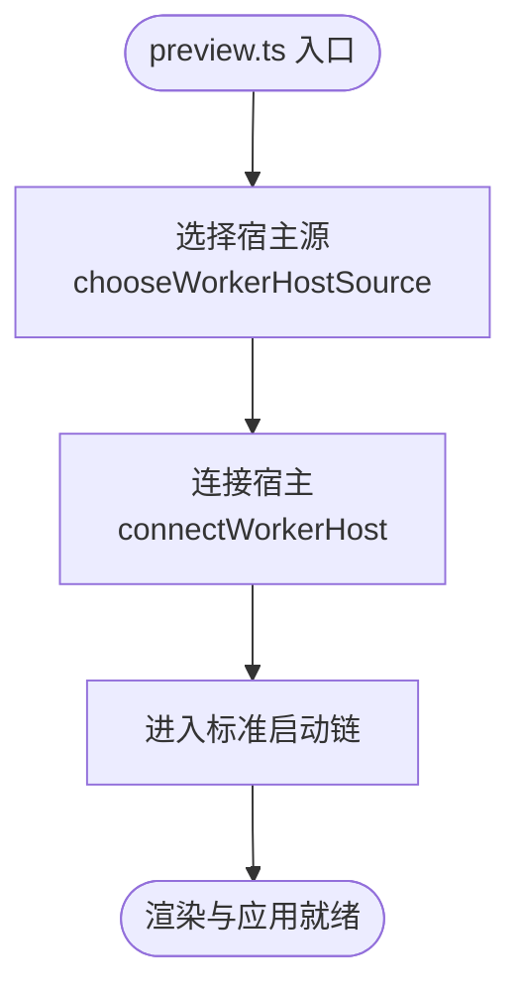
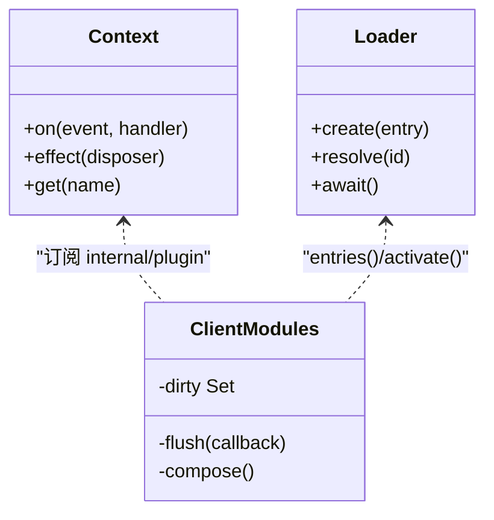
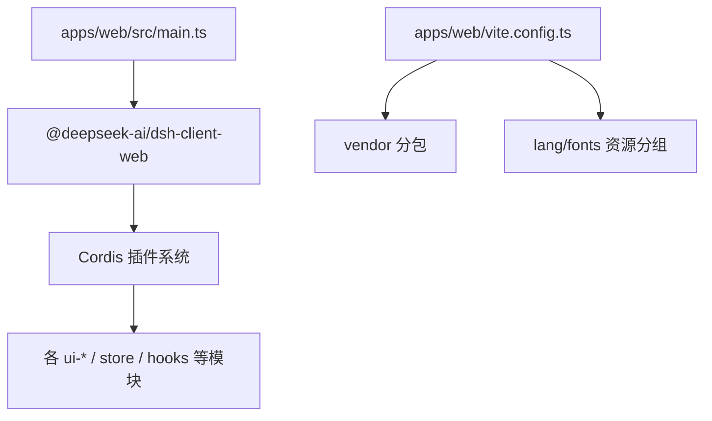

# 前端架构设计

<cite>
**本文引用的文件**
- [apps/web/src/main.ts](file://apps/web/src/main.ts)
- [apps/web/vite.config.ts](file://apps/web/vite.config.ts)
- [apps/web/package.json](file://apps/web/package.json)
- [apps/web/src/preview.ts](file://apps/web/src/preview.ts)
- [packages/client/web/src/index.ts](file://packages/client/web/src/index.ts)
- [packages/client/web/src/boot.ts](file://packages/client/web/src/boot.ts)
- [packages/client/modules/src/index.ts](file://packages/client/modules/src/index.ts)
- [docs/cordis-primer.md](file://docs/cordis-primer.md)
</cite>

## 目录
1. [简介](#简介)
2. [项目结构](#项目结构)
3. [核心组件](#核心组件)
4. [架构总览](#架构总览)
5. [详细组件分析](#详细组件分析)
6. [依赖关系分析](#依赖关系分析)
7. [性能与构建优化](#性能与构建优化)
8. [故障排查指南](#故障排查指南)
9. [结论](#结论)
10. [附录：扩展开发指南](#附录扩展开发指南)

## 简介
本文件面向 DeepSeek Harness Web 客户端的前端架构，围绕四层职责划分（Host 应用层、传输与 API 组装层、Client 模型层、UI 适配器和渲染层）进行系统化说明。重点解释 React 组件树组织方式、插件化架构与模块加载机制、状态管理策略（全局/会话/工作区）、路由导航与界面切换、组件通信模式（Cordis 服务注入与事件驱动），以及工程化最佳实践（构建、打包、性能优化）。文档同时提供可操作的扩展开发指导原则。

## 项目结构
Web 客户端以 apps/web 为浏览器入口，通过 Vite 构建并依赖 @deepseek-ai/dsh-client-web 提供的壳库；运行时由 Cordis 插件框架驱动，按清单动态加载 Client 模块，组合出完整的 UI 与业务逻辑。预览模式通过独立的 worker 引导脚本连接宿主，复用同一套产物。

图表来源
- [apps/web/src/main.ts:1-7](file://apps/web/src/main.ts#L1-L7)
- [packages/client/web/src/index.ts:1-11](file://packages/client/web/src/index.ts#L1-L11)
- [apps/web/vite.config.ts:140-195](file://apps/web/vite.config.ts#L140-L195)

章节来源
- [apps/web/src/main.ts:1-7](file://apps/web/src/main.ts#L1-L7)
- [apps/web/package.json:1-59](file://apps/web/package.json#L1-L59)
- [apps/web/vite.config.ts:1-230](file://apps/web/vite.config.ts#L1-L230)

## 核心组件
- 浏览器入口：挂载根节点并启动 AppWebEntry，完成最小初始化。
- Web 壳库：导出 AppWebEntry 及平台模块表，负责 Boot 流程、静态模块注入与页面状态投影。
- 模块系统：基于 Cordis Loader 的 Client 模块装配器，订阅插件生命周期，批量激活与刷新。
- 构建配置：Vite 多入口（index + bootstrap）、vendor 分包、语法高亮与数学公式资源分组、字体与语言包隔离、HMR 与预览页生成。

章节来源
- [apps/web/src/main.ts:1-7](file://apps/web/src/main.ts#L1-L7)
- [packages/client/web/src/index.ts:1-11](file://packages/client/web/src/index.ts#L1-L11)
- [packages/client/modules/src/index.ts:553-583](file://packages/client/modules/src/index.ts#L553-L583)
- [apps/web/vite.config.ts:140-195](file://apps/web/vite.config.ts#L140-L195)

## 架构总览
采用“四层”职责分离：
- Host 应用层：浏览器进程与宿主环境桥接，负责 Worker 握手、页面挂载、构建期常量注入。
- 传输与 API 组装层：通过 Cordis 的 Service/Event 抽象，封装网络、存储、工具调用等能力，向上暴露稳定接口。
- Client 模型层：会话、工作区、设置、计划等业务数据模型与状态机，承载领域逻辑。
- UI 适配器和渲染层：React 组件树，按 Slot/Provider 组合，消费模型层状态并通过事件与服务驱动更新。

[此图为概念性架构图，不直接映射具体源码文件]

## 详细组件分析

### 启动与模块加载序列
从浏览器入口到插件激活的关键时序如下：

图表来源
- [apps/web/src/main.ts:1-7](file://apps/web/src/main.ts#L1-L7)
- [packages/client/web/src/boot.ts:112-135](file://packages/client/web/src/boot.ts#L112-L135)
- [packages/client/modules/src/index.ts:553-583](file://packages/client/modules/src/index.ts#L553-L583)

章节来源
- [apps/web/src/main.ts:1-7](file://apps/web/src/main.ts#L1-L7)
- [packages/client/web/src/boot.ts:112-135](file://packages/client/web/src/boot.ts#L112-L135)
- [packages/client/modules/src/index.ts:553-583](file://packages/client/modules/src/index.ts#L553-L583)

### 预览模式与 Worker 握手
预览模式通过独立入口在 index.html 之前插入一个 worker 引导脚本，选择宿主源并与宿主建立连接，之后沿用标准启动链。

图表来源
- [apps/web/src/preview.ts:1-15](file://apps/web/src/preview.ts#L1-L15)

章节来源
- [apps/web/src/preview.ts:1-15](file://apps/web/src/preview.ts#L1-L15)

### 插件化与模块加载机制
- 插件即服务：每个功能以 Cordis Plugin/Service 形式存在，声明 inject 表达强依赖，通过 apply(ctx) 注册副作用（事件监听、Slot 注入、工具等）。
- 模块装配器：监听 internal/plugin 事件，维护 dirty 集合，微任务批量 flush，确保新增或变更的条目被激活。
- 页面状态投影：Boot 阶段将 Loader 的 fiber 状态映射到页面状态，便于调试与可视化。

图表来源
- [packages/client/modules/src/index.ts:553-583](file://packages/client/modules/src/index.ts#L553-L583)
- [packages/client/web/src/boot.ts:112-135](file://packages/client/web/src/boot.ts#L112-L135)
- [docs/cordis-primer.md:1-13](file://docs/cordis-primer.md#L1-L13)

章节来源
- [packages/client/modules/src/index.ts:553-583](file://packages/client/modules/src/index.ts#L553-L583)
- [packages/client/web/src/boot.ts:112-135](file://packages/client/web/src/boot.ts#L112-L135)
- [docs/cordis-primer.md:1-13](file://docs/cordis-primer.md#L1-L13)

### React 组件树与插槽机制
- 组件树由多个 ui-* 包组成，通过 Provider/Slot 组合成最终视图。
- 插槽（Slot）用于在不同位置注入可插拔的 UI 片段，实现“布局-内容”解耦。
- 主题、国际化、权限等横切关注点通过 Provider 注入，组件消费上下文而非直接依赖。

[本节为概念性说明，不直接引用具体源码文件]

### 状态管理策略
- 全局状态：由 Cordis Service 与 Store 包提供，作为跨模块共享的数据源，遵循不可变更新与事件驱动。
- 会话状态：会话级数据（消息、工具调用轨迹、计划等）以会话为单位隔离，支持折叠、压缩与回放。
- 工作区状态：工作区范围的文件、终端、搜索等状态，与工作区实例绑定，随工作区切换而切换。
- 更新流：模型层变更通过事件发布，UI 订阅后重渲染；异步操作通过 Promise/流式响应驱动进度与结果展示。

[本节为概念性说明，不直接引用具体源码文件]

### 路由导航与界面切换
- 路由由 Shell 与 UI 层共同协作：Shell 管理页面级容器与导航槽位，UI 层根据当前上下文（会话、工作区、设置）渲染对应视图。
- 切换机制：通过事件或服务状态变化触发导航，避免硬编码跳转，保证可测试性与可观测性。

[本节为概念性说明，不直接引用具体源码文件]

### 组件间通信与数据流向
- 服务注入：通过 Cordis 的 inject 声明强依赖，ctx.get 获取可选服务，统一访问边界。
- 事件驱动：使用 emit/waterfall/parallel/serial/bail 等事件类型实现单向数据流与可控传播。
- 数据流向：UI -> 事件/服务调用 -> 模型层 -> 持久化/网络 -> 事件回灌 -> UI 更新。

章节来源
- [docs/cordis-primer.md:1-13](file://docs/cordis-primer.md#L1-L13)

## 依赖关系分析
- 入口依赖：apps/web/src/main.ts 仅依赖 dsh-client-web，保持最小耦合。
- 构建依赖：Vite 配置定义 vendor 分包、语法高亮与数学公式资源分组、字体与语言包隔离，确保首屏与懒加载平衡。
- 运行依赖：Cordis 插件系统为核心，所有功能以插件形式接入，避免循环依赖与紧耦合。

图表来源
- [apps/web/src/main.ts:1-7](file://apps/web/src/main.ts#L1-L7)
- [apps/web/vite.config.ts:89-195](file://apps/web/vite.config.ts#L89-L195)

章节来源
- [apps/web/package.json:1-59](file://apps/web/package.json#L1-L59)
- [apps/web/vite.config.ts:89-195](file://apps/web/vite.config.ts#L89-L195)

## 性能与构建优化
- 首屏优化
  - 将重型渲染依赖（katex、shiki、markdown 解析管线）放入 vendor 包，减少主包体积并提升缓存命中率。
  - 将启动所需的语法高亮词法文件归入 vendor，其余按需懒加载。
  - 字体资源集中输出至 assets/fonts，避免分散请求。
- 分包策略
  - 手动分包 manualChunks：按 npm 包名精确控制，避免 React 重复实例导致 Hook/Element 身份分裂。
  - 语言包与嵌入语法共享 chunk，减少冗余。
- 目标与兼容性
  - 构建目标 es2022，满足 top-level await 等现代语法。
  - 通过 define 替换 process.* 与 CORDIS_SHARED，屏蔽 Node 内部路径，确保浏览器环境纯净。
- 预览与 HMR
  - 生成 preview.html，在 index.html 前插入 worker 引导脚本，便于离线/预览场景。
  - 拒绝 standalone serve，强制通过 dsh web 启动，保障 boot manifest 注入与 HMR 链路完整。

章节来源
- [apps/web/vite.config.ts:14-38](file://apps/web/vite.config.ts#L14-L38)
- [apps/web/vite.config.ts:89-195](file://apps/web/vite.config.ts#L89-L195)
- [apps/web/vite.config.ts:200-228](file://apps/web/vite.config.ts#L200-L228)

## 故障排查指南
- 无法独立启动 Vite 服务
  - 现象：直接使用 vite serve 报错提示非独立应用。
  - 原因：需要 boot manifest 注入，必须通过 dsh web 启动。
  - 处理：使用 pnpm dsh web 或安装后的 dsh web 命令。
- 预览模式无 worker 引导
  - 现象：preview.html 缺少引导脚本。
  - 原因：构建未生成 bootstrap 入口。
  - 处理：检查构建产物是否包含 bootstrap 入口，确认 emitPreviewPage 插件生效。
- 模块未激活或状态异常
  - 现象：页面显示 loading/failed。
  - 原因：Loader 条目未成功创建或激活失败。
  - 处理：查看 Boot 阶段的状态投影，定位 fiber.state；检查插件依赖注入是否正确。

章节来源
- [apps/web/vite.config.ts:30-38](file://apps/web/vite.config.ts#L30-L38)
- [apps/web/vite.config.ts:47-67](file://apps/web/vite.config.ts#L47-L67)
- [packages/client/web/src/boot.ts:112-135](file://packages/client/web/src/boot.ts#L112-L135)

## 结论
DeepSeek Harness Web 客户端以 Cordis 插件体系为核心，结合 Vite 精细化构建与分包策略，实现了高内聚、低耦合的前端架构。四层职责清晰，模块加载与状态管理遵循事件驱动与不可变更新原则，具备良好的可扩展性与可维护性。通过预览模式与严格的启动约束，保障了开发与生产的一致性。

## 附录：扩展开发指南
- 新增功能建议以插件形式实现，明确声明 inject 依赖，使用 ctx.effect/ctx.on 管理副作用。
- UI 扩展通过 Slot 注入，避免侵入现有布局；复杂视图拆分为独立 ui-* 包，按需加载。
- 状态变更通过事件发布，UI 订阅后更新；避免直接修改共享对象。
- 构建与打包
  - 若引入第三方重型依赖，评估是否加入 vendor 分包；确保不包含 React 以避免重复实例。
  - 使用 define 与 alias 控制浏览器环境下的行为，避免 Node 特有 API。
- 调试与验证
  - 利用 Boot 阶段的状态投影观察插件激活情况。
  - 使用预览模式快速验证 Worker 握手与宿主交互。

[本节为通用指导，不直接引用具体源码文件]