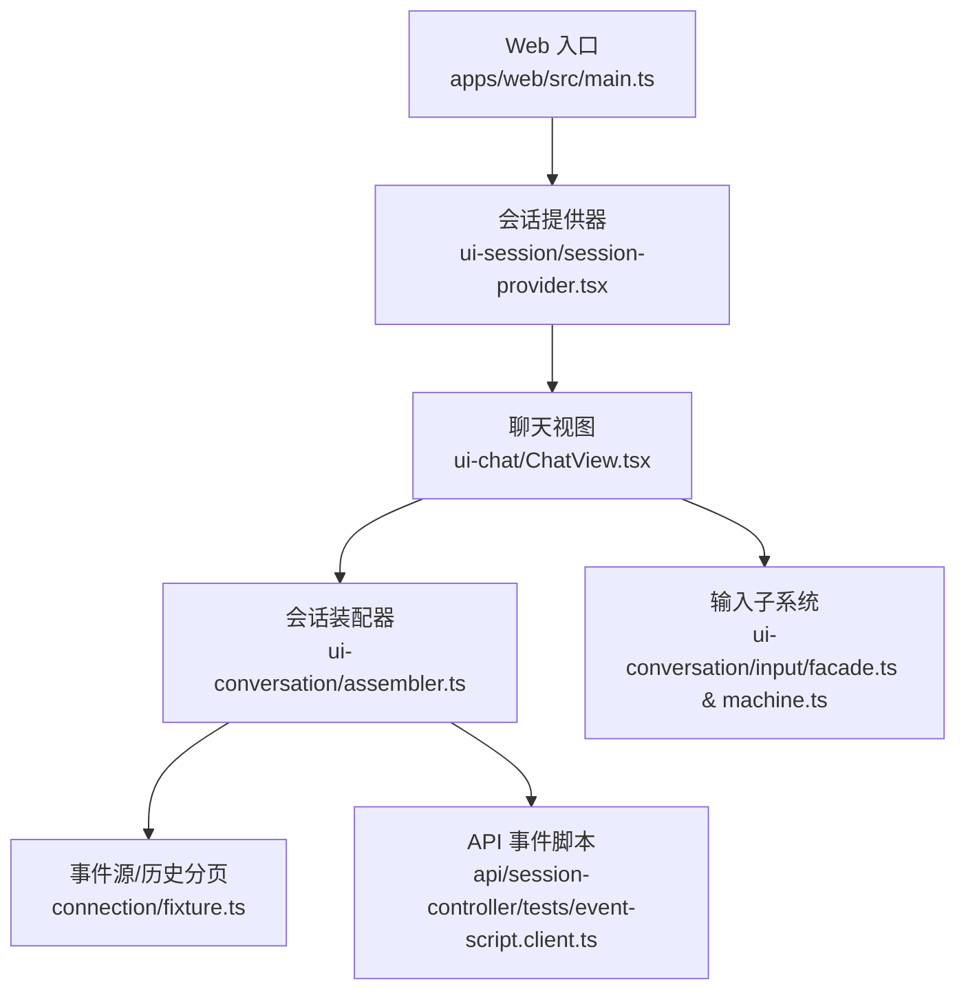
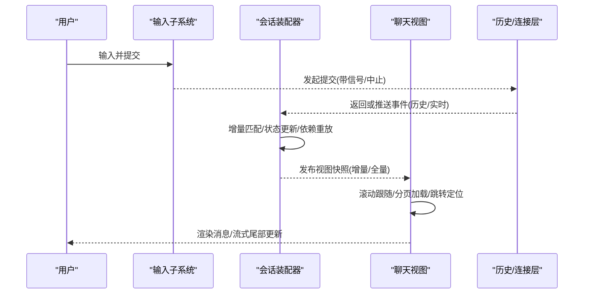
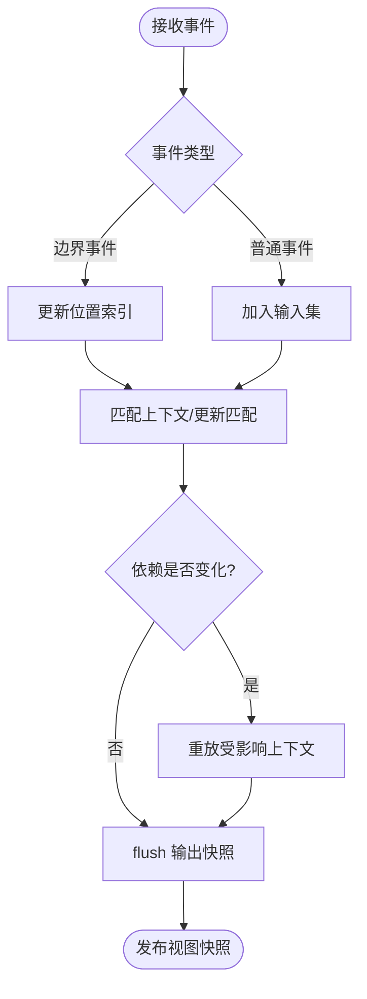
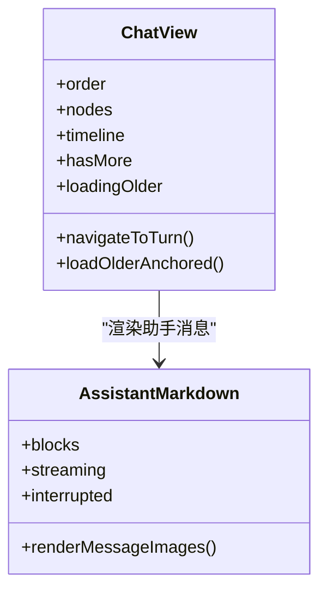
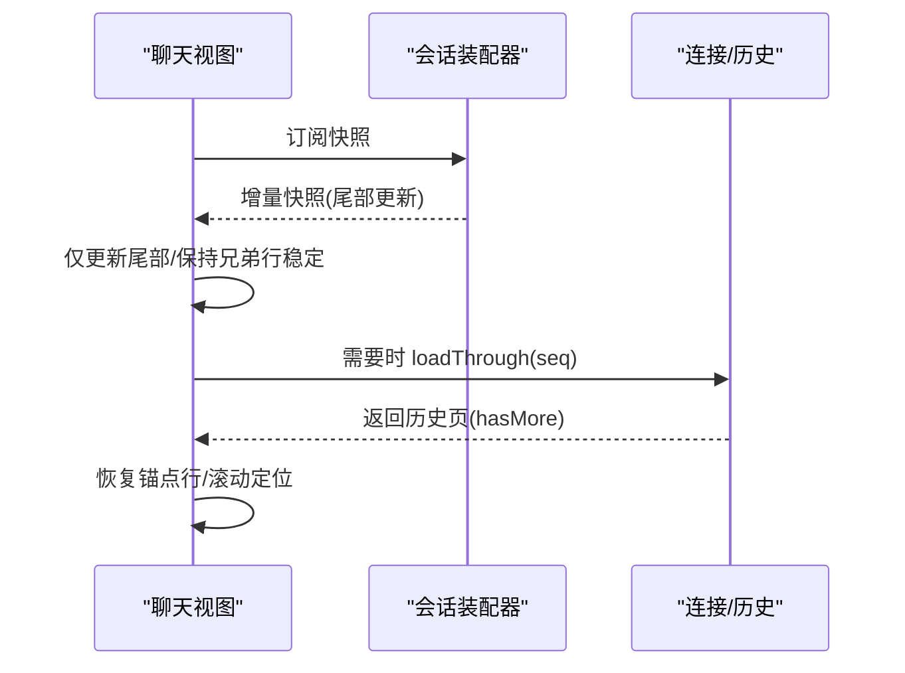
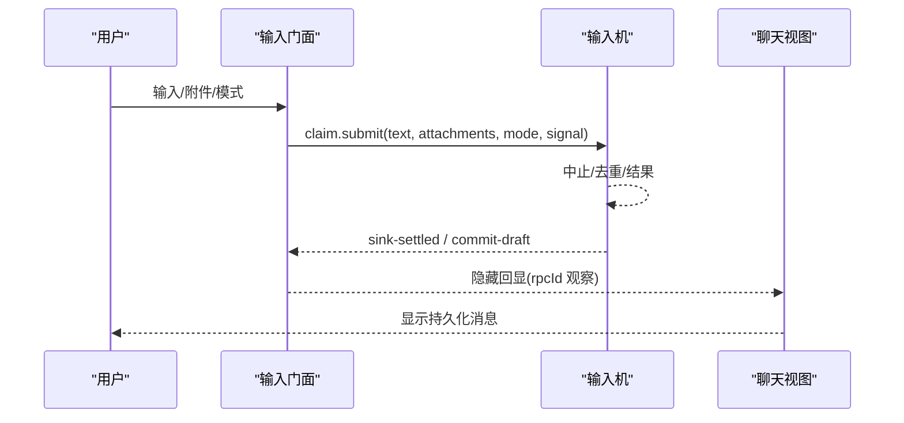
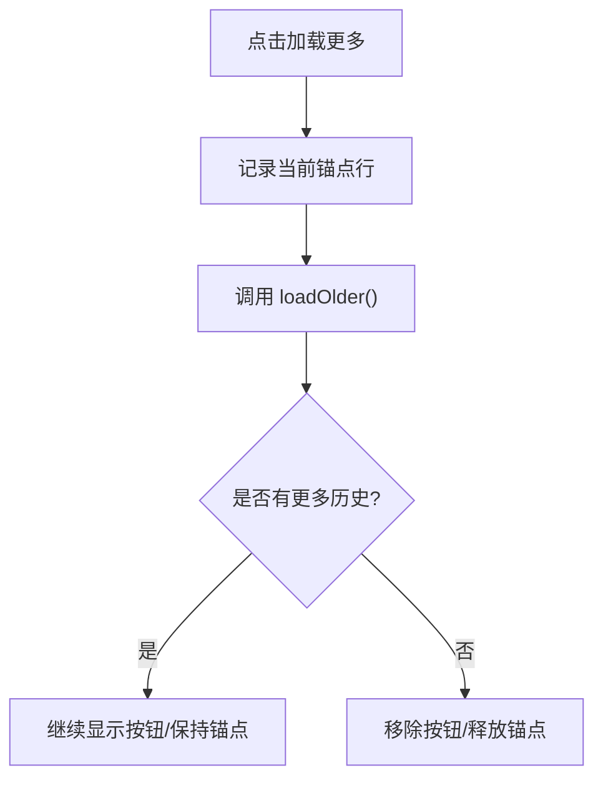
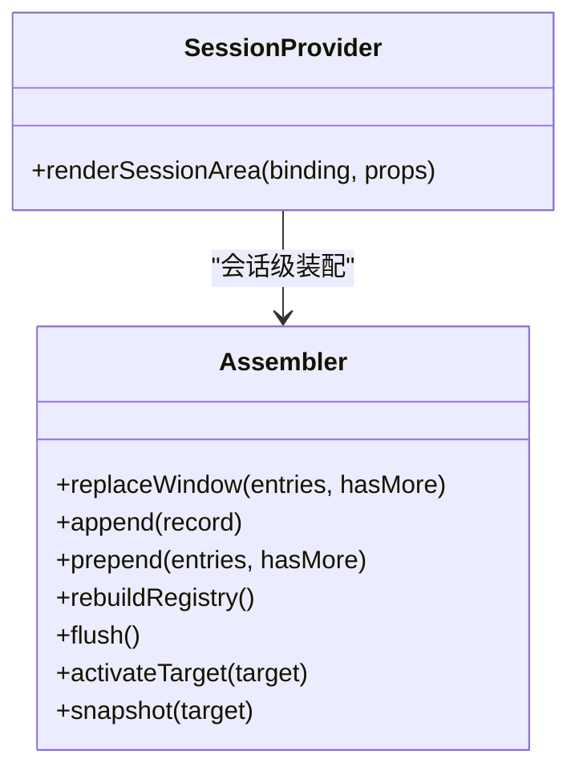
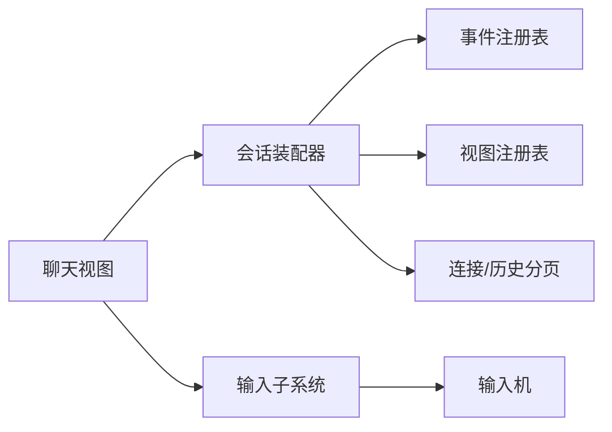

# 聊天界面实现

<cite>
**本文引用的文件**
- [apps/web/src/main.ts](file://apps/web/src/main.ts)
- [packages/client/ui-chat/src/client/chat/ChatView.tsx](file://packages/client/ui-chat/src/client/chat/ChatView.tsx)
- [packages/client/ui-chat/src/client/chat/AssistantMarkdown.tsx](file://packages/client/ui-chat/src/client/chat/AssistantMarkdown.tsx)
- [packages/client/ui-conversation/src/client/conversation/assembler.ts](file://packages/client/ui-conversation/src/client/conversation/assembler.ts)
- [packages/client/ui-session/src/client/session-provider.tsx](file://packages/client/ui-session/src/client/session-provider.tsx)
- [packages/client/connection/src/client/fixture.ts](file://packages/client/connection/src/client/fixture.ts)
- [packages/api/session-controller/tests/event-script.client.ts](file://packages/api/session-controller/tests/event-script.client.ts)
- [packages/client/ui-conversation/src/client/input/facade.ts](file://packages/client/ui-conversation/src/client/input/facade.ts)
- [packages/client/ui-conversation/src/client/input/machine.ts](file://packages/client/ui-conversation/src/client/input/machine.ts)
</cite>

## 目录
1. [简介](#简介)
2. [项目结构](#项目结构)
3. [核心组件](#核心组件)
4. [架构总览](#架构总览)
5. [详细组件分析](#详细组件分析)
6. [依赖关系分析](#依赖关系分析)
7. [性能考量](#性能考量)
8. [故障排查指南](#故障排查指南)
9. [结论](#结论)
10. [附录](#附录)

## 简介
本文件系统性说明 DeepSeek Harness 聊天界面的实现原理，覆盖会话事件模型、消息渲染引擎、流式响应实时更新、用户输入捕获与发送、历史回溯与分页加载、对话上下文管理、界面定制与主题扩展、响应式与无障碍支持、会话恢复与重连策略，以及错误处理。目标是帮助开发者快速理解并扩展聊天界面。

## 项目结构
- Web 应用入口负责挂载根节点并启动客户端应用。
- 聊天视图 ChatView 负责滚动跟随、分页加载、导航定位、流式尾部更新、提交回显隐藏等。
- 会话装配器 ConversationNodeAssembler 将事件窗口增量组装为业务上下文与视图快照，支持替换、追加、前置、重建注册表等操作。
- 会话提供器 SessionProvider 根据当前会话绑定渲染对应子树。
- 连接层 fixture 提供历史分页切分能力（按消息边界）。
- API 测试脚本定义标准轮次事件序列与历史封装。
- 输入子系统 facade/machine 负责用户输入的声明、提交、去重、中止与结果通知。

**图表来源**
- [apps/web/src/main.ts:1-7](file://apps/web/src/main.ts#L1-L7)
- [packages/client/ui-session/src/client/session-provider.tsx:1-21](file://packages/client/ui-session/src/client/session-provider.tsx#L1-L21)
- [packages/client/ui-chat/src/client/chat/ChatView.tsx:1-800](file://packages/client/ui-chat/src/client/chat/ChatView.tsx#L1-L800)
- [packages/client/ui-conversation/src/client/conversation/assembler.ts:1-800](file://packages/client/ui-conversation/src/client/conversation/assembler.ts#L1-L800)
- [packages/client/connection/src/client/fixture.ts:1492-1516](file://packages/client/connection/src/client/fixture.ts#L1492-L1516)
- [packages/api/session-controller/tests/event-script.client.ts:157-180](file://packages/api/session-controller/tests/event-script.client.ts#L157-L180)
- [packages/client/ui-conversation/src/client/input/facade.ts:43-69](file://packages/client/ui-conversation/src/client/input/facade.ts#L43-L69)
- [packages/client/ui-conversation/src/client/input/machine.ts:211-237](file://packages/client/ui-conversation/src/client/input/machine.ts#L211-L237)

**章节来源**
- [apps/web/src/main.ts:1-7](file://apps/web/src/main.ts#L1-L7)
- [packages/client/ui-session/src/client/session-provider.tsx:1-21](file://packages/client/ui-session/src/client/session-provider.tsx#L1-L21)
- [packages/client/ui-chat/src/client/chat/ChatView.tsx:1-800](file://packages/client/ui-chat/src/client/chat/ChatView.tsx#L1-L800)
- [packages/client/ui-conversation/src/client/conversation/assembler.ts:1-800](file://packages/client/ui-conversation/src/client/conversation/assembler.ts#L1-L800)
- [packages/client/connection/src/client/fixture.ts:1492-1516](file://packages/client/connection/src/client/fixture.ts#L1492-L1516)
- [packages/api/session-controller/tests/event-script.client.ts:157-180](file://packages/api/session-controller/tests/event-script.client.ts#L157-L180)
- [packages/client/ui-conversation/src/client/input/facade.ts:43-69](file://packages/client/ui-conversation/src/client/input/facade.ts#L43-L69)
- [packages/client/ui-conversation/src/client/input/machine.ts:211-237](file://packages/client/ui-conversation/src/client/input/machine.ts#L211-L237)

## 核心组件
- 聊天视图 ChatView：承担滚动跟随、分页加载、跳转定位、流式尾部增量更新、提交回显隐藏、活动轮次标记、可访问性属性设置等。
- 会话装配器 ConversationNodeAssembler：基于事件窗口维护业务上下文、位置索引、依赖图，支持 replaceWindow/append/prepend/rebuildRegistry/flush 等，产出视图快照供 UI 消费。
- 会话提供器 SessionProvider：根据当前会话绑定渲染对应会话内容，保证会话级隔离与切换。
- 输入子系统 facade/machine：统一处理用户输入、提交、中止、去重、结果通知与草稿清理。

**章节来源**
- [packages/client/ui-chat/src/client/chat/ChatView.tsx:1-800](file://packages/client/ui-chat/src/client/chat/ChatView.tsx#L1-L800)
- [packages/client/ui-conversation/src/client/conversation/assembler.ts:1-800](file://packages/client/ui-conversation/src/client/conversation/assembler.ts#L1-L800)
- [packages/client/ui-session/src/client/session-provider.tsx:1-21](file://packages/client/ui-session/src/client/session-provider.tsx#L1-L21)
- [packages/client/ui-conversation/src/client/input/facade.ts:43-69](file://packages/client/ui-conversation/src/client/input/facade.ts#L43-L69)
- [packages/client/ui-conversation/src/client/input/machine.ts:211-237](file://packages/client/ui-conversation/src/client/input/machine.ts#L211-L237)

## 架构总览
聊天界面采用“事件驱动 + 增量装配 + 视图快照”的架构：
- 事件源通过连接层以有序事件流形式提供（含历史分页与实时追加）。
- 会话装配器维护上下文与依赖，增量计算视图快照。
- 聊天视图订阅快照变化，进行高效渲染与滚动控制。
- 输入子系统将用户输入转化为提交事务，并在完成后与持久化消息对齐，避免重复显示。

**图表来源**
- [packages/client/ui-conversation/src/client/input/facade.ts:43-69](file://packages/client/ui-conversation/src/client/input/facade.ts#L43-L69)
- [packages/client/ui-conversation/src/client/input/machine.ts:211-237](file://packages/client/ui-conversation/src/client/input/machine.ts#L211-L237)
- [packages/client/ui-conversation/src/client/conversation/assembler.ts:187-377](file://packages/client/ui-conversation/src/client/conversation/assembler.ts#L187-L377)
- [packages/client/ui-chat/src/client/chat/ChatView.tsx:698-751](file://packages/client/ui-chat/src/client/chat/ChatView.tsx#L698-L751)

## 详细组件分析

### 会话事件模型与装配器
- 事件窗口：支持完整替换 replaceWindow、追加 append、前置 prepend、重建 rebuildRegistry。
- 位置索引：维护 step/turn 级别的位置数据，变更时触发即时发布。
- 上下文与依赖：每个上下文维护 start/update 匹配、状态、依赖映射；当依赖变化时重放受影响上下文。
- 视图快照：按目标激活后生成快照，支持增量 apply 与全量 replace。

**图表来源**
- [packages/client/ui-conversation/src/client/conversation/assembler.ts:187-377](file://packages/client/ui-conversation/src/client/conversation/assembler.ts#L187-L377)
- [packages/client/ui-conversation/src/client/conversation/assembler.ts:428-478](file://packages/client/ui-conversation/src/client/conversation/assembler.ts#L428-L478)
- [packages/client/ui-conversation/src/client/conversation/assembler.ts:596-689](file://packages/client/ui-conversation/src/client/conversation/assembler.ts#L596-L689)

**章节来源**
- [packages/client/ui-conversation/src/client/conversation/assembler.ts:187-377](file://packages/client/ui-conversation/src/client/conversation/assembler.ts#L187-L377)
- [packages/client/ui-conversation/src/client/conversation/assembler.ts:428-478](file://packages/client/ui-conversation/src/client/conversation/assembler.ts#L428-L478)
- [packages/client/ui-conversation/src/client/conversation/assembler.ts:596-689](file://packages/client/ui-conversation/src/client/conversation/assembler.ts#L596-L689)

### 消息渲染引擎与流式更新
- AssistantMarkdown 按块渲染文本、推理过程、图片与工具调用占位；流式模式下对尾部推理行显示运行态。
- ChatView 在流式阶段仅更新尾部，不破坏兄弟 Tool 行的稳定性；提交回显通过 rpcId 观察集隐藏，确保与持久化消息原子替换。
- 流式尾部使用 data-streaming 标记，便于样式与行为区分。

**图表来源**
- [packages/client/ui-chat/src/client/chat/ChatView.tsx:217-301](file://packages/client/ui-chat/src/client/chat/ChatView.tsx#L217-L301)
- [packages/client/ui-chat/src/client/chat/AssistantMarkdown.tsx:30-118](file://packages/client/ui-chat/src/client/chat/AssistantMarkdown.tsx#L30-L118)

**章节来源**
- [packages/client/ui-chat/src/client/chat/AssistantMarkdown.tsx:30-118](file://packages/client/ui-chat/src/client/chat/AssistantMarkdown.tsx#L30-L118)
- [packages/client/ui-chat/src/client/chat/ChatView.tsx:217-301](file://packages/client/ui-chat/src/client/chat/ChatView.tsx#L217-L301)

### 流式响应的实时更新机制
- 增量渲染：仅在尾部追加或更新，保持已渲染行的稳定 key，避免重排。
- 虚拟列表优化：通过锚点行与 flowTop 计算，结合 ResizeObserver 与滚动采样，维持阅读位置与底部跟随。
- 跳转与分页：点击导航项触发 loadThrough 加载未命中历史，期间保持读者位置，完成后着陆到目标行。

**图表来源**
- [packages/client/ui-chat/src/client/chat/ChatView.tsx:698-751](file://packages/client/ui-chat/src/client/chat/ChatView.tsx#L698-L751)
- [packages/client/ui-chat/src/client/chat/ChatView.tsx:544-610](file://packages/client/ui-chat/src/client/chat/ChatView.tsx#L544-L610)
- [packages/client/ui-chat/src/client/chat/ChatView.tsx:628-643](file://packages/client/ui-chat/src/client/chat/ChatView.tsx#L628-L643)

**章节来源**
- [packages/client/ui-chat/src/client/chat/ChatView.tsx:544-610](file://packages/client/ui-chat/src/client/chat/ChatView.tsx#L544-L610)
- [packages/client/ui-chat/src/client/chat/ChatView.tsx:628-643](file://packages/client/ui-chat/src/client/chat/ChatView.tsx#L628-L643)
- [packages/client/ui-chat/src/client/chat/ChatView.tsx:698-751](file://packages/client/ui-chat/src/client/chat/ChatView.tsx#L698-L751)

### 用户输入的捕获、处理和发送流程
- 输入门面 facade 提供会话级输入依赖注入（默认 sink、队列、弹窗等），延迟解析斜杠命令与弹出选择。
- 输入机 machine 处理提交生命周期：进行中中止、去重、结果通知、草稿清理。
- 提交后通过 rpcId 观察集在聊天视图中隐藏回显气泡，直到持久化消息出现完成原子替换。

**图表来源**
- [packages/client/ui-conversation/src/client/input/facade.ts:43-69](file://packages/client/ui-conversation/src/client/input/facade.ts#L43-L69)
- [packages/client/ui-conversation/src/client/input/machine.ts:211-237](file://packages/client/ui-conversation/src/client/input/machine.ts#L211-L237)
- [packages/client/ui-chat/src/client/chat/ChatView.tsx:139-157](file://packages/client/ui-chat/src/client/chat/ChatView.tsx#L139-L157)

**章节来源**
- [packages/client/ui-conversation/src/client/input/facade.ts:43-69](file://packages/client/ui-conversation/src/client/input/facade.ts#L43-L69)
- [packages/client/ui-conversation/src/client/input/machine.ts:211-237](file://packages/client/ui-conversation/src/client/input/machine.ts#L211-L237)
- [packages/client/ui-chat/src/client/chat/ChatView.tsx:139-157](file://packages/client/ui-chat/src/client/chat/ChatView.tsx#L139-L157)

### 历史记录管理、回溯与分页加载
- 历史分页：按消息边界从末尾向前计数，遇到 turn/start 且达到 maxMessages 即切分一页，返回 hasMore 指示更多历史。
- 回溯与跳转：点击导航项进入未加载历史时，记录读者锚点，调用 loadThrough 加载至目标 seq，完成后着陆到目标行。
- 加载更多：顶部按钮触发 loadOlder，保持读者位置，失败时保留头部不变。

**图表来源**
- [packages/client/connection/src/client/fixture.ts:1492-1516](file://packages/client/connection/src/client/fixture.ts#L1492-L1516)
- [packages/client/ui-chat/src/client/chat/ChatView.tsx:698-712](file://packages/client/ui-chat/src/client/chat/ChatView.tsx#L698-L712)

**章节来源**
- [packages/client/connection/src/client/fixture.ts:1492-1516](file://packages/client/connection/src/client/fixture.ts#L1492-L1516)
- [packages/client/ui-chat/src/client/chat/ChatView.tsx:698-712](file://packages/client/ui-chat/src/client/chat/ChatView.tsx#L698-L712)
- [packages/api/session-controller/tests/event-script.client.ts:157-180](file://packages/api/session-controller/tests/event-script.client.ts#L157-L180)

### 对话上下文管理：会话绑定、事件源订阅与状态同步
- 会话绑定：SessionProvider 根据 binding.key 渲染对应会话子树，保证会话级隔离。
- 事件源订阅：Assemble 维护 inputs、locationIndex、contextsBySeq/target/kind 等索引，增量匹配与重放。
- 状态同步：通过 flush 输出快照，UI 层按需激活目标并消费最新快照。

**图表来源**
- [packages/client/ui-session/src/client/session-provider.tsx:13-21](file://packages/client/ui-session/src/client/session-provider.tsx#L13-L21)
- [packages/client/ui-conversation/src/client/conversation/assembler.ts:187-377](file://packages/client/ui-conversation/src/client/conversation/assembler.ts#L187-L377)

**章节来源**
- [packages/client/ui-session/src/client/session-provider.tsx:13-21](file://packages/client/ui-session/src/client/session-provider.tsx#L13-L21)
- [packages/client/ui-conversation/src/client/conversation/assembler.ts:187-377](file://packages/client/ui-conversation/src/client/conversation/assembler.ts#L187-L377)

### 界面定制与主题扩展
- 插槽机制：ChatView 通过 renderSlot('conversation.message.images', ...) 暴露图片渲染插槽，便于自定义消息媒体展示。
- 消息类型扩展：AssistantMarkdown 支持 text/reasoning/image/tool-call 等块类型，未知块以 JSON 展示；可通过扩展块类型与渲染逻辑增强。
- 主题与样式：CSS 模块组织样式，data-streaming 等属性用于差异化渲染。

**章节来源**
- [packages/client/ui-chat/src/client/chat/ChatView.tsx:299-301](file://packages/client/ui-chat/src/client/chat/ChatView.tsx#L299-L301)
- [packages/client/ui-chat/src/client/chat/AssistantMarkdown.tsx:46-118](file://packages/client/ui-chat/src/client/chat/AssistantMarkdown.tsx#L46-L118)

### 响应式设计、移动端适配与无障碍访问
- 滚动与布局：ResizeObserver 监听列与 composer 高度变化，配合滚动采样与节流，保障移动端流畅体验。
- 可访问性：活动区域使用 role="status" 与 aria-live="polite" 播报运行状态；流式标记便于辅助技术识别。
- 交互反馈：停止状态、加载中提示、错误信息均提供明确文案与状态标识。

**章节来源**
- [packages/client/ui-chat/src/client/chat/ChatView.tsx:628-643](file://packages/client/ui-chat/src/client/chat/ChatView.tsx#L628-L643)
- [packages/client/ui-chat/src/client/chat/ChatView.tsx:167-200](file://packages/client/ui-chat/src/client/chat/ChatView.tsx#L167-L200)
- [packages/client/ui-chat/src/client/chat/AssistantMarkdown.tsx:110-118](file://packages/client/ui-chat/src/client/chat/AssistantMarkdown.tsx#L110-L118)

### 会话恢复、重连机制与错误处理
- 会话恢复：打开会话后根据保存的滚动位置恢复阅读位置；若为空则自动跟随到底部。
- 重连与重试：加载更早历史失败时保持头部不变，等待下一次请求；busy 状态切换后重新尝试。
- 错误处理：打开错误、文件打开失败等场景提供用户可见的错误信息与重试入口。

**章节来源**
- [packages/client/ui-chat/src/client/chat/ChatView.tsx:467-498](file://packages/client/ui-chat/src/client/chat/ChatView.tsx#L467-L498)
- [packages/client/ui-chat/src/client/chat/ChatView.tsx:645-690](file://packages/client/ui-chat/src/client/chat/ChatView.tsx#L645-L690)
- [packages/client/ui-chat/src/client/chat/ChatView.tsx:255-282](file://packages/client/ui-chat/src/client/chat/ChatView.tsx#L255-L282)

## 依赖关系分析
- 聊天视图依赖会话装配器的快照与时间线，同时依赖输入子系统提供的提交能力。
- 会话装配器依赖事件注册表与视图注册表，维护上下文与依赖图。
- 连接层提供历史分页与事件流，API 测试脚本定义标准事件序列。

**图表来源**
- [packages/client/ui-chat/src/client/chat/ChatView.tsx:217-301](file://packages/client/ui-chat/src/client/chat/ChatView.tsx#L217-L301)
- [packages/client/ui-conversation/src/client/conversation/assembler.ts:155-185](file://packages/client/ui-conversation/src/client/conversation/assembler.ts#L155-L185)
- [packages/client/ui-conversation/src/client/input/machine.ts:211-237](file://packages/client/ui-conversation/src/client/input/machine.ts#L211-L237)
- [packages/client/connection/src/client/fixture.ts:1492-1516](file://packages/client/connection/src/client/fixture.ts#L1492-L1516)

**章节来源**
- [packages/client/ui-chat/src/client/chat/ChatView.tsx:217-301](file://packages/client/ui-chat/src/client/chat/ChatView.tsx#L217-L301)
- [packages/client/ui-conversation/src/client/conversation/assembler.ts:155-185](file://packages/client/ui-conversation/src/client/conversation/assembler.ts#L155-L185)
- [packages/client/ui-conversation/src/client/input/machine.ts:211-237](file://packages/client/ui-conversation/src/client/input/machine.ts#L211-L237)
- [packages/client/connection/src/client/fixture.ts:1492-1516](file://packages/client/connection/src/client/fixture.ts#L1492-L1516)

## 性能考量
- 增量装配：仅对受影响的上下文进行重放与标记脏集合，减少全量重建。
- 视图快照：按目标激活后增量 apply，避免整棵树重绘。
- 滚动优化：使用 ResizeObserver 与滚动采样，避免频繁几何读取；锚点行与 flowTop 精确定位。
- 流式尾部：仅更新尾部，保持兄弟行稳定，降低重排成本。

[本节为通用指导，无需具体文件引用]

## 故障排查指南
- 历史加载失败：检查 hasMore 与 loadingOlder 状态，确认 loadOlder 调用链与锚点释放逻辑。
- 流式无更新：确认 assistant/live-chunk 事件是否到达装配器，检查 publication 级别与 flush 触发。
- 提交重复显示：核对 observedRpcIds 与 pendingSubmissions 过滤逻辑，确保持久化消息出现后回显被隐藏。
- 滚动错位：验证 anchorRef 与 landOnRow 逻辑，确保 prepend/jump 完成后正确着陆。

**章节来源**
- [packages/client/ui-chat/src/client/chat/ChatView.tsx:645-690](file://packages/client/ui-chat/src/client/chat/ChatView.tsx#L645-L690)
- [packages/client/ui-chat/src/client/chat/ChatView.tsx:139-157](file://packages/client/ui-chat/src/client/chat/ChatView.tsx#L139-L157)
- [packages/client/ui-chat/src/client/chat/ChatView.tsx:440-465](file://packages/client/ui-chat/src/client/chat/ChatView.tsx#L440-L465)

## 结论
DeepSeek Harness 聊天界面通过事件驱动的会话装配器与高效的视图快照机制，实现了稳定的流式渲染、精准的历史分页与跳转、健壮的输入提交流程与良好的用户体验。开发者可基于插槽与块类型扩展消息渲染，结合滚动与可访问性最佳实践，构建高性能、易定制的聊天界面。

## 附录
- 标准轮次事件：turn/start → user/message → step/start → assistant/message → step/end → turn/end。
- 历史分页切分：按消息边界从末尾计数，遇 turn/start 且达到阈值切分。

**章节来源**
- [packages/api/session-controller/tests/event-script.client.ts:157-180](file://packages/api/session-controller/tests/event-script.client.ts#L157-L180)
- [packages/client/connection/src/client/fixture.ts:1492-1516](file://packages/client/connection/src/client/fixture.ts#L1492-L1516)