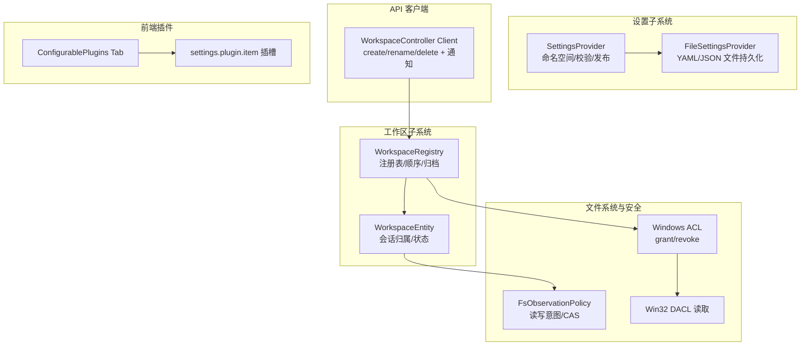
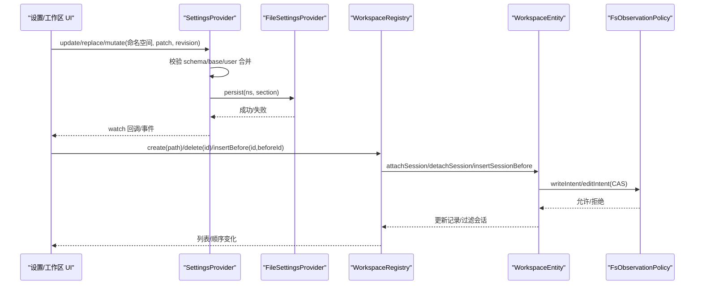
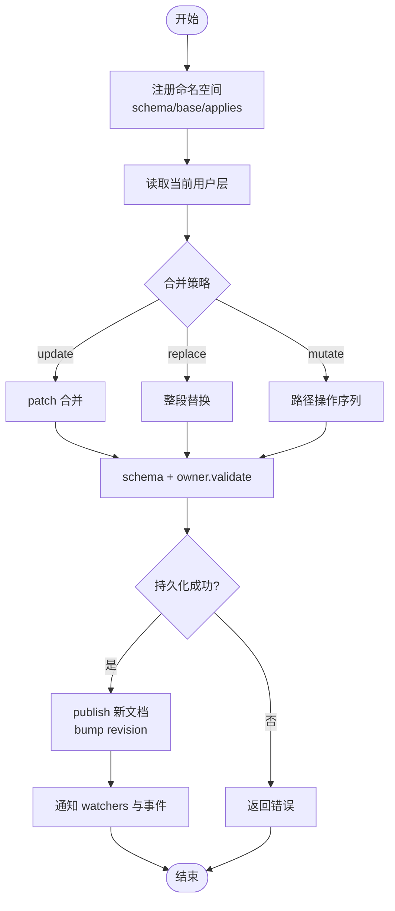
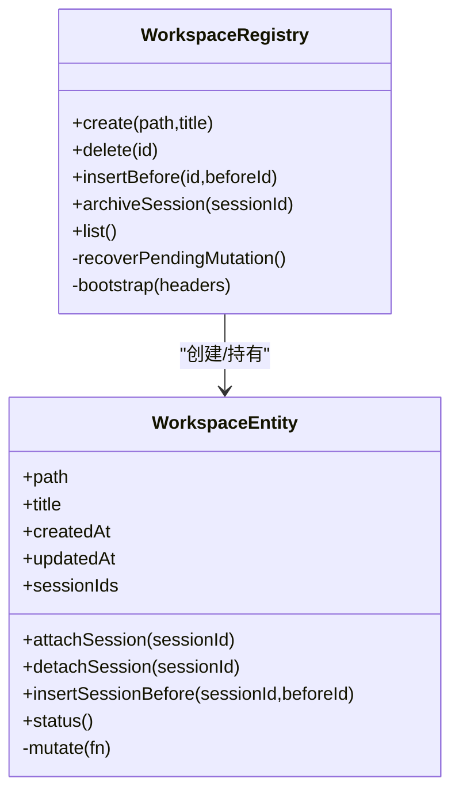
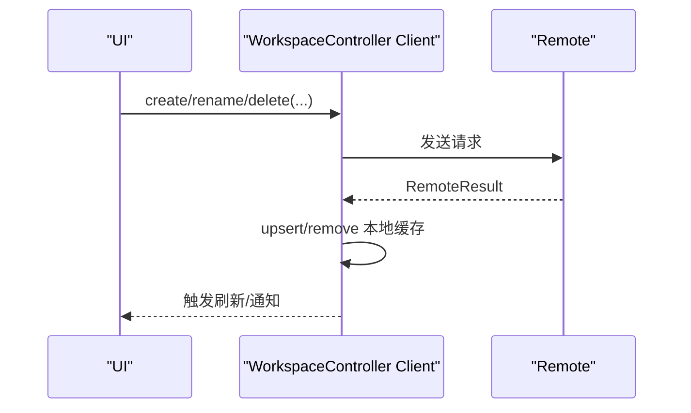
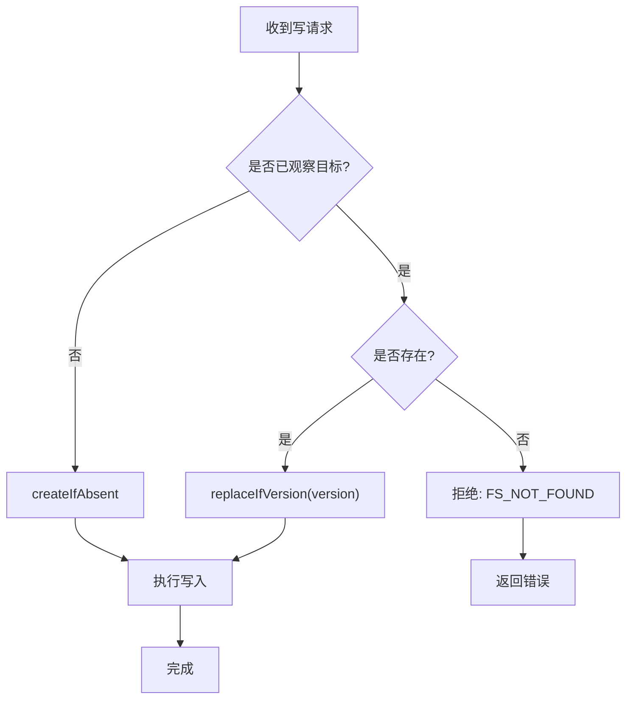
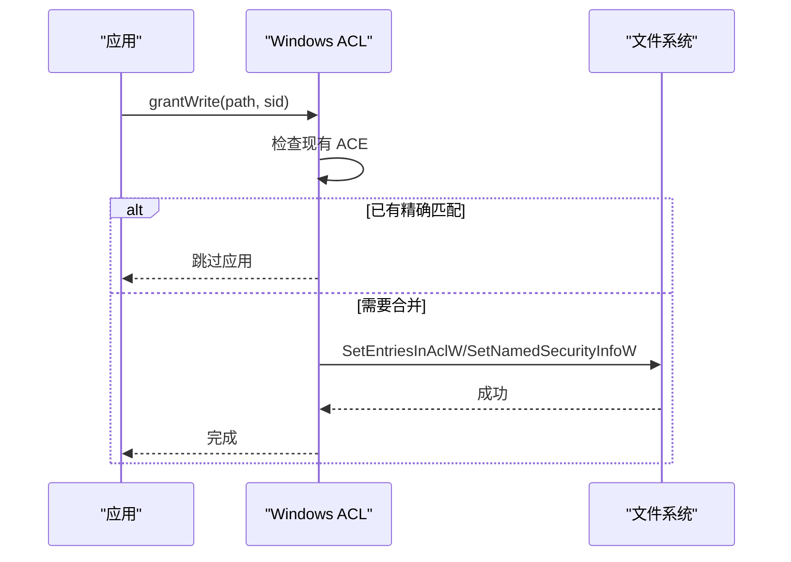
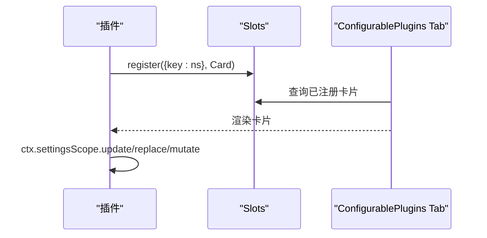
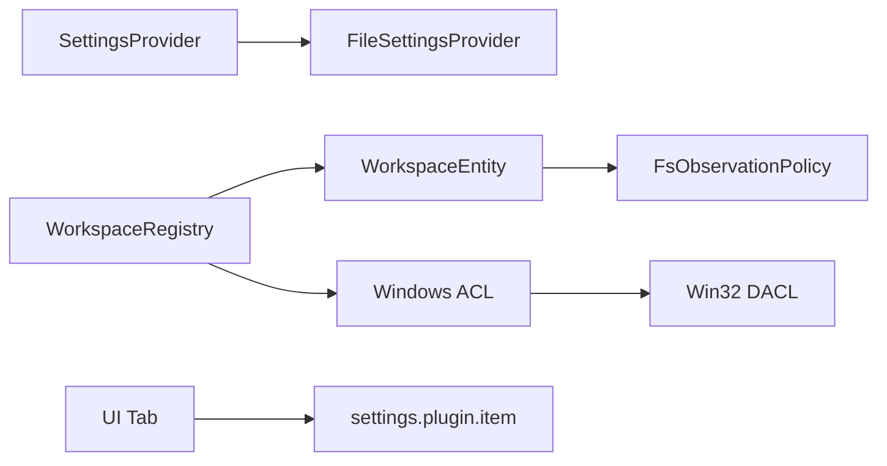

# 设置与工作区管理

<cite>
**本文引用的文件**
- [packages/settings/settings/src/index.ts](file://packages/settings/settings/src/index.ts)
- [packages/settings/settings-file/src/index.ts](file://packages/settings/settings-file/src/index.ts)
- [packages/workspace/workspace/src/index.ts](file://packages/workspace/workspace/src/index.ts)
- [packages/workspace/workspace/src/entity.ts](file://packages/workspace/workspace/src/entity.ts)
- [packages/api/workspace-controller/src/client/model.ts](file://packages/api/workspace-controller/src/client/model.ts)
- [packages/fs/fs-observation-policy/src/index.ts](file://packages/fs/fs-observation-policy/src/index.ts)
- [packages/sandbox/sandbox-windows-acl/src/acl.ts](file://packages/sandbox/sandbox-windows-acl/src/acl.ts)
- [packages/fs/fs-local/src/win32.ts](file://packages/fs/fs-local/src/win32.ts)
- [packages/client/ui-settings-plugins/src/client/tab-store.ts](file://packages/client/ui-settings-plugins/src/client/tab-store.ts)
- [packages/client/ui-settings-plugins/src/client/slot-contract.ts](file://packages/client/ui-settings-plugins/src/client/slot-contract.ts)
- [docs/cookbook/adding-a-settings-card.zh.md](file://docs/cookbook/adding-a-settings-card.zh.md)
</cite>

## 目录
1. [简介](#简介)
2. [项目结构](#项目结构)
3. [核心组件](#核心组件)
4. [架构总览](#架构总览)
5. [详细组件分析](#详细组件分析)
6. [依赖关系分析](#依赖关系分析)
7. [性能考量](#性能考量)
8. [故障排查指南](#故障排查指南)
9. [结论](#结论)
10. [附录](#附录)

## 简介
本文件系统性说明 DeepSeek Harness 的“设置”与“工作区管理”能力，覆盖：
- 设置界面设计与配置项组织（命名空间、模式、默认值、校验、动态加载）
- 工作区的文件浏览与编辑（文件系统操作、权限控制、实时同步）
- 配置的持久化存储（本地文件、远程同步、版本冲突处理）
- 工作区上下文管理与切换（多工作区、状态隔离、会话归属）
- 自定义设置卡片与扩展点（插件集成、插槽机制）
- 安全策略（权限控制、访问限制、跨进程并发与一致性）
- 搜索、索引与性能优化建议
为开发者提供从使用到扩展的完整参考。

## 项目结构
围绕设置与工作区的关键代码分布在以下模块：
- 设置服务与提供者：settings（抽象）、settings-file（YAML/JSON 文件实现）
- 工作区注册表与实体：workspace（注册表、实体、路径规范化、启动引导）
- API 客户端模型：workspace-controller（远端结果合并、通知刷新）
- 文件系统观察策略：fs-observation-policy（读写意图、CAS 版本守卫）
- 安全与权限：sandbox-windows-acl（Windows ACL 授予/撤销）、fs-local（Win32 DACL 读取）
- 前端设置插件：ui-settings-plugins（插槽、卡片注册、Tab 渲染）

图表来源
- [packages/settings/settings/src/index.ts:333-791](file://packages/settings/settings/src/index.ts#L333-L791)
- [packages/settings/settings-file/src/index.ts:106-369](file://packages/settings/settings-file/src/index.ts#L106-L369)
- [packages/workspace/workspace/src/index.ts:91-663](file://packages/workspace/workspace/src/index.ts#L91-L663)
- [packages/workspace/workspace/src/entity.ts:69-221](file://packages/workspace/workspace/src/entity.ts#L69-L221)
- [packages/api/workspace-controller/src/client/model.ts:80-112](file://packages/api/workspace-controller/src/client/model.ts#L80-L112)
- [packages/fs/fs-observation-policy/src/index.ts:56-88](file://packages/fs/fs-observation-policy/src/index.ts#L56-L88)
- [packages/sandbox/sandbox-windows-acl/src/acl.ts:215-244](file://packages/sandbox/sandbox-windows-acl/src/acl.ts#L215-L244)
- [packages/fs/fs-local/src/win32.ts:83-100](file://packages/fs/fs-local/src/win32.ts#L83-L100)
- [packages/client/ui-settings-plugins/src/client/tab-store.ts:1-15](file://packages/client/ui-settings-plugins/src/client/tab-store.ts#L1-L15)
- [packages/client/ui-settings-plugins/src/client/slot-contract.ts:1-27](file://packages/client/ui-settings-plugins/src/client/slot-contract.ts#L1-L27)

章节来源
- [packages/settings/settings/src/index.ts:333-791](file://packages/settings/settings/src/index.ts#L333-L791)
- [packages/settings/settings-file/src/index.ts:106-369](file://packages/settings/settings-file/src/index.ts#L106-L369)
- [packages/workspace/workspace/src/index.ts:91-663](file://packages/workspace/workspace/src/index.ts#L91-L663)
- [packages/workspace/workspace/src/entity.ts:69-221](file://packages/workspace/workspace/src/entity.ts#L69-L221)
- [packages/api/workspace-controller/src/client/model.ts:80-112](file://packages/api/workspace-controller/src/client/model.ts#L80-L112)
- [packages/fs/fs-observation-policy/src/index.ts:56-88](file://packages/fs/fs-observation-policy/src/index.ts#L56-L88)
- [packages/sandbox/sandbox-windows-acl/src/acl.ts:215-244](file://packages/sandbox/sandbox-windows-acl/src/acl.ts#L215-L244)
- [packages/fs/fs-local/src/win32.ts:83-100](file://packages/fs/fs-local/src/win32.ts#L83-L100)
- [packages/client/ui-settings-plugins/src/client/tab-store.ts:1-15](file://packages/client/ui-settings-plugins/src/client/tab-store.ts#L1-L15)
- [packages/client/ui-settings-plugins/src/client/slot-contract.ts:1-27](file://packages/client/ui-settings-plugins/src/client/slot-contract.ts#L1-L27)

## 核心组件
- 设置服务（SettingsProvider）
  - 命名空间注册、Schema 校验、默认值与 base 层合并、用户层覆盖
  - 变更监听、文档级事件、版本 revision 与冲突检测
  - 可插拔持久化（load/persist），支持热更新
- 文件型设置提供者（FileSettingsProvider）
  - YAML/JSON 单文档多命名空间；外部编辑热重载
  - 原子写入、文件锁、注释保留的最小差异补丁
  - 观察者防抖与就绪重入保护
- 工作区注册表（WorkspaceRegistry）
  - 启动时构建会话头索引、历史引导、持久化顺序
  - 创建/删除/移动工作区、归档会话、恢复未完成操作
  - 通过实体封装会话归属与过滤
- 工作区实体（WorkspaceEntity）
  - 标题、时间戳、会话列表维护
  - 附加/分离/插入会话前的 cwd 校验与去重
  - 统一写路径 mutate 保证 updatedAt 与成员过滤一致性
- API 客户端模型（WorkspaceController Client）
  - create/rename/delete 后即时合并本地投影并触发通知刷新
- 文件系统观察策略（FsObservationPolicy）
  - 基于“是否已观察”决定写入意图（createIfAbsent / replaceIfVersion）
  - 编辑前 CAS 版本守卫，未观察或不存在时报错
- 安全与权限
  - Windows ACL 授予/撤销写权限（最小权限原则）
  - Win32 DACL 读取用于审计与迁移
- 前端设置插件
  - 插槽 settings.plugin.item 按命名空间键分发卡片
  - Tab 仅渲染 Host 提供且被卡片声明的命名空间

章节来源
- [packages/settings/settings/src/index.ts:333-791](file://packages/settings/settings/src/index.ts#L333-L791)
- [packages/settings/settings-file/src/index.ts:106-369](file://packages/settings/settings-file/src/index.ts#L106-L369)
- [packages/workspace/workspace/src/index.ts:91-663](file://packages/workspace/workspace/src/index.ts#L91-L663)
- [packages/workspace/workspace/src/entity.ts:69-221](file://packages/workspace/workspace/src/entity.ts#L69-L221)
- [packages/api/workspace-controller/src/client/model.ts:80-112](file://packages/api/workspace-controller/src/client/model.ts#L80-L112)
- [packages/fs/fs-observation-policy/src/index.ts:56-88](file://packages/fs/fs-observation-policy/src/index.ts#L56-L88)
- [packages/sandbox/sandbox-windows-acl/src/acl.ts:215-244](file://packages/sandbox/sandbox-windows-acl/src/acl.ts#L215-L244)
- [packages/fs/fs-local/src/win32.ts:83-100](file://packages/fs/fs-local/src/win32.ts#L83-L100)
- [packages/client/ui-settings-plugins/src/client/tab-store.ts:1-15](file://packages/client/ui-settings-plugins/src/client/tab-store.ts#L1-L15)
- [packages/client/ui-settings-plugins/src/client/slot-contract.ts:1-27](file://packages/client/ui-settings-plugins/src/client/slot-contract.ts#L1-L27)

## 架构总览
设置与工作区在运行时通过 Cordis 服务注入，形成“提供者—消费者—持久化—UI”的分层：
- 设置层：命名空间 Schema 定义 → SettingsProvider 解析/校验 → FileSettingsProvider 持久化 → UI 展示与编辑
- 工作区级：WorkspaceRegistry 维护持久化顺序与会话归属 → WorkspaceEntity 执行细粒度变更 → 文件系统策略保障一致性
- 客户端：WorkspaceController Client 调用远端接口并合并本地快照，驱动 UI 刷新

图表来源
- [packages/settings/settings/src/index.ts:562-691](file://packages/settings/settings/src/index.ts#L562-L691)
- [packages/settings/settings-file/src/index.ts:185-231](file://packages/settings/settings-file/src/index.ts#L185-L231)
- [packages/workspace/workspace/src/index.ts:157-224](file://packages/workspace/workspace/src/index.ts#L157-L224)
- [packages/workspace/workspace/src/entity.ts:109-177](file://packages/workspace/workspace/src/entity.ts#L109-L177)
- [packages/fs/fs-observation-policy/src/index.ts:61-88](file://packages/fs/fs-observation-policy/src/index.ts#L61-L88)

## 详细组件分析

### 设置系统（SettingsProvider 与 FileSettingsProvider）
- 命名空间与模式
  - 命名空间需符合小写字母+连字符规范；注册时绑定 Schema、可选 base、applies（live/restart）
  - 描述接口 describe 暴露 value/base/user/secrets，供 UI 渲染表单与标记覆盖字段
- 默认值与合并
  - 最终值 = schema 默认值 + base + 用户层；undefined 条目跳过，数组整体替换
- 校验与冲突
  - 支持 owner 自定义 validate；写队列串行化，revision 冲突抛出 SettingsConflictError
- 持久化
  - FileSettingsProvider 以 YAML/JSON 单文件承载所有命名空间；外部编辑通过 chokidar 热重载
  - 写入采用文件锁+原子写，YAML 保持注释的最小差异补丁；JSON 直接替换命名空间段
- 动态加载
  - 启动即 load 并发布；watcher ready 时做一次 reconcile，避免竞态

图表来源
- [packages/settings/settings/src/index.ts:419-459](file://packages/settings/settings/src/index.ts#L419-L459)
- [packages/settings/settings/src/index.ts:562-691](file://packages/settings/settings/src/index.ts#L562-L691)
- [packages/settings/settings/src/index.ts:700-727](file://packages/settings/settings/src/index.ts#L700-L727)
- [packages/settings/settings-file/src/index.ts:171-231](file://packages/settings/settings-file/src/index.ts#L171-L231)

章节来源
- [packages/settings/settings/src/index.ts:333-791](file://packages/settings/settings/src/index.ts#L333-L791)
- [packages/settings/settings-file/src/index.ts:106-369](file://packages/settings/settings-file/src/index.ts#L106-L369)

### 工作区注册表与实体（WorkspaceRegistry / WorkspaceEntity）
- 启动与引导
  - 打开 storageDomain，重建全局状态；若未初始化则扫描 sessionPersistence 头并 bootstrap 工作区
  - 建立会话头索引（cwd→canonical path），过滤无效会话
- 工作区生命周期
  - create：校验目录存在，生成 ID 与记录，写入持久化顺序，恢复未完成操作
  - delete：移除顺序与记录，保留目录与会话日志
  - insertBefore：按锚点调整显示顺序
- 会话归属
  - attachSession：校验会话头 cwd 与 workspace path 一致，去重并前置插入
  - detachSession/insertSessionBefore：维护有序列表
- 一致性
  - 所有写操作经 enqueueOperation 串行化，并在每次执行前 recoverPendingMutation
  - 实体 mutate 统一 stamp updatedAt 并过滤不在当前 path 的会话

图表来源
- [packages/workspace/workspace/src/index.ts:91-663](file://packages/workspace/workspace/src/index.ts#L91-L663)
- [packages/workspace/workspace/src/entity.ts:69-221](file://packages/workspace/workspace/src/entity.ts#L69-L221)

章节来源
- [packages/workspace/workspace/src/index.ts:91-663](file://packages/workspace/workspace/src/index.ts#L91-L663)
- [packages/workspace/workspace/src/entity.ts:69-221](file://packages/workspace/workspace/src/entity.ts#L69-L221)

### API 客户端模型（WorkspaceController Client）
- 对 create/rename/delete 等远端操作进行本地投影合并，立即 upsert/remove 本地缓存
- 通过通知刷新机制批量提交 snapshot 变更，减少 UI 抖动

图表来源
- [packages/api/workspace-controller/src/client/model.ts:80-112](file://packages/api/workspace-controller/src/client/model.ts#L80-L112)
- [packages/api/workspace-controller/src/client/model.ts:334-359](file://packages/api/workspace-controller/src/client/model.ts#L334-L359)

章节来源
- [packages/api/workspace-controller/src/client/model.ts:80-112](file://packages/api/workspace-controller/src/client/model.ts#L80-L112)
- [packages/api/workspace-controller/src/client/model.ts:334-359](file://packages/api/workspace-controller/src/client/model.ts#L334-L359)

### 文件系统观察策略（FsObservationPolicy）
- 写意图决策
  - 未观察或确认不存在 → createIfAbsent
  - 已观察存在 → replaceIfVersion（携带 observed version）
- 编辑意图
  - 未观察 → 拒绝（FS_NOT_OBSERVED）
  - 确认不存在 → 拒绝（FS_NOT_FOUND）
  - 存在 → 返回 observed version 作为 CAS 基础

图表来源
- [packages/fs/fs-observation-policy/src/index.ts:61-88](file://packages/fs/fs-observation-policy/src/index.ts#L61-L88)

章节来源
- [packages/fs/fs-observation-policy/src/index.ts:56-88](file://packages/fs/fs-observation-policy/src/index.ts#L56-L88)

### 权限控制与安全策略
- Windows ACL
  - grantWrite 向能力 SID 授予最小写权限（含 DELETE/FILE_DELETE_CHILD），不授予 WRITE_DAC/WRITE_OWNER
  - 若已有完全匹配 ACE 则跳过应用，避免全树传播开销
- Win32 DACL 读取
  - 读取文件自相对 DACL 安全描述符，用于审计与迁移
- 工作区目录权限
  - 设置文件以 0o600 写入，目录 0o700，确保私有性

图表来源
- [packages/sandbox/sandbox-windows-acl/src/acl.ts:215-244](file://packages/sandbox/sandbox-windows-acl/src/acl.ts#L215-L244)
- [packages/fs/fs-local/src/win32.ts:83-100](file://packages/fs/fs-local/src/win32.ts#L83-L100)
- [packages/settings/settings-file/src/index.ts:215-229](file://packages/settings/settings-file/src/index.ts#L215-L229)

章节来源
- [packages/sandbox/sandbox-windows-acl/src/acl.ts:215-244](file://packages/sandbox/sandbox-windows-acl/src/acl.ts#L215-L244)
- [packages/fs/fs-local/src/win32.ts:83-100](file://packages/fs/fs-local/src/win32.ts#L83-L100)
- [packages/settings/settings-file/src/index.ts:215-229](file://packages/settings/settings-file/src/index.ts#L215-L229)

### 自定义设置卡片与扩展点
- 插槽机制
  - settings.plugin.item 为 keyed 插槽，key 为命名空间；Tab 根据 Host 提供的命名空间集合与卡片注册交集渲染
- 开发流程
  - 后端注册命名空间与 Schema；前端在 slots 中注册卡片，并通过 ctx.settingsScope 读写（带 revision 栅）
  - scope.set/unset 支持字段级增删，避免覆盖未看到的敏感字段

图表来源
- [packages/client/ui-settings-plugins/src/client/tab-store.ts:1-15](file://packages/client/ui-settings-plugins/src/client/tab-store.ts#L1-L15)
- [packages/client/ui-settings-plugins/src/client/slot-contract.ts:1-27](file://packages/client/ui-settings-plugins/src/client/slot-contract.ts#L1-L27)
- [docs/cookbook/adding-a-settings-card.zh.md:48-72](file://docs/cookbook/adding-a-settings-card.zh.md#L48-L72)

章节来源
- [packages/client/ui-settings-plugins/src/client/tab-store.ts:1-15](file://packages/client/ui-settings-plugins/src/client/tab-store.ts#L1-L15)
- [packages/client/ui-settings-plugins/src/client/slot-contract.ts:1-27](file://packages/client/ui-settings-plugins/src/client/slot-contract.ts#L1-L27)
- [docs/cookbook/adding-a-settings-card.zh.md:48-72](file://docs/cookbook/adding-a-settings-card.zh.md#L48-L72)

## 依赖关系分析
- 设置子系统
  - SettingsProvider 依赖底层 Provider 实现（如 FileSettingsProvider）
  - FileSettingsProvider 依赖 chokidar、yaml/json 解析、原子写与文件锁
- 工作区子系统
  - WorkspaceRegistry 依赖 storageDomain、sessionPersistence、sessions 服务
  - WorkspaceEntity 依赖 fs.stat、realpathNormalize 与宿主提供的表/索引
- 安全子系统
  - sandbox-windows-acl 依赖 Win32 API 绑定；fs-local 提供 DACL 读取
- 前端插件
  - ui-settings-plugins 依赖 slots、locale、remote、settingsScope

图表来源
- [packages/settings/settings/src/index.ts:333-791](file://packages/settings/settings/src/index.ts#L333-L791)
- [packages/settings/settings-file/src/index.ts:106-369](file://packages/settings/settings-file/src/index.ts#L106-L369)
- [packages/workspace/workspace/src/index.ts:91-663](file://packages/workspace/workspace/src/index.ts#L91-L663)
- [packages/workspace/workspace/src/entity.ts:69-221](file://packages/workspace/workspace/src/entity.ts#L69-L221)
- [packages/fs/fs-observation-policy/src/index.ts:56-88](file://packages/fs/fs-observation-policy/src/index.ts#L56-L88)
- [packages/sandbox/sandbox-windows-acl/src/acl.ts:215-244](file://packages/sandbox/sandbox-windows-acl/src/acl.ts#L215-L244)
- [packages/fs/fs-local/src/win32.ts:83-100](file://packages/fs/fs-local/src/win32.ts#L83-L100)
- [packages/client/ui-settings-plugins/src/client/tab-store.ts:1-15](file://packages/client/ui-settings-plugins/src/client/tab-store.ts#L1-L15)
- [packages/client/ui-settings-plugins/src/client/slot-contract.ts:1-27](file://packages/client/ui-settings-plugins/src/client/slot-contract.ts#L1-L27)

章节来源
- [packages/settings/settings/src/index.ts:333-791](file://packages/settings/settings/src/index.ts#L333-L791)
- [packages/settings/settings-file/src/index.ts:106-369](file://packages/settings/settings-file/src/index.ts#L106-L369)
- [packages/workspace/workspace/src/index.ts:91-663](file://packages/workspace/workspace/src/index.ts#L91-L663)
- [packages/workspace/workspace/src/entity.ts:69-221](file://packages/workspace/workspace/src/entity.ts#L69-L221)
- [packages/fs/fs-observation-policy/src/index.ts:56-88](file://packages/fs/fs-observation-policy/src/index.ts#L56-L88)
- [packages/sandbox/sandbox-windows-acl/src/acl.ts:215-244](file://packages/sandbox/sandbox-windows-acl/src/acl.ts#L215-L244)
- [packages/fs/fs-local/src/win32.ts:83-100](file://packages/fs/fs-local/src/win32.ts#L83-L100)
- [packages/client/ui-settings-plugins/src/client/tab-store.ts:1-15](file://packages/client/ui-settings-plugins/src/client/tab-store.ts#L1-L15)
- [packages/client/ui-settings-plugins/src/client/slot-contract.ts:1-27](file://packages/client/ui-settings-plugins/src/client/slot-contract.ts#L1-L27)

## 性能考量
- 设置
  - 写队列串行化避免竞争；watcher debounceMs 降低频繁重绘
  - YAML 注释保留的最小差异补丁减少不必要的全量重写
- 工作区
  - 启动阶段一次性构建会话头索引与排序，后续 list 无 IO
  - 实体 mutate 仅在必要时更新 updatedAt 与 sessionIds，避免空写
- 文件系统
  - FsObservationPolicy 的 CAS 版本守卫减少冲突重试
  - Windows ACL 幂等合并避免重复传播
- 客户端
  - 批量通知刷新（flush/refreshSnapshot）降低 UI 抖动

[本节为通用指导，无需特定文件引用]

## 故障排查指南
- 设置冲突
  - 现象：update/replace/mutate 抛出 SettingsConflictError
  - 原因：expectedRevision 与当前不一致
  - 处理：重新读取 descriptor 获取最新 revision 后再写
- 文件设置不可用
  - 现象：外部编辑导致解析失败或文件缺失
  - 行为：FileSettingsProvider 保留最后一份有效文档并告警
  - 处理：修复文件格式或恢复文件
- 工作区会话无法附加
  - 现象：attachSession 报错 cwd 不合法或不匹配
  - 处理：检查会话头 cwd 指向的目录是否存在且与 workspace path 一致
- 权限问题
  - 现象：Windows 下无法写入或继承权限异常
  - 处理：确认 ACL 已授予最小写权限；必要时重新运行 grantWrite
- 文件系统编辑被拒
  - 现象：editIntent 报 FS_NOT_OBSERVED 或 FS_NOT_FOUND
  - 处理：先读取文件进入观察集，再进行编辑

章节来源
- [packages/settings/settings/src/index.ts:150-173](file://packages/settings/settings/src/index.ts#L150-L173)
- [packages/settings/settings/src/index.ts:562-691](file://packages/settings/settings/src/index.ts#L562-L691)
- [packages/settings/settings-file/src/index.ts:305-339](file://packages/settings/settings-file/src/index.ts#L305-L339)
- [packages/workspace/workspace/src/entity.ts:109-149](file://packages/workspace/workspace/src/entity.ts#L109-L149)
- [packages/fs/fs-observation-policy/src/index.ts:61-88](file://packages/fs/fs-observation-policy/src/index.ts#L61-L88)
- [packages/sandbox/sandbox-windows-acl/src/acl.ts:215-244](file://packages/sandbox/sandbox-windows-acl/src/acl.ts#L215-L244)

## 结论
DeepSeek Harness 的设置与工作区管理以“命名空间 + Schema + 持久化提供者”为核心，结合“注册表 + 实体 + 会话索引”的工作区模型，实现了高内聚、可扩展、强一致的能力。通过文件锁、原子写、CAS 版本守卫与最小权限 ACL，系统在多进程与跨平台环境下具备稳健性与安全性。前端通过插槽机制将设置卡片与后端命名空间解耦，便于插件生态扩展。

[本节为总结，无需特定文件引用]

## 附录
- 常用操作速查
  - 设置
    - 注册命名空间：register(ns, schema, options)
    - 读取：get(ns)
    - 变更：update/replace/mutate(ns, payload, expectedRevision)
    - 描述：describe({ redactSecrets })
  - 工作区
    - 创建：create(path, title?)
    - 删除：delete(id)
    - 排序：insertBefore(id, beforeId?)
    - 归档：archiveSession(sessionId)
  - 文件系统
    - 读意图：writeIntent(target, actor)
    - 编辑意图：editIntent(target, actor)
  - 权限
    - 授予写权限：grantWrite(path, sid)
    - 读取 DACL：readFileDaclWin32(path)

[本节为参考信息，无需特定文件引用]