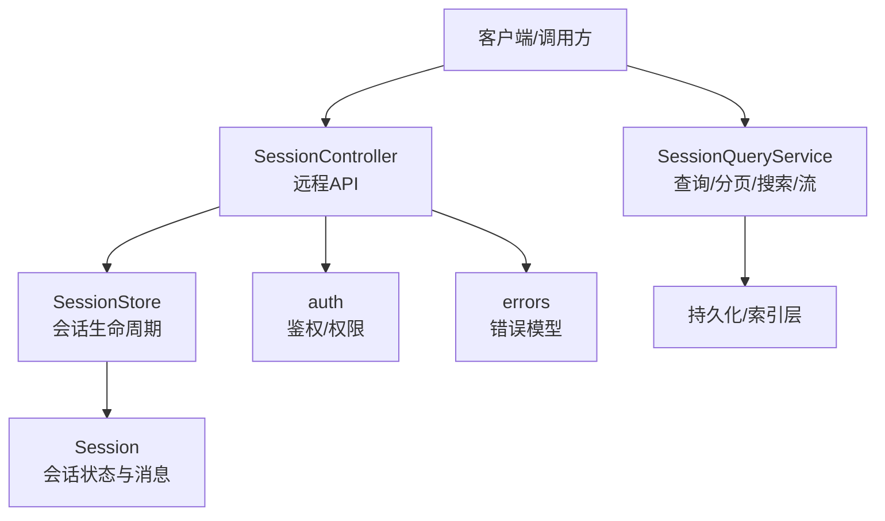
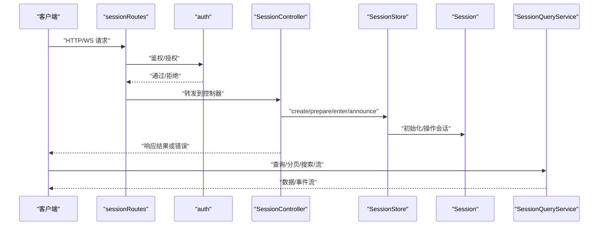
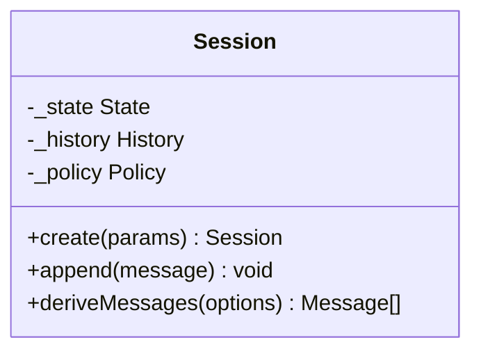
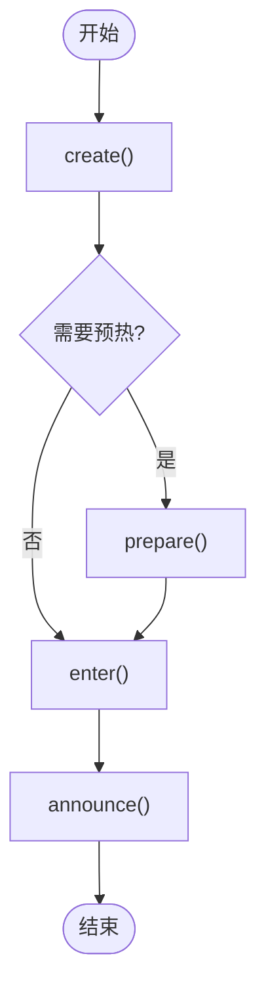
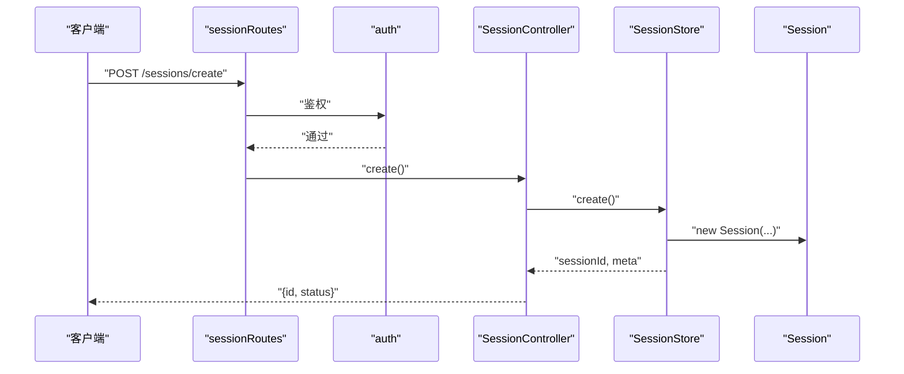
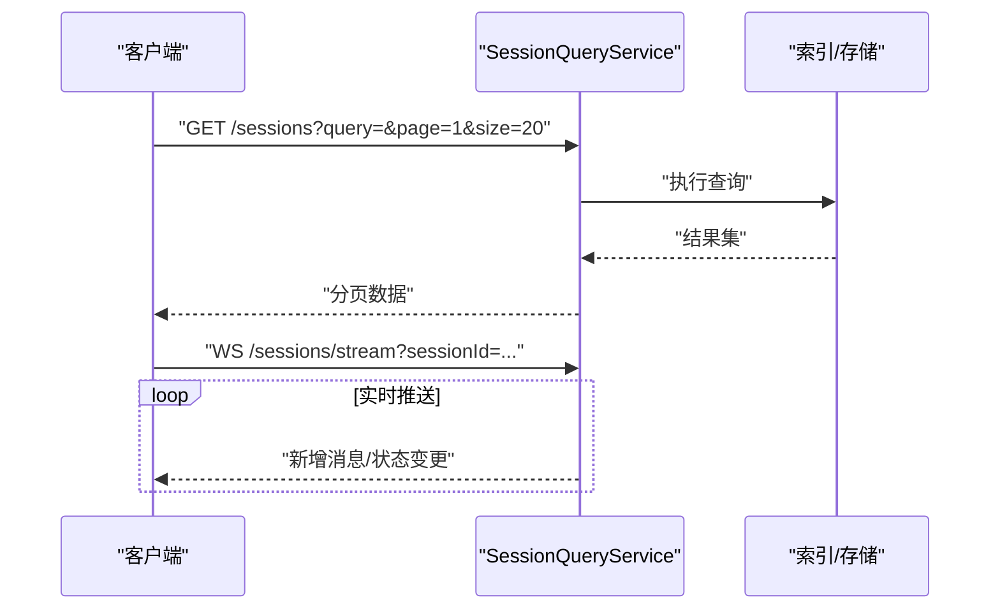
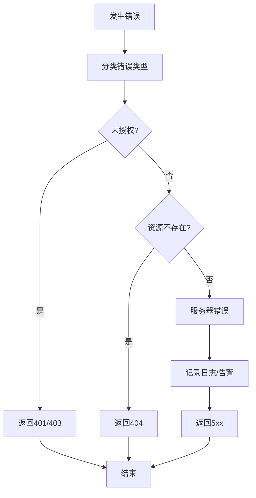
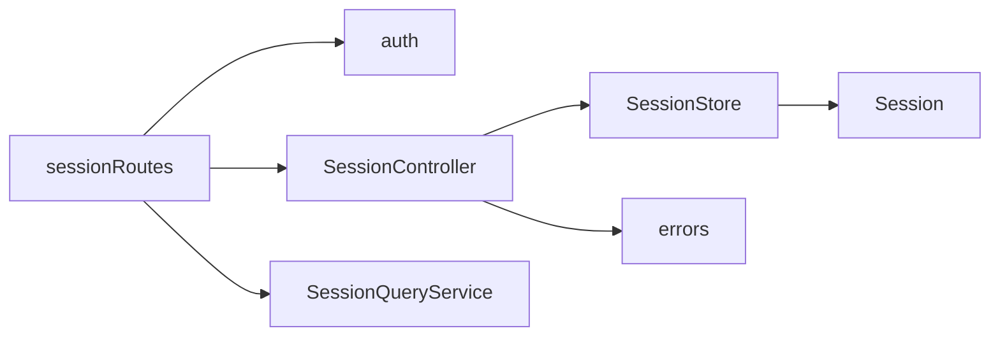

# 会话API参考

<cite>
**本文引用的文件**
- [packages/session/src/Session.ts](file://packages/session/src/Session.ts)
- [packages/session/src/SessionStore.ts](file://packages/session/src/SessionStore.ts)
- [packages/session/src/SessionController.ts](file://packages/session/src/SessionController.ts)
- [packages/session-query/src/SessionQueryService.ts](file://packages/session-query/src/SessionQueryService.ts)
- [packages/web-server/src/routes/sessionRoutes.ts](file://packages/web-server/src/routes/sessionRoutes.ts)
- [packages/core/src/errors.ts](file://packages/core/src/errors.ts)
- [packages/identity/src/auth.ts](file://packages/identity/src/auth.ts)
- [docs/subsystems/session.md](file://docs/subsystems/session.md)
- [docs/subsystems/session-query.md](file://docs/subsystems/session-query.md)
</cite>

## 目录
1. [简介](#简介)
2. [项目结构](#项目结构)
3. [核心组件](#核心组件)
4. [架构总览](#架构总览)
5. [详细组件分析](#详细组件分析)
6. [依赖分析](#依赖分析)
7. [性能考虑](#性能考虑)
8. [故障排查指南](#故障排查指南)
9. [结论](#结论)
10. [附录](#附录)

## 简介
本参考文档面向开发者，系统化说明 DeepSeek Harness 会话管理系统的 API 与集成方式。重点覆盖：
- Session 类的公共接口（创建、追加消息、派生消息等）
- SessionStore 接口的会话生命周期管理（创建、准备、进入、公告）
- SessionController 的远程 API（解析代理、检查、列表、搜索、创建、分叉）
- 会话查询 API（分页、搜索、实时跟随流）
- 错误处理模式与异常类型
- 认证授权机制与安全考量
- 集成最佳实践

## 项目结构
会话相关能力分布在多个子系统中：
- 会话核心：Session、SessionStore、SessionController
- 会话查询：SessionQueryService
- Web 路由：sessionRoutes
- 安全与身份：auth
- 错误定义：errors
- 子系统文档：session、session-query

图表来源
- [packages/session/src/SessionController.ts:1-200](file://packages/session/src/SessionController.ts#L1-L200)
- [packages/session/src/SessionStore.ts:1-200](file://packages/session/src/SessionStore.ts#L1-L200)
- [packages/session/src/Session.ts:1-200](file://packages/session/src/Session.ts#L1-L200)
- [packages/session-query/src/SessionQueryService.ts:1-200](file://packages/session-query/src/SessionQueryService.ts#L1-L200)
- [packages/web-server/src/routes/sessionRoutes.ts:1-200](file://packages/web-server/src/routes/sessionRoutes.ts#L1-L200)
- [packages/identity/src/auth.ts:1-200](file://packages/identity/src/auth.ts#L1-L200)
- [packages/core/src/errors.ts:1-200](file://packages/core/src/errors.ts#L1-L200)

章节来源
- [docs/subsystems/session.md:1-200](file://docs/subsystems/session.md#L1-L200)
- [docs/subsystems/session-query.md:1-200](file://docs/subsystems/session-query.md#L1-L200)

## 核心组件
- Session：封装会话上下文、消息历史、派生消息的能力，提供 create、append、deriveMessages 等关键方法。
- SessionStore：抽象会话生命周期管理，包括 create、prepare、enter、announce 等方法，负责会话的创建、预热、激活与广播。
- SessionController：对外暴露的远程 API 控制器，统一处理 resolveAgent、inspect、list、search、create、fork 等请求。
- SessionQueryService：提供会话查询能力，支持分页、关键词搜索、按时间范围过滤以及实时跟随流。
- sessionRoutes：将 HTTP/WebSocket 请求路由到 SessionController 和 SessionQueryService。
- auth：鉴权与授权中间件，确保调用者具备访问会话的权限。
- errors：统一的错误类型与错误码，便于上层捕获与展示。

章节来源
- [packages/session/src/Session.ts:1-200](file://packages/session/src/Session.ts#L1-L200)
- [packages/session/src/SessionStore.ts:1-200](file://packages/session/src/SessionStore.ts#L1-L200)
- [packages/session/src/SessionController.ts:1-200](file://packages/session/src/SessionController.ts#L1-L200)
- [packages/session-query/src/SessionQueryService.ts:1-200](file://packages/session-query/src/SessionQueryService.ts#L1-L200)
- [packages/web-server/src/routes/sessionRoutes.ts:1-200](file://packages/web-server/src/routes/sessionRoutes.ts#L1-L200)
- [packages/identity/src/auth.ts:1-200](file://packages/identity/src/auth.ts#L1-L200)
- [packages/core/src/errors.ts:1-200](file://packages/core/src/errors.ts#L1-L200)

## 架构总览
下图展示了从客户端到后端各层的交互关系，包括鉴权、控制器、存储、查询服务与错误处理。

图表来源
- [packages/web-server/src/routes/sessionRoutes.ts:1-200](file://packages/web-server/src/routes/sessionRoutes.ts#L1-L200)
- [packages/identity/src/auth.ts:1-200](file://packages/identity/src/auth.ts#L1-L200)
- [packages/session/src/SessionController.ts:1-200](file://packages/session/src/SessionController.ts#L1-L200)
- [packages/session/src/SessionStore.ts:1-200](file://packages/session/src/SessionStore.ts#L1-L200)
- [packages/session/src/Session.ts:1-200](file://packages/session/src/Session.ts#L1-L200)
- [packages/session-query/src/SessionQueryService.ts:1-200](file://packages/session-query/src/SessionQueryService.ts#L1-L200)

## 详细组件分析

### Session 类
Session 是会话的核心对象，承载消息历史、上下文与派生逻辑。典型能力包括：
- create：创建新会话实例，初始化必要上下文与默认配置。
- append：向会话追加消息，更新内部状态并触发必要的副作用（如持久化、事件广播）。
- deriveMessages：基于当前会话状态与策略派生出可用于 LLM 调用的消息序列。

图表来源
- [packages/session/src/Session.ts:1-200](file://packages/session/src/Session.ts#L1-L200)

使用要点
- create 应传入会话初始参数（如 agent、模型、系统提示、工具集等），返回可操作的 Session 实例。
- append 用于增量写入用户或系统消息，注意幂等性与顺序性。
- deriveMessages 支持不同策略（如压缩、裁剪、注入上下文），返回的消息序列可直接用于推理。

章节来源
- [packages/session/src/Session.ts:1-200](file://packages/session/src/Session.ts#L1-L200)
- [docs/subsystems/session.md:1-200](file://docs/subsystems/session.md#L1-L200)

### SessionStore 接口
SessionStore 负责会话的生命周期管理，提供以下方法：
- create：创建会话并落盘，返回会话标识与元信息。
- prepare：在会话进入前进行资源准备（如加载上下文、校验权限、预热缓存）。
- enter：激活会话，建立运行时上下文与资源句柄。
- announce：广播会话状态变更，通知订阅者（如 UI、审计、遥测）。

图表来源
- [packages/session/src/SessionStore.ts:1-200](file://packages/session/src/SessionStore.ts#L1-L200)

使用模式
- 创建后若需冷启动优化，先调用 prepare，再 enter。
- 每次状态变更后调用 announce，保证外部系统一致性。

章节来源
- [packages/session/src/SessionStore.ts:1-200](file://packages/session/src/SessionStore.ts#L1-L200)
- [docs/subsystems/session.md:1-200](file://docs/subsystems/session.md#L1-L200)

### SessionController 远程 API
SessionController 暴露一组 REST/WS 风格的 API，供客户端或上游服务调用：
- resolveAgent：根据输入解析目标 Agent，返回可用能力与约束。
- inspect：检查会话或 Agent 的详细信息（如配置、状态、指标）。
- list：列出会话，支持分页与筛选。
- search：按关键词/标签/时间范围搜索会话。
- create：创建新会话，返回会话 ID。
- fork：基于现有会话分叉出新会话，保留历史或选择性继承。

图表来源
- [packages/web-server/src/routes/sessionRoutes.ts:1-200](file://packages/web-server/src/routes/sessionRoutes.ts#L1-L200)
- [packages/identity/src/auth.ts:1-200](file://packages/identity/src/auth.ts#L1-L200)
- [packages/session/src/SessionController.ts:1-200](file://packages/session/src/SessionController.ts#L1-L200)
- [packages/session/src/SessionStore.ts:1-200](file://packages/session/src/SessionStore.ts#L1-L200)
- [packages/session/src/Session.ts:1-200](file://packages/session/src/Session.ts#L1-L200)

调用建议
- 所有写操作均需鉴权；读操作可按最小权限原则放行。
- 对 list/search 等重查询接口，建议结合分页与缓存。

章节来源
- [packages/session/src/SessionController.ts:1-200](file://packages/session/src/SessionController.ts#L1-L200)
- [packages/web-server/src/routes/sessionRoutes.ts:1-200](file://packages/web-server/src/routes/sessionRoutes.ts#L1-L200)
- [docs/subsystems/session.md:1-200](file://docs/subsystems/session.md#L1-L200)

### 会话查询 API（SessionQueryService）
会话查询服务提供强大的检索与流式能力：
- 分页查询：支持 page、pageSize、sortBy、order 等参数。
- 搜索功能：支持全文检索、标签匹配、时间窗口过滤。
- 实时跟随流：通过 WebSocket/SSE 推送会话最新状态或新增消息。

图表来源
- [packages/session-query/src/SessionQueryService.ts:1-200](file://packages/session-query/src/SessionQueryService.ts#L1-L200)

最佳实践
- 合理设置 pageSize，避免一次性拉取过多数据。
- 对高频搜索条件建立索引或缓存。
- 流式连接需实现断线重连与背压控制。

章节来源
- [packages/session-query/src/SessionQueryService.ts:1-200](file://packages/session-query/src/SessionQueryService.ts#L1-L200)
- [docs/subsystems/session-query.md:1-200](file://docs/subsystems/session-query.md#L1-L200)

### 错误处理模式与异常类型
系统采用统一错误模型，便于前端展示与重试策略：
- 常见错误类型：未授权、会话不存在、参数非法、资源不足、超时等。
- 错误码：区分网络层、业务层、系统层错误。
- 处理建议：
  - 客户端根据错误码决定重试、降级或提示用户。
  - 服务端记录结构化日志，包含会话 ID、操作、堆栈摘要。

图表来源
- [packages/core/src/errors.ts:1-200](file://packages/core/src/errors.ts#L1-L200)

章节来源
- [packages/core/src/errors.ts:1-200](file://packages/core/src/errors.ts#L1-L200)

### 认证授权机制与安全考虑
- 鉴权：所有写操作必须携带有效凭证（如 JWT、OAuth Token），由 auth 中间件校验。
- 授权：基于角色/资源粒度控制，确保调用者仅能访问其有权的会话。
- 安全建议：
  - 传输层强制 HTTPS/TLS。
  - 敏感字段脱敏输出。
  - 限制请求频率与大小，防止滥用。
  - 会话隔离：多租户场景下严格隔离上下文与数据。

章节来源
- [packages/identity/src/auth.ts:1-200](file://packages/identity/src/auth.ts#L1-L200)
- [packages/web-server/src/routes/sessionRoutes.ts:1-200](file://packages/web-server/src/routes/sessionRoutes.ts#L1-L200)

## 依赖分析
组件间依赖关系如下：
- SessionController 依赖 SessionStore、auth、errors。
- SessionStore 依赖 Session、持久化与事件总线。
- SessionQueryService 依赖索引/存储与事件流。
- sessionRoutes 作为入口，协调 auth、控制器与服务。

图表来源
- [packages/web-server/src/routes/sessionRoutes.ts:1-200](file://packages/web-server/src/routes/sessionRoutes.ts#L1-L200)
- [packages/identity/src/auth.ts:1-200](file://packages/identity/src/auth.ts#L1-L200)
- [packages/session/src/SessionController.ts:1-200](file://packages/session/src/SessionController.ts#L1-L200)
- [packages/session/src/SessionStore.ts:1-200](file://packages/session/src/SessionStore.ts#L1-L200)
- [packages/session/src/Session.ts:1-200](file://packages/session/src/Session.ts#L1-L200)
- [packages/session-query/src/SessionQueryService.ts:1-200](file://packages/session-query/src/SessionQueryService.ts#L1-L200)
- [packages/core/src/errors.ts:1-200](file://packages/core/src/errors.ts#L1-L200)

章节来源
- [packages/session/src/SessionController.ts:1-200](file://packages/session/src/SessionController.ts#L1-L200)
- [packages/session/src/SessionStore.ts:1-200](file://packages/session/src/SessionStore.ts#L1-L200)
- [packages/session/src/Session.ts:1-200](file://packages/session/src/Session.ts#L1-L200)
- [packages/session-query/src/SessionQueryService.ts:1-200](file://packages/session-query/src/SessionQueryService.ts#L1-L200)
- [packages/web-server/src/routes/sessionRoutes.ts:1-200](file://packages/web-server/src/routes/sessionRoutes.ts#L1-L200)
- [packages/identity/src/auth.ts:1-200](file://packages/identity/src/auth.ts#L1-L200)
- [packages/core/src/errors.ts:1-200](file://packages/core/src/errors.ts#L1-L200)

## 性能考虑
- 会话消息压缩：在 deriveMessages 中启用压缩策略，减少上下文体积。
- 查询优化：为常用查询字段建立索引，合理使用分页与排序。
- 流式传输：对长连接实施背压与心跳检测，避免内存泄漏。
- 缓存策略：对热点会话元数据与搜索结果进行短期缓存。
- 资源隔离：高并发场景下限制单会话资源占用，防止雪崩。

## 故障排查指南
- 常见问题定位：
  - 鉴权失败：检查 token 有效性、权限范围与租户隔离。
  - 会话不存在：核对 sessionId 与生命周期状态。
  - 查询超时：检查索引健康度与查询复杂度。
  - 流中断：检查网络稳定性与重连逻辑。
- 诊断手段：
  - 查看结构化日志（含会话 ID、操作、错误码）。
  - 使用 inspect 接口获取会话快照与指标。
  - 通过搜索与分页缩小问题范围。

章节来源
- [packages/core/src/errors.ts:1-200](file://packages/core/src/errors.ts#L1-L200)
- [packages/session/src/SessionController.ts:1-200](file://packages/session/src/SessionController.ts#L1-L200)
- [packages/session-query/src/SessionQueryService.ts:1-200](file://packages/session-query/src/SessionQueryService.ts#L1-L200)

## 结论
本参考文档梳理了 DeepSeek Harness 会话管理系统的核心 API 与集成要点。通过 Session、SessionStore、SessionController、SessionQueryService 的协同工作，系统提供了完整的会话创建、管理、查询与流式能力。结合统一的错误模型与鉴权机制，开发者可以构建稳定、安全、高性能的会话应用。

## 附录
- 术语表：会话、消息、派生消息、分叉、流式推送等。
- 示例路径：
  - 会话创建流程：[packages/session/src/SessionController.ts:1-200](file://packages/session/src/SessionController.ts#L1-L200)
  - 会话查询与流：[packages/session-query/src/SessionQueryService.ts:1-200](file://packages/session-query/src/SessionQueryService.ts#L1-L200)
  - 鉴权中间件：[packages/identity/src/auth.ts:1-200](file://packages/identity/src/auth.ts#L1-L200)
  - 错误类型定义：[packages/core/src/errors.ts:1-200](file://packages/core/src/errors.ts#L1-L200)