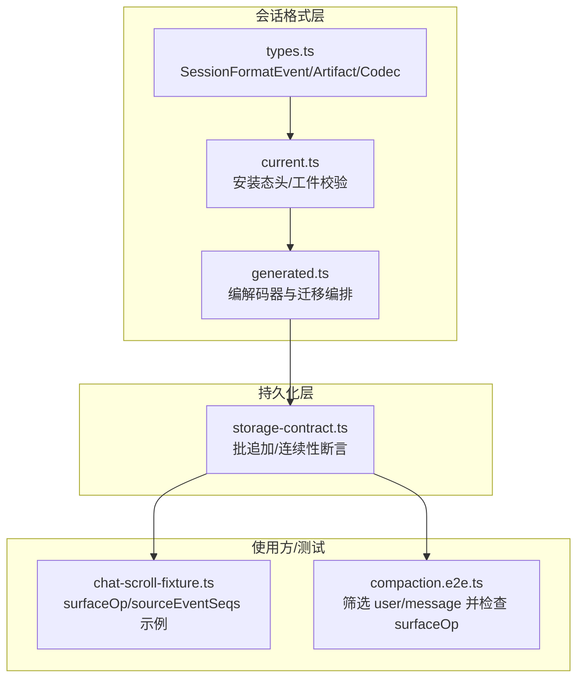
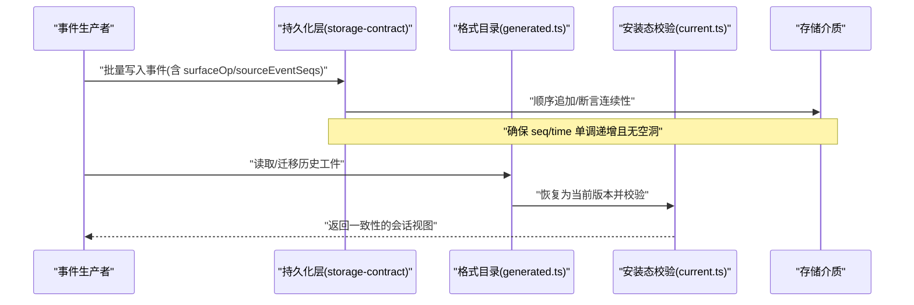
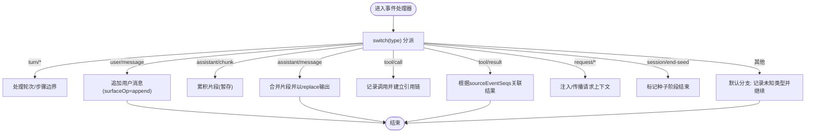
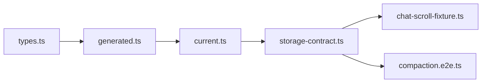

# 会话事件模型

<cite>
**本文引用的文件**
- [packages/session/session-format/src/types.ts](file://packages/session/session-format/src/types.ts)
- [packages/session/session-format-catalog/src/current.ts](file://packages/session/session-format-catalog/src/current.ts)
- [packages/session/session-format-catalog/src/generated.ts](file://packages/session/session-format-catalog/src/generated.ts)
- [packages/session/session-persistence/src/storage-contract.ts](file://packages/session/session-persistence/src/storage-contract.ts)
- [apps/web/tests/chat-scroll-fixture.ts](file://apps/web/tests/chat-scroll-fixture.ts)
- [apps/cli/tests/profiles/headless/tests/compaction.e2e.ts](file://apps/cli/tests/profiles/headless/tests/compaction.e2e.ts)
</cite>

## 目录
1. [简介](#简介)
2. [项目结构](#项目结构)
3. [核心组件](#核心组件)
4. [架构总览](#架构总览)
5. [详细组件分析](#详细组件分析)
6. [依赖关系分析](#依赖关系分析)
7. [性能考量](#性能考量)
8. [故障排查指南](#故障排查指南)
9. [结论](#结论)
10. [附录](#附录)

## 简介
本文件系统性说明 DeepSeek Harness 的“会话事件模型”的设计与实现，聚焦以下要点：
- SessionEvent 的统一格式：seq、time、type、data 的语义与约束。
- 12 种核心事件类型的用途与数据结构：turn/start、turn/end、step/start、step/end、user/message、assistant/chunk、assistant/message、tool/call、tool/result、request/header、request/context、session/end-seed。
- SurfaceEventType 的概念及三类消息产生事件（user/message、assistant/message、tool/result）的特殊处理。
- sourceEventSeqs 引用链的作用与 surfaceOp 的操作语义（append vs replace）。
- 事件处理的代码示例与最佳实践，展示如何用 switch 正确处理可合并扩展的事件类型。

## 项目结构
围绕会话事件模型的代码主要分布在 session-format、session-format-catalog、session-persistence 以及若干测试用例中：
- session-format：定义持久化边界上的通用逻辑结构与编码/解码契约。
- session-format-catalog：组装当前版本编解码器、迁移链与安装态校验。
- session-persistence：提供事件批写入、连续性断言等存储契约能力。
- 测试用例：通过真实事件序列演示 surfaceOp、sourceEventSeqs 的使用方式。

图表来源
- [packages/session/session-format/src/types.ts:15-34](file://packages/session/session-format/src/types.ts#L15-L34)
- [packages/session/session-format-catalog/src/current.ts:17-48](file://packages/session/session-format-catalog/src/current.ts#L17-L48)
- [packages/session/session-format-catalog/src/generated.ts:12-28](file://packages/session/session-format-catalog/src/generated.ts#L12-L28)
- [packages/session/session-persistence/src/storage-contract.ts:131-145](file://packages/session/session-persistence/src/storage-contract.ts#L131-L145)
- [apps/web/tests/chat-scroll-fixture.ts:90-197](file://apps/web/tests/chat-scroll-fixture.ts#L90-L197)
- [apps/cli/tests/profiles/headless/tests/compaction.e2e.ts:72-73](file://apps/cli/tests/profiles/headless/tests/compaction.e2e.ts#L72-L73)

章节来源
- [packages/session/session-format/src/types.ts:15-34](file://packages/session/session-format/src/types.ts#L15-L34)
- [packages/session/session-format-catalog/src/current.ts:17-48](file://packages/session/session-format-catalog/src/current.ts#L17-L48)
- [packages/session/session-format-catalog/src/generated.ts:12-28](file://packages/session/session-format-catalog/src/generated.ts#L12-L28)
- [packages/session/session-persistence/src/storage-contract.ts:131-145](file://packages/session/session-persistence/src/storage-contract.ts#L131-L145)

## 核心组件
- 统一事件信封：所有事件在持久化边界上以统一信封形式存在，包含 type、seq、time、data。
- 编解码与迁移：通过 catalog 将历史版本工件迁移到当前版本，并在安装态进行严格校验。
- 存储契约：提供批追加与连续性断言，保证事件日志的有序性与完整性。
- 表面操作与引用链：三类消息产生事件携带 surfaceOp 与 sourceEventSeqs，用于 UI 投影与增量更新。

章节来源
- [packages/session/session-format/src/types.ts:15-34](file://packages/session/session-format/src/types.ts#L15-L34)
- [packages/session/session-format-catalog/src/current.ts:17-48](file://packages/session/session-format-catalog/src/current.ts#L17-L48)
- [packages/session/session-format-catalog/src/generated.ts:12-28](file://packages/session/session-format-catalog/src/generated.ts#L12-L28)
- [packages/session/session-persistence/src/storage-contract.ts:131-145](file://packages/session/session-persistence/src/storage-contract.ts#L131-L145)

## 架构总览
下图展示了从事件生成到持久化、再到恢复与校验的整体流程，体现统一信封、迁移链与安装态校验的关键环节。

图表来源
- [packages/session/session-persistence/src/storage-contract.ts:131-145](file://packages/session/session-persistence/src/storage-contract.ts#L131-L145)
- [packages/session/session-format-catalog/src/generated.ts:12-28](file://packages/session/session-format-catalog/src/generated.ts#L12-L28)
- [packages/session/session-format-catalog/src/current.ts:17-48](file://packages/session/session-format-catalog/src/current.ts#L17-L48)

## 详细组件分析

### 统一事件信封与字段语义
- type：字符串标识事件类别，如 turn/start、assistant/message 等。
- seq：全局单调递增序号，用于排序与定位。
- time：事件发生时间戳，通常随 seq 单调增长。
- data：事件载荷，具体结构由 type 决定。

该信封是跨版本、跨模块的通用表示，便于迁移与校验。

章节来源
- [packages/session/session-format/src/types.ts:15-34](file://packages/session/session-format/src/types.ts#L15-L34)

### 12 种核心事件类型与用途
以下为常见核心事件类型及其典型职责（按生命周期分组）：
- 轮次管理
  - turn/start：开启一轮对话（用户输入或系统触发）。
  - turn/end：结束一轮对话，汇总本轮结果。
- 步骤管理
  - step/start：开始一个执行步骤（如工具调用、子代理执行）。
  - step/end：步骤完成，产出结果或错误。
- 用户与助手消息
  - user/message：用户发送的消息，常携带 surfaceOp='append'。
  - assistant/chunk：助手的流式片段，逐步累积成完整消息。
  - assistant/message：完整的助手回复，可能由多个 chunk 合并而成。
- 工具调用
  - tool/call：发起工具调用请求。
  - tool/result：工具执行结果，可能带 surfaceOp='append'。
- 请求上下文
  - request/header：请求头部信息（模型、参数等）。
  - request/context：请求上下文（工作区、权限等）。
- 会话生命周期
  - session/end-seed：会话种子结束标记，用于区分种子阶段与后续交互。

这些事件共同构成一次会话的完整轨迹，供上层投影、查询与回放使用。

[本节为概念性说明，不直接分析具体文件]

### SurfaceEventType 与三类消息产生事件
- 概念：SurfaceEventType 描述“会出现在界面/投影中的事件类型”。并非所有事件都产生表面输出。
- 三类消息产生事件：
  - user/message：用户消息，通常 surfaceOp='append'。
  - assistant/message：助手消息，可能由多个 assistant/chunk 合并后以 append 或 replace 方式呈现。
  - tool/result：工具结果，可能作为独立行或嵌入消息内容呈现。
- 特殊处理：
  - 对这三类事件，系统会维护 surfaceOp 与 sourceEventSeqs，以便 UI 做增量更新与溯源。

章节来源
- [apps/cli/tests/profiles/headless/tests/compaction.e2e.ts:72-73](file://apps/cli/tests/profiles/headless/tests/compaction.e2e.ts#L72-L73)

### sourceEventSeqs 引用链与 surfaceOp 语义
- sourceEventSeqs：记录当前事件由哪些源事件派生而来，形成引用链，支持回溯与合并。
- surfaceOp：
  - append：追加到现有位置，常用于新增消息或结果。
  - replace：替换已有位置的内容，常用于修正或合并后的最终呈现。
- 典型用法：
  - assistant/message 可由多个 assistant/chunk 合并，最终以 replace 覆盖之前的占位或中间状态。
  - user/message 与 tool/result 多为 append，保持时序追加。

章节来源
- [apps/web/tests/chat-scroll-fixture.ts:90-197](file://apps/web/tests/chat-scroll-fixture.ts#L90-L197)
- [apps/cli/tests/profiles/headless/tests/compaction.e2e.ts:72-73](file://apps/cli/tests/profiles/headless/tests/compaction.e2e.ts#L72-L73)

### 事件处理流程与最佳实践
- 建议采用 switch(type) 分派处理，对可合并扩展的类型预留 default 分支，避免遗漏新类型。
- 对三类消息产生事件，需结合 surfaceOp 与 sourceEventSeqs 进行增量更新与溯源。
- 对 assistant/chunk 与 assistant/message 的合并策略：
  - 先以 append 接收 chunk，再在 message 级别以 replace 合并输出。
- 对 tool/call 与 tool/result 的配对：
  - 使用 sourceEventSeqs 建立调用与结果的关联，便于调试与审计。

[本图为概念流程图，不直接映射具体源码文件]

### 持久化与安装态校验
- 批追加与连续性断言：确保事件按 seq 顺序写入，无空洞与重复。
- 安装态校验：在恢复会话时，验证头信息与事件是否符合当前版本规范。

章节来源
- [packages/session/session-persistence/src/storage-contract.ts:131-145](file://packages/session/session-persistence/src/storage-contract.ts#L131-L145)
- [packages/session/session-format-catalog/src/current.ts:17-48](file://packages/session/session-format-catalog/src/current.ts#L17-L48)

## 依赖关系分析
- session-format 提供通用的事件信封与编解码契约。
- session-format-catalog 组合各版本编解码器与迁移链，并在安装态进行校验。
- session-persistence 提供底层写入与一致性保障。
- 测试用例演示了 surfaceOp 与 sourceEventSeqs 的实际使用。

图表来源
- [packages/session/session-format/src/types.ts:15-34](file://packages/session/session-format/src/types.ts#L15-L34)
- [packages/session/session-format-catalog/src/generated.ts:12-28](file://packages/session/session-format-catalog/src/generated.ts#L12-L28)
- [packages/session/session-format-catalog/src/current.ts:17-48](file://packages/session/session-format-catalog/src/current.ts#L17-L48)
- [packages/session/session-persistence/src/storage-contract.ts:131-145](file://packages/session/session-persistence/src/storage-contract.ts#L131-L145)
- [apps/web/tests/chat-scroll-fixture.ts:90-197](file://apps/web/tests/chat-scroll-fixture.ts#L90-L197)
- [apps/cli/tests/profiles/headless/tests/compaction.e2e.ts:72-73](file://apps/cli/tests/profiles/headless/tests/compaction.e2e.ts#L72-L73)

章节来源
- [packages/session/session-format/src/types.ts:15-34](file://packages/session/session-format/src/types.ts#L15-L34)
- [packages/session/session-format-catalog/src/generated.ts:12-28](file://packages/session/session-format-catalog/src/generated.ts#L12-L28)
- [packages/session/session-format-catalog/src/current.ts:17-48](file://packages/session/session-format-catalog/src/current.ts#L17-L48)
- [packages/session/session-persistence/src/storage-contract.ts:131-145](file://packages/session/session-persistence/src/storage-contract.ts#L131-L145)

## 性能考量
- 事件批写入：通过批量追加减少 I/O 次数，提高吞吐。
- 流式合并：assistant/chunk 到 assistant/message 的合并应在内存中进行，避免频繁写盘。
- 增量投影：基于 surfaceOp 与 sourceEventSeqs 的增量更新，降低 UI 重绘成本。
- 迁移优化：历史工件迁移尽量在加载时一次性完成，避免运行时反复转换。

[本节为通用指导，不直接分析具体文件]

## 故障排查指南
- 事件不连续：检查 seq/time 是否单调递增，确认写入路径未出现并发竞争。
- 表面更新异常：核对 surfaceOp 是否正确设置（append/replace），以及 sourceEventSeqs 是否指向正确的源事件。
- 迁移失败：确认 catalog 的版本链与安装态校验是否通过，必要时回滚到已知稳定版本。
- 未知事件类型：在处理器中增加 default 分支记录日志，避免静默丢弃。

章节来源
- [packages/session/session-persistence/src/storage-contract.ts:131-145](file://packages/session/session-persistence/src/storage-contract.ts#L131-L145)
- [packages/session/session-format-catalog/src/current.ts:17-48](file://packages/session/session-format-catalog/src/current.ts#L17-L48)

## 结论
DeepSeek Harness 的会话事件模型以统一信封为核心，配合严格的迁移与安装态校验，保证了跨版本的一致性与可恢复性。通过 surfaceOp 与 sourceEventSeqs，系统实现了高效的增量投影与溯源能力。遵循本文的最佳实践，可在扩展事件类型与维护历史兼容性方面获得良好的工程收益。

## 附录
- 事件类型清单与用途见“12 种核心事件类型与用途”。
- 参考测试用例了解 surfaceOp 与 sourceEventSeqs 的实际用法。
- 如需自定义事件，请确保在处理器中使用 switch 并保留 default 分支，同时考虑对三类消息产生事件的合并与投影策略。