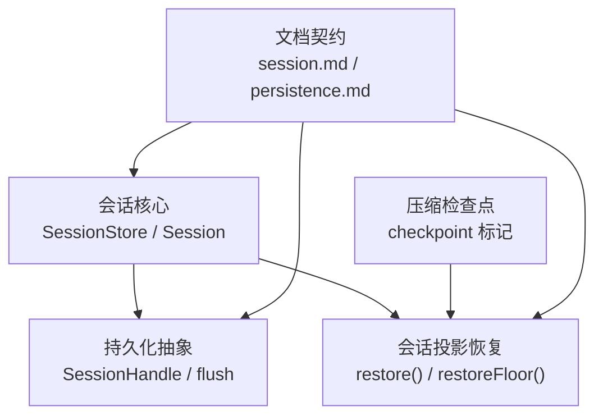
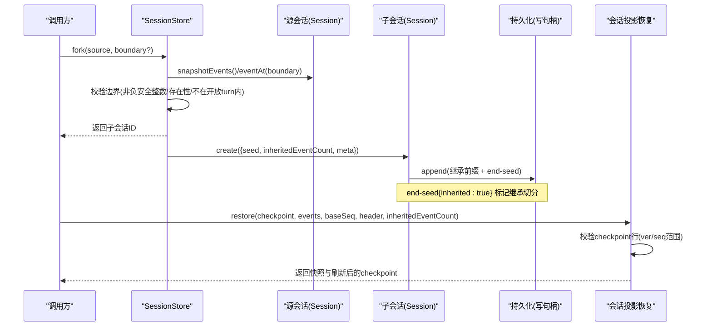
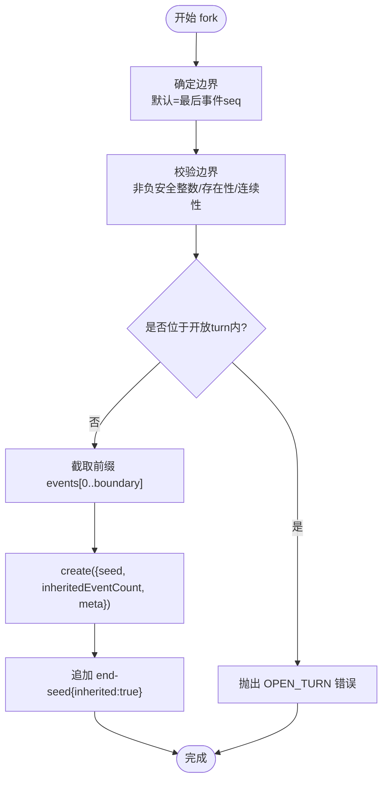
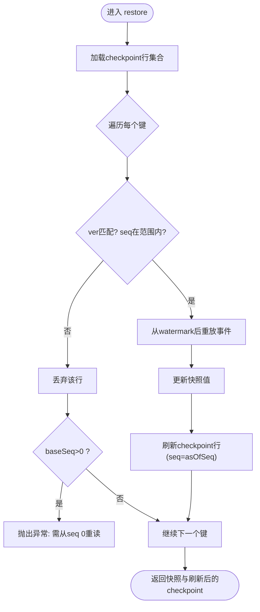
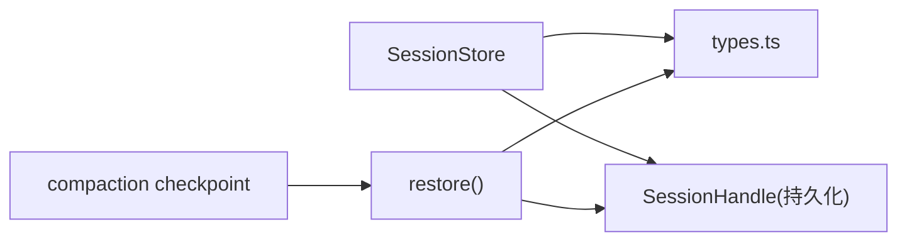

# 会话分支与恢复

<cite>
**本文引用的文件**
- [packages/core/session/src/index.ts](file://packages/core/session/src/index.ts)
- [packages/core/session/src/types.ts](file://packages/core/session/src/types.ts)
- [packages/api/session-controller/tests/session-fork.host.spec.ts](file://packages/api/session-controller/tests/session-fork.host.spec.ts)
- [packages/compaction/compaction/src/checkpoint.ts](file://packages/compaction/compaction/src/checkpoint.ts)
- [packages/session/session-projection/src/index.ts](file://packages/session/session-projection/src/index.ts)
- [packages/session/session-projection/tests/registry.spec.ts](file://packages/session/session-projection/tests/registry.spec.ts)
- [docs/subsystems/session.md](file://docs/subsystems/session.md)
- [docs/subsystems/persistence.md](file://docs/subsystems/persistence.md)
</cite>

## 目录
1. [简介](#简介)
2. [项目结构](#项目结构)
3. [核心组件](#核心组件)
4. [架构总览](#架构总览)
5. [详细组件分析](#详细组件分析)
6. [依赖关系分析](#依赖关系分析)
7. [性能考虑](#性能考虑)
8. [故障排查指南](#故障排查指南)
9. [结论](#结论)
10. [附录](#附录)

## 简介
本文件系统性说明 DeepSeek Harness 的“会话分支”和“恢复”能力，覆盖以下主题：
- fork 操作的执行流程、边界点选择与校验
- checkpoint（检查点）机制的创建、保存与恢复
- 分支间的依赖关系与数据共享、父会话生命周期管理
- 会话恢复时的数据加载与状态重建（含种子事件注入与 firstLiveSeq）
- 分支管理 API 使用示例与最佳实践（fork 参数配置与错误处理）
- 冲突解决策略与性能优化（大会话分页加载、增量同步）
- 高级用法指导

## 项目结构
围绕会话分支与恢复的关键代码分布在如下模块：
- 会话核心：事件日志、表面投影、请求头折叠、SessionStore 的 fork 实现
- 持久化：SessionHandle、flush 检查点、崩溃恢复
- 压缩检查点：compaction 的检查点标记与识别
- 会话投影恢复：冷读恢复、checkpoint 行有效性校验与重放
- 文档：会话模型与持久化契约

图表来源
- [packages/core/session/src/index.ts:1162-1234](file://packages/core/session/src/index.ts#L1162-L1234)
- [docs/subsystems/persistence.md:91-101](file://docs/subsystems/persistence.md#L91-L101)
- [packages/session/session-projection/src/index.ts:471-520](file://packages/session/session-projection/src/index.ts#L471-L520)
- [packages/compaction/compaction/src/checkpoint.ts:19-51](file://packages/compaction/compaction/src/checkpoint.ts#L19-L51)

章节来源
- [packages/core/session/src/index.ts:1162-1234](file://packages/core/session/src/index.ts#L1162-L1234)
- [docs/subsystems/persistence.md:91-101](file://docs/subsystems/persistence.md#L91-L101)
- [packages/session/session-projection/src/index.ts:471-520](file://packages/session/session-projection/src/index.ts#L471-L520)
- [packages/compaction/compaction/src/checkpoint.ts:19-51](file://packages/compaction/compaction/src/checkpoint.ts#L19-L51)

## 核心组件
- 会话事件与类型：SessionEventMap、SurfaceEventType、EpochHeader、RequestContext、TurnEndReason 等定义
- SessionStore：提供 create/fork/enter/announce/flush 等能力；fork 负责基于现有会话创建分支并设置继承前缀
- 持久化：SessionHandle 提供 read/append/flush/close；flush 是持久化屏障；崩溃恢复会补全未关闭的 turn/step/tool 边界
- 会话投影恢复：restore/restoreFloor 支持冷读恢复，按 checkpoint 行进行增量重放
- 压缩检查点：compactCheckpointSource/isCompactCheckpointSource 用于标识压缩产生的用户消息来源

章节来源
- [packages/core/session/src/types.ts:16-128](file://packages/core/session/src/types.ts#L16-L128)
- [packages/core/session/src/types.ts:254-376](file://packages/core/session/src/types.ts#L254-L376)
- [packages/core/session/src/index.ts:1162-1234](file://packages/core/session/src/index.ts#L1162-L1234)
- [docs/subsystems/persistence.md:91-101](file://docs/subsystems/persistence.md#L91-L101)
- [packages/session/session-projection/src/index.ts:471-520](file://packages/session/session-projection/src/index.ts#L471-L520)
- [packages/compaction/compaction/src/checkpoint.ts:19-51](file://packages/compaction/compaction/src/checkpoint.ts#L19-L51)

## 架构总览
下图展示了从“源会话”到“子会话”的分支流程，以及恢复路径中 checkpoint 的作用。

图表来源
- [packages/core/session/src/index.ts:1162-1234](file://packages/core/session/src/index.ts#L1162-L1234)
- [packages/core/session/src/types.ts:130-172](file://packages/core/session/src/types.ts#L130-L172)
- [packages/session/session-projection/src/index.ts:471-520](file://packages/session/session-projection/src/index.ts#L471-L520)

## 详细组件分析

### 分支创建（fork）执行流程
- 输入：source（会话对象或ID）、boundary（可选，包含的最后一个事件 seq）
- 边界选择与校验：
  - 若未指定 boundary，默认取源会话当前最后一个事件的 seq
  - 必须是非负安全整数且小于当前会话长度
  - 通过 eventAt(boundary) 验证连续性
  - 截取到 boundary+1 的事件前缀，并检查该前缀末尾不能落在 open turn 内部（必须是 turn/end 或 turn/start 之前的稳定位置）
- 创建子会话：
  - seed = 截取的继承前缀
  - inheritedEventCount = seed.length
  - meta.parentSession = source.id，meta.cwd 继承自父会话（若存在），meta.isSeeded = true
  - 构造时会在继承切分处追加 session/end-seed{inherited:true}，作为可持久化的继承边界标记
- 错误处理：
  - 非法边界、不存在、open turn 内切割、已存在同 ID 子会话等都会抛出明确的 SessionForkError

图表来源
- [packages/core/session/src/index.ts:1162-1234](file://packages/core/session/src/index.ts#L1162-L1234)

章节来源
- [packages/core/session/src/index.ts:1162-1234](file://packages/core/session/src/index.ts#L1162-L1234)
- [packages/api/session-controller/tests/session-fork.host.spec.ts:90-104](file://packages/api/session-controller/tests/session-fork.host.spec.ts#L90-L104)
- [packages/api/session-controller/tests/session-fork.host.spec.ts:205-227](file://packages/api/session-controller/tests/session-fork.host.spec.ts#L205-L227)
- [packages/api/session-controller/tests/session-fork.host.spec.ts:241-269](file://packages/api/session-controller/tests/session-fork.host.spec.ts#L241-L269)

### 边界点的选择与验证机制
- 边界点必须是一个存在的、连续的 seq
- 不允许在 turn/start 之后、turn/end 之前进行分割，保证每个分支以稳定的“回合边界”结束
- 测试覆盖了：
  - 锚定到已完成回合的分支
  - 尾部为 open 或 aborted 的情况
  - 越界/非法边界拒绝
  - 通过最近 completed turn 裁剪

章节来源
- [packages/core/session/src/index.ts:1193-1234](file://packages/core/session/src/index.ts#L1193-L1234)
- [packages/api/session-controller/tests/session-fork.host.spec.ts:205-227](file://packages/api/session-controller/tests/session-fork.host.spec.ts#L205-L227)
- [packages/api/session-controller/tests/session-fork.host.spec.ts:241-269](file://packages/api/session-controller/tests/session-fork.host.spec.ts#L241-L269)

### 检查点（checkpoint）机制
- 压缩检查点来源：compactCheckpointSource 生成带 compactionId 的来源标记；isCompactCheckpointSource 用于识别
- 会话投影恢复中的 checkpoint：
  - restore 接受一组 checkpoint 行（每个键对应一个投影单元的状态版本、序列号与值）
  - 对每一行进行可用性判断：版本匹配、seq 不小于 baseSeq-1、且不超出当前提供的日志末尾
  - 不可用的行会被丢弃，并在 baseSeq>0 时要求从 seq 0 重新读取（例如崩溃修复导致日志缩短）
  - 恢复过程将可用 checkpoint 作为起点，仅回放其 watermark 之后的事件，得到最终快照与刷新后的 checkpoint

图表来源
- [packages/session/session-projection/src/index.ts:471-520](file://packages/session/session-projection/src/index.ts#L471-L520)
- [packages/session/session-projection/tests/registry.spec.ts:715-743](file://packages/session/session-projection/tests/registry.spec.ts#L715-L743)

章节来源
- [packages/compaction/compaction/src/checkpoint.ts:19-51](file://packages/compaction/compaction/src/checkpoint.ts#L19-L51)
- [packages/session/session-projection/src/index.ts:471-520](file://packages/session/session-projection/src/index.ts#L471-L520)
- [packages/session/session-projection/tests/registry.spec.ts:715-743](file://packages/session/session-projection/tests/registry.spec.ts#L715-L743)

### 分支间依赖与数据共享、父会话生命周期
- 依赖关系：子会话通过 header.parentSession 指向父会话；inheritedEventCount 精确记录继承前缀长度；end-seed{inherited:true} 标记继承切分
- 数据共享：子会话拥有独立的 log 副本（seed 深拷贝），不共享可变状态；但可通过查询服务追溯祖先链
- 父会话生命周期：fork 不要求父会话存活；测试覆盖了从持久化子会话直接 fork 而不恢复 Agent 的场景
- 工作区关联：子会话会尝试附着到最近的拥有工作区的祖先会话（测试中通过 traceSession 模拟）

章节来源
- [packages/core/session/src/types.ts:130-172](file://packages/core/session/src/types.ts#L130-L172)
- [packages/api/session-controller/tests/session-fork.host.spec.ts:106-147](file://packages/api/session-controller/tests/session-fork.host.spec.ts#L106-L147)
- [packages/api/session-controller/tests/session-fork.host.spec.ts:149-203](file://packages/api/session-controller/tests/session-fork.host.spec.ts#L149-L203)

### 会话恢复：数据加载与状态重建（含种子事件与 firstLiveSeq）
- 种子事件注入：
  - Session.create/fromRestore 接受 seed（事件数组）与 header（元数据）
  - 对于 fork 场景，seed 即为继承前缀；构造时在切分处追加 session/end-seed{inherited:true}
  - firstLiveSeq：表示本次进程中新追加的第一个事件的 seq；持久化侧通过 end-seed 事件体现
- 恢复流程：
  - 持久化层通过 SessionHandle.read 获取 baseSeq 起的事件切片
  - 投影恢复根据 checkpoint 行决定从何处重放；若 checkpoint 行无效则要求从 seq 0 重读
  - 恢复完成后得到快照（snapshot）与刷新后的 checkpoint，供后续写入

章节来源
- [packages/core/session/src/types.ts:130-172](file://packages/core/session/src/types.ts#L130-L172)
- [docs/subsystems/session.md:638-646](file://docs/subsystems/session.md#L638-L646)
- [packages/session/session-projection/src/index.ts:471-520](file://packages/session/session-projection/src/index.ts#L471-L520)

### 分支管理 API 使用示例与最佳实践
- fork 参数：
  - sessionId：源会话 ID
  - atSeq：可选，指定 inclusive 边界；省略则默认到最后事件
  - 建议显式指定 atSeq，确保在已完成回合边界上分支
- 错误处理：
  - 非法边界（负数、非安全整数、越界）→ 网关/会话层拒绝
  - 开放 turn 内切割 → 明确拒绝
  - 子会话 ID 冲突 → 拒绝
- 最佳实践：
  - 优先在 turn/end 之后或 turn/start 之前选择边界
  - 对大会话采用分页读取历史，再选择稳定边界
  - 对子 agent 分支，注意工作区附着与 origin 字段

章节来源
- [packages/api/session-controller/tests/session-fork.host.spec.ts:90-104](file://packages/api/session-controller/tests/session-fork.host.spec.ts#L90-L104)
- [packages/api/session-controller/tests/session-fork.host.spec.ts:205-227](file://packages/api/session-controller/tests/session-fork.host.spec.ts#L205-L227)
- [packages/api/session-controller/tests/session-fork.host.spec.ts:229-239](file://packages/api/session-controller/tests/session-fork.host.spec.ts#L229-L239)
- [packages/api/session-controller/tests/session-fork.host.spec.ts:241-269](file://packages/api/session-controller/tests/session-fork.host.spec.ts#L241-L269)

### 冲突解决策略
- 同一进程内 fork 目标 ID 冲突：直接拒绝
- 并发写入：持久化层通过单写句柄保证顺序；flush 作为持久化屏障
- 崩溃恢复：reader 计算 interruptedTurnClosers，补齐缺失的 tool/step/turn 闭合事件，避免状态不一致

章节来源
- [packages/core/session/src/index.ts:1176-1191](file://packages/core/session/src/index.ts#L1176-L1191)
- [docs/subsystems/persistence.md:91-101](file://docs/subsystems/persistence.md#L91-L101)

### 性能考虑
- 大会话分页加载：
  - 使用 SessionHandle.read(offset, length) 分页读取历史，降低单次内存占用
  - 结合 restoreFloor 确定最小必要起始 seq，减少重放量
- 增量同步：
  - 利用 checkpoint 行的 watermark，仅回放 watermark 之后的事件
  - 对投影单元维护 stateVersion，避免跨版本误用旧 checkpoint
- 首屏优化：
  - 先恢复关键投影（如计数、标记），再按需扩展其他视图
  - 对 assistant/message 等大体积事件，优先使用流式/压缩证据（stream）而非完整展开

章节来源
- [docs/subsystems/persistence.md:91-101](file://docs/subsystems/persistence.md#L91-L101)
- [packages/session/session-projection/src/index.ts:471-520](file://packages/session/session-projection/src/index.ts#L471-L520)

## 依赖关系分析
- SessionStore 依赖 Session 类型与事件模型，负责 fork 的边界校验与子会话创建
- 持久化抽象由 SessionHandle 暴露，flush 作为持久化屏障
- 会话投影恢复依赖 checkpoint 行与事件切片，按 watermark 增量重放
- 压缩检查点通过 MessageSource 标记，便于上层识别压缩产物

图表来源
- [packages/core/session/src/index.ts:1162-1234](file://packages/core/session/src/index.ts#L1162-L1234)
- [packages/core/session/src/types.ts:130-172](file://packages/core/session/src/types.ts#L130-L172)
- [packages/session/session-projection/src/index.ts:471-520](file://packages/session/session-projection/src/index.ts#L471-L520)
- [packages/compaction/compaction/src/checkpoint.ts:19-51](file://packages/compaction/compaction/src/checkpoint.ts#L19-L51)

章节来源
- [packages/core/session/src/index.ts:1162-1234](file://packages/core/session/src/index.ts#L1162-L1234)
- [packages/core/session/src/types.ts:130-172](file://packages/core/session/src/types.ts#L130-L172)
- [packages/session/session-projection/src/index.ts:471-520](file://packages/session/session-projection/src/index.ts#L471-L520)
- [packages/compaction/compaction/src/checkpoint.ts:19-51](file://packages/compaction/compaction/src/checkpoint.ts#L19-L51)

## 性能考虑
- 使用分页读取与 checkpoint watermark 减少重放成本
- 对大消息采用流式证据（assistant/stream）避免重复展开
- 在 fork 前尽量定位到已完成回合的稳定边界，避免不必要的重放
- 对多投影单元，优先恢复轻量级单元，延迟重型投影

## 故障排查指南
- fork 失败常见原因：
  - 边界非法（负数、非安全整数、越界）
  - 边界位于开放 turn 内
  - 子会话 ID 冲突
- 恢复失败常见原因：
  - checkpoint 行版本不匹配或 seq 范围不合法
  - 日志被崩溃修复缩短，需要从头重读
- 诊断建议：
  - 打印源会话的最后几个事件类型与 seq，确认边界位置
  - 检查 checkpoint 行的 ver/seq 与当前日志端点
  - 使用 SessionHandle.read 的分页能力逐步缩小问题范围

章节来源
- [packages/api/session-controller/tests/session-fork.host.spec.ts:229-239](file://packages/api/session-controller/tests/session-fork.host.spec.ts#L229-L239)
- [packages/api/session-controller/tests/session-fork.host.spec.ts:241-269](file://packages/api/session-controller/tests/session-fork.host.spec.ts#L241-L269)
- [packages/session/session-projection/tests/registry.spec.ts:715-743](file://packages/session/session-projection/tests/registry.spec.ts#L715-L743)

## 结论
DeepSeek Harness 的会话分支与恢复建立在“事件溯源 + 持久化检查点”的稳健模型之上：
- fork 通过严格的边界校验与继承前缀复制，确保分支语义清晰、可重现
- checkpoint 机制使冷读恢复高效可靠，支持增量重放与崩溃修复
- 通过 end-seed 标记与 firstLiveSeq 区分种子历史与实时工作，保障生命周期正确性
- 配合分页读取与 watermark 重放，可在大会话场景下保持良好性能

## 附录
- 术语
  - 会话：事件追加日志，唯一事实来源
  - 表面：消息可见顺序的投影，由 surfaceOp 控制
  - 检查点：投影单元的持久化状态行，用于快速恢复
  - 继承前缀：子会话从父会话复制的事件前缀
- 参考
  - 会话模型与事件词汇见 docs/subsystems/session.md
  - 持久化契约与崩溃恢复见 docs/subsystems/persistence.md