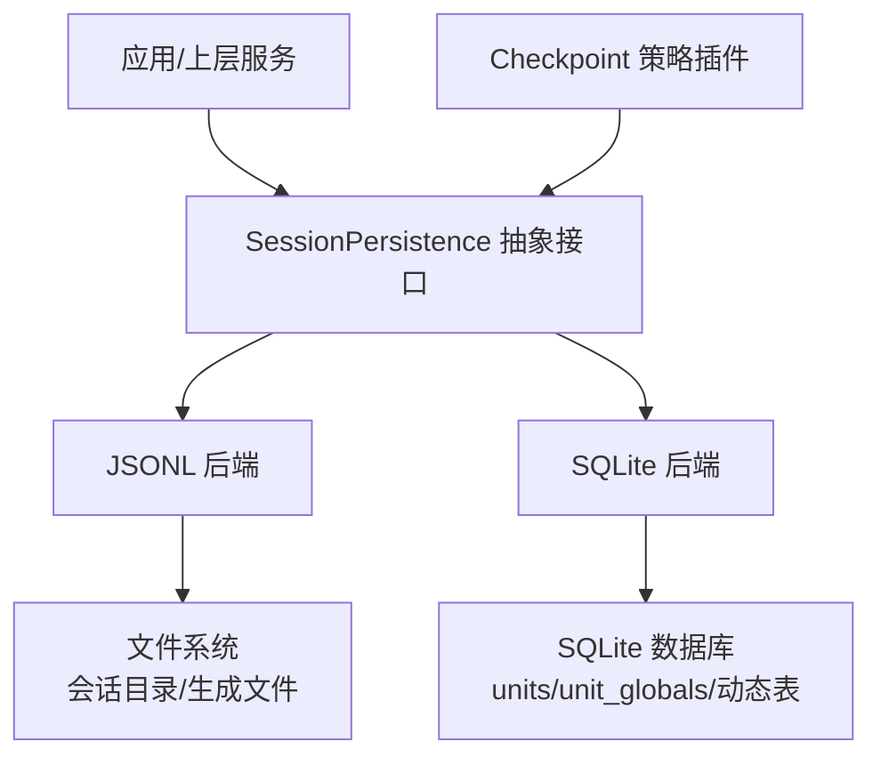
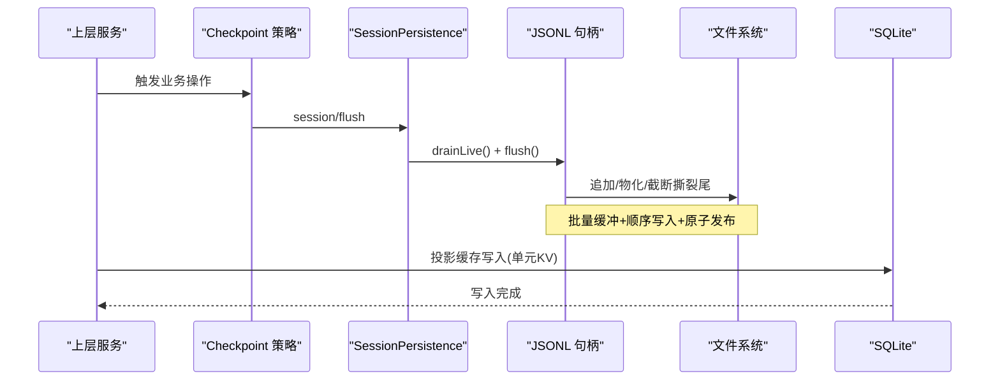
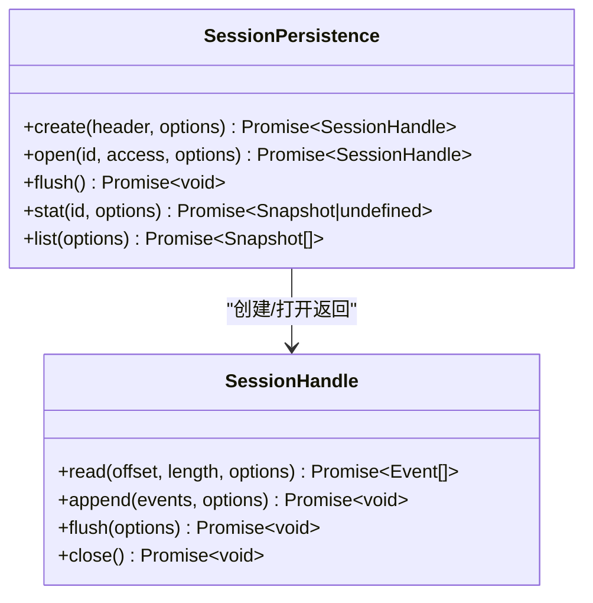
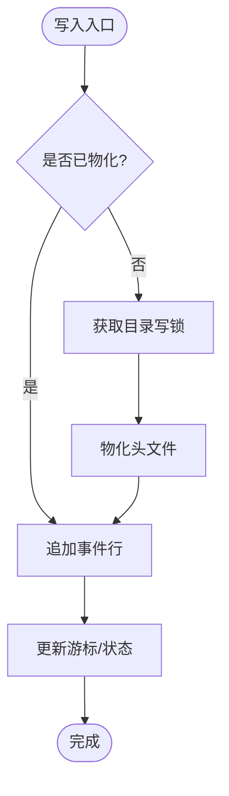
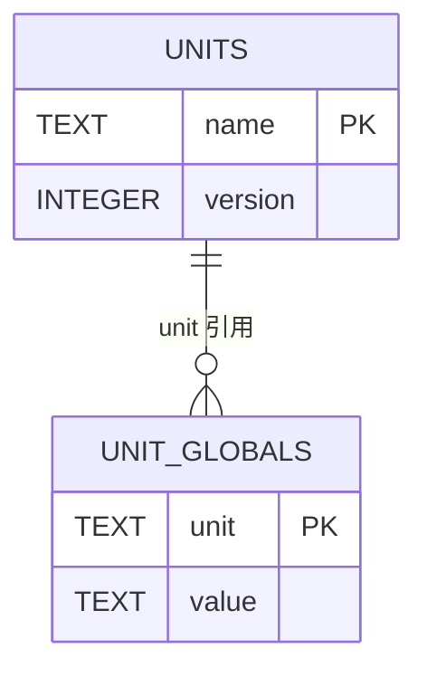
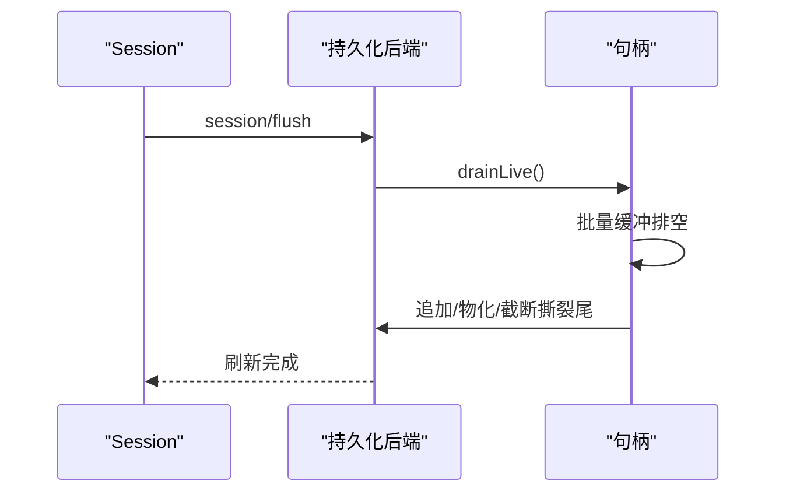
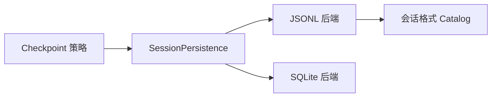

# 会话持久化

<cite>
**本文引用的文件**
- [packages/session/session-persistence/src/index.ts](file://packages/session/session-persistence/src/index.ts)
- [packages/session/session-persistence-jsonl/src/index.ts](file://packages/session/session-persistence-jsonl/src/index.ts)
- [packages/session/session-persistence-jsonl/src/storage.ts](file://packages/session/session-persistence-jsonl/src/storage.ts)
- [packages/session/session-format/src/types.ts](file://packages/session/session-format/src/types.ts)
- [packages/storage/storage-sqlite/src/schema.ts](file://packages/storage/storage-sqlite/src/schema.ts)
- [packages/session/session-checkpoint-policy/src/index.ts](file://packages/session/session-checkpoint-policy/src/index.ts)
</cite>

## 目录
1. [简介](#简介)
2. [项目结构](#项目结构)
3. [核心组件](#核心组件)
4. [架构总览](#架构总览)
5. [详细组件分析](#详细组件分析)
6. [依赖关系分析](#依赖关系分析)
7. [性能考虑](#性能考虑)
8. [故障排查指南](#故障排查指南)
9. [结论](#结论)
10. [附录](#附录)

## 简介
本文件系统性说明 DeepSeek Harness 的会话持久化机制，围绕 SessionPersistence 接口设计、JSONL 与 SQLite 两种后端存储策略、JSONL 读写流程、SQLite 表结构、checkpoint 机制（session/flush 事件处理与崩溃恢复）、数据一致性（事务与错误恢复）、SessionHeader 管理与元数据存储方案，以及性能优化与扩展自定义后端的实践指导。目标是帮助开发者理解并安全地扩展持久化层。

## 项目结构
- 持久化抽象层：定义跨后端的统一接口与语义契约，包括创建、打开、追加、刷新、统计、列举等能力，以及句柄生命周期和错误模型。
- JSONL 实现：以不可变生成文件组织每个会话的事件日志，支持压缩、冷读缓存、撕裂尾修复、进程内写锁与会话可见性控制。
- SQLite 实现：提供键值型单元存储，用于投影缓存等场景；通过 schema 管理版本与权限，保证数据库物理布局稳定。
- 格式与迁移：统一的会话格式编解码与迁移目录，确保历史与当前格式兼容。
- Checkpoint 策略：在关键边界（LLM 流、工具调用、agent 步骤前）触发持久化刷新，保障语义级检查点。

图表来源
- [packages/session/session-persistence/src/index.ts:114-198](file://packages/session/session-persistence/src/index.ts#L114-L198)
- [packages/session/session-persistence-jsonl/src/index.ts:140-197](file://packages/session/session-persistence-jsonl/src/index.ts#L140-L197)
- [packages/storage/storage-sqlite/src/schema.ts:60-107](file://packages/storage/storage-sqlite/src/schema.ts#L60-L107)
- [packages/session/session-checkpoint-policy/src/index.ts:63-83](file://packages/session/session-checkpoint-policy/src/index.ts#L63-L83)

章节来源
- [packages/session/session-persistence/src/index.ts:114-198](file://packages/session/session-persistence/src/index.ts#L114-L198)
- [packages/session/session-persistence-jsonl/src/index.ts:140-197](file://packages/session/session-persistence-jsonl/src/index.ts#L140-L197)
- [packages/storage/storage-sqlite/src/schema.ts:60-107](file://packages/storage/storage-sqlite/src/schema.ts#L60-L107)
- [packages/session/session-checkpoint-policy/src/index.ts:63-83](file://packages/session/session-checkpoint-policy/src/index.ts#L63-L83)

## 核心组件
- SessionPersistence（抽象服务）
  - 职责：定义会话的创建、打开、追加、刷新、统计、列举等能力；维护句柄所有权、可见性与刷新语义；暴露变更令牌 revision 供派生缓存使用。
  - 关键语义：事件从 seq 0 连续追加且永不重写；撕裂尾部不会返回给读者；append 尽力持久化，flush 是持久化屏障；已创建但未物化的会话仅在本进程可见。
- JSONL 后端
  - 职责：将会话头与事件序列化为不可变生成文件；提供压缩（zstd/none）、冷读缓存、撕裂尾修复、跨进程写锁、列表与统计。
  - 关键特性：首次写入或 flush 时物化；冷读缓存复用解析结果；Zstandard 帧可独立解码首帧校验头部；扫描器支持部分记录恢复。
- SQLite 后端
  - 职责：为投影缓存等提供 KV 单元存储；管理数据库版本、权限与表结构；按单元名动态创建记录表。
  - 关键特性：强制外键、受控 journal 模式、user_version 校验、新建文件 owner-only 权限。
- 会话格式与迁移
  - 职责：定义逻辑头与事件结构；提供编解码、可恢复前缀解码、相邻迁移链与当前编码。
- Checkpoint 策略
  - 职责：在 LLM 流、工具执行、agent 步骤前触发 session.flush，确保请求/响应边界持久化。

章节来源
- [packages/session/session-persistence/src/index.ts:114-198](file://packages/session/session-persistence/src/index.ts#L114-L198)
- [packages/session/session-persistence-jsonl/src/index.ts:140-197](file://packages/session/session-persistence-jsonl/src/index.ts#L140-L197)
- [packages/storage/storage-sqlite/src/schema.ts:60-107](file://packages/storage/storage-sqlite/src/schema.ts#L60-L107)
- [packages/session/session-format/src/types.ts:15-150](file://packages/session/session-format/src/types.ts#L15-L150)
- [packages/session/session-checkpoint-policy/src/index.ts:63-83](file://packages/session/session-checkpoint-policy/src/index.ts#L63-L83)

## 架构总览
下图展示从上层到持久化后端的整体交互，包括 checkpoint 策略对 flush 的驱动、JSONL 的句柄链式写入与批量缓冲、SQLite 的单元表管理。

图表来源
- [packages/session/session-checkpoint-policy/src/index.ts:63-83](file://packages/session/session-checkpoint-policy/src/index.ts#L63-L83)
- [packages/session/session-persistence-jsonl/src/storage.ts:233-336](file://packages/session/session-persistence-jsonl/src/storage.ts#L233-L336)
- [packages/storage/storage-sqlite/src/schema.ts:60-107](file://packages/storage/storage-sqlite/src/schema.ts#L60-L107)

## 详细组件分析

### SessionPersistence 接口设计与语义
- 接口要点
  - create/open：创建新会话或打开已有会话；open 支持 read/write 访问模式；write 独占单写者。
  - append/flush：append 追加连续事件；flush 作为持久化屏障，服务级 flushAll 对所有活跃写句柄生效。
  - stat/list：轻量观察会话元信息与变更令牌；list 包含已物化与进程内 pending 会话。
- 可见性与一致性
  - 已创建未物化会话仅本进程可见；其他进程在物化后才可见。
  - 读取路径拒绝未知词汇，fail-closed；撕裂尾部在首次写入前被截断。
- 错误模型
  - 重复创建、无主、格式不支持、损坏、不存在、只读等错误类型清晰分类。

图表来源
- [packages/session/session-persistence/src/index.ts:114-198](file://packages/session/session-persistence/src/index.ts#L114-L198)

章节来源
- [packages/session/session-persistence/src/index.ts:114-198](file://packages/session/session-persistence/src/index.ts#L114-L198)

### JSONL 后端：读写流程与压缩
- 物化与追加
  - 首次 append 或显式 flush 时物化头文件；后续追加直接写入当前生成文件。
  - 写路径先获取跨进程写锁（目录级），再写入，关闭句柄释放锁。
- 读取与冷读缓存
  - 读取时选择当前生成文件，必要时进行格式迁移；解析后放入冷读缓存，基于文件 revision 失效。
  - Zstandard 压缩下，首帧独立可解码，用于快速校验头部；完整解码分帧迭代，支持长任务 yield。
- 撕裂尾修复
  - 若最终帧撕裂，尝试恢复完整记录；记录 tornTruncateTo 与 recoveredTail，下次写入先截断并重写恢复事件。
- 列表与统计
  - list 合并磁盘扫描与进程内 pending；stat 返回 header、revision、sizeBytes。

图表来源
- [packages/session/session-persistence-jsonl/src/storage.ts:284-336](file://packages/session/session-persistence-jsonl/src/storage.ts#L284-L336)
- [packages/session/session-persistence-jsonl/src/index.ts:556-600](file://packages/session/session-persistence-jsonl/src/index.ts#L556-L600)

章节来源
- [packages/session/session-persistence-jsonl/src/index.ts:140-197](file://packages/session/session-persistence-jsonl/src/index.ts#L140-L197)
- [packages/session/session-persistence-jsonl/src/storage.ts:233-336](file://packages/session/session-persistence-jsonl/src/storage.ts#L233-L336)

### SQLite 后端：表结构与版本管理
- 数据库初始化
  - 创建目录与数据库文件（owner-only 权限）；设置 PRAGMA foreign_keys=ON 与 journal_mode。
  - user_version 必须匹配当前构建版本，否则拒绝打开；新建库最后才打戳，失败可重试。
- 表结构
  - units：记录单元名称与版本。
  - unit_globals：单元全局元数据。
  - 动态表：u_<unit>_<table> 形式，按单元描述符创建。
- 安全与兼容性
  - 严格版本校验，避免不兼容布局；journal 模式可选 WAL 或回滚日志模式以适应不同文件系统。

图表来源
- [packages/storage/storage-sqlite/src/schema.ts:76-107](file://packages/storage/storage-sqlite/src/schema.ts#L76-L107)

章节来源
- [packages/storage/storage-sqlite/src/schema.ts:60-107](file://packages/storage/storage-sqlite/src/schema.ts#L60-L107)

### Checkpoint 机制：session/flush 与崩溃恢复
- 语义检查点
  - LLM 流：在请求首个 chunk 前 flush，确保请求前缀已持久化。
  - 工具执行：顶层工具调用前 flush，取消则在调度前返回错误结果。
  - Agent 步骤：每步开始前 flush，确保上一步结果落盘。
- 崩溃恢复
  - JSONL 读取路径识别撕裂尾，恢复完整记录并记录截断点；首次写入先截断并重写恢复事件。
  - 写锁由内核持有至句柄关闭，进程崩溃自动释放，防止死锁。

图表来源
- [packages/session/session-checkpoint-policy/src/index.ts:63-83](file://packages/session/session-checkpoint-policy/src/index.ts#L63-L83)
- [packages/session/session-persistence-jsonl/src/storage.ts:233-336](file://packages/session/session-persistence-jsonl/src/storage.ts#L233-L336)

章节来源
- [packages/session/session-checkpoint-policy/src/index.ts:63-83](file://packages/session/session-checkpoint-policy/src/index.ts#L63-L83)
- [packages/session/session-persistence-jsonl/src/storage.ts:233-336](file://packages/session/session-persistence-jsonl/src/storage.ts#L233-L336)

### 数据一致性：事务与错误恢复
- 一致性原则
  - 事件连续追加、永不重写；读取路径 fail-closed，拒绝未知词汇。
  - 撕裂尾部不被返回给读者；写路径在首次写入前修复。
- 错误恢复
  - 写锁释放失败与释放失败聚合为 AggregateError，保留诊断信息。
  - 关闭句柄时先排空缓冲，再释放锁；任何失败均上报但不阻塞资源回收。
- 版本与迁移
  - 会话格式通过 catalog 进行相邻迁移；JSONL 后端在读取时按需迁移并验证目标。

章节来源
- [packages/session/session-persistence/src/index.ts:114-198](file://packages/session/session-persistence/src/index.ts#L114-L198)
- [packages/session/session-persistence-jsonl/src/index.ts:411-459](file://packages/session/session-persistence-jsonl/src/index.ts#L411-L459)
- [packages/session/session-format/src/types.ts:69-150](file://packages/session/session-format/src/types.ts#L69-L150)

### SessionHeader 管理与元数据存储
- Header 内容
  - 包含 id、version、createdAt、cwd、parentSession、isSeeded、origin、delegationDepth、agentPreset 等字段。
  - inheritedEventCount 表示 fork 继承的前缀长度，与 isSeeded 配合标记血缘。
- 存储方式
  - JSONL：header 作为首行存储在生成文件中；读取时优先解析首行以快速判断。
  - SQLite：通过 units/unit_globals 管理单元元数据；会话标题等派生视图通过 projection-cache 存储与恢复。
- 可见性与标识
  - 列表合并磁盘与进程内 pending；stat 返回 revision 令牌用于缓存失效。

章节来源
- [packages/session/session-format/src/types.ts:15-42](file://packages/session/session-format/src/types.ts#L15-L42)
- [packages/session/session-persistence-jsonl/src/index.ts:317-382](file://packages/session/session-persistence-jsonl/src/index.ts#L317-L382)
- [packages/storage/storage-sqlite/src/schema.ts:89-107](file://packages/storage/storage-sqlite/src/schema.ts#L89-L107)

## 依赖关系分析
- 抽象与实现解耦
  - SessionPersistence 定义跨后端契约；JSONL 与 SQLite 分别实现各自职责。
- 事件与格式
  - JSONL 后端依赖会话格式 catalog 进行编解码与迁移；读取路径严格校验。
- 检查点与生命周期
  - Checkpoint 策略监听 session/flush 事件，驱动持久化刷新；句柄关闭与进程销毁时统一回收。

图表来源
- [packages/session/session-persistence/src/index.ts:114-198](file://packages/session/session-persistence/src/index.ts#L114-L198)
- [packages/session/session-persistence-jsonl/src/index.ts:140-197](file://packages/session/session-persistence-jsonl/src/index.ts#L140-L197)
- [packages/session/session-format/src/types.ts:69-150](file://packages/session/session-format/src/types.ts#L69-L150)
- [packages/session/session-checkpoint-policy/src/index.ts:63-83](file://packages/session/session-checkpoint-policy/src/index.ts#L63-L83)

章节来源
- [packages/session/session-persistence/src/index.ts:114-198](file://packages/session/session-persistence/src/index.ts#L114-L198)
- [packages/session/session-persistence-jsonl/src/index.ts:140-197](file://packages/session/session-persistence-jsonl/src/index.ts#L140-L197)
- [packages/session/session-format/src/types.ts:69-150](file://packages/session/session-format/src/types.ts#L69-L150)
- [packages/session/session-checkpoint-policy/src/index.ts:63-83](file://packages/session/session-checkpoint-policy/src/index.ts#L63-L83)

## 性能考虑
- 批量写入与延迟
  - JSONL 句柄对 live 事件采用定时批量缓冲（默认最大延迟约 200ms），减少频繁 I/O。
- 压缩策略
  - 支持 zstd 与 none；zstd 首帧独立解码，便于快速头部校验；大文件压缩提升存储效率。
- 冷读缓存
  - 解析后的 StoredLog 按 session id 缓存，基于文件 revision 失效，避免重复解析。
- 并发与 I/O
  - 长任务解码过程中定期 yield，降低阻塞；WAL 模式提升并发读性能。
- 建议
  - 根据负载调整批量窗口与压缩级别；在高并发读场景启用 WAL；对超大会话评估分段归档与压缩策略。

章节来源
- [packages/session/session-persistence-jsonl/src/storage.ts:34-36](file://packages/session/session-persistence-jsonl/src/storage.ts#L34-L36)
- [packages/session/session-persistence-jsonl/src/index.ts:64-70](file://packages/session/session-persistence-jsonl/src/index.ts#L64-L70)
- [packages/storage/storage-sqlite/src/schema.ts:22-29](file://packages/storage/storage-sqlite/src/schema.ts#L22-L29)

## 故障排查指南
- 常见错误
  - 重复创建/已拥有：检查多进程或多句柄竞争；确认 write 独占语义。
  - 格式不支持/损坏：核对会话格式版本与迁移链；查看 raw log 路径定位问题。
  - 撕裂尾：关注首次写入前的截断与重写；检查异常中断导致的尾部不完整。
  - 关闭失败：关注 drain 与锁释放的聚合错误；确认句柄生命周期与资源回收。
- 诊断建议
  - 使用 stat/list 观察 revision 与 sizeBytes；结合日志中的 raw log 路径定位具体文件。
  - 在 checkpoint 边界插入 flush 观察持久化时机；必要时临时增大批量窗口或关闭压缩测试。

章节来源
- [packages/session/session-persistence/src/index.ts:24-35](file://packages/session/session-persistence/src/index.ts#L24-L35)
- [packages/session/session-persistence-jsonl/src/index.ts:411-459](file://packages/session/session-persistence-jsonl/src/index.ts#L411-L459)
- [packages/session/session-persistence-jsonl/src/storage.ts:189-226](file://packages/session/session-persistence-jsonl/src/storage.ts#L189-L226)

## 结论
DeepSeek Harness 的会话持久化通过清晰的抽象接口与稳健的后端实现，提供了高可靠、可扩展的会话日志存储能力。JSONL 后端以不可变生成文件与压缩、冷读缓存、撕裂尾修复为核心，SQLite 后端以严格的版本与权限管理支撑投影缓存。Checkpoint 策略在关键边界触发刷新，确保语义一致性与崩溃恢复。开发者可基于此架构扩展新的存储后端或优化现有实现。

## 附录
- 扩展自定义后端指南
  - 实现 SessionPersistence 抽象类，遵循 append-only、fail-closed、flush 语义。
  - 处理 session/created 可见性、session/flush 刷新、session/disposed 清理。
  - 提供 stat/list 的轻量元数据与 revision 令牌；确保 open/create 的错误模型一致。
  - 若需与 SQLite 集成，遵循 schema 版本与权限约束，按单元动态建表。
  - 参考 JSONL 后端的批量缓冲、压缩、撕裂尾修复与冷读缓存设计，结合自身介质特性优化。

章节来源
- [packages/session/session-persistence/src/index.ts:114-198](file://packages/session/session-persistence/src/index.ts#L114-L198)
- [packages/session/session-persistence-jsonl/src/storage.ts:491-533](file://packages/session/session-persistence-jsonl/src/storage.ts#L491-L533)
- [packages/storage/storage-sqlite/src/schema.ts:60-107](file://packages/storage/storage-sqlite/src/schema.ts#L60-L107)