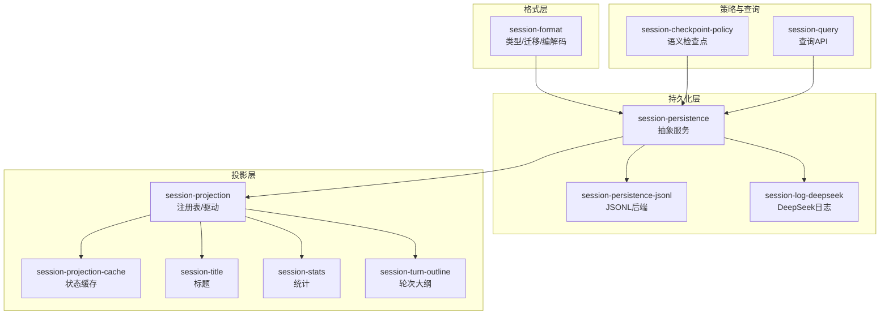
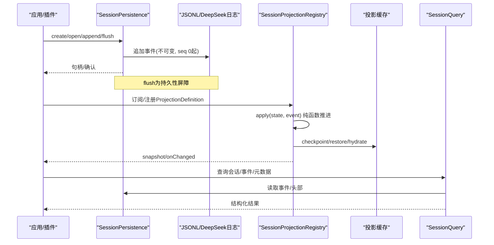
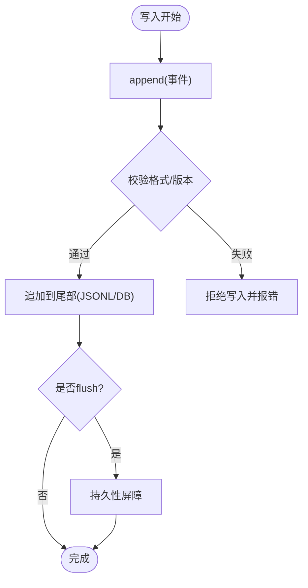
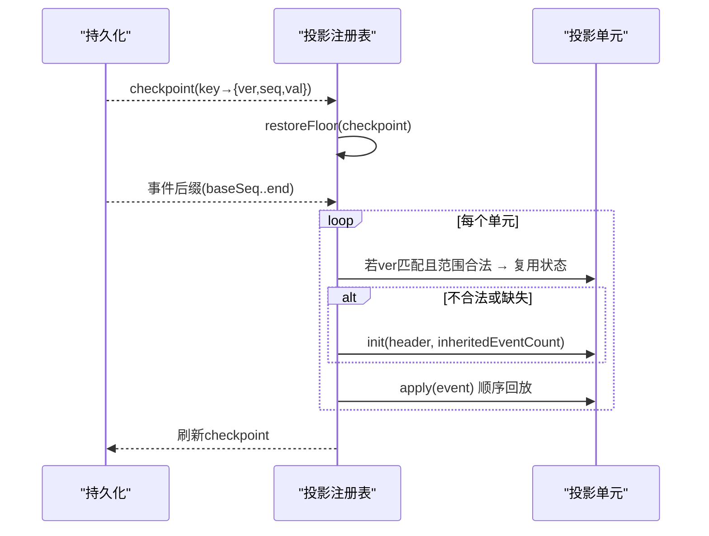
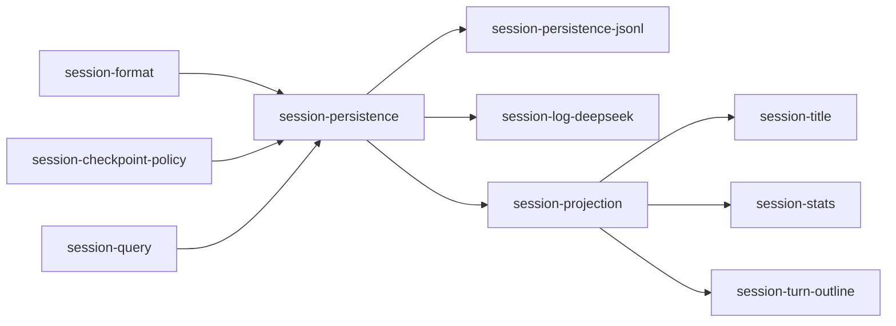

# 会话管理系统

<cite>
**本文引用的文件**
- [packages/session/session-format/src/types.ts](file://packages/session/session-format/src/types.ts)
- [packages/session/session-format/src/index.ts](file://packages/session/session-format/src/index.ts)
- [packages/session/session-persistence/src/index.ts](file://packages/session/session-persistence/src/index.ts)
- [packages/session/session-projection/src/index.ts](file://packages/session/session-projection/src/index.ts)
- [packages/session/session-checkpoint-policy/src/index.ts](file://packages/session/session-checkpoint-policy/src/index.ts)
- [packages/session/session-persistence-jsonl/src/index.ts](file://packages/session/session-persistence-jsonl/src/index.ts)
- [packages/session/session-log-deepseek/src/index.ts](file://packages/session/session-log-deepseek/src/index.ts)
- [packages/session/session-title/src/index.ts](file://packages/session/session-title/src/index.ts)
- [packages/session/session-stats/src/index.ts](file://packages/session/session-stats/src/index.ts)
- [packages/session/session-turn-outline/src/index.ts](file://packages/session/session-turn-outline/src/index.ts)
- [packages/session/session-projection-cache/src/index.ts](file://packages/session/session-projection-cache/src/index.ts)
- [packages/session/session-query/src/index.ts](file://packages/session/session-query/src/index.ts)
- [docs/subsystems/compaction.md](file://docs/subsystems/compaction.md)
- [docs/subsystems/conversation.md](file://docs/subsystems/conversation.md)
- [docs/subsystems/persistence.md](file://docs/subsystems/persistence.md)
- [docs/subsystems/session-projection.md](file://docs/subsystems/session-projection.md)
- [docs/subsystems/session-query.md](file://docs/subsystems/session-query.md)
</cite>

## 目录
1. [简介](#简介)
2. [项目结构](#项目结构)
3. [核心组件](#核心组件)
4. [架构总览](#架构总览)
5. [详细组件分析](#详细组件分析)
6. [依赖关系分析](#依赖关系分析)
7. [性能考虑](#性能考虑)
8. [故障排查指南](#故障排查指南)
9. [结论](#结论)
10. [附录](#附录)

## 简介
本文件面向DeepSeek Harness的会话管理系统，聚焦以下目标：
- 会话事件模型：SessionEvent的追加式日志结构与核心事件类型。
- 会话持久化：JSONL与SQLite后端的实现要点、一致性边界与恢复策略。
- 分支与恢复：fork操作、继承前缀与checkpoint机制。
- 投影与派生：deriveMessages()等投影规则，如何从事件日志派生对话历史。
- 会话头信息：SessionHeader的管理与使用示例。
- 压缩（compaction）策略与性能优化方案。
- 会话查询API：使用方法与错误处理模式。
为开发者提供一份端到端、可操作的参考指南。

## 项目结构
会话系统由多个职责清晰的包组成，围绕“事件溯源 + 投影 + 持久化”展开：
- session-format：定义逻辑会话格式、迁移链与编解码契约。
- session-persistence：抽象持久化服务接口与会话句柄语义。
- session-persistence-jsonl：JSONL后端实现。
- session-log-deepseek：DeepSeek日志格式的具体实现。
- session-projection：投影注册表与驱动，将事件流转换为状态与客户端视图。
- session-checkpoint-policy：在关键边界进行语义检查点（flush）。
- session-title / session-stats / session-turn-outline：基于事件的衍生能力（标题、统计、轮次大纲）。
- session-projection-cache：投影状态的持久化缓存。
- session-query：会话查询API。

图表来源
- [packages/session/session-format/src/index.ts:1-9](file://packages/session/session-format/src/index.ts#L1-L9)
- [packages/session/session-persistence/src/index.ts:1-201](file://packages/session/session-persistence/src/index.ts#L1-L201)
- [packages/session/session-projection/src/index.ts:1-712](file://packages/session/session-projection/src/index.ts#L1-L712)
- [packages/session/session-checkpoint-policy/src/index.ts:1-84](file://packages/session/session-checkpoint-policy/src/index.ts#L1-L84)

章节来源
- [packages/session/session-format/src/index.ts:1-9](file://packages/session/session-format/src/index.ts#L1-L9)
- [packages/session/session-persistence/src/index.ts:1-201](file://packages/session/session-persistence/src/index.ts#L1-L201)

## 核心组件
- 会话格式与迁移（session-format）
  - 定义逻辑会话头、事件、工件、迁移链与物理编解码器契约。
  - 支持按版本迁移与只读头部分类，保证向后兼容。
- 持久化服务（session-persistence）
  - 抽象create/open/stat/list/flush语义；事件从seq 0连续追加且不可重写。
  - 通过SessionHandle对单个会话读写；flush作为持久性屏障。
- 投影系统（session-projection）
  - 以ProjectionDefinition为单位，纯同步apply推进状态；支持wire视图与变更通知。
  - 提供snapshot/cachedSnapshot/checkpoint/restore/hydrate等能力，支撑冷启动与增量回放。
- 检查点策略（session-checkpoint-policy）
  - 在llm/stream、tools/execute、agent/pre-step等边界执行flush，确保请求/工具调用结果可恢复。
- 衍生能力
  - session-title：根据事件生成会话标题。
  - session-stats：会话统计指标。
  - session-turn-outline：轮次级摘要/大纲。
- 查询API（session-query）
  - 提供跨会话/单会话的查询能力，屏蔽底层存储差异。

章节来源
- [packages/session/session-format/src/types.ts:1-151](file://packages/session/session-format/src/types.ts#L1-L151)
- [packages/session/session-persistence/src/index.ts:1-201](file://packages/session/session-persistence/src/index.ts#L1-L201)
- [packages/session/session-projection/src/index.ts:1-712](file://packages/session/session-projection/src/index.ts#L1-L712)
- [packages/session/session-checkpoint-policy/src/index.ts:1-84](file://packages/session/session-checkpoint-policy/src/index.ts#L1-L84)

## 架构总览
下图展示从事件写入到投影计算、再到查询与持久化的整体流程。

图表来源
- [packages/session/session-persistence/src/index.ts:114-198](file://packages/session/session-persistence/src/index.ts#L114-L198)
- [packages/session/session-projection/src/index.ts:181-709](file://packages/session/session-projection/src/index.ts#L181-L709)
- [packages/session/session-checkpoint-policy/src/index.ts:63-83](file://packages/session/session-checkpoint-policy/src/index.ts#L63-L83)

## 详细组件分析

### 会话事件模型与12种核心事件类型
- 事件结构
  - 每个事件包含type、seq、time、data等字段，构成追加式、不可变的日志。
  - 会话头包含version、id、createdAt、cwd、parentSession、isSeeded、origin、delegationDepth、agentPreset等元数据。
- 事件类型
  - 具体12种事件类型由各子系统在生产者处定义并写入日志；投影层通过ProjectionDefinition消费这些事件，构建状态与视图。
  - 设计原则：事件携带完整后置状态（whole-value），避免delta歧义，简化投影转换。

章节来源
- [packages/session/session-format/src/types.ts:15-34](file://packages/session/session-format/src/types.ts#L15-L34)
- [packages/session/session-projection/src/index.ts:13-18](file://packages/session/session-projection/src/index.ts#L13-L18)

### 会话持久化机制（JSONL与SQLite）
- 抽象接口
  - SessionPersistence提供create/open/stat/list/flush；事件从seq 0连续追加，永不重写；torn tail在写入路径截断，读取仅返回有效记录。
  - SessionStorageMetadata携带header与inheritedEventCount，用于标记fork继承前缀长度。
- JSONL后端
  - 以行式JSON记录存储事件，便于追加与恢复；支持recoverable prefix用于崩溃恢复。
- SQLite后端
  - 通过session-log-deepseek等实现，将事件落库，提供高效查询与事务保障。
- 一致性
  - flush是持久性屏障；同一进程内stat/list可见性在create解析后即可见（物化延迟属优化）。

图表来源
- [packages/session/session-persistence/src/index.ts:114-198](file://packages/session/session-persistence/src/index.ts#L114-L198)
- [packages/session/session-format/src/types.ts:80-103](file://packages/session/session-format/src/types.ts#L80-L103)

章节来源
- [packages/session/session-persistence/src/index.ts:1-201](file://packages/session/session-persistence/src/index.ts#L1-201)
- [packages/session/session-format/src/types.ts:80-103](file://packages/session/session-format/src/types.ts#L80-L103)

### 会话分支与恢复（fork与checkpoint）
- fork与继承前缀
  - 通过header.isSeeded与inheritedEventCount标识并传递父会话的前缀长度，使新会话从指定位置继续追加。
- 检查点机制
  - 投影层维护每个单元的stateVersion、observedSeq与val；checkpoint输出键值映射，供持久化缓存。
  - restoreFloor计算最小可用水位，结合tail读取实现增量恢复；hydrate将恢复结果安装到会话单元中。
- 恢复流程
  - 先读取checkpoint，计算floor；读取事件后缀；对每个单元尝试复用旧状态（版本匹配且在范围内），否则init并从baseSeq重放。

图表来源
- [packages/session/session-projection/src/index.ts:396-540](file://packages/session/session-projection/src/index.ts#L396-L540)
- [packages/session/session-persistence/src/index.ts:60-88](file://packages/session/session-persistence/src/index.ts#L60-L88)

章节来源
- [packages/session/session-projection/src/index.ts:396-540](file://packages/session/session-projection/src/index.ts#L396-L540)
- [packages/session/session-persistence/src/index.ts:60-88](file://packages/session/session-persistence/src/index.ts#L60-L88)

### deriveMessages()投影规则与对话历史派生
- 投影规则
  - 通过ProjectionDefinition的apply将事件折叠为状态；wire.view将状态序列化为客户端视图。
  - 所有view需经schema校验，保证一致性与安全性。
- 派生对话历史
  - 典型做法：将用户消息、助手回复、工具调用/结果等事件折叠为消息列表；过滤/合并冗余事件，保留时间序与上下文。
  - 通过snapshot或cachedSnapshot获取当前视图；onChanged监听变化。
- 性能要点
  - 保持状态引用稳定（无变化时返回同引用）以减少下游工作。
  - 利用watermark与缓存减少重复回放。

章节来源
- [packages/session/session-projection/src/index.ts:48-93](file://packages/session/session-projection/src/index.ts#L48-L93)
- [packages/session/session-projection/src/index.ts:329-380](file://packages/session/session-projection/src/index.ts#L329-L380)
- [packages/session/session-projection/src/index.ts:654-709](file://packages/session/session-projection/src/index.ts#L654-L709)

### 会话头信息（SessionHeader）管理
- 字段说明
  - version、id、createdAt、cwd、parentSession、isSeeded、origin、delegationDepth、agentPreset等。
- 使用方式
  - 创建会话时传入header；fork时设置isSeeded与inheritedEventCount；后续读取stat/list可获得快照。
  - 投影初始化时接收header与inheritedEventCount，用于构建初始状态。

章节来源
- [packages/session/session-format/src/types.ts:15-26](file://packages/session/session-format/src/types.ts#L15-L26)
- [packages/session/session-persistence/src/index.ts:60-88](file://packages/session/session-persistence/src/index.ts#L60-L88)
- [packages/session/session-projection/src/index.ts:57-62](file://packages/session/session-projection/src/index.ts#L57-L62)

### 会话压缩（compaction）策略与性能优化
- 压缩目标
  - 降低事件日志体积，提升回放与查询性能；同时保留必要上下文以保证恢复正确性。
- 策略要点
  - 按窗口/阈值触发压缩；保留关键事件与摘要；更新inheritedEventCount与checkpoint以保持一致性。
  - 压缩后仍遵循追加式不可变原则，生成新的工件或归档旧段。
- 性能优化
  - 投影缓存与checkpoint复用；批量写入与异步flush；按需回放与懒加载。

章节来源
- [docs/subsystems/compaction.md](file://docs/subsystems/compaction.md)
- [packages/session/session-projection/src/index.ts:396-540](file://packages/session/session-projection/src/index.ts#L396-L540)

### 会话查询API使用方法与错误处理
- 基本用法
  - 通过session-query提供的接口查询会话列表、会话详情、事件片段等；底层自动路由至JSONL/SQLite后端。
- 错误处理
  - 常见错误包括会话不存在、权限不足、格式不支持、损坏等；统一抛出领域异常以便上层捕获。
- 最佳实践
  - 分页与游标；条件过滤；结合projection快照减少全量回放。

章节来源
- [packages/session/session-query/src/index.ts](file://packages/session/session-query/src/index.ts)
- [docs/subsystems/session-query.md](file://docs/subsystems/session-query.md)

## 依赖关系分析
- 耦合与内聚
  - session-format与session-persistence强耦合（格式契约）；session-projection弱依赖持久化（通过事件流）。
  - session-checkpoint-policy依赖持久化与LLM/工具边界，确保语义一致性。
- 外部依赖
  - Cordis上下文与服务注入；zod用于schema校验；可选的SQLite/JSONL后端。
- 循环依赖
  - 通过服务接口与事件解耦，避免直接循环导入。

图表来源
- [packages/session/session-format/src/index.ts:1-9](file://packages/session/session-format/src/index.ts#L1-L9)
- [packages/session/session-persistence/src/index.ts:1-201](file://packages/session/session-persistence/src/index.ts#L1-L201)
- [packages/session/session-projection/src/index.ts:1-712](file://packages/session/session-projection/src/index.ts#L1-L712)
- [packages/session/session-checkpoint-policy/src/index.ts:1-84](file://packages/session/session-checkpoint-policy/src/index.ts#L1-L84)

章节来源
- [packages/session/session-format/src/index.ts:1-9](file://packages/session/session-format/src/index.ts#L1-L9)
- [packages/session/session-persistence/src/index.ts:1-201](file://packages/session/session-persistence/src/index.ts#L1-L201)
- [packages/session/session-projection/src/index.ts:1-712](file://packages/session/session-projection/src/index.ts#L1-L712)

## 性能考虑
- 写入路径
  - 批量append与异步flush；避免频繁fsync；torn tail修复减少无效读取。
- 回放与投影
  - 使用checkpoint与watermark减少重放；懒构建单元格；无状态变化时返回同引用。
- 查询优化
  - 分页、索引与条件过滤；优先读取头部与统计信息。
- 压缩
  - 合理阈值与窗口；保留关键上下文；压缩后更新checkpoint与inheritedEventCount。

[本节为通用指导，无需特定文件来源]

## 故障排查指南
- 常见问题
  - 会话不存在：open/stat/list未找到对应id。
  - 格式不支持/损坏：readHeader返回unsupported/malformed；需回退或重建。
  - 所有权冲突：write打开时已有活跃写所有者。
  - 投影恢复失败：checkpoint版本不匹配或log缩短导致需要从头重放。
- 定位方法
  - 检查flush是否成功；查看checkpoint与inheritedEventCount；核对事件seq连续性。
  - 使用stat/list快速定位会话元数据；结合query API缩小问题范围。

章节来源
- [packages/session/session-persistence/src/index.ts:24-35](file://packages/session/session-persistence/src/index.ts#L24-L35)
- [packages/session/session-format/src/types.ts:105-125](file://packages/session/session-format/src/types.ts#L105-L125)
- [packages/session/session-projection/src/index.ts:514-535](file://packages/session/session-projection/src/index.ts#L514-L535)

## 结论
DeepSeek Harness会话管理系统以事件溯源为核心，通过严格的格式契约、灵活的投影系统与健壮的持久化后端，实现了高可靠、可扩展的会话生命周期管理。借助fork与checkpoint机制，系统支持分支与恢复；通过compaction与投影缓存，兼顾了性能与成本。开发者可基于此框架快速构建稳定的对话历史、标题、统计与查询能力。

[本节为总结性内容，无需特定文件来源]

## 附录
- 相关文档
  - 会话子系统概览与交互约定。
  - 持久化子系统设计与实现细节。
  - 投影子系统与查询子系统的规范。

章节来源
- [docs/subsystems/conversation.md](file://docs/subsystems/conversation.md)
- [docs/subsystems/persistence.md](file://docs/subsystems/persistence.md)
- [docs/subsystems/session-projection.md](file://docs/subsystems/session-projection.md)
- [docs/subsystems/session-query.md](file://docs/subsystems/session-query.md)