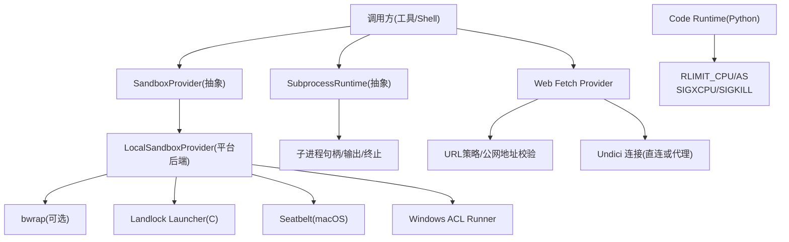
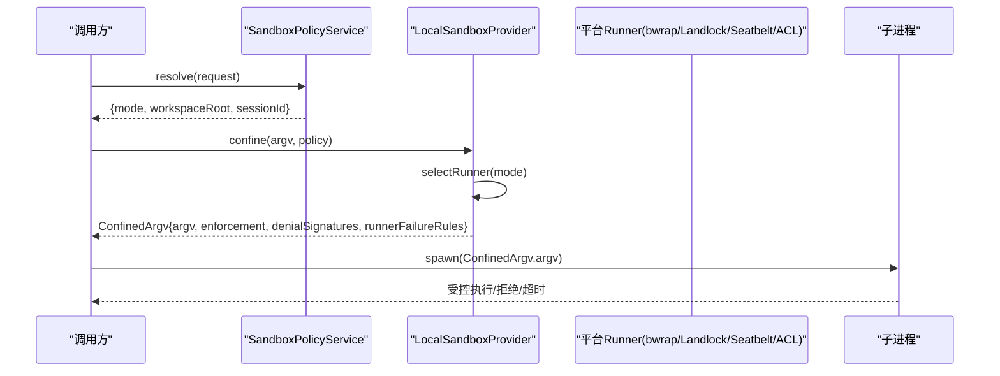
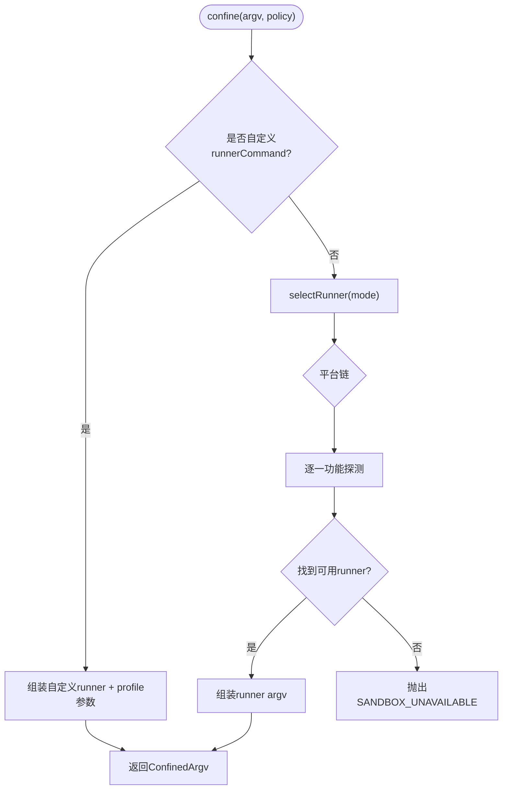
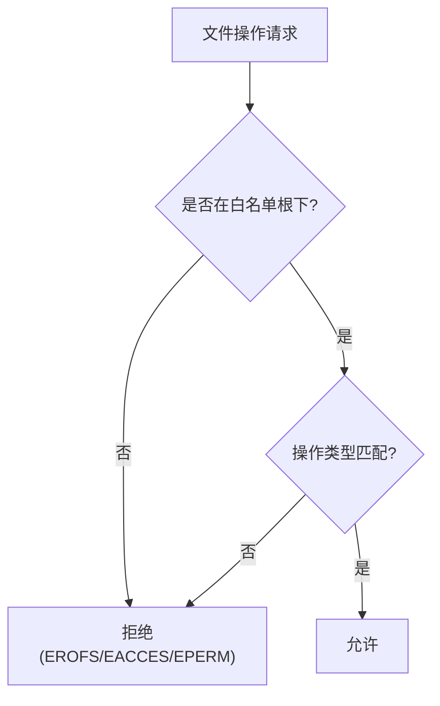
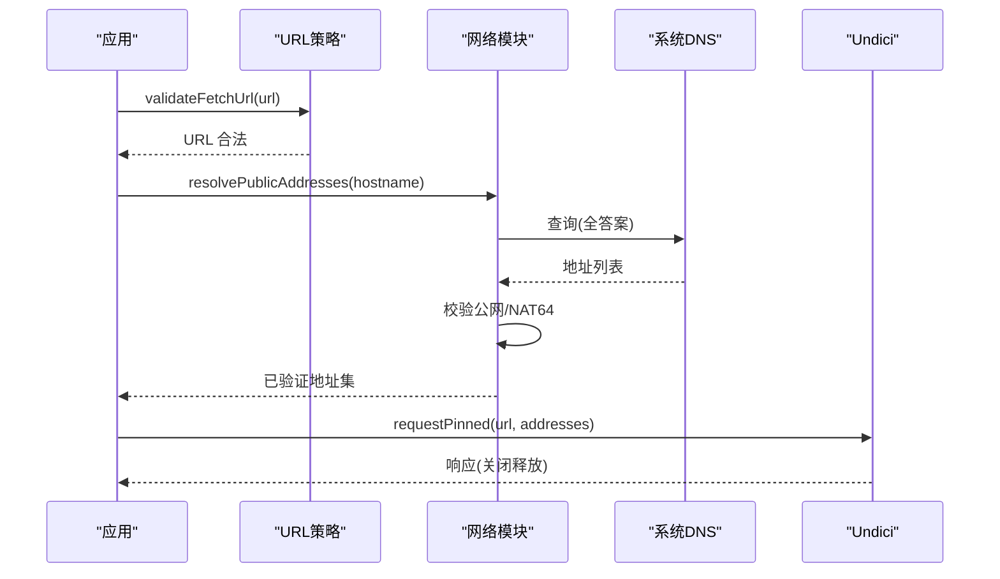
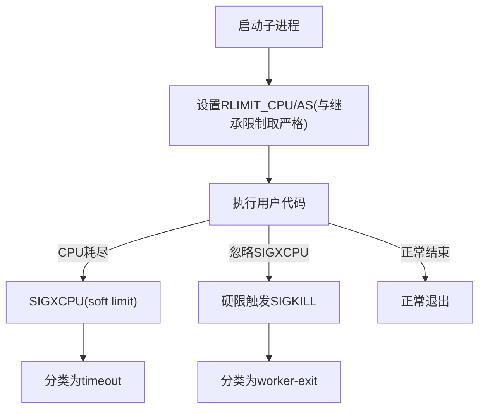
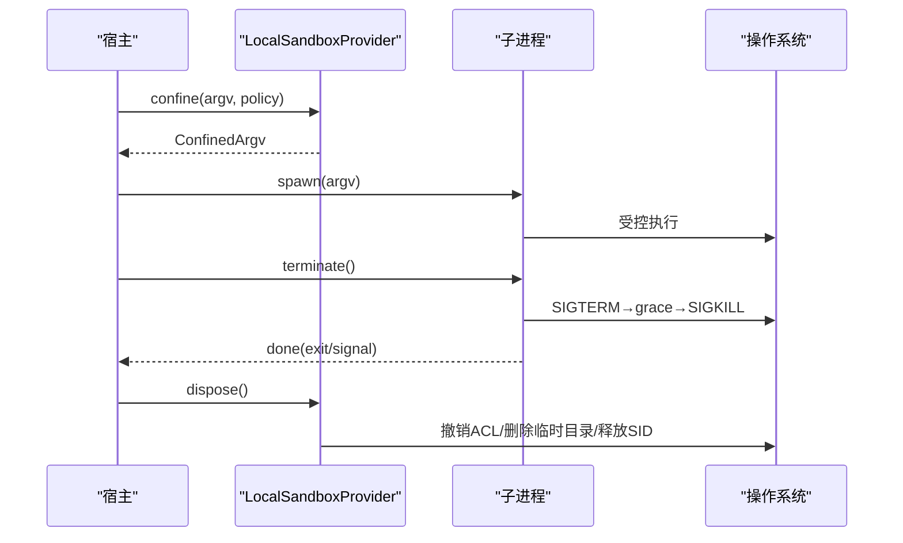
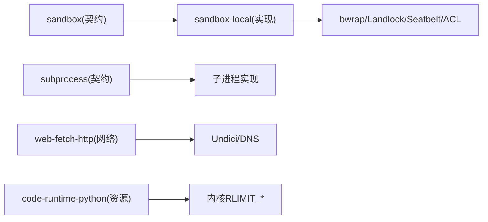

# 工具执行沙箱

<cite>
**本文引用的文件**
- [packages/sandbox/sandbox/src/index.ts](file://packages/sandbox/sandbox/src/index.ts)
- [packages/sandbox/sandbox-local/src/index.ts](file://packages/sandbox/sandbox-local/src/index.ts)
- [native/landlock-run/packages/entry/src/main.c](file://native/landlock-run/packages/entry/src/main.c)
- [docs/subsystems/sandbox.md](file://docs/subsystems/sandbox.md)
- [docs/subsystems/subprocess.md](file://docs/subsystems/subprocess.md)
- [packages/web/web-fetch-http/src/network.ts](file://packages/web/web-fetch-http/src/network.ts)
- [packages/web/web-fetch-http/src/policy.ts](file://packages/web/web-fetch-http/src/policy.ts)
- [packages/experimental/code-runtime-python/py/bootstrap.py](file://packages/experimental/code-runtime-python/py/bootstrap.py)
- [packages/experimental/code-runtime-python/tests/runtime.spec.ts](file://packages/experimental/code-runtime-python/tests/runtime.spec.ts)
</cite>

## 目录
1. [简介](#简介)
2. [项目结构](#项目结构)
3. [核心组件](#核心组件)
4. [架构总览](#架构总览)
5. [详细组件分析](#详细组件分析)
6. [依赖关系分析](#依赖关系分析)
7. [性能考量](#性能考量)
8. [故障排查指南](#故障排查指南)
9. [结论](#结论)
10. [附录](#附录)

## 简介
本文件系统性说明 DeepSeek Harness 工具执行沙箱的安全机制与实现原理，覆盖进程隔离、文件系统访问控制、网络请求过滤、资源监控（内存/CPU）、启动与销毁流程、安全配置最佳实践、常见漏洞防护、性能优化与故障诊断，以及面向开发者的安全工具开发与测试策略。文档以仓库源码为依据，提供可追溯的章节来源与图示来源。

## 项目结构
沙箱由“抽象服务契约 + 平台后端 + 策略服务”组成：
- 抽象契约：定义模式、执行策略、封装 argv、错误码等（sandbox）。
- 本地后端：按平台选择并运行 bwrap/Landlock、Seatbelt、Windows ACL 受限令牌（sandbox-local）。
- 策略服务：解析部署默认、会话覆盖与工作区根（sandbox-policy）。
- 子进程管理：统一的 spawn/handle/输出收集/终止语义（subprocess）。
- 网络限制：web fetch 的 URL 校验、公网地址白名单、DNS 锁定与代理路由（web-fetch-http）。
- 资源限制：Python 代码运行时通过 RLIMIT_CPU/RLIMIT_AS 与信号机制实施 CPU/内存预算（code-runtime-python）。

**图示来源**
- [packages/sandbox/sandbox/src/index.ts:158-176](file://packages/sandbox/sandbox/src/index.ts#L158-L176)
- [packages/sandbox/sandbox-local/src/index.ts:250-333](file://packages/sandbox/sandbox-local/src/index.ts#L250-L333)
- [native/landlock-run/packages/entry/src/main.c:230-299](file://native/landlock-run/packages/entry/src/main.c#L230-L299)
- [docs/subsystems/subprocess.md:89-173](file://docs/subsystems/subprocess.md#L89-L173)
- [packages/web/web-fetch-http/src/network.ts:75-110](file://packages/web/web-fetch-http/src/network.ts#L75-L110)
- [packages/experimental/code-runtime-python/py/bootstrap.py:920-958](file://packages/experimental/code-runtime-python/py/bootstrap.py#L920-L958)

**章节来源**
- [docs/subsystems/sandbox.md:1-221](file://docs/subsystems/sandbox.md#L1-L221)
- [docs/subsystems/subprocess.md:1-325](file://docs/subsystems/subprocess.md#L1-L325)

## 核心组件
- SandboxProvider：定义 confine(argv, policy) 契约，返回受控 argv、执行完整性、拒绝特征与运行器失败规则；禁止静默放行未受控执行。
- LocalSandboxProvider：按平台链选择 runner（Linux: bwrap→Landlock；macOS: Seatbelt；Windows: ACL），功能探测后缓存结果；为 Windows 维护工作区与临时目录的写权限 SID。
- Landlock Launcher（C）：创建规则集、设置 no_new_privs、restrict_self，exec 被包装命令；支持 --probe 报告 ABI 能力。
- SubprocessRuntime：统一 spawn/spec/handle，树级终止（SIGTERM→grace→SIGKILL），收集输出与溢出转储。
- Web Fetch Provider：URL 长度/协议校验、凭据拒绝、仅允许公网 IP、DNS 答案锁定、NAT64 检测、代理路由。
- Python Code Runtime：通过 RLIMIT_CPU/RLIMIT_AS 与 SIGXCPU/SIGKILL 强制 CPU/内存预算，兼容继承限制与信号屏蔽场景。

**章节来源**
- [packages/sandbox/sandbox/src/index.ts:23-176](file://packages/sandbox/sandbox/src/index.ts#L23-L176)
- [packages/sandbox/sandbox-local/src/index.ts:250-568](file://packages/sandbox/sandbox-local/src/index.ts#L250-L568)
- [native/landlock-run/packages/entry/src/main.c:1-299](file://native/landlock-run/packages/entry/src/main.c#L1-L299)
- [docs/subsystems/subprocess.md:89-240](file://docs/subsystems/subprocess.md#L89-L240)
- [packages/web/web-fetch-http/src/policy.ts:41-67](file://packages/web/web-fetch-http/src/policy.ts#L41-L67)
- [packages/web/web-fetch-http/src/network.ts:75-110](file://packages/web/web-fetch-http/src/network.ts#L75-L110)
- [packages/experimental/code-runtime-python/py/bootstrap.py:920-958](file://packages/experimental/code-runtime-python/py/bootstrap.py#L920-L958)

## 架构总览
沙箱将“策略决定”和“平台执行”解耦：上层消费方只关心 per-call 的 SandboxPolicy（mode/workspaceRoot/sessionId），由 sandbox-local 选择具体 runner 并返回 ConfinedArgv；子进程通过 subprocess 统一管理生命周期；网络访问由 web-fetch-http 在应用层做白名单与地址锁定；计算资源由运行时内核限制与信号兜底。

**图示来源**
- [packages/sandbox/sandbox/src/index.ts:158-176](file://packages/sandbox/sandbox/src/index.ts#L158-L176)
- [packages/sandbox/sandbox-local/src/index.ts:316-343](file://packages/sandbox/sandbox-local/src/index.ts#L316-L343)
- [docs/subsystems/subprocess.md:89-173](file://docs/subsystems/subprocess.md#L89-L173)

## 详细组件分析

### 进程隔离与子进程创建
- 模式与执行完整性：read-only、workspace-write、danger-full-access；full/partial 表示后端对承诺的文件效果是否完全约束。
- 平台链选择：Linux 优先 bwrap（挂载视图更接近模式词汇），回退到 Landlock；macOS 使用 Seatbelt；Windows 使用 ACL 受限令牌。
- 功能探测：对候选 runner 进行一次性探测（如 bwrap 最小 profile、Landlock --probe、Seatbelt sandbox-exec -p），结果缓存。
- 失败关闭：无可用后端时抛出 SANDBOX_UNAVAILABLE，绝不静默放行。

**图示来源**
- [packages/sandbox/sandbox-local/src/index.ts:316-343](file://packages/sandbox/sandbox-local/src/index.ts#L316-L343)
- [packages/sandbox/sandbox-local/src/index.ts:492-539](file://packages/sandbox/sandbox-local/src/index.ts#L492-L539)

**章节来源**
- [docs/subsystems/sandbox.md:9-39](file://docs/subsystems/sandbox.md#L9-L39)
- [packages/sandbox/sandbox-local/src/index.ts:159-187](file://packages/sandbox/sandbox-local/src/index.ts#L159-L187)
- [packages/sandbox/sandbox-local/src/index.ts:492-539](file://packages/sandbox/sandbox-local/src/index.ts#L492-L539)

### 文件系统访问控制（路径白名单、权限验证、审计）
- 白名单模型：Landlock 通过 --ro/--rw 路径建立“允许列表”，其余全部拒绝；bwrap 通过只读绑定与 chroot/jail 视图限制可见性；Seatbelt 使用 deny-file-write* 等策略；Windows ACL 基于 SID 的工作区与临时目录写权限。
- 权限验证：Landlock 在创建规则前打开 grant root，若不可打开则失败关闭；读写路径需满足包含关系；特殊路径（/dev/null、/dev/zero）作为必要 sink 放行。
- 审计与诊断：每个 runner 提供 denialSignatures（如“permission denied”、“access is denied”），配合 runnerFailureRules 区分“运行器失败”与“命令被拒绝”。

**图示来源**
- [native/landlock-run/packages/entry/src/main.c:193-218](file://native/landlock-run/packages/entry/src/main.c#L193-L218)
- [packages/sandbox/sandbox-local/src/index.ts:200-213](file://packages/sandbox/sandbox-local/src/index.ts#L200-L213)

**章节来源**
- [native/landlock-run/packages/entry/src/main.c:193-218](file://native/landlock-run/packages/entry/src/main.c#L193-L218)
- [packages/sandbox/sandbox-local/src/index.ts:200-240](file://packages/sandbox/sandbox-local/src/index.ts#L200-L240)

### 网络请求过滤（URL白名单、协议限制、数据传输监控）
- URL 策略：最大长度限制、仅允许 http/https、拒绝带凭据的 URL、同源重定向拒绝。
- 地址白名单：DNS 解析一次并校验所有答案必须为公网单播；NAT64 场景下翻译后的 IPv4 也需公网；非公网字面量直接拒绝。
- 传输锁定：为每次请求创建专用 Agent，lookup 回调固定为已验证地址集合，防止 DNS 劫持与重绑定。
- 代理路由：当经代理时，不锁定地址（由代理负责解析），否则直连走 pinned 连接。

**图示来源**
- [packages/web/web-fetch-http/src/policy.ts:41-67](file://packages/web/web-fetch-http/src/policy.ts#L41-L67)
- [packages/web/web-fetch-http/src/network.ts:75-110](file://packages/web/web-fetch-http/src/network.ts#L75-L110)
- [packages/web/web-fetch-http/src/network.ts:191-212](file://packages/web/web-fetch-http/src/network.ts#L191-L212)

**章节来源**
- [packages/web/web-fetch-http/src/policy.ts:41-67](file://packages/web/web-fetch-http/src/policy.ts#L41-L67)
- [packages/web/web-fetch-http/src/network.ts:75-110](file://packages/web/web-fetch-http/src/network.ts#L75-L110)
- [packages/web/web-fetch-http/src/network.ts:191-212](file://packages/web/web-fetch-http/src/network.ts#L191-L212)

### 内存与CPU时间监控（资源配额与超限处理）
- CPU 预算：Python 运行时通过 RLIMIT_CPU 设置软/硬限制；为避免硬限直接 SIGKILL 导致分类丢失，软限通常比硬限低 1 秒以便触发 SIGXCPU；即使程序忽略 SIGXCPU，硬限仍会 SIGKILL 兜底。
- 内存预算：RLIMIT_AS 限制虚拟内存；与继承限制取严格者，确保不会放宽限制。
- 超时与退出：CPU 超时会以 SIGXCPU 分类为 timeout；若无法产生 SIGXCPU（如极小硬限），则以 worker-exit 分类，但保证进程终止。

**图示来源**
- [packages/experimental/code-runtime-python/py/bootstrap.py:920-958](file://packages/experimental/code-runtime-python/py/bootstrap.py#L920-L958)
- [packages/experimental/code-runtime-python/tests/runtime.spec.ts:3379-3397](file://packages/experimental/code-runtime-python/tests/runtime.spec.ts#L3379-L3397)

**章节来源**
- [packages/experimental/code-runtime-python/py/bootstrap.py:920-958](file://packages/experimental/code-runtime-python/py/bootstrap.py#L920-L958)
- [packages/experimental/code-runtime-python/tests/runtime.spec.ts:3185-3397](file://packages/experimental/code-runtime-python/tests/runtime.spec.ts#L3185-L3397)

### 沙箱环境启动与销毁流程
- 启动：resolve() 确定 mode/workspaceRoot/sessionId → confine() 选择 runner 并返回 ConfinedArgv → spawn(argv) 启动受控进程。
- 监控：子进程 handle 提供 done/collected/terminate/waitForExit；tree-scoped 终止（SIGTERM→grace→SIGKILL）。
- 销毁：provider dispose 撤销 ACL 临时写权限、删除私有临时目录、释放 SID；Landlock 规则随进程退出回收；bwrap/Seatbelt 容器随子进程退出清理。

**图示来源**
- [packages/sandbox/sandbox-local/src/index.ts:316-343](file://packages/sandbox/sandbox-local/src/index.ts#L316-L343)
- [docs/subsystems/subprocess.md:132-173](file://docs/subsystems/subprocess.md#L132-L173)
- [packages/sandbox/sandbox-local/src/index.ts:445-477](file://packages/sandbox/sandbox-local/src/index.ts#L445-L477)

**章节来源**
- [docs/subsystems/subprocess.md:89-173](file://docs/subsystems/subprocess.md#L89-L173)
- [packages/sandbox/sandbox-local/src/index.ts:445-477](file://packages/sandbox/sandbox-local/src/index.ts#L445-L477)

### 安全配置最佳实践与常见漏洞防护
- 始终使用 confined 模式（避免 danger-full-access），仅在明确审批与隔离前提下升级。
- 明确 workspaceRoot 与工作区边界，避免跨工作区写入；Windows 使用独立临时目录与 SID 隔离。
- 网络侧仅允许公网地址，禁用凭据 URL，启用 NAT64 检测；生产环境建议强制代理并记录日志。
- 资源配额：为 Python 任务设置合理的 cpuSeconds 与 maxWallMs；注意继承限制可能更严格。
- 审计：利用 denialSignatures 与 runnerFailureRules 区分“运行器失败”和“命令被拒绝”，便于排障与安全告警。

[本节为通用指导，不直接分析具体文件]

### 性能优化技巧
- 平台链缓存：sandbox-local 对 runner 选择与探测结果缓存，减少重复开销。
- 网络连接复用：代理路径使用进程级 dispatcher 共享连接池；直连路径为单次请求创建专用 Agent 并立即释放。
- 输出收集：子进程输出采用有界缓冲与 spill 文件，避免 OOM；offset-based reader 允许多读者无损读取。
- 资源限制：合理设置 RLIMIT_CPU/AS，避免频繁 SIGKILL 带来的重启成本。

[本节为通用指导，不直接分析具体文件]

### 故障诊断方法
- 运行器失败：检查 stderr 中 runnerFailureRules 匹配的致命签名与 exit code 门限。
- 拒绝原因：根据所选 runner 的 denialSignatures 判断（如“permission denied”、“access is denied”）。
- 网络问题：确认 URL 长度/协议/凭据合法性；检查 DNS 是否解析到非公网地址；查看 NAT64 翻译结果。
- 资源问题：观察是否因 SIGXCPU/SIGKILL 退出；核对继承限制与配置限制。

**章节来源**
- [packages/sandbox/sandbox-local/src/index.ts:200-240](file://packages/sandbox/sandbox-local/src/index.ts#L200-L240)
- [packages/web/web-fetch-http/src/policy.ts:41-67](file://packages/web/web-fetch-http/src/policy.ts#L41-L67)
- [packages/web/web-fetch-http/src/network.ts:75-110](file://packages/web/web-fetch-http/src/network.ts#L75-L110)
- [packages/experimental/code-runtime-python/tests/runtime.spec.ts:3185-3397](file://packages/experimental/code-runtime-python/tests/runtime.spec.ts#L3185-L3397)

## 依赖关系分析
- 抽象与实现分离：sandbox 定义契约，sandbox-local 提供多平台实现；subprocess 抽象子进程行为，web-fetch-http 抽象网络访问。
- 外部依赖：bwrap、Landlock 内核 API、Seatbelt、Windows ACL；网络层依赖 Undici；Python 运行时依赖内核 RLIMIT_*。
- 耦合点：policy 与 provider 的 mode/workspaceRoot 约定；denialSignatures/runnerFailureRules 的跨后端一致性。

**图示来源**
- [packages/sandbox/sandbox/src/index.ts:158-176](file://packages/sandbox/sandbox/src/index.ts#L158-L176)
- [packages/sandbox/sandbox-local/src/index.ts:250-343](file://packages/sandbox/sandbox-local/src/index.ts#L250-L343)
- [packages/web/web-fetch-http/src/network.ts:191-212](file://packages/web/web-fetch-http/src/network.ts#L191-L212)
- [packages/experimental/code-runtime-python/py/bootstrap.py:920-958](file://packages/experimental/code-runtime-python/py/bootstrap.py#L920-L958)

**章节来源**
- [docs/subsystems/sandbox.md:1-221](file://docs/subsystems/sandbox.md#L1-L221)
- [docs/subsystems/subprocess.md:1-325](file://docs/subsystems/subprocess.md#L1-L325)

## 性能考量
- 避免不必要的重新探测：sandbox-local 缓存 runner 选择结果。
- 控制输出体积：子进程输出使用有界缓冲与 spill 文件，降低内存峰值。
- 网络连接池：代理路径复用连接；直连路径短生命周期 Agent 及时释放。
- 资源配额调优：CPU/内存限制与继承限制协同，减少误杀与重启。

[本节为通用指导，不直接分析具体文件]

## 故障排查指南
- 确认模式与完整性：检查 mode/workspaceRoot 是否正确；关注 full/partial 差异。
- 定位拒绝来源：依据 denialSignatures 与 runnerFailureRules 区分“运行器失败”与“命令被拒绝”。
- 网络连通性：验证 URL 策略、DNS 答案、NAT64 翻译；必要时启用代理并审查日志。
- 资源越界：检查 RLIMIT_* 与信号分类；确认继承限制未被意外放宽。

**章节来源**
- [packages/sandbox/sandbox-local/src/index.ts:200-240](file://packages/sandbox/sandbox-local/src/index.ts#L200-L240)
- [packages/web/web-fetch-http/src/policy.ts:41-67](file://packages/web/web-fetch-http/src/policy.ts#L41-L67)
- [packages/web/web-fetch-http/src/network.ts:75-110](file://packages/web/web-fetch-http/src/network.ts#L75-L110)
- [packages/experimental/code-runtime-python/tests/runtime.spec.ts:3185-3397](file://packages/experimental/code-runtime-python/tests/runtime.spec.ts#L3185-L3397)

## 结论
DeepSeek Harness 的工具执行沙箱通过“策略驱动 + 平台后端”的解耦设计，结合 Landlock/bwrap/Seatbelt/ACL 的多层约束，实现了严格的进程隔离与文件系统访问控制；在网络侧通过 URL 策略与公网地址锁定保障出站安全；在资源侧通过 RLIMIT_* 与信号机制确保 CPU/内存预算。整体遵循失败关闭原则，并提供完善的诊断与可观测性，适合在生产环境中安全地执行不可信工具。

[本节为总结，不直接分析具体文件]

## 附录
- 开发者指导原则
  - 始终显式指定 spawn spec（cwd/stdio/grace/env），避免隐式默认。
  - 使用 ctx.sandboxPolicy.resolve() 获取 per-call 策略，避免全局状态污染。
  - 对网络请求使用 validateFetchUrl 与 resolvePublicAddresses，禁止凭据 URL。
  - 为 Python 任务设置合理的 cpuSeconds/maxWallMs，并考虑继承限制。
- 测试策略
  - 针对各 runner 的 denialSignatures 与 runnerFailureRules 编写用例，覆盖“运行器失败”与“命令被拒绝”。
  - 模拟 DNS 返回非公网地址与 NAT64 场景，验证阻断逻辑。
  - 注入 RLIMIT_* 与信号屏蔽，验证 CPU/内存预算与兜底终止。

[本节为通用指导，不直接分析具体文件]