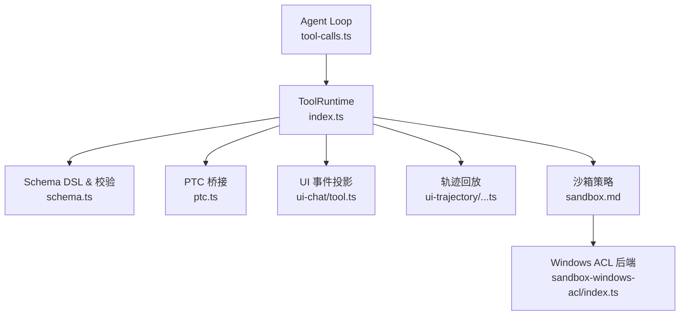
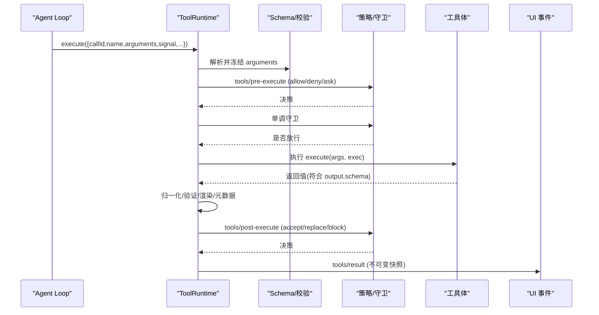
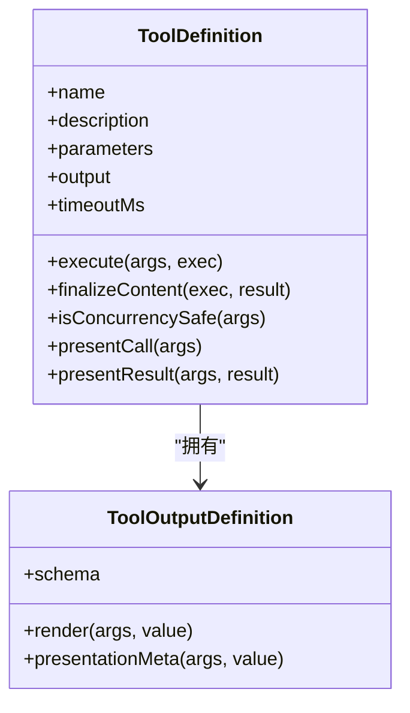
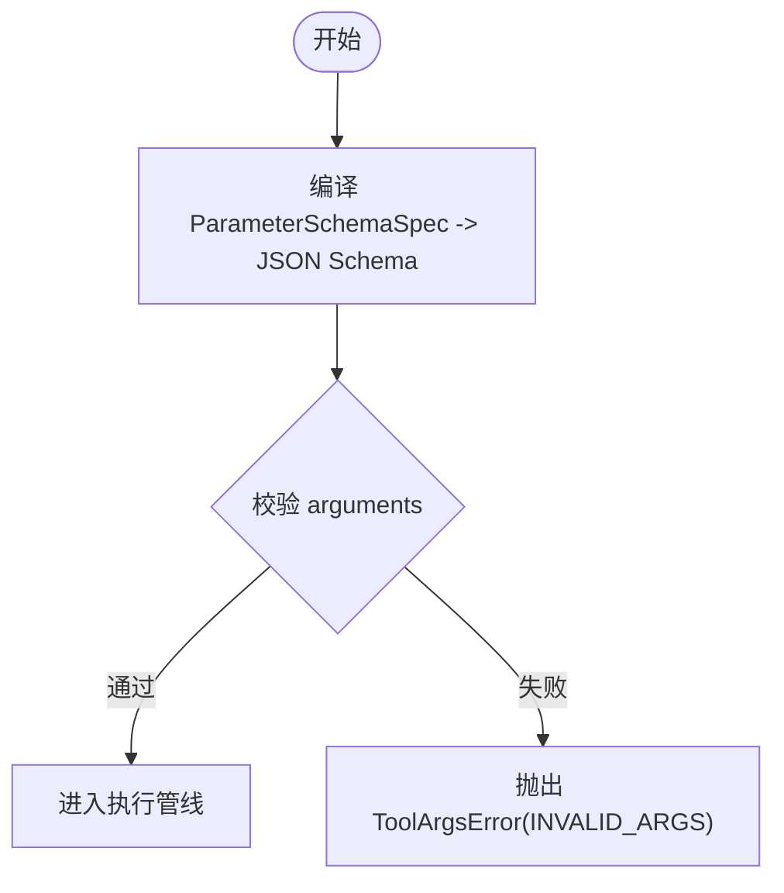
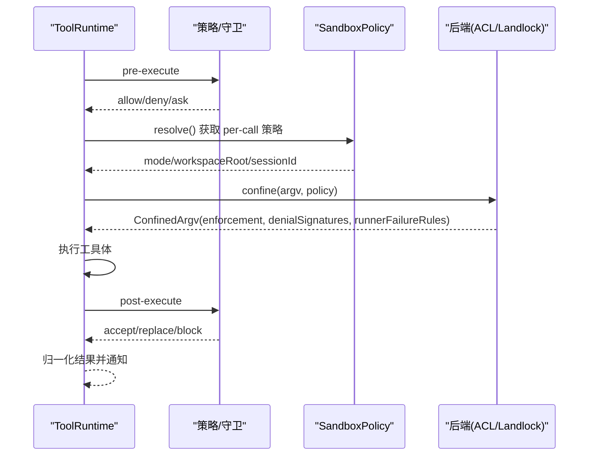
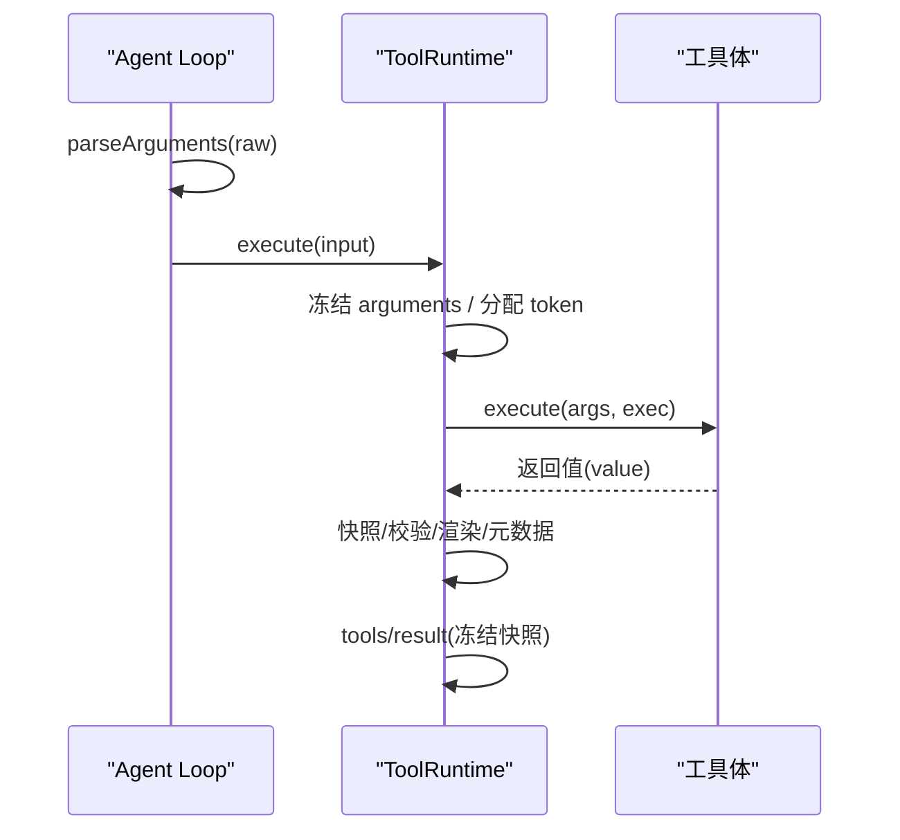
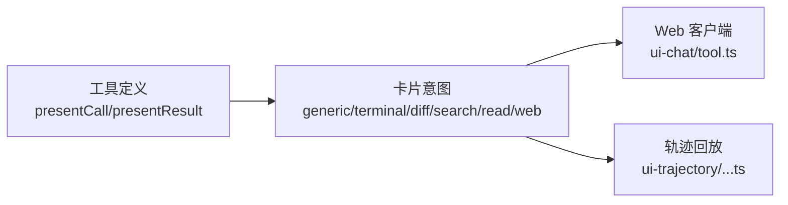
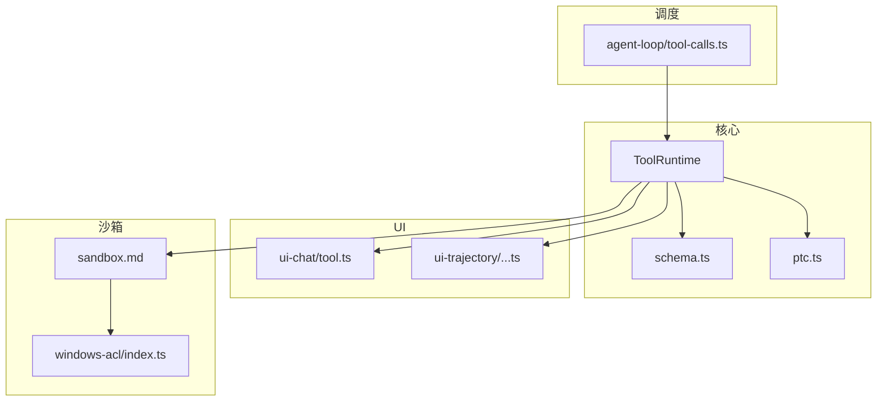

# 工具执行管道

<cite>
**本文引用的文件**
- [packages/core/tools/src/index.ts](file://packages/core/tools/src/index.ts)
- [packages/core/tools/src/schema.ts](file://packages/core/tools/src/schema.ts)
- [packages/core/tools/src/ptc.ts](file://packages/core/tools/src/ptc.ts)
- [packages/core/agent-loop/src/tool-calls.ts](file://packages/core/agent-loop/src/tool-calls.ts)
- [docs/subsystems/tools.md](file://docs/subsystems/tools.md)
- [docs/subsystems/sandbox.md](file://docs/subsystems/sandbox.md)
- [packages/sandbox/sandbox-windows-acl/src/index.ts](file://packages/sandbox/sandbox-windows-acl/src/index.ts)
- [packages/client/ui-chat/src/client/conversation-nodes/tool.ts](file://packages/client/ui-chat/src/client/conversation-nodes/tool.ts)
- [packages/client/ui-trajectory/src/client/trajectory-tool-definition.ts](file://packages/client/ui-trajectory/src/client/trajectory-tool-definition.ts)
- [packages/extensions/cordis-host-runner/src/guard.ts](file://packages/extensions/cordis-host-runner/src/guard.ts)
- [docs/cookbook/adding-a-tool.md](file://docs/cookbook/adding-a-tool.md)
</cite>

## 目录
1. [简介](#简介)
2. [项目结构](#项目结构)
3. [核心组件](#核心组件)
4. [架构总览](#架构总览)
5. [详细组件分析](#详细组件分析)
6. [依赖关系分析](#依赖关系分析)
7. [性能考量](#性能考量)
8. [故障排查指南](#故障排查指南)
9. [结论](#结论)
10. [附录](#附录)

## 简介
本文件系统性说明 DeepSeek Harness 的工具执行管道：从工具注册与发现、参数 Schema 校验、执行流水线（前置策略、守卫、环绕、后置策略、结果归一化）、到安全沙箱隔离、异步调用与结果返回机制，以及 UI 展示与交互模式。面向希望开发、集成和运维工具的工程师，提供可操作的参考与实践建议。

## 项目结构
围绕“工具”的核心代码主要分布在以下位置：
- 工具注册与执行管线：packages/core/tools/src/index.ts
- 统一 JSON Schema DSL 与参数校验：packages/core/tools/src/schema.ts
- PTC（程序即工具）桥接与日志裁剪：packages/core/tools/src/ptc.ts
- Agent 循环中的并行调度与解析：packages/core/agent-loop/src/tool-calls.ts
- 子系统文档：docs/subsystems/tools.md、docs/subsystems/sandbox.md
- 沙箱后端实现（Windows ACL）：packages/sandbox/sandbox-windows-acl/src/index.ts
- UI 侧工具事件投影与卡片渲染：packages/client/ui-chat/src/client/conversation-nodes/tool.ts、packages/client/ui-trajectory/src/client/trajectory-tool-definition.ts
- Host 端 defineTool 校验增强：packages/extensions/cordis-host-runner/src/guard.ts
- 工具开发指南：docs/cookbook/adding-a-tool.md

图表来源
- [packages/core/agent-loop/src/tool-calls.ts:71-111](file://packages/core/agent-loop/src/tool-calls.ts#L71-L111)
- [packages/core/tools/src/index.ts:780-800](file://packages/core/tools/src/index.ts#L780-L800)
- [packages/core/tools/src/schema.ts:444-480](file://packages/core/tools/src/schema.ts#L444-L480)
- [packages/core/tools/src/ptc.ts:145-176](file://packages/core/tools/src/ptc.ts#L145-L176)
- [docs/subsystems/sandbox.md:9-39](file://docs/subsystems/sandbox.md#L9-L39)
- [packages/sandbox/sandbox-windows-acl/src/index.ts:213-236](file://packages/sandbox/sandbox-windows-acl/src/index.ts#L213-L236)

章节来源
- [packages/core/agent-loop/src/tool-calls.ts:71-111](file://packages/core/agent-loop/src/tool-calls.ts#L71-L111)
- [packages/core/tools/src/index.ts:780-800](file://packages/core/tools/src/index.ts#L780-L800)
- [docs/subsystems/tools.md:1-12](file://docs/subsystems/tools.md#L1-L12)

## 核心组件
- ToolDefinition：一个已注册工具的定义，包含模型可见的元数据、输出契约、执行函数、可选的内容最终处理、超时预算、并发安全标识、以及 UI 呈现钩子。
- ToolRuntime：工具注册表与执行管线，负责参数冻结、策略拦截、执行调度、结果归一化与通知。
- Schema DSL：统一的 ValueSchemaSpec/ParameterSchemaSpec，用于声明参数与输出的类型约束，并提供 validateArgs 进行运行时校验。
- PTC 桥：在 PTC 模式下将 SDK 调用映射为原生工具执行，并支持对持久化日志的可控裁剪。
- 沙箱策略：以 per-call 策略决定文件系统访问边界，并通过平台后端实现强制或半强制隔离。
- UI 呈现：通过 presentCall/presentResult 返回中性“卡片意图”，由宿主/客户端映射为具体视图。

章节来源
- [packages/core/tools/src/index.ts:203-280](file://packages/core/tools/src/index.ts#L203-L280)
- [packages/core/tools/src/index.ts:780-800](file://packages/core/tools/src/index.ts#L780-L800)
- [packages/core/tools/src/schema.ts:444-480](file://packages/core/tools/src/schema.ts#L444-L480)
- [packages/core/tools/src/ptc.ts:145-176](file://packages/core/tools/src/ptc.ts#L145-L176)
- [docs/subsystems/sandbox.md:9-39](file://docs/subsystems/sandbox.md#L9-L39)
- [docs/subsystems/tools.md:459-468](file://docs/subsystems/tools.md#L459-L468)

## 架构总览
工具执行从 Agent Loop 发起，进入 ToolRuntime 的执行管线，依次经过：
- 输入规范化与参数冻结
- tools/pre-execute（允许/拒绝/询问）
- 单调守卫（ToolGuard）
- tools/execute（环绕：超时、重试、指标等）
- 工具体执行
- tools/post-execute（接受/替换内容或值/阻断）
- 定义级 finalizeContent（可选）
- tools/result（不可变结果的最终观察者）

图表来源
- [packages/core/tools/src/index.ts:129-200](file://packages/core/tools/src/index.ts#L129-L200)
- [packages/core/tools/src/index.ts:1647-1667](file://packages/core/tools/src/index.ts#L1647-L1667)
- [packages/core/agent-loop/src/tool-calls.ts:71-111](file://packages/core/agent-loop/src/tool-calls.ts#L71-L111)

## 详细组件分析

### 工具注册与发现：ToolDefinition 与 defineTool
- ToolDefinition 字段要点：
  - name/description/parameters：模型可见的 Schema 描述
  - output：必须声明，包含 schema 与 render，以及可选 presentationMeta
  - execute：执行函数，仅返回符合 output.schema 的纯 JSON 值
  - finalizeContent：可选，最后一步内容转换（失败路径也会触发）
  - timeoutMs：协作式超时预算（由外部包装器执行）
  - isConcurrencySafe：可选，标记该调用可与兄弟调用并行
  - presentCall/presentResult：可选，UI 呈现意图
- defineTool：将作者友好的 ParameterSchemaSpec 编译为标准 JSON Schema，并在运行前校验参数；同时推断 execute/render/presentationMeta 的类型。

图表来源
- [packages/core/tools/src/index.ts:203-280](file://packages/core/tools/src/index.ts#L203-L280)
- [docs/subsystems/tools.md:13-94](file://docs/subsystems/tools.md#L13-L94)

章节来源
- [packages/core/tools/src/index.ts:203-280](file://packages/core/tools/src/index.ts#L203-L280)
- [docs/subsystems/tools.md:13-94](file://docs/subsystems/tools.md#L13-L94)
- [packages/core/tools/src/schema.ts:444-480](file://packages/core/tools/src/schema.ts#L444-L480)

### 参数类型验证与 Schema 定义
- 统一 DSL：ValueSchemaSpec 支持 string/number/integer/boolean/null/array/object/json/oneOf；ParameterSchemaSpec 是隐式开放的对象属性映射，required 标注在属性上。
- 编译与校验：parameterSchemaSpecToJsonSchema 编译为标准 JSON Schema；validateArgs 基于该 Schema 校验传入参数，不合法时抛出 ToolArgsError（INVALID_ARGS）。
- 严格子集：raw JSON Schema 使用受支持的子集，不支持的关键字会拒绝而非忽略。

图表来源
- [packages/core/tools/src/schema.ts:444-480](file://packages/core/tools/src/schema.ts#L444-L480)
- [packages/extensions/cordis-host-runner/src/guard.ts:366-384](file://packages/extensions/cordis-host-runner/src/guard.ts#L366-L384)

章节来源
- [packages/core/tools/src/schema.ts:444-480](file://packages/core/tools/src/schema.ts#L444-L480)
- [packages/extensions/cordis-host-runner/src/guard.ts:366-384](file://packages/extensions/cordis-host-runner/src/guard.ts#L366-L384)

### 执行管道与安全沙箱
- 执行阶段：
  - pre-execute：允许/拒绝/询问（需观察信号）
  - 守卫：单调拒绝，后续监听无法撤销
  - execute：可替换信号以实现超时/重试/指标
  - post-execute：接受/替换内容或值/阻断
  - finalizeContent：最后一次内容转换（失败路径也触发）
  - result：不可变快照的最终观察者
- 取消与中止：
  - 若工具体未启动即被取消，返回 ABORTED_BEFORE_DISPATCH
  - 若工具体已启动后被取消，返回 ABORTED
- 沙箱策略：
  - 模式：read-only / workspace-write / danger-full-access
  - 执行策略 per-call，携带 sessionId/workspaceRoot
  - 后端：Linux/macOS/Windows ACL；报告 enforcement=full/partial

图表来源
- [packages/core/tools/src/index.ts:129-200](file://packages/core/tools/src/index.ts#L129-L200)
- [packages/core/tools/src/index.ts:1909-1937](file://packages/core/tools/src/index.ts#L1909-L1937)
- [docs/subsystems/sandbox.md:9-39](file://docs/subsystems/sandbox.md#L9-L39)
- [docs/subsystems/sandbox.md:41-94](file://docs/subsystems/sandbox.md#L41-L94)
- [docs/subsystems/sandbox.md:154-158](file://docs/subsystems/sandbox.md#L154-L158)

章节来源
- [packages/core/tools/src/index.ts:129-200](file://packages/core/tools/src/index.ts#L129-L200)
- [packages/core/tools/src/index.ts:1909-1937](file://packages/core/tools/src/index.ts#L1909-L1937)
- [docs/subsystems/sandbox.md:9-39](file://docs/subsystems/sandbox.md#L9-L39)
- [docs/subsystems/sandbox.md:41-94](file://docs/subsystems/sandbox.md#L41-L94)
- [docs/subsystems/sandbox.md:154-158](file://docs/subsystems/sandbox.md#L154-L158)

### 异步处理流程与结果返回
- 参数解析：Agent Loop 中 parseArguments 尝试 JSON.parse，失败则保留原始文本以便错误提示。
- 并行调度：根据 executionMode 决定串行或并行分组执行；exclusive 形成顺序屏障。
- 结果归一化：成功路径对 body 返回值进行 lossless JSON 快照与校验，再交由 render/presentationMeta；失败路径构造结构化错误信息。
- 通知：tools/result 收到冻结后的执行对象与结果快照。

图表来源
- [packages/core/agent-loop/src/tool-calls.ts:71-111](file://packages/core/agent-loop/src/tool-calls.ts#L71-L111)
- [packages/core/tools/src/index.ts:1647-1667](file://packages/core/tools/src/index.ts#L1647-L1667)

章节来源
- [packages/core/agent-loop/src/tool-calls.ts:71-111](file://packages/core/agent-loop/src/tool-calls.ts#L71-L111)
- [packages/core/tools/src/index.ts:1647-1667](file://packages/core/tools/src/index.ts#L1647-L1667)

### UI 展示与交互设计模式
- 呈现意图：presentCall/presentResult 返回 card-tagged 的 ToolCallView/ToolResultView，如 generic/terminal/diff/search/read/web。
- 客户端投影：ui-chat 与 ui-trajectory 将 tool/call 与 tool/result 事件投影为节点，支持嵌套调用树与中断状态。
- Web 客户端：默认消费 raw 事件，插件可通过 slot 注册自定义视图；Host 的 present* 方法不会自动添加 Web 卡片。

图表来源
- [docs/subsystems/tools.md:459-468](file://docs/subsystems/tools.md#L459-L468)
- [packages/client/ui-chat/src/client/conversation-nodes/tool.ts:35-77](file://packages/client/ui-chat/src/client/conversation-nodes/tool.ts#L35-L77)
- [packages/client/ui-trajectory/src/client/trajectory-tool-definition.ts:45-211](file://packages/client/ui-trajectory/src/client/trajectory-tool-definition.ts#L45-L211)

章节来源
- [docs/subsystems/tools.md:459-468](file://docs/subsystems/tools.md#L459-L468)
- [packages/client/ui-chat/src/client/conversation-nodes/tool.ts:35-77](file://packages/client/ui-chat/src/client/conversation-nodes/tool.ts#L35-L77)
- [packages/client/ui-trajectory/src/client/trajectory-tool-definition.ts:45-211](file://packages/client/ui-trajectory/src/client/trajectory-tool-definition.ts#L45-L211)

### 工具开发完整指南
- 最小形态：使用 defineTool 声明 name/description/parameters/output/execute，注册到 ctx.tools。
- 执行契约：
  - 参数已由 defineTool 校验，但仍需业务层面补充约束
  - 返回值必须是符合 output.schema 的纯 JSON 值
  - 遵守 exec.signal 取消语义
  - 使用 output.presentationMeta 传递可重放的 UI 元数据
  - 长任务通过 jobs API 后台执行，前台保持与 exec.signal 耦合
- 策略与观测：优先使用 pre-execute/guard/execute/post-execute/result 扩展点，避免将部署策略硬编码进工具。
- PTC 模式：无需额外集成即可通过 SDK 调用工具；output.schema 应作为程序化 API 设计。
- UI 规则：presentCall/presentResult 必须纯函数，UI 格式化不应混入模型结果。

章节来源
- [docs/cookbook/adding-a-tool.md:7-66](file://docs/cookbook/adding-a-tool.md#L7-L66)
- [docs/cookbook/adding-a-tool.md:67-98](file://docs/cookbook/adding-a-tool.md#L67-L98)

## 依赖关系分析
- ToolRuntime 依赖：
  - Schema 校验与 DSL（schema.ts）
  - PTC 桥（ptc.ts）
  - 事件系统（pre/around/post/result）
  - 作用域与限制（scope/restrictions）
- Agent Loop 依赖 ToolRuntime 的 executionMode 与 execute，负责分组与调度。
- UI 层依赖事件流（tool/call、tool/result），不直接依赖工具实现。
- 沙箱策略独立于工具逻辑，按 per-call 注入执行上下文。

图表来源
- [packages/core/tools/src/index.ts:780-800](file://packages/core/tools/src/index.ts#L780-L800)
- [packages/core/agent-loop/src/tool-calls.ts:71-111](file://packages/core/agent-loop/src/tool-calls.ts#L71-L111)
- [packages/client/ui-chat/src/client/conversation-nodes/tool.ts:35-77](file://packages/client/ui-chat/src/client/conversation-nodes/tool.ts#L35-L77)
- [packages/client/ui-trajectory/src/client/trajectory-tool-definition.ts:45-211](file://packages/client/ui-trajectory/src/client/trajectory-tool-definition.ts#L45-L211)
- [docs/subsystems/sandbox.md:9-39](file://docs/subsystems/sandbox.md#L9-L39)
- [packages/sandbox/sandbox-windows-acl/src/index.ts:213-236](file://packages/sandbox/sandbox-windows-acl/src/index.ts#L213-L236)

## 性能考量
- 参数与结果快照：所有关键值均进行 lossless JSON 快照与冻结，确保可重放与一致性，但需注意大对象带来的内存与序列化开销。
- 并行调度：通过 isConcurrencySafe 与 executionMode 控制重叠执行，减少不必要的阻塞；注意共享状态并发安全。
- 超时与取消：使用 timeoutMs 与 exec.signal 协作式终止，避免资源泄漏；确保在取消后达到静默态。
- 日志裁剪：PTC 模式下可通过 tools/ptc-dispatch-log 裁剪持久化内容，降低 I/O 与存储压力。
- 沙箱效率：选择合适模式（read-only/workspace-write），避免危险的全权限模式；关注后端 enforcement 完整性（full/partial）。

[本节为通用指导，不直接分析具体文件]

## 故障排查指南
- 参数非法：
  - 现象：工具返回 isError，content 包含 “invalid arguments...”
  - 定位：检查 parameters 与 required 配置，确认传入 arguments 符合 Schema
  - 参考：ToolArgsError 与 validateArgs
- 输出非法：
  - 现象：工具体返回值不符合 output.schema，或 render/presentationMeta 抛出异常
  - 定位：检查 output.schema 与返回值结构，确保可序列化为 lossless JSON
  - 参考：ToolOutputError 与快照/校验逻辑
- 未知工具：
  - 现象：UNKNOWN_TOOL
  - 定位：确认工具已正确注册且未被 restrict 过滤
- 取消与超时：
  - 现象：ABORTED 或 ABORTED_BEFORE_DISPATCH
  - 定位：检查 exec.signal 传播与工具体取消点
- 沙箱失败：
  - 现象：进程启动失败或被拒绝
  - 定位：检查 ConfinedArgv 的 denialSignatures 与 runnerFailureRules，确认后端能力与模式

章节来源
- [packages/core/tools/src/schema.ts:444-480](file://packages/core/tools/src/schema.ts#L444-L480)
- [packages/core/tools/src/index.ts:1909-1937](file://packages/core/tools/src/index.ts#L1909-L1937)
- [docs/subsystems/sandbox.md:154-158](file://docs/subsystems/sandbox.md#L154-L158)

## 结论
DeepSeek Harness 的工具执行管道提供了强类型、可扩展、可观测且安全的执行环境。通过统一的 Schema DSL、严格的参数与输出校验、多阶段策略拦截、协作式取消与超时、以及跨平台的沙箱隔离，开发者可以构建可靠且高性能的工具。配合中性 UI 呈现协议，工具可在不同宿主与客户端获得一致的交互体验。遵循本文的最佳实践与排障指引，可显著提升工具质量与可维护性。

[本节为总结，不直接分析具体文件]

## 附录
- 快速上手：参考工具开发指南，完成最小工具注册与执行。
- 扩展点清单：
  - tools/pre-execute：准入策略
  - tools/execute：环绕（超时/重试/指标）
  - tools/post-execute：结果修正/阻断
  - tools/result：最终观测
  - tools/ptc-dispatch-log：PTC 子调用日志裁剪
- 安全建议：
  - 始终使用受限沙箱模式
  - 谨慎使用 danger-full-access
  - 关注 enforcement 完整性
- 调试技巧：
  - 利用 tools/result 观察冻结后的执行与结果
  - 使用 PTC 日志裁剪控制持久化体积
  - 结合 Agent Loop 的并行调度行为定位瓶颈

[本节为补充信息，不直接分析具体文件]