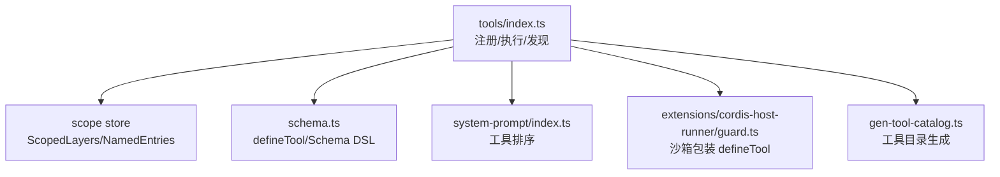
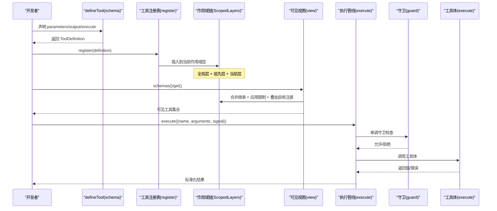
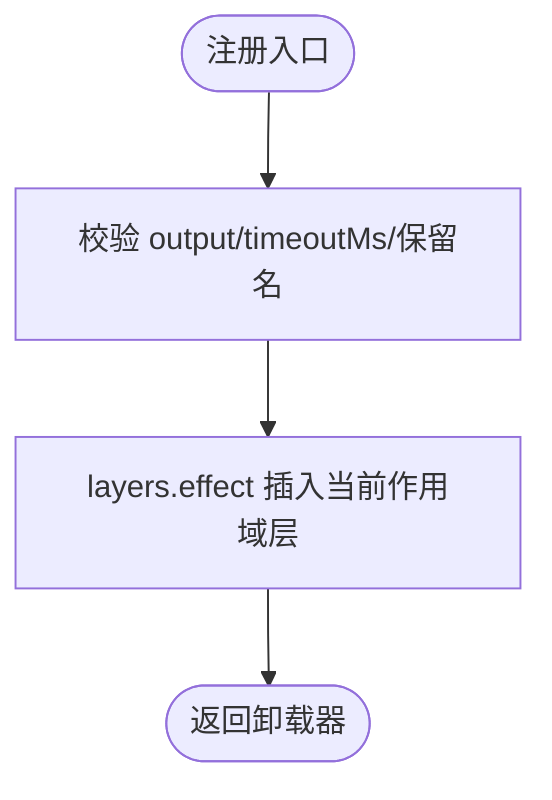
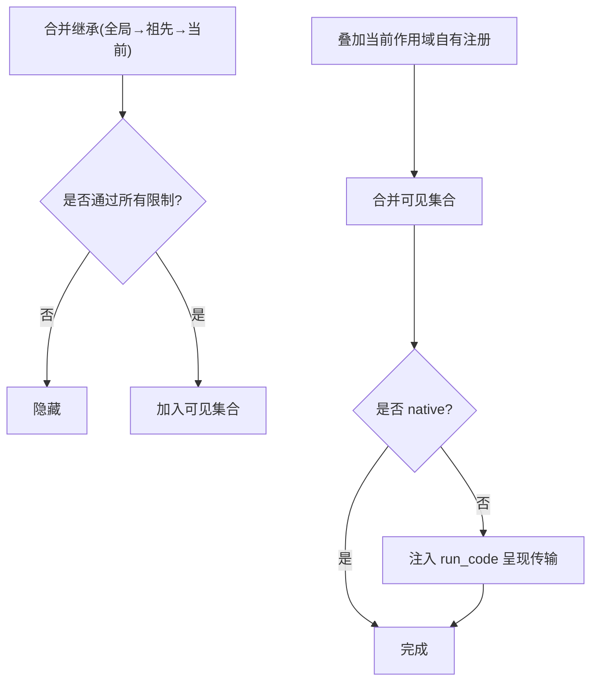
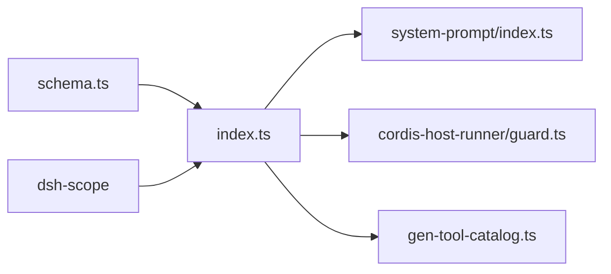

# 工具注册与发现

<cite>
**本文引用的文件**
- [packages/core/tools/src/index.ts](file://packages/core/tools/src/index.ts)
- [packages/core/tools/src/schema.ts](file://packages/core/tools/src/schema.ts)
- [packages/core/tools/tests/tools.spec.ts](file://packages/core/tools/tests/tools.spec.ts)
- [packages/core/tools/tests/scoped.spec.ts](file://packages/core/tools/tests/scoped.spec.ts)
- [packages/extensions/cordis-host-runner/src/guard.ts](file://packages/extensions/cordis-host-runner/src/guard.ts)
- [packages/core/system-prompt/src/index.ts](file://packages/core/system-prompt/src/index.ts)
- [scripts/gen-tool-catalog.ts](file://scripts/gen-tool-catalog.ts)
- [docs/subsystems/tools.md](file://docs/subsystems/tools.md)
</cite>

## 目录
1. [简介](#简介)
2. [项目结构](#项目结构)
3. [核心组件](#核心组件)
4. [架构总览](#架构总览)
5. [详细组件分析](#详细组件分析)
6. [依赖关系分析](#依赖关系分析)
7. [性能考虑](#性能考虑)
8. [故障排查指南](#故障排查指南)
9. [结论](#结论)
10. [附录](#附录)

## 简介
本文件系统性说明 DeepSeek Harness 的工具注册与发现机制，覆盖 ToolDefinition 接口、defineTool DSL、参数 Schema 与类型推断、工具注册表的作用域管理与版本控制策略、工具发现的算法与优先级规则、ToolRestriction 的作用机制，以及完整示例与最佳实践。目标是帮助开发者快速理解并安全地扩展工具能力。

## 项目结构
围绕工具注册与发现的核心代码集中在 core/tools 包中，并通过 scope 层提供作用域管理；系统提示组装负责工具排序；文档与生成脚本维护模型可见的 Schema 目录。

图表来源
- [packages/core/tools/src/index.ts:1022-1183](file://packages/core/tools/src/index.ts#L1022-L1183)
- [packages/core/scope/src/store.ts:185-217](file://packages/core/scope/src/store.ts#L185-L217)
- [packages/core/tools/src/schema.ts:545-618](file://packages/core/tools/src/schema.ts#L545-L618)
- [packages/core/system-prompt/src/index.ts:200-224](file://packages/core/system-prompt/src/index.ts#L200-L224)
- [packages/extensions/cordis-host-runner/src/guard.ts:560-655](file://packages/extensions/cordis-host-runner/src/guard.ts#L560-L655)
- [scripts/gen-tool-catalog.ts:617-652](file://scripts/gen-tool-catalog.ts#L617-L652)

章节来源
- [packages/core/tools/src/index.ts:1022-1183](file://packages/core/tools/src/index.ts#L1022-L1183)
- [packages/core/tools/src/schema.ts:545-618](file://packages/core/tools/src/schema.ts#L545-L618)
- [packages/core/system-prompt/src/index.ts:200-224](file://packages/core/system-prompt/src/index.ts#L200-L224)
- [packages/extensions/cordis-host-runner/src/guard.ts:560-655](file://packages/extensions/cordis-host-runner/src/guard.ts#L560-L655)
- [scripts/gen-tool-catalog.ts:617-652](file://scripts/gen-tool-catalog.ts#L617-L652)

## 核心组件
- ToolDefinition：已注册工具的契约，包含 name、description、parameters、output（schema/render/presentationMeta）、execute、可选 finalizeContent、timeoutMs、isConcurrencySafe、presentCall/presentResult。
- defineTool：DSL，将作者友好的参数 Schema 与输出 Schema 编译为标准 JSON Schema，并在 execute 前进行参数校验，同时为 present* 和 isConcurrencySafe 提供软校验以兼容回放。
- 工具注册表（ToolRuntime）：基于 ScopedLayers 维护全局与多作用域的注册、限制与守卫；提供 register/restrict/guard/get/schemas/executionMode/execute 等 API。
- ToolRestriction：对“继承”的工具集进行 allow/deny 过滤，多个限制取交集；作用域内自有注册不受限制影响。
- 工具发现与排序：按作用域链合并可见工具，应用限制后叠加作用域自有注册；系统提示阶段按配置顺序或字典序排列。

章节来源
- [docs/subsystems/tools.md:9-96](file://docs/subsystems/tools.md#L9-L96)
- [packages/core/tools/src/schema.ts:545-618](file://packages/core/tools/src/schema.ts#L545-L618)
- [packages/core/tools/src/index.ts:1022-1183](file://packages/core/tools/src/index.ts#L1022-L1183)
- [packages/core/system-prompt/src/index.ts:200-224](file://packages/core/system-prompt/src/index.ts#L200-L224)

## 架构总览
下图展示从定义到注册、发现、执行的端到端流程，包括作用域链、限制与守卫。

图表来源
- [packages/core/tools/src/schema.ts:545-618](file://packages/core/tools/src/schema.ts#L545-L618)
- [packages/core/tools/src/index.ts:1022-1183](file://packages/core/tools/src/index.ts#L1022-L1183)
- [packages/core/tools/src/index.ts:1091-1119](file://packages/core/tools/src/index.ts#L1091-L1119)

## 详细组件分析

### ToolDefinition 接口与必需字段
- name：工具唯一标识，保留名 run_code 不可注册或遮蔽。
- description：面向模型的描述。
- parameters：由 defineTool 编译为标准 JSON Schema 的参数对象。
- output：必须包含 schema（标准 JSON Schema）、render（将规范化值转为内容块），可选 presentationMeta（顶层调用的可重放呈现元数据）。
- execute：接收已校验的参数与执行上下文，返回符合 output.schema 的值。
- 可选：finalizeContent（最终内容转换）、timeoutMs（超时预算，正有限数）、isConcurrencySafe（并行分组判定）、presentCall/presentResult（UI 呈现意图）。

章节来源
- [docs/subsystems/tools.md:9-96](file://docs/subsystems/tools.md#L9-L96)
- [packages/core/tools/src/index.ts:1022-1053](file://packages/core/tools/src/index.ts#L1022-L1053)

### defineTool DSL、参数 Schema 与类型推断
- 作者使用 ValueSchemaSpec 描述参数与输出，支持标量、数组、对象、json、oneOf。
- parameterSchemaSpecToJsonSchema 将隐式属性 map 编译为标准 JSON Schema（含 required 数组）。
- valueSchemaSpecToJsonSchema 编译输出 Schema。
- 类型推断：InferArgs<S> 根据 required 标注推导参数键的可选项；InferValue<O> 根据输出 Schema 推导返回值类型，最多递归 16 层，超出回退到 JsonValue。
- 运行时校验：execute 前用 validateJsonSchemaValue 校验参数，失败抛出 ToolArgsError；输出值在成功路径被快照并校验。

章节来源
- [packages/core/tools/src/schema.ts:545-618](file://packages/core/tools/src/schema.ts#L545-L618)
- [packages/core/tools/tests/tools.spec.ts:2053-2077](file://packages/core/tools/tests/tools.spec.ts#L2053-L2077)

### 工具注册表内部实现与作用域管理
- 注册：register 会校验 output、timeoutMs 与保留名，然后通过 layers.effect 在当前作用域层插入工具，返回精确的卸载函数。
- 作用域链：ScopedLayers.chainLayers(scope) 从最远祖先到当前作用域收集层；view 先合并继承（最近祖先覆盖较远祖先），再应用限制，最后叠加当前作用域自有注册。
- 限制：restrict 仅作用于“继承”的工具，多个限制取交集；作用域自有注册始终可见。
- 守卫：guard 注册单调守卫，任何匹配守卫均可拒绝执行，且无法被后续守卫放行。
- 版本控制：通过作用域层的 effect/dispose 生命周期管理注册的生命周期；HMR 与安全清理由 exact disposer 保证。

图表来源
- [packages/core/tools/src/index.ts:1022-1053](file://packages/core/tools/src/index.ts#L1022-L1053)
- [packages/core/scope/src/store.ts:185-217](file://packages/core/scope/src/store.ts#L185-L217)

章节来源
- [packages/core/tools/src/index.ts:1022-1183](file://packages/core/tools/src/index.ts#L1022-L1183)
- [packages/core/scope/src/store.ts:185-217](file://packages/core/scope/src/store.ts#L185-L217)

### 工具发现算法与优先级规则
- 可见性构建：
  - 继承表面：全局层 + 所有祖先层，近者优先覆盖远者。
  - 限制交集：作用域链上每一层的限制都需通过，否则隐藏该工具。
  - 自有注册：当前作用域注册最后叠加，可遮蔽继承的同名工具，且不受限制影响。
  - 呈现基础设施：非 native 模式下注入保留的 run_code 呈现传输。
- 查询：get(name, scope?) 返回可见定义；schemas(scope?) 返回模型可见的只读投影（不含回调）。

图表来源
- [packages/core/tools/src/index.ts:1143-1183](file://packages/core/tools/src/index.ts#L1143-L1183)

章节来源
- [packages/core/tools/src/index.ts:1143-1183](file://packages/core/tools/src/index.ts#L1143-L1183)

### ToolRestriction 的作用机制
- 仅对“继承”的工具生效，不作用于当前作用域自有注册。
- allow 白名单与 deny 黑名单可同时存在，最终取交集。
- 名称必须在当前作用域链的 restrictableNames 中，否则会报错；空过滤器会被拒绝。
- 保留名 run_code 不可出现在 allow/deny 中。

章节来源
- [packages/core/tools/src/index.ts:1055-1089](file://packages/core/tools/src/index.ts#L1055-L1089)
- [packages/core/tools/tests/scoped.spec.ts:120-202](file://packages/core/tools/tests/scoped.spec.ts#L120-L202)

### 工具执行流水线与守卫
- 预执行水线：tools/pre-execute 允许/拒绝/询问。
- 守卫：monotonic guard，任一返回原因即拒绝。
- 环绕执行：tools/execute 用于超时、重试、指标等。
- 后置处理：tools/post-execute 接受/替换/阻断结果。
- 最终化：finalizeContent 统一产出内容。
- 结果：tools/result 观察冻结的最终结果。

章节来源
- [docs/subsystems/tools.md:170-405](file://docs/subsystems/tools.md#L170-L405)
- [packages/core/tools/src/index.ts:1091-1119](file://packages/core/tools/src/index.ts#L1091-L1119)

### 沙箱与动态工具包装
- cordis-host-runner 中的 sandboxTools 将外部 defineTool 包装为动态工具，强制参数与输出走 JSON Schema 校验，并将渲染与执行结果克隆为纯 JSON 值，防止逃逸。
- 对外暴露的注册与查询均受标记保护，避免绕过执行管道。

章节来源
- [packages/extensions/cordis-host-runner/src/guard.ts:560-655](file://packages/extensions/cordis-host-runner/src/guard.ts#L560-L655)

### 工具排序与目录生成
- 系统提示组装时，若配置了 toolOrder，则按配置顺序排列，未列出的工具放入 REST 位置；未知名称会报错。
- 工具目录由 gen-tool-catalog 启动各工具插件并读取 schemas() 生成，确保新工具不被遗漏。

章节来源
- [packages/core/system-prompt/src/index.ts:200-224](file://packages/core/system-prompt/src/index.ts#L200-L224)
- [scripts/gen-tool-catalog.ts:617-652](file://scripts/gen-tool-catalog.ts#L617-L652)

## 依赖关系分析
- tools/index.ts 依赖 dsh-scope 的作用域层抽象，实现跨作用域的注册与可见性计算。
- tools/schema.ts 提供统一的 Schema DSL 与类型推断，被 defineTool 使用。
- system-prompt 依赖 tools 提供的 schemas() 进行模型可见工具装配与排序。
- cordis-host-runner 依赖 tools 的 defineTool 进行动态工具包装。
- gen-tool-catalog 依赖 tools 的 schemas() 生成文档目录。

图表来源
- [packages/core/tools/src/index.ts:1-30](file://packages/core/tools/src/index.ts#L1-L30)
- [packages/core/tools/src/schema.ts:1-10](file://packages/core/tools/src/schema.ts#L1-L10)
- [packages/core/system-prompt/src/index.ts:200-224](file://packages/core/system-prompt/src/index.ts#L200-L224)
- [packages/extensions/cordis-host-runner/src/guard.ts:560-655](file://packages/extensions/cordis-host-runner/src/guard.ts#L560-L655)
- [scripts/gen-tool-catalog.ts:617-652](file://scripts/gen-tool-catalog.ts#L617-L652)

章节来源
- [packages/core/tools/src/index.ts:1-30](file://packages/core/tools/src/index.ts#L1-L30)
- [packages/core/tools/src/schema.ts:1-10](file://packages/core/tools/src/schema.ts#L1-L10)

## 性能考虑
- 可见性计算是一次遍历作用域链的 Map 合并与 Set 交集，时间复杂度近似 O(N+M)，N 为继承工具数，M 为限制数量。
- 参数与输出 Schema 校验在 execute 前集中进行，减少重复开销。
- 并行执行通过 isConcurrencySafe 分类，仅在 true 时加入并行组，避免并发风险。
- 超时与取消通过 exec.signal 协作，避免硬杀导致的不一致状态。

[本节为通用指导，无需特定文件引用]

## 故障排查指南
- 重复注册：同一作用域层同名工具注册会失败；可通过作用域隔离或卸载器解决。
- 保留名冲突：run_code 为保留名，不可注册或遮蔽。
- 超时非法：timeoutMs 必须为正有限数，否则抛错。
- 限制名称未知：restrict 中 allow/deny 的名称必须属于当前作用域链的 restrictableNames，否则抛错。
- 空过滤器：restrict({}) 被视为无意义配置，直接抛错。
- 参数不合法：execute 前参数校验失败抛出 ToolArgsError。
- 输出不合法：成功路径的输出值不符合 output.schema 会转为结构化错误。

章节来源
- [packages/core/tools/tests/tools.spec.ts:1972-2001](file://packages/core/tools/tests/tools.spec.ts#L1972-L2001)
- [packages/core/tools/tests/scoped.spec.ts:161-202](file://packages/core/tools/tests/scoped.spec.ts#L161-L202)
- [packages/core/tools/src/schema.ts:563-589](file://packages/core/tools/src/schema.ts#L563-L589)

## 结论
DeepSeek Harness 的工具注册与发现机制通过 defineTool DSL、严格的 JSON Schema 校验、作用域链与限制交集、以及可扩展的执行水线，提供了安全、可组合、可观测的工具生态。开发者应遵循命名规范、合理使用作用域与限制、明确输出与呈现契约，以获得稳定且可维护的工具集成体验。

[本节为总结，无需特定文件引用]

## 附录

### 工具注册的完整示例与最佳实践
- 使用 defineTool 声明参数与输出 Schema，让类型推断与运行时校验协同工作。
- 为耗时操作设置 timeoutMs，并确保工具体响应 exec.signal。
- 仅在必要时声明 isConcurrencySafe，避免并发副作用。
- 使用 presentCall/presentResult 提供一致的 UI 呈现意图。
- 通过 restrict 精细控制子作用域可见的工具集，注意 allow/deny 的交集语义。
- 命名规范：避免使用保留名 run_code；保持名称简短、语义清晰、跨包唯一。
- 冲突解决：优先通过作用域隔离；如需覆盖，应在更靠近调用方的作用域注册同名工具。

章节来源
- [packages/core/tools/src/schema.ts:545-618](file://packages/core/tools/src/schema.ts#L545-L618)
- [packages/core/tools/src/index.ts:1022-1183](file://packages/core/tools/src/index.ts#L1022-L1183)
- [packages/core/tools/tests/tools.spec.ts:2171-2210](file://packages/core/tools/tests/tools.spec.ts#L2171-L2210)

### 常见问题解决方案
- “工具不可见”：检查是否在正确作用域注册；确认未被 restrict 排除；确认 get/schemas 传入正确的 scope。
- “执行被拒绝”：检查 pre-execute 水线与守卫是否返回拒绝原因；确认参数符合 Schema。
- “输出渲染异常”：确保 render 返回 ContentBlock[]；presentationMeta 返回 JsonValue；输出值符合 output.schema。
- “动态工具无效”：确认通过 cordis-host-runner 的包装流程；参数与输出已被克隆为纯 JSON。

章节来源
- [packages/core/tools/tests/scoped.spec.ts:109-136](file://packages/core/tools/tests/scoped.spec.ts#L109-L136)
- [packages/extensions/cordis-host-runner/src/guard.ts:560-655](file://packages/extensions/cordis-host-runner/src/guard.ts#L560-L655)