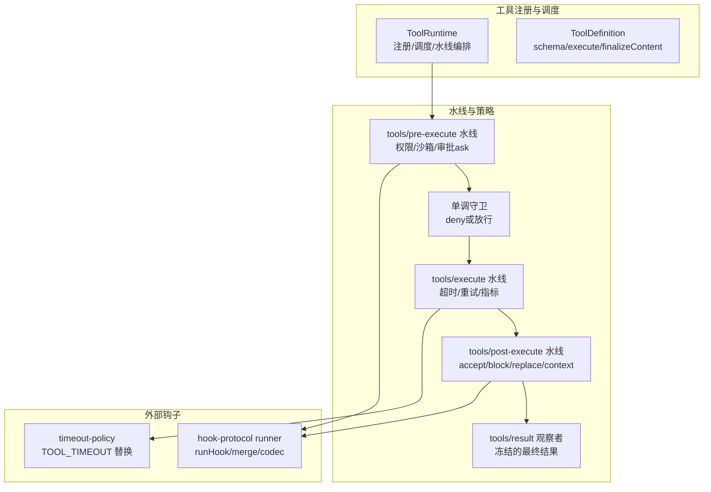
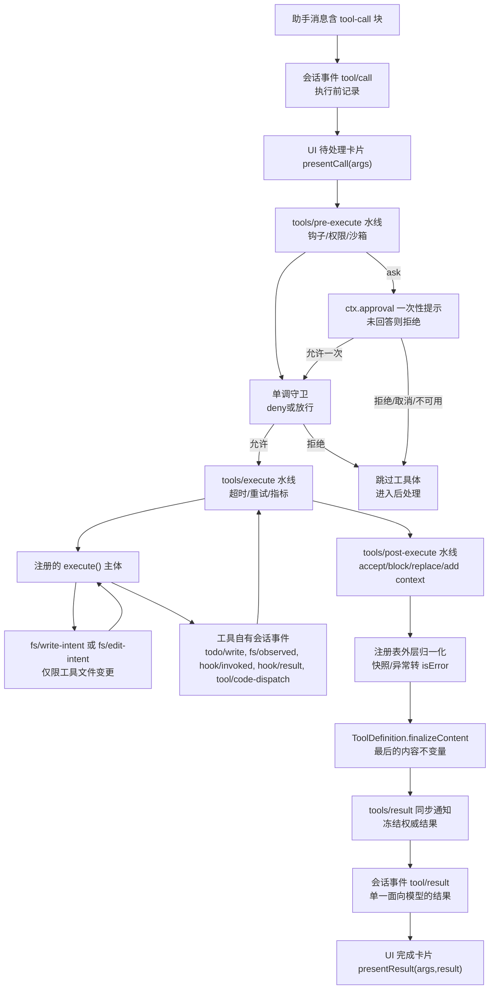
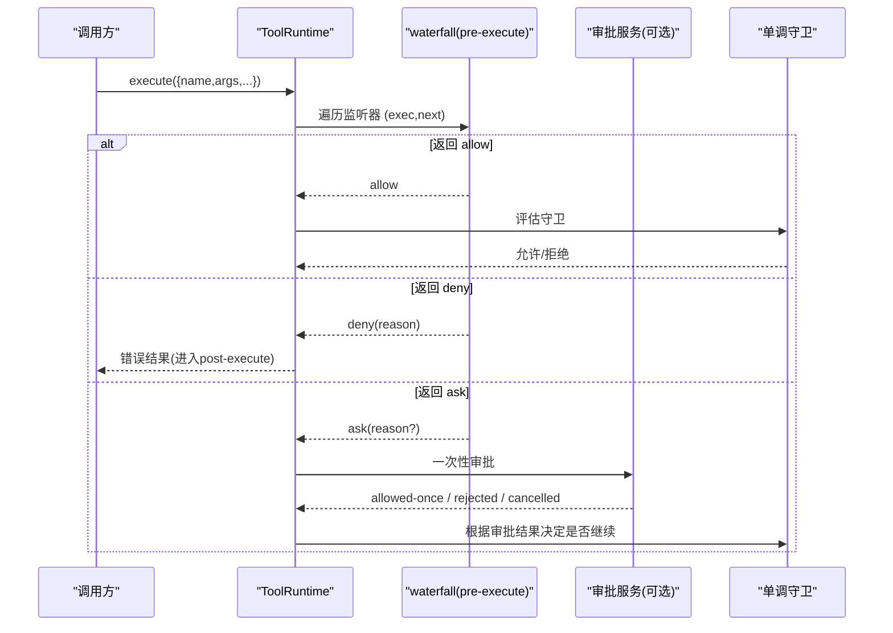
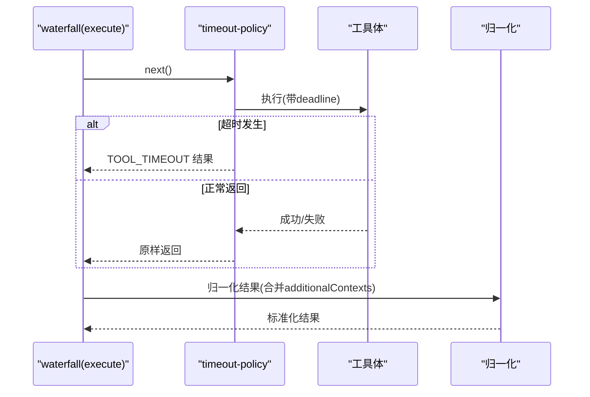
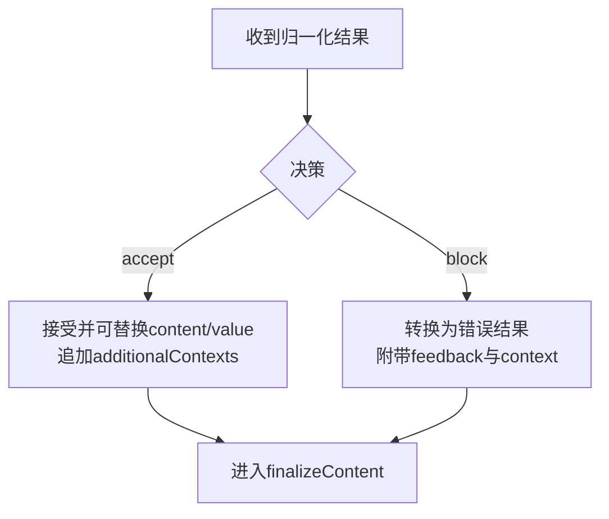
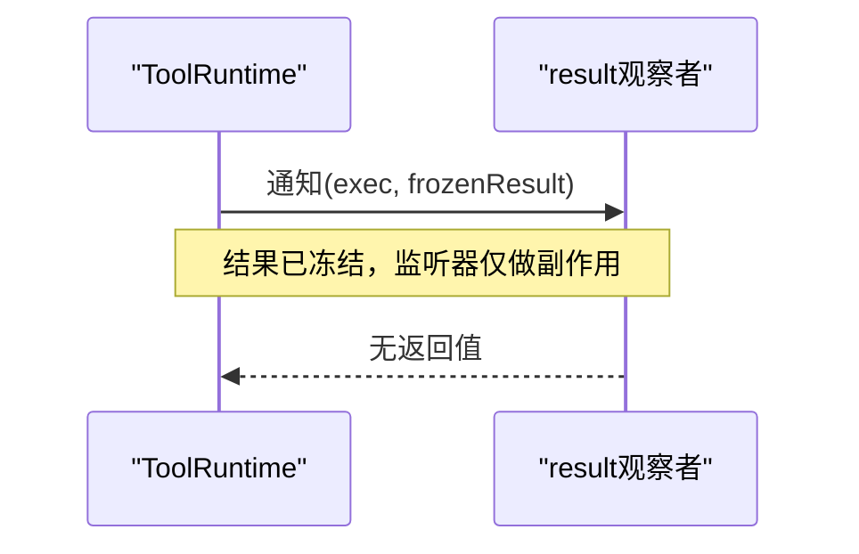
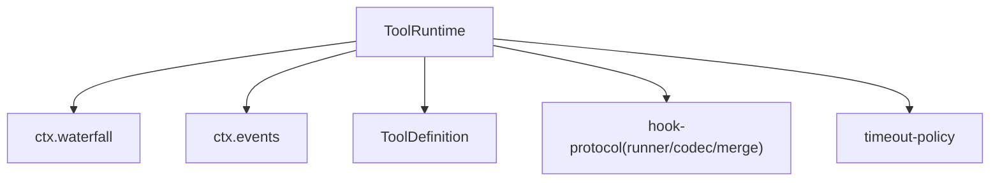

# 工具管道钩子

<cite>
**本文引用的文件**
- [packages/core/tools/src/index.ts](file://packages/core/tools/src/index.ts)
- [docs/tool-execution-pipeline.md](file://docs/tool-execution-pipeline.md)
- [docs/subsystems/tools.zh.md](file://docs/subsystems/tools.zh.md)
- [packages/hooks/hook-protocol/src/runner.ts](file://packages/hooks/hook-protocol/src/runner.ts)
- [packages/hooks/hook-protocol/src/types.ts](file://packages/hooks/hook-protocol/src/types.ts)
- [packages/guard/timeout-policy/src/index.ts](file://packages/guard/timeout-policy/src/index.ts)
- [packages/guard/timeout-policy/tests/timeout-policy.spec.ts](file://packages/guard/timeout-policy/tests/timeout-policy.spec.ts)
- [packages/core/tools/tests/tools.spec.ts](file://packages/core/tools/tests/tools.spec.ts)
- [packages/core/tools/tests/invariant.spec.ts](file://packages/core/tools/tests/invariant.spec.ts)
- [packages/core/tools/tests/execution-signal-types.spec.ts](file://packages/core/tools/tests/execution-signal-types.spec.ts)
</cite>

## 目录
1. [简介](#简介)
2. [项目结构](#项目结构)
3. [核心组件](#核心组件)
4. [架构总览](#架构总览)
5. [详细组件分析](#详细组件分析)
6. [依赖关系分析](#依赖关系分析)
7. [性能考量](#性能考量)
8. [故障排除指南](#故障排除指南)
9. [结论](#结论)
10. [附录：钩子开发示例与最佳实践](#附录：钩子开发示例与最佳实践)

## 简介
本文件系统性说明 DeepSeek Harness 工具执行管道的钩子系统实现，覆盖以下关键主题：
- tools/pre-execute 水线的用途与决策（允许、拒绝、询问）
- tools/execute 环绕调用的机制（超时控制、重试逻辑、指标收集）
- tools/post-execute 后处理水线的设计（结果替换、上下文附加、错误处理）
- tools/result 观察者的作用（最终结果监听与副作用处理）
- 各钩子的执行顺序、依赖关系与错误传播
- 钩子开发示例（权限检查、日志记录、性能监控）
- 调试与排错最佳实践
- 扩展工具执行流程的完整指南

## 项目结构
工具执行管道由注册表与一系列可插拔的水线组成。核心位于 @deepseek-ai/dsh-tools 包中，配合 hook-protocol 提供外部命令式钩子的运行与协议；timeout-policy 作为默认策略以 tools/execute 包装器形式注入超时控制。

图表来源
- [packages/core/tools/src/index.ts:129-200](file://packages/core/tools/src/index.ts#L129-L200)
- [packages/hooks/hook-protocol/src/runner.ts:67-106](file://packages/hooks/hook-protocol/src/runner.ts#L67-L106)
- [packages/guard/timeout-policy/src/index.ts:61-81](file://packages/guard/timeout-policy/src/index.ts#L61-L81)

章节来源
- [docs/tool-execution-pipeline.md:1-63](file://docs/tool-execution-pipeline.md#L1-L63)
- [packages/core/tools/src/index.ts:129-200](file://packages/core/tools/src/index.ts#L129-L200)

## 核心组件
- ToolRuntime：工具注册、可见性解析、执行调度与水线编排中心。负责将一次调用拆分为 prepare → dispatch → finalize → finish 阶段，并在每个阶段触发对应水线。
- ToolDefinition：工具定义，包含 schema、execute、可选 finalizeContent/presentCall/presentResult、timeoutMs、isConcurrencySafe。
- Waterfall 事件：
  - tools/pre-execute：在分派前进行权限、沙箱、审批 ask 等前置策略。
  - tools/execute：围绕实际执行的包装层，用于超时、重试、指标等。
  - tools/post-execute：对已归一化的结果进行 accept/block/replace/additionalContexts。
  - tools/result：同步通知冻结的最终结果，供审计、遥测、副作用使用。
- 单调守卫：在 pre-execute 之后、body 之前执行，仅能 deny 或放行，不可反转 deny。
- 外部钩子：通过 hook-protocol 运行外部命令式钩子，统一输出合并与事件记录。

章节来源
- [packages/core/tools/src/index.ts:213-280](file://packages/core/tools/src/index.ts#L213-L280)
- [packages/core/tools/src/index.ts:129-200](file://packages/core/tools/src/index.ts#L129-L200)
- [packages/hooks/hook-protocol/src/types.ts:8-41](file://packages/hooks/hook-protocol/src/types.ts#L8-L41)

## 架构总览
下图展示了从模型消息到最终结果的完整流水线，包括水线、守卫、文件系统守卫、结果重写、最终结果观察与 UI 渲染的先后顺序。

图表来源
- [docs/tool-execution-pipeline.md:8-60](file://docs/tool-execution-pipeline.md#L8-L60)

章节来源
- [docs/tool-execution-pipeline.md:1-63](file://docs/tool-execution-pipeline.md#L1-L63)

## 详细组件分析

### tools/pre-execute 水线：允许、拒绝与询问
- 职责：在工具体执行前进行权限校验、沙箱准入、审批询问等。
- 决策类型：
  - allow：继续后续守卫与执行。
  - deny：直接生成错误结果并进入 post-execute。
  - ask：调用审批服务进行一次性确认；若缺失或无法回答则视为拒绝。
- 执行顺序：先运行所有 pre-execute 监听器，再运行单调守卫。
- 错误传播：监听器抛出的异常会被捕获并转为最终错误结果，不会中断其他监听器的执行。

图表来源
- [packages/core/tools/src/index.ts:129-167](file://packages/core/tools/src/index.ts#L129-L167)
- [packages/core/tools/src/index.ts:1454-1498](file://packages/core/tools/src/index.ts#L1454-L1498)

章节来源
- [packages/core/tools/src/index.ts:129-200](file://packages/core/tools/src/index.ts#L129-L200)
- [packages/core/tools/src/index.ts:1454-1498](file://packages/core/tools/src/index.ts#L1454-L1498)
- [docs/subsystems/tools.zh.md:374-400](file://docs/subsystems/tools.zh.md#L374-L400)

### tools/execute 环绕调用：超时、重试与指标
- 职责：围绕工具体执行，支持超时控制、重试、指标采集等横切关注点。
- 超时控制：
  - timeout-policy 通过 tools/execute 包装器为工具设置截止时间，并在超时时将结果替换为结构化 TOOL_TIMEOUT。
  - 如果工具自身抛出中止错误且信号来自包装器，也会被替换为 TOOL_TIMEOUT。
- 重试与指标：可在该水线中封装重试逻辑与指标上报，不影响工具体语义。
- 信号融合：注册表会将原始调用方信号与包装器替换的信号融合，确保取消语义正确传递。

图表来源
- [packages/guard/timeout-policy/src/index.ts:61-81](file://packages/guard/timeout-policy/src/index.ts#L61-L81)
- [packages/core/tools/src/index.ts:1560-1590](file://packages/core/tools/src/index.ts#L1560-L1590)

章节来源
- [packages/guard/timeout-policy/src/index.ts:61-81](file://packages/guard/timeout-policy/src/index.ts#L61-L81)
- [packages/guard/timeout-policy/tests/timeout-policy.spec.ts:97-129](file://packages/guard/timeout-policy/tests/timeout-policy.spec.ts#L97-L129)
- [packages/core/tools/src/index.ts:1560-1590](file://packages/core/tools/src/index.ts#L1560-L1590)

### tools/post-execute 后处理水线：结果替换、上下文附加与错误处理
- 职责：对已归一化的结果进行接受、替换内容、附加上下文或阻断（block）。
- 决策类型：
  - accept：接受当前结果，可选择替换 content/value 或追加 additionalContexts。
  - block：将反馈转换为错误结果，同时可附加上下文。
- 错误处理：监听器抛出的异常会被捕获并转为最终错误结果，保证管线健壮性。
- 上下文追加：deferred contexts 会在工具体执行后被合并到结果中，随后在工具结果事件后注入到下一轮请求。

图表来源
- [packages/core/tools/src/index.ts:1592-1667](file://packages/core/tools/src/index.ts#L1592-L1667)
- [docs/subsystems/tools.zh.md:374-400](file://docs/subsystems/tools.zh.md#L374-L400)

章节来源
- [packages/core/tools/src/index.ts:1592-1667](file://packages/core/tools/src/index.ts#L1592-L1667)
- [packages/core/tools/tests/tools.spec.ts:1036-1064](file://packages/core/tools/tests/tools.spec.ts#L1036-L1064)

### tools/result 观察者：最终结果监听与副作用处理
- 职责：在最终结果冻结后同步通知，供审计、遥测、副作用处理使用。
- 特性：
  - 接收的对象是深冻结的只读视图，防止意外修改。
  - 监听器异常被捕获并记录警告，不污染主流程。
  - 适用于跨工具族的全局观测与聚合。

图表来源
- [packages/core/tools/src/index.ts:1647-1667](file://packages/core/tools/src/index.ts#L1647-L1667)

章节来源
- [packages/core/tools/src/index.ts:1647-1667](file://packages/core/tools/src/index.ts#L1647-L1667)

### 执行顺序与依赖关系
- 顺序：pre-execute → 单调守卫 → execute → post-execute → finalizeContent → result。
- 依赖：
  - post-execute 依赖 execute 的归一化结果。
  - finalizeContent 依赖 post-execute 的最终决定。
  - result 在所有处理完成后触发，且对象已冻结。
- 错误传播：任何阶段的异常都会被捕获并转为最终错误结果，确保管线稳定。

图表来源
- [docs/tool-execution-pipeline.md:8-60](file://docs/tool-execution-pipeline.md#L8-L60)
- [packages/core/tools/src/index.ts:1454-1667](file://packages/core/tools/src/index.ts#L1454-L1667)

章节来源
- [docs/tool-execution-pipeline.md:1-63](file://docs/tool-execution-pipeline.md#L1-L63)
- [packages/core/tools/src/index.ts:1454-1667](file://packages/core/tools/src/index.ts#L1454-L1667)

## 依赖关系分析
- 内部依赖：
  - ToolRuntime 依赖 ctx.waterfall 与 ctx.events 来编排水线与事件。
  - 工具定义依赖 output.render 与可选 presentationMeta 进行结果投影。
- 外部依赖：
  - hook-protocol 提供 runHook、parseHookOutput、mergeHookOutputs 等能力，用于外部命令式钩子的执行与输出合并。
  - timeout-policy 通过 tools/execute 包装器注入超时控制。

图表来源
- [packages/core/tools/src/index.ts:129-200](file://packages/core/tools/src/index.ts#L129-L200)
- [packages/hooks/hook-protocol/src/runner.ts:67-106](file://packages/hooks/hook-protocol/src/runner.ts#L67-L106)
- [packages/guard/timeout-policy/src/index.ts:61-81](file://packages/guard/timeout-policy/src/index.ts#L61-L81)

章节来源
- [packages/core/tools/src/index.ts:129-200](file://packages/core/tools/src/index.ts#L129-L200)
- [packages/hooks/hook-protocol/src/runner.ts:67-106](file://packages/hooks/hook-protocol/src/runner.ts#L67-L106)
- [packages/guard/timeout-policy/src/index.ts:61-81](file://packages/guard/timeout-policy/src/index.ts#L61-L81)

## 性能考量
- 水线开销：每个水线按序执行监听器，应避免在监听器中进行昂贵计算。
- 超时控制：timeout-policy 会引入 deadline 管理，需确保工具体及时响应 AbortSignal。
- 结果物化：注册表会对结果进行 JSON 快照与冻结，避免大对象频繁复制。
- 并发安全：工具的 isConcurrencySafe 分类影响并行调度，应谨慎声明。

[本节为通用指导，无需特定文件引用]

## 故障排除指南
- 常见错误：
  - 未知工具：在 ptc 模式下直接调用非 run_code 工具会被拒绝，返回 UNKNOWN_TOOL。
  - 超时：TOOL_TIMEOUT 会替换工具自身的中止结果，便于统一处理。
  - 审批缺失：ask 决策在无审批服务时退化为拒绝。
- 调试建议：
  - 在 pre-execute 与 post-execute 中添加日志监听器，记录 exec 与 decision。
  - 使用 tools/result 观察者收集最终结果与耗时。
  - 检查 timeout-policy 配置与工具体对信号的响应。
- 测试用例参考：
  - 水线组合与顺序验证。
  - 信号类型约束与只读保护。
  - 超时替换行为。

章节来源
- [packages/core/tools/tests/tools.spec.ts:1036-1064](file://packages/core/tools/tests/tools.spec.ts#L1036-L1064)
- [packages/core/tools/tests/execution-signal-types.spec.ts:41-77](file://packages/core/tools/tests/execution-signal-types.spec.ts#L41-L77)
- [packages/guard/timeout-policy/tests/timeout-policy.spec.ts:97-129](file://packages/guard/timeout-policy/tests/timeout-policy.spec.ts#L97-L129)

## 结论
DeepSeek Harness 的工具执行管道通过清晰的水线设计与严格的错误传播机制，实现了可扩展、可观测、可控制的工具执行流程。pre-execute 负责准入与审批，execute 提供横切能力如超时与重试，post-execute 完成结果修正与上下文注入，result 提供最终观测点。结合 monotonic guards 与外部钩子，开发者可以灵活扩展工具执行流程，同时保持系统稳定性与一致性。

[本节为总结，无需特定文件引用]

## 附录：钩子开发示例与最佳实践

### 自定义权限检查（pre-execute）
- 目标：基于角色或资源访问控制拒绝敏感工具调用。
- 步骤：
  - 注册 tools/pre-execute 监听器，读取 exec.name 与 exec.arguments。
  - 返回 { kind: 'deny', reason } 或 { kind: 'allow' }。
  - 如需用户确认，返回 { kind: 'ask', reason } 并依赖审批服务。
- 注意事项：
  - 监听器应为幂等且快速。
  - 避免在监听器中执行 I/O 阻塞操作。

章节来源
- [packages/core/tools/src/index.ts:129-167](file://packages/core/tools/src/index.ts#L129-L167)

### 日志记录（post-execute）
- 目标：记录工具调用的输入、输出与耗时。
- 步骤：
  - 注册 tools/post-execute 监听器，记录 exec 与 result。
  - 可使用 additionalContexts 附加审计信息。
- 注意事项：
  - 避免记录敏感数据。
  - 使用异步写入以避免阻塞主流程。

章节来源
- [packages/core/tools/src/index.ts:1592-1667](file://packages/core/tools/src/index.ts#L1592-L1667)

### 性能监控（execute）
- 目标：采集工具执行耗时与成功率。
- 步骤：
  - 注册 tools/execute 监听器，在 next() 前后记录时间戳。
  - 上报指标至监控系统。
- 注意事项：
  - 确保监听器本身轻量。
  - 处理异常路径，避免指标丢失。

章节来源
- [packages/core/tools/src/index.ts:1560-1590](file://packages/core/tools/src/index.ts#L1560-L1590)

### 外部命令式钩子（hook-protocol）
- 目标：通过外部脚本实现复杂策略或集成第三方系统。
- 步骤：
  - 使用 runHook 执行命令，传入 payload 与环境变量。
  - 解析输出并合并决策。
- 注意事项：
  - 设置合理超时与信号取消。
  - 处理 stderr 与退出码。

章节来源
- [packages/hooks/hook-protocol/src/runner.ts:67-106](file://packages/hooks/hook-protocol/src/runner.ts#L67-L106)
- [packages/hooks/hook-protocol/src/types.ts:8-41](file://packages/hooks/hook-protocol/src/types.ts#L8-L41)

### 调试与排错最佳实践
- 启用详细日志：在关键水线添加日志监听器。
- 使用只读视图：避免修改 exec 对象，遵循类型约束。
- 验证超时行为：通过测试用例确认 TOOL_TIMEOUT 替换逻辑。
- 审查审批流：确保 ask 决策有明确的回退路径。

章节来源
- [packages/core/tools/tests/invariant.spec.ts:40-70](file://packages/core/tools/tests/invariant.spec.ts#L40-L70)
- [packages/core/tools/tests/execution-signal-types.spec.ts:41-77](file://packages/core/tools/tests/execution-signal-types.spec.ts#L41-L77)