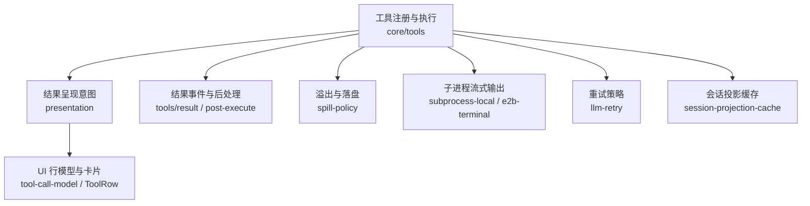
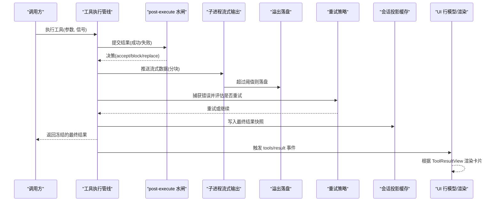
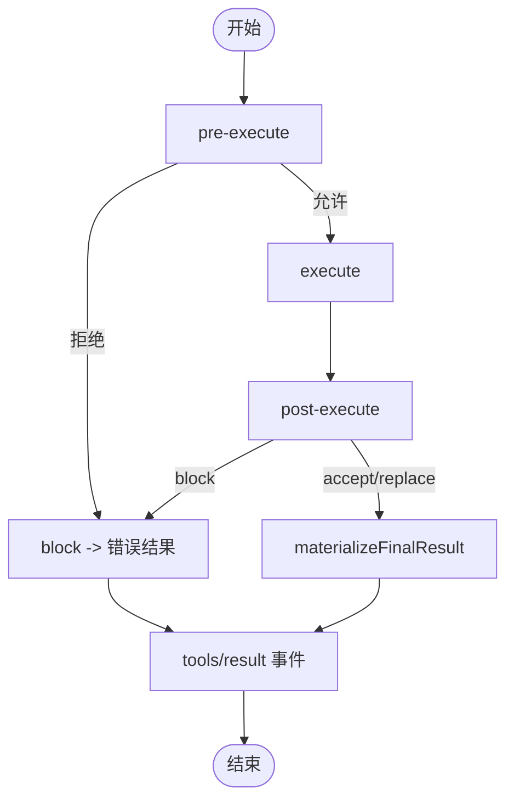
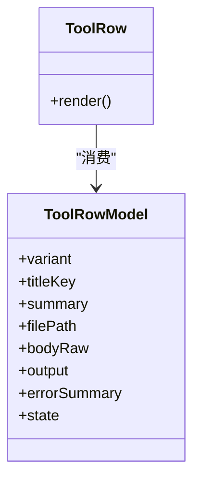
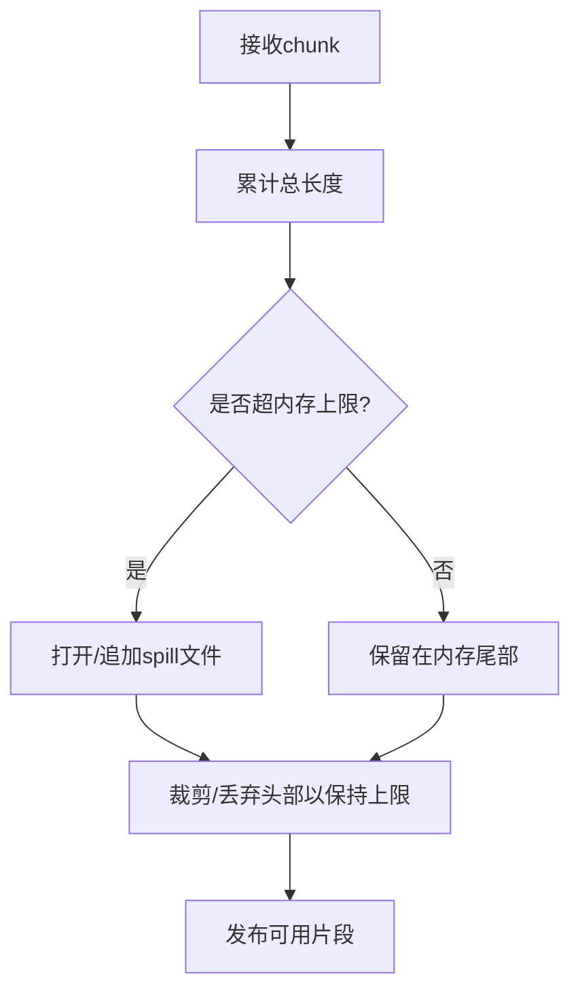
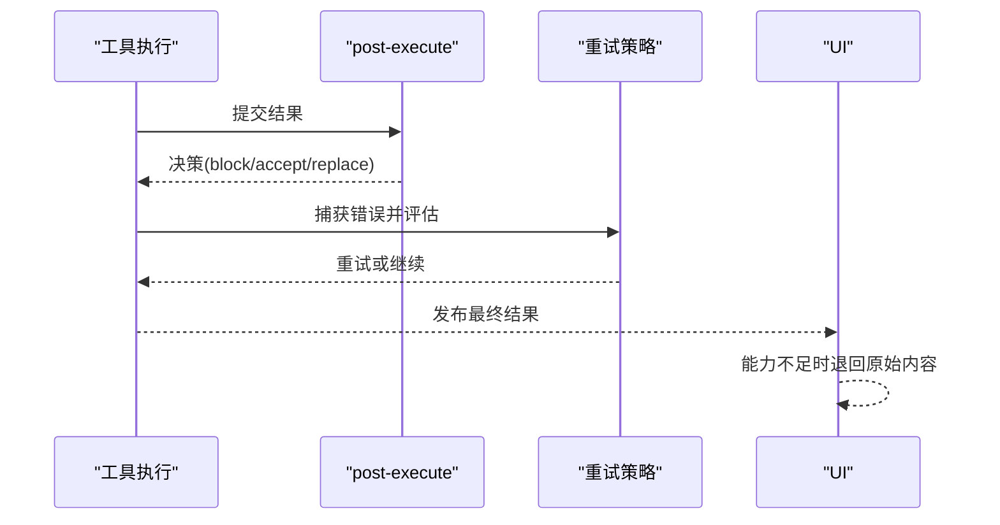
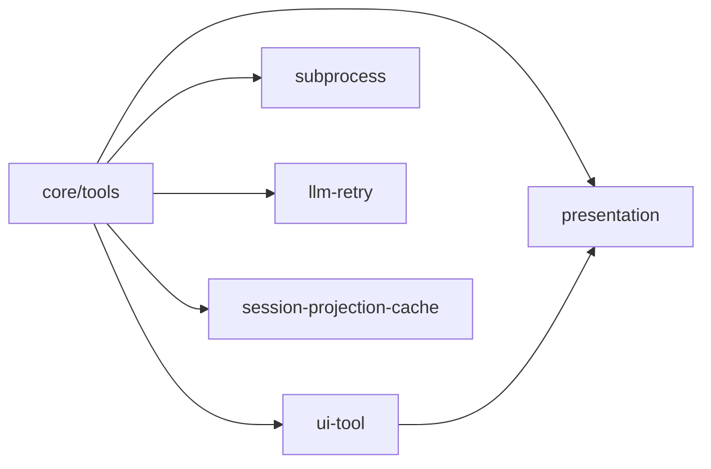

# 工具结果处理

<cite>
**本文引用的文件**
- [packages/core/tools/src/index.ts](file://packages/core/tools/src/index.ts)
- [packages/core/tools/src/presentation.ts](file://packages/core/tools/src/presentation.ts)
- [packages/client/ui-tool/src/client/tool/models/tool-call-model.ts](file://packages/client/ui-tool/src/client/tool/models/tool-call-model.ts)
- [packages/client/ui-tool/src/client/tool/components/ToolRow.tsx](file://packages/client/ui-tool/src/client/tool/components/ToolRow.tsx)
- [packages/spill/spill-policy/tests/spill-policy.spec.ts](file://packages/spill/spill-policy/tests/spill-policy.spec.ts)
- [packages/subprocess/subprocess-local/src/spawn.ts](file://packages/subprocess/subprocess-local/src/spawn.ts)
- [packages/e2b/subprocess-e2b/src/terminal.ts](file://packages/e2b/subprocess-e2b/src/terminal.ts)
- [packages/llm/llm-retry/src/index.ts](file://packages/llm/llm-retry/src/index.ts)
- [packages/session/session-projection-cache/tests/cache.spec.ts](file://packages/session/session-projection-cache/tests/cache.spec.ts)
- [packages/core/tools/tests/tools.spec.ts](file://packages/core/tools/tests/tools.spec.ts)
- [packages/core/tools/tests/invariant.spec.ts](file://packages/core/tools/tests/invariant.spec.ts)
- [packages/core/tools/tests/ptc.spec.ts](file://packages/core/tools/tests/ptc.spec.ts)
</cite>

## 目录
1. [简介](#简介)
2. [项目结构](#项目结构)
3. [核心组件](#核心组件)
4. [架构总览](#架构总览)
5. [详细组件分析](#详细组件分析)
6. [依赖关系分析](#依赖关系分析)
7. [性能考量](#性能考量)
8. [故障排查指南](#故障排查指南)
9. [结论](#结论)
10. [附录](#附录)

## 简介
本文件系统性说明 DeepSeek Harness 中“工具结果处理与展示”的完整实现，覆盖以下方面：
- ToolExecutionResult 的结构与分类（成功/失败）
- 结果流式传输、背压、分块与进度更新
- 错误处理与重试机制（错误分类、恢复策略、降级）
- 结果缓存与去重（键生成、过期、一致性）
- UI 呈现层设计（ToolCallView/ToolResultView 的使用与扩展）
- 结果格式标准化与兼容性最佳实践
- 调试技巧与扩展方法（自定义渲染器、结果转换器）

## 项目结构
围绕工具结果处理的关键代码分布在如下模块：
- 核心执行管线与事件：packages/core/tools/src/index.ts
- 结果呈现意图类型（UI 无关）：packages/core/tools/src/presentation.ts
- UI 行模型与渲染：packages/client/ui-tool/src/client/tool/models/tool-call-model.ts, packages/client/ui-tool/src/client/tool/components/ToolRow.tsx
- 大结果溢出与落盘：packages/spill/spill-policy/tests/spill-policy.spec.ts
- 子进程流式输出与背压：packages/subprocess/subprocess-local/src/spawn.ts, packages/e2b/subprocess-e2b/src/terminal.ts
- 重试策略：packages/llm/llm-retry/src/index.ts
- 会话投影缓存：packages/session/session-projection-cache/tests/cache.spec.ts
- 行为验证用例：packages/core/tools/tests/*.ts



**图示来源**
- [packages/core/tools/src/index.ts:134-189](file://packages/core/tools/src/index.ts#L134-L189)
- [packages/core/tools/src/presentation.ts:1-390](file://packages/core/tools/src/presentation.ts#L1-L390)
- [packages/client/ui-tool/src/client/tool/models/tool-call-model.ts:1-265](file://packages/client/ui-tool/src/client/tool/models/tool-call-model.ts#L1-L265)
- [packages/client/ui-tool/src/client/tool/components/ToolRow.tsx:1-330](file://packages/client/ui-tool/src/client/tool/components/ToolRow.tsx#L1-L330)
- [packages/spill/spill-policy/tests/spill-policy.spec.ts:266-287](file://packages/spill/spill-policy/tests/spill-policy.spec.ts#L266-L287)
- [packages/subprocess/subprocess-local/src/spawn.ts:145-175](file://packages/subprocess/subprocess-local/src/spawn.ts#L145-L175)
- [packages/e2b/subprocess-e2b/src/terminal.ts:61-89](file://packages/e2b/subprocess-e2b/src/terminal.ts#L61-L89)
- [packages/llm/llm-retry/src/index.ts:123-217](file://packages/llm/llm-retry/src/index.ts#L123-L217)
- [packages/session/session-projection-cache/tests/cache.spec.ts:434-526](file://packages/session/session-projection-cache/tests/cache.spec.ts#L434-L526)

**章节来源**
- [packages/core/tools/src/index.ts:134-189](file://packages/core/tools/src/index.ts#L134-L189)
- [packages/core/tools/src/presentation.ts:1-390](file://packages/core/tools/src/presentation.ts#L1-L390)

## 核心组件
- 工具执行管线与事件
  - pre-execute：允许/拒绝/询问
  - execute：环绕执行（超时、重试、指标）
  - post-execute：接受/替换/丰富/阻止结果
  - result：发布冻结的最终结果快照
- 结果呈现意图
  - ToolCallView：调用前（PENDING）的呈现意图（generic/terminal/diff）
  - ToolResultView：完成后（COMPLETED）的呈现意图（generic/terminal/diff/search/read/web）
- UI 行模型与渲染
  - tool-call-model：将冻结的调用切片转换为行模型（变体、状态、摘要、输出等）
  - ToolRow：根据模型渲染不同卡片（终端、差异、读取、搜索、Web、图片等）
- 溢出与落盘
  - 对超大结果进行截断并持久化，保留定位信息以便回溯
- 子进程流式输出
  - 按字节上限维护尾部窗口，支持溢出时落盘
  - 基于标记解析首帧，避免乱序或重复
- 重试策略
  - 可配置退避、最大重试次数、可重试错误码集合
  - 通过会话事件记录重试过程
- 会话投影缓存
  - 以会话头为键匹配缓存，版本兼容检查，提供冷/热快照

**章节来源**
- [packages/core/tools/src/index.ts:134-189](file://packages/core/tools/src/index.ts#L134-L189)
- [packages/core/tools/src/presentation.ts:1-390](file://packages/core/tools/src/presentation.ts#L1-L390)
- [packages/client/ui-tool/src/client/tool/models/tool-call-model.ts:1-265](file://packages/client/ui-tool/src/client/tool/models/tool-call-model.ts#L1-L265)
- [packages/client/ui-tool/src/client/tool/components/ToolRow.tsx:1-330](file://packages/client/ui-tool/src/client/tool/components/ToolRow.tsx#L1-L330)
- [packages/spill/spill-policy/tests/spill-policy.spec.ts:266-287](file://packages/spill/spill-policy/tests/spill-policy.spec.ts#L266-L287)
- [packages/subprocess/subprocess-local/src/spawn.ts:145-175](file://packages/subprocess/subprocess-local/src/spawn.ts#L145-L175)
- [packages/e2b/subprocess-e2b/src/terminal.ts:61-89](file://packages/e2b/subprocess-e2b/src/terminal.ts#L61-L89)
- [packages/llm/llm-retry/src/index.ts:123-217](file://packages/llm/llm-retry/src/index.ts#L123-L217)
- [packages/session/session-projection-cache/tests/cache.spec.ts:434-526](file://packages/session/session-projection-cache/tests/cache.spec.ts#L434-L526)

## 架构总览
下图展示了从工具调用到结果展示的端到端流程，包括执行管线、结果后处理、流式输出、溢出落盘、重试与缓存。



**图示来源**
- [packages/core/tools/src/index.ts:134-189](file://packages/core/tools/src/index.ts#L134-L189)
- [packages/core/tools/src/index.ts:1722-1747](file://packages/core/tools/src/index.ts#L1722-L1747)
- [packages/core/tools/src/index.ts:1837-1853](file://packages/core/tools/src/index.ts#L1837-L1853)
- [packages/subprocess/subprocess-local/src/spawn.ts:145-175](file://packages/subprocess/subprocess-local/src/spawn.ts#L145-L175)
- [packages/e2b/subprocess-e2b/src/terminal.ts:61-89](file://packages/e2b/subprocess-e2b/src/terminal.ts#L61-L89)
- [packages/llm/llm-retry/src/index.ts:123-217](file://packages/llm/llm-retry/src/index.ts#L123-L217)
- [packages/session/session-projection-cache/tests/cache.spec.ts:434-526](file://packages/session/session-projection-cache/tests/cache.spec.ts#L434-L526)

## 详细组件分析

### 工具执行管线与结果后处理
- 关键阶段
  - pre-execute：决定是否允许执行
  - execute：实际执行工具，返回 ToolExecutionResult
  - post-execute：对结果进行 accept/block/replace，并可附加上下文
  - result：发布冻结的最终结果，供监听者消费
- 成功与失败结果
  - 成功：materializeFinalResult 会构造 presentation，并在必要时标记 concludesTurn
  - 失败：统一包装为 isError=true，包含 error.message 与可选 info；post-execute 可将 accept 的结果 block 为错误
- 取消与中止
  - 若调用前已中止，直接产出结果且不进入管线阶段
  - 监听器需观察 exec.signal，确保异步逻辑可被取消



**图示来源**
- [packages/core/tools/src/index.ts:134-189](file://packages/core/tools/src/index.ts#L134-L189)
- [packages/core/tools/src/index.ts:1722-1747](file://packages/core/tools/src/index.ts#L1722-L1747)
- [packages/core/tools/src/index.ts:1837-1853](file://packages/core/tools/src/index.ts#L1837-L1853)
- [packages/core/tools/tests/tools.spec.ts:1585-1618](file://packages/core/tools/tests/tools.spec.ts#L1585-L1618)

**章节来源**
- [packages/core/tools/src/index.ts:134-189](file://packages/core/tools/src/index.ts#L134-L189)
- [packages/core/tools/src/index.ts:1722-1747](file://packages/core/tools/src/index.ts#L1722-L1747)
- [packages/core/tools/src/index.ts:1837-1853](file://packages/core/tools/src/index.ts#L1837-L1853)
- [packages/core/tools/tests/tools.spec.ts:1585-1618](file://packages/core/tools/tests/tools.spec.ts#L1585-L1618)
- [packages/core/tools/tests/invariant.spec.ts:40-70](file://packages/core/tools/tests/invariant.spec.ts#L40-L70)

### 结果呈现意图（ToolCallView/ToolResultView）
- 调用前呈现（PENDING）
  - generic：标题、类别、原始输入、内容块、文件位置
  - terminal：命令、描述、工作目录
  - diff：变更预览（新文件或覆盖时使用 oldText=null）
- 完成后呈现（COMPLETED）
  - generic：可选标题与重新格式化内容
  - terminal：输出、退出码或信号
  - diff：应用后的变更（上下文 hunk 或整文件差异）
  - search：按文件分组匹配或路径列表，带 truncated/total
  - read：文件窗口（path、offset、lines、totalLines、lang），退化回文本
  - web：检索来源或抓取摘要（kind=search/fetch），退化回文本
- 纯函数与回放确定性
  - presentCall/presentResult 必须仅依赖 args（及结果），保证直播与回放一致

**章节来源**
- [packages/core/tools/src/presentation.ts:1-390](file://packages/core/tools/src/presentation.ts#L1-L390)

### UI 呈现层（ToolRow 与行模型）
- 行模型推导
  - 根据工具名分类变体（search/read/bash/write/edit/code/others）
  - 计算状态（running/ok/error/stopped）、摘要、文件路径、输出、错误摘要
  - 格式化输入体（code 变体显示程序本身）
- 渲染优先级
  - askQuestion > terminal > diff > read > image > search > web > 通用 IO 卡片
- 能力退化
  - 无 terminal 能力时，桥接层将 output 包裹为 ```console 文本
  - 无 read/web/search 能力时，退回原始 content



**图示来源**
- [packages/client/ui-tool/src/client/tool/models/tool-call-model.ts:1-265](file://packages/client/ui-tool/src/client/tool/models/tool-call-model.ts#L1-L265)
- [packages/client/ui-tool/src/client/tool/components/ToolRow.tsx:1-330](file://packages/client/ui-tool/src/client/tool/components/ToolRow.tsx#L1-L330)

**章节来源**
- [packages/client/ui-tool/src/client/tool/models/tool-call-model.ts:1-265](file://packages/client/ui-tool/src/client/tool/models/tool-call-model.ts#L1-L265)
- [packages/client/ui-tool/src/client/tool/components/ToolRow.tsx:1-330](file://packages/client/ui-tool/src/client/tool/components/ToolRow.tsx#L1-L330)

### 流式传输、背压与进度更新
- 子进程输出缓冲与背压
  - 维护内存尾部窗口，超过 maxBytes 时丢弃头部或裁剪，保持精确的尾部分片
  - 溢出时打开 spill 文件，追加所有后续 chunk，确保诊断完整性
- 首帧解析与发布
  - 使用标记分隔符，累积直到找到标记，再发布后续数据，避免乱序
- 进度更新
  - 通过流式推送逐步更新 UI，结合 truncated/total 等元数据提示截断情况



**图示来源**
- [packages/subprocess/subprocess-local/src/spawn.ts:145-175](file://packages/subprocess/subprocess-local/src/spawn.ts#L145-L175)
- [packages/e2b/subprocess-e2b/src/terminal.ts:61-89](file://packages/e2b/subprocess-e2b/src/terminal.ts#L61-L89)
- [packages/spill/spill-policy/tests/spill-policy.spec.ts:266-287](file://packages/spill/spill-policy/tests/spill-policy.spec.ts#L266-L287)

**章节来源**
- [packages/subprocess/subprocess-local/src/spawn.ts:145-175](file://packages/subprocess/subprocess-local/src/spawn.ts#L145-L175)
- [packages/e2b/subprocess-e2b/src/terminal.ts:61-89](file://packages/e2b/subprocess-e2b/src/terminal.ts#L61-L89)
- [packages/spill/spill-policy/tests/spill-policy.spec.ts:266-287](file://packages/spill/spill-policy/tests/spill-policy.spec.ts#L266-L287)

### 错误处理与重试机制
- 错误分类与转换
  - 工具抛出异常会被转换为 isError=true 的结果，携带 message 与可选 info
  - post-execute 可将成功结果 block 为错误，并注入反馈内容
- 重试策略
  - 支持 normal/always 模式，可配置初始延迟、最大延迟、抖动比例、最大重试次数、可重试错误码
  - 通过会话事件记录重试过程，支持取消与生命周期管理
- 降级处理
  - 当 UI 缺少特定能力时，退回原始 content 文本
  - 大结果溢出时，保留定位信息，用户可通过定位查看完整内容



**图示来源**
- [packages/core/tools/src/index.ts:1722-1747](file://packages/core/tools/src/index.ts#L1722-L1747)
- [packages/core/tools/src/index.ts:1861-1869](file://packages/core/tools/src/index.ts#L1861-L1869)
- [packages/llm/llm-retry/src/index.ts:123-217](file://packages/llm/llm-retry/src/index.ts#L123-L217)
- [packages/core/tools/tests/ptc.spec.ts:984-1013](file://packages/core/tools/tests/ptc.spec.ts#L984-L1013)

**章节来源**
- [packages/core/tools/src/index.ts:1722-1747](file://packages/core/tools/src/index.ts#L1722-L1747)
- [packages/core/tools/src/index.ts:1861-1869](file://packages/core/tools/src/index.ts#L1861-L1869)
- [packages/llm/llm-retry/src/index.ts:123-217](file://packages/llm/llm-retry/src/index.ts#L123-L217)
- [packages/core/tools/tests/ptc.spec.ts:984-1013](file://packages/core/tools/tests/ptc.spec.ts#L984-L1013)

### 结果缓存与去重策略
- 缓存键生成
  - 以会话头（含 id、createdAt、isSeeded、inheritedEventCount）作为身份标识
- 过期与版本兼容
  - 存储记录版本与当前版本不兼容时，拒绝服务
  - 未播种调用方可读取旧版记录，播种调用方需要 lineage 字段保障一致性
- 一致性保证
  - 命中缓存时返回 asOfSeq 与 values，确保视图稳定且可追溯

**章节来源**
- [packages/session/session-projection-cache/tests/cache.spec.ts:434-526](file://packages/session/session-projection-cache/tests/cache.spec.ts#L434-L526)

### 结果格式标准化与兼容性
- 标准化
  - 所有结果通过 materializeFinalResult 统一封装，确保 JSON 可序列化与冻结
  - 成功结果可选择 concludesTurn 标记，失败结果统一 isError 结构
- 兼容性
  - UI 能力检测与退化：无 terminal/read/web/search 能力时退回原始 content
  - 大结果溢出：保留定位信息，用户可回溯查看完整内容

**章节来源**
- [packages/core/tools/src/index.ts:1837-1853](file://packages/core/tools/src/index.ts#L1837-L1853)
- [packages/core/tools/src/presentation.ts:1-390](file://packages/core/tools/src/presentation.ts#L1-L390)
- [packages/spill/spill-policy/tests/spill-policy.spec.ts:266-287](file://packages/spill/spill-policy/tests/spill-policy.spec.ts#L266-L287)

## 依赖关系分析
- 核心执行管线依赖呈现意图类型，解耦业务逻辑与 UI
- UI 层依赖行模型，不直接访问底层执行细节
- 子进程流式输出与溢出落盘为执行管线提供可靠的数据通道
- 重试策略与事件系统耦合，确保可观测性与可恢复性
- 会话投影缓存为 UI 提供稳定的历史快照



**图示来源**
- [packages/core/tools/src/index.ts:134-189](file://packages/core/tools/src/index.ts#L134-L189)
- [packages/core/tools/src/presentation.ts:1-390](file://packages/core/tools/src/presentation.ts#L1-L390)
- [packages/client/ui-tool/src/client/tool/models/tool-call-model.ts:1-265](file://packages/client/ui-tool/src/client/tool/models/tool-call-model.ts#L1-L265)
- [packages/subprocess/subprocess-local/src/spawn.ts:145-175](file://packages/subprocess/subprocess-local/src/spawn.ts#L145-L175)
- [packages/llm/llm-retry/src/index.ts:123-217](file://packages/llm/llm-retry/src/index.ts#L123-L217)
- [packages/session/session-projection-cache/tests/cache.spec.ts:434-526](file://packages/session/session-projection-cache/tests/cache.spec.ts#L434-L526)

**章节来源**
- [packages/core/tools/src/index.ts:134-189](file://packages/core/tools/src/index.ts#L134-L189)
- [packages/core/tools/src/presentation.ts:1-390](file://packages/core/tools/src/presentation.ts#L1-L390)
- [packages/client/ui-tool/src/client/tool/models/tool-call-model.ts:1-265](file://packages/client/ui-tool/src/client/tool/models/tool-call-model.ts#L1-L265)
- [packages/subprocess/subprocess-local/src/spawn.ts:145-175](file://packages/subprocess/subprocess-local/src/spawn.ts#L145-L175)
- [packages/llm/llm-retry/src/index.ts:123-217](file://packages/llm/llm-retry/src/index.ts#L123-L217)
- [packages/session/session-projection-cache/tests/cache.spec.ts:434-526](file://packages/session/session-projection-cache/tests/cache.spec.ts#L434-L526)

## 性能考量
- 流式输出与背压
  - 通过内存尾部窗口与溢出落盘，避免 OOM 同时保留诊断所需尾部
  - 首帧解析减少乱序与重复，提升吞吐稳定性
- 结果大小控制
  - 大结果溢出时仅保留定位信息，降低网络与存储压力
- 缓存命中
  - 会话投影缓存提供快速历史读取，减少重复计算
- 重试退避
  - 指数退避与抖动降低瞬时拥塞，提高整体鲁棒性

[本节为一般性指导，无需具体文件引用]

## 故障排查指南
- 常见错误
  - 工具抛出异常：检查 post-execute 是否将其 block，确认错误消息与 info
  - 结果不可序列化：确保 value 可 JSON 序列化，否则会被拒绝
  - 流式输出丢失：检查子进程输出缓冲与 spill 文件，确认标记解析正确
  - 重试无效：核对可重试错误码与退避配置，确认信号未被提前取消
  - 缓存未命中：检查会话头身份与版本兼容性，确认 isSeeded 与 lineage
- 调试技巧
  - 监听 tools/result 事件，打印冻结的最终结果
  - 检查 spill 文件中的完整内容，对比 UI 显示的截断片段
  - 使用测试用例验证管线不变量与阶段顺序

**章节来源**
- [packages/core/tools/tests/tools.spec.ts:473-502](file://packages/core/tools/tests/tools.spec.ts#L473-L502)
- [packages/core/tools/tests/tools.spec.ts:1791-1830](file://packages/core/tools/tests/tools.spec.ts#L1791-L1830)
- [packages/core/tools/tests/invariant.spec.ts:40-70](file://packages/core/tools/tests/invariant.spec.ts#L40-L70)
- [packages/spill/spill-policy/tests/spill-policy.spec.ts:266-287](file://packages/spill/spill-policy/tests/spill-policy.spec.ts#L266-L287)
- [packages/session/session-projection-cache/tests/cache.spec.ts:434-526](file://packages/session/session-projection-cache/tests/cache.spec.ts#L434-L526)

## 结论
DeepSeek Harness 的工具结果处理体系以清晰的执行管线、标准化的呈现意图、可靠的流式传输与溢出落盘、灵活的重试策略以及稳定的会话投影缓存为核心，实现了从工具执行到 UI 展示的完整闭环。开发者可通过 presentCall/presentResult 定制 UI 呈现，借助 post-execute 与重试策略增强健壮性，并利用 spill 与缓存优化性能与体验。

[本节为总结性内容，无需具体文件引用]

## 附录
- 扩展方法
  - 自定义渲染器：实现 presentCall/presentResult，返回对应的 ToolCallView/ToolResultView
  - 结果转换器：在 post-execute 中替换或丰富结果，附加 additionalContexts
- 最佳实践
  - 保持 present 方法的纯函数性质，确保直播与回放一致
  - 合理设置 truncated/total，避免 UI 误判结果完整性
  - 为大结果启用溢出落盘，并提供定位信息以便回溯
  - 配置合理的重试策略与错误码集合，避免无限重试

[本节为补充性内容，无需具体文件引用]