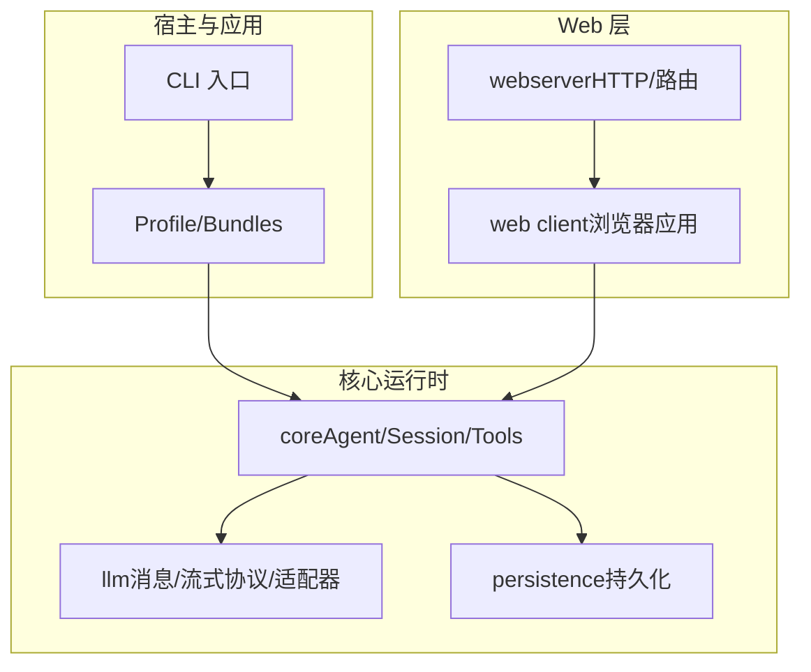
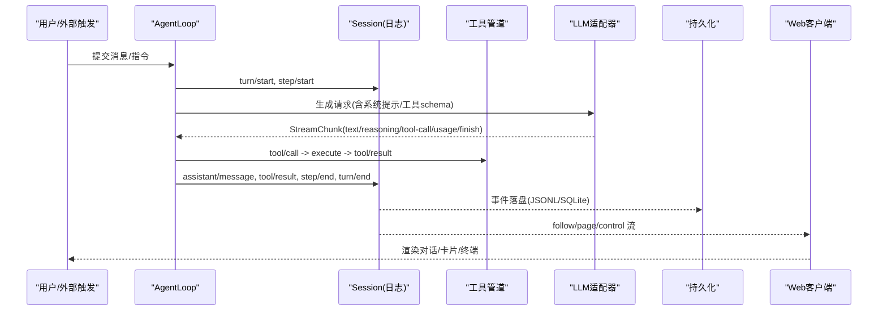
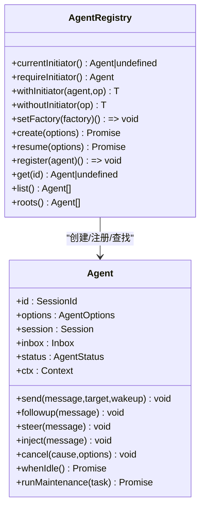
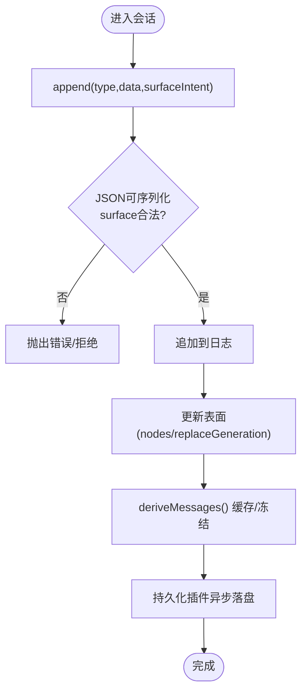
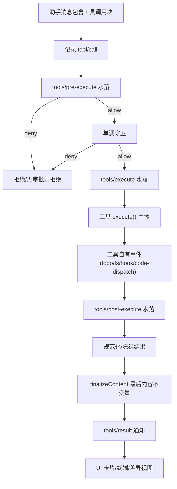
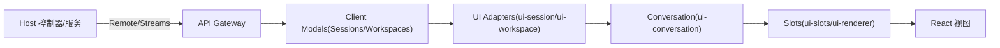
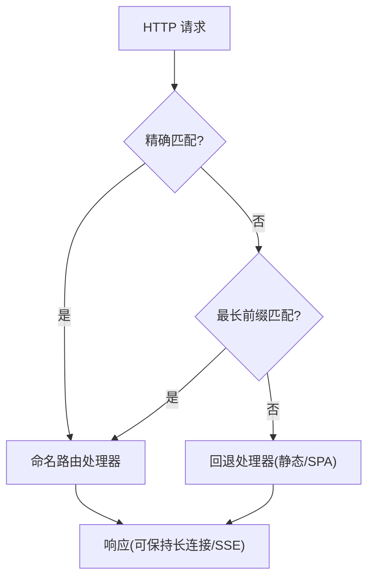
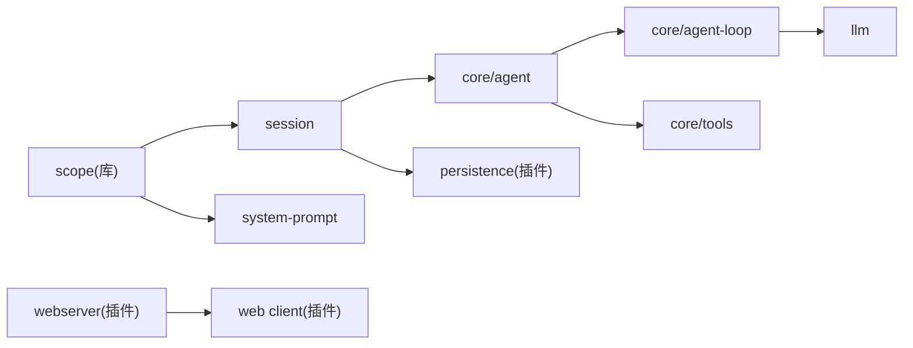

# 核心子系统

<cite>
**本文引用的文件**
- [docs/subsystems/README.md](file://docs/subsystems/README.md)
- [docs/architecture.md](file://docs/architecture.md)
- [docs/subsystems/core.md](file://docs/subsystems/core.md)
- [docs/subsystems/session.md](file://docs/subsystems/session.md)
- [docs/subsystems/tools.md](file://docs/subsystems/tools.md)
- [docs/tool-execution-pipeline.md](file://docs/tool-execution-pipeline.md)
- [docs/subsystems/web-client.md](file://docs/subsystems/web-client.md)
- [docs/subsystems/web-server.md](file://docs/subsystems/web-server.md)
- [docs/subsystems/llm-streaming.md](file://docs/subsystems/llm-streaming.md)
- [packages/webhook/webhook/src/session.ts](file://packages/webhook/webhook/src/session.ts)
</cite>

## 目录
1. [简介](#简介)
2. [项目结构](#项目结构)
3. [核心组件](#核心组件)
4. [架构总览](#架构总览)
5. [详细组件分析](#详细组件分析)
6. [依赖关系分析](#依赖关系分析)
7. [性能考量](#性能考量)
8. [故障排查指南](#故障排查指南)
9. [结论](#结论)
10. [附录](#附录)

## 简介
本文件面向开发者，系统化梳理 DeepSeek Harness 的核心子系统：Agent 管理系统、会话管理、工具执行管道、Web 客户端与 Web 服务器等。文档聚焦各子系统的职责边界、关键接口、数据流与处理流程、配置选项、扩展点与自定义能力，并提供可操作的架构图与时序图，帮助理解并扩展系统功能。

## 项目结构
DeepSeek Harness 基于 Cordis 插件体系构建，所有能力以插件形式注册到共享上下文；应用启动通过 CLI 选择 profile，按层叠加 bundle 与 patch 完成装配。核心包围绕“会话日志 + Agent 循环 + 工具注册 + LLM 适配”展开，Web 侧提供浏览器端应用与 HTTP 承载。

图表来源
- [docs/architecture.md:15-47](file://docs/architecture.md#L15-L47)
- [docs/subsystems/core.md:7-20](file://docs/subsystems/core.md#L7-L20)

章节来源
- [docs/architecture.md:15-47](file://docs/architecture.md#L15-L47)
- [docs/subsystems/README.md:1-63](file://docs/subsystems/README.md#L1-L63)

## 核心组件
- Agent 管理系统：负责 Agent 的创建、生命周期、状态、取消、注入与拦截决策，暴露统一的 Agent 句柄与事件。
- 会话管理：以追加型事件日志为唯一事实源，维护 turn/step 边界、派生消息历史、请求头快照与表面投影。
- 工具执行管道：注册工具定义、参数/输出校验、策略水落（pre-execute/guard/post-execute）、结果规范化与 UI 呈现。
- Web 客户端：浏览器端插件化应用，负责远程通信、模型镜像、会话对话组装与 Slot 渲染。
- Web 服务器：HTTP 承载、路由注册、索引注入与回退处理器，支撑前端资源与 API 桥接。

章节来源
- [docs/subsystems/core.md:7-20](file://docs/subsystems/core.md#L7-L20)
- [docs/subsystems/session.md:1-12](file://docs/subsystems/session.md#L1-L12)
- [docs/subsystems/tools.md:1-12](file://docs/subsystems/tools.md#L1-L12)
- [docs/subsystems/web-client.md:1-30](file://docs/subsystems/web-client.md#L1-L30)
- [docs/subsystems/web-server.md:1-28](file://docs/subsystems/web-server.md#L1-L28)

## 架构总览
下图展示从用户输入到模型调用、工具执行、日志落盘与客户端展示的端到端路径。

图表来源
- [docs/architecture.md:74-101](file://docs/architecture.md#L74-L101)
- [docs/subsystems/session.md:136-177](file://docs/subsystems/session.md#L136-L177)
- [docs/subsystems/tools.md:170-173](file://docs/subsystems/tools.md#L170-L173)
- [docs/subsystems/llm-streaming.md:166-217](file://docs/subsystems/llm-streaming.md#L166-L217)

## 详细组件分析

### Agent 管理系统
- 职责：创建/恢复 Agent、维护运行态、统一 send/followup/steer/inject、取消与空闲等待、拦截 pre-step/request-error。
- 关键接口：
  - AgentHandle：create/resume 返回拥有者句柄，支持 dispose。
  - Agent：send/followup/steer/inject/cancel/whenIdle/runMaintenance。
  - 事件：agent/created、agent/status、agent/pre-step、agent/request-error、agent/turn-stopping 等。
- 数据结构：
  - AgentOptions：provider/model/reasoningEffort/maxTokens。
  - InboxTarget：next-turn/next-step 投递目标。
  - PreStepDecision：reject/enter(messages,startsRequestSeries?)。
- 交互关系：
  - 与 Session：打开 turn/step、写入 user/message、assistant/*、tool/*。
  - 与 Tools：驱动工具调用与结果回写。
  - 与 LLM：发起请求、消费流式响应。
- 扩展点：
  - 自定义 AgentFactory（通过 ctx.agents.setFactory）。
  - 监听 agent/pre-step 重写进入步骤或拒绝。
  - 监听 agent/request-error 实现重试/修复。

图表来源
- [docs/subsystems/core.md:22-51](file://docs/subsystems/core.md#L22-L51)
- [docs/subsystems/core.md:53-155](file://docs/subsystems/core.md#L53-L155)
- [docs/subsystems/core.md:611-779](file://docs/subsystems/core.md#L611-L779)

章节来源
- [docs/subsystems/core.md:22-51](file://docs/subsystems/core.md#L22-L51)
- [docs/subsystems/core.md:53-155](file://docs/subsystems/core.md#L53-L155)
- [docs/subsystems/core.md:611-779](file://docs/subsystems/core.md#L611-L779)

### 会话管理
- 职责：维护追加型事件日志、派生模型可见消息、记录请求头与上下文、提供 fork/分页/跟随流。
- 关键类型：
  - SessionEventMap：turn/start,end；step/start,end；user/message；assistant/chunk,message；tool/call,result；request/header；request/context；session/end-seed。
  - SurfaceOp：append/replace，控制消息表面顺序。
  - EpochHeader：call config、system prompt、tools 快照。
- 处理流程：
  - deriveMessages() 将日志折叠为 Message[]，缓存且冻结。
  - requestHeader()/requestContext() 维护最新请求头与路由上下文。
  - fork(source,boundary?,childSessionId?) 安全分支。
- 扩展点：
  - 声明合并扩展 SessionEventMap 新增日志事件（log-only）。
  - 自定义 persistence 后端订阅 session/event 并在 checkpoint/dispose 时落盘。

图表来源
- [docs/subsystems/session.md:136-177](file://docs/subsystems/session.md#L136-L177)
- [docs/subsystems/session.md:224-330](file://docs/subsystems/session.md#L224-L330)
- [docs/subsystems/session.md:332-492](file://docs/subsystems/session.md#L332-L492)

章节来源
- [docs/subsystems/session.md:136-177](file://docs/subsystems/session.md#L136-L177)
- [docs/subsystems/session.md:224-330](file://docs/subsystems/session.md#L224-L330)
- [docs/subsystems/session.md:332-492](file://docs/subsystems/session.md#L332-L492)

### 工具执行管道
- 职责：注册工具定义、参数/输出校验、策略水落、并行/独占调度、结果规范化与 UI 呈现。
- 关键类型：
  - ToolDefinition：ToolSchema + output + execute + finalizeContent + timeoutMs + isConcurrencySafe + presentCall/presentResult。
  - ToolExecutionInput/ToolExecution/ToolExecutionResult：执行身份、信号、结果（成功/失败）。
  - 水落：tools/pre-execute → guards → tools/execute → tools/post-execute → finalizeContent → tools/result。
- 处理流程：
  - 解析参数并冻结，分配 token。
  - 策略允许/拒绝/询问（approval），守卫单调否决。
  - around-dispatch 包装（超时/重试/指标）。
  - 工具体执行，可能产生自有事件（todo/fs/hook/code-dispatch）。
  - 结果规范化，最终观察者收到冻结结果。
- 扩展点：
  - 注册工具、守卫、around-dispatch、post-execute 替换内容/附加上下文。
  - 自定义 UI 呈现（presentCall/presentResult）。

图表来源
- [docs/tool-execution-pipeline.md:1-63](file://docs/tool-execution-pipeline.md#L1-L63)
- [docs/subsystems/tools.md:170-173](file://docs/subsystems/tools.md#L170-L173)
- [docs/subsystems/tools.md:459-468](file://docs/subsystems/tools.md#L459-L468)

章节来源
- [docs/subsystems/tools.md:1-12](file://docs/subsystems/tools.md#L1-L12)
- [docs/subsystems/tools.md:170-173](file://docs/subsystems/tools.md#L170-L173)
- [docs/subsystems/tools.md:459-468](file://docs/subsystems/tools.md#L459-L468)

### Web 客户端
- 职责：浏览器端插件化应用，建立与 Host 的远程通信，维护会话与工作区模型，组装对话视图并通过 Slot 渲染。
- 关键分层：
  - 传输与 API 装配：Connection、API Gateway、Remotes。
  - Client 模型：Sessions/Workspace 的本地镜像与命令服务。
  - UI 适配器与对话：ui-session/ui-conversation，绑定标准事件与目标视图。
  - 组合与渲染：ui-slots/ui-renderer，挂载根树。
- 数据路径：
  - 持久显示：Host 日志 → Remote follow/page → Client 窗口 → Conversation Contexts → 目标快照 → Slot 视图。
  - 瞬态控制：Host control baseline → SessionManager → 列表/会话快照 → 组件。
- 重连语义：物理连接恢复后，逻辑流各自重建基线并增量更新。

图表来源
- [docs/subsystems/web-client.md:7-30](file://docs/subsystems/web-client.md#L7-L30)
- [docs/subsystems/web-client.md:34-53](file://docs/subsystems/web-client.md#L34-L53)
- [docs/subsystems/web-client.md:54-83](file://docs/subsystems/web-client.md#L54-L83)

章节来源
- [docs/subsystems/web-client.md:7-30](file://docs/subsystems/web-client.md#L7-L30)
- [docs/subsystems/web-client.md:34-83](file://docs/subsystems/web-client.md#L34-L83)

### Web 服务器
- 职责：HTTP 承载、命名路由注册、可选 gzip 压缩、index.html 注入与回退处理器。
- 关键能力：
  - register/registerUpgrade/registerFallback：精确匹配、前缀匹配、回退座位。
  - tapIndex/renderIndex：结构化注入表与原始 HTML 变换。
  - collectIndexInjections：收集当前注入行（模块图/主题等）。
- 配置项：host/port/compression/compressionLevel/compressionThresholdBytes。
- 安全与部署：默认仅监听 127.0.0.1；非 loopback 需自行补充鉴权与 TLS。

图表来源
- [docs/subsystems/web-server.md:9-28](file://docs/subsystems/web-server.md#L9-L28)
- [docs/subsystems/web-server.md:29-53](file://docs/subsystems/web-server.md#L29-L53)

章节来源
- [docs/subsystems/web-server.md:9-53](file://docs/subsystems/web-server.md#L9-L53)

### LLM 流式协议与适配器
- 职责：定义消息/内容块/流式协议，提供适配器契约，封装 BlockAssembler 与请求构造。
- 关键点：
  - ContentBlockMap：text/reasoning/image/tool-call/tool-result。
  - StreamChunk：block-start/delta/block-end/usage/finish。
  - LlmAdapter：stream()、providerInfo/listModels/resolveModelInfo 等。
  - GenerateOptions：provider/model/messages/system/tools/stop/signal/sessionId/purpose。
- 约束：
  - usage 在 finish 之前；arguments 始终为原始 JSON；空完成视为可重试错误；每请求携带应用标识头；上下文溢出使用统一代码。

章节来源
- [docs/subsystems/llm-streaming.md:11-31](file://docs/subsystems/llm-streaming.md#L11-L31)
- [docs/subsystems/llm-streaming.md:166-217](file://docs/subsystems/llm-streaming.md#L166-L217)
- [docs/subsystems/llm-streaming.md:277-298](file://docs/subsystems/llm-streaming.md#L277-L298)
- [docs/subsystems/llm-streaming.md:408-596](file://docs/subsystems/llm-streaming.md#L408-L596)

## 依赖关系分析
- 耦合与内聚：
  - core 包内 session/agent/agent-loop/tools/system-prompt 形成紧密协作环，但通过事件与接口解耦。
  - llm 作为独立词汇与适配器契约，被 core 消费但不反向依赖。
  - web 层通过 API Gateway 与 Host 通信，不直接依赖业务细节。
- 外部集成点：
  - 持久化后端（JSONL/SQLite）通过 session/event 订阅落盘。
  - Web 服务器由宿主插件注册路由，不包含业务语义。
- 潜在循环：scope 作为无依赖库供 session/system-prompt 使用，避免循环依赖。

图表来源
- [docs/subsystems/core.md:7-20](file://docs/subsystems/core.md#L7-L20)
- [docs/architecture.md:49-63](file://docs/architecture.md#L49-L63)

章节来源
- [docs/subsystems/core.md:7-20](file://docs/subsystems/core.md#L7-L20)
- [docs/architecture.md:49-63](file://docs/architecture.md#L49-L63)

## 性能考量
- 会话日志：
  - append 热路径不阻塞 I/O，持久化异步缓冲；deriveMessages 缓存节点投影，替换时重建。
  - 流式 chunk 完整落盘保证回放保真，避免过滤导致序列断裂。
- 工具执行：
  - 通过 isConcurrencySafe 进行滚动池并行；exclusive 模式形成有序屏障。
  - finalizeContent 同步且幂等，避免重复计算。
- LLM 流：
  - 适配器限制空闲超时，统一上下文溢出错误码；空完成可重试。
- Web 层：
  - 连接恢复后逻辑流各自重建基线，减少全量拉取；页面历史通过 page/follow 按需加载。

[本节为通用指导，无需特定文件引用]

## 故障排查指南
- 会话相关：
  - 检查 turn/end 原因（completed/aborted/blocked/error/max-tokens/interrupted），定位是否被中断或达到 token 上限。
  - 确认 request/header 快照是否变更，必要时重新组装请求。
- 工具执行：
  - 若被拒绝，查看 tools/pre-execute 与守卫返回的原因；若超时，检查 timeoutMs 与 around-dispatch 包装。
  - 关注 tools/result 的最终冻结结果，便于审计。
- LLM 流：
  - 遇到错误时检查 FinishReason 与 LlmFailure 的 code/status/providerRetryAfterMs，决定是否重试。
  - 空完成应被视为可重试错误。
- Web 客户端：
  - 连接断开后观察逻辑流是否重建基线；检查 $events 是否转发允许的事件。
- Web 服务器：
  - 路由冲突会抛错；回退处理器未注册会导致未知路径 404；注意 host 绑定与鉴权策略。

章节来源
- [docs/subsystems/session.md:513-549](file://docs/subsystems/session.md#L513-L549)
- [docs/subsystems/tools.md:576-721](file://docs/subsystems/tools.md#L576-L721)
- [docs/subsystems/llm-streaming.md:219-237](file://docs/subsystems/llm-streaming.md#L219-L237)
- [docs/subsystems/web-client.md:72-83](file://docs/subsystems/web-client.md#L72-L83)
- [docs/subsystems/web-server.md:49-53](file://docs/subsystems/web-server.md#L49-L53)

## 结论
DeepSeek Harness 通过“事件溯源的会话日志 + 可插拔 Agent 循环 + 受控工具执行管道 + 标准化 LLM 流式协议 + 插件化的 Web 层”实现了高内聚、低耦合的可扩展架构。开发者可通过声明合并、事件监听、服务注册与钩子水落，在不侵入核心的前提下扩展能力。建议优先遵循既有类型模式与扩展点，确保日志可重构性与回放一致性。

[本节为总结性内容，无需特定文件引用]

## 附录
- 配置选项速览：
  - Web 服务器：host/port/compression/compressionLevel/compressionThresholdBytes。
  - Agent 选项：provider/model/reasoningEffort/maxTokens。
  - 工具：timeoutMs/isConcurrencySafe/presentCall/presentResult。
- 使用示例（路径指引）：
  - 创建/恢复 Agent：参考 AgentRegistry.create/resume。
  - 注册工具：参考 ToolRuntime.register。
  - 监听工具执行：参考 tools/pre-execute/tools/execute/tools/post-execute。
  - 订阅会话事件：参考 session/event 与 follow/page/control。
  - 注册 Web 路由：参考 WebServer.register/registerFallback。

章节来源
- [docs/subsystems/web-server.md:29-53](file://docs/subsystems/web-server.md#L29-L53)
- [docs/subsystems/core.md:157-171](file://docs/subsystems/core.md#L157-L171)
- [docs/subsystems/tools.md:54-93](file://docs/subsystems/tools.md#L54-L93)
- [docs/subsystems/tools.md:576-721](file://docs/subsystems/tools.md#L576-L721)
- [docs/subsystems/session.md:580-734](file://docs/subsystems/session.md#L580-L734)