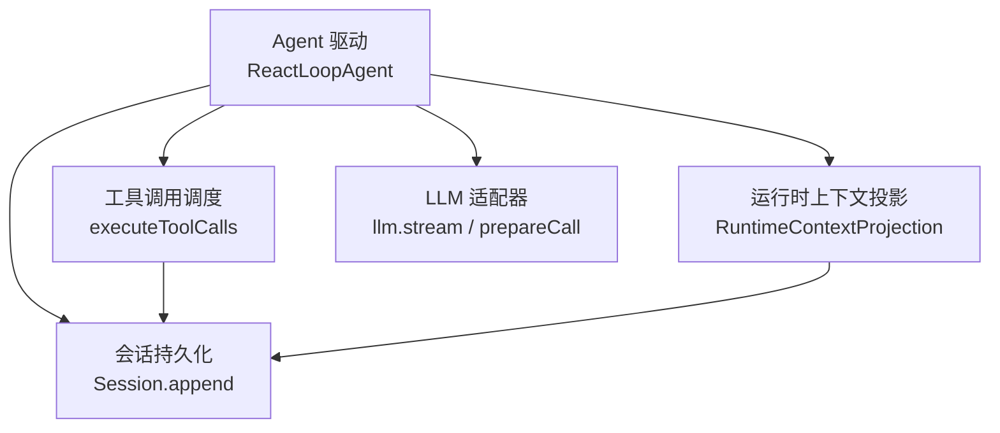
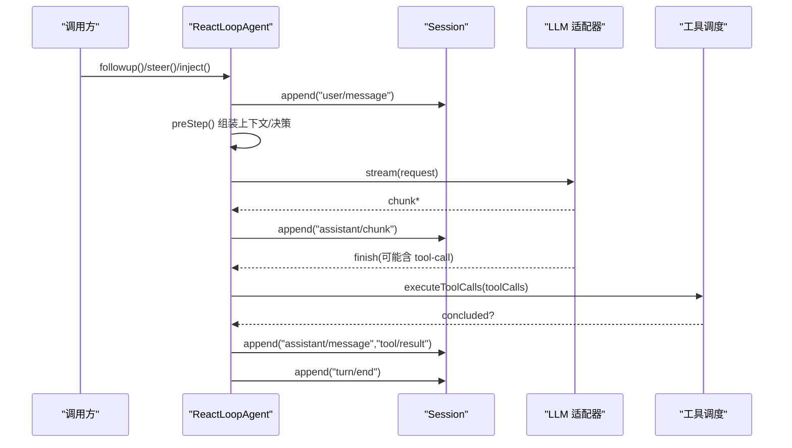
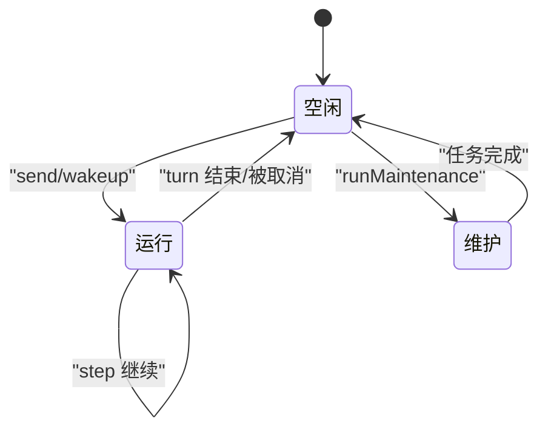
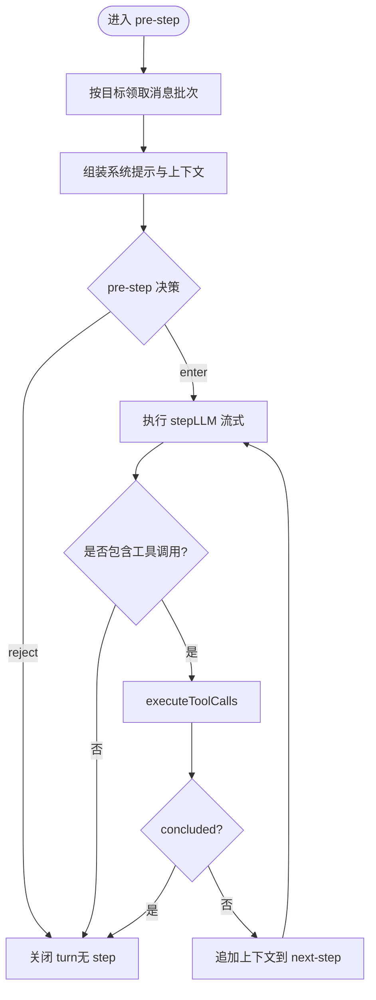
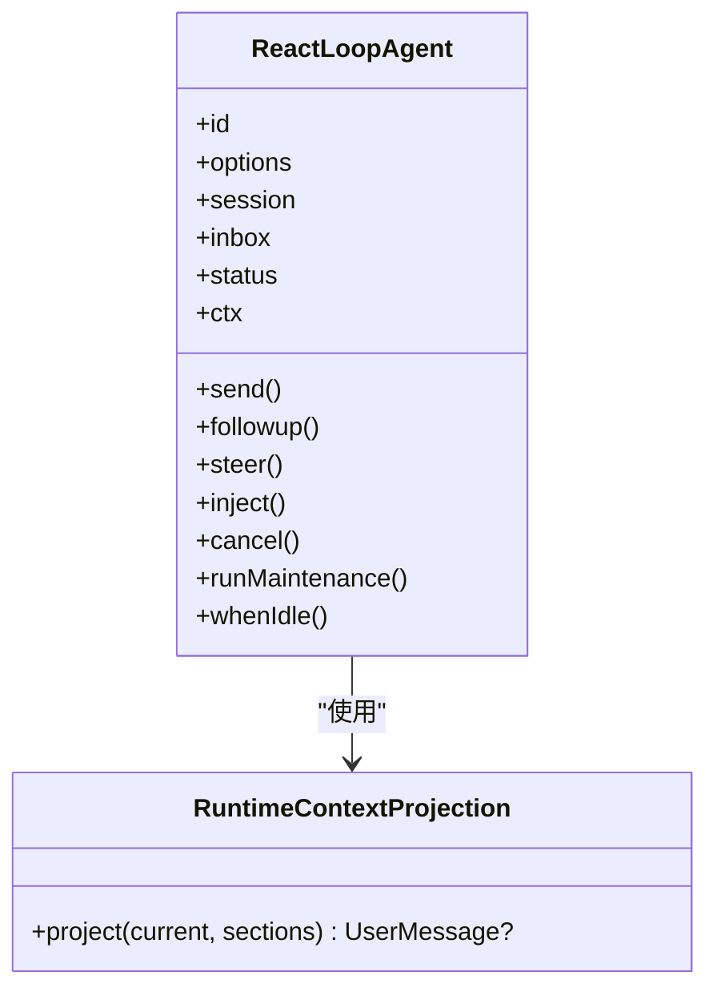
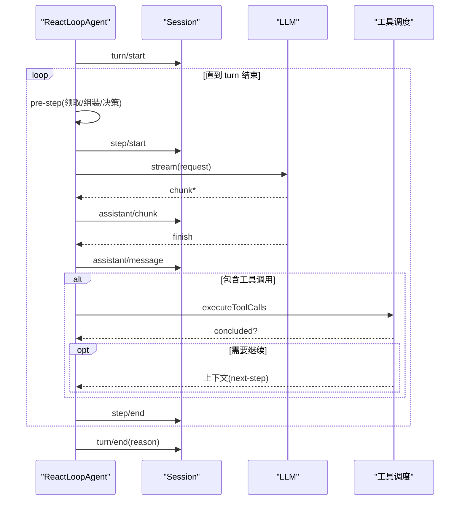
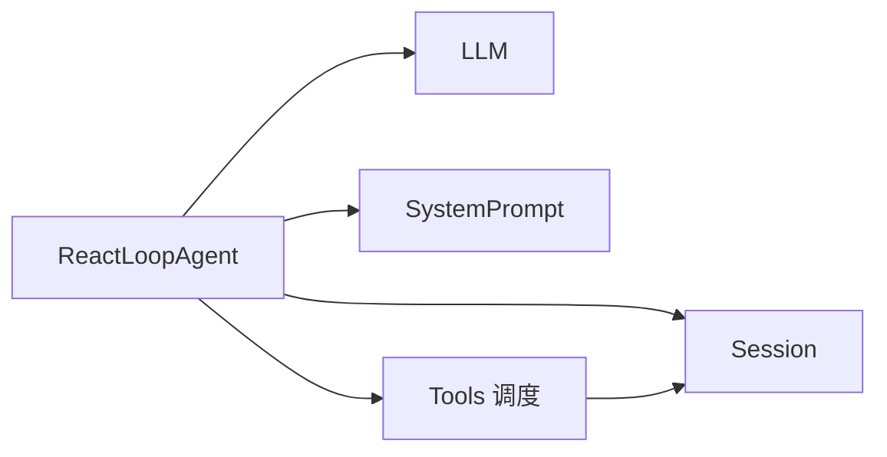

# Agent 核心模块

<cite>
**本文引用的文件**
- [packages/core/agent-loop/src/agent.ts](file://packages/core/agent-loop/src/agent.ts)
- [packages/core/agent-loop/src/tool-calls.ts](file://packages/core/agent-loop/src/tool-calls.ts)
- [packages/core/agent-loop/src/runtime-context.ts](file://packages/core/agent-loop/src/runtime-context.ts)
- [packages/core/agent-loop/tests/agent.spec.ts](file://packages/core/agent-loop/tests/agent.spec.ts)
- [docs/subsystems/core.md](file://docs/subsystems/core.md)
</cite>

## 目录
1. [简介](#简介)
2. [项目结构](#项目结构)
3. [核心组件](#核心组件)
4. [架构总览](#架构总览)
5. [详细组件分析](#详细组件分析)
6. [依赖关系分析](#依赖关系分析)
7. [性能考量](#性能考量)
8. [故障排查指南](#故障排查指南)
9. [结论](#结论)
10. [附录](#附录)

## 简介
本文件聚焦 Agent 核心模块，围绕生命周期管理、状态机设计、消息处理管道、初始化与运行循环、上下文与作用域隔离、配置选项、事件与错误恢复机制展开。同时给出创建与管理 Agent 实例的示例路径，并说明与工具系统、会话管理的集成模式。

## 项目结构
Agent 核心实现位于 agent-loop 包中，关键文件包括：
- 驱动与状态机：ReactLoopAgent（轮次/步骤驱动、状态转换、事件分发）
- 工具调用调度：executeToolCalls（并行/独占执行、有序提交、中止与恢复）
- 运行时上下文投影：RuntimeContextProjection（动态上下文快照与去重）
- 测试与行为验证：agent.spec.ts（注入、引导、状态转换、取消等）

图表来源
- [packages/core/agent-loop/src/agent.ts:64-516](file://packages/core/agent-loop/src/agent.ts#L64-L516)
- [packages/core/agent-loop/src/tool-calls.ts:59-290](file://packages/core/agent-loop/src/tool-calls.ts#L59-L290)
- [packages/core/agent-loop/src/runtime-context.ts:25-77](file://packages/core/agent-loop/src/runtime-context.ts#L25-L77)

章节来源
- [packages/core/agent-loop/src/agent.ts:64-516](file://packages/core/agent-loop/src/agent.ts#L64-L516)
- [packages/core/agent-loop/src/tool-calls.ts:59-290](file://packages/core/agent-loop/src/tool-calls.ts#L59-L290)
- [packages/core/agent-loop/src/runtime-context.ts:25-77](file://packages/core/agent-loop/src/runtime-context.ts#L25-L77)

## 核心组件
- ReactLoopAgent：对外暴露 Agent 接口，负责轮次/步骤驱动、状态机、事件分发、请求构建、工具调用编排、会话写入。
- executeToolCalls：按模型顺序对工具调用进行分组（独占/并行），维护并发池，保证结果有序提交，支持中止与恢复。
- RuntimeContextProjection：跟踪最近一次“运行时上下文”快照，避免重复写入，支持替换事件清理旧快照。
- 会话与事件：通过 Session.append 记录 turn/start/end、step/start/end、assistant/chunk/message、tool/call/result、request/header/context 等。

章节来源
- [packages/core/agent-loop/src/agent.ts:64-516](file://packages/core/agent-loop/src/agent.ts#L64-L516)
- [packages/core/agent-loop/src/tool-calls.ts:59-290](file://packages/core/agent-loop/src/tool-calls.ts#L59-L290)
- [packages/core/agent-loop/src/runtime-context.ts:25-77](file://packages/core/agent-loop/src/runtime-context.ts#L25-L77)

## 架构总览
Agent 以“轮次（turn）+ 步骤（step）”为基本执行单元。每个 turn 包含若干 step；每个 step 可能发起一次 LLM 流式调用，并根据返回的工具调用决定继续或结束。消息通过 Inbox 投递到 next-turn 或 next-step 边界，配合 wake 机制唤醒驱动。

图表来源
- [packages/core/agent-loop/src/agent.ts:245-420](file://packages/core/agent-loop/src/agent.ts#L245-L420)
- [packages/core/agent-loop/src/tool-calls.ts:59-290](file://packages/core/agent-loop/src/tool-calls.ts#L59-L290)

## 详细组件分析

### 生命周期与状态机
- 状态维度
  - 注册生命周期：从创建到销毁，由宿主管理。
  - 活动状态：idle | running，连续多个 turn 可共享一个 running 区间。
  - 待处理消息：inserted/claimed/discarded 事件精确描述 inbox 变化。
  - 轮次阶段：claimed -> pre-step -> 零或多个 request step -> turn end。
- 内部相位
  - idle：无活跃工作。
  - maintenance：非 turn 任务，保持 status=idle，但阻塞后续 driver 启动直到完成。
  - running：正在执行 turn/step，持有 AbortController 用于中断。
- 关键方法
  - send/followup/steer/inject：将消息投递到不同边界，决定是否唤醒驱动。
  - cancel：清空队列（可选保留）、中止当前活动。
  - runMaintenance：在 idle 阶段执行后台任务，完成后若仍有唤醒则继续驱动。
  - whenIdle：等待所有活动收敛。

图表来源
- [packages/core/agent-loop/src/agent.ts:38-111](file://packages/core/agent-loop/src/agent.ts#L38-L111)
- [packages/core/agent-loop/src/agent.ts:142-223](file://packages/core/agent-loop/src/agent.ts#L142-L223)

章节来源
- [packages/core/agent-loop/src/agent.ts:38-223](file://packages/core/agent-loop/src/agent.ts#L38-L223)
- [docs/subsystems/core.md:57-142](file://docs/subsystems/core.md#L57-L142)

### 消息处理管道
- Inbox 目标
  - next-turn：作为新 turn 的唯一普通消息。
  - next-step：在当前 turn 的下一步追加（如 steering 或工具结果上下文）。
- 领取与丢弃
  - 已领取的消息在 pre-step 前独占；若被 reject，消息既不被丢弃也不重放为用户消息，turn 直接关闭。
- 唤醒策略
  - wakeup=true 时，若处于非 idle 且活动已中止，则延迟到下一个 turn 再执行；否则立即唤醒。

图表来源
- [packages/core/agent-loop/src/agent.ts:225-330](file://packages/core/agent-loop/src/agent.ts#L225-L330)
- [packages/core/agent-loop/src/tool-calls.ts:59-290](file://packages/core/agent-loop/src/tool-calls.ts#L59-L290)

章节来源
- [packages/core/agent-loop/src/agent.ts:225-330](file://packages/core/agent-loop/src/agent.ts#L225-L330)
- [packages/core/agent-loop/src/tool-calls.ts:59-290](file://packages/core/agent-loop/src/tool-calls.ts#L59-L290)

### 初始化过程与上下文管理
- 构造阶段
  - 创建事件分发器、Inbox、Scope、扩展后的 Context。
  - 初始化运行时上下文投影，基于历史事件恢复最近快照。
- 作用域隔离
  - 每个 Agent 拥有独立 Scope 与 ctx，插件注册与资源在作用域内生效，随作用域释放而撤销。
- 运行时上下文投影
  - 仅当内容发生变化时才生成新的用户消息；支持“清除标记”与替换事件清理旧快照。

图表来源
- [packages/core/agent-loop/src/agent.ts:64-97](file://packages/core/agent-loop/src/agent.ts#L64-L97)
- [packages/core/agent-loop/src/runtime-context.ts:25-77](file://packages/core/agent-loop/src/runtime-context.ts#L25-L77)

章节来源
- [packages/core/agent-loop/src/agent.ts:64-97](file://packages/core/agent-loop/src/agent.ts#L64-L97)
- [packages/core/agent-loop/src/runtime-context.ts:25-77](file://packages/core/agent-loop/src/runtime-context.ts#L25-L77)

### 运行循环机制（turn/step）
- turn 开启：记录 turn/start，递增 turn 号。
- step 循环：
  - pre-step：领取消息、组装上下文、waterfall 决策。
  - step：构建请求、流式获取片段、写入 assistant/chunk，最终写入 assistant/message。
  - 工具调用：若有 tool-call，交由 executeToolCalls 执行，必要时将结果上下文回注 next-step。
- turn 结束：根据 max-tokens、completed、aborted、error 等原因写入 turn/end。

图表来源
- [packages/core/agent-loop/src/agent.ts:245-420](file://packages/core/agent-loop/src/agent.ts#L245-L420)
- [packages/core/agent-loop/src/tool-calls.ts:59-290](file://packages/core/agent-loop/src/tool-calls.ts#L59-L290)

章节来源
- [packages/core/agent-loop/src/agent.ts:245-420](file://packages/core/agent-loop/src/agent.ts#L245-L420)
- [packages/core/agent-loop/src/tool-calls.ts:59-290](file://packages/core/agent-loop/src/tool-calls.ts#L59-L290)

### 作用域系统与隔离
- 每个 Agent 拥有独立的 Scope 与 ctx，插件注册、服务、监听器等均在作用域内生效。
- 作用域在 Agent 生命周期结束时自动展开，确保资源回收与注册失效。
- 通过 ctx.agents.withInitiator 将发起者 Agent 绑定到异步链路，便于工具执行时识别归属。

章节来源
- [packages/core/agent-loop/src/agent.ts:64-97](file://packages/core/agent-loop/src/agent.ts#L64-L97)
- [packages/core/agent-loop/src/tool-calls.ts:67-80](file://packages/core/agent-loop/src/tool-calls.ts#L67-L80)

### 配置选项与请求构建
- AgentOptions：provider、model、maxTokens 等。
- 请求构建流程：
  - 合并持久化的 header/config 与当前 options。
  - 通过 waterfall 允许中间件修改请求配置。
  - 准备适配器调用（prepareCall），规范化 header，记录 request/header 与 request/context。
  - 冻结最终请求对象，附带 sessionId、signal、system、tools 等。

章节来源
- [packages/core/agent-loop/src/agent.ts:426-514](file://packages/core/agent-loop/src/agent.ts#L426-L514)

### 事件处理与错误恢复
- 事件
  - agent/status：状态切换。
  - agent/inbox/*：消息插入、领取、丢弃。
  - agent/pre-step、agent/request、agent/request-error、agent/turn-stopping：扩展点。
- 错误恢复
  - 请求失败时触发 agent/request-error，支持重试策略；未重试则抛出结构化错误。
  - 工具调用异常会记录 tool/result 并维持模型顺序；中止时补写“提前中止”的结果以保证回放一致性。

章节来源
- [packages/core/agent-loop/src/agent.ts:332-420](file://packages/core/agent-loop/src/agent.ts#L332-L420)
- [packages/core/agent-loop/src/tool-calls.ts:164-246](file://packages/core/agent-loop/src/tool-calls.ts#L164-L246)

### 与工具系统、会话管理的集成
- 工具系统
  - 通过 ctx.tools.executionMode 判定独占/并行。
  - 使用 TOOL_RUNTIME_SCHEDULER 进行 prepare/dispatch/finalize/finish，保证有序提交与上下文回注。
- 会话管理
  - 所有关键节点均通过 Session.append 持久化，形成可回放的事件日志。
  - 工具调用与结果成对记录，携带 sourceEventSeqs 建立关联。

章节来源
- [packages/core/agent-loop/src/tool-calls.ts:59-290](file://packages/core/agent-loop/src/tool-calls.ts#L59-L290)
- [packages/core/agent-loop/src/agent.ts:245-420](file://packages/core/agent-loop/src/agent.ts#L245-L420)

## 依赖关系分析
- ReactLoopAgent 依赖：
  - Session：持久化事件、消息、请求头/上下文。
  - LLM：stream/prepareCall 发起模型调用。
  - SystemPrompt：组装系统提示与上下文。
  - Tools：工具执行调度。
  - Scope/Context：作用域与事件总线。
- executeToolCalls 依赖：
  - Tools 运行时调度器（prepare/dispatch/finalize/finish）。
  - Session：记录 tool/call 与 tool/result。

图表来源
- [packages/core/agent-loop/src/agent.ts:64-516](file://packages/core/agent-loop/src/agent.ts#L64-L516)
- [packages/core/agent-loop/src/tool-calls.ts:59-290](file://packages/core/agent-loop/src/tool-calls.ts#L59-L290)

章节来源
- [packages/core/agent-loop/src/agent.ts:64-516](file://packages/core/agent-loop/src/agent.ts#L64-L516)
- [packages/core/agent-loop/src/tool-calls.ts:59-290](file://packages/core/agent-loop/src/tool-calls.ts#L59-L290)

## 性能考量
- 流式处理：LLM 响应以 chunk 形式逐步写入，降低内存峰值并提升交互性。
- 工具并发控制：通过最大并行度限制并发工具调用，避免资源争用。
- 上下文投影去重：仅在内容变化时写入运行时上下文，减少冗余事件。
- 有序提交：工具结果按模型顺序提交，保证回放一致性与 UI 正确性。

[本节提供通用指导，不直接分析具体文件]

## 故障排查指南
- 常见症状与定位
  - 状态卡在 running：检查是否有未完成的 step 或工具调用；查看 turn/end 是否写入。
  - 消息未消费：确认是否注入到 next-step 而非 next-turn；检查 pre-step 是否 reject。
  - 工具调用未执行：检查 executionMode 是否为 parallel；确认调度器 prepare/dispatch 是否成功。
- 事件追踪
  - 订阅 session/event 与 agent/* 事件，定位 turn/step 边界与工具调用序列。
  - 关注 request/header 与 request/context 变更，确认模型路由与上下文窗口。
- 错误恢复
  - 利用 agent/request-error 实现重试；对于工具调用异常，检查 tool/result 中的 error.info。

章节来源
- [packages/core/agent-loop/src/agent.ts:332-420](file://packages/core/agent-loop/src/agent.ts#L332-L420)
- [packages/core/agent-loop/src/tool-calls.ts:248-290](file://packages/core/agent-loop/src/tool-calls.ts#L248-L290)

## 结论
Agent 核心模块通过清晰的轮次/步骤驱动、严格的状态机、可扩展的事件管线与工具调度，实现了高内聚、低耦合的可插拔架构。其作用域隔离、会话持久化与错误恢复机制，为复杂多轮对话与工具协作提供了稳定基础。

[本节为总结性内容，不直接分析具体文件]

## 附录

### 如何创建与管理 Agent 实例（示例路径）
- 最小可用装配与创建
  - 参考测试 harness：加载 LLM、Session、SystemPrompt、Tools、AgentRegistry、AgentLoop，并注册 mock 适配器后创建 Agent。
  - 示例路径：[packages/core/agent-loop/tests/agent.spec.ts:12-22](file://packages/core/agent-loop/tests/agent.spec.ts#L12-L22)
- 发送消息与等待空闲
  - followup/steer/inject 的使用与 whenIdle 等待。
  - 示例路径：[packages/core/agent-loop/tests/agent.spec.ts:24-40](file://packages/core/agent-loop/tests/agent.spec.ts#L24-L40)
- 状态转换与取消
  - 观察 agent/status 事件，验证 running/idle 转换；使用 cancel 中断挂起请求。
  - 示例路径：[packages/core/agent-loop/tests/agent.spec.ts:113-149](file://packages/core/agent-loop/tests/agent.spec.ts#L113-L149)

章节来源
- [packages/core/agent-loop/tests/agent.spec.ts:12-149](file://packages/core/agent-loop/tests/agent.spec.ts#L12-L149)

### 异步操作与并发请求
- 工具调用的并发与有序提交
  - 通过 executeToolCalls 的并行池与有序提交机制，保证模型顺序与回放一致性。
  - 示例路径：[packages/core/agent-loop/src/tool-calls.ts:121-246](file://packages/core/agent-loop/src/tool-calls.ts#L121-L246)
- 流式 LLM 调用
  - 使用 llm.stream 接收 chunk，逐步写入 assistant/chunk，最终汇总为 assistant/message。
  - 示例路径：[packages/core/agent-loop/src/agent.ts:332-420](file://packages/core/agent-loop/src/agent.ts#L332-L420)

章节来源
- [packages/core/agent-loop/src/tool-calls.ts:121-246](file://packages/core/agent-loop/src/tool-calls.ts#L121-L246)
- [packages/core/agent-loop/src/agent.ts:332-420](file://packages/core/agent-loop/src/agent.ts#L332-L420)

### 与工具系统、会话管理的集成模式
- 工具系统
  - 通过 executionMode 区分独占/并行；使用调度器 prepare/dispatch/finalize/finish 完成执行与收尾。
  - 示例路径：[packages/core/agent-loop/src/tool-calls.ts:164-246](file://packages/core/agent-loop/src/tool-calls.ts#L164-L246)
- 会话管理
  - 所有关键事件通过 Session.append 持久化，形成完整回放链。
  - 示例路径：[packages/core/agent-loop/src/agent.ts:245-420](file://packages/core/agent-loop/src/agent.ts#L245-L420)

章节来源
- [packages/core/agent-loop/src/tool-calls.ts:164-246](file://packages/core/agent-loop/src/tool-calls.ts#L164-L246)
- [packages/core/agent-loop/src/agent.ts:245-420](file://packages/core/agent-loop/src/agent.ts#L245-L420)