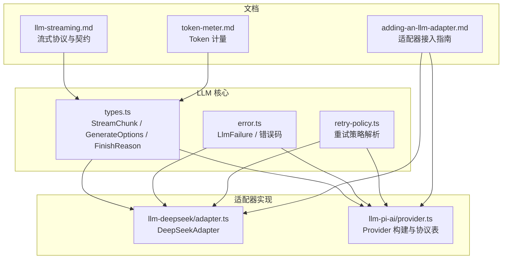
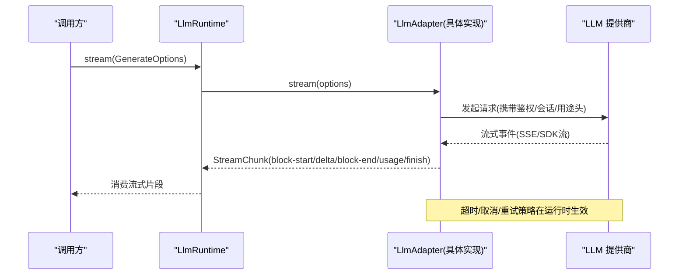
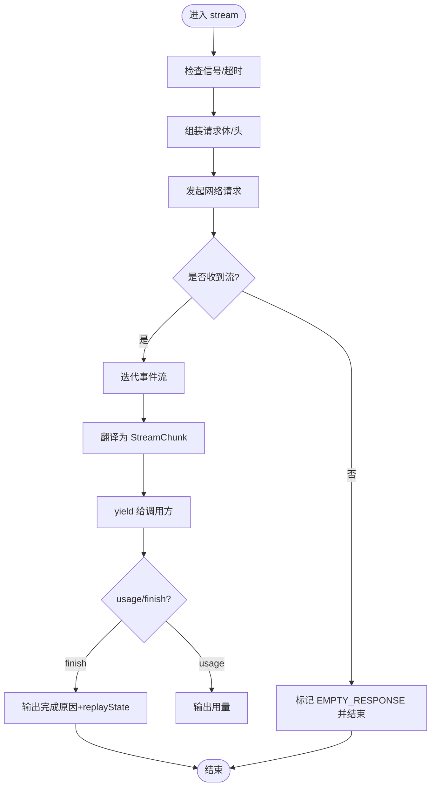
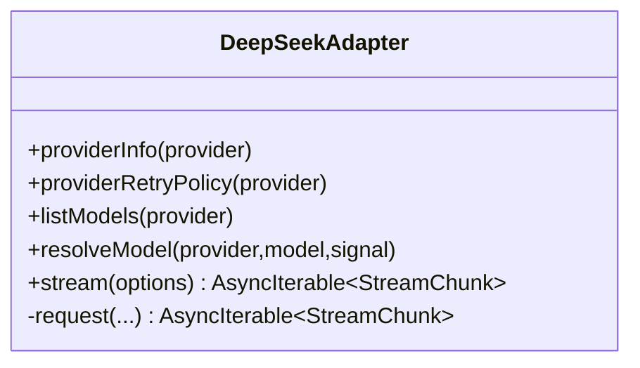
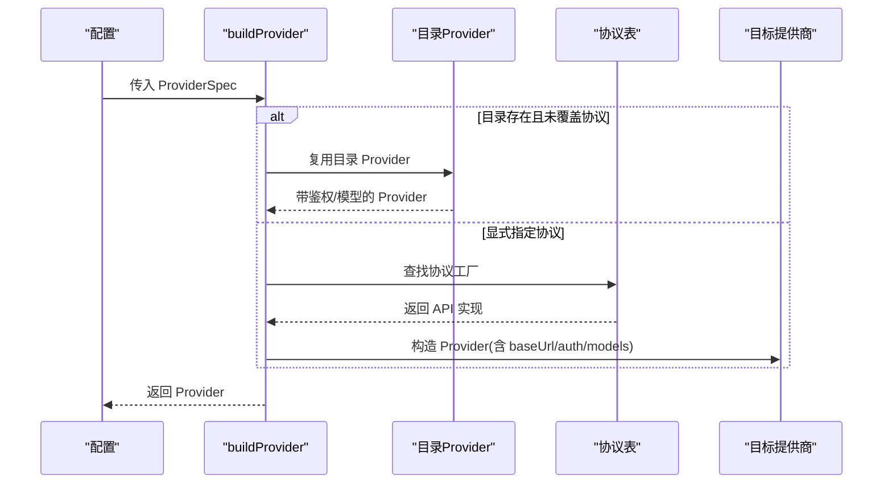
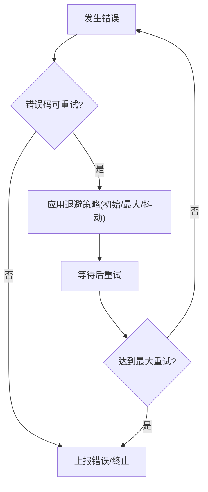
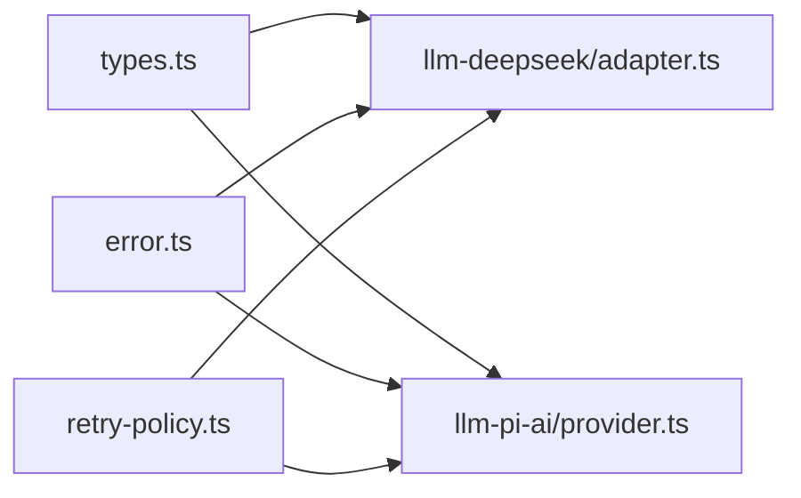

# LLM 适配器

<cite>
**本文引用的文件**
- [packages/llm/llm/src/types.ts](file://packages/llm/llm/src/types.ts)
- [packages/llm/llm/src/error.ts](file://packages/llm/llm/src/error.ts)
- [packages/llm/llm/src/retry-policy.ts](file://packages/llm/llm/src/retry-policy.ts)
- [packages/llm/llm-deepseek/src/adapter.ts](file://packages/llm/llm-deepseek/src/adapter.ts)
- [packages/llm/llm-pi-ai/src/provider.ts](file://packages/llm/llm-pi-ai/src/provider.ts)
- [docs/cookbook/adding-an-llm-adapter.md](file://docs/cookbook/adding-an-llm-adapter.md)
- [docs/subsystems/llm-streaming.md](file://docs/subsystems/llm-streaming.md)
- [docs/subsystems/token-meter.md](file://docs/subsystems/token-meter.md)
</cite>

## 目录
1. [简介](#简介)
2. [项目结构](#项目结构)
3. [核心组件](#核心组件)
4. [架构总览](#架构总览)
5. [详细组件分析](#详细组件分析)
6. [依赖关系分析](#依赖关系分析)
7. [性能与成本考量](#性能与成本考量)
8. [故障排除指南](#故障排除指南)
9. [结论](#结论)
10. [附录：自定义适配器开发指南](#附录自定义适配器开发指南)

## 简介
本文件面向需要在系统中接入或扩展大语言模型（LLM）能力的开发者，系统化说明 LLM 适配器的接口规范、消息格式、流式响应处理、错误重试与超时控制、支持的提供商配置与认证机制、以及自定义适配器的开发与部署实践。文档同时给出模型调优参数、成本控制与性能监控的最佳实践，并提供集成示例与故障排除指引。

## 项目结构
仓库中与 LLM 适配器相关的核心代码集中在 packages/llm 下，包含：
- 抽象协议与类型定义：llm 包
- 直接 HTTP + SSE 的 DeepSeek 适配器：llm-deepseek
- 基于第三方库封装的多提供商适配器：llm-pi-ai
- 重试策略：llm-retry（由上层插件使用）
- Token 用量计量：token-meter

图表来源
- [packages/llm/llm/src/types.ts:1-378](file://packages/llm/llm/src/types.ts#L1-L378)
- [packages/llm/llm-deepseek/src/adapter.ts:1-387](file://packages/llm/llm-deepseek/src/adapter.ts#L1-L387)
- [packages/llm/llm-pi-ai/src/provider.ts:1-193](file://packages/llm/llm-pi-ai/src/provider.ts#L1-L193)
- [docs/cookbook/adding-an-llm-adapter.md:1-44](file://docs/cookbook/adding-an-llm-adapter.md#L1-L44)
- [docs/subsystems/llm-streaming.md:154-240](file://docs/subsystems/llm-streaming.md#L154-L240)
- [docs/subsystems/token-meter.md:1-91](file://docs/subsystems/token-meter.md#L1-L91)

章节来源
- [packages/llm/llm/src/types.ts:1-378](file://packages/llm/llm/src/types.ts#L1-L378)
- [docs/cookbook/adding-an-llm-adapter.md:1-44](file://docs/cookbook/adding-an-llm-adapter.md#L1-L44)

## 核心组件
- 适配器契约与数据模型
  - StreamChunk：适配器向上传递的原始流式片段集合，包括文本增量、推理增量、工具调用增量、块结束、用量统计和完成原因等。
  - GenerateOptions：一次模型请求的完整入参，包含 provider、model、messages、system、tools、temperature、maxTokens、stop、signal、sessionId、purpose 等。
  - FinishReason：完成原因，支持 stop、tool-calls、max-tokens、aborted、error。
  - LlmFailure：标准化的失败事实，包含 message、code、status、providerRetryAfterMs、requestId。
  - TokenUsage：按次计量的 token 用量，inputTokens/outputTokens/cacheReadTokens/cacheWriteTokens/reasoningTokens。
- 重试策略
  - 支持 normal（有限重试）与 always（无限重试）两种模式，可配置初始延迟、最大延迟、抖动比例，以及可重试的错误码集合。
- 错误与异常
  - 统一 HarnessError/LlmError 体系，提供稳定 code 用于路由与重试决策；内置上下文超限、配额耗尽、空响应等标准码识别。
- 提供商与模型元数据
  - listModels/resolveModel 暴露模型能力、上下文窗口、默认 maxTokens、推理努力等级等。

章节来源
- [packages/llm/llm/src/types.ts:39-378](file://packages/llm/llm/src/types.ts#L39-L378)
- [packages/llm/llm/src/retry-policy.ts:1-196](file://packages/llm/llm/src/retry-policy.ts#L1-L196)
- [packages/llm/llm/src/error.ts:1-164](file://packages/llm/llm/src/error.ts#L1-L164)
- [docs/subsystems/llm-streaming.md:154-240](file://docs/subsystems/llm-streaming.md#L154-L240)

## 架构总览
系统通过统一的 LlmAdapter 抽象屏蔽不同提供商差异，向上层暴露一致的流式 API 与消息模型。两个参考实现分别采用：
- llm-deepseek：直接 HTTP + SSE 调用 OpenAI 兼容端点，自行解析事件流并转换为 StreamChunk。
- llm-pi-ai：基于第三方 SDK 封装，通过协议表映射到 OpenAI Completions/Responses 与 Anthropic Messages 等协议。

图表来源
- [packages/llm/llm/src/types.ts:304-378](file://packages/llm/llm/src/types.ts#L304-L378)
- [packages/llm/llm-deepseek/src/adapter.ts:228-385](file://packages/llm/llm-deepseek/src/adapter.ts#L228-L385)
- [packages/llm/llm-pi-ai/src/provider.ts:29-51](file://packages/llm/llm-pi-ai/src/provider.ts#L29-L51)

## 详细组件分析

### 适配器契约与流式协议
- 适配器必须实现 stream(options): AsyncIterable<StreamChunk>。
- 严格遵循流式契约：
  - usage 必须在 finish 之前发出，finish 之后不得再有任何 chunk。
  - 工具调用参数始终以原始 JSON 字符串形式传递，增量以 argumentsDelta 发送。
  - 错误两条路径：从 stream() 抛出（传输/协议错误），或在流末尾以 finish {kind:'error'|'aborted', failure} 返回（提供商内联错误）。
  - 必须尊重 options.signal，并在空闲时进行超时保护。
  - 上下文超限需使用统一错误码，空完成视为可重试错误。
- BlockAssembler 将 StreamChunk 折叠为完整的 ContentBlock 与最终 Message，并维护 replayState。

图表来源
- [packages/llm/llm/src/types.ts:304-378](file://packages/llm/llm/src/types.ts#L304-L378)
- [docs/subsystems/llm-streaming.md:154-240](file://docs/subsystems/llm-streaming.md#L154-L240)
- [packages/llm/llm-deepseek/src/adapter.ts:304-385](file://packages/llm/llm-deepseek/src/adapter.ts#L304-L385)

章节来源
- [docs/subsystems/llm-streaming.md:154-240](file://docs/subsystems/llm-streaming.md#L154-L240)
- [packages/llm/llm/src/types.ts:304-378](file://packages/llm/llm/src/types.ts#L304-L378)

### DeepSeek 适配器（HTTP + SSE）
- 职责：负责连接、鉴权、序列化请求、SSE 解析、错误映射、超时与取消。
- 关键特性：
  - 每请求解析密钥与连接信息，避免跨代配置污染。
  - 支持图片输入（需满足模型能力与附件服务）。
  - 将 HTTP 状态与提供商错误映射为标准 LlmError code（如 AUTH、RATE_LIMIT、CONTEXT_WINDOW_EXCEEDED、QUOTA 等）。
  - 使用 idle watchdog 保障流空闲超时，结合 caller signal 区分 ABORTED 与 TIMEOUT。
  - 透传 x-deepseek-harness-* 头用于追踪与用途标记。

图表来源
- [packages/llm/llm-deepseek/src/adapter.ts:171-387](file://packages/llm/llm-deepseek/src/adapter.ts#L171-L387)

章节来源
- [packages/llm/llm-deepseek/src/adapter.ts:171-387](file://packages/llm/llm-deepseek/src/adapter.ts#L171-L387)

### pi-ai 多提供商适配器（OpenAI/Anthropic 等）
- 职责：通过协议表将配置路由映射到具体提供商实现，复用已安装目录中的 Provider，或按需创建。
- 支持协议：openai-completions、openai-responses、anthropic-messages。
- 鉴权：
  - 对目录中自带鉴权的 Provider 保持其原生鉴权流程。
  - 若目录 Provider 未提供 apiKey 方法且配置声明了凭据，则注入 harnessApiKeyAuth。
  - 仅 OAuth 的提供商（如 openai-codex）不会出现在可配置列表中，除非具备 apiKey 能力。
- 模型发现与选择：
  - 目录 Provider 保留动态刷新能力；手动覆盖协议时走协议表工厂。

图表来源
- [packages/llm/llm-pi-ai/src/provider.ts:29-51](file://packages/llm/llm-pi-ai/src/provider.ts#L29-L51)
- [packages/llm/llm-pi-ai/src/provider.ts:131-193](file://packages/llm/llm-pi-ai/src/provider.ts#L131-L193)

章节来源
- [packages/llm/llm-pi-ai/src/provider.ts:29-51](file://packages/llm/llm-pi-ai/src/provider.ts#L29-L51)
- [packages/llm/llm-pi-ai/src/provider.ts:131-193](file://packages/llm/llm-pi-ai/src/provider.ts#L131-L193)

### 错误、重试与超时
- 错误分类：
  - 上下文超限：CONTEXT_WINDOW_EXCEEDED
  - 配额耗尽：QUOTA
  - 空响应：EMPTY_RESPONSE（可重试）
  - 鉴权无效：INVALID_CREDENTIAL
  - 其他：AUTH、RATE_LIMIT、SERVER、TRANSPORT、TIMEOUT 等
- 重试策略：
  - normal：限定次数与可重试码，指数退避+抖动。
  - always：无限重试直到成功、取消或释放。
- 超时控制：
  - 流空闲超时（默认 5 分钟），由 watchdog 管理，区分 ABORTED 与 TIMEOUT。
  - 所有请求尊重 caller 提供的 AbortSignal。

图表来源
- [packages/llm/llm/src/retry-policy.ts:1-196](file://packages/llm/llm/src/retry-policy.ts#L1-L196)
- [packages/llm/llm/src/error.ts:24-49](file://packages/llm/llm/src/error.ts#L24-L49)
- [packages/llm/llm-deepseek/src/adapter.ts:129-162](file://packages/llm/llm-deepseek/src/adapter.ts#L129-L162)

章节来源
- [packages/llm/llm/src/retry-policy.ts:1-196](file://packages/llm/llm/src/retry-policy.ts#L1-L196)
- [packages/llm/llm/src/error.ts:1-164](file://packages/llm/llm/src/error.ts#L1-L164)
- [packages/llm/llm-deepseek/src/adapter.ts:129-162](file://packages/llm/llm-deepseek/src/adapter.ts#L129-L162)

### 模型选择与元数据
- 通过 listModels 提供可选模型列表（建议性，不限制实际路由）。
- resolveModel 返回精确模型元数据：上下文窗口、默认 maxTokens、推理努力等级（id/name/description）、输入模态（text/image）。
- 推理努力：由适配器维护有序列表与默认值，允许关闭或多种强度。

章节来源
- [packages/llm/llm/src/types.ts:143-281](file://packages/llm/llm/src/types.ts#L143-L281)
- [packages/llm/llm-deepseek/src/adapter.ts:184-226](file://packages/llm/llm-deepseek/src/adapter.ts#L184-L226)

## 依赖关系分析
- 适配器与核心类型的耦合：
  - 所有适配器均依赖 types.ts 定义的 StreamChunk、GenerateOptions、FinishReason、TokenUsage 等。
  - 错误处理依赖 error.ts 的统一错误码与识别函数。
  - 重试策略由 retry-policy.ts 提供，供上层插件或适配器自身使用。
- 提供商协议解耦：
  - llm-deepseek 直接对接 OpenAI 兼容端点。
  - llm-pi-ai 通过协议表映射到 OpenAI/Anthropic 等，屏蔽底层差异。

图表来源
- [packages/llm/llm/src/types.ts:1-378](file://packages/llm/llm/src/types.ts#L1-L378)
- [packages/llm/llm/src/error.ts:1-164](file://packages/llm/llm/src/error.ts#L1-L164)
- [packages/llm/llm/src/retry-policy.ts:1-196](file://packages/llm/llm/src/retry-policy.ts#L1-L196)
- [packages/llm/llm-deepseek/src/adapter.ts:1-387](file://packages/llm/llm-deepseek/src/adapter.ts#L1-L387)
- [packages/llm/llm-pi-ai/src/provider.ts:1-193](file://packages/llm/llm-pi-ai/src/provider.ts#L1-L193)

章节来源
- [packages/llm/llm/src/types.ts:1-378](file://packages/llm/llm/src/types.ts#L1-L378)
- [packages/llm/llm/src/error.ts:1-164](file://packages/llm/llm/src/error.ts#L1-L164)
- [packages/llm/llm/src/retry-policy.ts:1-196](file://packages/llm/llm/src/retry-policy.ts#L1-L196)

## 性能与成本考量
- 流式处理
  - 使用 StreamChunk 增量消费，降低首字延迟与内存占用。
  - 合理使用 block-start/block-end 索引关联，避免重复组装。
- 超时与取消
  - 启用流空闲超时，防止长尾阻塞；及时响应 caller 取消信号。
- 重试策略
  - 针对 RATE_LIMIT、SERVER、TIMEOUT、TRANSPORT、EMPTY_RESPONSE 等设置合理重试。
  - 指数退避+抖动减少雪崩风险。
- Token 计量与成本控制
  - 使用 TokenUsage 记录每次调用用量，结合 token-meter 进行表面压力估算与回放度量。
  - 根据模型能力与业务需求设置合理的 maxTokens、temperature、stop 等参数。
- 模型调优参数
  - temperature：影响创造性与稳定性。
  - maxTokens：控制输出上限，避免过长导致成本飙升。
  - stop：精准截断，减少无用输出。
  - reasoningEffort：在支持的场景下调整推理深度，平衡质量与成本。

章节来源
- [docs/subsystems/llm-streaming.md:267-287](file://docs/subsystems/llm-streaming.md#L267-L287)
- [docs/subsystems/token-meter.md:1-91](file://docs/subsystems/token-meter.md#L1-L91)
- [packages/llm/llm/src/types.ts:340-378](file://packages/llm/llm/src/types.ts#L340-L378)

## 故障排除指南
- 常见问题定位
  - 鉴权失败：检查 AUTH/INVALID_CREDENTIAL，确认密钥来源与有效期。
  - 速率限制：RATE_LIMIT，适当退避与限流。
  - 上下文超限：CONTEXT_WINDOW_EXCEEDED，压缩历史或切换更大上下文模型。
  - 配额耗尽：QUOTA，联系管理员或更换账户。
  - 空响应：EMPTY_RESPONSE，视为可重试错误。
- 日志与诊断
  - 利用 requestId、status、providerRetryAfterMs 等字段定位问题。
  - 使用 errorChain 渲染完整错误链，便于排查嵌套异常。
- 流式问题
  - 确保 usage 在 finish 前发出，禁止 finish 后再发任何 chunk。
  - 校验 block index 一致性，避免错位导致组装失败。

章节来源
- [packages/llm/llm/src/error.ts:24-49](file://packages/llm/llm/src/error.ts#L24-L49)
- [packages/llm/llm/src/error.ts:102-154](file://packages/llm/llm/src/error.ts#L102-L154)
- [docs/subsystems/llm-streaming.md:227-240](file://docs/subsystems/llm-streaming.md#L227-L240)

## 结论
本适配器体系通过统一的流式协议与错误模型，屏蔽了不同 LLM 提供商的差异，提供了可靠的超时、重试与计量能力。借助 DeepSeek 与 pi-ai 两种参考实现，可以快速接入 OpenAI 兼容端点与 Anthropic 等主流提供商。遵循契约与最佳实践，可在保证稳定性的同时优化成本与性能。

## 附录：自定义适配器开发指南
- 基本步骤
  - 继承 LlmAdapter，实现 stream(options): AsyncIterable<StreamChunk>。
  - 注册适配器：ctx.llm.registerAdapter(['your-provider'], new YourAdapter(...))。
  - 提供 providerInfo/listModels/resolveModel 以暴露模型能力与元数据。
- 协议义务
  - 严格遵循 StreamChunk 契约：usage 在 finish 前，arguments 保持原始 JSON 字符串。
  - 错误两条路径：抛出或 finish {kind:'error'|'aborted'}。
  - 尊重 options.signal，实现空闲超时。
- 配置与认证
  - 使用 Cordis 配置与凭缝（credentials），不在代码中硬编码密钥。
  - 对于 pi-ai 协议表，确保 api 字段在支持范围内。
- 测试与验证
  - 遵循仓库测试策略，覆盖真实提供商调用与边界情况。
  - 使用 mock 服务器验证流式行为与错误路径。
- 部署
  - 通过插件机制注册适配器与可配置提供商。
  - 确保 HMR 安全与原子替换（replace）能力。

章节来源
- [docs/cookbook/adding-an-llm-adapter.md:1-44](file://docs/cookbook/adding-an-llm-adapter.md#L1-L44)
- [packages/llm/llm/src/types.ts:304-378](file://packages/llm/llm/src/types.ts#L304-L378)
- [packages/llm/llm-pi-ai/src/provider.ts:29-51](file://packages/llm/llm-pi-ai/src/provider.ts#L29-L51)