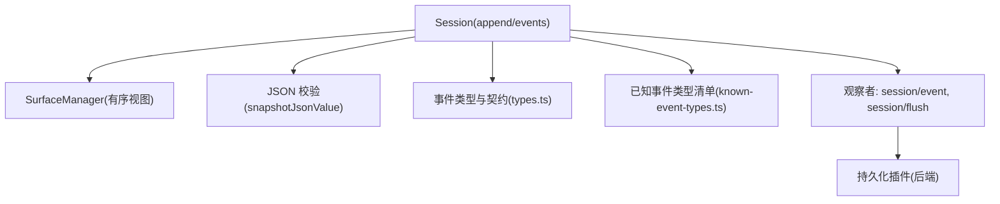
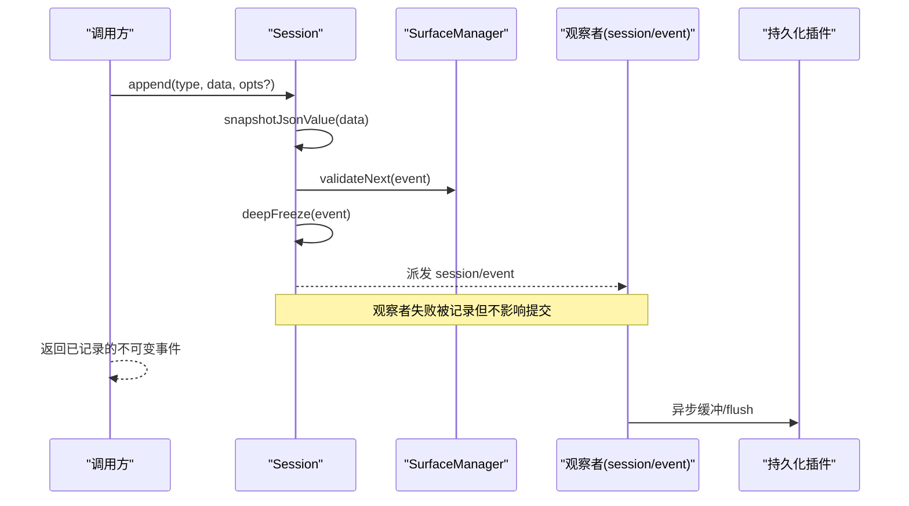
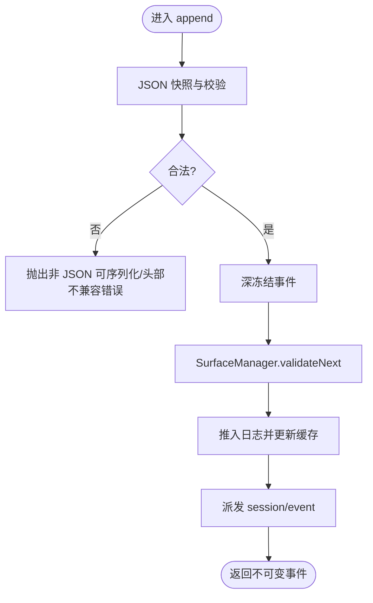
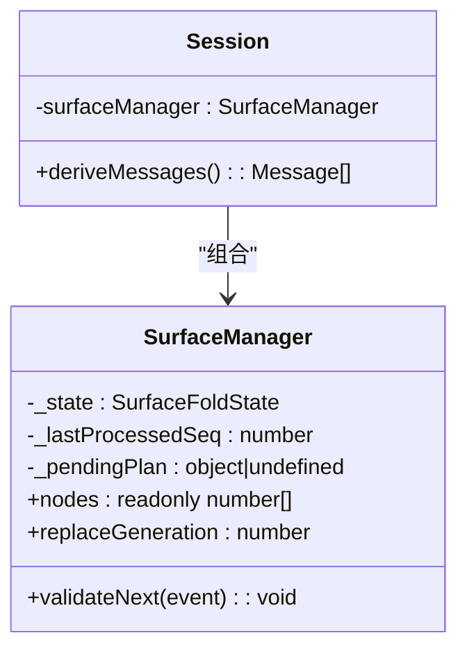
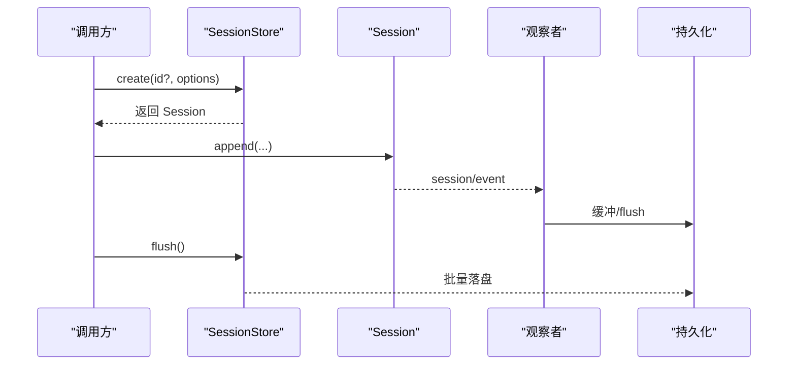
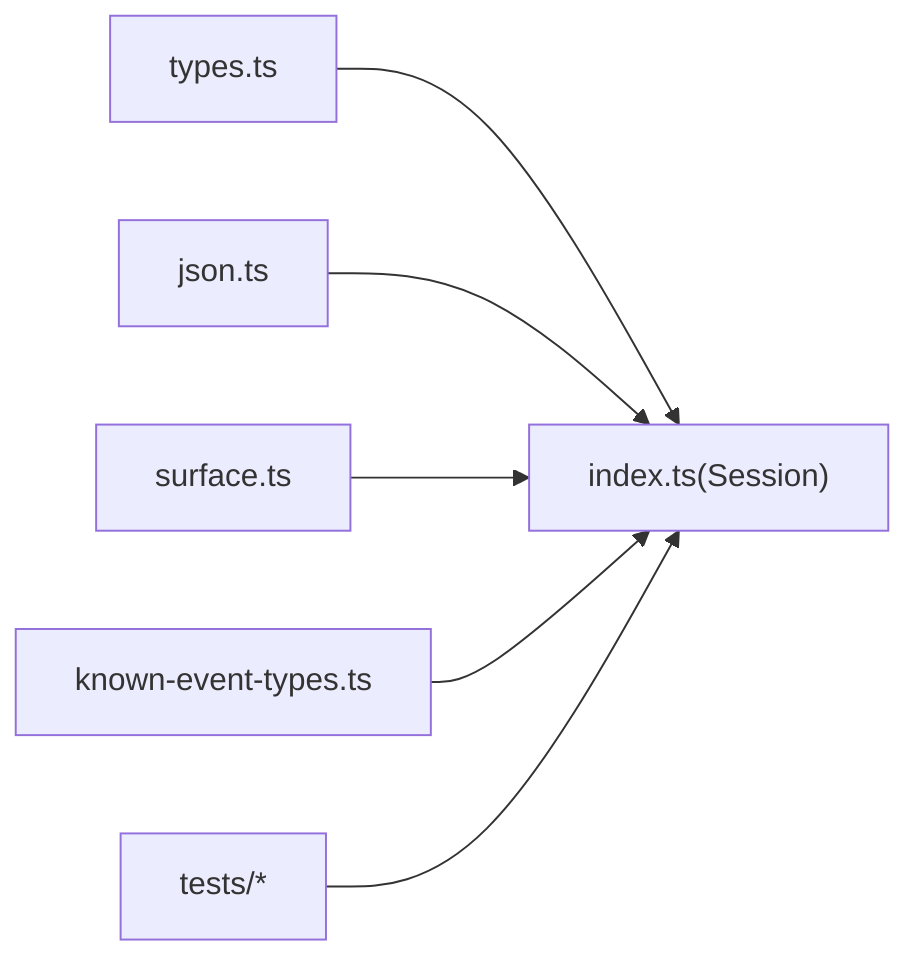

# 事件日志系统

<cite>
**本文引用的文件**
- [packages/core/session/src/index.ts](file://packages/core/session/src/index.ts)
- [packages/core/session/src/types.ts](file://packages/core/session/src/types.ts)
- [packages/core/session/src/surface.ts](file://packages/core/session/src/surface.ts)
- [packages/core/session/src/json.ts](file://packages/core/session/src/json.ts)
- [packages/core/session/src/known-event-types.ts](file://packages/core/session/src/known-event-types.ts)
- [packages/core/session/tests/session.spec.ts](file://packages/core/session/tests/session.spec.ts)
- [packages/session/session-persistence-jsonl/tests/jsonl.spec.ts](file://packages/session/session-persistence-jsonl/tests/jsonl.spec.ts)
- [packages/session/session-persistence/tests/coordinator-contract.ts](file://packages/session/session-persistence/tests/coordinator-contract.ts)
</cite>

## 目录
1. [简介](#简介)
2. [项目结构](#项目结构)
3. [核心组件](#核心组件)
4. [架构总览](#架构总览)
5. [详细组件分析](#详细组件分析)
6. [依赖关系分析](#依赖关系分析)
7. [性能考量](#性能考量)
8. [故障排查指南](#故障排查指南)
9. [结论](#结论)
10. [附录：API 使用示例与最佳实践](#附录api-使用示例与最佳实践)

## 简介
本文件系统性地梳理会话的事件驱动架构，围绕“追加写入”的不可变事件日志、类型安全的事件定义与验证机制展开。重点解释 SessionEvent 数据结构的设计约束（事件类型、序列号、时间戳、数据载荷）、JSON 序列化要求与深度冻结保证，以及从创建到持久化的完整生命周期。文档同时提供 API 使用示例、错误处理策略、调试技巧与性能优化建议，帮助读者在生产环境中正确、高效地使用事件日志系统。

## 项目结构
该子系统由核心会话实现、类型定义、表面投影层、JSON 校验工具、已知事件类型清单以及测试与持久化契约组成：
- 核心会话与存储：Session、SessionStore、事件发布与观察者钩子
- 类型与契约：SessionEvent、SurfaceOp、SurfaceIntent、SessionHeader 等
- 表面投影：SurfaceManager 维护模型可见的消息有序视图
- JSON 校验：snapshotJsonValue/isJsonValue 确保无损失序列化
- 已知事件类型：KNOW_SESSION_EVENT_TYPES 用于读取端拒绝未知必需事件
- 测试与契约：覆盖不可变性、序列化边界、持久化协调器行为

图表来源
- [packages/core/session/src/index.ts:425-758](file://packages/core/session/src/index.ts#L425-L758)
- [packages/core/session/src/surface.ts:397-461](file://packages/core/session/src/surface.ts#L397-L461)
- [packages/core/session/src/json.ts:165-190](file://packages/core/session/src/json.ts#L165-L190)
- [packages/core/session/src/known-event-types.ts:19-68](file://packages/core/session/src/known-event-types.ts#L19-L68)

章节来源
- [packages/core/session/src/index.ts:425-758](file://packages/core/session/src/index.ts#L425-L758)
- [packages/core/session/src/types.ts:231-441](file://packages/core/session/src/types.ts#L231-L441)
- [packages/core/session/src/surface.ts:1-142](file://packages/core/session/src/surface.ts#L1-L142)
- [packages/core/session/src/json.ts:165-190](file://packages/core/session/src/json.ts#L165-L190)
- [packages/core/session/src/known-event-types.ts:19-68](file://packages/core/session/src/known-event-types.ts#L19-L68)

## 核心组件
- Session：追加式事件日志的核心，负责事件构造、验证、深冻结、发布与派生历史计算
- SurfaceManager：基于 surfaceOp 维护模型可见的有序消息视图，支持 append 与 replace
- JSON 校验器：snapshotJsonValue/isJsonValue 提供严格、迭代、无栈溢风险的 JSON 快照
- 类型与契约：SessionEvent、SurfaceOp、SurfaceIntent、SessionHeader 等强类型约束
- 已知事件类型清单：限制读取端对未知事件的容忍度，避免静默误读

章节来源
- [packages/core/session/src/index.ts:425-758](file://packages/core/session/src/index.ts#L425-L758)
- [packages/core/session/src/surface.ts:184-461](file://packages/core/session/src/surface.ts#L184-L461)
- [packages/core/session/src/json.ts:165-190](file://packages/core/session/src/json.ts#L165-L190)
- [packages/core/session/src/types.ts:231-441](file://packages/core/session/src/types.ts#L231-L441)
- [packages/core/session/src/known-event-types.ts:19-68](file://packages/core/session/src/known-event-types.ts#L19-L68)

## 架构总览
事件驱动会话采用“追加写入 + 有序表面投影”的双层设计：
- 底层是不可变的追加日志，所有事件以严格类型和 JSON 可序列化约束进入
- 上层通过 surfaceOp 将消息类事件组织为有序视图，供 LLM 历史推导与 UI 展示
- 观察者模式解耦持久化与遥测：session/event 推送新事件，session/flush 触发批量落盘

图表来源
- [packages/core/session/src/index.ts:604-655](file://packages/core/session/src/index.ts#L604-L655)
- [packages/core/session/src/surface.ts:417-429](file://packages/core/session/src/surface.ts#L417-L429)
- [packages/core/session/src/json.ts:165-190](file://packages/core/session/src/json.ts#L165-L190)

## 详细组件分析

### 事件数据结构与类型安全
- SessionEvent 是判别联合类型，type 决定 data 的具体形状；非表面事件不得携带 surfaceOp/sourceEventSeqs
- seq 单调递增且连续（seq = log.length），time 为 Unix 毫秒
- ignorable 标记允许未知类型在读取时安全跳过，默认必需，防止静默重建错误会话
- SurfaceEventType 限定 user/message、assistant/message、tool/result，必须声明 surfaceOp 如何进入有序视图
- SurfaceOp 支持 append 与 replace(start,end)，replace 需引用被替换节点并满足工具结果重写规则

章节来源
- [packages/core/session/src/types.ts:231-441](file://packages/core/session/src/types.ts#L231-L441)
- [packages/core/session/src/surface.ts:184-243](file://packages/core/session/src/surface.ts#L184-L243)

### 追加写入与不可变性
- append 先做 JSON 快照与请求头兼容性检查，再深冻结事件，最后通过 SurfaceManager.validateNext 进行表面合法性校验
- 一旦进入日志即提交；观察者失败仅记录，不改变返回值或阻止后续观察
- events 属性返回缓存的只读快照，每次 append 后失效并重用新的冻结数组
- 种子事件（seed）在构造时同样经过同一套校验与冻结，保证回放/分叉一致性

图表来源
- [packages/core/session/src/index.ts:604-655](file://packages/core/session/src/index.ts#L604-L655)
- [packages/core/session/src/surface.ts:417-429](file://packages/core/session/src/surface.ts#L417-L429)

章节来源
- [packages/core/session/src/index.ts:599-655](file://packages/core/session/src/index.ts#L599-L655)
- [packages/core/session/tests/session.spec.ts:903-975](file://packages/core/session/tests/session.spec.ts#L903-L975)

### JSON 序列化与深度冻结
- snapshotJsonValue 迭代遍历对象图，拒绝稀疏数组、循环引用、函数/Symbol/BigInt/undefined/负零/非有限数及非常规对象
- 对恢复路径使用 freezeRestoredObject 避免递归栈溢出，支持极深嵌套
- adoptSessionEvent/snapshotSessionEvent 针对消息事件的数据字段进行深冻结，保证跨边界不可变

章节来源
- [packages/core/session/src/json.ts:165-190](file://packages/core/session/src/json.ts#L165-L190)
- [packages/core/session/src/index.ts:196-210](file://packages/core/session/src/index.ts#L196-L210)
- [packages/core/session/src/index.ts:167-194](file://packages/core/session/src/index.ts#L167-L194)

### 表面投影与消息历史推导
- SurfaceManager 维护 nodes（有序事件 seq）与 replaceGeneration（替换次数）
- deriveMessages 按 nodes 顺序投影消息，空内容 assistant/message 不进入历史
- replace 操作需满足 start/end 存在、sourceEventSeqs 包含被替换节点、工具结果仅允许修改 content

图表来源
- [packages/core/session/src/surface.ts:397-461](file://packages/core/session/src/surface.ts#L397-L461)
- [packages/core/session/src/index.ts:701-747](file://packages/core/session/src/index.ts#L701-L747)

章节来源
- [packages/core/session/src/surface.ts:70-142](file://packages/core/session/src/surface.ts#L70-L142)
- [packages/core/session/src/index.ts:701-747](file://packages/core/session/src/index.ts#L701-L747)

### 事件生命周期管理（创建→持久化）
- 创建：SessionStore.create 准备会话、注入 header、进入上下文并发布 session/created
- 追加：Session.append 完成校验与冻结，派发 session/event，持久化插件异步消费
- 刷新：session/flush 并行触发持久化，确保缓冲事件落盘
- 恢复：Session.fromRestore 对 seed/header 进行严格校验与冻结，重放一致

图表来源
- [packages/core/session/src/index.ts:809-832](file://packages/core/session/src/index.ts#L809-L832)
- [packages/core/session/src/index.ts:604-655](file://packages/core/session/src/index.ts#L604-L655)

章节来源
- [packages/core/session/src/index.ts:809-832](file://packages/core/session/src/index.ts#L809-L832)
- [packages/session/session-persistence/tests/coordinator-contract.ts:1260-1290](file://packages/session/session-persistence/tests/coordinator-contract.ts#L1260-L1290)

## 依赖关系分析
- Session 依赖 SurfaceManager 维护有序视图，依赖 JSON 校验器保证数据可序列化
- 类型定义集中管理事件契约，known-event-types 作为读取端白名单
- 测试覆盖不可变性、序列化边界、持久化协调器的并发与冷启动行为

图表来源
- [packages/core/session/src/index.ts:1-35](file://packages/core/session/src/index.ts#L1-L35)
- [packages/core/session/src/types.ts:1-20](file://packages/core/session/src/types.ts#L1-L20)
- [packages/core/session/src/json.ts:165-190](file://packages/core/session/src/json.ts#L165-L190)
- [packages/core/session/src/surface.ts:1-28](file://packages/core/session/src/surface.ts#L1-L28)
- [packages/core/session/src/known-event-types.ts:19-68](file://packages/core/session/src/known-event-types.ts#L19-L68)

章节来源
- [packages/core/session/src/index.ts:1-35](file://packages/core/session/src/index.ts#L1-L35)
- [packages/core/session/src/types.ts:1-20](file://packages/core/session/src/types.ts#L1-L20)

## 性能考量
- 追加路径零 I/O：append 同步完成校验与冻结，I/O 由观察者异步处理
- 事件快照复用：events 属性缓存冻结数组，减少重复分配
- 历史推导增量：deriveMessages 仅对新 surface 节点投影一次，replace 时重建
- JSON 校验迭代化：避免深层嵌套导致的栈溢出，单次遍历完成校验与拷贝
- 表面替换最小化：replace 仅允许必要变更（如 tool/result 的 content），降低重建成本

[本节为通用指导，无需具体文件引用]

## 故障排查指南
- 非 JSON 可序列化数据：在 append 处立即抛出，不会进入日志；检查 BigInt、函数、Symbol、undefined、负零、非有限数、循环引用、稀疏数组等
- 表面元数据缺失或非法：SurfaceEventType 必须提供 surfaceOp；replace 需满足 start/end 存在、sourceEventSeqs 包含被替换节点
- 种子事件不连续或格式过时：构造时校验 seq 连续性、废弃的请求头格式会被拒绝
- 持久化协调器冷启动：并发加载与追加需正确处理缓冲区与游标，避免覆盖或丢失
- 调试技巧：
  - 打印 session.events 与 session.deriveMessages() 对比，确认表面投影是否符合预期
  - 捕获 append 抛出的错误信息，定位具体字段与类型
  - 使用 isJsonValue 快速判断数据是否可通过 JSON 边界

章节来源
- [packages/core/session/tests/session.spec.ts:471-496](file://packages/core/session/tests/session.spec.ts#L471-L496)
- [packages/core/session/tests/session.spec.ts:903-975](file://packages/core/session/tests/session.spec.ts#L903-L975)
- [packages/session/session-persistence-jsonl/tests/jsonl.spec.ts:1599-1621](file://packages/session/session-persistence-jsonl/tests/jsonl.spec.ts#L1599-L1621)
- [packages/session/session-persistence/tests/coordinator-contract.ts:373-395](file://packages/session/session-persistence/tests/coordinator-contract.ts#L373-L395)

## 结论
事件日志系统通过严格的类型契约、JSON 可序列化与深度冻结保障数据的不可变性与一致性；追加写入与有序表面投影分离关注点，既保证高吞吐又便于历史推导与回放。配合观察者模式与持久化契约，系统在可靠性、可观测性与扩展性之间取得平衡。遵循本文的最佳实践与调试建议，可在生产环境稳定高效地构建会话能力。

[本节为总结，无需具体文件引用]

## 附录：API 使用示例与最佳实践

- 创建会话与追加事件
  - 使用 ctx.sessions.create 创建会话，随后调用 session.append 追加事件
  - 对于消息类事件，必须提供 surfaceOp 指定如何进入有序视图
  - 参考：[packages/core/session/tests/session.spec.ts:23-59](file://packages/core/session/tests/session.spec.ts#L23-L59)

- 处理验证错误
  - 当 data 包含非 JSON 可序列化值时，append 会立即抛出错误
  - 检查 sourceEventSeqs 的唯一性与早于当前 seq，避免引用未来事件
  - 参考：[packages/core/session/tests/session.spec.ts:471-496](file://packages/core/session/tests/session.spec.ts#L471-L496)

- 优化事件性能
  - 批量追加：尽量合并相关事件以减少多次 append 开销
  - 避免大对象频繁复制：使用轻量 payload，必要时拆分事件
  - 利用 deriveMessages 的缓存特性，减少重复推导
  - 参考：[packages/core/session/src/index.ts:701-747](file://packages/core/session/src/index.ts#L701-L747)

- 调试技巧
  - 使用 snapshotJsonValue 与 isJsonValue 快速验证数据边界
  - 通过 session.events 与 session.deriveMessages() 对比，确认表面投影
  - 捕获并记录 append 抛出的错误信息，定位具体字段
  - 参考：[packages/core/session/src/json.ts:165-190](file://packages/core/session/src/json.ts#L165-L190)

- 持久化与恢复
  - 订阅 session/event 与 session/flush 实现持久化
  - 恢复时使用 Session.fromRestore 进行严格校验与冻结
  - 参考：[packages/core/session/src/index.ts:495-497](file://packages/core/session/src/index.ts#L495-L497)
  - 参考：[packages/session/session-persistence/tests/coordinator-contract.ts:1260-1290](file://packages/session/session-persistence/tests/coordinator-contract.ts#L1260-L1290)