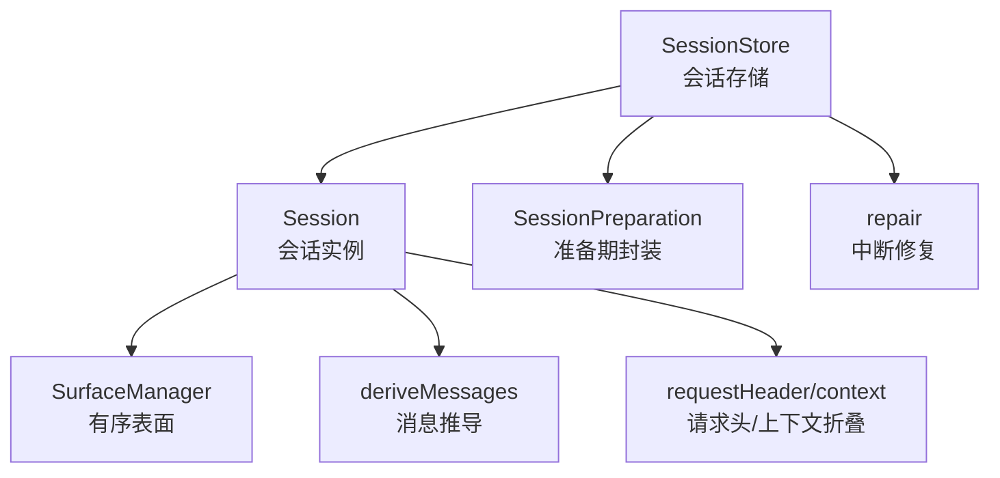
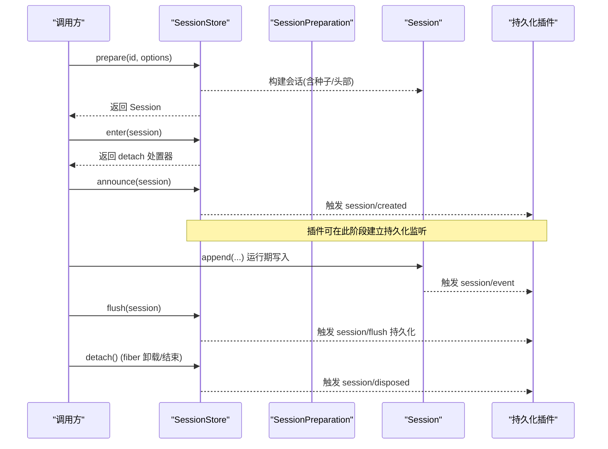
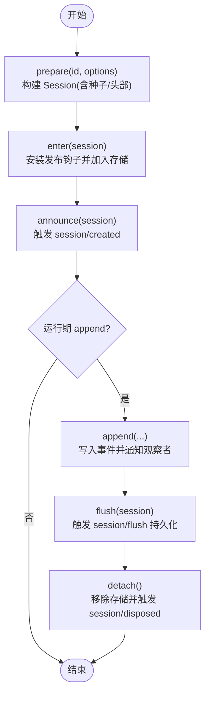
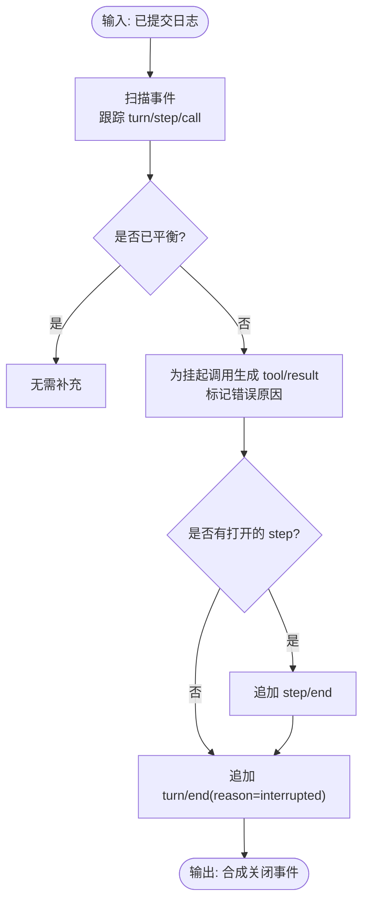
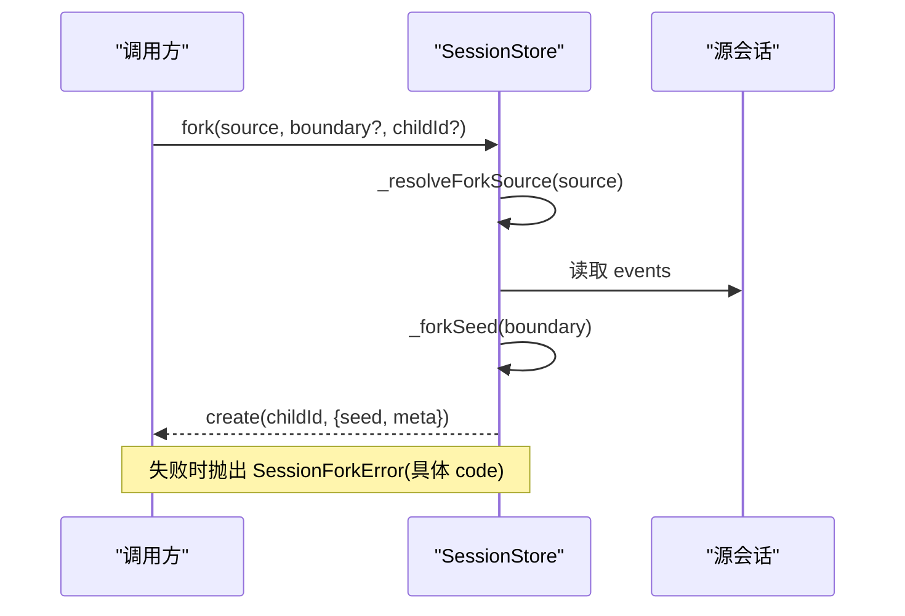
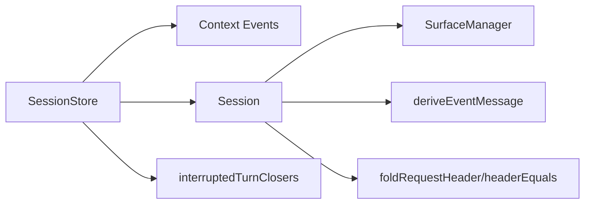

# 会话生命周期

<cite>
**本文引用的文件**
- [packages/core/session/src/index.ts](file://packages/core/session/src/index.ts)
- [packages/core/session/src/preparation.ts](file://packages/core/session/src/preparation.ts)
- [packages/core/session/src/repair.ts](file://packages/core/session/src/repair.ts)
- [packages/core/session/src/request-header.ts](file://packages/core/session/src/request-header.ts)
- [packages/core/session/tests/session.spec.ts](file://packages/core/session/tests/session.spec.ts)
</cite>

## 目录
1. [简介](#简介)
2. [项目结构](#项目结构)
3. [核心组件](#核心组件)
4. [架构总览](#架构总览)
5. [详细组件分析](#详细组件分析)
6. [依赖关系分析](#依赖关系分析)
7. [性能考量](#性能考量)
8. [故障排查指南](#故障排查指南)
9. [结论](#结论)
10. [附录](#附录)

## 简介
本文件系统性梳理会话（Session）的生命周期管理，覆盖创建、准备、进入、公告、运行与销毁；说明会话头部验证、版本兼容与元数据管理；详解准备阶段（SessionPreparation）的种子事件处理、边界检查与初始化流程；阐述会话修复机制（中断轮次的关闭器、工具结果未知处理与错误恢复策略）；解释分叉（fork）功能（源选择、边界校验与错误处理）；并提供完整生命周期管理示例与常见问题诊断方案。

## 项目结构
围绕会话生命周期的核心实现集中在 core/session 包：
- Session 类：事件溯源的不可变日志、表面投影与消息推导。
- SessionStore：内存会话存储，提供 prepare/enter/announce/create/fork/flush 等生命周期入口。
- preparation：未发布会话的准备期封装，确保资源在发布或回滚时正确释放。
- repair：崩溃恢复与中断轮次修复，生成确定性合成事件以闭合不完整的尾部。
- request-header：请求头折叠与规范化，用于版本兼容与比较。

图表来源
- [packages/core/session/src/index.ts:425-758](file://packages/core/session/src/index.ts#L425-L758)
- [packages/core/session/src/index.ts:792-1158](file://packages/core/session/src/index.ts#L792-L1158)
- [packages/core/session/src/preparation.ts:20-49](file://packages/core/session/src/preparation.ts#L20-L49)
- [packages/core/session/src/repair.ts:27-133](file://packages/core/session/src/repair.ts#L27-L133)
- [packages/core/session/src/request-header.ts:21-71](file://packages/core/session/src/request-header.ts#L21-L71)

章节来源
- [packages/core/session/src/index.ts:425-758](file://packages/core/session/src/index.ts#L425-L758)
- [packages/core/session/src/index.ts:792-1158](file://packages/core/session/src/index.ts#L792-L1158)
- [packages/core/session/src/preparation.ts:20-49](file://packages/core/session/src/preparation.ts#L20-L49)
- [packages/core/session/src/repair.ts:27-133](file://packages/core/session/src/repair.ts#L27-L133)
- [packages/core/session/src/request-header.ts:21-71](file://packages/core/session/src/request-header.ts#L21-L71)

## 核心组件
- Session：事件溯源会话，维护追加式日志、有序表面与消息推导缓存；支持从种子事件构造、恢复与派生历史。
- SessionStore：会话注册中心，负责会话准备、进入、公告、创建、分叉、刷新与查找。
- SessionPreparation：封装未发布会话及其提供者状态，确保在发布或回滚时释放资源。
- repair：为崩溃中断的尾部生成确定性合成事件，保证轮次/步骤/调用边界平衡。
- request-header：将请求头事件折叠为最新 EpochHeader，并支持规范化与相等性比较。

章节来源
- [packages/core/session/src/index.ts:425-758](file://packages/core/session/src/index.ts#L425-L758)
- [packages/core/session/src/index.ts:792-1158](file://packages/core/session/src/index.ts#L792-L1158)
- [packages/core/session/src/preparation.ts:20-49](file://packages/core/session/src/preparation.ts#L20-L49)
- [packages/core/session/src/repair.ts:27-133](file://packages/core/session/src/repair.ts#L27-L133)
- [packages/core/session/src/request-header.ts:21-71](file://packages/core/session/src/request-header.ts#L21-L71)

## 架构总览
会话生命周期由 Store 驱动，Session 作为纯对象承载日志与投影；准备期通过 Preparation 持有未发布状态；持久化插件订阅 session/event 并在 flush 时落盘；修复模块在加载后对不完整尾部进行补全；请求头折叠保障版本兼容与变更检测。

图表来源
- [packages/core/session/src/index.ts:830-841](file://packages/core/session/src/index.ts#L830-L841)
- [packages/core/session/src/index.ts:863-889](file://packages/core/session/src/index.ts#L863-L889)
- [packages/core/session/src/index.ts:913-947](file://packages/core/session/src/index.ts#L913-L947)
- [packages/core/session/src/index.ts:968-996](file://packages/core/session/src/index.ts#L968-L996)
- [packages/core/session/src/index.ts:1022-1039](file://packages/core/session/src/index.ts#L1022-L1039)

## 详细组件分析

### 会话头部验证、版本兼容与元数据管理
- 头部快照与冻结：创建时通过快照与校验函数生成不可变头部，包含 version/id/createdAt 以及可选 cwd/parentSession/seedLength/origin/delegationDepth/agentPreset。
- 版本兼容：头部 version 必须匹配当前格式版本；恢复路径使用更严格的“纯 JSON 记录”校验。
- 元数据约束：cwd 必须为绝对路径；parentSession/origin/delegationDepth/agentPreset 类型严格校验。
- 请求头折叠：通过 foldRequestHeader 将 request/header 事件折叠为最新 EpochHeader；canonicalHeader 规范化空 system/tools 与 adapterDefaults；headerEquals 用于比较是否变化，避免重复日志。

章节来源
- [packages/core/session/src/index.ts:95-157](file://packages/core/session/src/index.ts#L95-L157)
- [packages/core/session/src/index.ts:863-889](file://packages/core/session/src/index.ts#L863-L889)
- [packages/core/session/src/request-header.ts:21-71](file://packages/core/session/src/request-header.ts#L21-L71)

### 准备阶段（SessionPreparation）：种子事件、边界检查与初始化
- 作用：封装未发布的 Session 与其提供者状态，确保在发布或回滚时释放资源。
- 种子事件：prepare 支持传入 seed 与 meta；当 seedSource='persistence' 时走 fromRestore 路径，对事件与头部进行严格校验与冻结。
- 边界检查：种子事件需满足 seq 连续从 0、JSON 可序列化、符合事件信封与 LLM 形状约束；表面管理器会预校验下一个事件合法性，防止部分污染。
- 初始化流程：prepare -> enter -> announce；若 announce 抛出，detach 会在同步派发结束后执行配对清理，保证无泄漏。

图表来源
- [packages/core/session/src/index.ts:830-841](file://packages/core/session/src/index.ts#L830-L841)
- [packages/core/session/src/index.ts:863-889](file://packages/core/session/src/index.ts#L863-L889)
- [packages/core/session/src/index.ts:913-947](file://packages/core/session/src/index.ts#L913-L947)
- [packages/core/session/src/index.ts:968-996](file://packages/core/session/src/index.ts#L968-L996)
- [packages/core/session/src/index.ts:1022-1039](file://packages/core/session/src/index.ts#L1022-L1039)

章节来源
- [packages/core/session/src/preparation.ts:20-49](file://packages/core/session/src/preparation.ts#L20-L49)
- [packages/core/session/src/index.ts:482-548](file://packages/core/session/src/index.ts#L482-L548)
- [packages/core/session/src/index.ts:604-655](file://packages/core/session/src/index.ts#L604-L655)

### 运行期：事件追加、表面投影与消息推导
- 追加路径：append 对 data 与 surface metadata 进行快照与校验，拒绝非 JSON 可序列化值与非法表面元数据；在发布期间禁止重入。
- 表面投影：surfaceOp 控制事件如何进入有序表面；SurfaceManager 维护节点序列与替换代际，确保投影一致性。
- 消息推导：deriveMessages 基于表面节点顺序推导 LLM 消息历史，缓存增量更新，返回新数组但共享冻结的消息对象。

章节来源
- [packages/core/session/src/index.ts:604-655](file://packages/core/session/src/index.ts#L604-L655)
- [packages/core/session/src/index.ts:726-757](file://packages/core/session/src/index.ts#L726-L757)

### 会话修复机制：中断轮次关闭器、工具结果未知与错误恢复
- 目标：对已提交但可能在中断处截断的日志，生成确定性合成事件，补齐 step/end 与 turn/end，并为未完成的 tool call 注入错误结果。
- 策略：
  - 扫描事件，跟踪 openTurn/openStep 与 pendingCalls。
  - 对每个未完成调用生成 tool/result，区分 TOOL_NOT_STARTED 与 TOOL_OUTCOME_UNKNOWN。
  - 随后生成 step/end 与 turn/end(reason=interrupted)，时间复用最后一个真实事件以保持确定性。
- 使用场景：在恢复/回放前调用 interruptedTurnClosers，确保后续 provider 能接受一致的转录。

图表来源
- [packages/core/session/src/repair.ts:27-133](file://packages/core/session/src/repair.ts#L27-L133)

章节来源
- [packages/core/session/src/repair.ts:27-133](file://packages/core/session/src/repair.ts#L27-L133)

### 会话分叉（fork）：源选择、边界验证与错误处理
- 源选择：支持以 SessionId 或 Session 对象作为源；若为对象则校验其是否为当前 store 中的活实例。
- 边界验证：boundary 为包含的源事件 seq；必须存在且与连续 seq 一致；不能落在打开的 turn 内部。
- 错误处理：定义 SessionForkError 及多种代码（SESSION_NOT_FOUND/SESSION_NOT_LIVE/SESSION_ALREADY_EXISTS/INVALID_BOUNDARY/OPEN_TURN），便于上层精确处理。
- 子会话元数据：继承父 cwd，记录 parentSession 与 seedLength，确保可追溯的分叉谱系。

图表来源
- [packages/core/session/src/index.ts:1081-1153](file://packages/core/session/src/index.ts#L1081-L1153)

章节来源
- [packages/core/session/src/index.ts:779-784](file://packages/core/session/src/index.ts#L779-L784)
- [packages/core/session/src/index.ts:1081-1153](file://packages/core/session/src/index.ts#L1081-L1153)

### 完整生命周期管理示例
以下示例展示如何正确创建、配置与管理会话实例（不含代码内容，仅步骤说明）：
- 创建与准备：
  - 使用 SessionStore.prepare 构建会话，可选择传入种子事件与元数据（如 cwd、parentSession、seedLength）。
  - 若从持久化恢复，设置 seedSource='persistence'，传入 fresh detached 的事件与头部。
- 进入与公告：
  - 调用 enter 获取 detach 处置器，再调用 announce 触发 session/created。
  - 若 announce 抛出，detach 将在同步派发结束后执行配对清理，避免泄漏。
- 运行与持久化：
  - 通过 append 追加事件；持久化插件订阅 session/event 并在 flush 时落盘。
  - 调用 flush 等待所有持久化监听完成。
- 销毁：
  - 调用 detach 移除存储条目并触发 session/disposed。
  - 若处于 announcing/appending 中，detach 会被延后到派发结束后执行。
- 分叉：
  - 使用 fork(source, boundary?, childId?) 创建子会话；确保边界不在打开的 turn 内。
- 修复：
  - 在恢复前调用 interruptedTurnClosers 对不完整尾部进行补全，再继续运行。

章节来源
- [packages/core/session/src/index.ts:830-841](file://packages/core/session/src/index.ts#L830-L841)
- [packages/core/session/src/index.ts:863-889](file://packages/core/session/src/index.ts#L863-L889)
- [packages/core/session/src/index.ts:913-947](file://packages/core/session/src/index.ts#L913-L947)
- [packages/core/session/src/index.ts:968-996](file://packages/core/session/src/index.ts#L968-L996)
- [packages/core/session/src/index.ts:1022-1039](file://packages/core/session/src/index.ts#L1022-L1039)
- [packages/core/session/src/index.ts:1081-1153](file://packages/core/session/src/index.ts#L1081-L1153)
- [packages/core/session/src/repair.ts:27-133](file://packages/core/session/src/repair.ts#L27-L133)

## 依赖关系分析
- Session 依赖 SurfaceManager 维护有序表面与投影；依赖 deriveEventMessage 将事件映射为消息。
- SessionStore 依赖 Context 事件系统分发 session/created、session/event、session/flush、session/disposed。
- 头部折叠依赖 @deepseek-ai/dsh-llm 的 callConfigEquals 与 ToolSchema 比较。
- 测试用例覆盖生命周期关键路径（创建、进入、公告、销毁、分叉、种子回放等）。

图表来源
- [packages/core/session/src/index.ts:425-758](file://packages/core/session/src/index.ts#L425-L758)
- [packages/core/session/src/index.ts:792-1158](file://packages/core/session/src/index.ts#L792-L1158)
- [packages/core/session/src/request-header.ts:21-71](file://packages/core/session/src/request-header.ts#L21-L71)
- [packages/core/session/src/repair.ts:27-133](file://packages/core/session/src/repair.ts#L27-L133)

章节来源
- [packages/core/session/src/index.ts:425-758](file://packages/core/session/src/index.ts#L425-L758)
- [packages/core/session/src/index.ts:792-1158](file://packages/core/session/src/index.ts#L792-L1158)
- [packages/core/session/src/request-header.ts:21-71](file://packages/core/session/src/request-header.ts#L21-L71)
- [packages/core/session/src/repair.ts:27-133](file://packages/core/session/src/repair.ts#L27-L133)

## 性能考量
- 追加路径零阻塞：append 不直接做 I/O，持久化通过异步监听与 flush 协调。
- 投影缓存：deriveMessages 按表面节点增量推导，避免每次全量重建；replace 时代际更新保证一致性。
- 头部折叠增量：requestHeader/context 维护已消费位置，首次扫描后 O(新事件)。
- 深冻结与快照：事件与消息在接纳时冻结，减少拷贝与意外修改成本。

[本节为通用指导，不直接分析具体文件]

## 故障排查指南
- 重复公告/重复进入：
  - 现象：announce 或 enter 抛出“已公告/已存在”。
  - 原因：同一会话多次进入或重复公告；或并发竞争导致 ID 冲突。
  - 处理：确保 prepare->enter->announce 单例调用；在 effect 中成对 yield detach。
- 非 JSON 可序列化数据：
  - 现象：append 抛出“携带非 JSON 可序列化数据”。
  - 原因：data 或 surface metadata 包含 BigInt/函数/符号/undefined/循环引用等。
  - 处理：在调用前转换为可序列化结构。
- 分叉边界无效：
  - 现象：fork 抛出 INVALID_BOUNDARY 或 OPEN_TURN。
  - 原因：边界不存在、不连续或位于打开的 turn 内。
  - 处理：选择有效的 seq 或在 turn 边界处分叉。
- 恢复后转录不一致：
  - 现象：provider 拒绝转录。
  - 处理：在恢复前调用 interruptedTurnClosers 补全尾部，确保 turn/step/call 平衡。
- 头部版本不兼容：
  - 现象：头部 version 不匹配或字段非法。
  - 处理：确保使用当前格式版本；恢复时使用 fromRestore 严格校验。

章节来源
- [packages/core/session/src/index.ts:913-947](file://packages/core/session/src/index.ts#L913-L947)
- [packages/core/session/src/index.ts:968-996](file://packages/core/session/src/index.ts#L968-L996)
- [packages/core/session/src/index.ts:604-655](file://packages/core/session/src/index.ts#L604-L655)
- [packages/core/session/src/index.ts:1081-1153](file://packages/core/session/src/index.ts#L1081-L1153)
- [packages/core/session/src/repair.ts:27-133](file://packages/core/session/src/repair.ts#L27-L133)
- [packages/core/session/src/index.ts:95-157](file://packages/core/session/src/index.ts#L95-L157)

## 结论
会话生命周期以事件溯源为核心，通过 SessionStore 统一编排 prepare/enter/announce/flush/detach，配合 Session 的不可变日志与表面投影，实现稳定、可恢复、可扩展的会话模型。头部验证与折叠保障版本兼容，修复模块确保崩溃后的可恢复性，分叉机制支持多分支探索。遵循上述最佳实践可有效避免常见陷阱，提升可靠性与可观测性。

[本节为总结，不直接分析具体文件]

## 附录
- 参考测试用例：
  - 生命周期基本行为、种子回放、最大 token 终止、中止原因透传、上下文消息渲染、分叉与错误码等。

章节来源
- [packages/core/session/tests/session.spec.ts:1-200](file://packages/core/session/tests/session.spec.ts#L1-L200)