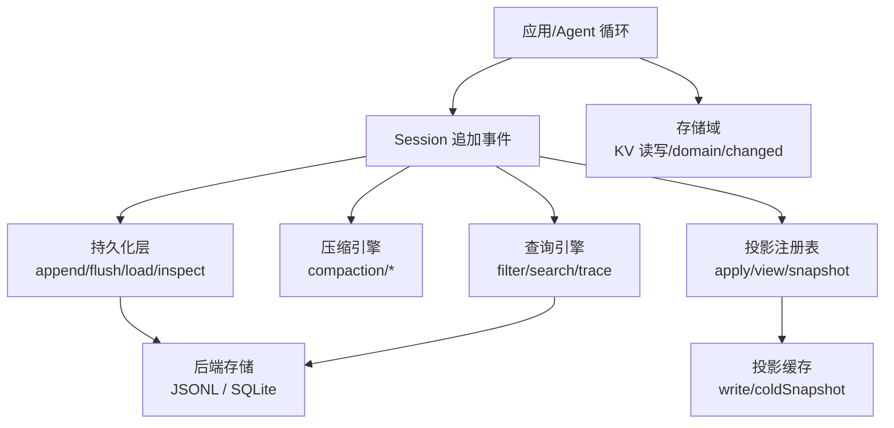
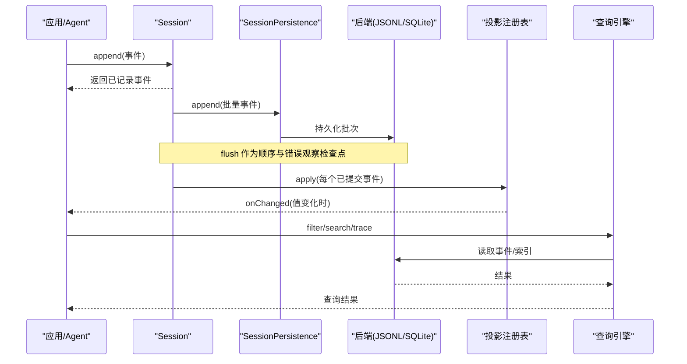
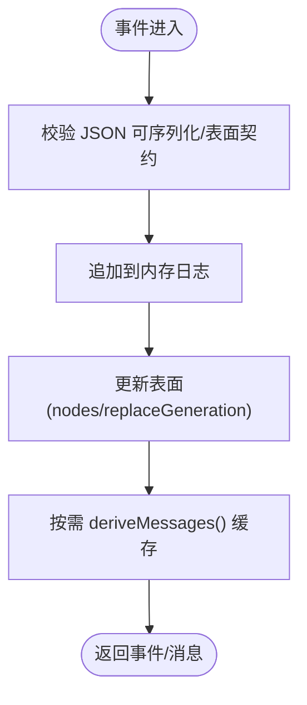
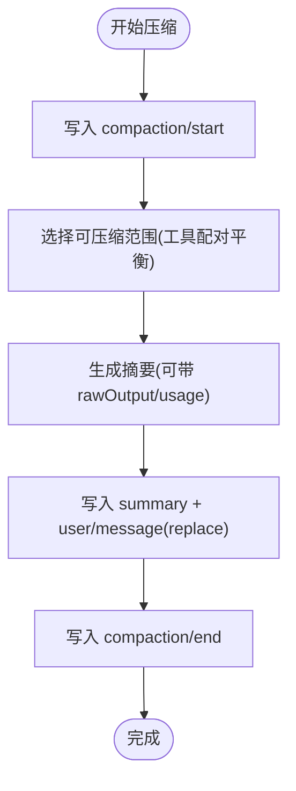
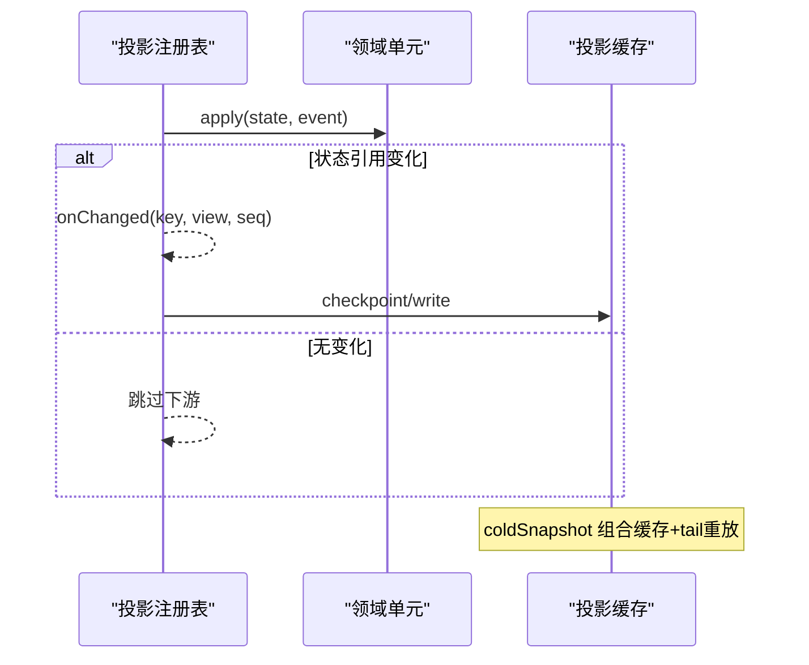
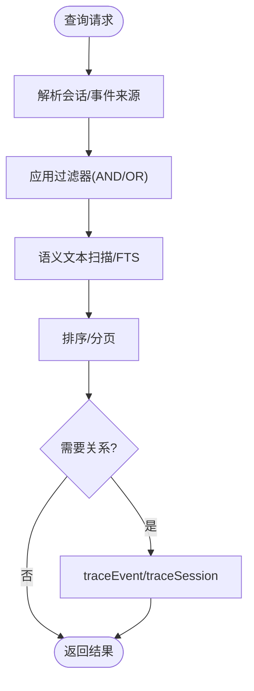
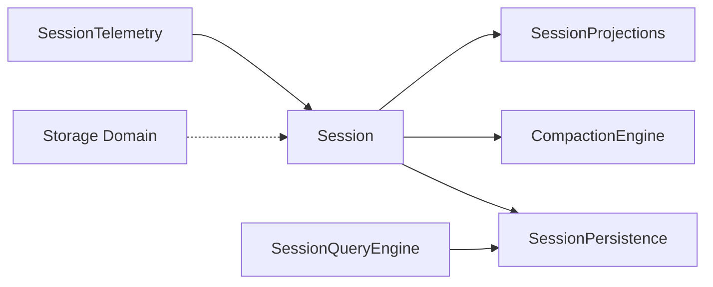

# 会话管理模块

<cite>
**本文引用的文件**
- [session.md](file://docs/subsystems/session.md)
- [persistence.md](file://docs/subsystems/persistence.md)
- [compaction.md](file://docs/subsystems/compaction.md)
- [storage.md](file://docs/subsystems/storage.md)
- [session-projection.md](file://docs/subsystems/session-projection.md)
- [session-query.md](file://docs/subsystems/session-query.md)
- [session-reference.md](file://docs/subsystems/session-reference.md)
- [session-telemetry.md](file://docs/subsystems/session-telemetry.md)
</cite>

## 目录
1. [简介](#简介)
2. [项目结构](#项目结构)
3. [核心组件](#核心组件)
4. [架构总览](#架构总览)
5. [详细组件分析](#详细组件分析)
6. [依赖关系分析](#依赖关系分析)
7. [性能考量](#性能考量)
8. [故障排查指南](#故障排查指南)
9. [结论](#结论)
10. [附录：API 使用示例与最佳实践](#附录api-使用示例与最佳实践)

## 简介
本模块围绕“事件溯源”的会话模型，提供从事件写入、持久化、压缩、查询到投影的全链路能力。会话以追加式事件日志为唯一事实源，消息历史由事件派生；通过可插拔的持久化后端、压缩策略、查询引擎与投影机制，实现高可靠、可扩展、易恢复的会话生命周期管理。同时提供与 Agent 循环集成的准备阶段、修复机制与数据完整性保证，确保在崩溃、中断和版本演进场景下的稳健性。

## 项目结构
- 会话核心（事件模型、表面投影、派生消息）：见 session.md
- 持久化（抽象服务、JSONL/SQLite 后端、崩溃恢复、格式拒绝）：见 persistence.md
- 压缩（可选能力、compaction/* 事件、工具结果剪枝）：见 compaction.md
- 存储（KV 域、后端路由、变更事件）：见 storage.md
- 投影（按事件驱动的状态计算、快照与变更流、持久化缓存）：见 session-projection.md
- 查询（逻辑记录、过滤、全文检索、血缘与关系追踪）：见 session-query.md
- 引用与遥测（跨会话引用、遥测采集与脱敏）：见 session-reference.md、session-telemetry.md



图表来源
- [session.md:363-523](file://docs/subsystems/session.md#L363-L523)
- [persistence.md:231-380](file://docs/subsystems/persistence.md#L231-L380)
- [compaction.md:9-88](file://docs/subsystems/compaction.md#L9-L88)
- [session-projection.md:9-93](file://docs/subsystems/session-projection.md#L9-L93)
- [session-query.md:9-141](file://docs/subsystems/session-query.md#L9-L141)
- [storage.md:9-48](file://docs/subsystems/storage.md#L9-L48)

章节来源
- [session.md:363-523](file://docs/subsystems/session.md#L363-L523)
- [persistence.md:231-380](file://docs/subsystems/persistence.md#L231-L380)
- [compaction.md:9-88](file://docs/subsystems/compaction.md#L9-L88)
- [session-projection.md:9-93](file://docs/subsystems/session-projection.md#L9-L93)
- [session-query.md:9-141](file://docs/subsystems/session-query.md#L9-L141)
- [storage.md:9-48](file://docs/subsystems/storage.md#L9-L48)

## 核心组件
- 会话事件与表面：SessionEventMap、SurfaceEventType、SurfaceOp、deriveMessages()
- 持久化抽象与后端：SessionPersistence、JSONL/SQLite、flush 检查点、崩溃恢复
- 压缩：CompactionEngine、compaction/* 事件、工具结果剪枝
- 投影：ProjectionDefinition、snapshot/onChanged、持久化缓存
- 查询：SessionQueryEngine、过滤/全文/血缘/关系追踪
- 存储：Storage 枢纽、DomainFacility、domain/changed
- 引用与遥测：SessionReferenceResolver、SessionTelemetryBackend

章节来源
- [session.md:9-362](file://docs/subsystems/session.md#L9-L362)
- [persistence.md:9-230](file://docs/subsystems/persistence.md#L9-L230)
- [compaction.md:25-88](file://docs/subsystems/compaction.md#L25-L88)
- [session-projection.md:9-93](file://docs/subsystems/session-projection.md#L9-L93)
- [session-query.md:9-141](file://docs/subsystems/session-query.md#L9-L141)
- [storage.md:9-48](file://docs/subsystems/storage.md#L9-L48)
- [session-reference.md:63-91](file://docs/subsystems/session-reference.md#L63-L91)
- [session-telemetry.md:9-61](file://docs/subsystems/session-telemetry.md#L9-L61)

## 架构总览
会话以事件为核心，所有状态均通过纯函数从事件推导。事件被持久化为不可变日志，支持回放与重建。压缩在不破坏原始日志的前提下对表面进行替换，保持工具调用/结果配对。查询与投影分别提供面向读侧的高效视图与增量状态。存储子系统负责非事件数据的 KV 持久化与变更通知。



图表来源
- [session.md:441-523](file://docs/subsystems/session.md#L441-L523)
- [persistence.md:9-20](file://docs/subsystems/persistence.md#L9-L20)
- [session-projection.md:59-93](file://docs/subsystems/session-projection.md#L59-L93)
- [session-query.md:142-218](file://docs/subsystems/session-query.md#L142-L218)

## 详细组件分析

### 事件日志与表面投影
- 事件类型与元数据：SessionEventMap 定义全部事件；SurfaceEventType 限定可进入表面的消息类事件；SurfaceOp 控制追加或替换范围。
- 派生消息：deriveMessages() 基于有序表面节点生成模型可见的消息数组，缓存并深冻结，避免重复投影与外部篡改。
- 首活边界：firstLiveSeq 与 session/end-seed 标记区分种子历史与本次进程新增事件，便于消费者定位。



图表来源
- [session.md:198-362](file://docs/subsystems/session.md#L198-L362)
- [session.md:441-523](file://docs/subsystems/session.md#L441-L523)

章节来源
- [session.md:198-362](file://docs/subsystems/session.md#L198-L362)
- [session.md:441-523](file://docs/subsystems/session.md#L441-L523)

### 持久化与崩溃恢复
- 抽象服务：SessionPersistence 提供 locate/create/append/prepare/load/inspect/readFrom/list/listSnapshots。
- 后端实现：JSONL（逐行追加、Zstd 帧打包）、SQLite（分块存储、按 seq 后缀读取）。
- 检查点：session/event 同步通知，后台批写；session/flush 作为顺序与错误观察检查点。
- 崩溃恢复：冷加载时若发现未闭合 turn/start，则合成 turn/end { kind: 'interrupted' } 保持平衡；不截断已持久化的事件。
- 格式拒绝：未知版本或无法解释的事件类型直接拒绝，避免静默降级导致后续解析歧义。

```mermaid
sequenceDiagram
participant Loop as "Agent 循环"
participant Store as "SessionStore"
participant Pers as "SessionPersistence"
participant BE as "后端"
Loop->>Store : create/prepare/enter
Store->>Pers : create/meta
Loop->>Store : append(事件)
Store->>Pers : append(批次)
Note over Store,Pers : flush 作为检查点
Loop->>Pers : load/inspect(冷启动/恢复)
Pers->>BE : 读取/校验
alt 发现未闭合 turn
Pers-->>Loop : 合成 interrupted 结束
end
```

图表来源
- [persistence.md:9-20](file://docs/subsystems/persistence.md#L9-L20)
- [persistence.md:231-380](file://docs/subsystems/persistence.md#L231-L380)

章节来源
- [persistence.md:9-20](file://docs/subsystems/persistence.md#L9-L20)
- [persistence.md:231-380](file://docs/subsystems/persistence.md#L231-L380)

### 压缩与工具结果剪枝
- 事件：compaction/start、compaction/summary、compaction/end 构成锁括起整个压缩过程；summary 包含摘要、影子范围、token 估算等。
- 表面替换：通过 user/message + surfaceOp replace 将一段表面节点替换为摘要，保持工具调用/结果配对。
- 触发：自动压力/上下文溢出策略，或手动空闲压缩；失败分类明确（busy/changed/summary/commit/persistence）。
- 工具结果剪枝：对超长文本中间段进行头/中/尾裁剪，保留富块顺序，统计 Unicode 码点节省。



图表来源
- [compaction.md:9-88](file://docs/subsystems/compaction.md#L9-L88)
- [compaction.md:128-191](file://docs/subsystems/compaction.md#L128-L191)

章节来源
- [compaction.md:9-88](file://docs/subsystems/compaction.md#L9-L88)
- [compaction.md:128-191](file://docs/subsystems/compaction.md#L128-L191)

### 投影机制与持久化缓存
- 单元定义：init/apply/view/stateVersion 纯函数，按事件驱动更新状态；view 输出经 schema 校验。
- 快照与变更：snapshot 同步一致切面；onChanged 仅当状态引用变化时通知。
- 持久化缓存：write 定时/强制检查点；coldSnapshot 零全量加载的冷读路径；restoreFloor/restore 支持断点续算与失效回退。



图表来源
- [session-projection.md:9-93](file://docs/subsystems/session-projection.md#L9-L93)
- [session-projection.md:103-151](file://docs/subsystems/session-projection.md#L103-L151)
- [session-projection.md:153-257](file://docs/subsystems/session-projection.md#L153-L257)

章节来源
- [session-projection.md:9-93](file://docs/subsystems/session-projection.md#L9-L93)
- [session-projection.md:103-151](file://docs/subsystems/session-projection.md#L103-L151)
- [session-projection.md:153-257](file://docs/subsystems/session-projection.md#L153-L257)

### 查询接口与关系追踪
- 逻辑记录：SessionRecord/SessionEventRecord 提供轻量身份与来源可用性；Surface 分类 current/shadowed/log-only。
- 过滤与全文：SessionResultFilter/SessionEventResultFilter 支持 AND/OR 组合；text 为语义文本扫描；searchSessions/searchEvents 分页游标。
- 血缘与关系：traceSession 返回祖先/后代树；traceEvent 提供替换链、源事件序列与派生事件序列。
- 窗口读取：readEvent 返回目标事件及前后上下文窗口。



图表来源
- [session-query.md:9-141](file://docs/subsystems/session-query.md#L9-L141)
- [session-query.md:142-218](file://docs/subsystems/session-query.md#L142-L218)
- [session-query.md:259-331](file://docs/subsystems/session-query.md#L259-L331)
- [session-query.md:367-490](file://docs/subsystems/session-query.md#L367-L490)

章节来源
- [session-query.md:9-141](file://docs/subsystems/session-query.md#L9-L141)
- [session-query.md:142-218](file://docs/subsystems/session-query.md#L142-L218)
- [session-query.md:259-331](file://docs/subsystems/session-query.md#L259-L331)
- [session-query.md:367-490](file://docs/subsystems/session-query.md#L367-L490)

### 存储子系统与变更事件
- 枢纽与后端：ctx.storage.backend 维护多后端；form 挂载数据形式；domain 声明表结构与版本。
- 域操作：open/close 严格生命周期；put/delete/update/global.set 入队串行化，成功后才改内存并发出 domain/changed。
- 一致性：读来自权威内存快照；写失败不回滚内存，保证读与介质一致。

章节来源
- [storage.md:9-48](file://docs/subsystems/storage.md#L9-L48)
- [storage.md:49-103](file://docs/subsystems/storage.md#L49-L103)
- [storage.md:104-126](file://docs/subsystems/storage.md#L104-L126)
- [storage.md:135-204](file://docs/subsystems/storage.md#L135-L204)

### 会话引用与遥测
- 引用：SessionReferenceResolver 提供候选列表与预编译消息上下文，安全地聚合跨会话内容。
- 遥测：SessionTelemetryBackend 捕获会话事件镜像与运维信号，支持 redact 水线与共享策略披露；emit 必须非阻塞。

章节来源
- [session-reference.md:63-91](file://docs/subsystems/session-reference.md#L63-L91)
- [session-reference.md:101-173](file://docs/subsystems/session-reference.md#L101-L173)
- [session-telemetry.md:9-61](file://docs/subsystems/session-telemetry.md#L9-L61)
- [session-telemetry.md:74-122](file://docs/subsystems/session-telemetry.md#L74-L122)
- [session-telemetry.md:124-191](file://docs/subsystems/session-telemetry.md#L124-L191)

## 依赖关系分析
- Session 依赖持久化抽象以保障事件落盘；压缩通过会话表面进行替换；投影订阅会话事件驱动状态更新；查询依赖持久化后端与索引；存储域独立于事件日志但与之协同。
- 关键耦合点：
  - 事件契约（类型、可序列化、表面规则）贯穿 Session、持久化、压缩、查询、遥测。
  - 检查点与恢复：flush 与 load/inspect 共同保证顺序与一致性。
  - 版本兼容：格式拒绝与 stateVersion 防止旧数据误用。



图表来源
- [session.md:363-523](file://docs/subsystems/session.md#L363-L523)
- [persistence.md:231-380](file://docs/subsystems/persistence.md#L231-L380)
- [compaction.md:128-191](file://docs/subsystems/compaction.md#L128-L191)
- [session-projection.md:153-257](file://docs/subsystems/session-projection.md#L153-L257)
- [session-query.md:367-490](file://docs/subsystems/session-query.md#L367-L490)
- [storage.md:9-48](file://docs/subsystems/storage.md#L9-L48)
- [session-telemetry.md:74-122](file://docs/subsystems/session-telemetry.md#L74-L122)

章节来源
- [session.md:363-523](file://docs/subsystems/session.md#L363-L523)
- [persistence.md:231-380](file://docs/subsystems/persistence.md#L231-L380)
- [compaction.md:128-191](file://docs/subsystems/compaction.md#L128-L191)
- [session-projection.md:153-257](file://docs/subsystems/session-projection.md#L153-L257)
- [session-query.md:367-490](file://docs/subsystems/session-query.md#L367-L490)
- [storage.md:9-48](file://docs/subsystems/storage.md#L9-L48)
- [session-telemetry.md:74-122](file://docs/subsystems/session-telemetry.md#L74-L122)

## 性能考量
- 事件追加热路径：append 同步通知，持久化后台批写，flush 作为检查点，避免阻塞主循环。
- 投影优化：apply 返回相同引用即跳过下游；snapshot 同步一致；coldSnapshot 零全量加载。
- 查询优化：过滤与全文结合，游标分页；trace 仅在必要时执行。
- 压缩：在压力或溢出时选择性替换表面，减少后续处理成本；工具结果剪枝降低文本体积。
- 存储：KV 写串行化，读内存快照；domain/changed 事件用于解耦消费。

[本节为通用指导，无需特定文件来源]

## 故障排查指南
- 格式不支持：当后端遇到未知版本或无法解释的事件类型时，会拒绝打开，需升级或调整构建。
- 崩溃恢复：冷加载检测到未闭合 turn 时合成 interrupted 结束；确认 persisted 与 live 状态。
- 投影不一致：检查 stateVersion 是否匹配；coldSnapshot 与 restoreFloor 是否正确设置 baseSeq。
- 查询失败：核对过滤器合法性、游标有效性、索引可用性与取消信号。
- 存储异常：检查后端 facet 是否支持、版本是否匹配、记录是否通过 schema 校验。

章节来源
- [persistence.md:92-99](file://docs/subsystems/persistence.md#L92-L99)
- [persistence.md:13-20](file://docs/subsystems/persistence.md#L13-L20)
- [session-projection.md:103-151](file://docs/subsystems/session-projection.md#L103-L151)
- [session-query.md:333-357](file://docs/subsystems/session-query.md#L333-L357)
- [storage.md:49-103](file://docs/subsystems/storage.md#L49-L103)

## 结论
该会话管理模块以事件溯源为核心，通过严格的类型契约、可插拔持久化、压缩与投影机制，提供了高可靠、高性能、易扩展的会话生命周期管理能力。配合查询与存储子系统，满足复杂业务场景下的历史回溯、状态快照与高效检索需求。版本兼容与崩溃恢复策略确保了系统在异常环境下的稳定性。

[本节为总结，无需特定文件来源]

## 附录：API 使用示例与最佳实践

- 创建与会话生命周期
  - 使用 ctx.sessions.prepare/enter/announce 构造并发布会话，确保 effect 生命周期内正确释放。
  - 使用 ctx.sessions.create 快速创建并进入会话；fork 可从稳定边界派生子会话。
  - 参考：[session.md:619-753](file://docs/subsystems/session.md#L619-L753)

- 记录事件
  - 通过 Session.append(type, data, opts?) 追加事件；消息类事件需提供 surfaceOp 与 sourceEventSeqs。
  - 使用 deriveMessages() 获取派生消息；注意缓存与深冻结特性。
  - 参考：[session.md:441-523](file://docs/subsystems/session.md#L441-L523)

- 查询历史与全文搜索
  - 使用 ctx.sessionQuery.filterSessions/filterEvents 进行精确过滤；searchSessions/searchEvents 进行全文分页检索。
  - 使用 traceEvent/traceSession 获取事件关系与血缘。
  - 参考：[session-query.md:367-490](file://docs/subsystems/session-query.md#L367-L490)

- 数据恢复与投影
  - 使用 ctx.sessionPersistence.load/inspect 进行冷加载与检查；利用 restoreFloor/restore 进行投影断点续算。
  - 使用 ctx.sessionProjectionCache.cachedSnapshot/coldSnapshot 获取快照。
  - 参考：[persistence.md:231-380](file://docs/subsystems/persistence.md#L231-L380)
  - 参考：[session-projection.md:103-151](file://docs/subsystems/session-projection.md#L103-L151)

- 压缩与剪枝
  - 使用 ctx.compaction.compactIfNeeded/compactNow/compactRegion 进行自动或手动压缩；必要时启用工具结果剪枝。
  - 参考：[compaction.md:128-191](file://docs/subsystems/compaction.md#L128-L191)

- 与 Agent 循环集成
  - 将会话生命周期纳入 agent 的 effect，确保最终事件在卸载前发布；使用 flush 作为检查点。
  - 使用 session/created 与 session/disposed 进行监听与清理。
  - 参考：[session.md:619-753](file://docs/subsystems/session.md#L619-L753)

- 存储与变更
  - 通过 ctx.storage.open 打开域，使用 put/delete/update/global.set 写入，监听 domain/changed 做响应。
  - 参考：[storage.md:135-204](file://docs/subsystems/storage.md#L135-L204)

- 引用与遥测
  - 使用 ctx.sessionReferenceResolver 准备跨会话上下文；配置 ctx.sessionTelemetry 进行采集与脱敏。
  - 参考：[session-reference.md:101-173](file://docs/subsystems/session-reference.md#L101-L173)
  - 参考：[session-telemetry.md:124-191](file://docs/subsystems/session-telemetry.md#L124-L191)