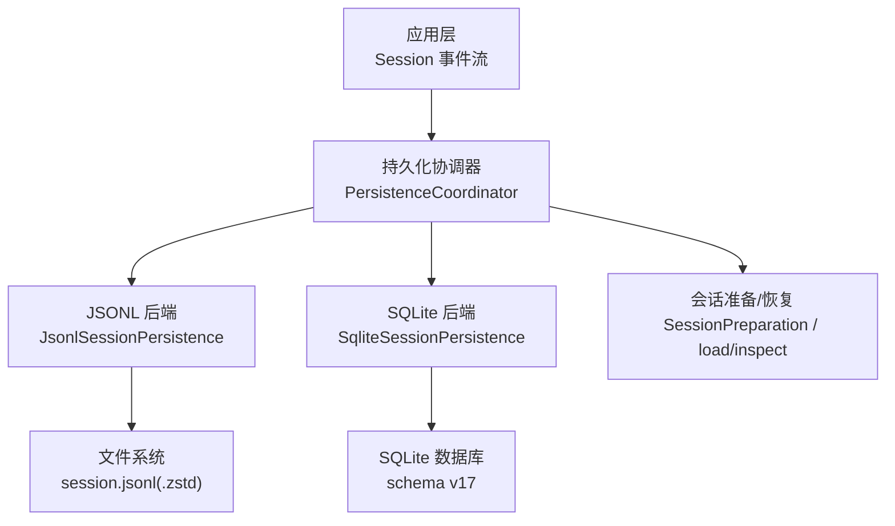
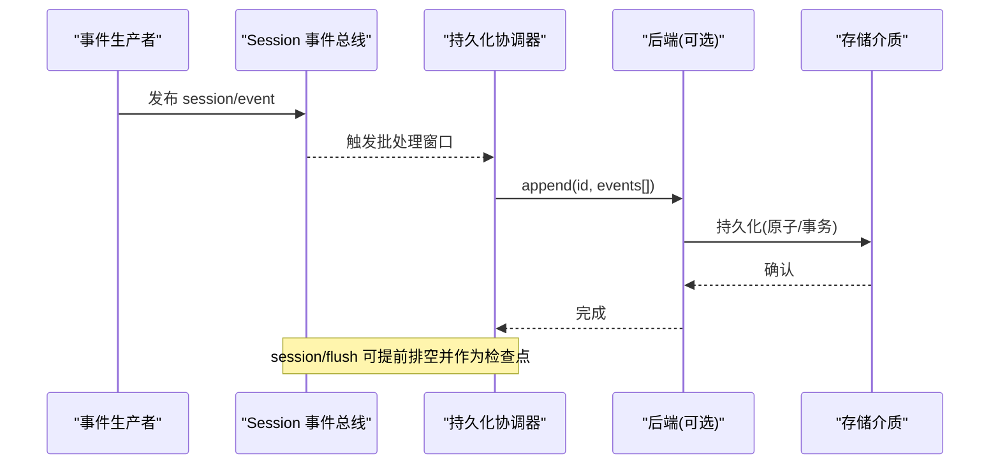
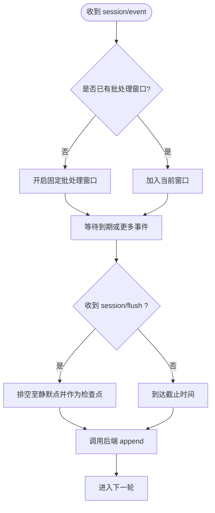
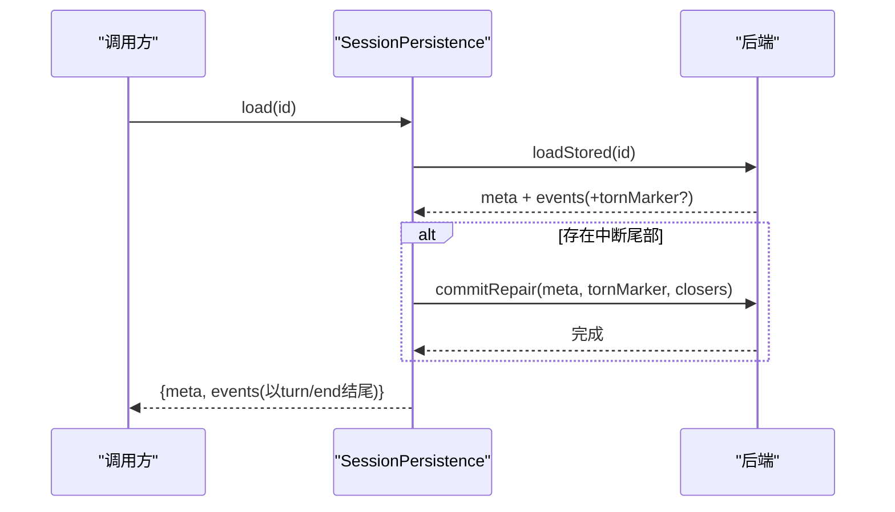
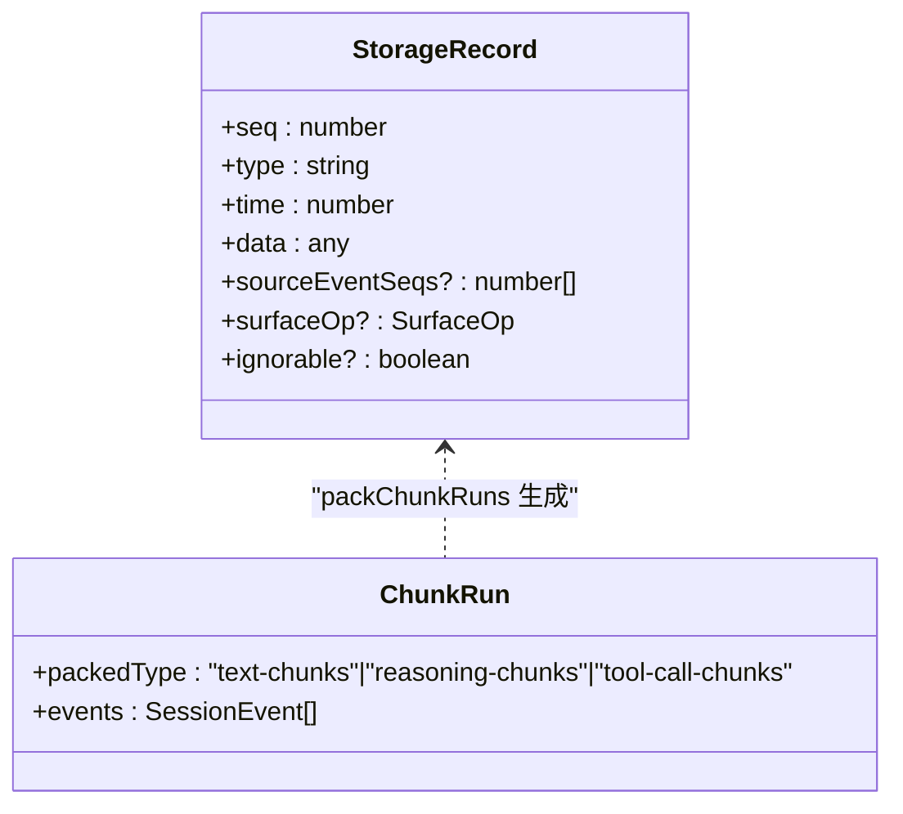
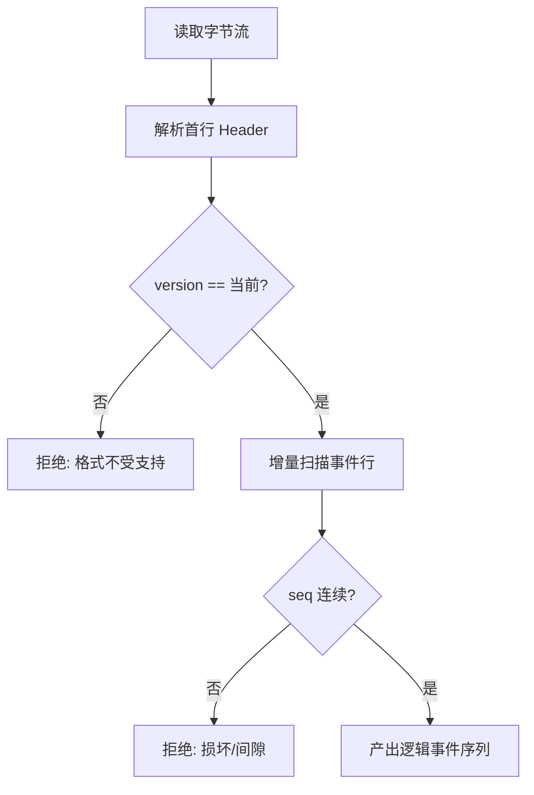
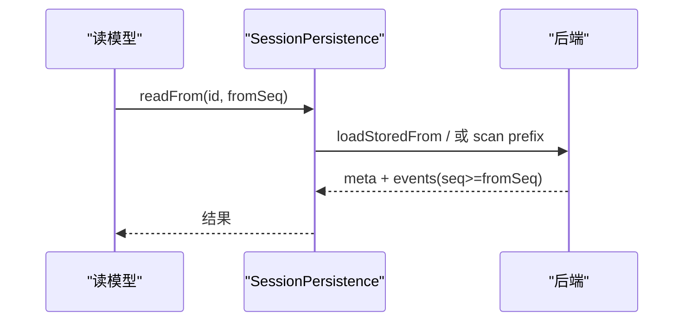
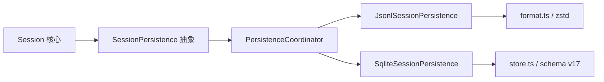

# 持久化集成

<cite>
**本文引用的文件**
- [packages/session/session-persistence/src/index.ts](file://packages/session/session-persistence/src/index.ts)
- [packages/session/session-persistence-jsonl/src/index.ts](file://packages/session/session-persistence-jsonl/src/index.ts)
- [packages/session/session-persistence-jsonl/src/format.ts](file://packages/session/session-persistence-jsonl/src/format.ts)
- [packages/session/session-persistence-sqlite/src/index.ts](file://packages/session/session-persistence-sqlite/src/index.ts)
- [packages/session/session-persistence-sqlite/src/store.ts](file://packages/session/session-persistence-sqlite/src/store.ts)
- [docs/subsystems/persistence.md](file://docs/subsystems/persistence.md)
- [docs/persistence-catalog.md](file://docs/persistence-catalog.md)
</cite>

## 目录
1. [简介](#简介)
2. [项目结构](#项目结构)
3. [核心组件](#核心组件)
4. [架构总览](#架构总览)
5. [详细组件分析](#详细组件分析)
6. [依赖关系分析](#依赖关系分析)
7. [性能考虑](#性能考虑)
8. [故障排查指南](#故障排查指南)
9. [结论](#结论)
10. [附录](#附录)

## 简介
本文件面向“会话与持久化存储的解耦设计”，系统性说明事件订阅模式、刷新机制、分块行（ChunkRow）的数据结构与压缩策略、编码/解码流程、版本兼容性与数据完整性校验，以及会话恢复机制。同时提供自定义持久化后端的开发指南、常见问题的定位与解决方案，帮助读者在 JSONL 与 SQLite 两种后端之间进行选型与扩展。

## 项目结构
- 抽象持久化服务：SessionPersistence（定义 locate/create/append/prepare/load/inspect/readFrom/list/listSnapshots 等能力）
- 协调器：PersistenceCoordinator（批处理窗口、刷新 checkpoint、冷启动修复、准备态复用）
- JSONL 后端：按会话独立追加文件，支持 Zstandard 帧压缩与原子发布
- SQLite 后端：单库多会话，将连续分块行打包为 text-chunks/reasoning-chunks/tool-call-chunks 物理行
- 事件编解码：StorageRecord/SessionEvent 映射、分块打包、格式版本拒绝与完整性校验



图表来源
- [packages/session/session-persistence/src/index.ts:84-241](file://packages/session/session-persistence/src/index.ts#L84-L241)
- [packages/session/session-persistence-jsonl/src/index.ts:121-200](file://packages/session/session-persistence-jsonl/src/index.ts#L121-L200)
- [packages/session/session-persistence-sqlite/src/index.ts:52-131](file://packages/session/session-persistence-sqlite/src/index.ts#L52-L131)

章节来源
- [docs/subsystems/persistence.md:1-237](file://docs/subsystems/persistence.md#L1-L237)
- [packages/session/session-persistence/src/index.ts:84-241](file://packages/session/session-persistence/src/index.ts#L84-L241)

## 核心组件
- SessionPersistence：抽象服务，定义跨后端的统一接口；默认 prepare 通过 load + SessionStore.prepare 构造未发布的会话准备对象
- PersistenceCoordinator：批处理与刷新控制、冷启动修复、轻量快照与修订令牌
- JsonlSessionPersistence：每会话追加日志文件，支持 zstd 压缩、原子发布、断尾恢复、raw artifact 读取
- SqliteSessionPersistence：单库存储，事务性写入、紧凑分块行、基于 schema 的版本检查与一致性保障

章节来源
- [packages/session/session-persistence/src/index.ts:84-241](file://packages/session/session-persistence/src/index.ts#L84-L241)
- [packages/session/session-persistence-jsonl/src/index.ts:121-200](file://packages/session/session-persistence-jsonl/src/index.ts#L121-L200)
- [packages/session/session-persistence-sqlite/src/index.ts:52-131](file://packages/session/session-persistence-sqlite/src/index.ts#L52-L131)

## 架构总览
- 事件生产端通过 session/event 同步通知插件；插件将事件复制到 per-session 控制器而不阻塞生产者
- 首个待持久化事件开启固定批处理窗口，后续事件加入不重置截止时间；首次成功写入后，新事件形成下一批次
- session/flush 取消等待并排空至静默点，作为顺序与错误观察的检查点
- 崩溃恢复：冷加载时若发现未闭合 turn/start，则合成 turn/end{kind:'interrupted'} 保持平衡，不截断已提交前缀
- 轻量快照：listSnapshots 返回 header + revision，用于增量观测变更



图表来源
- [docs/subsystems/persistence.md:9-19](file://docs/subsystems/persistence.md#L9-L19)
- [packages/session/session-persistence/src/index.ts:135-183](file://packages/session/session-persistence/src/index.ts#L135-L183)

## 详细组件分析

### 事件订阅与刷新机制（session/event 与 session/flush）
- session/event：同步通知，插件复制事件到 per-session 控制器，不阻塞生产者；首个事件开启固定批处理窗口，后续事件加入但不重置截止时间
- session/flush：取消等待并排空至静默点，作为顺序与错误观察的检查点；被拒绝的后台写入保留事件并暂停自动重试，显式 flush 立即重试并通过 agent/error 与日志报告失败
- 批处理最大延迟仅影响有意的批处理等待，不影响事件循环调度或后端持久化延迟



图表来源
- [docs/subsystems/persistence.md:9-19](file://docs/subsystems/persistence.md#L9-L19)

章节来源
- [docs/subsystems/persistence.md:9-19](file://docs/subsystems/persistence.md#L9-L19)

### 会话恢复机制（冷加载、热会话、HMR）
- 冷加载：load 会平衡一个完整的中断尾部，必要时合成 turn/end{kind:'interrupted'}，仅丢弃损坏的最终记录；未知版本或已提交前缀损坏直接拒绝
- 热会话：对仍绑定 live Session 的 id，load 等待权威内存快照达到一致后再返回；开放 turn 拒绝而非注入中断边界
- HMR：采用 live 前缀且不关闭活动 turn；inspect 返回不可变快照，可能包含 open turn 与 end-seed 边界
- 准备态：prepare 接受 persistence 转移的 seed/meta，验证并冻结对象图；disposal 同步且幂等



图表来源
- [packages/session/session-persistence-jsonl/src/index.ts:421-444](file://packages/session/session-persistence-jsonl/src/index.ts#L421-L444)
- [packages/session/session-persistence-sqlite/src/store.ts:201-239](file://packages/session/session-persistence-sqlite/src/store.ts#L201-L239)
- [docs/subsystems/persistence.md:13-19](file://docs/subsystems/persistence.md#L13-L19)

章节来源
- [docs/subsystems/persistence.md:13-19](file://docs/subsystems/persistence.md#L13-L19)
- [packages/session/session-persistence/src/index.ts:145-183](file://packages/session/session-persistence/src/index.ts#L145-L183)

### 分块行（ChunkRow）数据结构、事件压缩与查询优化
- JSONL 后端：eventLines 可将连续的 assistant/chunk、reasoning/chunk、tool/call 等 delta 行打包为 StorageRecord（如 text-chunks/reasoning-chunks/tool-call-chunks），显著减小体积；读取路径 layout-blind，始终解码回逻辑事件
- SQLite 后端：将连续分块行打包为 schema v17 的物理行，减少行数与 I/O；readFrom 通过 packed-predecessors 计算最小必要范围，避免全量扫描
- 压缩：JSONL 默认使用 Zstandard 帧，首帧仅含 header，支持逐帧解码与 yield 以避免长耗时阻塞



图表来源
- [packages/session/session-persistence-jsonl/src/format.ts:210-224](file://packages/session/session-persistence-jsonl/src/format.ts#L210-L224)
- [packages/session/session-persistence-sqlite/src/store.ts:173-199](file://packages/session/session-persistence-sqlite/src/store.ts#L173-L199)

章节来源
- [packages/session/session-persistence-jsonl/src/format.ts:210-224](file://packages/session/session-persistence-jsonl/src/format.ts#L210-L224)
- [packages/session/session-persistence-sqlite/src/store.ts:173-199](file://packages/session/session-persistence-sqlite/src/store.ts#L173-L199)

### 存储记录的编码与解码、完整性校验与版本兼容
- 编码：eventLines 输出 JSONL 文本；Zstandard 模式下封装为帧；SQLite 将记录绑定为 BoundRecord 插入
- 解码：SessionLogScanner 增量解析，维护 committedBytes；scanRows 对 packed 行进行展开；decodeStorageRecord 将 StorageRecord 还原为 SessionEvent
- 完整性：序列号严格递增；遇到损坏或 gap 即报错；Zstandard 首帧必须仅为 header；JSONL 列表只读首行元数据
- 版本兼容：header.version 与 SESSION_FORMAT_VERSION 不一致时拒绝（升级方向或无升级路径）；未知 event type 若无 ignorable 标记则拒绝



图表来源
- [packages/session/session-persistence-jsonl/src/format.ts:232-264](file://packages/session/session-persistence-jsonl/src/format.ts#L232-L264)
- [packages/session/session-persistence-jsonl/src/format.ts:272-378](file://packages/session/session-persistence-jsonl/src/format.ts#L272-L378)
- [docs/persistence-catalog.md:12-93](file://docs/persistence-catalog.md#L12-L93)

章节来源
- [packages/session/session-persistence-jsonl/src/format.ts:232-378](file://packages/session/session-persistence-jsonl/src/format.ts#L232-L378)
- [docs/persistence-catalog.md:12-93](file://docs/persistence-catalog.md#L12-L93)

### 会话恢复与一致性保证
- 冷恢复：合成 interrupted 的 turn/end，保持执行平衡；仅丢弃损坏最终记录
- 热会话：load 等待权威快照一致；open turn 拒绝
- 轻量快照：listSnapshots 返回 revision，便于外部模型增量重放
- readFrom：从 fromSeq 起读取后缀，SQLite 可精确 seek，JSONL 需解析但仅返回 >=fromSeq 的事件



图表来源
- [packages/session/session-persistence/src/index.ts:202-221](file://packages/session/session-persistence/src/index.ts#L202-L221)
- [packages/session/session-persistence-sqlite/src/store.ts:160-171](file://packages/session/session-persistence-sqlite/src/store.ts#L160-L171)

章节来源
- [packages/session/session-persistence/src/index.ts:202-221](file://packages/session/session-persistence/src/index.ts#L202-L221)
- [packages/session/session-persistence-sqlite/src/store.ts:160-171](file://packages/session/session-persistence-sqlite/src/store.ts#L160-L171)

### 自定义持久化后端开发指南
- 实现 SessionPersistence 抽象类，至少实现 locate/create/append/prepare/load/inspect/readFrom/list/listSnapshots
- 若支持 raw artifact，需实现 supportsRawArtifacts=true 与 readRaw
- 批处理与刷新：建议组合 PersistenceCoordinator，复用其批窗口、刷新检查点与准备态缓存
- 事件压缩：可使用 packChunkRuns 将连续分块行打包为 StorageRecord；读取侧需能展开为 SessionEvent
- 版本与完整性：拒绝未知 version；对未知 event type 要求 ignorable 标记；确保 seq 连续
- 错误处理：区分格式不受支持与损坏；对并发写/读做幂等与重试保护；SQLite 使用事务与 busy timeout

```mermaid
classDiagram
class SessionPersistence {
<<abstract>>
+locate(meta) SessionLocation?
+create(meta) Promise<void>
+append(id, events) Promise<void>
+prepare(id, signal) Promise<SessionPreparation>
+load(id) Promise<SessionInspection>
+inspect(id, signal) Promise<SessionInspection>
+readFrom(id, fromSeq, signal) Promise<{meta, events}>
+list(signal) Promise<SessionHeader[]>
+listSnapshots(signal) Promise<SessionPersistenceSnapshot[]>
}
class JsonlSessionPersistence
class SqliteSessionPersistence
SessionPersistence <|-- JsonlSessionPersistence
SessionPersistence <|-- SqliteSessionPersistence
```

图表来源
- [packages/session/session-persistence/src/index.ts:84-241](file://packages/session/session-persistence/src/index.ts#L84-L241)
- [packages/session/session-persistence-jsonl/src/index.ts:121-200](file://packages/session/session-persistence-jsonl/src/index.ts#L121-L200)
- [packages/session/session-persistence-sqlite/src/index.ts:52-131](file://packages/session/session-persistence-sqlite/src/index.ts#L52-L131)

章节来源
- [packages/session/session-persistence/src/index.ts:84-241](file://packages/session/session-persistence/src/index.ts#L84-L241)

## 依赖关系分析
- 上层 Session 通过 ctx.sessionPersistence 访问持久化能力
- JSONL 与 SQLite 后端均依赖 PersistenceCoordinator 管理批处理与恢复
- JSONL 后端依赖 format.ts 的路径/头/行编解码与 zstd 压缩
- SQLite 后端依赖 store.ts 的事务、schema 校验与 packed 行扫描



图表来源
- [packages/session/session-persistence/src/index.ts:84-241](file://packages/session/session-persistence/src/index.ts#L84-L241)
- [packages/session/session-persistence-jsonl/src/index.ts:121-200](file://packages/session/session-persistence-jsonl/src/index.ts#L121-L200)
- [packages/session/session-persistence-sqlite/src/index.ts:52-131](file://packages/session/session-persistence-sqlite/src/index.ts#L52-L131)

章节来源
- [packages/session/session-persistence/src/index.ts:84-241](file://packages/session/session-persistence/src/index.ts#L84-L241)

## 性能考虑
- 批处理窗口：合理设置 writeBatchMaxDelayMs，平衡吞吐与延迟；注意该限制仅针对有意批处理等待
- 事件压缩：启用 packChunks 可显著降低日志体积；JSONL 默认 zstd 压缩提升 I/O 效率
- 读取优化：SQLite 通过 packed-predecessors 缩小扫描范围；JSONL 列表仅读首行元数据，避免全量解析
- 冷启动恢复：合成 interrupted 的 turn/end 避免重建成本；preparedSessionCacheSize 控制历史复用上限

[本节为通用指导，无需特定文件引用]

## 故障排查指南
- 格式不受支持：当 header.version 与当前构建不一致时，明确提示升级方向；未知 event type 若无 ignorable 标记将被拒绝
- 损坏检测：seq 不连续、header 非 JSON、Zstandard 首帧非法等均视为损坏；JSONL 列表仅读首行，避免误判
- 崩溃恢复：若发现未闭合 turn/start，应合成 turn/end{kind:'interrupted'}；commitRepair 需先截断损坏尾部再追加修正事件
- 并发与原子性：JSONL 使用临时文件+link 发布；SQLite 使用事务与 busy timeout；写入失败需回滚并保持状态一致

章节来源
- [packages/session/session-persistence-jsonl/src/index.ts:513-591](file://packages/session/session-persistence-jsonl/src/index.ts#L513-L591)
- [packages/session/session-persistence-sqlite/src/store.ts:173-239](file://packages/session/session-persistence-sqlite/src/store.ts#L173-L239)
- [docs/subsystems/persistence.md:92-99](file://docs/subsystems/persistence.md#L92-L99)

## 结论
本持久化体系通过 SessionPersistence 抽象与 PersistenceCoordinator 编排，实现了会话事件与存储介质的解耦。JSONL 与 SQLite 后端分别满足“可移植日志”和“高吞吐结构化存储”的需求。借助事件压缩、版本拒绝、完整性校验与崩溃恢复，系统在可靠性与性能间取得良好平衡。开发者可按接口规范快速实现自定义后端，并在批处理、刷新与恢复策略上获得一致的语义。

## 附录
- 事件目录：persistence-catalog 列出所有可持久化的 SessionEvent 类型及其载荷
- 会话头：SessionHeader 携带版本、创建时间、工作目录、父会话、种子边界、代理预设等元信息
- 原始工件：JSONL 后端支持 readRaw 获取后端物理编码的原文内容

章节来源
- [docs/persistence-catalog.md:12-93](file://docs/persistence-catalog.md#L12-L93)
- [docs/subsystems/persistence.md:39-99](file://docs/subsystems/persistence.md#L39-L99)
- [packages/session/session-persistence-jsonl/src/index.ts:239-282](file://packages/session/session-persistence-jsonl/src/index.ts#L239-L282)