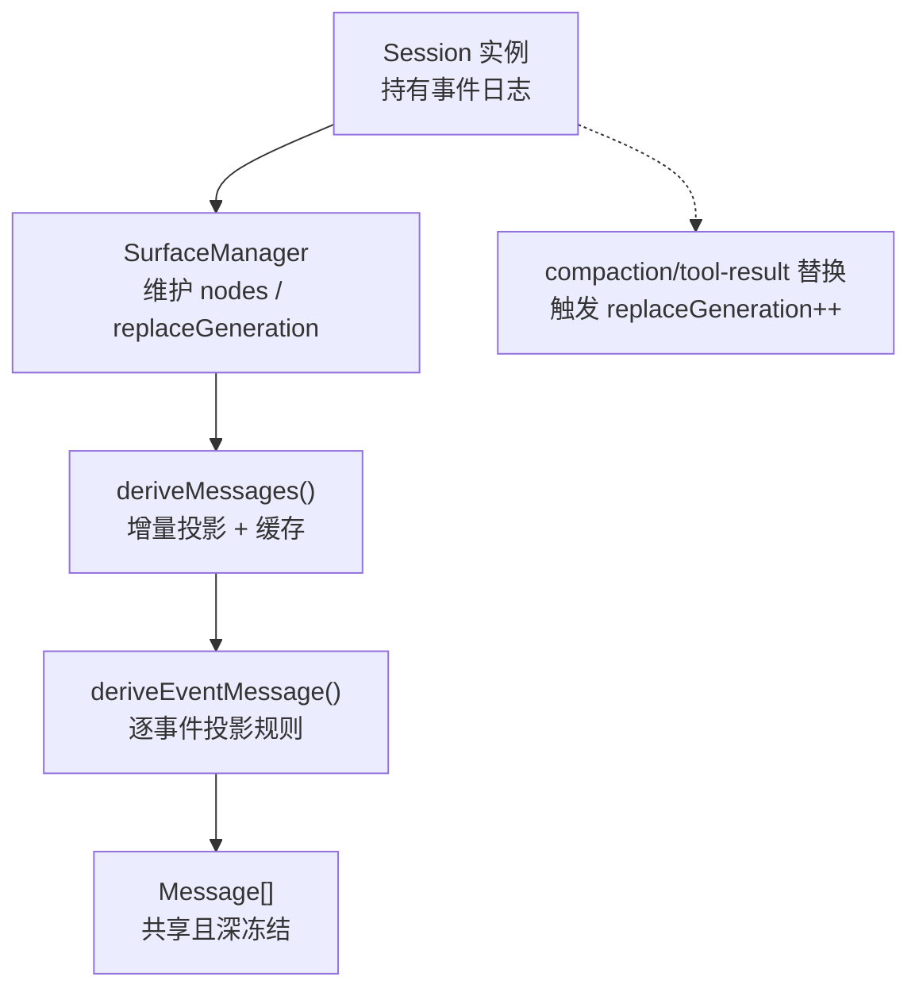
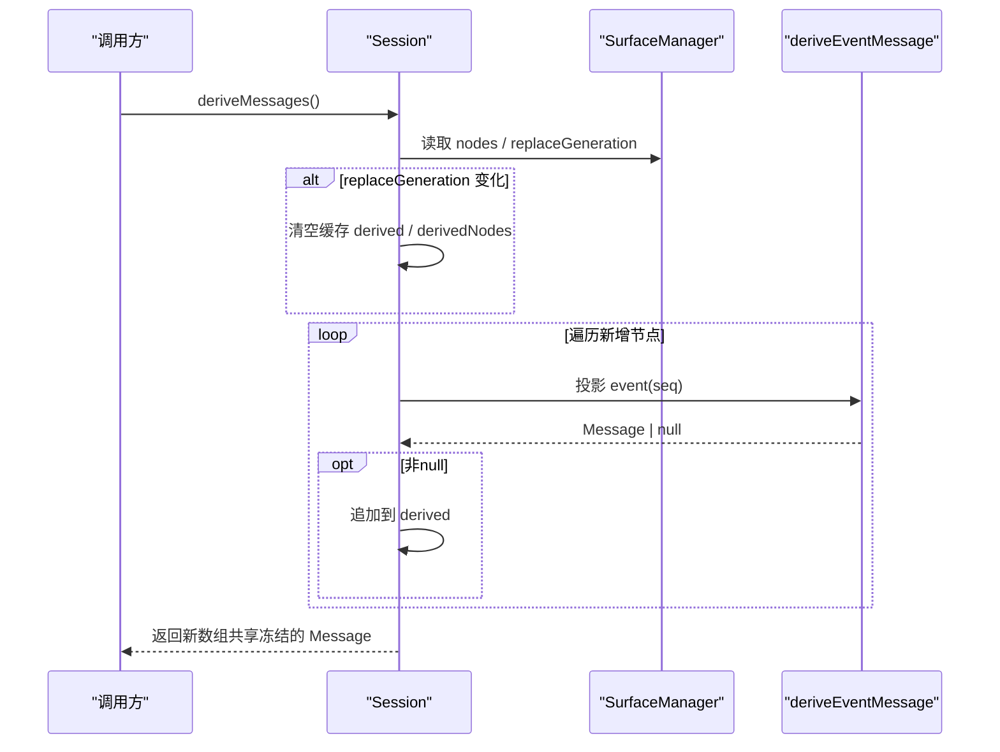
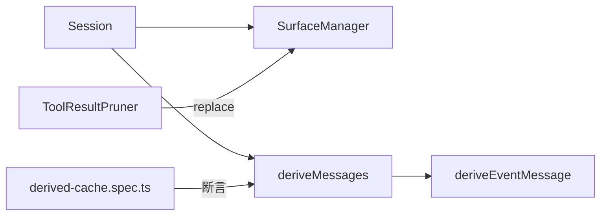

# 消息推导机制

<cite>
**本文引用的文件**
- [surface.ts](file://packages/core/session/src/surface.ts)
- [index.ts](file://packages/core/session/src/index.ts)
- [derived-cache.spec.ts](file://packages/core/session/tests/derived-cache.spec.ts)
- [session.spec.ts](file://packages/core/session/tests/session.spec.ts)
- [tool-result-pruner/index.ts](file://packages/compaction/compaction-tool-result-pruner/src/index.ts)
- [session.md（网站生成文档）](file://website/.generated/reference/subsystems/session.md)
</cite>

## 目录
1. [简介](#简介)
2. [项目结构](#项目结构)
3. [核心组件](#核心组件)
4. [架构总览](#架构总览)
5. [详细组件分析](#详细组件分析)
6. [依赖关系分析](#依赖关系分析)
7. [性能考量](#性能考量)
8. [故障排查指南](#故障排查指南)
9. [结论](#结论)
10. [附录：推导示例与最佳实践](#附录推导示例与最佳实践)

## 简介
本文件系统性阐述“消息推导机制”，聚焦以下目标：
- deriveMessages 方法如何从事件日志推导出 LLM 可见的消息历史；
- deriveEventMessage 函数的逐事件转换规则与消息结构映射；
- 派生消息的缓存策略、失效条件与性能优化；
- 与表面管理（SurfaceManager）的集成，如何通过 surfaceOp 标记确定消息生产者与顺序；
- 消息内容处理规则：空内容过滤、工具结果合并与上下文信息保留；
- 具体推导示例与性能调优建议。

## 项目结构
该机制位于会话子系统 core/session 中，围绕“仅追加事件日志 + 表面视图 + 派生消息”的设计展开：
- 事件日志：不可变、仅追加，作为唯一真源；
- 表面层：维护模型可见的消息节点序列，支持 append 与 replace；
- 派生层：将表面节点投影为 Message[]，并缓存以提升性能。

图表来源
- [index.ts:700-747](file://packages/core/session/src/index.ts#L700-L747)
- [surface.ts:397-461](file://packages/core/session/src/surface.ts#L397-L461)
- [surface.ts:83-114](file://packages/core/session/src/surface.ts#L83-L114)

章节来源
- [index.ts:700-747](file://packages/core/session/src/index.ts#L700-L747)
- [surface.ts:1-114](file://packages/core/session/src/surface.ts#L1-L114)

## 核心组件
- SurfaceManager：对事件日志进行增量折叠，维护模型可见的“表面节点序列”nodes，以及单调递增的 replaceGeneration，用于检测表面重写。
- deriveEventMessage：纯函数，将单个事件投影为 Message 或 null，定义消息推导的核心规则。
- Session.deriveMessages：基于 SurfaceManager 提供的 nodes 进行增量投影，使用内部缓存 derived、derivedNodes、derivedGeneration 实现 O(新节点) 的派生成本。

章节来源
- [surface.ts:136-148](file://packages/core/session/src/surface.ts#L136-L148)
- [surface.ts:397-461](file://packages/core/session/src/surface.ts#L397-L461)
- [surface.ts:83-114](file://packages/core/session/src/surface.ts#L83-L114)
- [index.ts:700-747](file://packages/core/session/src/index.ts#L700-L747)

## 架构总览
消息推导的整体流程如下：
- 事件写入时通过 surfaceOp 标记决定其进入表面的方式（append 或 replace）；
- SurfaceManager 维护 nodes 列表（按模型可见顺序的事件 seq），并在发生 replace 时递增 replaceGeneration；
- deriveMessages 读取当前 nodes，若 replaceGeneration 变化则重建缓存，否则增量追加新节点的投影；
- 每个节点通过 deriveEventMessage 投影为 Message 或 null（如空内容的 assistant/message 被跳过）。

图表来源
- [index.ts:708-747](file://packages/core/session/src/index.ts#L708-L747)
- [surface.ts:397-461](file://packages/core/session/src/surface.ts#L397-L461)
- [surface.ts:83-114](file://packages/core/session/src/surface.ts#L83-L114)

## 详细组件分析

### deriveEventMessage 的转换规则
- user/message：直接透传事件中的 message 对象作为 user 角色消息；不在此处添加任何包装或框架文本，由生产者负责内容封装；
- assistant/message：若 content 为空，则跳过（该事件仅承载用量等元数据）；否则直接透传 message；
- tool/result：透传事件中的 message（通常为 tool-result 块）；
- 其他事件（边界、chunk、usage、错误等）：不产生消息，返回 null。

这些规则保证只有真正影响模型输入的消息进入历史，同时避免将回放/UI 数据（如 chunk）混入 transcript。

章节来源
- [surface.ts:83-114](file://packages/core/session/src/surface.ts#L83-L114)
- [session.md（网站生成文档）:524-531](file://website/.generated/reference/subsystems/session.md#L524-L531)

### SurfaceManager 与 surfaceOp 标记
- 表面事件类型限定为 user/message、assistant/message、tool/result；
- surfaceOp 标记两种操作：
  - append：追加到表面尾部；
  - replace：用当前事件替换表面上的一个连续区间 [start, end]，并记录 sourceEventSeqs 以证明被覆盖的原始节点；
- 验证规则包括：
  - 非表面事件不得携带 surfaceOp/sourceEventSeqs；
  - replace 必须指向当前存在的节点范围；
  - tool/result 的 replace 只能修改 content，不能改动其他字段；
  - sourceEventSeqs 必须包含所有被覆盖的节点，且引用更早的事件，不允许重复或越界。

这些约束确保表面视图的一致性、可追溯性与幂等性。

章节来源
- [surface.ts:14-38](file://packages/core/session/src/surface.ts#L14-L38)
- [surface.ts:184-208](file://packages/core/session/src/surface.ts#L184-L208)
- [surface.ts:210-243](file://packages/core/session/src/surface.ts#L210-L243)
- [surface.ts:245-266](file://packages/core/session/src/surface.ts#L245-L266)
- [surface.ts:286-318](file://packages/core/session/src/surface.ts#L286-L318)
- [surface.ts:320-379](file://packages/core/session/src/surface.ts#L320-L379)

### deriveMessages 的缓存与失效
- 缓存键：replaceGeneration；当发生 replace 时，缓存失效并重建；
- 增量策略：仅对新增节点执行投影，时间复杂度 O(新节点数)；
- 返回值：每次调用返回新数组，但数组内的 Message 是共享且深冻结的，复用持久化事件中的冻结内容，避免二次深拷贝；
- 一致性：与“从头重放日志再推导”的结果保持一致，测试用例持续校验。

章节来源
- [index.ts:700-747](file://packages/core/session/src/index.ts#L700-L747)
- [derived-cache.spec.ts:22-88](file://packages/core/session/tests/derived-cache.spec.ts#L22-L88)

### 消息内容处理规则
- 空内容过滤：assistant/message 若 content 为空，不进入派生历史；
- 工具结果合并：tool/result 透传 message，压缩模块可对 tool-result 的 content 进行裁剪并通过 replace 更新，保持消息顺序不变；
- 上下文信息保留：user/message 的 source 与 meta 等信息在透传中保留，便于下游识别生产方与上下文；
- 冻结保护：派生消息内容来自已冻结的事件数据，任何尝试修改都会抛出异常，保障日志不可变性。

章节来源
- [surface.ts:83-114](file://packages/core/session/src/surface.ts#L83-L114)
- [tool-result-pruner/index.ts:144-187](file://packages/compaction/compaction-tool-result-pruner/src/index.ts#L144-L187)
- [session.spec.ts:437-469](file://packages/core/session/tests/session.spec.ts#L437-L469)

### 与表面管理的集成与顺序控制
- 表面节点顺序由 SurfaceManager 维护，append 追加到尾部，replace 替换指定区间；
- 通过 sourceEventSeqs 建立“替换来源”的可追溯链，确保替换前后用户可见的历史一致；
- 压缩场景下，tool-result 的 replace 会触发 replaceGeneration++，从而让 deriveMessages 重建缓存，保证后续读取看到最新内容。

章节来源
- [surface.ts:320-379](file://packages/core/session/src/surface.ts#L320-L379)
- [surface.ts:387-395](file://packages/core/session/src/surface.ts#L387-L395)
- [tool-result-pruner/index.ts:144-187](file://packages/compaction/compaction-tool-result-pruner/src/index.ts#L144-L187)

## 依赖关系分析
- Session 依赖 SurfaceManager 提供 nodes 与 replaceGeneration；
- deriveMessages 依赖 deriveEventMessage 完成逐事件投影；
- 压缩模块通过 tool/result 的 replace 与 sourceEventSeqs 参与表面管理，间接影响 deriveMessages 的缓存失效；
- 测试用例验证了缓存正确性、冻结语义与 replace 行为。

图表来源
- [index.ts:700-747](file://packages/core/session/src/index.ts#L700-L747)
- [surface.ts:397-461](file://packages/core/session/src/surface.ts#L397-L461)
- [tool-result-pruner/index.ts:144-187](file://packages/compaction/compaction-tool-result-pruner/src/index.ts#L144-L187)
- [derived-cache.spec.ts:22-88](file://packages/core/session/tests/derived-cache.spec.ts#L22-L88)

章节来源
- [index.ts:700-747](file://packages/core/session/src/index.ts#L700-L747)
- [surface.ts:397-461](file://packages/core/session/src/surface.ts#L397-L461)
- [tool-result-pruner/index.ts:144-187](file://packages/compaction/compaction-tool-result-pruner/src/index.ts#L144-L187)
- [derived-cache.spec.ts:22-88](file://packages/core/session/tests/derived-cache.spec.ts#L22-L88)

## 性能考量
- 时间复杂度：
  - 增量推导：O(新节点数)，仅在 append 时追加投影；
  - 替换后重建：O(当前节点数)，因 replace 导致 replaceGeneration 变化而重建；
- 空间与内存：
  - 派生消息共享底层冻结事件内容，无需二次深拷贝；
  - 返回新数组，但元素引用共享，减少复制开销；
  - 通过 replaceGeneration 精确控制缓存失效，避免不必要的重建；
- 优化建议：
  - 尽量批量 append，减少频繁 replace；
  - 对超大 tool-result 内容使用压缩模块进行裁剪，降低内存占用；
  - 避免对派生消息进行深度克隆，直接使用冻结对象；
  - 合理设置压缩阈值，平衡可读性与内存占用。

章节来源
- [index.ts:700-747](file://packages/core/session/src/index.ts#L700-L747)
- [derived-cache.spec.ts:22-88](file://packages/core/session/tests/derived-cache.spec.ts#L22-L88)
- [tool-result-pruner/index.ts:144-187](file://packages/compaction/compaction-tool-result-pruner/src/index.ts#L144-L187)

## 故障排查指南
- 常见错误与原因：
  - 非表面事件携带 surfaceOp/sourceEventSeqs：检查事件类型是否属于 user/message、assistant/message、tool/result；
  - replace 范围无效：确认 start/end 均存在于当前表面，且 start ≤ end；
  - tool/result 替换非法：仅允许修改 content，其他字段必须保持不变；
  - sourceEventSeqs 缺失或不合法：必须包含所有被覆盖节点，且引用更早事件、无重复；
  - 派生消息被意外修改：派生消息内容已冻结，任何写操作将抛错，应改为只读消费；
- 定位步骤：
  - 查看 SurfaceManager 的 nodes 与 replaceGeneration 变化；
  - 核对事件日志中的 surfaceOp 与 sourceEventSeqs；
  - 使用 deriveEventMessage 单独投影可疑事件，确认是否符合预期；
  - 对比 deriveMessages 与“从头重放”的结果，确保一致性。

章节来源
- [surface.ts:184-208](file://packages/core/session/src/surface.ts#L184-L208)
- [surface.ts:210-243](file://packages/core/session/src/surface.ts#L210-L243)
- [surface.ts:245-266](file://packages/core/session/src/surface.ts#L245-L266)
- [surface.ts:286-318](file://packages/core/session/src/surface.ts#L286-L318)
- [session.spec.ts:437-469](file://packages/core/session/tests/session.spec.ts#L437-L469)

## 结论
消息推导机制通过“事件日志 + 表面视图 + 派生缓存”的组合，实现了高效、一致且可追溯的 LLM 消息历史构建。deriveEventMessage 定义了严格的逐事件投影规则，SurfaceManager 通过 surfaceOp 控制消息的生产者与顺序，deriveMessages 利用 replaceGeneration 实现精准的缓存失效与增量更新。结合压缩与冻结策略，系统在性能与内存使用上达到良好平衡。

## 附录：推导示例与最佳实践

### 事件到消息的映射示例
- user/message → user 角色消息，内容原样透传；
- assistant/message（有内容）→ assistant 角色消息；
- assistant/message（空内容）→ 跳过，不进入历史；
- tool/result → 包含 tool-result 块的 user 角色消息；
- 其他事件（turn/step/chunk/usage）→ 不产生消息。

章节来源
- [surface.ts:83-114](file://packages/core/session/src/surface.ts#L83-L114)
- [session.md（网站生成文档）:524-531](file://website/.generated/reference/subsystems/session.md#L524-L531)

### 表面操作示例
- append：正常追加消息到表面尾部；
- replace：替换表面上一段区间，例如压缩时将多个用户消息合并为一个摘要消息；
- sourceEventSeqs：记录被覆盖的原始节点，保证可追溯性。

章节来源
- [derived-cache.spec.ts:56-72](file://packages/core/session/tests/derived-cache.spec.ts#L56-L72)
- [tool-result-pruner/index.ts:144-187](file://packages/compaction/compaction-tool-result-pruner/src/index.ts#L144-L187)

### 性能与内存最佳实践
- 优先使用 append，减少 replace；
- 对大体积 tool-result 内容进行裁剪，降低内存占用；
- 不要对派生消息进行深拷贝或修改，直接使用冻结对象；
- 监控 replaceGeneration 的变化频率，评估是否需要调整压缩策略；
- 在高频读取场景下，利用 deriveMessages 的增量特性，避免重复计算。

章节来源
- [index.ts:700-747](file://packages/core/session/src/index.ts#L700-L747)
- [derived-cache.spec.ts:22-88](file://packages/core/session/tests/derived-cache.spec.ts#L22-L88)
- [tool-result-pruner/index.ts:144-187](file://packages/compaction/compaction-tool-result-pruner/src/index.ts#L144-L187)