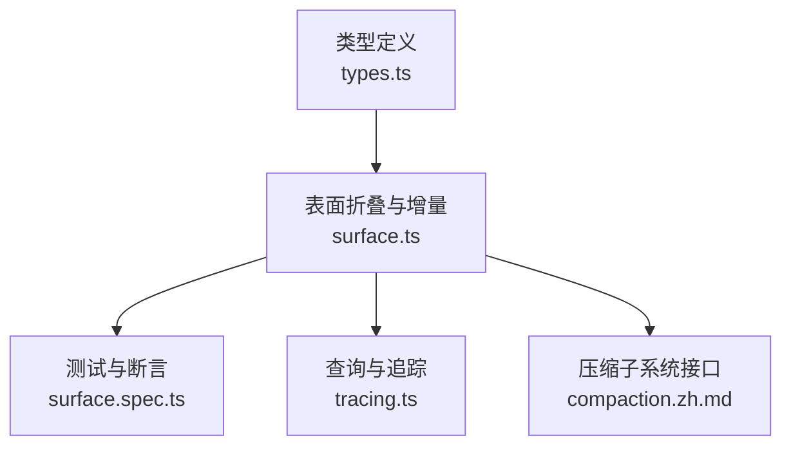
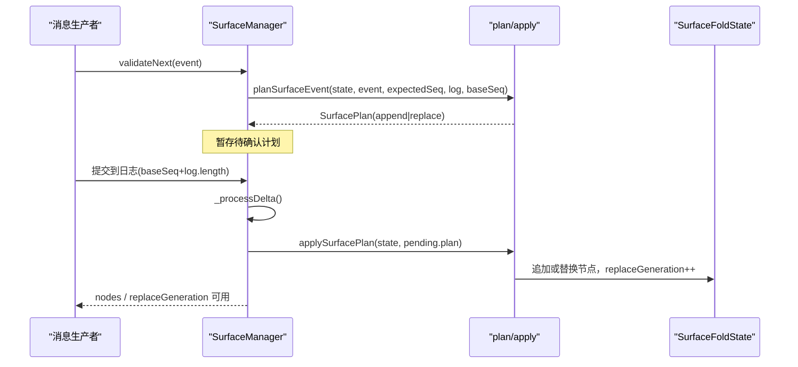
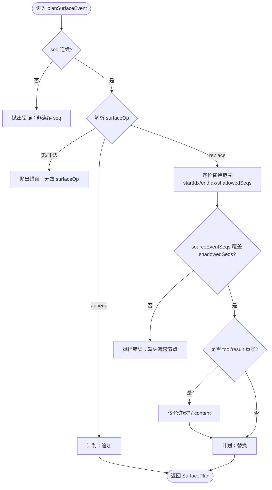
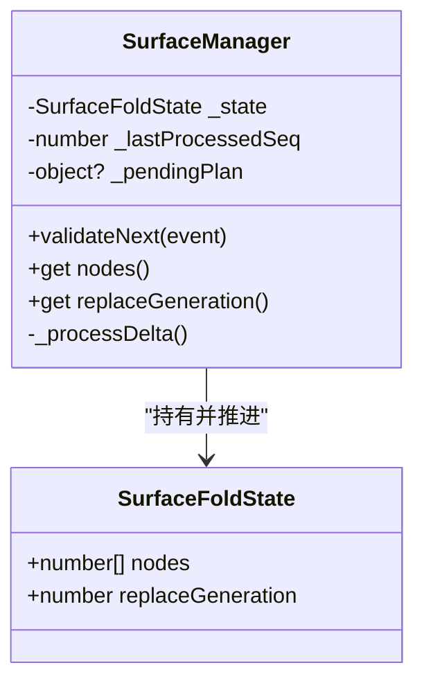
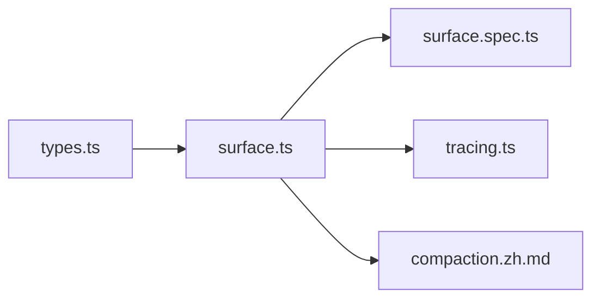

# 表面管理层

<cite>
**本文引用的文件**
- [surface.ts](file://packages/core/session/src/surface.ts)
- [types.ts](file://packages/core/session/src/types.ts)
- [surface.spec.ts](file://packages/core/session/tests/surface.spec.ts)
- [tracing.ts](file://packages/session-query/session-query/src/tracing.ts)
- [compaction.zh.md](file://docs/subsystems/compaction.zh.md)
</cite>

## 目录
1. [简介](#简介)
2. [项目结构](#项目结构)
3. [核心组件](#核心组件)
4. [架构总览](#架构总览)
5. [详细组件分析](#详细组件分析)
6. [依赖关系分析](#依赖关系分析)
7. [性能考量](#性能考量)
8. [故障排除指南](#故障排除指南)
9. [结论](#结论)
10. [附录：使用示例与最佳实践](#附录使用示例与最佳实践)

## 简介
本文件系统性梳理“表面管理层”的设计与实现，围绕有序表面（ordered surface）、节点管理、投影机制以及 surfaceOp 操作类型（append、replace）的工作原理展开。文档解释了消息生产事件如何通过 surfaceOp 标记进入有序表面，表面如何维护消息的历史顺序，并深入说明替换机制的实现细节，包括替换生成计数、节点覆盖与一致性保证。最后提供使用示例、调试与故障排除建议，帮助读者正确、高效地使用表面层。

## 项目结构
表面管理层位于会话子系统的核心路径中，主要包含：
- 类型定义：SurfaceEventType、SurfaceOp、SurfaceIntent、SessionEvent 等
- 表面折叠与增量管理器：foldSurface、SurfaceManager
- 工具函数：isSurfaceEligibleType、isSurfaceEvent、deriveEventMessage 等
- 测试用例：覆盖 sourceEventSeqs、tool/result 重写、replaceGeneration 等行为
- 查询与追踪：基于 foldSurface 的当前表面事件分析

图表来源
- [types.ts:347-393](file://packages/core/session/src/types.ts#L347-L393)
- [surface.ts:1-15](file://packages/core/session/src/surface.ts#L1-L15)
- [surface.ts:387-461](file://packages/core/session/src/surface.ts#L387-L461)
- [tracing.ts:175-214](file://packages/session-query/session-query/src/tracing.ts#L175-L214)
- [compaction.zh.md:130-191](file://docs/subsystems/compaction.zh.md#L130-L191)

章节来源
- [types.ts:347-393](file://packages/core/session/src/types.ts#L347-L393)
- [surface.ts:1-15](file://packages/core/session/src/surface.ts#L1-L15)

## 核心组件
- SurfaceEventType：限定可进入表面的事件类型集合（user/message、assistant/message、tool/result）。
- SurfaceOp：声明事件如何进入表面，支持 append（尾部追加）和 replace（范围替换）。
- SurfaceIntent：append/replace 的参数封装，含 sourceEventSeqs 用于溯源。
- SessionEvent：会话日志条目，对 SurfaceEventType 附加 surfaceOp 与 sourceEventSeqs。
- foldSurface：完整日志的“折叠”计算，返回当前 nodes 与 replacements 历史。
- SurfaceManager：增量式表面视图，提供 validateNext、nodes、replaceGeneration。
- deriveEventMessage：将单个表面事件投影为模型可见的消息（空内容 assistant 不产生消息）。

章节来源
- [types.ts:347-393](file://packages/core/session/src/types.ts#L347-L393)
- [surface.ts:116-148](file://packages/core/session/src/surface.ts#L116-L148)
- [surface.ts:184-208](file://packages/core/session/src/surface.ts#L184-L208)
- [surface.ts:320-379](file://packages/core/session/src/surface.ts#L320-L379)
- [surface.ts:387-461](file://packages/core/session/src/surface.ts#L387-L461)

## 架构总览
表面层以“只追加的日志”为事实源，通过“折叠”得到“模型可见的有序表面”。SurfaceManager 在提交前校验候选事件，并在读取 nodes/replaceGeneration 时推进增量处理，确保一致性与惰性更新。

图表来源
- [surface.ts:320-379](file://packages/core/session/src/surface.ts#L320-L379)
- [surface.ts:398-461](file://packages/core/session/src/surface.ts#L398-L461)

## 详细组件分析

### 有序表面与节点管理
- 有序表面由一组“事件序列号”组成，表示模型可见的消息顺序。
- 每个事件必须声明其进入方式：append 或 replace。
- 非表面事件（如边界、chunk、usage）不参与表面，也不允许携带 surfaceOp/sourceEventSeqs。

章节来源
- [surface.ts:15-38](file://packages/core/session/src/surface.ts#L15-L38)
- [types.ts:347-361](file://packages/core/session/src/types.ts#L347-L361)

### surfaceOp 操作类型与工作原理
- append：将事件追加到表面尾部，适用于常规用户/助手/工具结果消息。
- replace：用新节点替换当前表面中从 start 到 end（闭区间）的一段节点；start/end 必须是当前表面中的 seq；start===end 时仅替换单点。
- 验证规则：
  - 仅 SurfaceEventType 可携带 surfaceOp 与 sourceEventSeqs。
  - replace 的 sourceEventSeqs 必须包含所有被遮蔽的节点 seq。
  - tool/result 的 replace 只能改写单一节点的 content，其他字段不得变更。

图表来源
- [surface.ts:184-208](file://packages/core/session/src/surface.ts#L184-L208)
- [surface.ts:245-266](file://packages/core/session/src/surface.ts#L245-L266)
- [surface.ts:286-318](file://packages/core/session/src/surface.ts#L286-L318)
- [surface.ts:320-347](file://packages/core/session/src/surface.ts#L320-L347)

章节来源
- [surface.ts:184-208](file://packages/core/session/src/surface.ts#L184-L208)
- [surface.ts:245-266](file://packages/core/session/src/surface.ts#L245-L266)
- [surface.ts:286-318](file://packages/core/session/src/surface.ts#L286-L318)
- [surface.ts:320-347](file://packages/core/session/src/surface.ts#L320-L347)

### 消息生产事件与历史顺序维护
- 消息生产事件（user/message、assistant/message、tool/result）通过 surfaceOp 进入有序表面。
- deriveEventMessage 将表面事件投影为模型消息；assistant/message 若内容为空则不产生消息。
- 表面顺序由 append 与 replace 共同决定：append 保持尾部顺序；replace 在指定位置插入新节点并遮蔽旧节点。

章节来源
- [surface.ts:70-114](file://packages/core/session/src/surface.ts#L70-L114)
- [surface.ts:361-379](file://packages/core/session/src/surface.ts#L361-L379)

### 表面替换机制：生成计数、节点覆盖与一致性
- 每次成功执行 replace，replaceGeneration 单调递增，便于消费者区分纯尾部增长与重写。
- 节点覆盖通过 splice 完成：删除 shadowedSeqs 对应区段，插入新节点 seq。
- 一致性保证：
  - 严格检查 seq 连续性。
  - 严格校验 sourceEventSeqs 覆盖所有遮蔽节点。
  - tool/result 重写限制为仅 content 变更。
  - 窗口头部保护：当加载部分窗口时，若 replace 跨越未加载区域，会因找不到 start/end 而失败。

图表来源
- [surface.ts:144-165](file://packages/core/session/src/surface.ts#L144-L165)
- [surface.ts:398-461](file://packages/core/session/src/surface.ts#L398-L461)

章节来源
- [surface.ts:361-379](file://packages/core/session/src/surface.ts#L361-L379)
- [surface.ts:431-461](file://packages/core/session/src/surface.ts#L431-L461)

### 与压缩子系统协作
- 压缩子系统通过 replace 将一段表面节点合并为一个摘要节点，从而控制上下文大小。
- 压缩选择范围需满足平衡性（助手调用与其结果配对），并以 compactCheckpointSource 标识事务。
- 压缩结果中的 shadowedSeqs 是权威的被遮蔽节点集合，按表面顺序记录。

章节来源
- [compaction.zh.md:130-191](file://docs/subsystems/compaction.zh.md#L130-L191)

## 依赖关系分析
- types.ts 定义了 SurfaceEventType、SurfaceOp、SurfaceIntent、SessionEvent 等基础类型。
- surface.ts 依赖这些类型进行运行时校验与状态推进。
- tracing.ts 复用 foldSurface 对日志进行完整折叠，输出当前表面事件与诊断信息。
- tests/surface.spec.ts 覆盖关键行为：sourceEventSeqs 校验、tool/result 重写限制、replaceGeneration 计数、窗口头部保护等。

图表来源
- [types.ts:347-393](file://packages/core/session/src/types.ts#L347-L393)
- [surface.ts:1-15](file://packages/core/session/src/surface.ts#L1-L15)
- [tracing.ts:175-214](file://packages/session-query/session-query/src/tracing.ts#L175-L214)
- [surface.spec.ts:81-200](file://packages/core/session/tests/surface.spec.ts#L81-L200)

章节来源
- [types.ts:347-393](file://packages/core/session/src/types.ts#L347-L393)
- [surface.ts:1-15](file://packages/core/session/src/surface.ts#L1-L15)
- [tracing.ts:175-214](file://packages/session-query/session-query/src/tracing.ts#L175-L214)
- [surface.spec.ts:81-200](file://packages/core/session/tests/surface.spec.ts#L81-L200)

## 性能考量
- 惰性增量推进：SurfaceManager 仅在访问 nodes 或 replaceGeneration 时推进未处理的日志片段，避免重复计算。
- 窗口化读取：支持传入 baseSeq 与已加载窗口，跨窗口头的 replace 会失败，防止不一致。
- 最小化拷贝：replace 使用 splice 原地调整 nodes，减少额外分配。
- 投影成本：deriveEventMessage 仅对必要事件投影消息，空内容 assistant 直接跳过。

[本节为通用性能讨论，不直接分析具体文件]

## 故障排除指南
常见错误与排查要点：
- 非表面事件携带 surfaceOp/sourceEventSeqs：检查事件类型是否在 SurfaceEventType 内。
- 缺少 surfaceOp：SurfaceEventType 事件必须声明 append 或 replace。
- sourceEventSeqs 非法：必须为非负安全整数数组、无重复、不包含自身引用、且覆盖所有遮蔽节点。
- tool/result 重写越界：只能改写 content，不能改 toolCallId、isError 等其他字段。
- replace 范围无效：start/end 必须在当前表面中存在，且 start 索引不得大于 end 索引。
- 窗口头保护：当 replace 跨越未加载窗口头部时，会因找不到 start/end 而失败。

参考断言与测试：
- sourceEventSeqs 校验与覆盖要求
- tool/result 重写限制
- replaceGeneration 计数与惰性折叠
- 窗口头部保护

章节来源
- [surface.ts:184-208](file://packages/core/session/src/surface.ts#L184-L208)
- [surface.ts:210-243](file://packages/core/session/src/surface.ts#L210-L243)
- [surface.ts:286-318](file://packages/core/session/src/surface.ts#L286-L318)
- [surface.ts:320-347](file://packages/core/session/src/surface.ts#L320-L347)
- [surface.spec.ts:81-200](file://packages/core/session/tests/surface.spec.ts#L81-L200)
- [surface.spec.ts:242-288](file://packages/core/session/tests/surface.spec.ts#L242-L288)
- [surface.spec.ts:946-966](file://packages/core/session/tests/surface.spec.ts#L946-L966)

## 结论
表面管理层通过严格的类型约束与运行时校验，将“只追加的日志”转化为“模型可见的有序表面”，并以 append/replace 两种原子操作维护消息顺序与历史一致性。SurfaceManager 提供增量视图与 replaceGeneration 计数，便于消费方感知变化。结合压缩子系统，系统可在长对话中有效管理上下文规模，同时保持可追溯性与可重放性。

[本节为总结性内容，不直接分析具体文件]

## 附录：使用示例与最佳实践

### 正确使用 surfaceOp 参数
- 对 user/message、assistant/message、tool/result 事件，必须提供 surfaceOp。
- 常规消息使用 append；需要概括或替换时使用 replace，并确保 start/end 是当前表面中的 seq。
- 使用 sourceEventSeqs 记录该事件所依赖的早期事件；replace 时必须包含所有被遮蔽节点。

章节来源
- [types.ts:347-393](file://packages/core/session/src/types.ts#L347-L393)
- [surface.ts:184-208](file://packages/core/session/src/surface.ts#L184-L208)

### 处理复杂消息结构
- assistant/message 若内容为空，不会投影为消息；如需承载 usage，仍可作为表面节点存在但不产生消息。
- tool/result 的 replace 仅允许改写 content，其他字段保持不变。

章节来源
- [surface.ts:70-114](file://packages/core/session/src/surface.ts#L70-L114)
- [surface.ts:286-318](file://packages/core/session/src/surface.ts#L286-L318)

### 优化表面性能
- 使用 SurfaceManager 的 validateNext 预校验候选事件，避免无效写入。
- 利用 replace 将多段历史压缩为摘要节点，降低后续请求上下文大小。
- 合理设置 baseSeq 与窗口长度，避免不必要的折叠与查找。

章节来源
- [surface.ts:398-461](file://packages/core/session/src/surface.ts#L398-L461)
- [compaction.zh.md:130-191](file://docs/subsystems/compaction.zh.md#L130-L191)

### 表面状态调试与诊断
- 使用 foldSurface 获取完整折叠结果（nodes 与 replacements），用于离线分析与比对。
- 使用 tracing 模块的 currentSurfaceEvents 获取当前表面事件快照，辅助定位问题。
- 关注 replaceGeneration 的变化，判断是否发生了替换而非单纯追加。

章节来源
- [surface.ts:387-395](file://packages/core/session/src/surface.ts#L387-L395)
- [tracing.ts:175-214](file://packages/session-query/session-query/src/tracing.ts#L175-L214)
- [surface.spec.ts:946-966](file://packages/core/session/tests/surface.spec.ts#L946-L966)