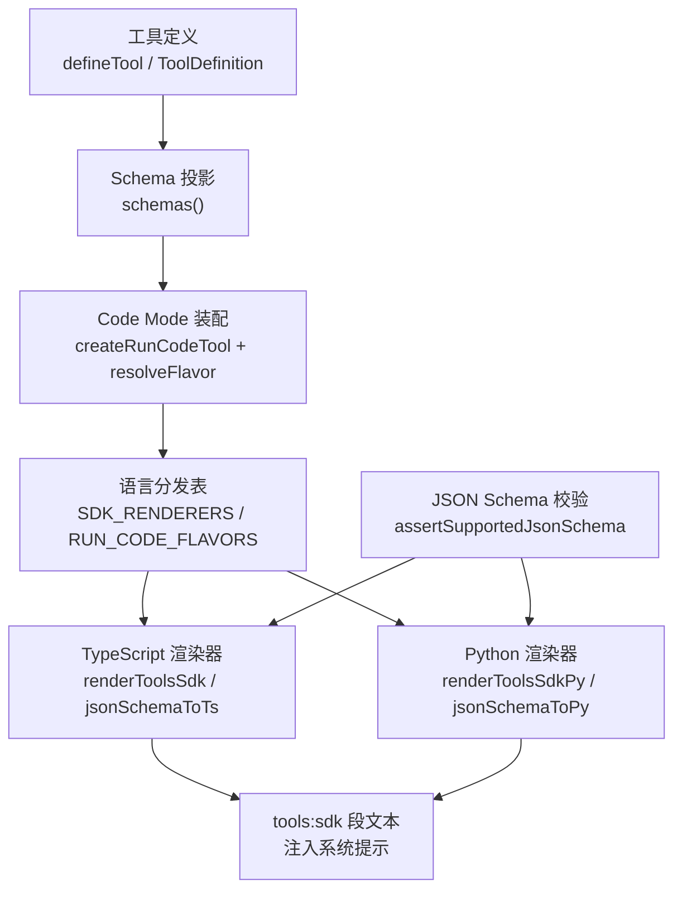
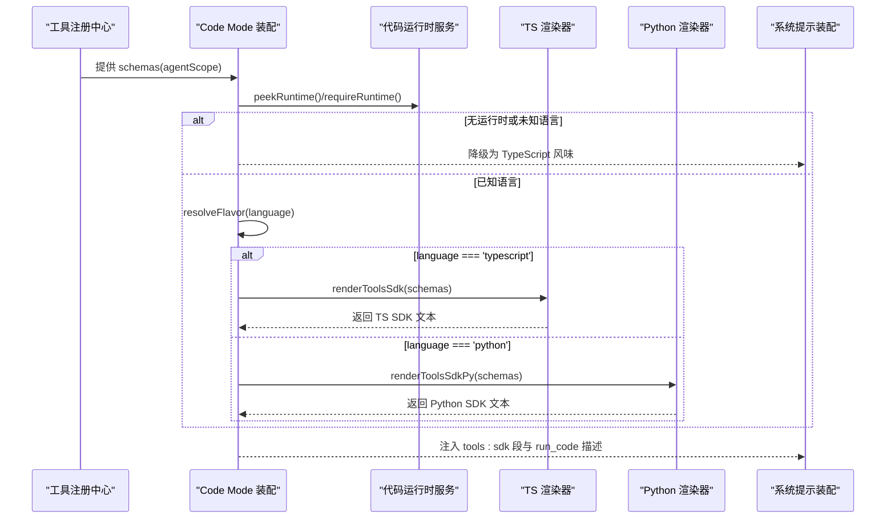
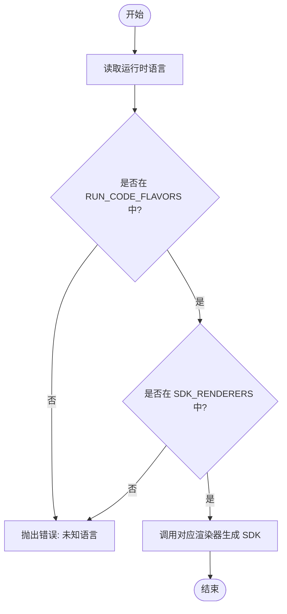
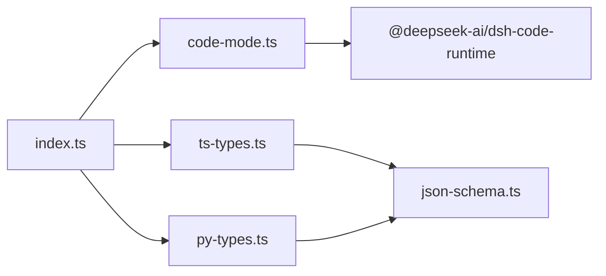
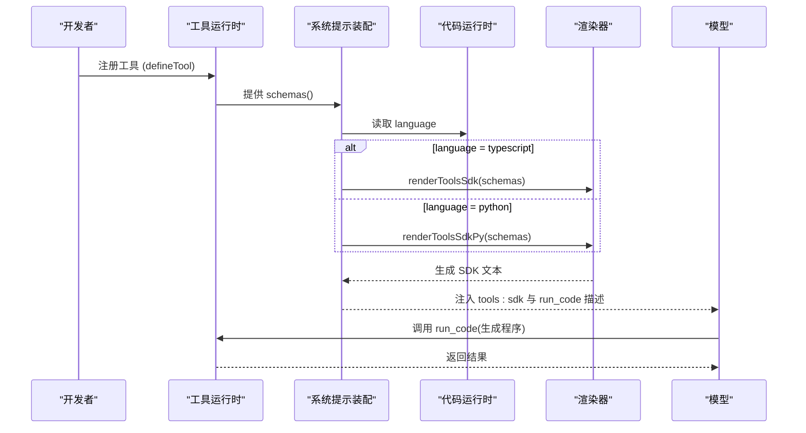

# SDK自动生成机制

<cite>
**本文引用的文件**
- [packages/core/tools/src/index.ts](file://packages/core/tools/src/index.ts)
- [packages/core/tools/src/code-mode.ts](file://packages/core/tools/src/code-mode.ts)
- [packages/core/tools/src/ts-types.ts](file://packages/core/tools/src/ts-types.ts)
- [packages/core/tools/src/py-types.ts](file://packages/core/tools/src/py-types.ts)
- [packages/core/tools/src/json-schema.ts](file://packages/core/tools/src/json-schema.ts)
- [packages/core/tools/tests/code-mode.spec.ts](file://packages/core/tools/tests/code-mode.spec.ts)
- [packages/core/tools/tests/ts-types.spec.ts](file://packages/core/tools/tests/ts-types.spec.ts)
- [packages/core/tools/tests/py-types.spec.ts](file://packages/core/tools/tests/py-types.spec.ts)
- [scripts/gen-tool-catalog.ts](file://scripts/gen-tool-catalog.ts)
</cite>

## 目录
1. [简介](#简介)
2. [项目结构](#项目结构)
3. [核心组件](#核心组件)
4. [架构总览](#架构总览)
5. [详细组件分析](#详细组件分析)
6. [依赖关系分析](#依赖关系分析)
7. [性能考量](#性能考量)
8. [故障排查指南](#故障排查指南)
9. [结论](#结论)
10. [附录：端到端生成流程示例](#附录端到端生成流程示例)

## 简介
本文件系统性说明代码模式下SDK的自动生成机制，覆盖TypeScript与Python两种语言的后端渲染、类型定义生成、函数签名推导、文档注释提取、运行时适配与多语言分发策略。重点解释工具定义到可调用SDK的映射关系、一致性保障、配置选项与扩展点，并提供从工具注册到最终可调用SDK的完整流程示例。

## 项目结构
围绕SDK自动生成的关键代码集中在 core/tools 包中，按职责划分为：
- 工具注册与执行管线（index.ts）
- Code Mode 传输与语言分发（code-mode.ts）
- TypeScript SDK 渲染器（ts-types.ts）
- Python SDK 渲染器（py-types.ts）
- JSON Schema 统一约束与校验（json-schema.ts）
- 测试用例用于断言行为与边界条件（tests/*）
- 工具目录生成脚本（scripts/gen-tool-catalog.ts）

图表来源
- [packages/core/tools/src/index.ts:60-63](file://packages/core/tools/src/index.ts#L60-L63)
- [packages/core/tools/src/code-mode.ts:82-88](file://packages/core/tools/src/code-mode.ts#L82-L88)
- [packages/core/tools/src/ts-types.ts:240-293](file://packages/core/tools/src/ts-types.ts#L240-L293)
- [packages/core/tools/src/py-types.ts:726-819](file://packages/core/tools/src/py-types.ts#L726-L819)
- [packages/core/tools/src/json-schema.ts:385-405](file://packages/core/tools/src/json-schema.ts#L385-L405)

章节来源
- [packages/core/tools/src/index.ts:1-120](file://packages/core/tools/src/index.ts#L1-L120)
- [packages/core/tools/src/code-mode.ts:1-132](file://packages/core/tools/src/code-mode.ts#L1-L132)
- [packages/core/tools/src/ts-types.ts:1-294](file://packages/core/tools/src/ts-types.ts#L1-L294)
- [packages/core/tools/src/py-types.ts:1-819](file://packages/core/tools/src/py-types.ts#L1-L819)
- [packages/core/tools/src/json-schema.ts:1-657](file://packages/core/tools/src/json-schema.ts#L1-L657)

## 核心组件
- 工具运行时与呈现模式（ToolRuntime/Config.mode）
  - 支持 native、code、both 三种呈现模式；code/both 需要已挂载的代码运行时且语言在已知表中。
  - 提供 schemas(agentScope) 暴露可见工具集合，供提示词装配使用。
- Code Mode 传输与语言分发
  - createRunCodeTool 注入 run_code 工具，其 description 与 parameters.code.description 通过 resolveFlavor 惰性解析为当前运行时的语言风味。
  - SDK_RENDERERS 将语言映射到对应渲染器；RUN_CODE_FLAVORS 将语言映射到模型侧描述。
- 类型与文档生成
  - ts-types.ts：将统一 JSON Schema 节点映射为 TypeScript 类型字面量与 tools 接口声明。
  - py-types.ts：将统一 JSON Schema 节点映射为 Python TypedDict、Protocol 与 tools 协议，并输出使用说明。
- JSON Schema 统一约束
  - assertSupportedJsonSchema 强制仅允许受支持的子集，确保两端渲染器输入一致且安全。

章节来源
- [packages/core/tools/src/index.ts:650-674](file://packages/core/tools/src/index.ts#L650-L674)
- [packages/core/tools/src/code-mode.ts:115-132](file://packages/core/tools/src/code-mode.ts#L115-L132)
- [packages/core/tools/src/ts-types.ts:240-293](file://packages/core/tools/src/ts-types.ts#L240-L293)
- [packages/core/tools/src/py-types.ts:726-819](file://packages/core/tools/src/py-types.ts#L726-L819)
- [packages/core/tools/src/json-schema.ts:385-405](file://packages/core/tools/src/json-schema.ts#L385-L405)

## 架构总览
下图展示从工具注册到提示词注入的端到端数据流，以及语言分发如何保证“SDK段”与“run_code 模型侧描述”一致。

图表来源
- [packages/core/tools/src/index.ts:60-63](file://packages/core/tools/src/index.ts#L60-L63)
- [packages/core/tools/src/code-mode.ts:115-132](file://packages/core/tools/src/code-mode.ts#L115-L132)
- [packages/core/tools/src/ts-types.ts:240-293](file://packages/core/tools/src/ts-types.ts#L240-L293)
- [packages/core/tools/src/py-types.ts:726-819](file://packages/core/tools/src/py-types.ts#L726-L819)

## 详细组件分析

### 类型定义生成与函数签名推导
- 统一输入：所有工具参数与输出均基于受支持的 JSON Schema 子集（type/oneOf/properties/required/additionalProperties/items/enum/const + 注解）。
- TypeScript 渲染
  - jsonSchemaToTs 将每个节点映射为 TS 类型字面量；对象属性生成可选/必填字段，数组递归 items，oneOf 生成联合类型。
  - renderToolsSdk 汇总所有工具的参数与输出，生成 ToolArgsMap/ToolOutputMap 与 tools 接口声明，附带使用说明。
- Python 渲染
  - jsonSchemaToPy 将节点映射为 Python 类型表达式；对象生成命名 TypedDict，数组生成 list[T]，oneOf 生成 X | Y。
  - renderToolsSdkPy 生成 Protocol 与 tools 单例，并为每个工具生成方法签名与 docstring；对非法标识符或保留字采用下标访问路径。
- 健壮性
  - 两端均在入口处先做整体校验（assertSupportedJsonSchema），随后信任内部结构；遇到不支持或畸形节点时退化（TS 退化为 unknown，Python 退化为 Any），不抛错中断装配。

章节来源
- [packages/core/tools/src/json-schema.ts:385-405](file://packages/core/tools/src/json-schema.ts#L385-L405)
- [packages/core/tools/src/ts-types.ts:240-293](file://packages/core/tools/src/ts-types.ts#L240-L293)
- [packages/core/tools/src/py-types.ts:726-819](file://packages/core/tools/src/py-types.ts#L726-L819)
- [packages/core/tools/tests/ts-types.spec.ts:63-86](file://packages/core/tools/tests/ts-types.spec.ts#L63-L86)
- [packages/core/tools/tests/py-types.spec.ts:25-52](file://packages/core/tools/tests/py-types.spec.ts#L25-L52)

### 文档注释提取
- 工具描述与字段描述作为 schema.description 存在，渲染器将其折叠为一行并转义，避免破坏生成代码的语法。
- TypeScript：以 JSDoc 块形式附着在成员前。
- Python：作为方法的第一个语句（docstring）插入，确保每个方法都有可读文档；对于无法作为属性的工具名，以注释形式列出以保持排序稳定。

章节来源
- [packages/core/tools/src/ts-types.ts:31-38](file://packages/core/tools/src/ts-types.ts#L31-L38)
- [packages/core/tools/src/py-types.ts:223-246](file://packages/core/tools/src/py-types.ts#L223-L246)
- [packages/core/tools/src/py-types.ts:773-800](file://packages/core/tools/src/py-types.ts#L773-L800)

### 运行时适配与多语言分发
- 语言选择依据 ctx.codeRuntime.language，通过两张并行表完成：
  - SDK_RENDERERS：语言 → SDK 渲染器（typescript → renderToolsSdk，python → renderToolsSdkPy）。
  - RUN_CODE_FLAVORS：语言 → run_code 的工具 description 与 code 参数描述。
- 惰性解析：run_code 的 description 与 parameters.code.description 在 schema 读取时解析，保证模型侧描述与 SDK 段语言一致。
- 安全守卫：使用 Object.hasOwn 防止原型链污染；未知语言直接抛出错误，避免静默回退导致模型看到错误语言的指令。

图表来源
- [packages/core/tools/src/index.ts:60-63](file://packages/core/tools/src/index.ts#L60-L63)
- [packages/core/tools/src/code-mode.ts:82-88](file://packages/core/tools/src/code-mode.ts#L82-L88)
- [packages/core/tools/src/code-mode.ts:115-132](file://packages/core/tools/src/code-mode.ts#L115-L132)

章节来源
- [packages/core/tools/src/index.ts:60-63](file://packages/core/tools/src/index.ts#L60-L63)
- [packages/core/tools/src/code-mode.ts:115-132](file://packages/core/tools/src/code-mode.ts#L115-L132)
- [packages/core/tools/tests/code-mode.spec.ts:423-438](file://packages/core/tools/tests/code-mode.spec.ts#L423-L438)

### 与工具定义的映射与一致性保障
- 单一真源：工具定义通过 defineTool 声明参数与输出 schema；schemas() 暴露可见工具集合。
- 一致性：
  - 渲染器共享同一 JSON Schema 子集与校验逻辑，确保 TS/Python 输出语义一致。
  - run_code 的描述与 code 参数描述由 RUN_CODE_FLAVORS 驱动，与 SDK 段语言严格对齐。
  - 工具名称排序确定（字典序），使相同工具集产生字节级一致的提示文本，利于缓存命中。
- 可见性控制：按 agent scope 过滤后再生成 SDK，确保程序内绑定与提示词声明一致。

章节来源
- [packages/core/tools/src/index.ts:650-674](file://packages/core/tools/src/index.ts#L650-L674)
- [packages/core/tools/src/code-mode.ts:296-330](file://packages/core/tools/src/code-mode.ts#L296-L330)
- [packages/core/tools/src/ts-types.ts:273-293](file://packages/core/tools/src/ts-types.ts#L273-L293)
- [packages/core/tools/src/py-types.ts:763-819](file://packages/core/tools/src/py-types.ts#L763-L819)

### 配置选项与自定义扩展点
- 呈现模式 Config.mode
  - native：发送原生工具 schema。
  - code：仅发送 run_code 与生成的 SDK 段，并在非 native 模式下限制直接调用。
  - both：同时发送两者。
- 并发控制 Config.maxParallelSubCalls
  - 控制 run_code 程序中重叠的子调用上限，默认值与调度契约保持一致。
- 扩展点
  - 新增语言：需添加 CodeSdkLanguage 成员、SDK_RENDERERS 与 RUN_CODE_FLAVORS 条目，并实现对应渲染器。
  - 工具目录生成：scripts/gen-tool-catalog.ts 负责收集与渲染工具 schema 到文档目录，便于外部查阅。

章节来源
- [packages/core/tools/src/index.ts:650-674](file://packages/core/tools/src/index.ts#L650-L674)
- [scripts/gen-tool-catalog.ts:699-794](file://scripts/gen-tool-catalog.ts#L699-L794)

## 依赖关系分析
- 模块耦合
  - index.ts 聚合 code-mode、ts-types、py-types，并通过 SDK_RENDERERS 进行语言分发。
  - code-mode.ts 依赖运行时服务（@deepseek-ai/dsh-code-runtime）的 language 字段，保持后端无关。
  - ts-types.py 与 py-types.py 共同依赖 json-schema.ts 的统一约束与校验。
- 外部依赖
  - LLM/Session 相关类型与工具（如 ContentBlock、JsonValue）来自 dsh-llm/dsh-session。
  - 运行时服务通过 Service Definition 暴露 language，避免工具层耦合具体后端。

图表来源
- [packages/core/tools/src/index.ts:24-28](file://packages/core/tools/src/index.ts#L24-L28)
- [packages/core/tools/src/code-mode.ts:11-17](file://packages/core/tools/src/code-mode.ts#L11-L17)
- [packages/core/tools/src/ts-types.ts:9-11](file://packages/core/tools/src/ts-types.ts#L9-L11)
- [packages/core/tools/src/py-types.ts:17-19](file://packages/core/tools/src/py-types.ts#L17-L19)

章节来源
- [packages/core/tools/src/index.ts:24-28](file://packages/core/tools/src/index.ts#L24-L28)
- [packages/core/tools/src/code-mode.ts:11-17](file://packages/core/tools/src/code-mode.ts#L11-L17)

## 性能考量
- 确定性输出：工具按字典序排列，类名分配与导入顺序固定，保证相同工具集生成字节级一致文本，利于提示词缓存。
- 深度保护：
  - Python 列表嵌套超过阈值（MAX_LIST_NESTING）时退化为 Any，避免 CPython 语法限制导致的不可解析代码。
  - TypeScript 对象类型使用组合文档结构，避免深层递归带来的字符串拼接开销。
- 序列化与展示：
  - run_code 结果文本渲染采用迭代式任务栈，避免递归遍历与缩进膨胀，保持线性复杂度。

章节来源
- [packages/core/tools/src/py-types.ts:287-329](file://packages/core/tools/src/py-types.ts#L287-L329)
- [packages/core/tools/src/ts-types.ts:55-92](file://packages/core/tools/src/ts-types.ts#L55-L92)
- [packages/core/tools/src/code-mode.ts:186-259](file://packages/core/tools/src/code-mode.ts#L186-L259)

## 故障排查指南
- 未知语言报错
  - 现象：提示词装配阶段抛出错误，指出未注册的运行时语言。
  - 原因：RUN_CODE_FLAVORS 或 SDK_RENDERERS 缺少该语言条目。
  - 处理：在两张表中同步添加该语言条目，并确保渲染器实现可用。
- 工具输出不符合 schema
  - 现象：工具返回值被拒绝，报告无效输出。
  - 原因：返回值未通过 validateJsonSchemaValue 校验。
  - 处理：修正工具返回值结构，使其符合 output.schema 声明。
- 深嵌套输出导致类型退化
  - 现象：Python SDK 中出现 Any 而非期望的类型链。
  - 原因：超出 MAX_LIST_NESTING 限制。
  - 处理：简化输出结构或拆分复杂嵌套。

章节来源
- [packages/core/tools/src/code-mode.ts:115-132](file://packages/core/tools/src/code-mode.ts#L115-L132)
- [packages/core/tools/src/json-schema.ts:646-657](file://packages/core/tools/src/json-schema.ts#L646-L657)
- [packages/core/tools/tests/code-mode.spec.ts:164-186](file://packages/core/tools/tests/code-mode.spec.ts#L164-L186)

## 结论
本机制通过统一的 JSON Schema 约束与双语言渲染器，实现了从工具定义到可调用 SDK 的自动化生成。语言分发与惰性解析确保模型侧描述与 SDK 段一致，确定性输出提升缓存命中率。通过明确的配置项与扩展点，系统可在不改动核心管线的前提下扩展新语言与新渲染器。

## 附录：端到端生成流程示例
以下示例演示从工具注册到最终可调用 SDK 的完整过程（概念性流程，不展示具体代码内容）：
- 步骤1：使用 defineTool 注册工具，声明参数与输出 schema。
- 步骤2：在工具运行时中启用 mode: 'code' 或 'both'，并挂载代码运行时（指定 language）。
- 步骤3：系统提示装配时，调用 schemas(agentScope) 获取可见工具集合。
- 步骤4：根据运行时语言选择渲染器（TS 或 Python），生成 tools:sdk 段文本。
- 步骤5：将 tools:sdk 段与 run_code 描述注入系统提示，模型据此生成可执行程序。
- 步骤6：程序通过 tools 接口调用工具，结果经输出 schema 校验后返回。

[此图为概念流程图，无需图表来源]