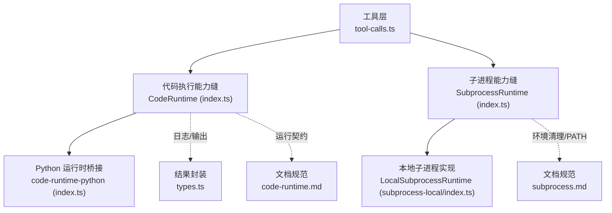
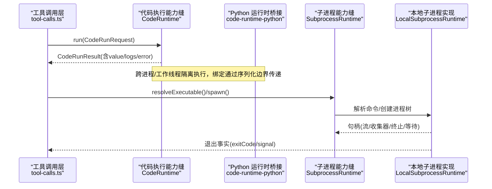
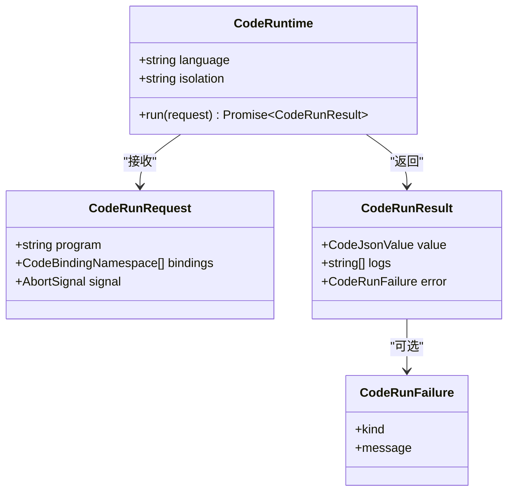
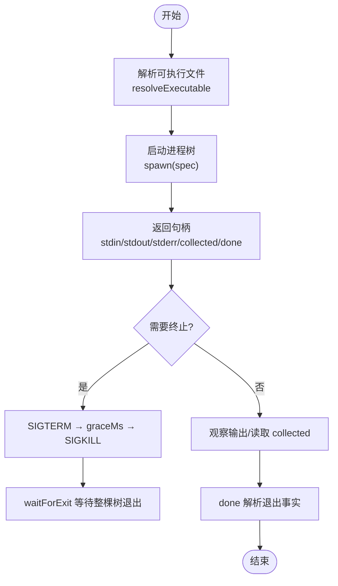
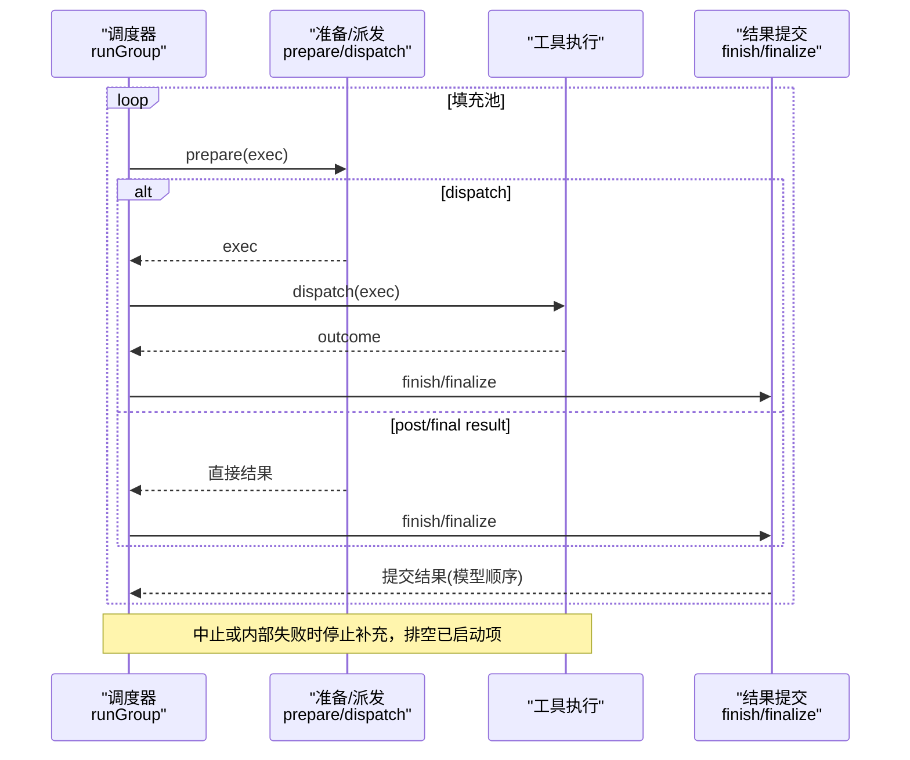
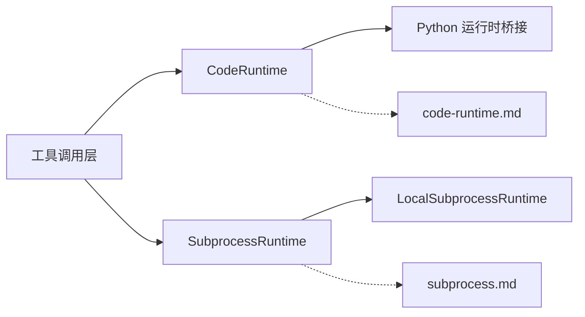

# 代码执行引擎

<cite>
**本文引用的文件**
- [packages/code-runtime/code-runtime/src/index.ts](file://packages/code-runtime/code-runtime/src/index.ts)
- [packages/code-runtime/code-runtime/src/types.ts](file://packages/code-runtime/code-runtime/src/types.ts)
- [packages/code-runtime/code-runtime-python/src/index.ts](file://packages/code-runtime/code-runtime-python/src/index.ts)
- [packages/subprocess/subprocess/src/index.ts](file://packages/subprocess/subprocess/src/index.ts)
- [packages/subprocess/subprocess-local/src/index.ts](file://packages/subprocess/subprocess-local/src/index.ts)
- [packages/core/agent-loop/src/tool-calls.ts](file://packages/core/agent-loop/src/tool-calls.ts)
- [docs/subsystems/code-runtime.md](file://docs/subsystems/code-runtime.md)
- [docs/subsystems/subprocess.md](file://docs/subsystems/subprocess.md)
</cite>

## 目录
1. [简介](#简介)
2. [项目结构](#项目结构)
3. [核心组件](#核心组件)
4. [架构总览](#架构总览)
5. [详细组件分析](#详细组件分析)
6. [依赖关系分析](#依赖关系分析)
7. [性能与并发控制](#性能与并发控制)
8. [故障排除指南](#故障排除指南)
9. [结论](#结论)
10. [附录：监控与调试](#附录：监控与调试)

## 简介
本文件面向“代码执行引擎”的底层实现，聚焦 run_code 工具背后的执行机制，包括程序加载、绑定注入、执行调度、并发控制、资源限制、错误恢复策略；并解释子调用调度器（并行与独占）的工作原理、执行上下文生命周期与状态持久化，以及性能监控与调试方法。内容基于仓库中的能力缝（capability seam）定义与本地实现，确保读者既能把握高层设计，也能定位到具体源码位置。

## 项目结构
代码执行引擎由两大能力缝组成：
- 代码执行能力缝：抽象服务 CodeRuntime 及其类型契约，提供 run(request) 接口，隔离语言与执行基座。
- 子进程能力缝：抽象服务 SubprocessRuntime 及本地实现 LocalSubprocessRuntime，负责可执行解析、受管进程树、标准 I/O 处置、终止升级与终端会话。

图表来源
- [packages/core/agent-loop/src/tool-calls.ts:1-290](file://packages/core/agent-loop/src/tool-calls.ts#L1-L290)
- [packages/code-runtime/code-runtime/src/index.ts:1-138](file://packages/code-runtime/code-runtime/src/index.ts#L1-L138)
- [packages/code-runtime/code-runtime-python/src/index.ts:1-20](file://packages/code-runtime/code-runtime-python/src/index.ts#L1-L20)
- [packages/subprocess/subprocess/src/index.ts:1-143](file://packages/subprocess/subprocess/src/index.ts#L1-L143)
- [packages/subprocess/subprocess-local/src/index.ts:1-196](file://packages/subprocess/subprocess-local/src/index.ts#L1-L196)
- [docs/subsystems/code-runtime.md:1-192](file://docs/subsystems/code-runtime.md#L1-L192)
- [docs/subsystems/subprocess.md:1-325](file://docs/subsystems/subprocess.md#L1-L325)

章节来源
- [packages/code-runtime/code-runtime/src/index.ts:1-138](file://packages/code-runtime/code-runtime/src/index.ts#L1-L138)
- [packages/subprocess/subprocess/src/index.ts:1-143](file://packages/subprocess/subprocess/src/index.ts#L1-L143)
- [packages/subprocess/subprocess-local/src/index.ts:1-196](file://packages/subprocess/subprocess-local/src/index.ts#L1-L196)
- [docs/subsystems/code-runtime.md:1-192](file://docs/subsystems/code-runtime.md#L1-L192)
- [docs/subsystems/subprocess.md:1-325](file://docs/subsystems/subprocess.md#L1-L325)

## 核心组件
- 代码执行能力缝（CodeRuntime）
  - 职责：以 request 为单位执行一段程序，注入宿主函数作为全局命名空间，捕获输出并返回结构化结果。
  - 关键契约：run(CodeRunRequest) -> CodeRunResult；language/isolation 为只读描述符；失败以字段形式返回而非抛错。
  - 安全边界：保留全局名集合、错误成员名集合、跨语言保留字集合，避免后端间命名冲突。
- 子进程能力缝（SubprocessRuntime）
  - 职责：在统一执行世界中解析可执行文件、启动受管进程树、管理 stdio 处置、提供统一的终止升级与等待退出语义。
  - 本地实现（LocalSubprocessRuntime）：维护 live 句柄集与终端集，注册主机退出钩子，按树级进行 SIGTERM→grace→SIGKILL 升级，并在 dispose 时等待整棵树退出。
- 工具调用调度器（executeToolCalls / runGroup）
  - 职责：将模型生成的工具调用按模式（parallel/exclusive）分组调度，保证模型顺序提交结果与上下文，支持中止与内部调度失败的优雅降级。

章节来源
- [packages/code-runtime/code-runtime/src/index.ts:95-135](file://packages/code-runtime/code-runtime/src/index.ts#L95-L135)
- [packages/code-runtime/code-runtime/src/types.ts:9-128](file://packages/code-runtime/code-runtime/src/types.ts#L9-L128)
- [packages/subprocess/subprocess/src/index.ts:74-140](file://packages/subprocess/subprocess/src/index.ts#L74-L140)
- [packages/subprocess/subprocess-local/src/index.ts:37-184](file://packages/subprocess/subprocess-local/src/index.ts#L37-L184)
- [packages/core/agent-loop/src/tool-calls.ts:59-246](file://packages/core/agent-loop/src/tool-calls.ts#L59-L246)

## 架构总览
下图展示从工具调用到代码执行与子进程调度的端到端流程，体现“显式优于隐式”的设计原则：所有默认值与限制均在实现配置中声明，不在请求中隐藏填充。

图表来源
- [packages/core/agent-loop/src/tool-calls.ts:59-246](file://packages/core/agent-loop/src/tool-calls.ts#L59-L246)
- [packages/code-runtime/code-runtime/src/index.ts:102-135](file://packages/code-runtime/code-runtime/src/index.ts#L102-L135)
- [packages/code-runtime/code-runtime-python/src/index.ts:1-20](file://packages/code-runtime/code-runtime-python/src/index.ts#L1-L20)
- [packages/subprocess/subprocess/src/index.ts:107-140](file://packages/subprocess/subprocess/src/index.ts#L107-L140)
- [packages/subprocess/subprocess-local/src/index.ts:104-184](file://packages/subprocess/subprocess-local/src/index.ts#L104-L184)

## 详细组件分析

### 代码执行能力缝（CodeRuntime）
- 设计要点
  - 单一入口 run(request)，不感知工具与会话细节，仅关注程序、绑定、中止信号与结果。
  - 语言与隔离方式为只读描述符，便于诊断与呈现。
  - 失败分类：异常、超时、中止、工作进程退出、非法输出、输出超限，均为结果字段而非抛错。
- 绑定注入与安全
  - 每个命名空间暴露为一组异步可调用的全局对象；函数参数与返回值必须可无损 JSON 传输。
  - 拒绝保留的全局名（如 console、__dsh_main__ 等），拒绝 dunder 形式的错误成员名，拒绝跨语言保留字。
- 结果与日志
  - logs 按发射顺序记录文本；value 仅在完成且可无损传输时存在；error 携带失败种类与人类可读信息。

图表来源
- [packages/code-runtime/code-runtime/src/index.ts:95-135](file://packages/code-runtime/code-runtime/src/index.ts#L95-L135)
- [packages/code-runtime/code-runtime/src/types.ts:67-128](file://packages/code-runtime/code-runtime/src/types.ts#L67-L128)

章节来源
- [packages/code-runtime/code-runtime/src/index.ts:95-135](file://packages/code-runtime/code-runtime/src/index.ts#L95-L135)
- [packages/code-runtime/code-runtime/src/types.ts:9-128](file://packages/code-runtime/code-runtime/src/types.ts#L9-L128)
- [docs/subsystems/code-runtime.md:9-161](file://docs/subsystems/code-runtime.md#L9-L161)

### Python 运行时桥接（code-runtime-python）
- 职责：维护 Node 主机与 CPython 子进程之间的无版本 fd-3 线协议；导出编解码与校验函数，供消费方共享同一词汇表。
- 作用：使 Python 后端能复用统一的协议约束与健壮性检查，确保跨语言可移植性。

章节来源
- [packages/code-runtime/code-runtime-python/src/index.ts:1-20](file://packages/code-runtime/code-runtime-python/src/index.ts#L1-L20)

### 子进程能力缝与本地实现
- 抽象服务（SubprocessRuntime）
  - 提供 resolveExecutable、spawn、spawnTerminal 三个核心能力；强调“完全显式”的 spawn spec，无隐式默认。
  - 环境清洗：移除敏感键与 DSH_* 前缀的环境变量，防止凭据泄漏。
- 本地实现（LocalSubprocessRuntime）
  - 维护 live 句柄与 terminals 集合，注册主机退出监听，确保进程树在宿主退出时被强制清理。
  - 终止升级：terminate() 唯一终止动词，SIGTERM→graceMs→SIGKILL，跨平台树级生效；waitForExit 等待整棵树退出。
  - 终端分配：spawnTerminal 拥有 PTY 分配、UTF-8 文本传输、前台进程组与完整会话清理。

图表来源
- [packages/subprocess/subprocess/src/index.ts:107-140](file://packages/subprocess/subprocess/src/index.ts#L107-L140)
- [packages/subprocess/subprocess-local/src/index.ts:104-184](file://packages/subprocess/subprocess-local/src/index.ts#L104-L184)
- [docs/subsystems/subprocess.md:132-249](file://docs/subsystems/subprocess.md#L132-L249)

章节来源
- [packages/subprocess/subprocess/src/index.ts:37-140](file://packages/subprocess/subprocess/src/index.ts#L37-L140)
- [packages/subprocess/subprocess-local/src/index.ts:37-184](file://packages/subprocess/subprocess-local/src/index.ts#L37-L184)
- [docs/subsystems/subprocess.md:9-249](file://docs/subsystems/subprocess.md#L9-L249)

### 工具调用调度器（并行与独占）
- 执行模式
  - 普通调用进入有界滚动池，最大并发由配置 maxParallelToolCalls 控制。
  - 独占调用形成屏障：后续调用需等待当前池排空；若重新分类为独占，则等待当前池耗尽后再排队。
- 模型顺序提交
  - 预执行阶段可能阻塞，但只有派发/主体阶段重叠；结果与上下文按模型顺序提交，保证回放一致性。
- 中止与失败处理
  - 中止：停止新派发，排空已启动调用，记录跳过调用的合成结果，接受已提交上下文。
  - 调度器内部失败：停止新派发，排空已派发调用，不伪造恢复结果，直接抛出首个失败。

图表来源
- [packages/core/agent-loop/src/tool-calls.ts:121-246](file://packages/core/agent-loop/src/tool-calls.ts#L121-L246)

章节来源
- [packages/core/agent-loop/src/tool-calls.ts:1-290](file://packages/core/agent-loop/src/tool-calls.ts#L1-L290)

## 依赖关系分析
- 松耦合能力缝
  - CodeRuntime 与 SubprocessRuntime 通过明确接口解耦，消费者（工具层）组合两者，互不感知内部实现。
- 本地实现依赖
  - LocalSubprocessRuntime 依赖 node-pty、文件系统 API、进程信号与平台差异处理。
- 文档与契约
  - code-runtime.md 与 subprocess.md 对能力缝行为进行权威说明，与源码保持同步。

图表来源
- [packages/core/agent-loop/src/tool-calls.ts:1-290](file://packages/core/agent-loop/src/tool-calls.ts#L1-L290)
- [packages/code-runtime/code-runtime/src/index.ts:1-138](file://packages/code-runtime/code-runtime/src/index.ts#L1-L138)
- [packages/subprocess/subprocess/src/index.ts:1-143](file://packages/subprocess/subprocess/src/index.ts#L1-L143)
- [packages/subprocess/subprocess-local/src/index.ts:1-196](file://packages/subprocess/subprocess-local/src/index.ts#L1-L196)
- [docs/subsystems/code-runtime.md:1-192](file://docs/subsystems/code-runtime.md#L1-L192)
- [docs/subsystems/subprocess.md:1-325](file://docs/subsystems/subprocess.md#L1-L325)

章节来源
- [packages/code-runtime/code-runtime/src/index.ts:1-138](file://packages/code-runtime/code-runtime/src/index.ts#L1-L138)
- [packages/subprocess/subprocess/src/index.ts:1-143](file://packages/subprocess/subprocess/src/index.ts#L1-L143)
- [packages/subprocess/subprocess-local/src/index.ts:1-196](file://packages/subprocess/subprocess-local/src/index.ts#L1-L196)
- [docs/subsystems/code-runtime.md:1-192](file://docs/subsystems/code-runtime.md#L1-L192)
- [docs/subsystems/subprocess.md:1-325](file://docs/subsystems/subprocess.md#L1-L325)

## 性能与并发控制
- 并发上限
  - 工具调用并发由 maxParallelToolCalls 控制，避免过载；调度器使用 inFlight 集合跟踪进行中任务。
- 有序提交
  - 结果与上下文按模型顺序提交，减少重放与 UI 渲染复杂度。
- 资源限制
  - 代码执行：输出与返回值大小受限，超限以 output-limit 失败返回；日志按发射顺序收集。
  - 子进程：collect 模式支持内存尾缓存与 spill 文件，避免大输出撑爆内存；graceMs 控制优雅退出窗口。
- 中止与回收
  - 代码执行：signal 触发后停止派发并排空已启动任务；绑定调用由调用方负责结算。
  - 子进程：terminate 树级终止，waitForExit 等待整棵树退出；dispose 时强制清理残留。

章节来源
- [packages/core/agent-loop/src/tool-calls.ts:121-246](file://packages/core/agent-loop/src/tool-calls.ts#L121-L246)
- [packages/code-runtime/code-runtime/src/types.ts:91-128](file://packages/code-runtime/code-runtime/src/types.ts#L91-L128)
- [docs/subsystems/code-runtime.md:132-161](file://docs/subsystems/code-runtime.md#L132-L161)
- [docs/subsystems/subprocess.md:132-249](file://docs/subsystems/subprocess.md#L132-L249)

## 故障排除指南
- 常见失败分类
  - 代码执行：exception、timeout、abort、worker-exit、invalid-output、output-limit。
  - 子进程：exitCode/signal 表示退出事实，原因由调用方根据自身信号分类。
- 排查步骤
  - 确认请求是否携带必要字段（program/bindings/signal），避免隐式默认导致的歧义。
  - 检查绑定命名空间是否命中保留名或保留字，导致不可用或被拒绝。
  - 对于子进程，验证可执行路径是否为绝对路径或 PATH 上的裸名，避免相对路径被拒绝。
  - 观察 collect 模式的 truncated/spillPath，判断是否发生截断与溢出。
  - 在中止场景下，确认已启动调用的结果与上下文是否按序提交，未出现丢失。
- 恢复策略
  - 代码执行：根据 error.kind 调整重试或提示（例如 timeout 增加预算，invalid-output 修正返回值）。
  - 子进程：增大 graceMs 或优化下游进程退出逻辑；必要时拆分任务降低单进程压力。

章节来源
- [packages/code-runtime/code-runtime/src/types.ts:91-128](file://packages/code-runtime/code-runtime/src/types.ts#L91-L128)
- [docs/subsystems/code-runtime.md:132-161](file://docs/subsystems/code-runtime.md#L132-L161)
- [docs/subsystems/subprocess.md:221-249](file://docs/subsystems/subprocess.md#L221-L249)

## 结论
代码执行引擎通过能力缝将“程序执行”和“进程管理”解耦，配合严格的安全边界与显式契约，实现了跨语言、跨基座的稳定执行。工具调用调度器在保证模型顺序的前提下，提供高效的并行与独占控制，并通过中止与失败降级保障系统韧性。结合子进程的树级终止与输出收集机制，整体具备高可靠性与可观测性。

## 附录：监控与调试
- 监控点
  - 工具调用：记录 tool/call 与 tool/result 事件序列，用于回放与审计。
  - 代码执行：关注 CodeRunResult.logs 与 error.message，定位输出与失败原因。
  - 子进程：通过 handle.collected 增量读取输出，结合 spillPath 恢复完整流；通过 done 获取退出事实。
- 调试建议
  - 使用最小可复现请求，逐步缩小问题范围（先验证绑定可用性，再验证程序逻辑）。
  - 在调度器层面观察 fillPool 与 commitReady 的行为，确认并发与顺序是否符合预期。
  - 对子进程，优先启用 collect 模式并设置合理的 maxBytes，避免内存压力；必要时开启 spill 以保留完整输出。
- 最佳实践
  - 始终显式传入 signal/graceMs/env 等关键参数，避免隐式默认带来的不确定性。
  - 将耗时操作拆分为可中断的任务，配合中止信号及时释放资源。
  - 对大输出采用分块与流式处理，避免一次性加载导致 OOM。

章节来源
- [packages/core/agent-loop/src/tool-calls.ts:248-289](file://packages/core/agent-loop/src/tool-calls.ts#L248-L289)
- [docs/subsystems/subprocess.md:132-249](file://docs/subsystems/subprocess.md#L132-L249)
- [docs/subsystems/code-runtime.md:132-161](file://docs/subsystems/code-runtime.md#L132-L161)