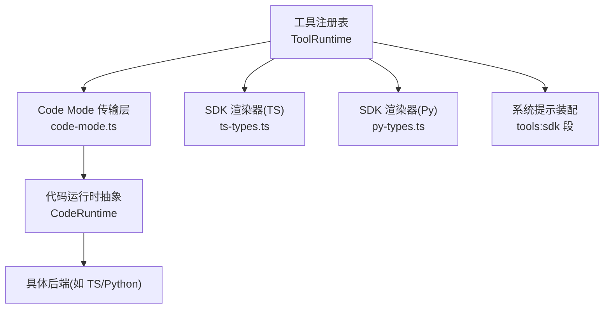
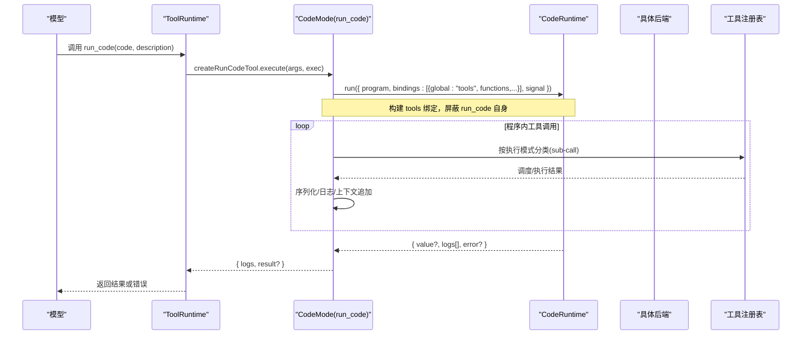
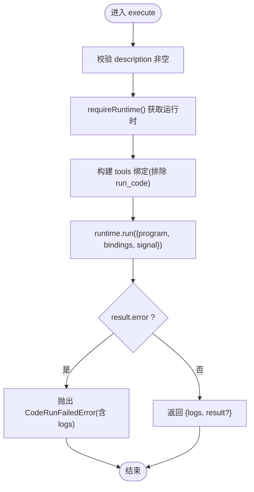
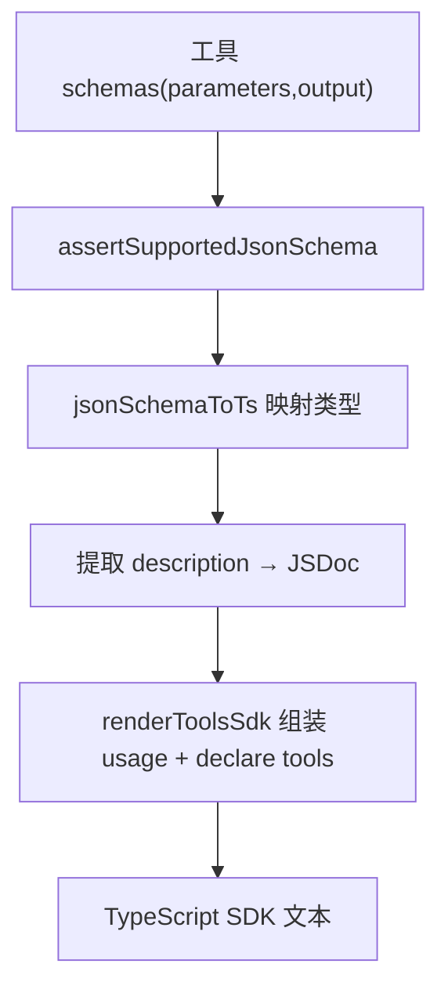
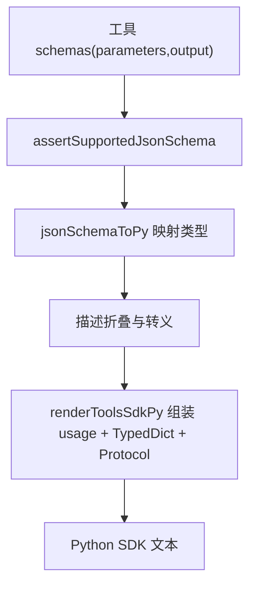
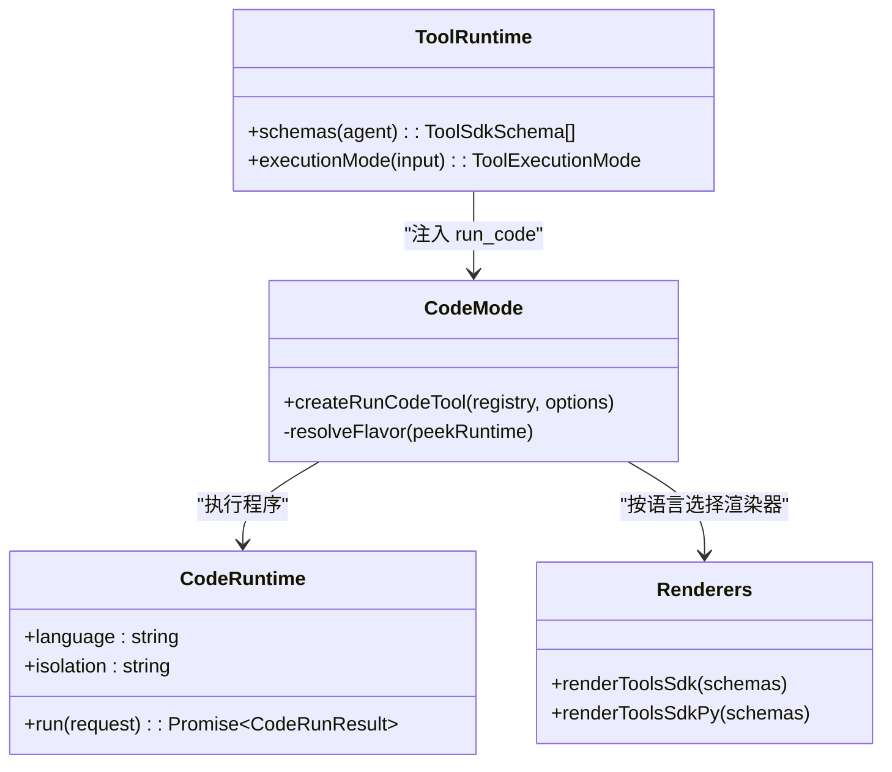
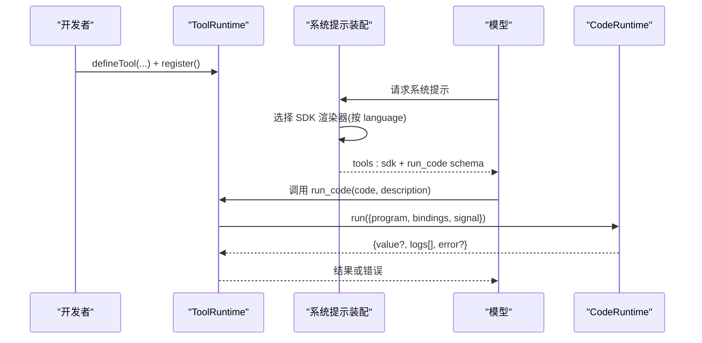
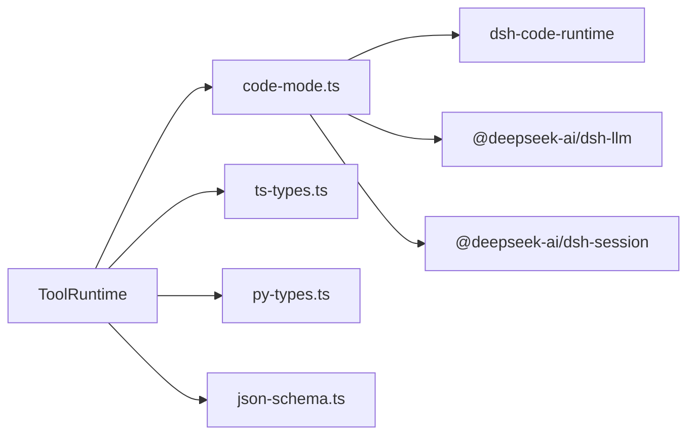

# 代码模式与SDK集成

<cite>
**本文引用的文件**
- [packages/core/tools/src/code-mode.ts](file://packages/core/tools/src/code-mode.ts)
- [packages/core/tools/src/index.ts](file://packages/core/tools/src/index.ts)
- [packages/core/tools/src/ts-types.ts](file://packages/core/tools/src/ts-types.ts)
- [packages/core/tools/src/py-types.ts](file://packages/core/tools/src/py-types.ts)
- [packages/code-runtime/code-runtime/src/index.ts](file://packages/code-runtime/code-runtime/src/index.ts)
- [packages/code-runtime/code-runtime/src/types.ts](file://packages/code-runtime/code-runtime/src/types.ts)
- [docs/subsystems/code-runtime.md](file://docs/subsystems/code-runtime.md)
- [packages/core/tools/tests/code-mode.spec.ts](file://packages/core/tools/tests/code-mode.spec.ts)
- [packages/core/tools/tests/py-types.spec.ts](file://packages/core/tools/tests/py-types.spec.ts)
</cite>

## 目录
1. [简介](#简介)
2. [项目结构](#项目结构)
3. [核心组件](#核心组件)
4. [架构总览](#架构总览)
5. [详细组件分析](#详细组件分析)
6. [依赖关系分析](#依赖关系分析)
7. [性能考虑](#性能考虑)
8. [故障排查指南](#故障排查指南)
9. [结论](#结论)
10. [附录](#附录)

## 简介
本文件系统性阐述“代码模式”与多语言 SDK 集成的工作机制，重点解释：
- run_code 工具如何作为模型侧的“程序执行入口”，在运行时将模型编写的程序（TypeScript/Python）注入宿主能力并安全执行。
- SDK 自动生成机制：基于工具注册表的 JSON Schema，生成 TypeScript 与 Python SDK 的类型定义、函数签名与文档注释，确保类型提示与运行语义一致。
- 多语言支持：通过 CodeRuntime.language 进行语言分发，使同一工具集在不同运行时下呈现匹配的 SDK 与 schema 描述。
- 开发工作流：从工具定义到 SDK 生成的端到端流程，以及调试技巧与性能优化建议。

## 项目结构
围绕代码模式与 SDK 生成的关键目录与职责：
- packages/core/tools：工具注册表、执行管线、Code Mode 传输层（run_code）、SDK 渲染器（TS/Py）。
- packages/code-runtime：代码执行 seam 抽象与类型契约，提供 language/isolation 描述与 run(request) 接口。
- docs/subsystems/code-runtime.md：对 code runtime 的官方说明与契约。
- tests：覆盖 run_code 调度、SDK 渲染输出等关键行为。

图表来源
- [packages/core/tools/src/index.ts:60-63](file://packages/core/tools/src/index.ts#L60-L63)
- [packages/core/tools/src/code-mode.ts:296-330](file://packages/core/tools/src/code-mode.ts#L296-L330)
- [packages/code-runtime/code-runtime/src/index.ts:102-135](file://packages/code-runtime/code-runtime/src/index.ts#L102-L135)

章节来源
- [packages/core/tools/src/index.ts:1-120](file://packages/core/tools/src/index.ts#L1-L120)
- [packages/core/tools/src/code-mode.ts:1-120](file://packages/core/tools/src/code-mode.ts#L1-L120)
- [packages/code-runtime/code-runtime/src/index.ts:1-138](file://packages/code-runtime/code-runtime/src/index.ts#L1-L138)

## 核心组件
- ToolRuntime（工具运行时与注册表）：维护工具定义、可见性、执行管线；在 code/both 模式下注入 run_code 与 tools:sdk 段。
- CodeMode 传输层（run_code）：将模型提供的程序源码通过 CodeRuntime.run 执行，构建 tools 绑定，编排子调用并发与顺序。
- CodeRuntime（代码执行 seam）：抽象语言与隔离方式，统一 run(request) 契约，承载 bindings 与结果。
- SDK 渲染器：
  - ts-types.ts：将工具参数/输出 Schema 渲染为 TypeScript 类型声明与 usage 指令。
  - py-types.ts：将工具参数/输出 Schema 渲染为 Python TypedDict/Protocol 与 usage 指令。
- 语言分发：index.ts 中的 SDK_RENDERERS 与 code-mode.ts 中的 RUN_CODE_FLAVORS 共同保证“运行时语言 ↔ SDK 文本 ↔ run_code schema 描述”三者一致。

章节来源
- [packages/core/tools/src/index.ts:60-63](file://packages/core/tools/src/index.ts#L60-L63)
- [packages/core/tools/src/code-mode.ts:82-132](file://packages/core/tools/src/code-mode.ts#L82-L132)
- [packages/core/tools/src/ts-types.ts:249-293](file://packages/core/tools/src/ts-types.ts#L249-L293)
- [packages/core/tools/src/py-types.ts:733-800](file://packages/core/tools/src/py-types.ts#L733-L800)
- [packages/code-runtime/code-runtime/src/index.ts:102-135](file://packages/code-runtime/code-runtime/src/index.ts#L102-L135)

## 架构总览
下图展示一次 run_code 调用的完整链路：模型通过 run_code 提交程序，系统在工具视图内构造 tools 绑定，交由 CodeRuntime 执行，并在执行过程中将子工具调用纳入调度与日志记录。

图表来源
- [packages/core/tools/src/code-mode.ts:296-330](file://packages/core/tools/src/code-mode.ts#L296-L330)
- [packages/core/tools/src/code-mode.ts:466-630](file://packages/core/tools/src/code-mode.ts#L466-L630)
- [packages/code-runtime/code-runtime/src/index.ts:125-135](file://packages/code-runtime/code-runtime/src/index.ts#L125-L135)

## 详细组件分析

### run_code 工具的工作原理
- 工具定义与参数：固定两个必填参数 code 与 description；description 用于 UI 标题与可观测性。
- 语言感知：description 与 code 参数描述通过 resolveFlavor 根据当前 CodeRuntime.language 动态选择 TS/Python 文案，避免模型看到不匹配的语言指令。
- 执行与绑定：
  - 构造 tools 命名空间，枚举当前 agent 可见的工具（排除 run_code），以 null-prototype 对象暴露，防止原型污染。
  - 每个工具调用封装为 CodeBindingFunction，进入注册表的调度器，遵循 native 模式的并发与顺序约束（parallel/exclusive）。
  - 子调用结果被序列化为 lossless JSON，失败时包装为 ToolCallError 并携带 toolName。
- 生命周期与清理：
  - 使用 AbortController 管理单次 run 的生命周期，外部信号触发时中止所有 in-flight 子调用。
  - 有序 commit 队列保证 post-execute 与 context deferral 的顺序一致性。
  - 最终 drain 所有 logWork 任务，确保事件写入在 turn 结束前完成。

图表来源
- [packages/core/tools/src/code-mode.ts:330-345](file://packages/core/tools/src/code-mode.ts#L330-L345)
- [packages/core/tools/src/code-mode.ts:466-630](file://packages/core/tools/src/code-mode.ts#L466-L630)
- [packages/core/tools/src/code-mode.ts:639-649](file://packages/core/tools/src/code-mode.ts#L639-L649)

章节来源
- [packages/core/tools/src/code-mode.ts:296-330](file://packages/core/tools/src/code-mode.ts#L296-L330)
- [packages/core/tools/src/code-mode.ts:330-649](file://packages/core/tools/src/code-mode.ts#L330-L649)

### SDK 生成机制（TypeScript）
- 输入：工具注册表的 schemas（包含 parameters 与 output 的 JSON Schema）。
- 类型推导：jsonSchemaToTs 将受支持的 JSON Schema 节点映射为 TS 类型字面量（string/number/integer/boolean/null/array/object/oneOf），不支持或畸形降级为 unknown。
- 文档提取：schema.description 折叠为一行 JSDoc，转义注释闭合符，避免破坏生成代码。
- 输出：renderToolsSdk 生成 usage 指令与 declare const tools 接口，键名按合法标识符直出，否则以 quoted key 访问，保证任意名称可达。
- 确定性：按工具名排序，保证相同工具集产生字节级稳定输出。

图表来源
- [packages/core/tools/src/ts-types.ts:240-247](file://packages/core/tools/src/ts-types.ts#L240-L247)
- [packages/core/tools/src/ts-types.ts:249-293](file://packages/core/tools/src/ts-types.ts#L249-L293)

章节来源
- [packages/core/tools/src/ts-types.ts:1-294](file://packages/core/tools/src/ts-types.ts#L1-L294)

### SDK 生成机制（Python）
- 输入：同上。
- 类型推导：jsonSchemaToPy 将 JSON Schema 映射为 Python 类型表达式（str/int/float/bool/None/list[...]/TypedDict/Union），不支持或畸形降级为 Any。
- 文档提取：description 折叠并转义控制字符与孤立代理对，生成 docstring 或字段注释。
- 输出：renderToolsSdkPy 生成 usage 指令、TypedDict 类、Tools Protocol 与 async 方法；exotic/reserved/下划线前缀工具名通过 subscript 访问。
- 限制与健壮性：
  - list 嵌套深度上限（MAX_LIST_NESTING=180）以避免 CPython 语法限制。
  - 类名基长上限（MAX_CLASS_NAME_BASE=120）+ 冲突后缀分配，保持线性复杂度。
  - 严格标识符判定（XID_Start/XID_Continue + NFKC 稳定性），避免跨版本解析差异。

图表来源
- [packages/core/tools/src/py-types.ts:726-731](file://packages/core/tools/src/py-types.ts#L726-L731)
- [packages/core/tools/src/py-types.ts:733-800](file://packages/core/tools/src/py-types.ts#L733-L800)

章节来源
- [packages/core/tools/src/py-types.ts:1-819](file://packages/core/tools/src/py-types.ts#L1-L819)

### 多语言支持与语言分发
- 运行时语言：CodeRuntime.language 指示程序源语言（已知值 'typescript' | 'python'）。
- 两张并行表：
  - SDK_RENDERERS（index.ts）：语言 → SDK 渲染器（renderToolsSdk / renderToolsSdkPy）。
  - RUN_CODE_FLAVORS（code-mode.ts）：语言 → run_code 的 description 与 code 参数描述。
- 一致性保障：
  - 无运行时挂载时，schema 读取退化至 TS flavor（仅用于文档采集等非模型路径）。
  - 已挂载但未知语言会抛错，避免生成错误语言的 SDK。
  - 新增语言需同步更新 CodeSdkLanguage、两张表与对应渲染器，编译期即可发现遗漏。

图表来源
- [packages/core/tools/src/index.ts:60-63](file://packages/core/tools/src/index.ts#L60-L63)
- [packages/core/tools/src/code-mode.ts:82-132](file://packages/core/tools/src/code-mode.ts#L82-L132)
- [packages/code-runtime/code-runtime/src/index.ts:102-135](file://packages/code-runtime/code-runtime/src/index.ts#L102-L135)

章节来源
- [packages/core/tools/src/index.ts:30-63](file://packages/core/tools/src/index.ts#L30-L63)
- [packages/core/tools/src/code-mode.ts:82-132](file://packages/core/tools/src/code-mode.ts#L82-L132)
- [docs/subsystems/code-runtime.md:1-192](file://docs/subsystems/code-runtime.md#L1-L192)

### 在代码模式下调用工具（SDK 导入、调用与错误处理）
- 导入 SDK：在 code/both 模式下，系统提示会附带 tools:sdk 段，模型据此生成/补全代码。
- 调用方式：
  - TypeScript：await tools.name(args)，exotic 名称用 tools["name"](args)。
  - Python：await tools.name(args)，exotic/reserved/下划线前缀用 tools["name"](args)。
- 错误处理：
  - 工具调用失败抛出 ToolCallError（TS）或 ToolCallError（Py），包含 toolName 与可读 message，应 try/catch 继续。
  - run_code 整体失败会返回结构化 isError 结果，包含错误 kind 与捕获的 logs，便于模型自我修正。

章节来源
- [packages/core/tools/src/ts-types.ts:249-293](file://packages/core/tools/src/ts-types.ts#L249-L293)
- [packages/core/tools/src/py-types.ts:733-800](file://packages/core/tools/src/py-types.ts#L733-L800)
- [packages/core/tools/tests/code-mode.spec.ts:1276-1308](file://packages/core/tools/tests/code-mode.spec.ts#L1276-L1308)

### 端到端开发工作流（从工具定义到 SDK 生成）
- 步骤概览：
  1) 使用 defineTool 定义工具，声明 parameters/output 的 JSON Schema 与 description。
  2) 注册到 ToolRuntime，配置 mode（native/code/both）。
  3) 在 code/both 模式下，系统提示装配阶段：
     - 根据 CodeRuntime.language 选择 SDK 渲染器。
     - 生成 tools:sdk 段（TS/Py），包含 usage 指令与类型声明。
     - 注入 run_code 工具，其 description/code 描述随语言切换。
  4) 模型侧依据 SDK 编写程序，调用 tools.* 完成复杂任务。
  5) 运行时通过 CodeRuntime 执行，子调用经注册表调度，结果回传。

图表来源
- [packages/core/tools/src/index.ts:60-63](file://packages/core/tools/src/index.ts#L60-L63)
- [packages/core/tools/src/code-mode.ts:296-330](file://packages/core/tools/src/code-mode.ts#L296-L330)
- [packages/code-runtime/code-runtime/src/index.ts:125-135](file://packages/code-runtime/code-runtime/src/index.ts#L125-L135)

## 依赖关系分析
- ToolRuntime 依赖：
  - code-mode.ts：注入 run_code 工具与 tools:sdk 段。
  - ts-types.ts/py-types.ts：按语言渲染 SDK。
  - json-schema.ts：统一 Schema 校验与转换。
  - dsh-code-runtime：抽象执行后端。
- 耦合与内聚：
  - 语言分发集中在 index.ts 与 code-mode.ts，新增语言只需扩展两张表与渲染器。
  - SDK 渲染器与 run_code 描述解耦于具体后端，仅依赖 CodeRuntime.language。
- 外部依赖：
  - 会话与 LLM 包用于内容块、消息与 CallId。
  - Scope 与 Agent 用于可见性与上下文传播。

图表来源
- [packages/core/tools/src/index.ts:1-30](file://packages/core/tools/src/index.ts#L1-L30)
- [packages/core/tools/src/code-mode.ts:9-17](file://packages/core/tools/src/code-mode.ts#L9-L17)

章节来源
- [packages/core/tools/src/index.ts:1-120](file://packages/core/tools/src/index.ts#L1-L120)
- [packages/core/tools/src/code-mode.ts:1-30](file://packages/core/tools/src/code-mode.ts#L1-L30)

## 性能考虑
- 并发与顺序：
  - run_code 内部维护 pendingQueue/commitQueue/inFlight，按 parallel/exclusive 分类，遵守提交顺序与独占屏障。
  - maxParallelSubCalls 控制最大并发子调用数，默认 10，可通过配置调整。
- 输出与内存：
  - JSON 渲染采用迭代栈与缩进上限，避免递归与无限缩进增长。
  - Python SDK 中 list 嵌套深度限制（180）与类名长度限制（120）防止生成不可解析或过长的代码。
- KV 缓存友好：
  - tools:sdk 与 run_code schema 在工具集与语言不变时前缀稳定，利于缓存命中。

章节来源
- [packages/core/tools/src/code-mode.ts:344-459](file://packages/core/tools/src/code-mode.ts#L344-L459)
- [packages/core/tools/src/py-types.ts:287-342](file://packages/core/tools/src/py-types.ts#L287-L342)
- [packages/core/tools/src/py-types.ts:290-329](file://packages/core/tools/src/py-types.ts#L290-L329)

## 故障排查指南
- 未挂载运行时：
  - 现象：调用 run_code 返回结构化错误，提示需要代码运行时。
  - 定位：检查 ToolRuntime 配置与插件装配是否加载了 codeRuntime。
- 未知语言：
  - 现象：抛错指出未注册的 run_code schema flavor。
  - 定位：确认 CodeRuntime.language 是否在 RUN_CODE_FLAVORS 与 SDK_RENDERERS 中登记。
- 工具参数非法：
  - 现象：抛出 ToolOutputError 或参数校验错误。
  - 定位：检查 defineTool 的 parameters/output 是否符合受支持的 JSON Schema。
- 程序异常/超时/中止：
  - 现象：CodeRunFailedError，包含错误 kind 与 logs。
  - 定位：查看 captured logs 与错误 kind（exception/timeout/abort/worker-exit/invalid-output/output-limit）。

章节来源
- [packages/core/tools/tests/code-mode.spec.ts:1276-1308](file://packages/core/tools/tests/code-mode.spec.ts#L1276-L1308)
- [packages/core/tools/src/code-mode.ts:134-146](file://packages/core/tools/src/code-mode.ts#L134-L146)
- [packages/core/tools/src/code-mode.ts:639-649](file://packages/core/tools/src/code-mode.ts#L639-L649)

## 结论
代码模式通过 run_code 将模型编写的程序与宿主能力安全桥接，并以语言感知的 SDK 生成机制提供强类型提示与 IDE 支持。通过统一的 CodeRuntime 抽象与语言分发表，系统可在 TypeScript 与 Python 之间无缝切换，同时保持 schema、SDK 与使用说明的一致性。配合严格的并发调度、输出限制与错误分类，既保证了可靠性，也提供了良好的调试体验。

## 附录
- 最佳实践
  - 明确工具 description，有助于生成更准确的 SDK 文档与模型理解。
  - 合理设置 maxParallelSubCalls，平衡吞吐与资源占用。
  - 在 code 模式下，尽量只 return/print 必要信息，减少对话噪声。
- 调试技巧
  - 关注 run_code 返回的 logs 与错误 kind，快速定位问题根因。
  - 使用测试用例验证 SDK 渲染输出与行为（参考 tests/py-types.spec.ts 与 tests/code-mode.spec.ts）。