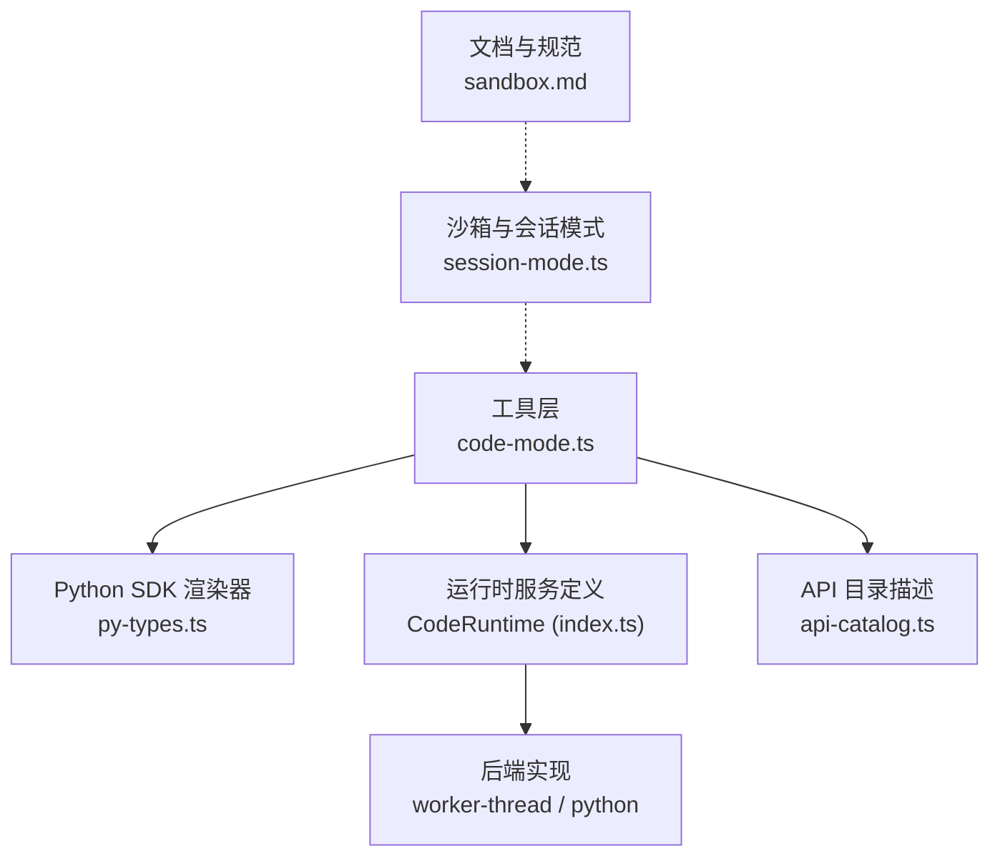
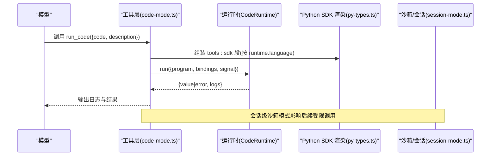
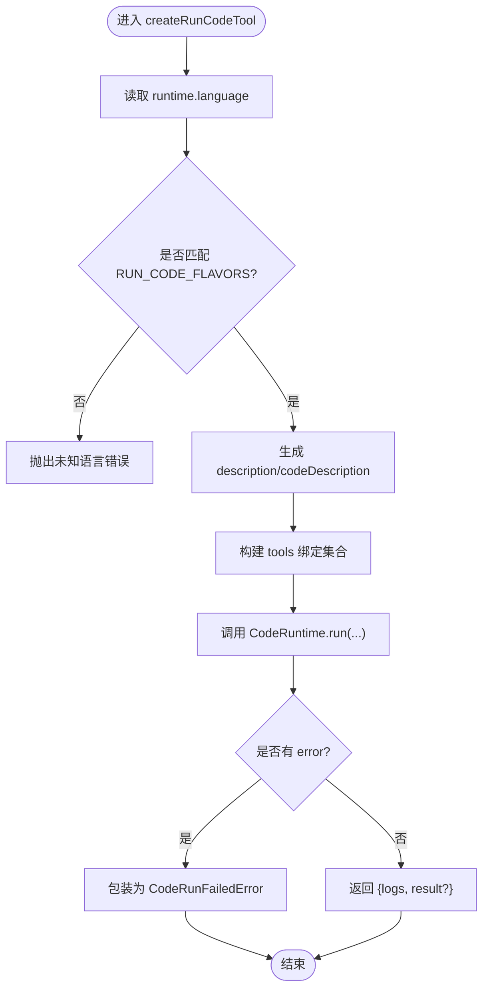
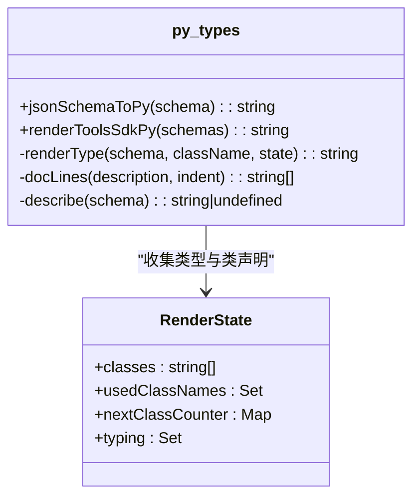
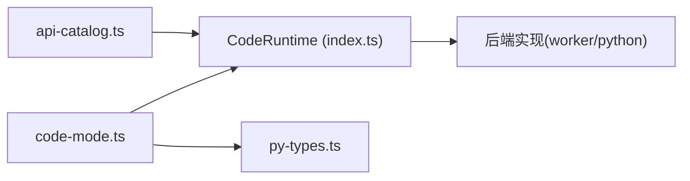

# 多语言运行时支持

<cite>
**本文引用的文件**
- [packages/core/tools/src/code-mode.ts](file://packages/core/tools/src/code-mode.ts)
- [packages/core/tools/src/py-types.ts](file://packages/core/tools/src/py-types.ts)
- [packages/code-runtime/code-runtime/src/index.ts](file://packages/code-runtime/code-runtime/src/index.ts)
- [packages/code-runtime/code-runtime/README.md](file://packages/code-runtime/code-runtime/README.md)
- [packages/extensions/tool-cordis/src/api-catalog.ts](file://packages/extensions/tool-cordis/src/api-catalog.ts)
- [.agents/notes/implemented/feature/2026-07-31-code-mode-language-dispatch.md](file://.agents/notes/implemented/feature/2026-07-31-code-mode-language-dispatch.md)
- [packages/sandbox/sandbox-policy/src/session-mode.ts](file://packages/sandbox/sandbox-policy/src/session-mode.ts)
- [docs/subsystems/sandbox.md](file://docs/subsystems/sandbox.md)
- [packages/core/tools/tests/code-mode.spec.ts](file://packages/core/tools/tests/code-mode.spec.ts)
</cite>

## 目录
1. [简介](#简介)
2. [项目结构](#项目结构)
3. [核心组件](#核心组件)
4. [架构总览](#架构总览)
5. [详细组件分析](#详细组件分析)
6. [依赖关系分析](#依赖关系分析)
7. [性能考虑](#性能考虑)
8. [故障排查指南](#故障排查指南)
9. [结论](#结论)
10. [附录](#附录)

## 简介
本文件系统性说明仓库中“多语言运行时支持”的设计与实现，覆盖 TypeScript 与 Python 运行时的集成方式、面向模型的 run_code 工具描述与参数说明的生成逻辑、运行时环境隔离与资源管理、错误处理机制，以及如何扩展新语言（注册运行时、开发 SDK 适配器）。同时提供不同语言的执行环境配置示例与最佳实践、性能优化建议与调试技巧。

## 项目结构
围绕多语言运行时，关键代码分布在以下模块：
- 工具层与模型侧呈现：packages/core/tools/src/code-mode.ts、packages/core/tools/src/py-types.ts
- 运行时服务定义与类型契约：packages/code-runtime/code-runtime/src/index.ts、packages/code-runtime/code-runtime/README.md
- 运行时能力对外暴露的描述：packages/extensions/tool-cordis/src/api-catalog.ts
- 语言分发设计说明：.agents/notes/implemented/feature/2026-07-31-code-mode-language-dispatch.md
- 沙箱与会话模式：packages/sandbox/sandbox-policy/src/session-mode.ts、docs/subsystems/sandbox.md
- 行为验证测试：packages/core/tools/tests/code-mode.spec.ts

图表来源
- [packages/core/tools/src/code-mode.ts:1-120](file://packages/core/tools/src/code-mode.ts#L1-L120)
- [packages/core/tools/src/py-types.ts:733-819](file://packages/core/tools/src/py-types.ts#L733-L819)
- [packages/code-runtime/code-runtime/src/index.ts:95-135](file://packages/code-runtime/code-runtime/src/index.ts#L95-L135)
- [packages/extensions/tool-cordis/src/api-catalog.ts:501-515](file://packages/extensions/tool-cordis/src/api-catalog.ts#L501-L515)
- [packages/sandbox/sandbox-policy/src/session-mode.ts:44-71](file://packages/sandbox/sandbox-policy/src/session-mode.ts#L44-L71)
- [docs/subsystems/sandbox.md:23-39](file://docs/subsystems/sandbox.md#L23-L39)

章节来源
- [packages/core/tools/src/code-mode.ts:1-120](file://packages/core/tools/src/code-mode.ts#L1-L120)
- [packages/code-runtime/code-runtime/README.md:1-39](file://packages/code-runtime/code-runtime/README.md#L1-L39)

## 核心组件
- CodeRuntime 服务定义：抽象出“运行一段程序 + 绑定宿主异步函数 + 返回结果/日志/错误”的能力，并声明 language 与 isolation 两个只读描述字段，供上层按语言选择呈现。
- code-mode 工具：在“代码模式”下向模型暴露 run_code 工具；其 description 与 code 参数描述会基于当前挂载的 CodeRuntime.language 动态切换为 TypeScript 或 Python 风格。
- Python SDK 渲染器：将统一工具 JSON Schema 投影为 Python TypedDict/Protocol 等静态提示文本，确保模型看到的 SDK 与传输 schema 一致。
- API 目录：对外描述 CodeRuntime 的 language/isolation/run 语义，明确已知值与约束。
- 沙箱与会话模式：提供会话级沙箱模式切换与执行边界信息，辅助隔离策略。

章节来源
- [packages/code-runtime/code-runtime/src/index.ts:95-135](file://packages/code-runtime/code-runtime/src/index.ts#L95-L135)
- [packages/core/tools/src/code-mode.ts:25-132](file://packages/core/tools/src/code-mode.ts#L25-L132)
- [packages/core/tools/src/py-types.ts:733-819](file://packages/core/tools/src/py-types.ts#L733-L819)
- [packages/extensions/tool-cordis/src/api-catalog.ts:501-515](file://packages/extensions/tool-cordis/src/api-catalog.ts#L501-L515)
- [packages/sandbox/sandbox-policy/src/session-mode.ts:44-71](file://packages/sandbox/sandbox-policy/src/session-mode.ts#L44-L71)

## 架构总览
下图展示了从模型调用 run_code 到具体语言运行时执行的完整链路，以及语言相关的 SDK 文本生成与呈现。

图表来源
- [packages/core/tools/src/code-mode.ts:296-682](file://packages/core/tools/src/code-mode.ts#L296-L682)
- [packages/core/tools/src/py-types.ts:733-819](file://packages/core/tools/src/py-types.ts#L733-L819)
- [packages/code-runtime/code-runtime/src/index.ts:102-135](file://packages/code-runtime/code-runtime/src/index.ts#L102-L135)
- [packages/sandbox/sandbox-policy/src/session-mode.ts:44-71](file://packages/sandbox/sandbox-policy/src/session-mode.ts#L44-L71)

## 详细组件分析

### run_code 工具与语言风味分发
- 语言风味表：维护 TypeScript 与 Python 两套面向模型的 description 与 code 参数描述，保证 SDK 与传输 schema 一致。
- 惰性解析：在 schema 发射时读取已挂载的 CodeRuntime.language，若未挂载则回退到 TypeScript 风味；未知语言直接报错，避免发出错误语言的 SDK。
- 工具执行：将可见工具以绑定形式注入程序，内部调度遵循提交顺序与并发上限，支持独占/并行分类，并在异常/超时时正确中止与清理。

图表来源
- [packages/core/tools/src/code-mode.ts:25-132](file://packages/core/tools/src/code-mode.ts#L25-L132)
- [packages/core/tools/src/code-mode.ts:296-682](file://packages/core/tools/src/code-mode.ts#L296-L682)

章节来源
- [packages/core/tools/src/code-mode.ts:25-132](file://packages/core/tools/src/code-mode.ts#L25-L132)
- [packages/core/tools/src/code-mode.ts:296-682](file://packages/core/tools/src/code-mode.ts#L296-L682)
- [packages/core/tools/tests/code-mode.spec.ts:127-136](file://packages/core/tools/tests/code-mode.spec.ts#L127-L136)
- [packages/core/tools/tests/code-mode.spec.ts:395-421](file://packages/core/tools/tests/code-mode.spec.ts#L395-L421)

### Python SDK 渲染器（tools:sdk）
- 目标：将统一工具 JSON Schema 投影为 Python 风格的静态类型与使用指引，使模型在 Python 运行时下看到一致的编程接口。
- 关键点：
  - 名称合法性与保留字处理：非标识符/保留字走下标访问路径，保证所有工具均可达。
  - 深度嵌套列表限制：超过解释器语法限制时降级为 Any，保持 SDK 可解析。
  - 确定性输出：按工具名排序，类声明先于协议，便于缓存友好。
  - 使用指引：强调 args 为 dict/list 值而非构造对象，失败通过 ToolCallError 捕获。

图表来源
- [packages/core/tools/src/py-types.ts:140-152](file://packages/core/tools/src/py-types.ts#L140-L152)
- [packages/core/tools/src/py-types.ts:480-712](file://packages/core/tools/src/py-types.ts#L480-L712)
- [packages/core/tools/src/py-types.ts:733-819](file://packages/core/tools/src/py-types.ts#L733-L819)

章节来源
- [packages/core/tools/src/py-types.ts:140-152](file://packages/core/tools/src/py-types.ts#L140-L152)
- [packages/core/tools/src/py-types.ts:480-712](file://packages/core/tools/src/py-types.ts#L480-L712)
- [packages/core/tools/src/py-types.ts:733-819](file://packages/core/tools/src/py-types.ts#L733-L819)

### CodeRuntime 服务定义与语言/隔离描述
- language：源码语言标识（如 'typescript'、'python'），用于上层生成语言特定的呈现。
- isolation：执行基座标识（如 'worker-thread'、'process'、'container'），用于部署与诊断区分后端。
- run：执行一次程序，返回 value/logs/error；错误作为结果字段返回，拒绝仅发生在服务契约误用时。

章节来源
- [packages/code-runtime/code-runtime/src/index.ts:95-135](file://packages/code-runtime/code-runtime/src/index.ts#L95-L135)
- [packages/code-runtime/code-runtime/README.md:1-39](file://packages/code-runtime/code-runtime/README.md#L1-L39)
- [packages/extensions/tool-cordis/src/api-catalog.ts:501-515](file://packages/extensions/tool-cordis/src/api-catalog.ts#L501-L515)

### 沙箱与会话模式（执行环境隔离）
- 会话级沙箱模式可通过事件流设置与回放，决定后续受限调用（bash/fs 等）的执行边界。
- enforcement 完整性：full/partial 表示后端对文件影响的治理能力，调用方需据此决定是否接受。

章节来源
- [packages/sandbox/sandbox-policy/src/session-mode.ts:44-71](file://packages/sandbox/sandbox-policy/src/session-mode.ts#L44-L71)
- [docs/subsystems/sandbox.md:23-39](file://docs/subsystems/sandbox.md#L23-L39)

## 依赖关系分析
- code-mode.ts 依赖 CodeRuntime 服务定义与 Python SDK 渲染器，负责语言风味选择与工具绑定、调度与结果封装。
- py-types.ts 独立于具体后端，仅消费统一 JSON Schema，产出 Python 风格 SDK 文本。
- CodeRuntime 抽象了执行细节，允许 worker-thread/process/container 等多种后端接入。
- api-catalog.ts 对外描述 CodeRuntime 的语义与已知值，帮助消费者理解能力边界。

图表来源
- [packages/core/tools/src/code-mode.ts:1-120](file://packages/core/tools/src/code-mode.ts#L1-L120)
- [packages/code-runtime/code-runtime/src/index.ts:95-135](file://packages/code-runtime/code-runtime/src/index.ts#L95-L135)
- [packages/core/tools/src/py-types.ts:733-819](file://packages/core/tools/src/py-types.ts#L733-L819)
- [packages/extensions/tool-cordis/src/api-catalog.ts:501-515](file://packages/extensions/tool-cordis/src/api-catalog.ts#L501-L515)

章节来源
- [packages/core/tools/src/code-mode.ts:1-120](file://packages/core/tools/src/code-mode.ts#L1-L120)
- [packages/code-runtime/code-runtime/src/index.ts:95-135](file://packages/code-runtime/code-runtime/src/index.ts#L95-L135)
- [packages/core/tools/src/py-types.ts:733-819](file://packages/core/tools/src/py-types.ts#L733-L819)
- [packages/extensions/tool-cordis/src/api-catalog.ts:501-515](file://packages/extensions/tool-cordis/src/api-catalog.ts#L501-L515)

## 性能考虑
- 并发控制：run_code 内部维护有序驱动队列与并发上限，独占调用串行化，并行调用受 maxParallel 限制，避免无界增长。
- 序列化与展示：JSON 渲染采用迭代栈与缩进上限，避免深层结构的内存与展示膨胀。
- SDK 文本稳定性：工具按字典序输出，类声明先于协议，利于缓存命中与增量更新。
- 列表嵌套限制：Python 渲染对 list[...] 深度做硬限制，防止解释器语法错误导致 SDK 不可解析。

[本节为通用指导，不直接分析具体文件]

## 故障排查指南
- 未知语言：当运行时 language 不在风味表中，会在 schema 发射阶段抛出错误，避免发出错误语言的 SDK。
- 工具参数校验：run_code 要求 description 非空，否则拒绝；工具参数必须可无损序列化为 JSON。
- 执行失败：程序异常、预算过期、中止或后端死亡会被包装为结构化错误，包含日志片段，便于模型自修复。
- 沙箱模式：检查会话沙箱模式事件，确认受限调用是否在预期模式下执行。

章节来源
- [packages/core/tools/src/code-mode.ts:25-132](file://packages/core/tools/src/code-mode.ts#L25-L132)
- [packages/core/tools/src/code-mode.ts:296-682](file://packages/core/tools/src/code-mode.ts#L296-L682)
- [packages/sandbox/sandbox-policy/src/session-mode.ts:44-71](file://packages/sandbox/sandbox-policy/src/session-mode.ts#L44-L71)

## 结论
该方案通过“服务定义 + 工具层 + 渲染器”的分层设计，实现了 TypeScript 与 Python 的多语言运行时支持。工具层根据运行时语言动态生成模型可见的 run_code 描述与 SDK 文本，运行时抽象屏蔽后端差异，沙箱与会话模式保障执行边界。新增语言只需补充风味表、SDK 渲染器与后端实现，即可无缝接入。

[本节为总结性内容，不直接分析具体文件]

## 附录

### 如何添加新的编程语言支持
- 在服务定义中登记新语言标识（language），并确保后端实现遵守隔离与错误语义。
- 在工具层的风味表与 SDK 渲染器中添加新语言条目，保证 model-facing 描述与 SDK 指令一致。
- 在 API 目录中更新已知语言与隔离值，以便消费者识别。
- 编写测试用例验证 run_code 描述、SDK 文本与执行流程。

章节来源
- [packages/code-runtime/code-runtime/src/index.ts:95-135](file://packages/code-runtime/code-runtime/src/index.ts#L95-L135)
- [packages/core/tools/src/code-mode.ts:25-132](file://packages/core/tools/src/code-mode.ts#L25-L132)
- [packages/core/tools/src/py-types.ts:733-819](file://packages/core/tools/src/py-types.ts#L733-L819)
- [packages/extensions/tool-cordis/src/api-catalog.ts:501-515](file://packages/extensions/tool-cordis/src/api-catalog.ts#L501-L515)

### 不同语言的执行环境配置示例与最佳实践
- TypeScript 运行时：
  - 使用 worker-thread 隔离，适合快速启动与轻量任务。
  - 合理设置 maxParallel 与超时，避免资源争用。
- Python 运行时：
  - 注意 list[...] 嵌套深度限制，必要时拆分数据结构。
  - 使用 print 与 return 组合输出，图片结果会自动附加以便后续步骤查看。
- 沙箱模式：
  - 在需要强隔离的场景启用 full 模式，并关注 enforcement 是否为 full。
  - 通过会话事件记录与回放确认模式切换生效。

章节来源
- [packages/code-runtime/code-runtime/README.md:1-39](file://packages/code-runtime/code-runtime/README.md#L1-L39)
- [packages/core/tools/src/py-types.ts:733-819](file://packages/core/tools/src/py-types.ts#L733-L819)
- [docs/subsystems/sandbox.md:23-39](file://docs/subsystems/sandbox.md#L23-L39)

### 调试技巧
- 观察 run_code 的工具描述与 code 参数描述是否与所选语言一致。
- 检查工具参数是否能被无损序列化为 JSON，避免隐藏对象导致失败。
- 利用结构化错误中的 kind 与日志片段定位问题根因。
- 通过会话沙箱模式事件确认受限调用的执行边界是否符合预期。

章节来源
- [packages/core/tools/tests/code-mode.spec.ts:395-421](file://packages/core/tools/tests/code-mode.spec.ts#L395-L421)
- [packages/core/tools/src/code-mode.ts:296-682](file://packages/core/tools/src/code-mode.ts#L296-L682)
- [packages/sandbox/sandbox-policy/src/session-mode.ts:44-71](file://packages/sandbox/sandbox-policy/src/session-mode.ts#L44-L71)