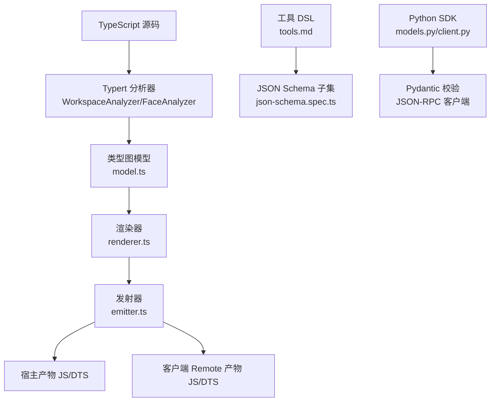
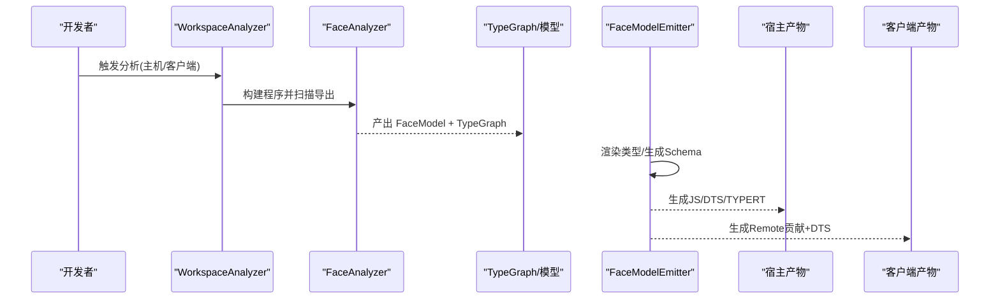
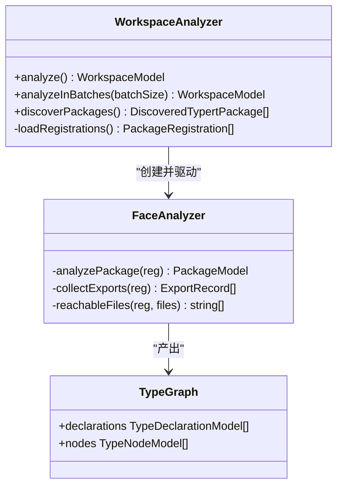
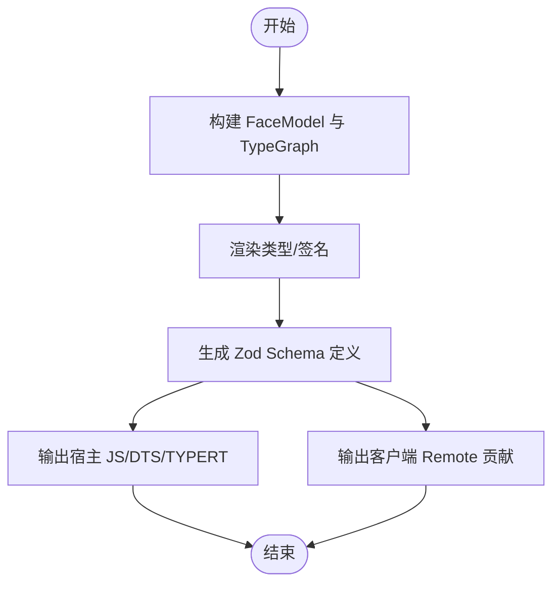
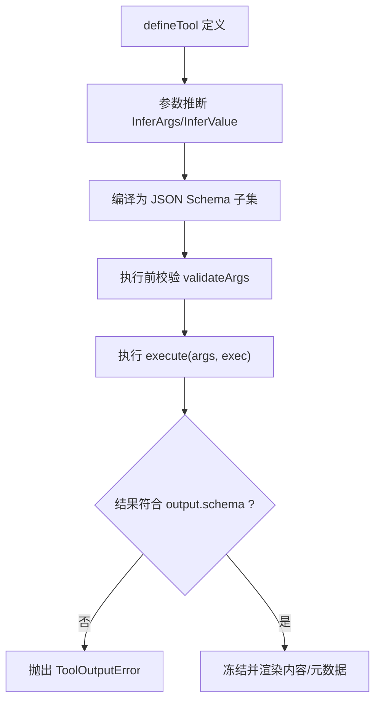
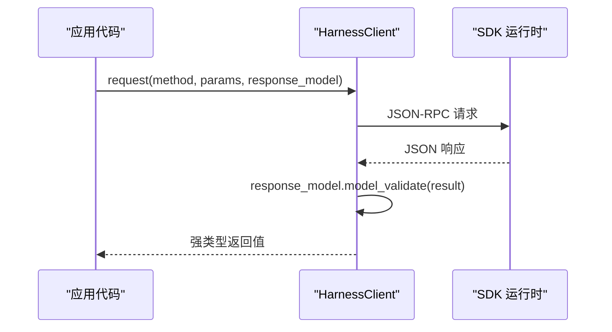
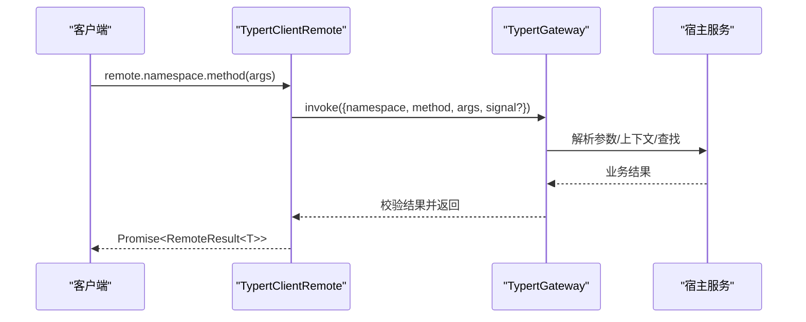
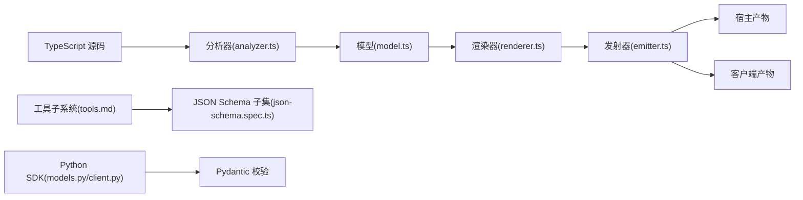

# 类型安全特性

<cite>
**本文引用的文件**
- [packages/typert/generator/src/model.ts](file://packages/typert/generator/src/model.ts)
- [packages/typert/generator/src/analyzer.ts](file://packages/typert/generator/src/analyzer.ts)
- [packages/typert/generator/src/emitter.ts](file://packages/typert/generator/src/emitter.ts)
- [packages/typert/generator/src/renderer.ts](file://packages/typert/generator/src/renderer.ts)
- [packages/typert/generator/src/cordis-catalog.ts](file://packages/typert/generator/src/cordis-catalog.ts)
- [docs/subsystems/tools.md](file://docs/subsystems/tools.md)
- [docs/subsystems/typert.md](file://docs/subsystems/typert.md)
- [python/sdk/src/deepseek_harness/models.py](file://python/sdk/src/deepseek_harness/models.py)
- [python/sdk/src/deepseek_harness/client.py](file://python/sdk/src/deepseek_harness/client.py)
- [packages/core/tools/tests/json-schema.spec.ts](file://packages/core/tools/tests/json-schema.spec.ts)
- [packages/core/tools/tests/py-types.spec.ts](file://packages/core/tools/tests/py-types.spec.ts)
</cite>

## 目录
1. [简介](#简介)
2. [项目结构](#项目结构)
3. [核心组件](#核心组件)
4. [架构总览](#架构总览)
5. [详细组件分析](#详细组件分析)
6. [依赖关系分析](#依赖关系分析)
7. [性能考量](#性能考量)
8. [故障排查指南](#故障排查指南)
9. [结论](#结论)
10. [附录](#附录)

## 简介
本文件系统性阐述仓库中的“类型安全”能力：以 TypeScript 源码为单一事实来源，通过静态分析与代码生成，将类型信息贯穿到运行时校验、远程调用契约、Python SDK 类型提示与 IDE 补全。重点覆盖：
- TypeScript 类型推导与 JSON Schema 的映射机制
- Python 类型提示（TypedDict、Literal、NotRequired）的自动生成
- 运行时类型验证与静态类型检查的结合使用
- 复杂数据类型、可选参数与默认值的处理策略
- 类型安全的工具调用示例与错误处理模式
- IDE 集成与代码补全的配置要点

## 项目结构
类型安全相关能力主要分布在以下模块：
- Typert 生成器：从 TypeScript 源码构建编译器无关的类型图模型，并生成宿主端与客户端产物
- 工具子系统：统一的值类型 DSL、JSON Schema 子集与执行管道
- Python SDK：基于 Pydantic 的数据模型与 JSON-RPC 客户端，提供类型化请求/响应
- 文档与测试：对 JSON Schema 行为、Python 类型渲染进行断言式验证

图表来源
- [packages/typert/generator/src/analyzer.ts:263-349](file://packages/typert/generator/src/analyzer.ts#L263-L349)
- [packages/typert/generator/src/model.ts:1-438](file://packages/typert/generator/src/model.ts#L1-L438)
- [packages/typert/generator/src/renderer.ts:1-30](file://packages/typert/generator/src/renderer.ts#L1-L30)
- [packages/typert/generator/src/emitter.ts:87-128](file://packages/typert/generator/src/emitter.ts#L87-L128)
- [docs/subsystems/tools.md:98-151](file://docs/subsystems/tools.md#L98-L151)
- [packages/core/tools/tests/json-schema.spec.ts:48-291](file://packages/core/tools/tests/json-schema.spec.ts#L48-L291)
- [python/sdk/src/deepseek_harness/models.py:1-33](file://python/sdk/src/deepseek_harness/models.py#L1-L33)
- [python/sdk/src/deepseek_harness/client.py:157-178](file://python/sdk/src/deepseek_harness/client.py#L157-L178)

章节来源
- [packages/typert/generator/src/analyzer.ts:263-349](file://packages/typert/generator/src/analyzer.ts#L263-L349)
- [packages/typert/generator/src/model.ts:1-438](file://packages/typert/generator/src/model.ts#L1-L438)
- [docs/subsystems/tools.md:98-151](file://docs/subsystems/tools.md#L98-L151)
- [python/sdk/src/deepseek_harness/models.py:1-33](file://python/sdk/src/deepseek_harness/models.py#L1-L33)
- [python/sdk/src/deepseek_harness/client.py:157-178](file://python/sdk/src/deepseek_harness/client.py#L157-L178)

## 核心组件
- 工作区分析器：解析 host/client 两个独立编译面，发现包、导出、服务、事件、对象与 schema，并构建类型图
- 类型图模型：编译器无关的节点与声明集合，承载类型表达式、成员、签名、跨面引用等
- 渲染器：在类型图上遍历与渲染签名/类型，供发射器消费
- 发射器：根据 FaceModel 生成宿主 JS/DTS、客户端 Remote 贡献以及 Zod Schema 定义
- 工具子系统：统一值类型 DSL、JSON Schema 子集、执行管道与 UI 呈现类型
- Python SDK：数据模型与 JSON-RPC 客户端，提供运行时类型校验与通信

章节来源
- [packages/typert/generator/src/analyzer.ts:263-349](file://packages/typert/generator/src/analyzer.ts#L263-L349)
- [packages/typert/generator/src/model.ts:1-438](file://packages/typert/generator/src/model.ts#L1-L438)
- [packages/typert/generator/src/renderer.ts:1-30](file://packages/typert/generator/src/renderer.ts#L1-L30)
- [packages/typert/generator/src/emitter.ts:87-128](file://packages/typert/generator/src/emitter.ts#L87-L128)
- [docs/subsystems/tools.md:98-151](file://docs/subsystems/tools.md#L98-L151)
- [python/sdk/src/deepseek_harness/models.py:1-33](file://python/sdk/src/deepseek_harness/models.py#L1-L33)
- [python/sdk/src/deepseek_harness/client.py:157-178](file://python/sdk/src/deepseek_harness/client.py#L157-L178)

## 架构总览
Typert 的工作流：
- 分析阶段：WorkspaceAnalyzer 读取 tsconfig 聚合配置，构建 TypeScript Program，FaceAnalyzer 收集导出与服务/事件/对象/schema，产出 FaceModel 与 TypeGraph
- 生成阶段：FaceModelEmitter 消费 FaceModel，借助 TypeGraphRenderer 渲染类型签名，SchemaEmitter 生成 Zod Schema 与 TYPERT 元数据，输出宿主与客户端产物
- 运行阶段：Host Gateway 与 Client Remote 基于生成的描述符与严格编解码器执行远程调用；工具子系统通过 JSON Schema 子集进行输入/输出校验

图表来源
- [packages/typert/generator/src/analyzer.ts:263-349](file://packages/typert/generator/src/analyzer.ts#L263-L349)
- [packages/typert/generator/src/emitter.ts:87-128](file://packages/typert/generator/src/emitter.ts#L87-L128)
- [packages/typert/generator/src/model.ts:154-187](file://packages/typert/generator/src/model.ts#L154-L187)

## 详细组件分析

### 组件A：Typert 分析器与类型图模型
- 工作区缓存与多面分析：WorkspaceCaches 复用 tsconfig 解析与编译器主机，支持增量与批量化分析
- 符号与导出索引：按包名与导出路径收集导出记录，识别服务、事件、对象与 schema
- 类型图建模：将 TS 类型表达式归一化为 TypeNodeModel，保留成员可见性、可选性、计算键、泛型参数等
- 诊断与编辑：可先运行 TS 诊断，再进入写模式自动补全注解并重跑分析

图表来源
- [packages/typert/generator/src/analyzer.ts:263-349](file://packages/typert/generator/src/analyzer.ts#L263-L349)
- [packages/typert/generator/src/model.ts:154-187](file://packages/typert/generator/src/model.ts#L154-L187)

章节来源
- [packages/typert/generator/src/analyzer.ts:263-349](file://packages/typert/generator/src/analyzer.ts#L263-L349)
- [packages/typert/generator/src/model.ts:1-438](file://packages/typert/generator/src/model.ts#L1-L438)

### 组件B：渲染器与发射器（Zod Schema 与远程契约）
- 渲染器：在类型图上遍历节点，渲染函数签名、成员与类型引用，避免直接操作 AST
- 发射器：
  - 生成宿主侧 TYPERT 元数据（schemas、invocations、model），用于注册与运行时校验
  - 生成客户端 Remote 贡献（descriptors 与类型增强），使消费者获得强类型方法签名
  - 将类型图转换为 Zod Schema 定义，用于运行时校验与 JSON Schema 投影

图表来源
- [packages/typert/generator/src/renderer.ts:1-30](file://packages/typert/generator/src/renderer.ts#L1-L30)
- [packages/typert/generator/src/emitter.ts:87-128](file://packages/typert/generator/src/emitter.ts#L87-L128)
- [packages/typert/generator/src/emitter.ts:245-272](file://packages/typert/generator/src/emitter.ts#L245-L272)

章节来源
- [packages/typert/generator/src/renderer.ts:1-30](file://packages/typert/generator/src/renderer.ts#L1-L30)
- [packages/typert/generator/src/emitter.ts:87-128](file://packages/typert/generator/src/emitter.ts#L87-L128)
- [packages/typert/generator/src/emitter.ts:245-272](file://packages/typert/generator/src/emitter.ts#L245-L272)

### 组件C：工具子系统与 JSON Schema 子集
- 统一值类型 DSL：作者面向的 ValueSchemaSpec 支持标量、数组、对象、oneOf 与 json 根
- 参数推断：InferValue 与 InferArgs 在 16 层容器内保持字面量约束与对象开放性，超出回退为 JsonValue
- JSON Schema 子集：仅接受受控关键字（type、oneOf、properties、required、additionalProperties、items、enum、const、description/title/default/examples），拒绝不支持项
- 执行管道：execute 接收 unknown 参数，由工具自身校验；成功结果经 output.schema 校验后冻结并渲染

图表来源
- [docs/subsystems/tools.md:98-151](file://docs/subsystems/tools.md#L98-L151)
- [docs/subsystems/tools.md:406-457](file://docs/subsystems/tools.md#L406-L457)
- [packages/core/tools/tests/json-schema.spec.ts:48-291](file://packages/core/tools/tests/json-schema.spec.ts#L48-L291)

章节来源
- [docs/subsystems/tools.md:98-151](file://docs/subsystems/tools.md#L98-L151)
- [docs/subsystems/tools.md:406-457](file://docs/subsystems/tools.md#L406-L457)
- [packages/core/tools/tests/json-schema.spec.ts:48-291](file://packages/core/tools/tests/json-schema.spec.ts#L48-L291)

### 组件D：Python SDK 类型提示与运行时校验
- 数据模型：使用 dataclass 与 Pydantic BaseModel 定义结构化消息（如 Notification、IncomingRequest、InitializeResponse）
- 类型别名：JsonValue/JsonObject 表达任意 JSON 值与对象
- 客户端：request 方法将 JSON 响应通过 response_model.model_validate 做运行时校验，返回强类型对象
- 工具 SDK 生成：测试覆盖了 JSON Schema 到 Python TypedDict/Literal/NotRequired 的渲染规则

图表来源
- [python/sdk/src/deepseek_harness/client.py:157-178](file://python/sdk/src/deepseek_harness/client.py#L157-L178)
- [python/sdk/src/deepseek_harness/models.py:1-33](file://python/sdk/src/deepseek_harness/models.py#L1-L33)
- [packages/core/tools/tests/py-types.spec.ts:115-273](file://packages/core/tools/tests/py-types.spec.ts#L115-L273)

章节来源
- [python/sdk/src/deepseek_harness/client.py:157-178](file://python/sdk/src/deepseek_harness/client.py#L157-L178)
- [python/sdk/src/deepseek_harness/models.py:1-33](file://python/sdk/src/deepseek_harness/models.py#L1-L33)
- [packages/core/tools/tests/py-types.spec.ts:115-273](file://packages/core/tools/tests/py-types.spec.ts#L115-L273)

### 组件E：远程调用与网关（Typert Gateway）
- 描述符：InvocationDescriptor 描述服务、命名空间、方法、参数与结果编解码器
- 网关：接收 InvokeRemoteRequest，按描述符解析参数与结果，注入取消信号，统一错误分类
- 客户端 Remote：$mount 安装生成的描述符与方法，$on/$dispatch 转发事件

图表来源
- [docs/subsystems/typert.md:39-115](file://docs/subsystems/typert.md#L39-L115)
- [docs/subsystems/typert.md:138-189](file://docs/subsystems/typert.md#L138-L189)
- [docs/subsystems/typert.md:191-226](file://docs/subsystems/typert.md#L191-L226)

章节来源
- [docs/subsystems/typert.md:39-115](file://docs/subsystems/typert.md#L39-L115)
- [docs/subsystems/typert.md:138-189](file://docs/subsystems/typert.md#L138-L189)
- [docs/subsystems/typert.md:191-226](file://docs/subsystems/typert.md#L191-L226)

## 依赖关系分析
- 分析器依赖 TypeScript 编译器 API 与 tsconfig 聚合配置，产出 FaceModel 与 TypeGraph
- 发射器依赖渲染器与模型，不直接访问 AST，保证产物稳定
- 工具子系统与 JSON Schema 子集被多处消费（工具、子代理、工作流、MCP、动态注册）
- Python SDK 通过 Pydantic 实现运行时校验，与 JSON Schema 语义对齐

图表来源
- [packages/typert/generator/src/analyzer.ts:263-349](file://packages/typert/generator/src/analyzer.ts#L263-L349)
- [packages/typert/generator/src/model.ts:1-438](file://packages/typert/generator/src/model.ts#L1-L438)
- [packages/typert/generator/src/renderer.ts:1-30](file://packages/typert/generator/src/renderer.ts#L1-L30)
- [packages/typert/generator/src/emitter.ts:87-128](file://packages/typert/generator/src/emitter.ts#L87-L128)
- [docs/subsystems/tools.md:98-151](file://docs/subsystems/tools.md#L98-L151)
- [packages/core/tools/tests/json-schema.spec.ts:48-291](file://packages/core/tools/tests/json-schema.spec.ts#L48-L291)
- [python/sdk/src/deepseek_harness/models.py:1-33](file://python/sdk/src/deepseek_harness/models.py#L1-L33)
- [python/sdk/src/deepseek_harness/client.py:157-178](file://python/sdk/src/deepseek_harness/client.py#L157-L178)

章节来源
- [packages/typert/generator/src/analyzer.ts:263-349](file://packages/typert/generator/src/analyzer.ts#L263-L349)
- [packages/typert/generator/src/emitter.ts:87-128](file://packages/typert/generator/src/emitter.ts#L87-L128)
- [docs/subsystems/tools.md:98-151](file://docs/subsystems/tools.md#L98-L151)
- [packages/core/tools/tests/json-schema.spec.ts:48-291](file://packages/core/tools/tests/json-schema.spec.ts#L48-L291)
- [python/sdk/src/deepseek_harness/models.py:1-33](file://python/sdk/src/deepseek_harness/models.py#L1-L33)
- [python/sdk/src/deepseek_harness/client.py:157-178](file://python/sdk/src/deepseek_harness/client.py#L157-L178)

## 性能考量
- 分析缓存：WorkspaceCaches 复用 tsconfig 解析、编译器主机与源文件缓存，减少重复开销
- 批处理分析：analyzeInBatches 控制每批包数量，避免一次性实例化过大程序导致内存压力
- 类型推断边界：InferValue 限制 16 层容器深度，防止 TypeScript 类型实例化栈耗尽
- 运行时校验：JSON Schema 子集与 Zod 生成仅在必要边界执行，避免过度校验影响吞吐

[本节为通用指导，无需特定文件来源]

## 故障排查指南
- 分析期错误：TypertAnalysisError 包含带位置的 TS 诊断信息，便于定位源码问题
- 生成期错误：TypertEmitError 与 TypeGraphRenderError 指出无法投影或渲染的结构
- 工具参数错误：参数不匹配抛出 ToolArgsError（INVALID_ARGS）
- 工具输出错误：输出不符合 output.schema 抛出 ToolOutputError（INVALID_TOOL_OUTPUT）
- 网关错误：TypertGatewayErrorCode 枚举涵盖参数无效、绑定无效、上下文不可用、方法不可用等
- Python 客户端错误：TransportClosedError、JsonRpcError 及超时异常，附带运行时 stderr 尾部诊断

章节来源
- [packages/typert/generator/src/analyzer.ts:50-58](file://packages/typert/generator/src/analyzer.ts#L50-L58)
- [packages/typert/generator/src/emitter.ts:26-29](file://packages/typert/generator/src/emitter.ts#L26-L29)
- [docs/subsystems/tools.md:149-151](file://docs/subsystems/tools.md#L149-L151)
- [docs/subsystems/typert.md:156-176](file://docs/subsystems/typert.md#L156-L176)
- [python/sdk/src/deepseek_harness/client.py:215-226](file://python/sdk/src/deepseek_harness/client.py#L215-L226)
- [python/sdk/src/deepseek_harness/client.py:228-296](file://python/sdk/src/deepseek_harness/client.py#L228-L296)

## 结论
该仓库通过“源码即契约”的策略，将 TypeScript 类型系统作为唯一权威来源，结合静态分析与代码生成，实现了端到端的类型安全：
- 在开发期提供精确的类型推导与 IDE 补全
- 在构建期生成宿主与客户端强类型产物
- 在运行期通过 JSON Schema 与 Pydantic 进行严格校验
- 在工具与远程调用中保持一致的契约与错误模型
这种分层协作的方式显著降低了类型漂移风险，提升了系统的可维护性与可靠性。

[本节为总结性内容，无需特定文件来源]

## 附录

### 类型系统与映射速查
- TypeScript → JSON Schema：通过工具 DSL 与 SchemaEmitter 映射为受控子集
- JSON Schema → Python：生成 TypedDict、Literal、NotRequired 等类型提示
- 远程调用：InvocationDescriptor 携带 strict/src-json 编解码器，确保两端一致

章节来源
- [docs/subsystems/tools.md:98-151](file://docs/subsystems/tools.md#L98-L151)
- [packages/core/tools/tests/py-types.spec.ts:115-273](file://packages/core/tools/tests/py-types.spec.ts#L115-L273)
- [docs/subsystems/typert.md:39-115](file://docs/subsystems/typert.md#L39-L115)

### IDE 集成与代码补全配置要点
- 启用 TypeScript 语言服务，确保 tsconfig 引用正确，以便分析器能解析聚合配置
- 使用生成的 d.ts 与 Remote 贡献，获得方法签名、参数与返回类型的完整补全
- 在 Python 环境中安装 SDK 与类型提示，配合 Pydantic 模型获得运行时校验与编辑器提示

[本节为通用指导，无需特定文件来源]