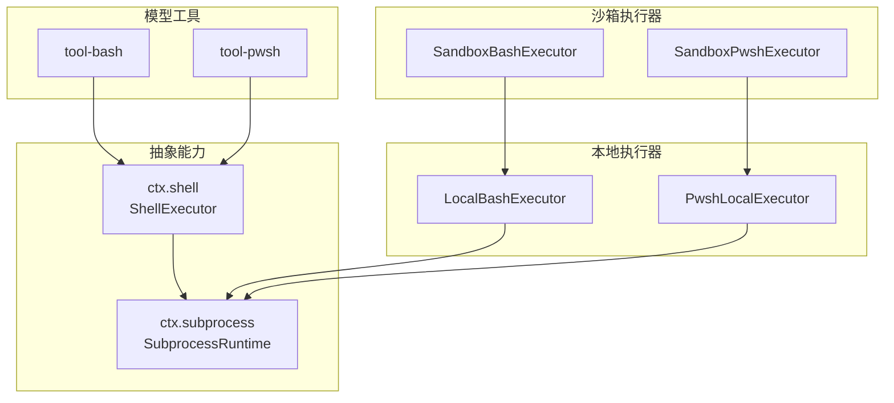
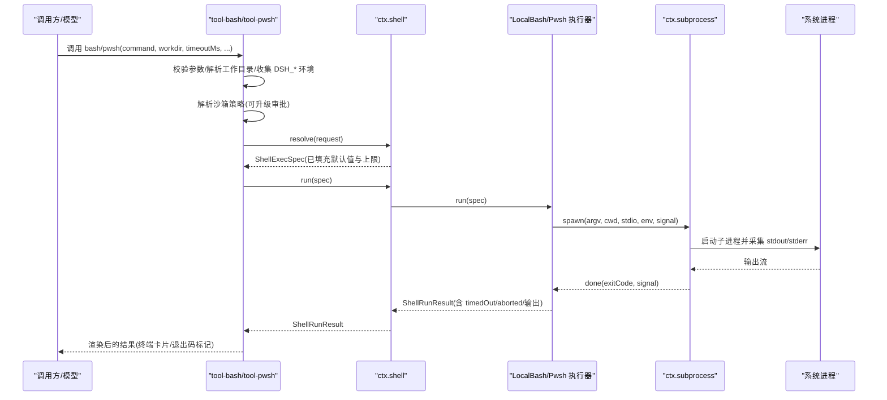
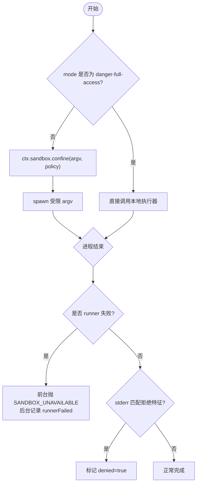
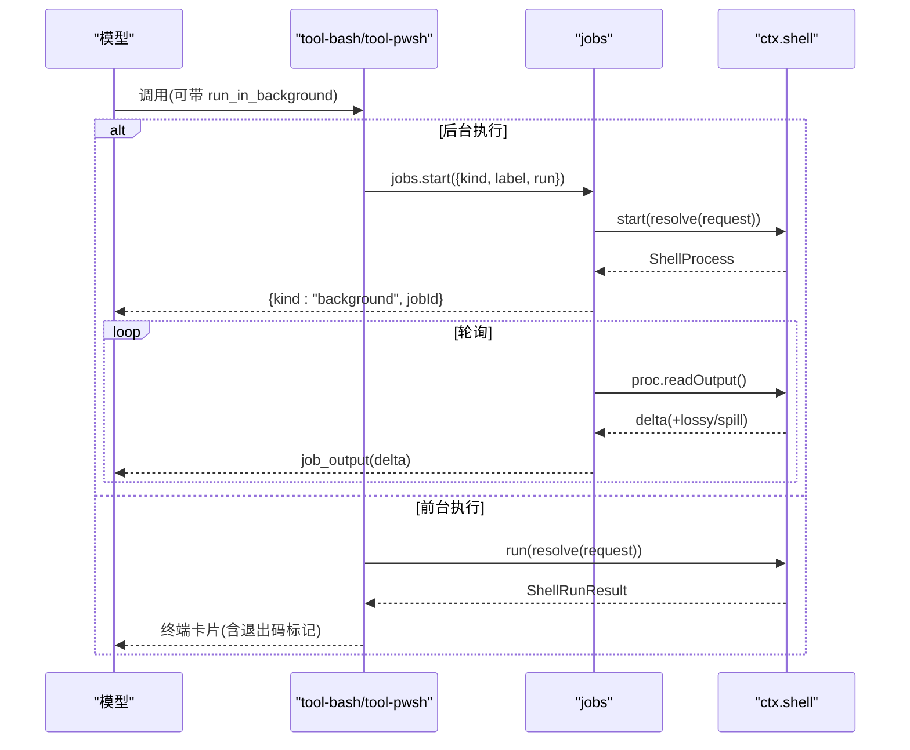
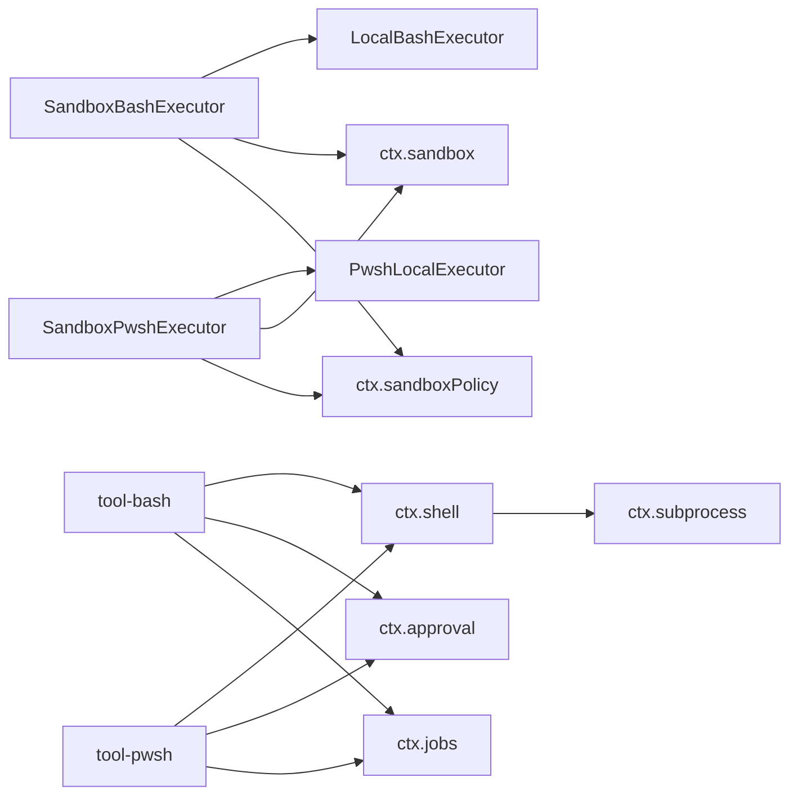

# Shell 执行工具

<cite>
**本文引用的文件**
- [packages/shell/shell/src/index.ts](file://packages/shell/shell/src/index.ts)
- [packages/shell/bash-local/src/index.ts](file://packages/shell/bash-local/src/index.ts)
- [packages/shell/pwsh-local/src/index.ts](file://packages/shell/pwsh-local/src/index.ts)
- [packages/shell/tool-bash/src/index.ts](file://packages/shell/tool-bash/src/index.ts)
- [packages/shell/tool-pwsh/src/index.ts](file://packages/shell/tool-pwsh/src/index.ts)
- [packages/shell/bash-sandbox/src/index.ts](file://packages/shell/bash-sandbox/src/index.ts)
- [packages/shell/pwsh-sandbox/src/index.ts](file://packages/shell/pwsh-sandbox/src/index.ts)
- [packages/subprocess/subprocess/src/index.ts](file://packages/subprocess/subprocess/src/index.ts)
- [docs/subsystems/shell.md](file://docs/subsystems/shell.md)
- [docs/subsystems/sandbox.md](file://docs/subsystems/sandbox.md)
</cite>

## 目录
1. [简介](#简介)
2. [项目结构](#项目结构)
3. [核心组件](#核心组件)
4. [架构总览](#架构总览)
5. [详细组件分析](#详细组件分析)
6. [依赖关系分析](#依赖关系分析)
7. [性能与资源管理](#性能与资源管理)
8. [故障排除指南](#故障排除指南)
9. [结论](#结论)
10. [附录：配置与环境变量](#附录：配置与环境变量)

## 简介
本文件系统性介绍 Shell 执行工具，覆盖 Bash 与 PowerShell（pwsh）两类命令执行能力。内容包含：
- 命令行执行入口、配置项、环境变量与工作目录管理
- 沙箱机制：权限控制、资源限制与安全策略
- 超时处理、输出捕获与错误处理
- 跨平台执行、交互式命令与管道操作要点
- 性能优化建议与故障排除

## 项目结构
Shell 执行能力由“抽象服务定义 + 本地实现 + 沙箱包装 + 模型侧工具”四层组成：
- 抽象服务：ctx.shell（统一接口）、ctx.subprocess（进程管理）
- 本地实现：bash-local、pwsh-local
- 沙箱包装：bash-sandbox、pwsh-sandbox
- 模型工具：tool-bash、tool-pwsh

**图表来源**
- [packages/shell/shell/src/index.ts:65-101](file://packages/shell/shell/src/index.ts#L65-L101)
- [packages/subprocess/subprocess/src/index.ts:102-140](file://packages/subprocess/subprocess/src/index.ts#L102-L140)
- [packages/shell/bash-local/src/index.ts:102-171](file://packages/shell/bash-local/src/index.ts#L102-L171)
- [packages/shell/pwsh-local/src/index.ts:128-219](file://packages/shell/pwsh-local/src/index.ts#L128-L219)
- [packages/shell/bash-sandbox/src/index.ts:44-86](file://packages/shell/bash-sandbox/src/index.ts#L44-L86)
- [packages/shell/pwsh-sandbox/src/index.ts:52-94](file://packages/shell/pwsh-sandbox/src/index.ts#L52-L94)
- [packages/shell/tool-bash/src/index.ts:190-395](file://packages/shell/tool-bash/src/index.ts#L190-L395)
- [packages/shell/tool-pwsh/src/index.ts:196-447](file://packages/shell/tool-pwsh/src/index.ts#L196-L447)

**章节来源**
- [packages/shell/shell/src/index.ts:65-101](file://packages/shell/shell/src/index.ts#L65-L101)
- [packages/subprocess/subprocess/src/index.ts:102-140](file://packages/subprocess/subprocess/src/index.ts#L102-L140)

## 核心组件
- ShellExecutor（抽象）：定义 resolve/run/start 与 sandboxMode 能力事实；统一前台/后台执行语义、输出增量读取、超时与中止分类。
- LocalBashExecutor/PwshLocalExecutor：基于 ctx.subprocess 启动子进程，设置工作目录、超时、输出上限、溢出转储、环境覆盖等。
- SandboxBashExecutor/SandboxPwshExecutor：在本地执行器之上通过 ctx.sandbox 包裹 argv，注入模式、根目录、执行完整性报告与拒绝判定。
- tool-bash/tool-pwsh：面向模型的命令工具，负责参数校验、工作目录解析、DSH_* 环境注入、沙箱策略解析与升级审批、前台/后台任务编排与结果渲染。

**章节来源**
- [packages/shell/shell/src/index.ts:65-101](file://packages/shell/shell/src/index.ts#L65-L101)
- [packages/shell/bash-local/src/index.ts:102-171](file://packages/shell/bash-local/src/index.ts#L102-L171)
- [packages/shell/pwsh-local/src/index.ts:128-219](file://packages/shell/pwsh-local/src/index.ts#L128-L219)
- [packages/shell/bash-sandbox/src/index.ts:44-86](file://packages/shell/bash-sandbox/src/index.ts#L44-L86)
- [packages/shell/pwsh-sandbox/src/index.ts:52-94](file://packages/shell/pwsh-sandbox/src/index.ts#L52-L94)
- [packages/shell/tool-bash/src/index.ts:190-395](file://packages/shell/tool-bash/src/index.ts#L190-L395)
- [packages/shell/tool-pwsh/src/index.ts:196-447](file://packages/shell/tool-pwsh/src/index.ts#L196-L447)

## 架构总览
下图展示一次前台命令执行的调用链路与数据流：

**图表来源**
- [packages/shell/tool-bash/src/index.ts:330-390](file://packages/shell/tool-bash/src/index.ts#L330-L390)
- [packages/shell/tool-pwsh/src/index.ts:348-407](file://packages/shell/tool-pwsh/src/index.ts#L348-L407)
- [packages/shell/bash-local/src/index.ts:211-240](file://packages/shell/bash-local/src/index.ts#L211-L240)
- [packages/shell/pwsh-local/src/index.ts:255-277](file://packages/shell/pwsh-local/src/index.ts#L255-L277)
- [packages/subprocess/subprocess/src/index.ts:124-140](file://packages/subprocess/subprocess/src/index.ts#L124-L140)

## 详细组件分析

### 抽象 Shell 服务（ctx.shell）
- 职责：定义统一的请求/规范分离（resolve），前台 run 与后台 start 的语义，以及 sandboxMode 能力事实。
- 关键约定：
  - run 仅对基础设施失败拒绝；非零退出、超时、中止均返回结构化结果。
  - start 立即返回句柄；done 永不拒绝，spawn 失败以 killed 状态呈现。
  - readOutput 增量读取，支持 lossy 与 spill 路径。
  - 组合销毁时停止仍在运行的后台进程。

**章节来源**
- [packages/shell/shell/src/index.ts:65-101](file://packages/shell/shell/src/index.ts#L65-L101)
- [docs/subsystems/shell.md:105-221](file://docs/subsystems/shell.md#L105-L221)

### Bash 本地执行器（LocalBashExecutor）
- 执行方式：以 `bash -c` 运行命令，使用 ctx.subprocess 管理进程树。
- 配置项：
  - cwd：默认工作目录
  - timeoutMs/maxTimeoutMs：前台超时及上限
  - maxOutputBytes：每流内存上限
  - maxSpillBytes：溢出转储文件大小上限
  - graceMs：SIGTERM→SIGKILL 宽限期
- 环境变量：
  - 强制 NO_COLOR、TERM=dumb、PAGER/GIT_PAGER=cat，避免交互特性污染输出
  - dshEnv 合并顺序高于普通 env，确保受管事实不被覆盖
- 输出与超时：
  - 前台 run 区分 timedOut 与 aborted，分别来自内置超时与上游中止信号
  - 后台 start 忽略 timeoutMs，通过 kill()/signal 终止
- 工作目录：workdir 优先于 config.cwd，最终回退到 process.cwd()

**章节来源**
- [packages/shell/bash-local/src/index.ts:20-67](file://packages/shell/bash-local/src/index.ts#L20-L67)
- [packages/shell/bash-local/src/index.ts:102-171](file://packages/shell/bash-local/src/index.ts#L102-L171)
- [packages/shell/bash-local/src/index.ts:211-240](file://packages/shell/bash-local/src/index.ts#L211-L240)
- [packages/shell/bash-local/src/index.ts:242-318](file://packages/shell/bash-local/src/index.ts#L242-L318)

### PowerShell 本地执行器（PwshLocalExecutor）
- 执行方式：以 `pwsh -NoLogo -NoProfile -NonInteractive -Command <command>` 运行，命令作为单个 argv 元素传递，无中间 shell 转义层。
- 配置项：除与 Bash 相同的选项外，新增 pwshPath 用于定位可执行文件（支持 PATH 探测与回退）。
- 编码与输出：
  - 在每个命令前追加 UTF-8 输出固定头，保证 Windows 下非 ASCII 输出正确解码
  - 环境变量覆盖 NO_COLOR、PAGER、GIT_PAGER
- 工作目录与超时：与 Bash 一致，前台超时与上限由 resolve 钳制，后台不应用超时。

**章节来源**
- [packages/shell/pwsh-local/src/index.ts:28-78](file://packages/shell/pwsh-local/src/index.ts#L28-L78)
- [packages/shell/pwsh-local/src/index.ts:128-219](file://packages/shell/pwsh-local/src/index.ts#L128-L219)
- [packages/shell/pwsh-local/src/index.ts:255-277](file://packages/shell/pwsh-local/src/index.ts#L255-L277)
- [packages/shell/pwsh-local/src/index.ts:279-347](file://packages/shell/pwsh-local/src/index.ts#L279-L347)

### 沙箱执行器（SandboxBashExecutor / SandboxPwshExecutor）
- 职责：将本地执行器的 argv 通过 ctx.sandbox 包裹，注入 per-call 策略（mode/workspaceRoot），并在进程结束时标注 denied/enforcement/runnerFailed。
- 策略来源：
  - 工具层为每次调用解析完整策略（含会话不可变 cwd 作为 workspace-write 边界）
  - 若 mode 为 danger-full-access，则直接绕过沙箱
- 失败分类：
  - runnerFailed 优先级高于 denial（命令未运行）
  - denial 通过后端提供的 stderr 特征匹配判定
- 前台/后台差异：
  - 前台：runner 启动失败抛出 SANDBOX_UNAVAILABLE
  - 后台：在 done 前写入 proc.sandbox 事实

**图表来源**
- [packages/shell/bash-sandbox/src/index.ts:88-114](file://packages/shell/bash-sandbox/src/index.ts#L88-L114)
- [packages/shell/pwsh-sandbox/src/index.ts:96-122](file://packages/shell/pwsh-sandbox/src/index.ts#L96-L122)
- [docs/subsystems/sandbox.md:9-39](file://docs/subsystems/sandbox.md#L9-L39)
- [docs/subsystems/sandbox.md:96-157](file://docs/subsystems/sandbox.md#L96-L157)

**章节来源**
- [packages/shell/bash-sandbox/src/index.ts:44-183](file://packages/shell/bash-sandbox/src/index.ts#L44-L183)
- [packages/shell/pwsh-sandbox/src/index.ts:52-190](file://packages/shell/pwsh-sandbox/src/index.ts#L52-L190)
- [docs/subsystems/sandbox.md:9-39](file://docs/subsystems/sandbox.md#L9-L39)
- [docs/subsystems/sandbox.md:41-94](file://docs/subsystems/sandbox.md#L41-L94)
- [docs/subsystems/sandbox.md:96-157](file://docs/subsystems/sandbox.md#L96-L157)

### 模型工具（tool-bash / tool-pwsh）
- 参数与校验：command/description/timeoutMs/workdir/run_in_background/sandbox_permissions/justification
- 工作目录解析：相对路径相对于会话工作区根解析；未提供时使用会话 header.cwd
- 环境变量：通过 ctx.shellEnv.collect(exec) 生成 DSH_* 快照，合并到执行环境
- 沙箱策略：
  - 解析当前会话策略；如携带 sandbox_permissions+justification，先经 ctx.approval 审批再替换 mode
- 前台/后台：
  - 前台：run → 渲染终端卡片，解析退出码标记
  - 后台：注册到 jobs，返回 jobId；readOutput 增量输出，支持 lossy 与 spill 路径提示
- 结果渲染：
  - 前台结果包含 exitCode/signal/timedOut/aborted/timeoutMs/stdout/stderr/sandbox
  - 后台结果仅返回 jobId；完成后通过 job_output/job_kill 管理

**图表来源**
- [packages/shell/tool-bash/src/index.ts:330-390](file://packages/shell/tool-bash/src/index.ts#L330-L390)
- [packages/shell/tool-pwsh/src/index.ts:348-407](file://packages/shell/tool-pwsh/src/index.ts#L348-L407)

**章节来源**
- [packages/shell/tool-bash/src/index.ts:33-156](file://packages/shell/tool-bash/src/index.ts#L33-L156)
- [packages/shell/tool-bash/src/index.ts:190-395](file://packages/shell/tool-bash/src/index.ts#L190-L395)
- [packages/shell/tool-pwsh/src/index.ts:62-158](file://packages/shell/tool-pwsh/src/index.ts#L62-L158)
- [packages/shell/tool-pwsh/src/index.ts:196-447](file://packages/shell/tool-pwsh/src/index.ts#L196-L447)

## 依赖关系分析
- 工具层依赖 ctx.shell 与 ctx.shellEnv；shell 抽象依赖 ctx.subprocess
- 本地执行器依赖 ctx.subprocess 进行进程生命周期与 I/O 管理
- 沙箱执行器依赖 ctx.sandbox 与 ctx.sandboxPolicy 注入策略与运行时约束
- 工具层还依赖 ctx.approval 进行沙箱升级审批，依赖 ctx.jobs 管理后台任务

**图表来源**
- [packages/shell/tool-bash/src/index.ts:190-395](file://packages/shell/tool-bash/src/index.ts#L190-L395)
- [packages/shell/tool-pwsh/src/index.ts:196-447](file://packages/shell/tool-pwsh/src/index.ts#L196-L447)
- [packages/shell/bash-sandbox/src/index.ts:44-86](file://packages/shell/bash-sandbox/src/index.ts#L44-L86)
- [packages/shell/pwsh-sandbox/src/index.ts:52-94](file://packages/shell/pwsh-sandbox/src/index.ts#L52-L94)

**章节来源**
- [packages/shell/tool-bash/src/index.ts:190-395](file://packages/shell/tool-bash/src/index.ts#L190-L395)
- [packages/shell/tool-pwsh/src/index.ts:196-447](file://packages/shell/tool-pwsh/src/index.ts#L196-L447)
- [packages/shell/bash-sandbox/src/index.ts:44-86](file://packages/shell/bash-sandbox/src/index.ts#L44-L86)
- [packages/shell/pwsh-sandbox/src/index.ts:52-94](file://packages/shell/pwsh-sandbox/src/index.ts#L52-L94)

## 性能与资源管理
- 输出缓冲与转储：
  - 通过 maxOutputBytes 限制内存占用；超出部分转储至临时文件，readOutput 会标记 lossy 并提供 spillPath
  - maxSpillBytes 限制转储文件大小，避免磁盘耗尽
- 超时与中止：
  - 前台 run 使用 deadline 融合超时与上游 AbortSignal；timedOut 与 aborted 互斥且可区分
  - 后台 start 不应用超时，需显式 kill() 或依赖 spec.signal
- 进程组终止：
  - graceMs 控制 SIGTERM→SIGKILL 升级时间，确保进程树尽快回收
- 环境变量清理：
  - 子进程环境会剔除敏感键与 DSH_* 继承，避免凭据泄露
- 建议：
  - 合理设置 maxOutputBytes 与 maxSpillBytes，平衡内存与磁盘
  - 对长耗时任务使用后台模式，配合 job_output/job_kill
  - 对需要大量输出的命令，考虑分块或过滤以减少内存峰值

**章节来源**
- [packages/shell/bash-local/src/index.ts:40-67](file://packages/shell/bash-local/src/index.ts#L40-L67)
- [packages/shell/bash-local/src/index.ts:173-198](file://packages/shell/bash-local/src/index.ts#L173-L198)
- [packages/shell/pwsh-local/src/index.ts:57-78](file://packages/shell/pwsh-local/src/index.ts#L57-L78)
- [packages/shell/pwsh-local/src/index.ts:221-242](file://packages/shell/pwsh-local/src/index.ts#L221-L242)
- [packages/subprocess/subprocess/src/index.ts:37-66](file://packages/subprocess/subprocess/src/index.ts#L37-L66)

## 故障排除指南
- 命令超时或被中止：
  - 检查 result.timedOut/result.aborted 与 timeoutMs；必要时增大超时或拆分任务
- 输出被截断：
  - 关注 result.stdout/stderr.truncated 与 spillPath；从 spill 文件获取完整输出
- 沙箱拒绝：
  - 查看 result.sandbox.denied 与 stderr 中的拒绝标记；如需更宽权限，使用 sandbox_permissions+justification 进行一次升级重试
- 沙箱不可用：
  - 前台执行可能抛出 SANDBOX_UNAVAILABLE；检查后端可用性（bwrap/Landlock/Seatbelt/ACL）
- 后台进程未退出：
  - 确认调用了 kill() 或上游 signal 已触发；检查 graceMs 与进程组终止行为
- 环境变量问题：
  - 确认 DSH_* 由 shellEnv 注入；避免依赖父进程隐式继承的环境

**章节来源**
- [docs/subsystems/shell.md:105-221](file://docs/subsystems/shell.md#L105-L221)
- [packages/shell/bash-sandbox/src/index.ts:88-114](file://packages/shell/bash-sandbox/src/index.ts#L88-L114)
- [packages/shell/pwsh-sandbox/src/index.ts:96-122](file://packages/shell/pwsh-sandbox/src/index.ts#L96-L122)
- [docs/subsystems/sandbox.md:152-157](file://docs/subsystems/sandbox.md#L152-L157)

## 结论
Shell 执行工具通过清晰的抽象与服务分层，提供了跨平台、可沙箱化、可观测的命令执行能力。Bash 与 PowerShell 两套实现共享一致的接口与工具契约，结合 subprocess 的进程管理与沙箱的策略注入，实现了安全、可控、可审计的执行环境。通过合理的配置与监控，可在保证安全的前提下获得良好的性能与稳定性。

## 附录：配置与环境变量
- 通用配置（bash-local/pwsh-local）：
  - cwd：默认工作目录
  - timeoutMs/maxTimeoutMs：前台超时与上限
  - maxOutputBytes：每流内存上限
  - maxSpillBytes：溢出转储大小上限
  - graceMs：SIGTERM→SIGKILL 宽限期
  - pwshPath（仅 pwsh-local）：PowerShell 可执行路径
- 环境变量：
  - 强制 NO_COLOR、PAGER/GIT_PAGER=cat；Bash 额外设置 TERM=dumb
  - 通过 dshEnv 注入受管 DSH_* 变量，优先级高于普通 env
- 工作目录：
  - 工具层优先使用 session header.cwd；相对路径按工作区根解析
- 沙箱模式：
  - read-only/workspace-write/danger-full-access；workspace-write 允许在工作区与后端 temp 区域写入
  - 通过 ctx.sandboxPolicy.resolve() 解析 per-call 策略；可通过审批流程进行一次性放宽

**章节来源**
- [packages/shell/bash-local/src/index.ts:40-67](file://packages/shell/bash-local/src/index.ts#L40-L67)
- [packages/shell/pwsh-local/src/index.ts:57-78](file://packages/shell/pwsh-local/src/index.ts#L57-L78)
- [docs/subsystems/shell.md:9-16](file://docs/subsystems/shell.md#L9-L16)
- [docs/subsystems/sandbox.md:9-39](file://docs/subsystems/sandbox.md#L9-L39)
- [docs/subsystems/sandbox.md:41-94](file://docs/subsystems/sandbox.md#L41-L94)