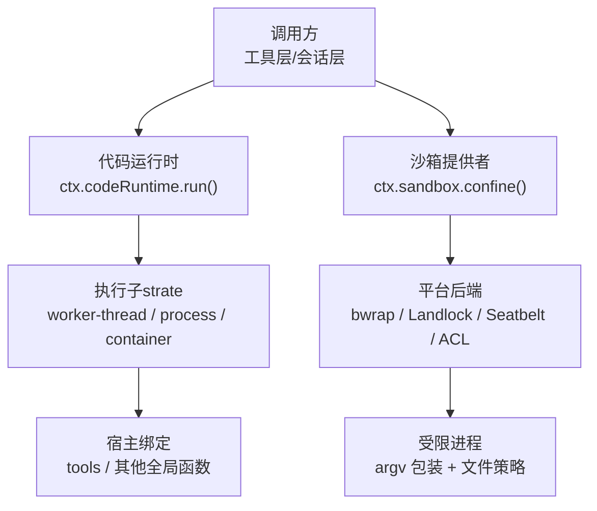
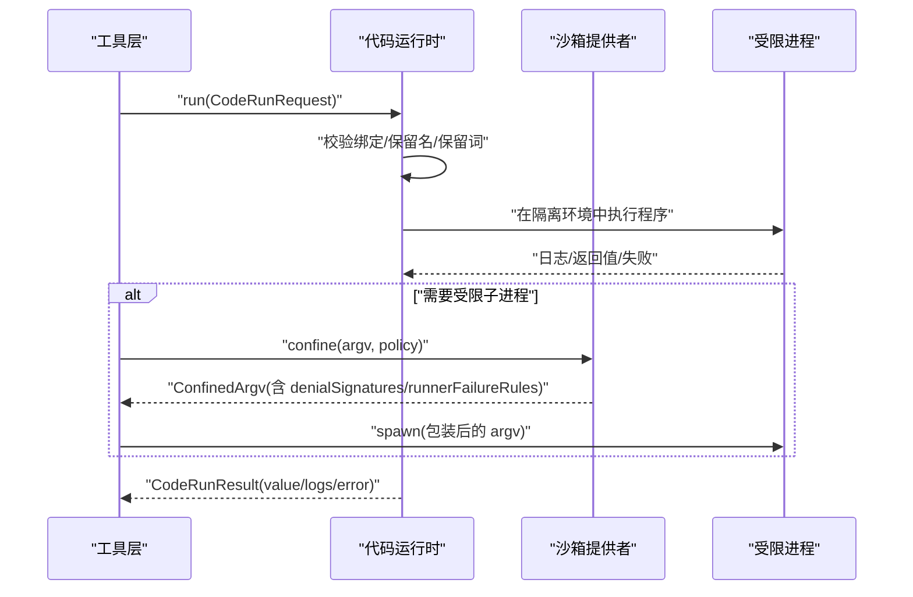
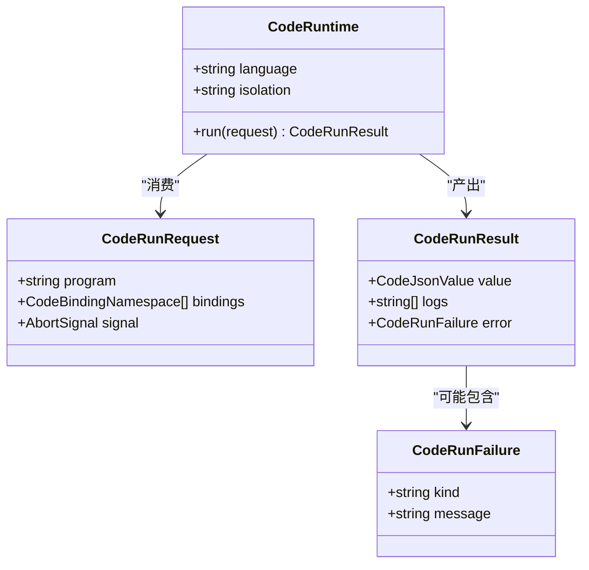
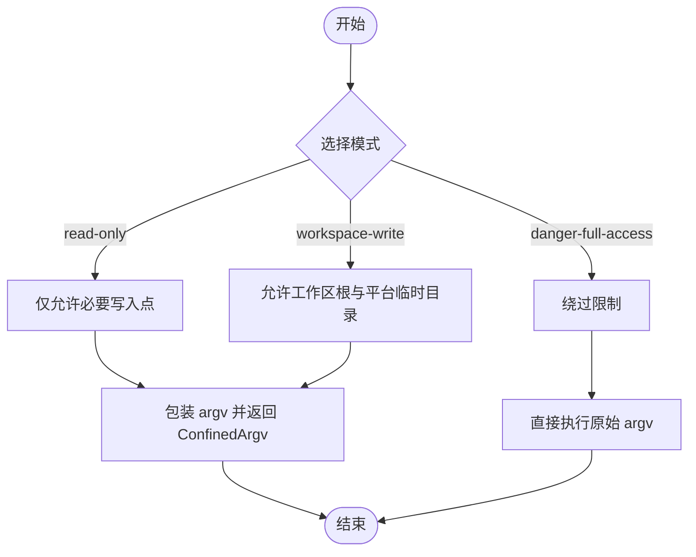
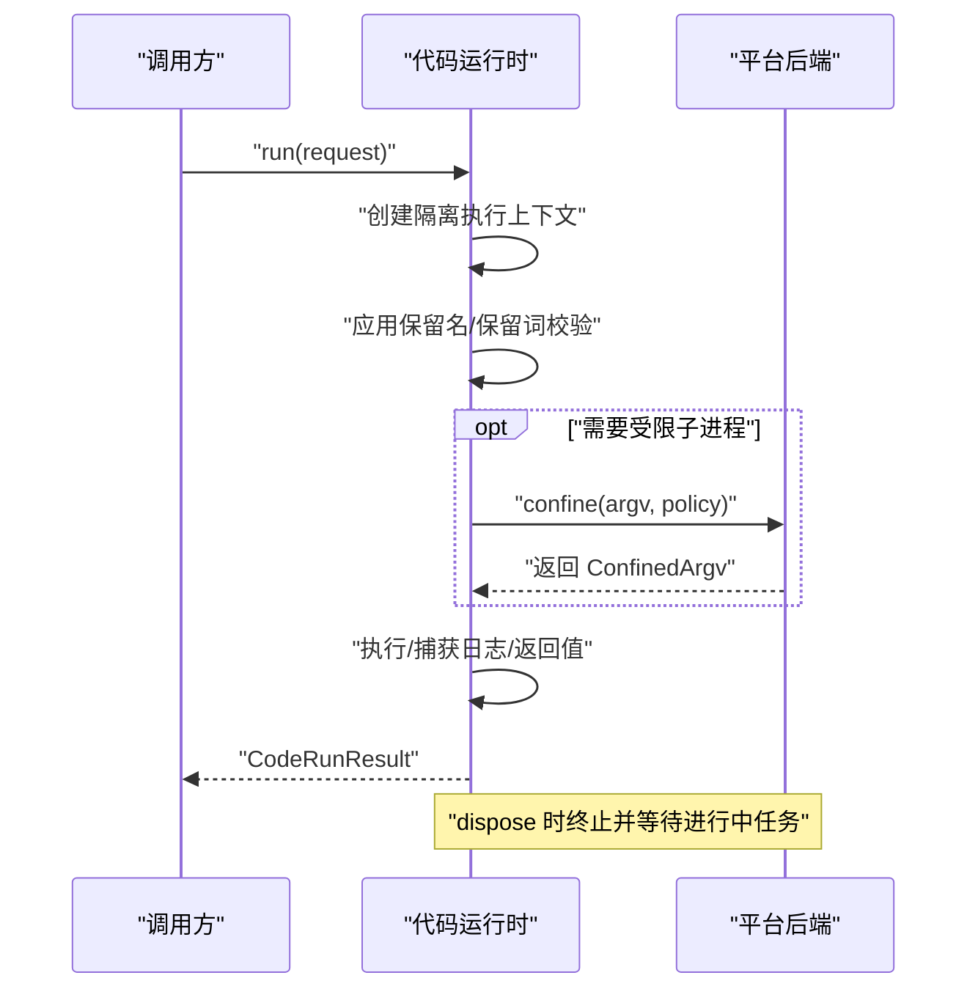
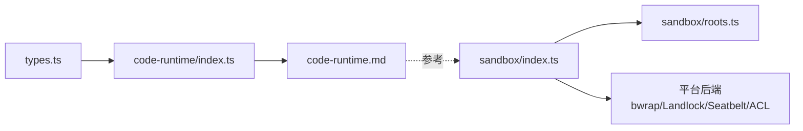

# 代码执行工具

<cite>
**本文引用的文件**
- [packages/code-runtime/code-runtime/src/index.ts](file://packages/code-runtime/code-runtime/src/index.ts)
- [packages/code-runtime/code-runtime/src/types.ts](file://packages/code-runtime/code-runtime/src/types.ts)
- [docs/subsystems/code-runtime.md](file://docs/subsystems/code-runtime.md)
- [packages/sandbox/sandbox/src/index.ts](file://packages/sandbox/sandbox/src/index.ts)
- [packages/sandbox/sandbox/src/roots.ts](file://packages/sandbox/sandbox/src/roots.ts)
- [docs/subsystems/sandbox.md](file://docs/subsystems/sandbox.md)
- [native/landlock-run/packages/entry/src/main.c](file://native/landlock-run/packages/entry/src/main.c)
- [packages/core/tools/tests/code-mode.spec.ts](file://packages/core/tools/tests/code-mode.spec.ts)
</cite>

## 目录
1. [简介](#简介)
2. [项目结构](#项目结构)
3. [核心组件](#核心组件)
4. [架构总览](#架构总览)
5. [详细组件分析](#详细组件分析)
6. [依赖关系分析](#依赖关系分析)
7. [性能与监控](#性能与监控)
8. [故障排查指南](#故障排查指南)
9. [结论](#结论)
10. [附录：使用示例与最佳实践](#附录使用示例与最佳实践)

## 简介
本文件面向“代码执行工具”的完整说明，覆盖 runCode（代码执行）与 sandbox（沙箱环境）两大能力。内容包含：
- 支持的编程语言、执行环境与依赖管理
- 安全限制：内存/CPU 时间限制、文件系统访问控制
- 生命周期管理：进程隔离、资源清理、异常处理
- 使用示例：如何执行 JavaScript、Python 等语言片段
- 性能监控与调试：如何分析执行性能与定位错误

## 项目结构
代码执行由两个关键子系统构成：
- 代码运行时（code-runtime）：定义跨语言的执行接口、请求/结果模型、绑定命名空间与保留字策略，提供抽象服务 CodeRuntime。
- 沙箱（sandbox）：定义进程级文件效果策略（只读、工作区可写、危险全开放），并提供 confine 包装 argv 的能力；本地后端通过 bwrap/Landlock/Seatbelt/ACL 实现。

图表来源
- [packages/code-runtime/code-runtime/src/index.ts:102-134](file://packages/code-runtime/code-runtime/src/index.ts#L102-L134)
- [packages/sandbox/sandbox/src/index.ts:158-175](file://packages/sandbox/sandbox/src/index.ts#L158-L175)

章节来源
- [packages/code-runtime/code-runtime/src/index.ts:1-138](file://packages/code-runtime/code-runtime/src/index.ts#L1-L138)
- [packages/sandbox/sandbox/src/index.ts:1-179](file://packages/sandbox/sandbox/src/index.ts#L1-L179)

## 核心组件
- 代码运行时（CodeRuntime）
  - 抽象服务，暴露 language、isolation 描述符与 run(request) 方法。
  - 支持多种执行基座：worker-thread、process、container（仅信息性标识）。
  - 请求/结果契约：CodeRunRequest/CodeRunResult/CodeRunFailure，错误以字段形式返回而非抛错。
- 绑定系统（Bindings）
  - 将宿主函数以命名空间形式注入程序全局（如 tools）。
  - 严格的保留名与保留词策略，避免跨语言冲突与原型污染。
- 沙箱（SandboxProvider）
  - confine(argv, policy) 返回受约束的 argv 及执行完整性（full/partial）。
  - 模式：read-only、workspace-write、danger-full-access；网络与进程可见性不在该词汇表内。
  - 失败分类：denialSignatures（被沙箱拒绝）、runnerFailureRules（运行器自身失败）。

章节来源
- [packages/code-runtime/code-runtime/src/index.ts:20-134](file://packages/code-runtime/code-runtime/src/index.ts#L20-L134)
- [packages/code-runtime/code-runtime/src/types.ts:9-128](file://packages/code-runtime/code-runtime/src/types.ts#L9-L128)
- [docs/subsystems/code-runtime.md:9-161](file://docs/subsystems/code-runtime.md#L9-L161)
- [packages/sandbox/sandbox/src/index.ts:23-175](file://packages/sandbox/sandbox/src/index.ts#L23-L175)
- [docs/subsystems/sandbox.md:9-156](file://docs/subsystems/sandbox.md#L9-L156)

## 架构总览
下图展示一次代码执行的端到端流程：工具层构造请求，调用 codeRuntime.run；运行时在隔离环境中执行，并通过 bindings 调用宿主能力；必要时通过 sandbox.confine 对子进程施加文件策略。

图表来源
- [packages/code-runtime/code-runtime/src/index.ts:102-134](file://packages/code-runtime/code-runtime/src/index.ts#L102-L134)
- [packages/sandbox/sandbox/src/index.ts:158-175](file://packages/sandbox/sandbox/src/index.ts#L158-L175)

## 详细组件分析

### 代码运行时（CodeRuntime）
- 职责
  - 接收 CodeRunRequest（program/bindings/signal），在隔离环境中执行并返回 CodeRunResult。
  - 维护跨语言一致的保留名/保留词策略，确保同一份绑定在不同后端均有效。
- 关键类型
  - CodeBindingNamespace：全局对象名称、函数集合、可选的错误类契约。
  - CodeRunFailure：异常、超时、中止、工作进程退出、输出非法、输出超限等正交失败类别。
- 行为要点
  - 错误作为结果字段返回，不抛出 Promise rejection。
  - 绑定参数与返回值必须为可无损 JSON 传输的值。
  - 支持 AbortSignal 中止执行。

图表来源
- [packages/code-runtime/code-runtime/src/index.ts:102-134](file://packages/code-runtime/code-runtime/src/index.ts#L102-L134)
- [packages/code-runtime/code-runtime/src/types.ts:67-128](file://packages/code-runtime/code-runtime/src/types.ts#L67-L128)

章节来源
- [packages/code-runtime/code-runtime/src/index.ts:20-134](file://packages/code-runtime/code-runtime/src/index.ts#L20-L134)
- [packages/code-runtime/code-runtime/src/types.ts:9-128](file://packages/code-runtime/code-runtime/src/types.ts#L9-L128)
- [docs/subsystems/code-runtime.md:9-161](file://docs/subsystems/code-runtime.md#L9-L161)

### 沙箱（SandboxProvider）
- 职责
  - 将待执行的 argv 包装为受文件策略限制的 argv，并返回执行完整性与诊断规则。
  - 模式：read-only（仅允许必要写入点）、workspace-write（允许工作区与平台临时目录）、danger-full-access（绕过限制）。
- 关键类型
  - SandboxPolicy/SandboxExecutionPolicy：每调用解析的策略，包含 mode 与 workspaceRoot。
  - ConfinedArgv：包装后的 argv、enforcement(full/partial)、denialSignatures、runnerFailureRules。
- 平台后端
  - Linux：bwrap 或 Landlock；macOS：Seatbelt；Windows：ACL restricted-token。
  - roots.ts 统一推导可写根路径（工作区根、/tmp、os.tmpdir()）。

图表来源
- [packages/sandbox/sandbox/src/index.ts:23-175](file://packages/sandbox/sandbox/src/index.ts#L23-L175)
- [packages/sandbox/sandbox/src/roots.ts:20-55](file://packages/sandbox/sandbox/src/roots.ts#L20-L55)

章节来源
- [packages/sandbox/sandbox/src/index.ts:23-175](file://packages/sandbox/sandbox/src/index.ts#L23-L175)
- [packages/sandbox/sandbox/src/roots.ts:1-56](file://packages/sandbox/sandbox/src/roots.ts#L1-L56)
- [docs/subsystems/sandbox.md:9-156](file://docs/subsystems/sandbox.md#L9-L156)

### 执行生命周期与安全限制
- 生命周期
  - 隔离：每个 run 在独立执行基座上运行（worker-thread/process/container），彼此状态隔离。
  - 中止：通过 AbortSignal 触发中止，返回 abort 失败。
  - 清理：dispose 时终止并等待进行中的 run 完成。
- 安全限制
  - 内存/CPU：由具体运行时实现负责（例如 worker 或进程级限制），不在 seam 层硬编码默认值。
  - 文件系统：通过沙箱模式与 roots 推导控制可写范围；Landlock/bwrap/Seatbelt/ACL 提供内核或用户态强制。
  - 绑定注入：严格保留名/保留词策略，防止原型污染与跨语言冲突。

图表来源
- [packages/code-runtime/code-runtime/src/index.ts:95-134](file://packages/code-runtime/code-runtime/src/index.ts#L95-L134)
- [packages/sandbox/sandbox/src/index.ts:158-175](file://packages/sandbox/sandbox/src/index.ts#L158-L175)

章节来源
- [docs/subsystems/code-runtime.md:159-161](file://docs/subsystems/code-runtime.md#L159-L161)
- [docs/subsystems/sandbox.md:152-156](file://docs/subsystems/sandbox.md#L152-L156)

## 依赖关系分析
- 代码运行时依赖
  - 类型定义：types.ts 中统一的请求/结果/失败模型。
  - 保留名/保留词：index.ts 中集中声明，保证跨后端一致性。
- 沙箱依赖
  - 策略解析：per-call 策略（mode/workspaceRoot/sessionId）。
  - 平台后端：Linux(bwrap/Landlock)、macOS(Seatbelt)、Windows(ACL)。
  - 可写根推导：roots.ts 统一计算，避免不同后端间的不一致。

图表来源
- [packages/code-runtime/code-runtime/src/types.ts:9-128](file://packages/code-runtime/code-runtime/src/types.ts#L9-L128)
- [packages/code-runtime/code-runtime/src/index.ts:20-134](file://packages/code-runtime/code-runtime/src/index.ts#L20-L134)
- [packages/sandbox/sandbox/src/index.ts:23-175](file://packages/sandbox/sandbox/src/index.ts#L23-L175)
- [packages/sandbox/sandbox/src/roots.ts:20-55](file://packages/sandbox/sandbox/src/roots.ts#L20-L55)

章节来源
- [packages/code-runtime/code-runtime/src/types.ts:9-128](file://packages/code-runtime/code-runtime/src/types.ts#L9-L128)
- [packages/code-runtime/code-runtime/src/index.ts:20-134](file://packages/code-runtime/code-runtime/src/index.ts#L20-L134)
- [packages/sandbox/sandbox/src/index.ts:23-175](file://packages/sandbox/sandbox/src/index.ts#L23-L175)
- [packages/sandbox/sandbox/src/roots.ts:1-56](file://packages/sandbox/sandbox/src/roots.ts#L1-L56)

## 性能与监控
- 性能特征
  - 隔离开销：worker-thread 通常比新进程更轻量；容器/远程执行具备更强隔离但启动成本更高。
  - 输出与返回值：日志与返回值需序列化，过大将触发 output-limit 失败。
- 监控建议
  - 使用 CodeRunResult.logs 收集执行期文本输出。
  - 关注 CodeRunFailure.kind 区分超时、中止、工作进程退出等。
  - 结合平台后端（Landlock/bwrap/Seatbelt/ACL）观察是否出现 denial 或 runner failure。
- 调试技巧
  - 若出现“无可用沙箱后端”，检查主机能力（Landlock 内核、bwrap、seatbelt、ACL）。
  - 若命令未执行即失败，优先匹配 runnerFailureRules；若命令执行中被阻止，匹配 denialSignatures。

章节来源
- [docs/subsystems/code-runtime.md:132-161](file://docs/subsystems/code-runtime.md#L132-L161)
- [docs/subsystems/sandbox.md:96-156](file://docs/subsystems/sandbox.md#L96-L156)

## 故障排查指南
- 常见问题与定位
  - 无可用沙箱后端：抛出不可用错误，需安装对应后端或切换策略。
  - 命令未执行：根据 runnerFailureRules 判断运行器自身失败。
  - 被沙箱拒绝：根据 denialSignatures 判断文件访问被限制。
  - 代码执行失败：根据 CodeRunFailure.kind 区分 exception/timeout/abort/worker-exit/invalid-output/output-limit。
- 平台相关
  - Linux Landlock：内核规则设置失败会返回错误码。
  - macOS Seatbelt：权限不足或配置不当导致部分执行受限。
  - Windows ACL：Everyone/hard-link 边界可能导致 partial 执行完整性。

章节来源
- [packages/sandbox/sandbox/src/index.ts:118-144](file://packages/sandbox/sandbox/src/index.ts#L118-L144)
- [native/landlock-run/packages/entry/src/main.c:244-267](file://native/landlock-run/packages/entry/src/main.c#L244-L267)
- [docs/subsystems/sandbox.md:152-156](file://docs/subsystems/sandbox.md#L152-L156)

## 结论
代码执行工具通过“代码运行时 + 沙箱”的组合，提供了跨语言、可隔离、可审计的执行能力。其设计强调：
- 明确的请求/结果契约与失败分类
- 跨语言一致的保留名/保留词策略
- 可组合的沙箱策略与平台后端适配
- 清晰的资源生命周期与清理机制

在实际使用中，应依据场景选择合适的隔离级别与沙箱模式，并结合日志与失败分类进行性能分析与问题定位。

## 附录：使用示例与最佳实践
- 执行 JavaScript/TypeScript 代码片段
  - 构造 CodeRunRequest：传入 program（异步函数体）、bindings（如 tools）、可选 signal。
  - 调用 ctx.codeRuntime.run(request)，读取 result.value/result.logs/result.error。
  - 注意：顶层 await/return 可用；返回值需为可无损 JSON 的值。
- 执行 Python 代码片段
  - 通过 dsh-tools 提供的 python 运行时呈现 language='python'。
  - 同样遵循 CodeRunRequest/CodeRunResult 契约。
- 使用沙箱限制子进程
  - 对需要受限执行的命令，先调用 ctx.sandbox.confine(argv, policy) 获取 ConfinedArgv。
  - 使用返回的 argv 替换原命令进行 spawn；根据 enforcement/denialSignatures/runnerFailureRules 进行分类与上报。
- 最佳实践
  - 始终显式传递 budget/信号，避免隐式默认。
  - 对大输出进行分块或采样，避免触发 output-limit。
  - 在 dispose 前确保所有进行中任务已终止并等待完成。

章节来源
- [packages/code-runtime/code-runtime/src/types.ts:67-128](file://packages/code-runtime/code-runtime/src/types.ts#L67-L128)
- [docs/subsystems/code-runtime.md:9-161](file://docs/subsystems/code-runtime.md#L9-L161)
- [packages/sandbox/sandbox/src/index.ts:23-175](file://packages/sandbox/sandbox/src/index.ts#L23-L175)
- [packages/core/tools/tests/code-mode.spec.ts:326-348](file://packages/core/tools/tests/code-mode.spec.ts#L326-L348)
- [packages/core/tools/tests/code-mode.spec.ts:1276-1295](file://packages/core/tools/tests/code-mode.spec.ts#L1276-L1295)