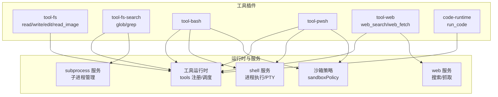
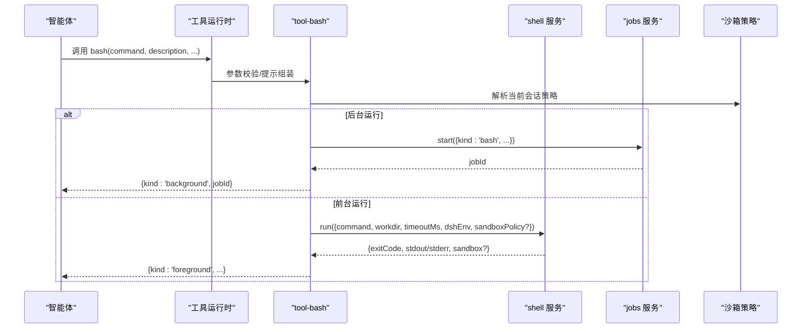
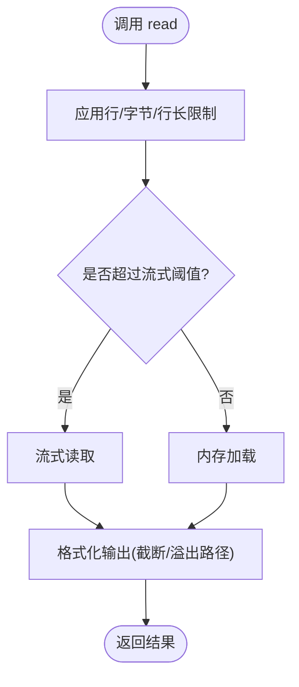
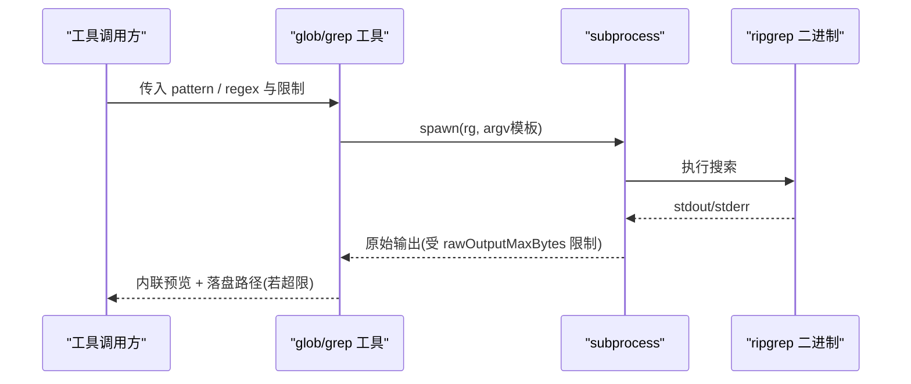
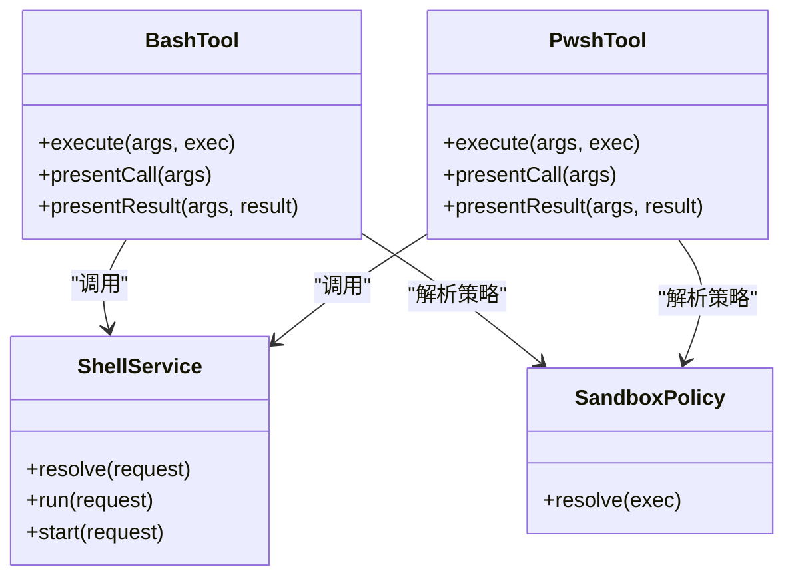
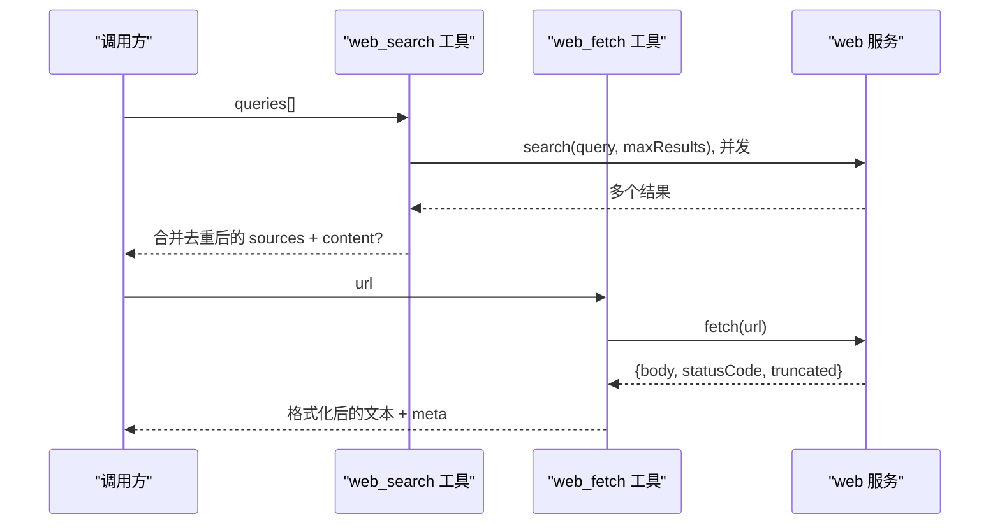
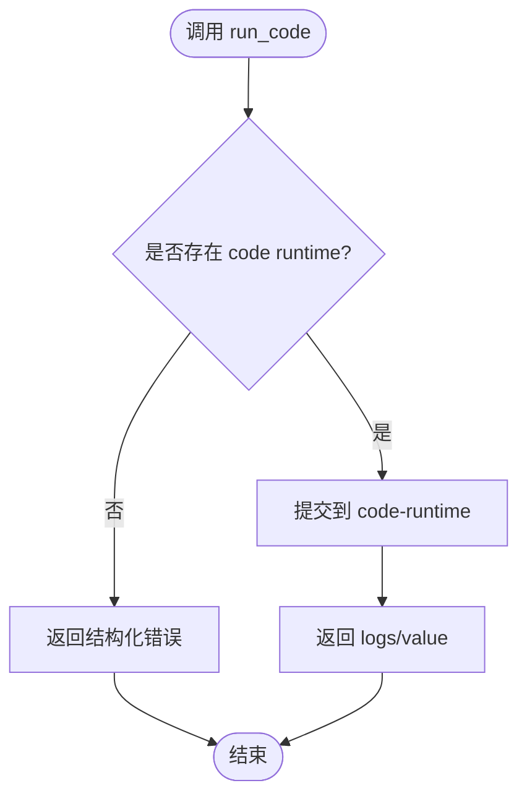
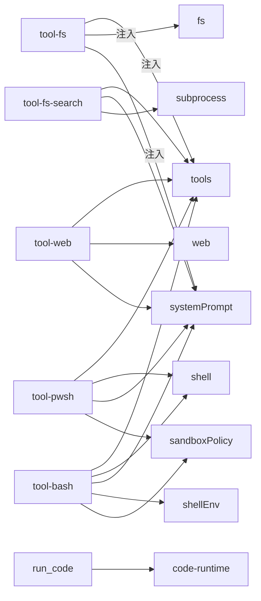

# 内置工具集

<cite>
**本文引用的文件**
- [packages/fs/tool-fs/src/index.ts](file://packages/fs/tool-fs/src/index.ts)
- [packages/fs/tool-fs-search/src/index.ts](file://packages/fs/tool-fs-search/src/index.ts)
- [packages/shell/tool-bash/src/index.ts](file://packages/shell/tool-bash/src/index.ts)
- [packages/shell/tool-pwsh/src/index.ts](file://packages/shell/tool-pwsh/src/index.ts)
- [packages/web/tool-web/src/index.ts](file://packages/web/tool-web/src/index.ts)
- [packages/web/tool-web/src/search.ts](file://packages/web/tool-web/src/search.ts)
- [packages/web/tool-web/src/fetch.ts](file://packages/web/tool-web/src/fetch.ts)
- [packages/core/tools/tests/code-mode.spec.ts](file://packages/core/tools/tests/code-mode.spec.ts)
</cite>

## 目录
1. [简介](#简介)
2. [项目结构](#项目结构)
3. [核心组件](#核心组件)
4. [架构总览](#架构总览)
5. [详细组件分析](#详细组件分析)
6. [依赖关系分析](#依赖关系分析)
7. [性能考虑](#性能考虑)
8. [故障排除指南](#故障排除指南)
9. [结论](#结论)
10. [附录：参数与返回值速查](#附录参数与返回值速查)

## 简介
本文件系统化梳理 DeepSeek Harness 提供的内置工具集，覆盖文件系统操作（read、write、edit、glob、grep）、Shell 命令执行（bash、pwsh）、网络请求（web_search、web_fetch）以及代码执行（run_code）。文档聚焦于每个工具的参数规格、返回值格式、安全限制与沙箱机制、组合使用模式与最佳实践，并给出常见工作流示例与故障排除建议。

## 项目结构
内置工具以插件形式注册到统一的工具运行时中，按能力域分属不同包：
- 文件系统工具：tool-fs（读/写/编辑/图片读取），tool-fs-search（基于 ripgrep 的 glob/grep）
- Shell 工具：tool-bash（Bash）、tool-pwsh（PowerShell）
- 网络工具：tool-web（web_search、web_fetch）
- 代码执行：通过 code-runtime 暴露 run_code 工具（由 core 工具层集成）

图表来源
- [packages/fs/tool-fs/src/index.ts:1-80](file://packages/fs/tool-fs/src/index.ts#L1-L80)
- [packages/fs/tool-fs-search/src/index.ts:66-161](file://packages/fs/tool-fs-search/src/index.ts#L66-L161)
- [packages/shell/tool-bash/src/index.ts:190-395](file://packages/shell/tool-bash/src/index.ts#L190-L395)
- [packages/shell/tool-pwsh/src/index.ts:245-272](file://packages/shell/tool-pwsh/src/index.ts#L245-L272)
- [packages/web/tool-web/src/index.ts:20-96](file://packages/web/tool-web/src/index.ts#L20-L96)
- [packages/core/tools/tests/code-mode.spec.ts:301-310](file://packages/core/tools/tests/code-mode.spec.ts#L301-L310)

章节来源
- [packages/fs/tool-fs/src/index.ts:1-80](file://packages/fs/tool-fs/src/index.ts#L1-L80)
- [packages/fs/tool-fs-search/src/index.ts:66-161](file://packages/fs/tool-fs-search/src/index.ts#L66-L161)
- [packages/shell/tool-bash/src/index.ts:190-395](file://packages/shell/tool-bash/src/index.ts#L190-L395)
- [packages/shell/tool-pwsh/src/index.ts:245-272](file://packages/shell/tool-pwsh/src/index.ts#L245-L272)
- [packages/web/tool-web/src/index.ts:20-96](file://packages/web/tool-web/src/index.ts#L20-L96)
- [packages/core/tools/tests/code-mode.spec.ts:301-310](file://packages/core/tools/tests/code-mode.spec.ts#L301-L310)

## 核心组件
- 文件系统工具（tool-fs）
  - read：带行/字节/行长限制的文本读取，支持流式处理大文件
  - write/edit：受沙箱控制器保护的文件写入/编辑
  - read_image：在挂载附件存储时可用
- 文件系统搜索（tool-fs-search）
  - glob：基于 ripgrep 的模式匹配，结果可落盘并分页
  - grep：内容搜索，匹配分组预览与落盘通知
- Shell 工具
  - bash：执行 bash -c，支持前台/后台任务、超时、工作目录、沙箱升级
  - pwsh：与 bash 对齐的 PowerShell 执行体验，平台相关行为一致化
- 网络工具（tool-web）
  - web_search：并发多查询合并去重，返回摘要与来源列表
  - web_fetch：HTTP(S) 抓取，HTML→Markdown 转换，输出字符上限控制
- 代码执行（run_code）
  - 在 code 模式下通过 code-runtime 执行 TypeScript/JS 片段，提供绑定函数调用能力

章节来源
- [packages/fs/tool-fs/src/index.ts:21-79](file://packages/fs/tool-fs/src/index.ts#L21-L79)
- [packages/fs/tool-fs-search/src/index.ts:72-161](file://packages/fs/tool-fs-search/src/index.ts#L72-L161)
- [packages/shell/tool-bash/src/index.ts:33-395](file://packages/shell/tool-bash/src/index.ts#L33-L395)
- [packages/shell/tool-pwsh/src/index.ts:245-272](file://packages/shell/tool-pwsh/src/index.ts#L245-L272)
- [packages/web/tool-web/src/index.ts:20-96](file://packages/web/tool-web/src/index.ts#L20-L96)
- [packages/core/tools/tests/code-mode.spec.ts:301-310](file://packages/core/tools/tests/code-mode.spec.ts#L301-L310)

## 架构总览
工具统一通过工具运行时注册与调度，各工具插件负责参数校验、提示词引导、结果格式化与呈现元数据；具体能力通过服务 seam（fs、shell、web、subprocess、codeRuntime）实现。

图表来源
- [packages/shell/tool-bash/src/index.ts:190-395](file://packages/shell/tool-bash/src/index.ts#L190-L395)

章节来源
- [packages/shell/tool-bash/src/index.ts:190-395](file://packages/shell/tool-bash/src/index.ts#L190-L395)

## 详细组件分析

### 文件系统工具（read/write/edit/read_image）
- 参数规格
  - read：readLimit、readMaxLineLength、readMaxBytes、readStreamMinSize（配置项）
  - write/edit：受 FsSandboxController 保护，遵循 per-call 策略
  - read_image：需挂载 attachments 能力
- 返回值
  - read：文本块，含截断标记与溢出路径（如适用）
  - write/edit：成功/失败状态与受影响路径
- 安全与沙箱
  - 通过 FsSandboxController 对写入/编辑进行策略判定与拒绝标记
  - 读取走 fs 提供者，受部署端 fs 后端约束（本地/远程/沙箱）

图表来源
- [packages/fs/tool-fs/src/index.ts:24-79](file://packages/fs/tool-fs/src/index.ts#L24-L79)

章节来源
- [packages/fs/tool-fs/src/index.ts:24-79](file://packages/fs/tool-fs/src/index.ts#L24-L79)

### 文件系统搜索（glob/grep）
- 参数规格
  - glob：sampleOverCapGlobResults、globMaxResults、rawOutputMaxBytes、graceMs、stderrMaxBytes、timeoutMs
  - grep：grepMaxMatches、grepMaxLineBytes、rawOutputMaxBytes、graceMs、stderrMaxBytes、timeoutMs
- 返回值
  - glob：内联路径前 N 条 + 完整结果落盘通知（可选）
  - grep：分组匹配预览 + 完整结果落盘通知（可选）
- 安全与限制
  - 通过 subprocess 直接调用打包的 ripgrep，不经过 shell
  - 严格限制原始输出大小与 stderr 保留长度，避免资源滥用
  - 超时与优雅终止（graceMs）由子进程服务保证

图表来源
- [packages/fs/tool-fs-search/src/index.ts:66-161](file://packages/fs/tool-fs-search/src/index.ts#L66-L161)

章节来源
- [packages/fs/tool-fs-search/src/index.ts:66-161](file://packages/fs/tool-fs-search/src/index.ts#L66-L161)

### Shell 命令执行（bash/pwsh）
- 参数规格
  - bash：command、description、timeoutMs、workdir、run_in_background、sandbox_permissions、justification
  - pwsh：与 bash 对齐的参数表面（command、description、timeoutMs、workdir、run_in_background、sandbox_permissions、justification）
- 返回值
  - 前台：{kind:'foreground', exitCode, signal, timedOut, aborted, timeoutMs, stdout/stderr{text,truncated,spillPath}, sandbox?}
  - 后台：{kind:'background', jobId}
- 安全与沙箱
  - 当 executor 声明沙箱模式时，自动注入 standing policy，必要时通过 approval 流程进行一次性升级
  - 非零退出码以 [exit code: N] 标记提示；Windows 上被杀进程表现为 exit 1 无信号标记
  - 环境变量通过 DSH_* 键暴露给子进程

图表来源
- [packages/shell/tool-bash/src/index.ts:190-395](file://packages/shell/tool-bash/src/index.ts#L190-L395)
- [packages/shell/tool-pwsh/src/index.ts:245-272](file://packages/shell/tool-pwsh/src/index.ts#L245-L272)

章节来源
- [packages/shell/tool-bash/src/index.ts:190-395](file://packages/shell/tool-bash/src/index.ts#L190-L395)
- [packages/shell/tool-pwsh/src/index.ts:245-272](file://packages/shell/tool-pwsh/src/index.ts#L245-L272)

### 网络请求（web_search/web_fetch）
- 参数规格
  - web_search：queries（1–N，默认最多 4），searchMaxResults（默认 8），searchTimeoutMs
  - web_fetch：url，fetchTimeoutMs，fetchMaxOutputChars（默认 200000）
- 返回值
  - web_search：{content?, sources[], truncated}
  - web_fetch：{url, statusCode, body:{kind:'html'|'text', content}, truncated}
- 安全与限制
  - 并发查询合并去重，单条失败中止同批其他查询
  - HTML→Markdown 转换深度限制（MAX_CONVERSION_DEPTH=512），防止恶意嵌套导致阻塞
  - 输出字符上限控制，避免渲染过大内容

图表来源
- [packages/web/tool-web/src/search.ts:219-377](file://packages/web/tool-web/src/search.ts#L219-L377)
- [packages/web/tool-web/src/fetch.ts:419-496](file://packages/web/tool-web/src/fetch.ts#L419-L496)
- [packages/web/tool-web/src/index.ts:20-96](file://packages/web/tool-web/src/index.ts#L20-L96)

章节来源
- [packages/web/tool-web/src/search.ts:219-377](file://packages/web/tool-web/src/search.ts#L219-L377)
- [packages/web/tool-web/src/fetch.ts:419-496](file://packages/web/tool-web/src/fetch.ts#L419-L496)
- [packages/web/tool-web/src/index.ts:20-96](file://packages/web/tool-web/src/index.ts#L20-L96)

### 代码执行（run_code）
- 参数规格
  - code：要执行的程序文本
  - description：卡片标题（模型侧描述）
- 返回值
  - 成功：包含日志与返回值（由 runtime 决定）
  - 失败：结构化 isError，提示缺少 code runtime 等
- 安全与隔离
  - 在 code 模式下启用，依赖 code-runtime 提供执行环境
  - 未挂载 code runtime 时返回结构化错误而非崩溃

图表来源
- [packages/core/tools/tests/code-mode.spec.ts:1276-1295](file://packages/core/tools/tests/code-mode.spec.ts#L1276-L1295)

章节来源
- [packages/core/tools/tests/code-mode.spec.ts:1276-1295](file://packages/core/tools/tests/code-mode.spec.ts#L1276-L1295)

## 依赖关系分析
- tool-fs 依赖 tools、fs、systemPrompt，并在有 attachments 时注册 read_image
- tool-fs-search 依赖 tools、systemPrompt、subprocess，独立于 ctx.fs
- tool-bash/tool-pwsh 依赖 tools、shell、systemPrompt、shellEnv，必要时依赖 jobs 与 sandboxPolicy
- tool-web 依赖 tools、web、systemPrompt，通过配置开关注册 web_search/web_fetch
- run_code 依赖 code-runtime（在 code 模式下）

图表来源
- [packages/fs/tool-fs/src/index.ts:18-23](file://packages/fs/tool-fs/src/index.ts#L18-L23)
- [packages/fs/tool-fs-search/src/index.ts:66-71](file://packages/fs/tool-fs-search/src/index.ts#L66-L71)
- [packages/shell/tool-bash/src/index.ts:30-32](file://packages/shell/tool-bash/src/index.ts#L30-L32)
- [packages/shell/tool-pwsh/src/index.ts:245-272](file://packages/shell/tool-pwsh/src/index.ts#L245-L272)
- [packages/web/tool-web/src/index.ts:20-25](file://packages/web/tool-web/src/index.ts#L20-L25)
- [packages/core/tools/tests/code-mode.spec.ts:301-310](file://packages/core/tools/tests/code-mode.spec.ts#L301-L310)

章节来源
- [packages/fs/tool-fs/src/index.ts:18-23](file://packages/fs/tool-fs/src/index.ts#L18-L23)
- [packages/fs/tool-fs-search/src/index.ts:66-71](file://packages/fs/tool-fs-search/src/index.ts#L66-L71)
- [packages/shell/tool-bash/src/index.ts:30-32](file://packages/shell/tool-bash/src/index.ts#L30-L32)
- [packages/shell/tool-pwsh/src/index.ts:245-272](file://packages/shell/tool-pwsh/src/index.ts#L245-L272)
- [packages/web/tool-web/src/index.ts:20-25](file://packages/web/tool-web/src/index.ts#L20-L25)
- [packages/core/tools/tests/code-mode.spec.ts:301-310](file://packages/core/tools/tests/code-mode.spec.ts#L301-L310)

## 性能考虑
- 文件系统读取
  - 大文件采用流式读取，避免整文件载入内存
  - 合理设置 readLimit、readMaxBytes、readMaxLineLength 控制输出体积
- 搜索工具
  - glob/grep 的 rawOutputMaxBytes、stderrMaxBytes 限制原始输出与错误信息大小
  - graceMs 控制终止宽限期，避免长时间占用
- Shell 执行
  - 前台命令设置 timeoutMs；后台命令通过 job 生命周期管理
  - 利用 spillPath 获取长输出，减少主响应体积
- 网络工具
  - web_search 并发查询合并去重，searchMaxResults 控制结果规模
  - web_fetch 的 fetchMaxOutputChars 限制最终输出字符数；HTML 转换深度限制防阻塞

[本节为通用指导，无需特定文件引用]

## 故障排除指南
- bash/pwsh 命令失败
  - 检查 [exit code: N] 标记；Windows 下被杀进程表现为 exit 1 无信号
  - 若被沙箱拒绝，查看 [sandbox: file access denied under <mode> mode]，必要时在同一轮进行一次性的升级重试（附带 justification）
- 搜索/抓取超时或无结果
  - web_search：确认 queries 非空且不超过上限；检查 provider 可用性
  - web_fetch：确认 URL 有效；注意 truncated 标志，必要时缩小抓取范围
- 代码执行失败
  - 缺少 code runtime 会返回结构化错误；确保在 code 模式下正确挂载 runtime
- 搜索/抓取输出过大
  - 调整 searchMaxResults、fetchMaxOutputChars；或使用更具体的 URL/查询

章节来源
- [packages/shell/tool-bash/src/index.ts:70-93](file://packages/shell/tool-bash/src/index.ts#L70-L93)
- [packages/shell/tool-pwsh/src/index.ts:245-250](file://packages/shell/tool-pwsh/src/index.ts#L245-L250)
- [packages/web/tool-web/src/search.ts:30-52](file://packages/web/tool-web/src/search.ts#L30-L52)
- [packages/web/tool-web/src/fetch.ts:79-102](file://packages/web/tool-web/src/fetch.ts#L79-L102)
- [packages/core/tools/tests/code-mode.spec.ts:1288-1295](file://packages/core/tools/tests/code-mode.spec.ts#L1288-L1295)

## 结论
内置工具集围绕“最小必要权限”和“可观测性”设计：文件系统读写受沙箱保护，搜索/抓取具备严格的输出与超时控制，Shell 执行支持前台/后台与策略升级，代码执行在隔离环境中运行。通过合理的参数配置与组合使用，可以构建高效、安全的工作流。

[本节为总结，无需特定文件引用]

## 附录：参数与返回值速查
- read
  - 参数：readLimit、readMaxLineLength、readMaxBytes、readStreamMinSize（配置）
  - 返回：文本块（可能截断/溢出）
- write/edit
  - 参数：目标路径、内容、模式（受沙箱控制）
  - 返回：成功/失败与影响范围
- glob/grep
  - 参数：pattern/regex、各类上限与超时
  - 返回：内联预览 + 落盘路径（可选）
- bash/pwsh
  - 参数：command、description、timeoutMs、workdir、run_in_background、sandbox_permissions、justification
  - 返回：前台/后台结果对象（含 stdout/stderr、sandbox 信息）
- web_search
  - 参数：queries[]、searchMaxResults、searchTimeoutMs
  - 返回：{content?, sources[], truncated}
- web_fetch
  - 参数：url、fetchTimeoutMs、fetchMaxOutputChars
  - 返回：{url, statusCode, body:{kind,content}, truncated}
- run_code
  - 参数：code、description
  - 返回：logs/value 或结构化错误

章节来源
- [packages/fs/tool-fs/src/index.ts:24-79](file://packages/fs/tool-fs/src/index.ts#L24-L79)
- [packages/fs/tool-fs-search/src/index.ts:72-161](file://packages/fs/tool-fs-search/src/index.ts#L72-L161)
- [packages/shell/tool-bash/src/index.ts:33-395](file://packages/shell/tool-bash/src/index.ts#L33-L395)
- [packages/shell/tool-pwsh/src/index.ts:245-272](file://packages/shell/tool-pwsh/src/index.ts#L245-L272)
- [packages/web/tool-web/src/index.ts:36-96](file://packages/web/tool-web/src/index.ts#L36-L96)
- [packages/web/tool-web/src/search.ts:25-52](file://packages/web/tool-web/src/search.ts#L25-L52)
- [packages/web/tool-web/src/fetch.ts:79-102](file://packages/web/tool-web/src/fetch.ts#L79-L102)
- [packages/core/tools/tests/code-mode.spec.ts:301-310](file://packages/core/tools/tests/code-mode.spec.ts#L301-L310)