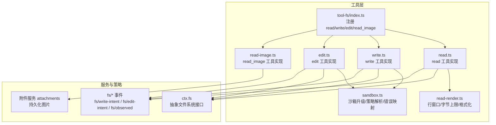
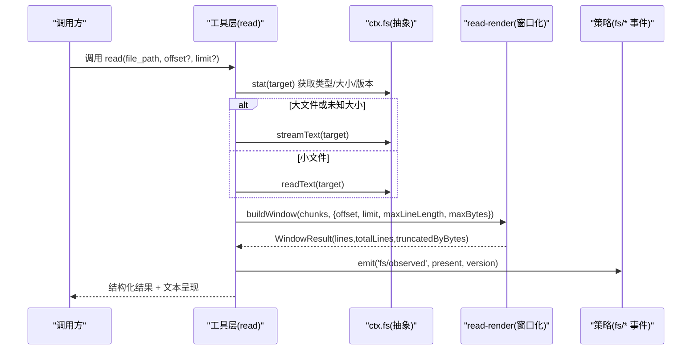
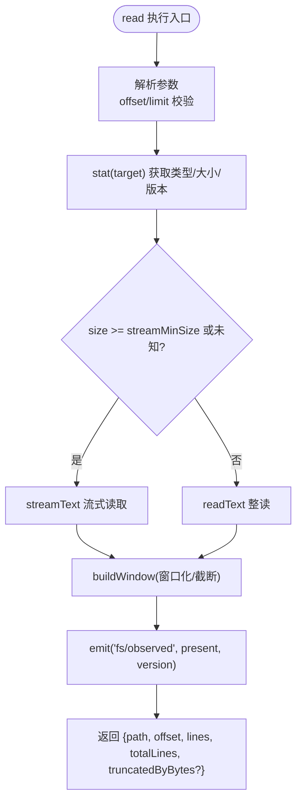
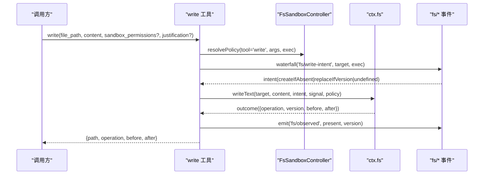
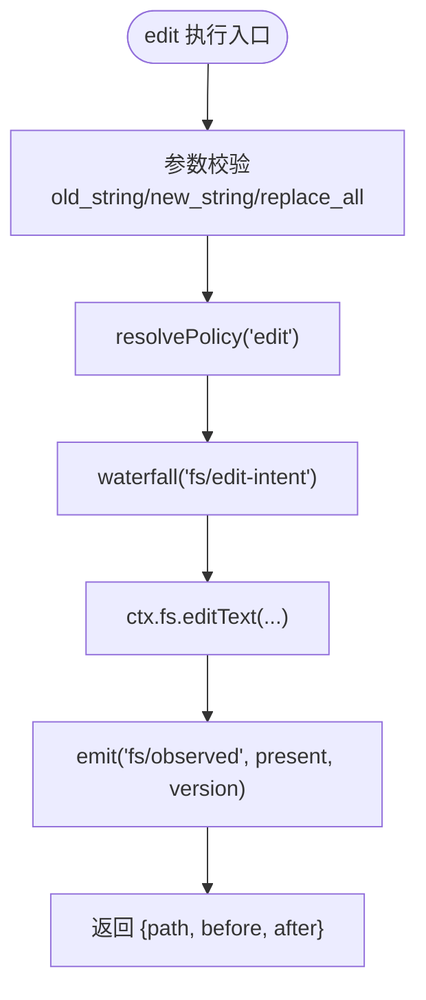
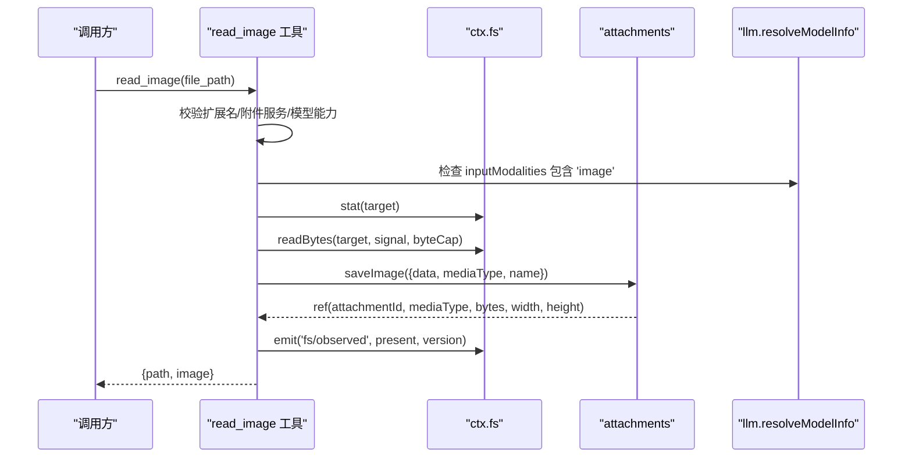
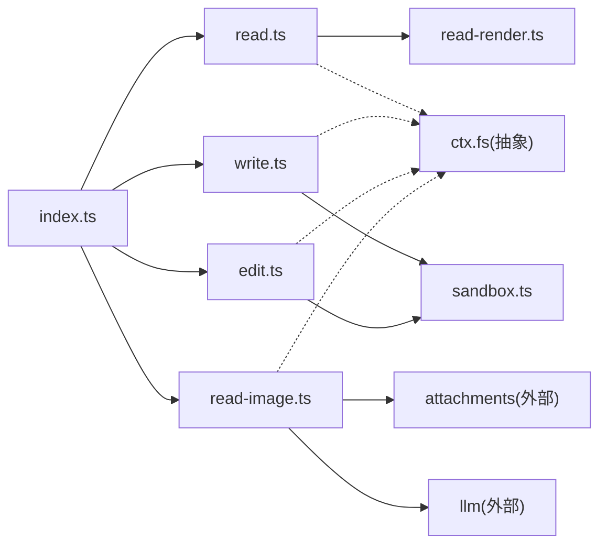

# 文件系统工具

<cite>
**本文引用的文件**
- [packages/fs/tool-fs/src/index.ts](file://packages/fs/tool-fs/src/index.ts)
- [packages/fs/tool-fs/src/read.ts](file://packages/fs/tool-fs/src/read.ts)
- [packages/fs/tool-fs/src/write.ts](file://packages/fs/tool-fs/src/write.ts)
- [packages/fs/tool-fs/src/edit.ts](file://packages/fs/tool-fs/src/edit.ts)
- [packages/fs/tool-fs/src/read-image.ts](file://packages/fs/tool-fs/src/read-image.ts)
- [packages/fs/tool-fs/src/read-render.ts](file://packages/fs/tool-fs/src/read-render.ts)
- [packages/fs/tool-fs/src/sandbox.ts](file://packages/fs/tool-fs/src/sandbox.ts)
- [docs/subsystems/filesystem.md](file://docs/subsystems/filesystem.md)
- [packages/fs/fs-sandbox/README.md](file://packages/fs/fs-sandbox/README.md)
</cite>

## 目录
1. [简介](#简介)
2. [项目结构](#项目结构)
3. [核心组件](#核心组件)
4. [架构总览](#架构总览)
5. [详细组件分析](#详细组件分析)
6. [依赖关系分析](#依赖关系分析)
7. [性能与限制](#性能与限制)
8. [故障排除指南](#故障排除指南)
9. [结论](#结论)
10. [附录：参数与返回值速查](#附录参数与返回值速查)

## 简介
本文件面向使用“文件系统工具”的开发者与使用者，系统性说明内置的文件操作工具：read（读取文本）、write（写入文本）、edit（编辑文本）和 read_image（读取图片）。文档涵盖各工具的参数规格、返回值格式、配置项（如 readLimit、readMaxLineLength、readMaxBytes）的作用与影响、沙箱安全机制（权限控制、访问限制、错误处理），并提供完整的使用示例与排错建议。

## 项目结构
文件系统工具位于 packages/fs/tool-fs 包中，负责对外暴露模型可调用的一族工具；底层通过 ctx.fs 抽象与具体后端解耦；读渲染、窗口化、沙箱策略等能力由同包内模块提供。

图表来源
- [packages/fs/tool-fs/src/index.ts:1-80](file://packages/fs/tool-fs/src/index.ts#L1-L80)
- [packages/fs/tool-fs/src/read.ts:69-209](file://packages/fs/tool-fs/src/read.ts#L69-L209)
- [packages/fs/tool-fs/src/write.ts:62-151](file://packages/fs/tool-fs/src/write.ts#L62-L151)
- [packages/fs/tool-fs/src/edit.ts:76-169](file://packages/fs/tool-fs/src/edit.ts#L76-L169)
- [packages/fs/tool-fs/src/read-image.ts:129-241](file://packages/fs/tool-fs/src/read-image.ts#L129-L241)
- [packages/fs/tool-fs/src/read-render.ts:1-273](file://packages/fs/tool-fs/src/read-render.ts#L1-L273)
- [packages/fs/tool-fs/src/sandbox.ts:1-132](file://packages/fs/tool-fs/src/sandbox.ts#L1-L132)

章节来源
- [packages/fs/tool-fs/src/index.ts:1-80](file://packages/fs/tool-fs/src/index.ts#L1-L80)
- [docs/subsystems/filesystem.md:1-10](file://docs/subsystems/filesystem.md#L1-L10)

## 核心组件
- read：读取 UTF-8 文本文件，支持分页（offset/limit）、行长度截断、输出字节上限、流式读取大文件，返回带行号的窗口结果。
- write：创建或覆盖 UTF-8 文本文件，支持沙箱升级字段（在受限环境下），返回 before/after 差异元数据用于 UI 展示。
- edit：对已有文本进行字面量替换，默认要求唯一匹配，可选 replace_all；同样支持沙箱升级与版本守卫。
- read_image：读取 PNG/JPEG/WebP/GIF 图片，校验扩展名与媒体类型，经附件服务持久化后返回图片块，进入模型上下文。

章节来源
- [packages/fs/tool-fs/src/read.ts:69-209](file://packages/fs/tool-fs/src/read.ts#L69-L209)
- [packages/fs/tool-fs/src/write.ts:62-151](file://packages/fs/tool-fs/src/write.ts#L62-L151)
- [packages/fs/tool-fs/src/edit.ts:76-169](file://packages/fs/tool-fs/src/edit.ts#L76-L169)
- [packages/fs/tool-fs/src/read-image.ts:129-241](file://packages/fs/tool-fs/src/read-image.ts#L129-L241)

## 架构总览
工具层通过 ctx.fs 抽象与后端解耦；读路径根据文件大小选择整读或流式；写/改路径通过 fs/* 事件水线决定是否加守卫；图片读取需挂载附件服务并校验当前模型路由是否支持图像输入。

图表来源
- [packages/fs/tool-fs/src/read.ts:136-163](file://packages/fs/tool-fs/src/read.ts#L136-L163)
- [packages/fs/tool-fs/src/read-render.ts:111-144](file://packages/fs/tool-fs/src/read-render.ts#L111-L144)
- [docs/subsystems/filesystem.md:181-196](file://docs/subsystems/filesystem.md#L181-L196)

## 详细组件分析

### read 工具
- 作用：读取 UTF-8 文本，返回按行号编号的窗口内容。
- 关键参数
  - file_path：必填，字符串。
  - offset：可选，正整数，1-based 起始行，默认 1。
  - limit：可选，正整数，最大返回行数，默认受插件配置 readLimit 约束。
- 行为要点
  - 先 stat 一次，区分存在性/类型/大小；大文件或未知大小走 streamText 避免内存膨胀。
  - 行窗口构建时应用 maxLineLength（单行字符上限）与 maxBytes（选中输出的字节上限）。
  - 若 offset 超出范围，抛出 FS_NOT_FOUND。
  - 成功后记录 fs/observed(present, version)。
- 返回值
  - path：显示路径
  - offset：起始行
  - lines：[{number, text}]
  - totalLines：文件总行数
  - truncatedByBytes：当达到字节上限时为 true（提示继续读取）
- 系统提示与展示
  - 系统提示引导使用 read 而非 shell 命令查看文本。
  - 结果可被 UI 渲染为带语言高亮的代码卡片。

图表来源
- [packages/fs/tool-fs/src/read.ts:56-62](file://packages/fs/tool-fs/src/read.ts#L56-L62)
- [packages/fs/tool-fs/src/read.ts:136-163](file://packages/fs/tool-fs/src/read.ts#L136-L163)
- [packages/fs/tool-fs/src/read-render.ts:111-144](file://packages/fs/tool-fs/src/read-render.ts#L111-L144)

章节来源
- [packages/fs/tool-fs/src/read.ts:15-22](file://packages/fs/tool-fs/src/read.ts#L15-L22)
- [packages/fs/tool-fs/src/read.ts:56-62](file://packages/fs/tool-fs/src/read.ts#L56-L62)
- [packages/fs/tool-fs/src/read.ts:69-209](file://packages/fs/tool-fs/src/read.ts#L69-L209)
- [packages/fs/tool-fs/src/read-render.ts:10-14](file://packages/fs/tool-fs/src/read-render.ts#L10-L14)
- [packages/fs/tool-fs/src/read-render.ts:152-170](file://packages/fs/tool-fs/src/read-render.ts#L152-L170)

### write 工具
- 作用：创建或完全覆盖 UTF-8 文本文件。
- 关键参数
  - file_path：必填，非空字符串。
  - content：必填，UTF-8 文本。
  - sandbox_permissions / justification：仅在启用沙箱后端时出现，用于申请更宽权限的一次性重试。
- 行为要点
  - 解析沙箱策略（standing policy 或经审批的升级模式）。
  - 通过 fs/write-intent 水线决定是否加守卫（例如 createIfAbsent/replaceIfVersion）。
  - 调用 ctx.fs.writeText 原子写入，捕获并转换错误（包括沙箱拒绝）。
  - 记录 fs/observed(present, version)。
- 返回值
  - path：显示路径
  - operation：'create' | 'update'
  - before：写入前内容（不存在则为 null）
  - after：写入后内容
- 展示
  - 以 diff 卡片形式呈现新旧内容差异。

图表来源
- [packages/fs/tool-fs/src/write.ts:102-128](file://packages/fs/tool-fs/src/write.ts#L102-L128)
- [packages/fs/tool-fs/src/sandbox.ts:87-108](file://packages/fs/tool-fs/src/sandbox.ts#L87-L108)
- [docs/subsystems/filesystem.md:114-149](file://docs/subsystems/filesystem.md#L114-L149)

章节来源
- [packages/fs/tool-fs/src/write.ts:25-28](file://packages/fs/tool-fs/src/write.ts#L25-L28)
- [packages/fs/tool-fs/src/write.ts:62-151](file://packages/fs/tool-fs/src/write.ts#L62-L151)
- [packages/fs/tool-fs/src/sandbox.ts:20-30](file://packages/fs/tool-fs/src/sandbox.ts#L20-L30)
- [docs/subsystems/filesystem.md:114-149](file://docs/subsystems/filesystem.md#L114-L149)

### edit 工具
- 作用：对已有文本进行字面量替换，默认要求 old_string 唯一匹配，可选 replace_all。
- 关键参数
  - file_path：必填，非空字符串。
  - old_string：必填，非空且与 new_string 不同。
  - new_string：必填，可为空表示删除匹配。
  - replace_all：可选，是否替换所有匹配。
  - sandbox_permissions / justification：同上，沙箱升级字段。
- 行为要点
  - 解析沙箱策略，通过 fs/edit-intent 水线决定是否携带版本守卫。
  - 调用 ctx.fs.editText 原子编辑，捕获并转换错误（含沙箱拒绝）。
  - 记录 fs/observed(present, version)。
- 返回值
  - path：显示路径
  - before：编辑前内容
  - after：编辑后内容
- 展示
  - 以 diff 卡片呈现替换前后差异。

图表来源
- [packages/fs/tool-fs/src/edit.ts:47-57](file://packages/fs/tool-fs/src/edit.ts#L47-L57)
- [packages/fs/tool-fs/src/edit.ts:112-146](file://packages/fs/tool-fs/src/edit.ts#L112-L146)

章节来源
- [packages/fs/tool-fs/src/edit.ts:18-38](file://packages/fs/tool-fs/src/edit.ts#L18-L38)
- [packages/fs/tool-fs/src/edit.ts:76-169](file://packages/fs/tool-fs/src/edit.ts#L76-L169)

### read_image 工具
- 作用：读取 PNG/JPEG/WebP/GIF 图片，经附件服务持久化后返回图片块，使图片进入模型上下文。
- 关键参数
  - file_path：必填，非空字符串，扩展名需为支持的图片类型。
- 前置校验
  - 扩展名到媒体类型的映射校验。
  - 必须挂载 attachments 服务。
  - 当前模型路由必须声明支持 image 输入。
- 行为要点
  - 先 stat 目标，再按 min(attachments.imageLimits.maxImageBytes, maxMessageImageBytes) 作为字节上限读取。
  - 保存至附件服务，失败时针对维度/像素/类型不匹配给出明确错误。
  - 记录 fs/observed(present, version)。
- 返回值
  - path：显示路径
  - image：{attachmentId, mediaType, bytes, width, height, name?}
- 展示
  - 同时返回文本摘要与图片块。

图表来源
- [packages/fs/tool-fs/src/read-image.ts:63-75](file://packages/fs/tool-fs/src/read-image.ts#L63-L75)
- [packages/fs/tool-fs/src/read-image.ts:162-227](file://packages/fs/tool-fs/src/read-image.ts#L162-L227)

章节来源
- [packages/fs/tool-fs/src/read-image.ts:24-53](file://packages/fs/tool-fs/src/read-image.ts#L24-L53)
- [packages/fs/tool-fs/src/read-image.ts:129-241](file://packages/fs/tool-fs/src/read-image.ts#L129-L241)

## 依赖关系分析
- tool-fs/index.ts 聚合注册四个工具，注入 tools/fs/systemPrompt，并基于配置 applyReadTool/applyWriteTool/applyEditTool/applyReadImageTool。
- read 依赖 read-render 做窗口化与格式化；write/edit 依赖 sandbox 做策略解析与错误映射；read_image 依赖 attachments 与 llm 能力探测。
- 所有工具均通过 ctx.fs 抽象与后端解耦，并通过 fs/* 事件与策略插件交互。

图表来源
- [packages/fs/tool-fs/src/index.ts:11-16](file://packages/fs/tool-fs/src/index.ts#L11-L16)
- [packages/fs/tool-fs/src/read.ts:12-13](file://packages/fs/tool-fs/src/read.ts#L12-L13)
- [packages/fs/tool-fs/src/write.ts:14-17](file://packages/fs/tool-fs/src/write.ts#L14-L17)
- [packages/fs/tool-fs/src/edit.ts:13-16](file://packages/fs/tool-fs/src/edit.ts#L13-L16)
- [packages/fs/tool-fs/src/read-image.ts:14-22](file://packages/fs/tool-fs/src/read-image.ts#L14-L22)

章节来源
- [packages/fs/tool-fs/src/index.ts:1-80](file://packages/fs/tool-fs/src/index.ts#L1-L80)

## 性能与限制
- 读取限制
  - readLimit：单次 read 返回的最大行数（也是默认 limit），防止一次性输出过大。
  - readMaxLineLength：单行最大字符数，超过会被截断并附加提示。
  - readMaxBytes：选中行的输出字节上限，达到后会停止累积并标记 truncatedByBytes。
  - readStreamMinSize：大于等于该阈值则走流式读取，避免大文件整读导致内存占用过高。
- 大文件处理
  - 当 size 未知或大于等于 readStreamMinSize 时，采用 streamText 分块消费，配合窗口化保证内存可控。
- 图片读取限制
  - 字节上限取 min(maxImageBytes, maxMessageImageBytes)，防止消息体过大。
  - 维度/像素/类型不匹配会直接报错，避免污染会话历史。

章节来源
- [packages/fs/tool-fs/src/index.ts:25-41](file://packages/fs/tool-fs/src/index.ts#L25-L41)
- [packages/fs/tool-fs/src/read.ts:15-22](file://packages/fs/tool-fs/src/read.ts#L15-L22)
- [packages/fs/tool-fs/src/read-render.ts:10-14](file://packages/fs/tool-fs/src/read-render.ts#L10-L14)
- [packages/fs/tool-fs/src/read-image.ts:182-185](file://packages/fs/tool-fs/src/read-image.ts#L182-L185)

## 故障排除指南
- 常见错误码与含义
  - FS_NOT_FOUND：文件不存在或 offset 越界。
  - FS_NOT_TEXT：尝试读取二进制文件。
  - FS_TOO_LARGE：原始字节超过 readBytes 的上限。
  - FS_PERMISSION_DENIED：宿主内核拒绝访问。
  - FS_SANDBOX_DENIED：沙箱策略拒绝访问（见下文）。
  - FS_STALE_VERSION：版本守卫失败（并发修改）。
  - FS_NOT_OBSERVED：未观测到目标（策略要求先读再写/改）。
- 沙箱相关
  - 当后端启用沙箱时，write/edit 可能因权限不足被拒绝；此时可通过 sandbox_permissions 与 justification 申请一次更宽权限的重试，需用户审批。
  - 拒绝信息会统一转换为带有 [sandbox: …] 标记的错误，便于模型识别并提示重试。
- 排查步骤
  - 确认文件路径与权限是否正确。
  - 若 read 报 FS_NOT_TEXT，请改用 read_image 或二进制读取方式。
  - 若 write/edit 报 FS_SANDBOX_DENIED，检查当前沙箱模式与工作区根，必要时提交升级请求。
  - 若 read 报 offset 越界，调整 offset 或使用 limit 分页。
  - 若 read_image 报维度/像素/类型错误，缩小图片尺寸或修正扩展名与实际格式一致。

章节来源
- [docs/subsystems/filesystem.md:244-268](file://docs/subsystems/filesystem.md#L244-L268)
- [packages/fs/tool-fs/src/sandbox.ts:110-130](file://packages/fs/tool-fs/src/sandbox.ts#L110-L130)
- [packages/fs/fs-sandbox/README.md:19-31](file://packages/fs/fs-sandbox/README.md#L19-L31)

## 结论
文件系统工具通过统一的工具层与抽象文件系统接口，提供了安全、可控且可扩展的读写能力。read 支持分页与多种限制，write/edit 支持沙箱策略与版本守卫，read_image 将图片安全地纳入模型上下文。合理配置 readLimit、readMaxLineLength、readMaxBytes 与 readStreamMinSize，可在性能与安全之间取得平衡。遇到权限或容量问题时，依据错误码与沙箱提示进行定位与修复。

## 附录：参数与返回值速查
- read
  - 参数：file_path(string), offset?(number), limit?(number)
  - 返回：{path, offset, lines:[{number,text}], totalLines, truncatedByBytes?}
- write
  - 参数：file_path(string), content(string), sandbox_permissions?(string), justification?(string)
  - 返回：{path, operation:'create'|'update', before:string|null, after:string}
- edit
  - 参数：file_path(string), old_string(string), new_string(string), replace_all?(boolean), sandbox_permissions?(string), justification?(string)
  - 返回：{path, before:string, after:string}
- read_image
  - 参数：file_path(string)
  - 返回：{path, image:{attachmentId,string, mediaType, bytes:number, width:number, height:number, name?}}

章节来源
- [packages/fs/tool-fs/src/read.ts:76-105](file://packages/fs/tool-fs/src/read.ts#L76-L105)
- [packages/fs/tool-fs/src/write.ts:69-100](file://packages/fs/tool-fs/src/write.ts#L69-L100)
- [packages/fs/tool-fs/src/edit.ts:83-110](file://packages/fs/tool-fs/src/edit.ts#L83-L110)
- [packages/fs/tool-fs/src/read-image.ts:130-158](file://packages/fs/tool-fs/src/read-image.ts#L130-L158)