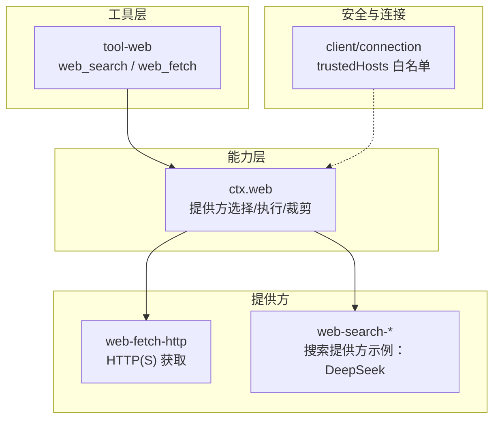
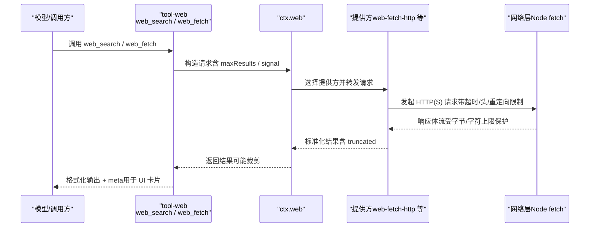
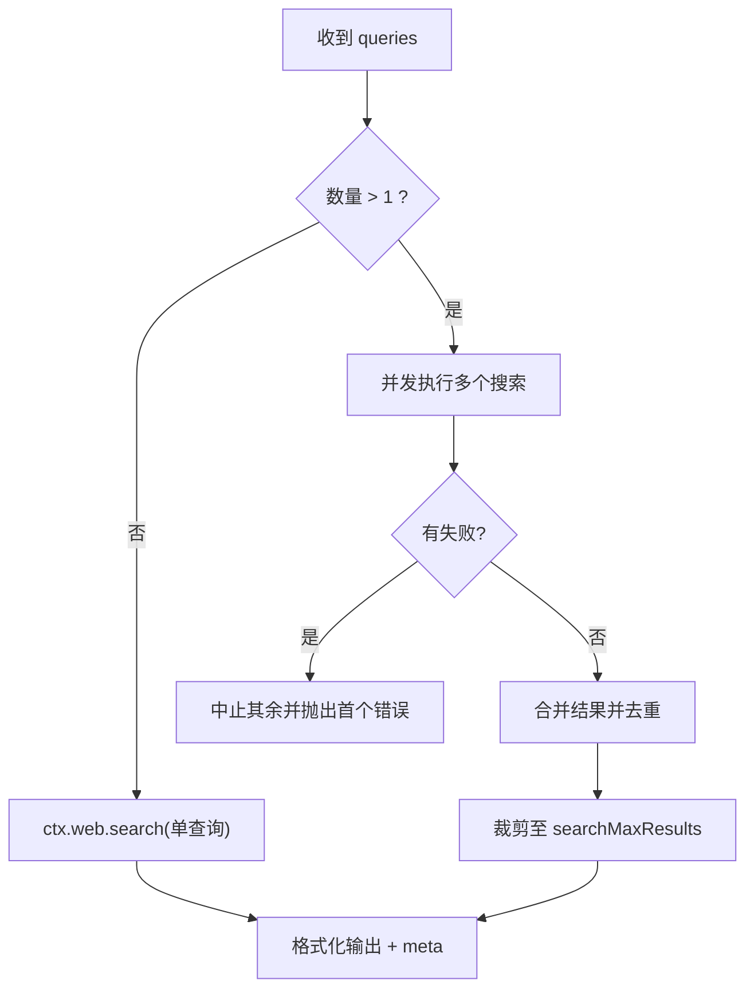
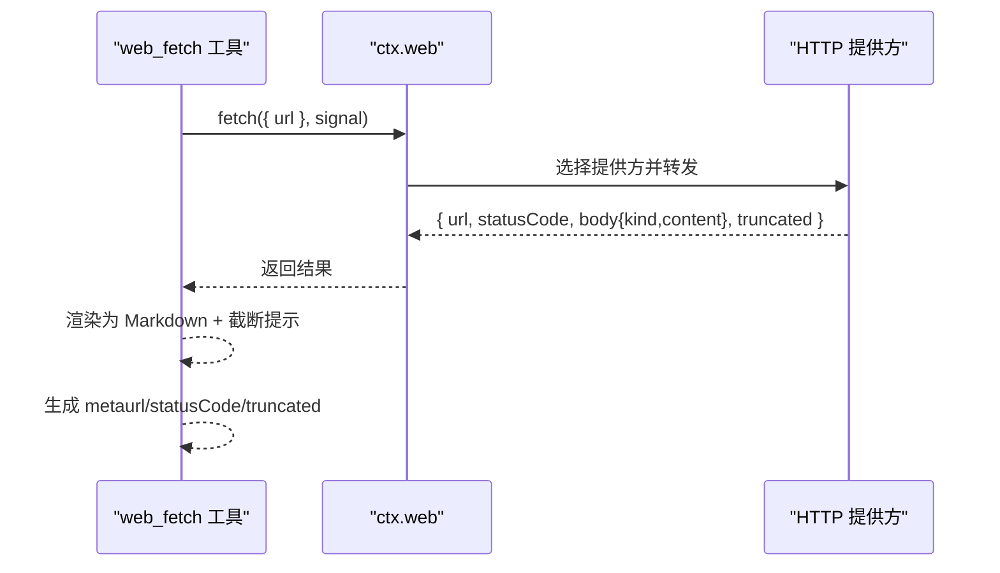
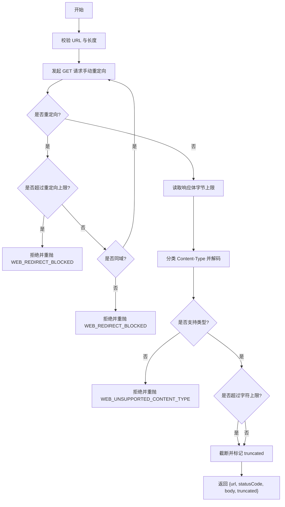
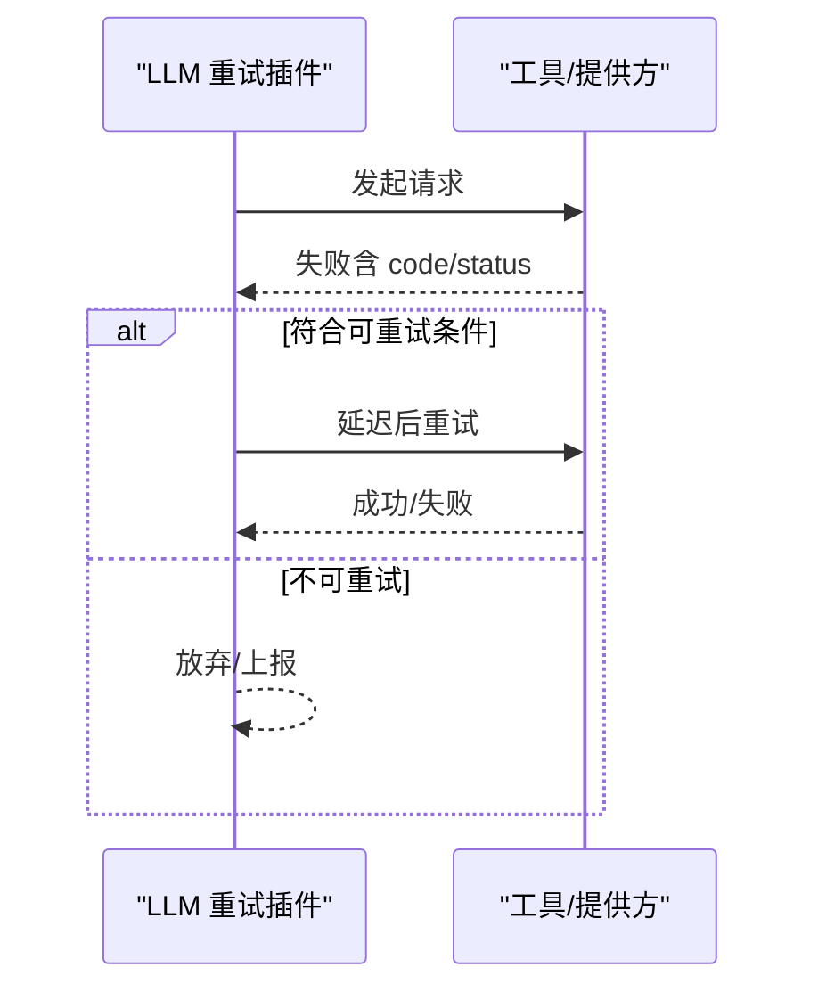
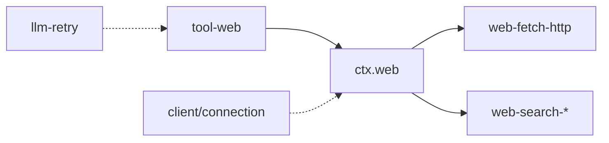

# 网络请求工具

<cite>
**本文引用的文件**
- [packages/web/tool-web/src/index.ts](file://packages/web/tool-web/src/index.ts)
- [packages/web/tool-web/src/fetch.ts](file://packages/web/tool-web/src/fetch.ts)
- [packages/web/tool-web/src/search.ts](file://packages/web/tool-web/src/search.ts)
- [packages/web/web/src/index.ts](file://packages/web/web/src/index.ts)
- [packages/web/web/src/types.ts](file://packages/web/web/src/types.ts)
- [packages/web/web-fetch-http/src/index.ts](file://packages/web/web-fetch-http/src/index.ts)
- [packages/web/web-fetch-http/src/provider.ts](file://packages/web/web-fetch-http/src/provider.ts)
- [packages/client/connection/src/index.ts](file://packages/client/connection/src/index.ts)
- [packages/llm/llm-retry/src/index.ts](file://packages/llm/llm-retry/src/index.ts)
- [examples/headless-agent/tests/snapshots/provider-retry/input.json](file://examples/headless-agent/tests/snapshots/provider-retry/input.json)
</cite>

## 目录
1. [简介](#简介)
2. [项目结构](#项目结构)
3. [核心组件](#核心组件)
4. [架构总览](#架构总览)
5. [详细组件分析](#详细组件分析)
6. [依赖关系分析](#依赖关系分析)
7. [性能与限制](#性能与限制)
8. [故障排除指南](#故障排除指南)
9. [结论](#结论)
10. [附录：配置项速查](#附录：配置项速查)

## 简介
本文件面向需要在 Harness 中使用“网络能力”的开发者，系统化说明内置的网络相关工具与实现：
- 模型侧工具：web_search（网络搜索）、web_fetch（HTTP 获取）
- 能力层：ctx.web（搜索与获取的统一入口、提供方选择与结果裁剪）
- HTTP 提供方：基于 Node fetch 的安全抓取实现（URL 校验、重定向控制、超时与大小限制、字符集解码）
- 安全策略：浏览器信任边界与可信主机白名单、代理与证书由底层运行时决定
- 错误与重试：结构化 WebError、取消信号、以及 LLM 层的通用重试策略
- 输出格式化：HTML→Markdown 转换、截断提示、结果元数据用于 UI 卡片展示

## 项目结构
围绕网络能力的代码主要分布在以下包中：
- tool-web：暴露 web_search 与 web_fetch 两个模型侧工具，负责参数校验、输出格式化、系统提示引导、结果呈现
- web：定义 ctx.web 能力层，注册并选择搜索/获取提供方，统一执行与结果裁剪
- web-fetch-http：提供默认的 HTTP(S) 获取提供方，实现 URL 校验、重定向、超时、大小限制、内容类型分类与解码
- client/connection：定义 /api 的信任边界与 trustedHosts 白名单
- llm-retry：提供通用的请求重试策略（可被上层消费）

图表来源
- [packages/web/tool-web/src/index.ts:20-24](file://packages/web/tool-web/src/index.ts#L20-L24)
- [packages/web/web/src/index.ts:74-163](file://packages/web/web/src/index.ts#L74-L163)
- [packages/web/web-fetch-http/src/index.ts:27-31](file://packages/web/web-fetch-http/src/index.ts#L27-L31)
- [packages/client/connection/src/index.ts:49-67](file://packages/client/connection/src/index.ts#L49-L67)

章节来源
- [packages/web/tool-web/src/index.ts:20-96](file://packages/web/tool-web/src/index.ts#L20-L96)
- [packages/web/web/src/index.ts:74-203](file://packages/web/web/src/index.ts#L74-L203)
- [packages/web/web-fetch-http/src/index.ts:27-102](file://packages/web/web-fetch-http/src/index.ts#L27-L102)
- [packages/client/connection/src/index.ts:49-67](file://packages/client/connection/src/index.ts#L49-L67)

## 核心组件
- web_search 工具
  - 作用：发起一次或多次数查询，返回可选摘要与来源列表；支持并发合并与去重
  - 关键配置：searchMaxResults（单次调用最大来源数）、searchMaxQueries（单次调用最大查询数）、searchTimeoutMs（协作超时预算）
  - 输出：格式化为 Markdown 文本，附带来源链接与截断提示；meta 携带结构化 sources 与 truncated
- web_fetch 工具
  - 作用：抓取指定 HTTP(S) URL，返回解码后的文本或 HTML（转为 Markdown），附带状态码与截断标志
  - 关键配置：fetchTimeoutMs（协作超时预算）、fetchMaxOutputChars（完整输出字符上限）
  - 输出：以“Fetched <url> (HTTP <status>)”为头的 Markdown 文本；meta 携带 url、statusCode、truncated
- ctx.web 能力层
  - 作用：注册搜索/获取提供方，按配置或可用情况选择提供方，执行并裁剪结果（如 maxResults）
  - 提供方选择规则：显式配置优先；否则自动选择唯一可用提供方；无可用或多可用时抛出结构化错误
- HTTP 提供方（web-fetch-http）
  - 作用：安全的 HTTP(S) 抓取，包含 URL 校验、仅同域重定向、超时、字节/字符上限、内容类型分类与解码
  - 关键配置：maxUrlLength、maxResponseBytes、maxBodyChars、timeoutMs、maxRedirects、userAgent

章节来源
- [packages/web/tool-web/src/search.ts:25-52](file://packages/web/tool-web/src/search.ts#L25-L52)
- [packages/web/tool-web/src/fetch.ts:80-91](file://packages/web/tool-web/src/fetch.ts#L80-L91)
- [packages/web/web/src/index.ts:131-163](file://packages/web/web/src/index.ts#L131-L163)
- [packages/web/web-fetch-http/src/index.ts:33-56](file://packages/web/web-fetch-http/src/index.ts#L33-L56)

## 架构总览
下图展示了从模型侧工具到能力层再到具体提供方的调用链，以及安全与超时控制的介入点。

图表来源
- [packages/web/tool-web/src/search.ts:309-376](file://packages/web/tool-web/src/search.ts#L309-L376)
- [packages/web/tool-web/src/fetch.ts:429-495](file://packages/web/tool-web/src/fetch.ts#L429-L495)
- [packages/web/web/src/index.ts:140-163](file://packages/web/web/src/index.ts#L140-L163)
- [packages/web/web-fetch-http/src/provider.ts:46-114](file://packages/web/web-fetch-http/src/provider.ts#L46-L114)

## 详细组件分析

### web_search 工具
- 参数与校验
  - queries：非空数组，每项为非空白字符串；长度受 searchMaxQueries 限制；重复项会被去重
- 执行流程
  - 单查询：直接调用 ctx.web.search
  - 多查询：并发执行，任一失败则中止其余并抛出首个错误；最终合并结果并按 round-robin 去重，最多保留 searchMaxResults 条来源
- 输出与呈现
  - 文本：可选摘要 + 来源列表（标题/片段/日期）+ 截断提示 + 引用指引
  - meta：sources、truncated、answer（可选）
  - 系统提示：根据是否启用 web_fetch 动态调整引导文案

图表来源
- [packages/web/tool-web/src/search.ts:232-294](file://packages/web/tool-web/src/search.ts#L232-L294)
- [packages/web/tool-web/src/search.ts:309-376](file://packages/web/tool-web/src/search.ts#L309-L376)

章节来源
- [packages/web/tool-web/src/search.ts:25-52](file://packages/web/tool-web/src/search.ts#L25-L52)
- [packages/web/tool-web/src/search.ts:232-294](file://packages/web/tool-web/src/search.ts#L232-L294)
- [packages/web/tool-web/src/search.ts:309-376](file://packages/web/tool-web/src/search.ts#L309-L376)

### web_fetch 工具
- 参数与校验
  - url：必填且非空白字符串
- 执行流程
  - 通过 ctx.web.fetch 调用选定的提供方；将 exec.signal 传递给提供方以实现协作取消
- 输出与呈现
  - 文本：以“Fetched <url> (HTTP <status>)”开头，正文为 HTML→Markdown 或纯文本；若被截断会附加提示
  - meta：url、statusCode、truncated；UI 据此渲染“web”卡片
  - 系统提示：引导使用 web_fetch 获取具体内容并引用 URL

图表来源
- [packages/web/tool-web/src/fetch.ts:429-495](file://packages/web/tool-web/src/fetch.ts#L429-L495)
- [packages/web/web/src/index.ts:149-163](file://packages/web/web/src/index.ts#L149-L163)

章节来源
- [packages/web/tool-web/src/fetch.ts:80-91](file://packages/web/tool-web/src/fetch.ts#L80-L91)
- [packages/web/tool-web/src/fetch.ts:224-330](file://packages/web/tool-web/src/fetch.ts#L224-L330)
- [packages/web/tool-web/src/fetch.ts:429-495](file://packages/web/tool-web/src/fetch.ts#L429-L495)

### HTTP 提供方（web-fetch-http）
- URL 与安全
  - 严格校验 URL 长度与协议；仅跟随同域重定向；拒绝跨域自动跳转
  - 不携带浏览器 Cookie 或环境凭据；User-Agent 固定为产品标识
- 资源限制
  - timeoutMs：默认 30000ms；超过阈值抛出 WEB_FETCH_TIMEOUT
  - maxResponseBytes：读取阶段按字节上限截断或拒绝过大响应
  - maxBodyChars：解码后按字符上限截断
  - maxRedirects：默认 5；超出则拒绝并重抛 WEB_REDIRECT_BLOCKED
- 内容处理
  - 依据 Content-Type 分类为 html 或 text；解析 charset 并解码
  - 不支持的内容类型直接拒绝
- 错误分类
  - 超时：WEB_FETCH_TIMEOUT
  - 取消：WEB_ABORTED
  - 网络/提供方错误：WEB_PROVIDER_ERROR
  - 重定向违规：WEB_REDIRECT_BLOCKED
  - 过大响应：WEB_FETCH_TOO_LARGE
  - 不支持类型：WEB_UNSUPPORTED_CONTENT_TYPE

图表来源
- [packages/web/web-fetch-http/src/provider.ts:46-114](file://packages/web/web-fetch-http/src/provider.ts#L46-L114)
- [packages/web/web-fetch-http/src/provider.ts:116-207](file://packages/web/web-fetch-http/src/provider.ts#L116-L207)
- [packages/web/web-fetch-http/src/provider.ts:225-240](file://packages/web/web-fetch-http/src/provider.ts#L225-L240)

章节来源
- [packages/web/web-fetch-http/src/index.ts:33-102](file://packages/web/web-fetch-http/src/index.ts#L33-L102)
- [packages/web/web-fetch-http/src/provider.ts:46-240](file://packages/web/web-fetch-http/src/provider.ts#L46-L240)

### 能力层（ctx.web）与提供方选择
- 提供方注册
  - registerSearchProvider / registerFetchProvider：同一 id 不可重复注册；生命周期与 fiber 绑定
- 提供方选择
  - 显式配置优先；未配置时自动选择唯一可用提供方；无可用或多可用时抛出对应 WebError
- 结果裁剪
  - 搜索：对 sources 进行 capSources，超过 maxResults 时设置 truncated
- 执行
  - search：选择提供方并调用，返回标准化结果
  - fetch：选择提供方并调用，非 2xx 仍作为正常结果返回（由调用方判断）

章节来源
- [packages/web/web/src/index.ts:74-163](file://packages/web/web/src/index.ts#L74-L163)
- [packages/web/web/src/index.ts:171-200](file://packages/web/web/src/index.ts#L171-L200)

### 安全策略与访问控制
- 浏览器信任边界与可信主机白名单
  - /api 前缀的请求需满足 Host 为回环地址或匹配 trustedHosts 白名单；Origin 必须与 Host 一致；sec-fetch-site: cross-site 直接拒绝
  - 该策略在客户端连接层实施，防止 DNS 重绑定与跨站滥用
- 代理与 SSL
  - 当前 HTTP 提供方直接使用 Node fetch；代理与证书策略由运行环境与网络栈决定，未在提供方内二次封装
- 私有网络与 SSRF
  - 明确不提供私有网络与 SSRF 防护；不要在可访问敏感内网的目标上启用此提供方

章节来源
- [packages/client/connection/src/index.ts:49-67](file://packages/client/connection/src/index.ts#L49-L67)
- [packages/web/web-fetch-http/src/provider.ts:1-9](file://packages/web/web-fetch-http/src/provider.ts#L1-L9)

### 请求重试机制与错误处理
- 工具层错误
  - 当无可用提供方时，web_search/web_fetch 会返回结构化错误（如 WEB_PROVIDER_UNAVAILABLE）
- 提供方错误
  - 超时：WEB_FETCH_TIMEOUT；取消：WEB_ABORTED；网络错误：WEB_PROVIDER_ERROR；重定向违规：WEB_REDIRECT_BLOCKED；过大响应：WEB_FETCH_TOO_LARGE；不支持类型：WEB_UNSUPPORTED_CONTENT_TYPE
- 重试策略
  - 工具层本身不内置重试；可通过上层 LLM 重试插件（llm-retry）对特定错误码进行重试决策
  - 重试策略支持模式（normal/always）、可重试错误码集合、退避与抖动等

图表来源
- [packages/llm/llm-retry/src/index.ts:156-179](file://packages/llm/llm-retry/src/index.ts#L156-L179)

章节来源
- [packages/web/tool-web/src/index.ts:54-62](file://packages/web/tool-web/src/index.ts#L54-L62)
- [packages/web/web/src/index.ts:171-194](file://packages/web/web/src/index.ts#L171-L194)
- [packages/web/web-fetch-http/src/provider.ts:225-240](file://packages/web/web-fetch-http/src/provider.ts#L225-L240)
- [packages/llm/llm-retry/src/index.ts:156-179](file://packages/llm/llm-retry/src/index.ts#L156-L179)

## 依赖关系分析
- tool-web 依赖 ctx.web 与 dsh-tools/dsh-system-prompt，负责模型侧工具注册与输出
- ctx.web 依赖各提供方注册表，并在执行时选择提供方
- web-fetch-http 依赖 Node fetch 与超时原语，实现安全抓取
- client/connection 提供 /api 信任边界与 trustedHosts 白名单
- llm-retry 提供通用重试策略，可作用于上层请求

图表来源
- [packages/web/tool-web/src/index.ts:20-24](file://packages/web/tool-web/src/index.ts#L20-L24)
- [packages/web/web/src/index.ts:74-163](file://packages/web/web/src/index.ts#L74-L163)
- [packages/web/web-fetch-http/src/index.ts:27-31](file://packages/web/web-fetch-http/src/index.ts#L27-L31)
- [packages/client/connection/src/index.ts:49-67](file://packages/client/connection/src/index.ts#L49-L67)
- [packages/llm/llm-retry/src/index.ts:156-179](file://packages/llm/llm-retry/src/index.ts#L156-L179)

章节来源
- [packages/web/tool-web/src/index.ts:20-96](file://packages/web/tool-web/src/index.ts#L20-L96)
- [packages/web/web/src/index.ts:74-203](file://packages/web/web/src/index.ts#L74-L203)
- [packages/web/web-fetch-http/src/index.ts:27-102](file://packages/web/web-fetch-http/src/index.ts#L27-L102)
- [packages/client/connection/src/index.ts:49-67](file://packages/client/connection/src/index.ts#L49-L67)
- [packages/llm/llm-retry/src/index.ts:156-179](file://packages/llm/llm-retry/src/index.ts#L156-L179)

## 性能与限制
- 并发与合并
  - web_search 支持多查询并发执行，合并时按轮次去重，避免重复来源
- 同步转换限制
  - web_fetch 的 HTML→Markdown 转换采用同步 DOM 解析，设有最大嵌套深度保护，避免恶意页面导致事件循环阻塞
- 输出上限
  - web_fetch 输出整体受 fetchMaxOutputChars 限制；同时源内容也受 provider 的 maxBodyChars 限制
- 超时
  - 工具级协作超时（fetchTimeoutMs/searchTimeoutMs）与提供方内部超时（timeoutMs）共同保障响应时效

章节来源
- [packages/web/tool-web/src/search.ts:232-294](file://packages/web/tool-web/src/search.ts#L232-L294)
- [packages/web/tool-web/src/fetch.ts:94-102](file://packages/web/tool-web/src/fetch.ts#L94-L102)
- [packages/web/tool-web/src/fetch.ts:284-330](file://packages/web/tool-web/src/fetch.ts#L284-L330)
- [packages/web/web-fetch-http/src/provider.ts:46-114](file://packages/web/web-fetch-http/src/provider.ts#L46-L114)

## 故障排除指南
- 连接超时
  - 现象：请求长时间无响应或达到超时阈值
  - 排查：检查 fetchTimeoutMs/searchTimeoutMs 与提供方 timeoutMs；确认网络可达性与上游服务健康
  - 相关错误码：WEB_FETCH_TIMEOUT
- DNS 解析失败
  - 现象：无法解析域名或连接被拒
  - 排查：检查域名拼写、DNS 配置、防火墙/代理设置；确认目标服务器监听地址与端口
  - 相关错误码：WEB_PROVIDER_ERROR
- 网络协议错误
  - 现象：Content-Type 不受支持、重定向违规、响应过大
  - 排查：调整 content-type 接受范围、避免跨域重定向、增大或限制 maxResponseBytes/maxBodyChars
  - 相关错误码：WEB_UNSUPPORTED_CONTENT_TYPE、WEB_REDIRECT_BLOCKED、WEB_FETCH_TOO_LARGE
- 无可用提供方
  - 现象：调用 web_search/web_fetch 即报错
  - 排查：确认已注册至少一个可用的提供方；或显式配置 searchProvider/fetchProvider
  - 相关错误码：WEB_PROVIDER_UNAVAILABLE、WEB_PROVIDER_CONFIGURED_MISSING、WEB_PROVIDER_CONFIGURED_UNAVAILABLE、WEB_PROVIDER_AMBIGUOUS
- 取消与中断
  - 现象：请求被外部取消或超时信号触发
  - 排查：检查上游调用链是否传递了 AbortSignal；确认工具超时策略
  - 相关错误码：WEB_ABORTED

章节来源
- [packages/web/web/src/index.ts:171-194](file://packages/web/web/src/index.ts#L171-L194)
- [packages/web/web-fetch-http/src/provider.ts:225-240](file://packages/web/web-fetch-http/src/provider.ts#L225-L240)

## 结论
Harness 的网络能力通过“工具层—能力层—提供方”的分层设计，实现了：
- 统一的模型侧接口（web_search/web_fetch）
- 灵活的提供方注册与选择机制
- 严格的安全与资源限制（URL、重定向、超时、大小、字符集）
- 标准化的错误分类与可观测性（WebError、meta 信息）
- 可扩展的重试策略（通过上层 llm-retry）

在生产环境中，建议：
- 明确配置 searchProvider/fetchProvider，避免歧义
- 合理设置超时与大小限制，平衡体验与资源消耗
- 结合 trustedHosts 白名单与部署前置反向代理，强化边界安全
- 针对不稳定上游配置合理的重试策略与退避

## 附录：配置项速查
- tool-web（工具层）
  - search：是否注册 web_search（默认 true）
  - fetch：是否注册 web_fetch（默认 true）
  - searchMaxResults：单次搜索最大来源数（默认 8）
  - searchMaxQueries：单次搜索最大查询数（默认 4）
  - fetchTimeoutMs：web_fetch 协作超时（默认 30000）
  - searchTimeoutMs：web_search 协作超时（默认 30000）
  - fetchMaxOutputChars：web_fetch 完整输出字符上限（默认 200000）
- web-fetch-http（HTTP 提供方）
  - maxUrlLength：请求 URL 最大长度（默认 2048）
  - maxResponseBytes：响应体最大字节数（默认 5000000）
  - maxBodyChars：解码后最大字符数（默认 100000）
  - timeoutMs：默认超时毫秒（默认 30000）
  - maxRedirects：同域重定向最大跳数（默认 5）
  - userAgent：请求 User-Agent（默认产品标识）
- client/connection（连接层）
  - trustedHosts：允许的非回环主机白名单（精确 host:port 或 host 匹配任意端口）
  - maxRequestBodyBytes：/api 请求最大缓冲 JSON 体大小

章节来源
- [packages/web/tool-web/src/index.ts:54-62](file://packages/web/tool-web/src/index.ts#L54-L62)
- [packages/web/web-fetch-http/src/index.ts:49-56](file://packages/web/web-fetch-http/src/index.ts#L49-L56)
- [packages/client/connection/src/index.ts:64-67](file://packages/client/connection/src/index.ts#L64-L67)