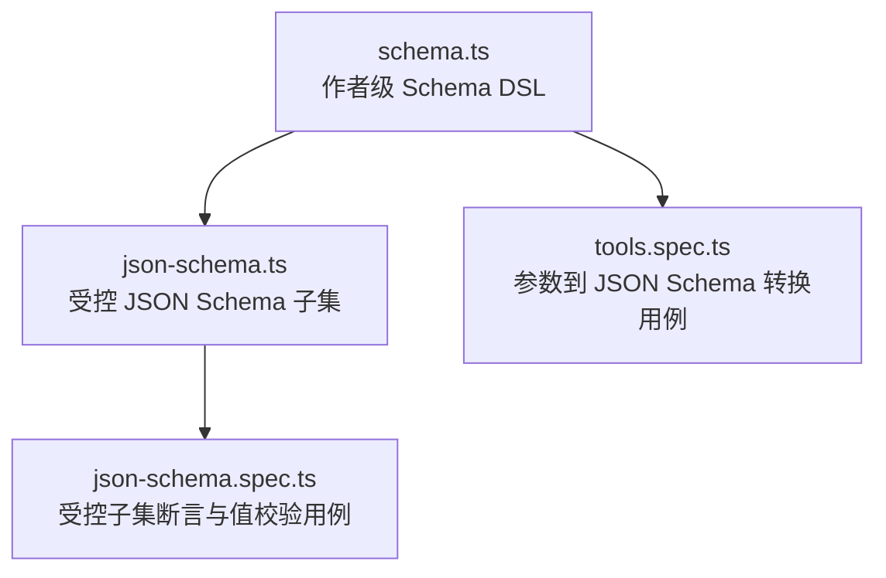
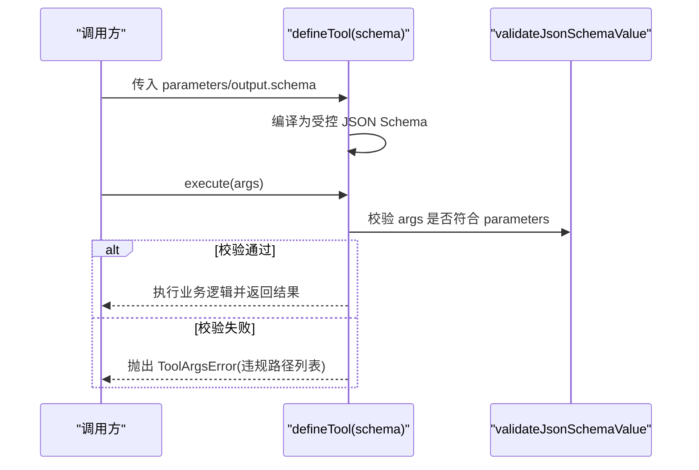
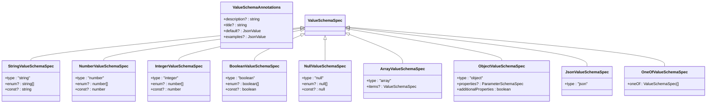
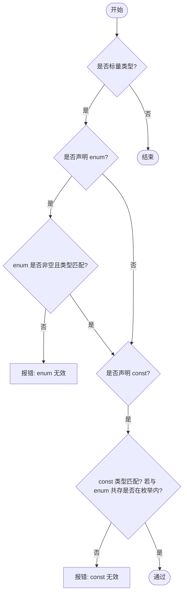
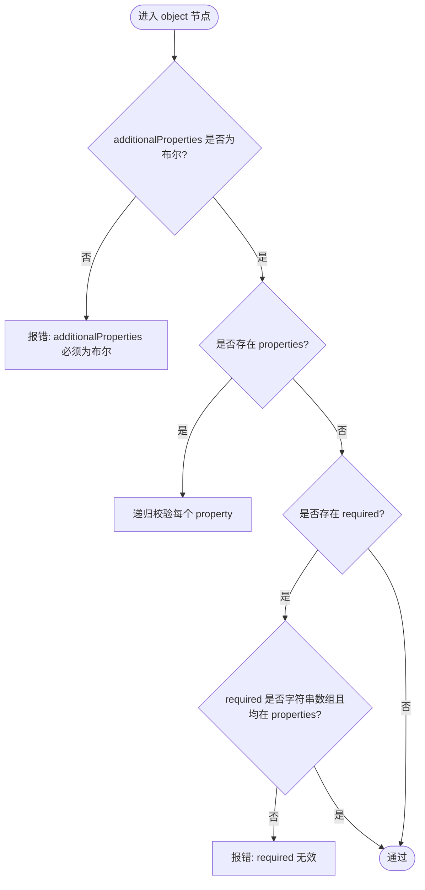
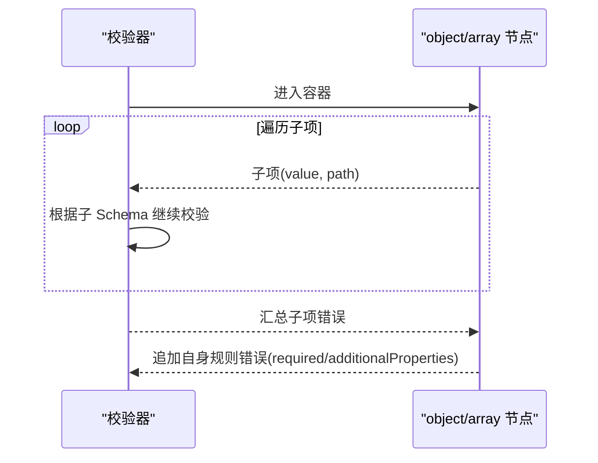
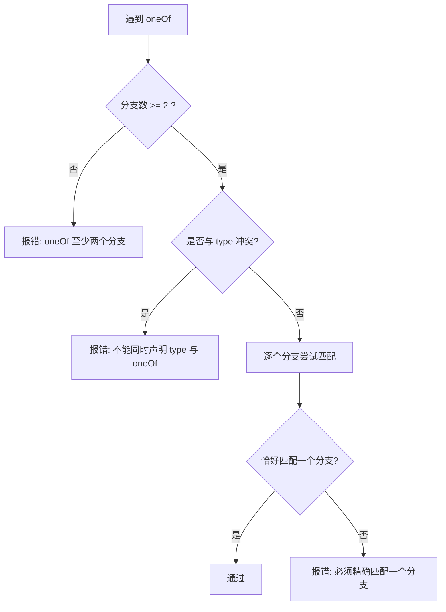
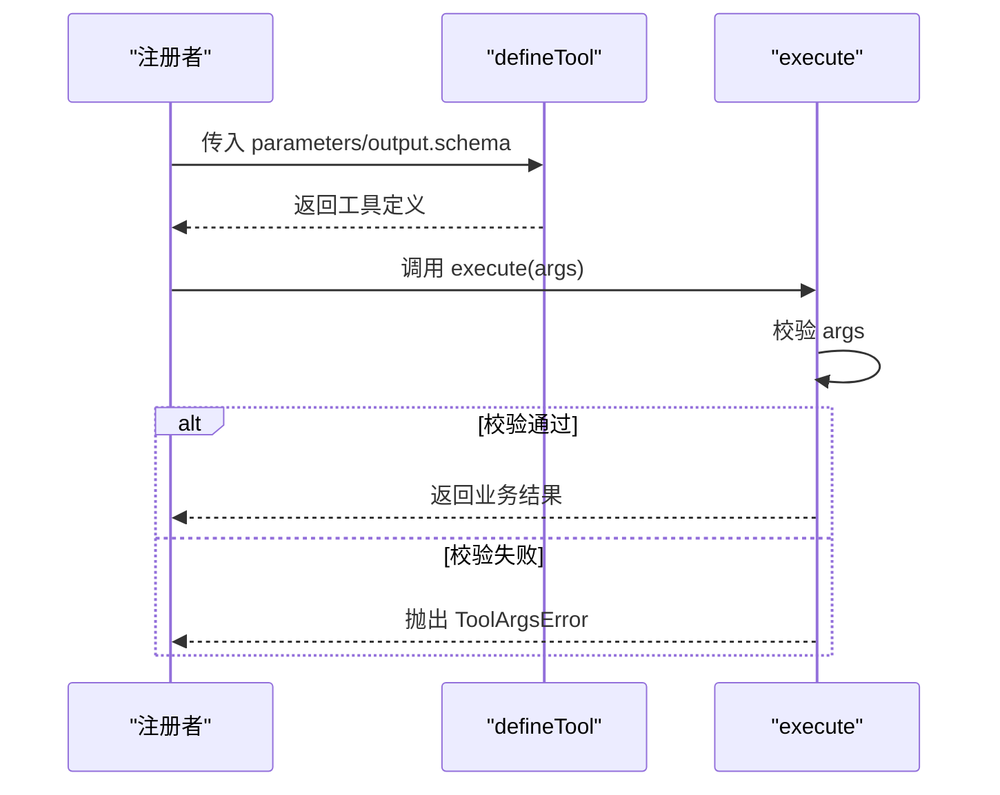
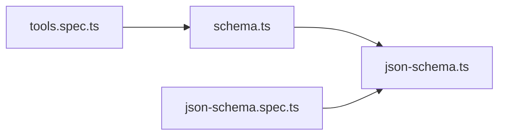

# 参数验证与 Schema

<cite>
**本文引用的文件**
- [packages/core/tools/src/schema.ts](file://packages/core/tools/src/schema.ts)
- [packages/core/tools/src/json-schema.ts](file://packages/core/tools/src/json-schema.ts)
- [packages/core/tools/tests/json-schema.spec.ts](file://packages/core/tools/tests/json-schema.spec.ts)
- [packages/core/tools/tests/tools.spec.ts](file://packages/core/tools/tests/tools.spec.ts)
</cite>

## 目录
1. [简介](#简介)
2. [项目结构](#项目结构)
3. [核心组件](#核心组件)
4. [架构总览](#架构总览)
5. [详细组件分析](#详细组件分析)
6. [依赖关系分析](#依赖关系分析)
7. [性能考量](#性能考量)
8. [故障排查指南](#故障排查指南)
9. [结论](#结论)
10. [附录：示例与最佳实践](#附录示例与最佳实践)

## 简介
本文件系统化阐述参数验证与 Schema 体系，覆盖 ValueSchemaSpec 类型系统、基础/复杂/联合类型、required/enum/const/default 等约束、对象 properties 与 additionalProperties 控制、嵌套结构与数组元素校验、条件 oneOf 校验，以及错误处理与调试方法。内容基于仓库中工具参数与输出 Schema 的强制子集实现与测试用例，确保读者既能理解设计意图，也能在实际工程中正确应用。

## 项目结构
该能力集中在 core/tools 包内，分为“作者级 DSL”和“受控 JSON Schema 子集”两层：
- schema.ts：定义作者级 ValueSchemaSpec/ParameterSchemaSpec，提供编译为受控 JSON Schema 的函数与工具定义辅助。
- json-schema.ts：定义受控 JSON Schema 节点 JsonSchemaNode，提供断言、值校验、路径诊断等。
- tests/*：大量用例覆盖边界情况、错误信息与行为约定。

**图表来源**
- [packages/core/tools/src/schema.ts:1-112](file://packages/core/tools/src/schema.ts#L1-L112)
- [packages/core/tools/src/json-schema.ts:1-60](file://packages/core/tools/src/json-schema.ts#L1-L60)
- [packages/core/tools/tests/tools.spec.ts:2270-2400](file://packages/core/tools/tests/tools.spec.ts#L2270-L2400)
- [packages/core/tools/tests/json-schema.spec.ts:48-172](file://packages/core/tools/tests/json-schema.spec.ts#L48-L172)

**章节来源**
- [packages/core/tools/src/schema.ts:1-112](file://packages/core/tools/src/schema.ts#L1-L112)
- [packages/core/tools/src/json-schema.ts:1-60](file://packages/core/tools/src/json-schema.ts#L1-L60)

## 核心组件
- ValueSchemaSpec：作者级统一值 Schema 联合类型，包含基础类型（string/number/integer/boolean/null）、复杂类型（array/object/json）与联合类型（oneOf）。
- ParameterPropertySpec/ParameterSchemaSpec：参数映射，隐式以对象为根；属性可标记 required: true。
- JsonSchemaNode：受控 JSON Schema 节点，仅允许有限关键字集合，保证跨模块一致性与安全性。
- 编译器与校验器：
  - valueSchemaSpecToJsonSchema / parameterSchemaSpecToJsonSchema：将作者级 DSL 编译为受控 JSON Schema。
  - validateJsonSchemaValue：对任意值进行严格校验，返回带路径的错误列表。
  - assertSupportedJsonSchema / assertObjectJsonSchema：在边界处断言 Schema 合法性。

**章节来源**
- [packages/core/tools/src/schema.ts:11-112](file://packages/core/tools/src/schema.ts#L11-L112)
- [packages/core/tools/src/json-schema.ts:17-60](file://packages/core/tools/src/json-schema.ts#L17-L60)

## 架构总览
作者通过 ValueSchemaSpec 声明参数与输出结构，编译为受控 JSON Schema 后，由统一的校验器执行运行时验证。工具定义时，execute 前会先校验参数，失败抛出结构化错误；呈现层则采用软校验避免回放崩溃。

**图表来源**
- [packages/core/tools/src/schema.ts:438-480](file://packages/core/tools/src/schema.ts#L438-L480)
- [packages/core/tools/src/schema.ts:545-590](file://packages/core/tools/src/schema.ts#L545-L590)
- [packages/core/tools/src/json-schema.ts:646-657](file://packages/core/tools/src/json-schema.ts#L646-L657)

## 详细组件分析

### ValueSchemaSpec 类型系统
- 基础类型
  - string/number/integer/boolean/null：支持 enum 与 const 字面量约束，且类型安全。
- 复杂类型
  - array：可选 items 指定元素 Schema；未指定时接受任意 JSON 项。
  - object：必须显式 additionalProperties 布尔值；properties 为 ParameterSchemaSpec；required 由属性上的 required: true 推导。
  - json：作者级“无约束 JSON”注解节点，编译后保留描述性元数据但不施加额外约束。
- 联合类型
  - oneOf：至少两个分支；禁止与 type 同时出现；oneOf 旁不支持 properties/items/enum/const 等关键字。

**图表来源**
- [packages/core/tools/src/schema.ts:11-95](file://packages/core/tools/src/schema.ts#L11-L95)

**章节来源**
- [packages/core/tools/src/schema.ts:11-95](file://packages/core/tools/src/schema.ts#L11-L95)

### 参数属性：required、enum、const、default
- required：仅在属性上可用，值为 true 表示必填；编译后生成 required 数组。
- enum：限制标量取值集合，必须非空且类型匹配。
- const：固定单值，若与 enum 共存则必须在枚举内。
- default/examples/description/title：注解型字段，不参与校验但会被投影到 JSON Schema 供展示或下游使用。

**图表来源**
- [packages/core/tools/src/json-schema.ts:347-374](file://packages/core/tools/src/json-schema.ts#L347-L374)
- [packages/core/tools/src/schema.ts:396-409](file://packages/core/tools/src/schema.ts#L396-L409)

**章节来源**
- [packages/core/tools/src/schema.ts:97-112](file://packages/core/tools/src/schema.ts#L97-L112)
- [packages/core/tools/src/json-schema.ts:347-374](file://packages/core/tools/src/json-schema.ts#L347-L374)

### 参数对象结构：properties 与 additionalProperties
- 参数映射 ParameterSchemaSpec 本身作为隐式对象根，键为属性名，值为 ParameterPropertySpec。
- 对于 object 类型，必须显式设置 additionalProperties 为 true/false：
  - false：拒绝未在 properties 中声明的键。
  - true：允许额外键（开放对象）。
- required 由属性上的 required: true 推导；若无必填属性则不生成 required 字段。

**图表来源**
- [packages/core/tools/src/json-schema.ts:203-224](file://packages/core/tools/src/json-schema.ts#L203-L224)
- [packages/core/tools/src/json-schema.ts:324-342](file://packages/core/tools/src/json-schema.ts#L324-L342)
- [packages/core/tools/src/schema.ts:365-381](file://packages/core/tools/src/schema.ts#L365-L381)

**章节来源**
- [packages/core/tools/src/schema.ts:64-72](file://packages/core/tools/src/schema.ts#L64-L72)
- [packages/core/tools/src/json-schema.ts:203-224](file://packages/core/tools/src/json-schema.ts#L203-L224)

### 嵌套对象与数组元素验证
- 嵌套对象：递归进入 properties，逐层校验 required、additionalProperties 与子属性。
- 数组元素：若声明 items，则对每个元素按 items Schema 校验；未声明 items 时接受任意 JSON 项。
- 路径诊断：所有错误均携带从根到当前节点的路径，便于定位。

**图表来源**
- [packages/core/tools/src/json-schema.ts:553-602](file://packages/core/tools/src/json-schema.ts#L553-L602)

**章节来源**
- [packages/core/tools/src/json-schema.ts:553-602](file://packages/core/tools/src/json-schema.ts#L553-L602)

### 条件验证：oneOf
- oneOf 要求至少两个分支，且不能与 type 同时存在。
- oneOf 旁不支持 properties/items/enum/const 等关键字。
- 运行时要求值恰好匹配一个分支，否则报错。

**图表来源**
- [packages/core/tools/src/json-schema.ts:276-300](file://packages/core/tools/src/json-schema.ts#L276-L300)
- [packages/core/tools/src/json-schema.ts:486-547](file://packages/core/tools/src/json-schema.ts#L486-L547)

**章节来源**
- [packages/core/tools/src/json-schema.ts:276-300](file://packages/core/tools/src/json-schema.ts#L276-L300)

### 工具定义与执行流程
- defineTool 接收 parameters 与 output.schema，编译为受控 JSON Schema。
- execute 入口先校验参数，失败抛出 ToolArgsError；成功则执行业务逻辑。
- presentCall/presentResult 等呈现钩子采用软校验，避免回放阶段因历史参数不兼容而崩溃。

**图表来源**
- [packages/core/tools/src/schema.ts:545-590](file://packages/core/tools/src/schema.ts#L545-L590)

**章节来源**
- [packages/core/tools/src/schema.ts:478-480](file://packages/core/tools/src/schema.ts#L478-L480)
- [packages/core/tools/src/schema.ts:545-590](file://packages/core/tools/src/schema.ts#L545-L590)

## 依赖关系分析
- schema.ts 依赖 json-schema.ts 提供的断言与校验能力。
- 测试文件覆盖两类场景：
  - json-schema.spec.ts：断言受控子集的合法/非法输入、关键字组合、路径诊断。
  - tools.spec.ts：验证参数到 JSON Schema 的转换、InferArgs 类型推断、数组/对象嵌套、enum+default 共存等。

**图表来源**
- [packages/core/tools/src/schema.ts:1-10](file://packages/core/tools/src/schema.ts#L1-L10)
- [packages/core/tools/tests/tools.spec.ts:2270-2400](file://packages/core/tools/tests/tools.spec.ts#L2270-L2400)
- [packages/core/tools/tests/json-schema.spec.ts:48-172](file://packages/core/tools/tests/json-schema.spec.ts#L48-L172)

**章节来源**
- [packages/core/tools/src/schema.ts:1-10](file://packages/core/tools/src/schema.ts#L1-L10)
- [packages/core/tools/tests/tools.spec.ts:2270-2400](file://packages/core/tools/tests/tools.spec.ts#L2270-L2400)
- [packages/core/tools/tests/json-schema.spec.ts:48-172](file://packages/core/tools/tests/json-schema.spec.ts#L48-L172)

## 性能考量
- 编译器与校验器均采用栈安全的迭代任务队列，避免深层嵌套导致的调用栈溢出。
- 校验过程一次性收集所有违规信息，减少多轮往返成本。
- 注解字段（description/title/default/examples）不参与校验逻辑，开销极低。

[本节为通用指导，无需具体文件引用]

## 故障排查指南
- 常见 Schema 错误
  - 未知关键字：如 anyOf/allOf/not/pattern/minimum/$ref 等不在受控子集中，将被拒绝。
  - 类型不匹配：type 必须是单一字符串；type 数组不被支持。
  - oneOf 用法不当：分支少于两个、与 type 并存、在 oneOf 旁使用 items/properties/enum/const。
  - 对象 openness：additionalProperties 必须显式为布尔；false 时拒绝未声明键。
  - required 不一致：required 中的名称必须存在于 properties。
- 值校验错误
  - 缺失必填属性、类型不符、enum/const 不满足、oneOf 匹配数量不为 1。
  - 路径化错误消息，形如 "value.a.b" 便于定位。
- 调试建议
  - 使用 validateJsonSchemaValue 直接获取违规列表，快速定位问题。
  - 在 defineTool.execute 前捕获 ToolArgsError，提取 violations 进行日志记录。
  - 对复杂嵌套结构，逐步缩小范围，先验证外层再深入子节点。

**章节来源**
- [packages/core/tools/src/json-schema.ts:226-389](file://packages/core/tools/src/json-schema.ts#L226-L389)
- [packages/core/tools/src/json-schema.ts:486-657](file://packages/core/tools/src/json-schema.ts#L486-L657)
- [packages/core/tools/tests/json-schema.spec.ts:80-200](file://packages/core/tools/tests/json-schema.spec.ts#L80-L200)

## 结论
该参数验证与 Schema 体系通过“作者级 DSL + 受控 JSON Schema 子集”的分层设计，既保证了易用性与类型推断，又确保了跨模块的一致性与安全性。配合详尽的路径化错误与丰富的测试覆盖，开发者可以可靠地构建强约束的参数与输出模型，并在生产环境中获得清晰的诊断信息。

[本节为总结，无需具体文件引用]

## 附录：示例与最佳实践
- 基础与复杂类型
  - 字符串枚举与常量：适用于状态机、开关等场景。
  - 整数范围：结合 integer 与 enum/const 表达离散选项。
  - 数组元素约束：为 items 指定 Schema，确保元素一致性。
- 对象 openness
  - 严格模式：additionalProperties: false 配合 properties，防止意外字段泄露。
  - 开放模式：additionalProperties: true 用于扩展配置或透传字段。
- 条件分支
  - oneOf 用于互斥的结构选择，例如不同命令的不同参数集。
- 默认值与注解
  - default/examples/description/title 用于 UI 展示与文档生成，不参与校验。
- 调试技巧
  - 优先打印 validateJsonSchemaValue 的结果，对照路径定位问题。
  - 在工具定义中记录 ToolArgsError.violations，便于回溯。

[本节为实践建议，无需具体文件引用]