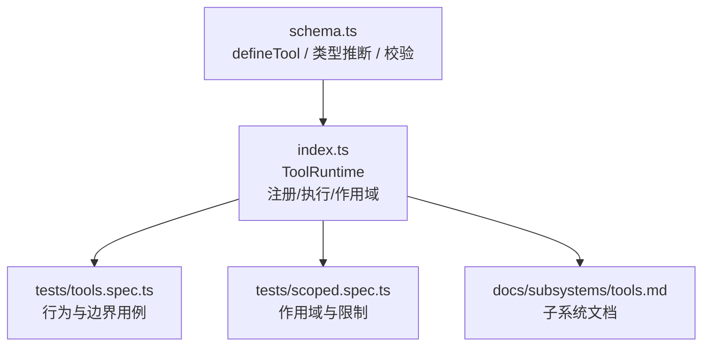
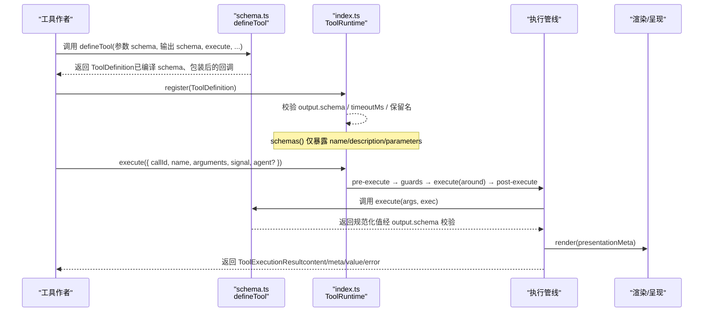
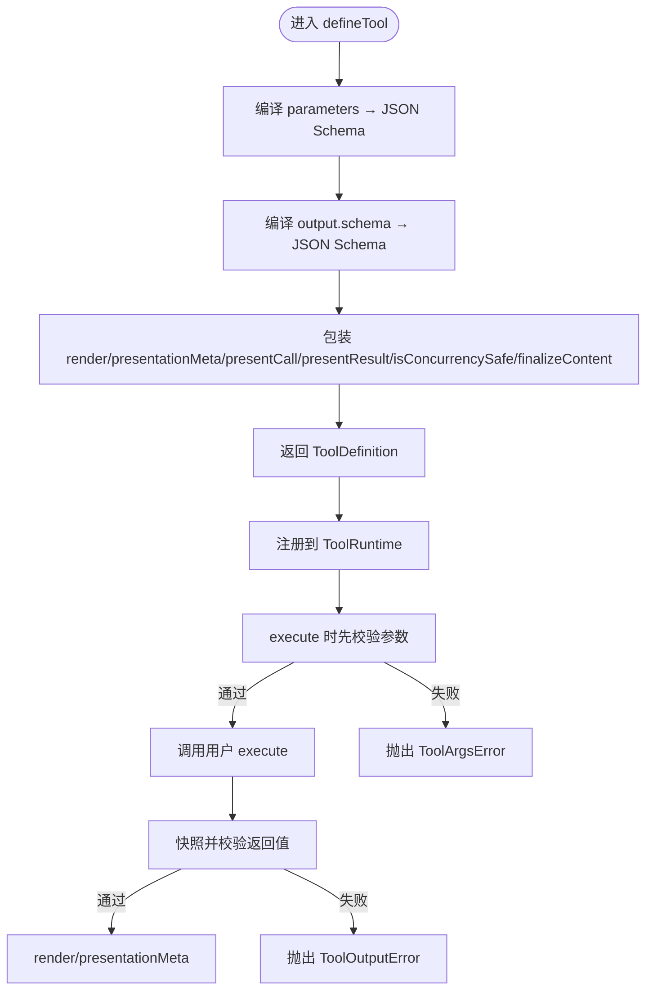
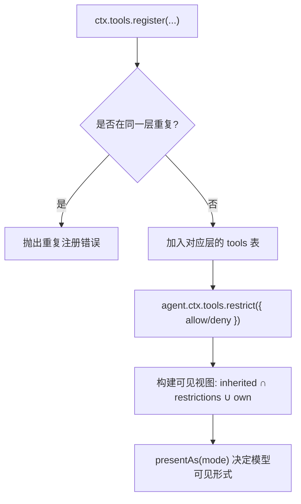
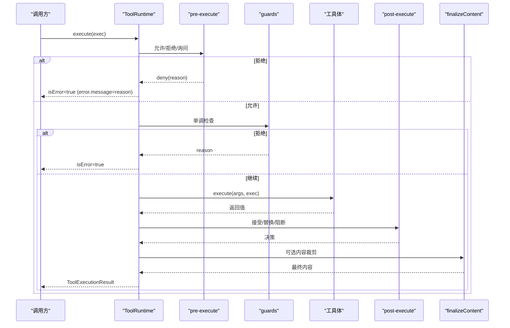
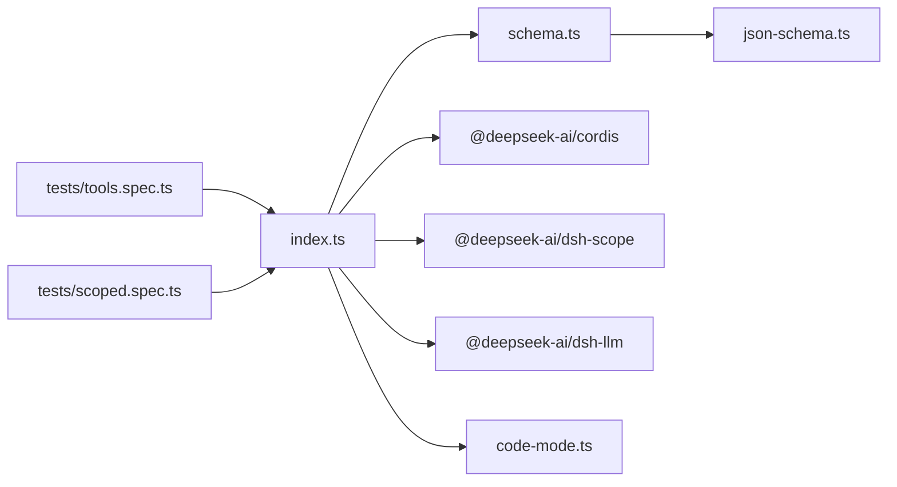

# 工具定义与注册

<cite>
**本文引用的文件**
- [packages/core/tools/src/schema.ts](file://packages/core/tools/src/schema.ts)
- [packages/core/tools/src/index.ts](file://packages/core/tools/src/index.ts)
- [packages/core/tools/tests/tools.spec.ts](file://packages/core/tools/tests/tools.spec.ts)
- [packages/core/tools/tests/scoped.spec.ts](file://packages/core/tools/tests/scoped.spec.ts)
- [docs/subsystems/tools.md](file://docs/subsystems/tools.md)
</cite>

## 目录
1. [简介](#简介)
2. [项目结构](#项目结构)
3. [核心组件](#核心组件)
4. [架构总览](#架构总览)
5. [详细组件分析](#详细组件分析)
6. [依赖关系分析](#依赖关系分析)
7. [性能考量](#性能考量)
8. [故障排查指南](#故障排查指南)
9. [结论](#结论)
10. [附录](#附录)

## 简介
本文件面向工具作者与集成者，系统性说明如何定义、验证、序列化并注册工具。重点覆盖：
- defineTool API 的参数校验、返回值序列化与错误处理机制
- 工具的元数据定义（名称、描述、参数 schema、输出 schema）
- 全局注册与按 Agent 作用域注册的流程与差异
- 类型安全的工具定义模式（TypeScript 类型推断与运行时验证）
- 从简单到复杂的自定义工具开发示例
- 工具命名规范、版本管理与最佳实践

## 项目结构
与工具定义和注册相关的核心代码集中在 dsh-tools 包中：
- schema.ts：统一的 JSON 值 schema DSL、类型推断、defineTool 实现、参数/输出 schema 编译与校验
- index.ts：工具运行时 ToolRuntime（注册、作用域、执行管线、事件、呈现模式等）
- tests/tools.spec.ts：端到端行为与边界用例（含 defineTool 的 round-trip 测试）
- tests/scoped.spec.ts：作用域遮蔽、限制与生命周期
- docs/subsystems/tools.md：官方子系统文档，涵盖 ToolDefinition、执行管线、UI 呈现等

**图示来源**
- [packages/core/tools/src/schema.ts:545-617](file://packages/core/tools/src/schema.ts#L545-L617)
- [packages/core/tools/src/index.ts:787-1200](file://packages/core/tools/src/index.ts#L787-L1200)
- [packages/core/tools/tests/tools.spec.ts:2165-2204](file://packages/core/tools/tests/tools.spec.ts#L2165-L2204)
- [packages/core/tools/tests/scoped.spec.ts:87-136](file://packages/core/tools/tests/scoped.spec.ts#L87-L136)
- [docs/subsystems/tools.md:9-151](file://docs/subsystems/tools.md#L9-L151)

**章节来源**
- [packages/core/tools/src/schema.ts:1-618](file://packages/core/tools/src/schema.ts#L1-L618)
- [packages/core/tools/src/index.ts:1-1200](file://packages/core/tools/src/index.ts#L1-L1200)
- [docs/subsystems/tools.md:1-721](file://docs/subsystems/tools.md#L1-L721)

## 核心组件
- defineTool：将“作者友好的 schema + 类型推断”编译为“受支持的原始 JSON Schema”，并在 execute 前进行参数校验；同时包装 output.render/presentationMeta/presentCall/presentResult/isConcurrencySafe/finalizeContent 等回调，提供类型安全与健壮的错误处理。
- ToolRuntime：工具注册表与执行管线，负责：
  - 全局与作用域注册、遮蔽与限制
  - 模型可见 schema 投影（不包含执行与展示回调）
  - 执行管线：pre-execute → guards → execute（around）→ post-execute → finalizeContent → result
  - Code Mode 呈现模式与 run_code 传输
  - 并发调度分类（isConcurrencySafe）

**章节来源**
- [packages/core/tools/src/schema.ts:482-617](file://packages/core/tools/src/schema.ts#L482-L617)
- [packages/core/tools/src/index.ts:787-1200](file://packages/core/tools/src/index.ts#L787-L1200)
- [docs/subsystems/tools.md:9-151](file://docs/subsystems/tools.md#L9-L151)

## 架构总览
下图展示了 defineTool 到 ToolRuntime 的完整链路：定义、编译、注册、执行、结果投影与通知。

**图示来源**
- [packages/core/tools/src/schema.ts:545-617](file://packages/core/tools/src/schema.ts#L545-L617)
- [packages/core/tools/src/index.ts:1037-1062](file://packages/core/tools/src/index.ts#L1037-L1062)
- [packages/core/tools/src/index.ts:1342-1600](file://packages/core/tools/src/index.ts#L1342-L1600)
- [docs/subsystems/tools.md:170-405](file://docs/subsystems/tools.md#L170-L405)

## 详细组件分析

### defineTool 与类型安全的工具定义
- 参数 schema：使用 ParameterSchemaSpec（隐式 open object root），通过 parameterSchemaSpecToJsonSchema 编译为标准 JSON Schema，并收集 required 字段。
- 输出 schema：ValueSchemaSpec 统一支持 string/number/integer/boolean/null/array/object/json/oneOf，并通过 valueSchemaSpecToJsonSchema 编译为受支持的原始 JSON Schema。
- 类型推断：InferArgs/S 与 InferValue/S 在编译期推导 execute 的入参与 output.render 的值类型，支持最多 16 层容器深度，超出回退到 JsonValue。
- 运行时校验：execute 前对 arguments 进行 validateJsonSchemaValue 校验，失败抛出 ToolArgsError（INVALID_ARGS）。
- 输出校验：execute 返回值经 snapshotJsonValue 与 output.schema 校验，失败抛出 ToolOutputError（INVALID_TOOL_OUTPUT）。
- 呈现回调：presentCall/presentResult 在回放场景下必须容忍旧 schema 或无效参数，采用软校验并回退到通用呈现。
- 可选能力：finalizeContent 用于最后一步内容裁剪；isConcurrencySafe 用于并行调度分类；timeoutMs 用于协作超时预算（不发送给模型）。

**图示来源**
- [packages/core/tools/src/schema.ts:432-458](file://packages/core/tools/src/schema.ts#L432-L458)
- [packages/core/tools/src/schema.ts:478-480](file://packages/core/tools/src/schema.ts#L478-L480)
- [packages/core/tools/src/schema.ts:545-617](file://packages/core/tools/src/schema.ts#L545-L617)

**章节来源**
- [packages/core/tools/src/schema.ts:96-176](file://packages/core/tools/src/schema.ts#L96-L176)
- [packages/core/tools/src/schema.ts:432-480](file://packages/core/tools/src/schema.ts#L432-L480)
- [packages/core/tools/src/schema.ts:482-617](file://packages/core/tools/src/schema.ts#L482-L617)
- [packages/core/tools/tests/tools.spec.ts:2165-2204](file://packages/core/tools/tests/tools.spec.ts#L2165-L2204)

### 工具元数据与模型可见性
- 元数据：name、description、parameters（标准 JSON Schema）、output.schema（标准 JSON Schema）。
- 模型可见性：schemas() 仅暴露 name/description/parameters，禁止执行与展示回调泄漏到模型请求。
- 输出 meta：presentationMeta 仅在顶层调用计算，作为 ToolExecutionResult.meta 透传。

**章节来源**
- [packages/core/tools/src/index.ts:1234-1267](file://packages/core/tools/src/index.ts#L1234-L1267)
- [packages/core/tools/tests/tools.spec.ts:37-84](file://packages/core/tools/tests/tools.spec.ts#L37-L84)
- [docs/subsystems/tools.md:9-151](file://docs/subsystems/tools.md#L9-L151)

### 工具注册流程：全局与作用域
- 全局注册：通过插件上下文 ctx.tools.register 注册，作用于所有代理视图。
- 作用域注册：通过 agent.ctx.tools.register 注册，仅对该 Agent 可见，随 scope 销毁而清理。
- 遮蔽规则：同层内重复名称报错；作用域同名会遮蔽全局同名工具。
- 限制 restrict：仅影响继承的工具集合（全局与祖先层），不影响当前作用域自身注册；allow/deny 交集生效。
- 保留名：run_code 为 Code Mode 传输保留，不可注册或遮蔽。

**图示来源**
- [packages/core/tools/src/index.ts:1037-1098](file://packages/core/tools/src/index.ts#L1037-L1098)
- [packages/core/tools/src/index.ts:1152-1193](file://packages/core/tools/src/index.ts#L1152-L1193)
- [packages/core/tools/tests/scoped.spec.ts:87-136](file://packages/core/tools/tests/scoped.spec.ts#L87-L136)

**章节来源**
- [packages/core/tools/src/index.ts:1037-1098](file://packages/core/tools/src/index.ts#L1037-L1098)
- [packages/core/tools/src/index.ts:1152-1193](file://packages/core/tools/src/index.ts#L1152-L1193)
- [packages/core/tools/tests/scoped.spec.ts:87-136](file://packages/core/tools/tests/scoped.spec.ts#L87-L136)

### 执行管线与错误处理
- 阶段顺序：pre-execute（允许/拒绝/询问）→ guards（单调拒绝）→ execute（around）→ post-execute（接受/替换/阻断）→ finalizeContent → result。
- 取消与中止：
  - 未启动即取消：ABORTED_BEFORE_DISPATCH
  - 已启动后取消：ABORTED
- 错误归一化：
  - 未知工具：UNKNOWN_TOOL
  - 参数非法：INVALID_ARGS（ToolArgsError）
  - 输出非法：INVALID_TOOL_OUTPUT（ToolOutputError）
- 最终结果：冻结且可持久化的 lossless JSON 快照。

**图示来源**
- [packages/core/tools/src/index.ts:1342-1600](file://packages/core/tools/src/index.ts#L1342-L1600)
- [docs/subsystems/tools.md:170-405](file://docs/subsystems/tools.md#L170-L405)

**章节来源**
- [packages/core/tools/src/index.ts:1342-1600](file://packages/core/tools/src/index.ts#L1342-L1600)
- [docs/subsystems/tools.md:170-405](file://docs/subsystems/tools.md#L170-L405)

### 自定义工具开发示例（从简单到复杂）
- 简单工具：声明 name/description/parameters/output.execute，返回符合 output.schema 的值，render 生成文本块。
- 带元数据的工具：增加 presentationMeta，使顶层调用携带结构化 meta。
- 复合工具：组合多个子调用，使用 deferContext 传递上下文，必要时 concludeTurn 标记本轮结束。
- 并发安全工具：实现 isConcurrencySafe，允许与兄弟调用并行。
- 受限工具：通过 restrict 控制可见性；通过 guard 做最终安全策略。

提示：以上模式均可在测试与文档中找到对应用例与断言，便于参考与回归。

**章节来源**
- [packages/core/tools/tests/tools.spec.ts:23-94](file://packages/core/tools/tests/tools.spec.ts#L23-L94)
- [packages/core/tools/tests/tools.spec.ts:96-156](file://packages/core/tools/tests/tools.spec.ts#L96-L156)
- [docs/subsystems/tools.md:212-241](file://docs/subsystems/tools.md#L212-L241)

### 命名规范、版本管理与最佳实践
- 命名规范：
  - 避免使用保留名 run_code
  - 同一作用域内不得重复注册同名工具
  - 建议以动词+名词的短横线命名，语义清晰
- 版本管理：
  - 通过 description 标注能力变更
  - 通过 parameters/output.schema 演进保持向后兼容（新增可选字段优先）
  - 使用 restrict/guard 渐进灰度能力
- 最佳实践：
  - 始终声明 output.schema 并提供 render
  - 参数校验由 defineTool 完成，无需手写
  - 异步工作需观察/转发 exec.signal，确保可取消
  - presentCall/presentResult 必须纯函数，适配回放
  - 谨慎使用 finalizeContent 控制内容大小
  - 合理使用 isConcurrencySafe 提升吞吐

**章节来源**
- [packages/core/tools/src/index.ts:1037-1098](file://packages/core/tools/src/index.ts#L1037-L1098)
- [docs/subsystems/tools.md:9-151](file://docs/subsystems/tools.md#L9-L151)

## 依赖关系分析
- schema.ts 依赖 json-schema.ts 提供的受支持 JSON Schema 子集与校验器
- index.ts 依赖 @deepseek-ai/cordis 的 Context/Service、@deepseek-ai/dsh-scope 的作用域、@deepseek-ai/dsh-llm 的错误与类型、以及 code-mode.ts 的 run_code 传输
- 测试文件覆盖 defineTool 的 round-trip、作用域遮蔽、限制、取消与管线不变量

**图示来源**
- [packages/core/tools/src/index.ts:1-28](file://packages/core/tools/src/index.ts#L1-L28)
- [packages/core/tools/src/schema.ts:1-10](file://packages/core/tools/src/schema.ts#L1-L10)

**章节来源**
- [packages/core/tools/src/index.ts:1-28](file://packages/core/tools/src/index.ts#L1-L28)
- [packages/core/tools/src/schema.ts:1-10](file://packages/core/tools/src/schema.ts#L1-L10)

## 性能考量
- 参数与输出 schema 编译为受支持子集，避免运行时解析开销
- 参数校验与输出快照在关键路径上执行，保证正确性与可持久化
- isConcurrencySafe 允许并行调度，减少串行瓶颈
- finalizeContent 可用于裁剪大结果，降低网络与存储压力
- Code Mode 下 run_code 子调用并发上限可通过配置控制

[本节为通用指导，不直接分析具体文件]

## 故障排查指南
- 参数非法：检查 parameters 定义与传入值，关注 ToolArgsError 的 violations
- 输出非法：检查 output.schema 与 execute 返回值，关注 ToolOutputError 的 violations
- 未知工具：确认工具已在目标作用域注册，且未被 restrict 移除；Code Mode 下仅 run_code 可直接调用
- 取消问题：确保工具体观察/转发 exec.signal，并在可取消点及时退出
- 作用域问题：确认注册来源（全局 vs agent.ctx）与读取视角（get/schemas 的 scope 参数）一致

**章节来源**
- [packages/core/tools/src/schema.ts:461-480](file://packages/core/tools/src/schema.ts#L461-L480)
- [packages/core/tools/src/index.ts:494-522](file://packages/core/tools/src/index.ts#L494-L522)
- [packages/core/tools/src/index.ts:1342-1600](file://packages/core/tools/src/index.ts#L1342-L1600)

## 结论
defineTool 提供了类型安全、强约束且可复用的工具定义方式；ToolRuntime 则提供了完整的注册、作用域、执行与呈现能力。遵循本文的规范与实践，可以稳定地扩展工具生态，并确保模型可见性、执行安全性与用户体验的一致性。

## 附录
- 快速参考
  - 定义工具：defineTool({ name, description, parameters, output, execute, ... })
  - 注册工具：ctx.tools.register(...) 或 agent.ctx.tools.register(...)
  - 执行工具：ctx.tools.execute({ callId, name, arguments, signal, agent? })
  - 查看模型可见 schema：ctx.tools.schemas(scope?)
  - 限制可见性：ctx.tools.restrict({ allow?, deny? })
  - 设置呈现模式：ctx.tools.presentAs('native'|'code'|'both')

**章节来源**
- [packages/core/tools/src/schema.ts:482-617](file://packages/core/tools/src/schema.ts#L482-L617)
- [packages/core/tools/src/index.ts:946-1098](file://packages/core/tools/src/index.ts#L946-L1098)
- [docs/subsystems/tools.md:478-570](file://docs/subsystems/tools.md#L478-L570)