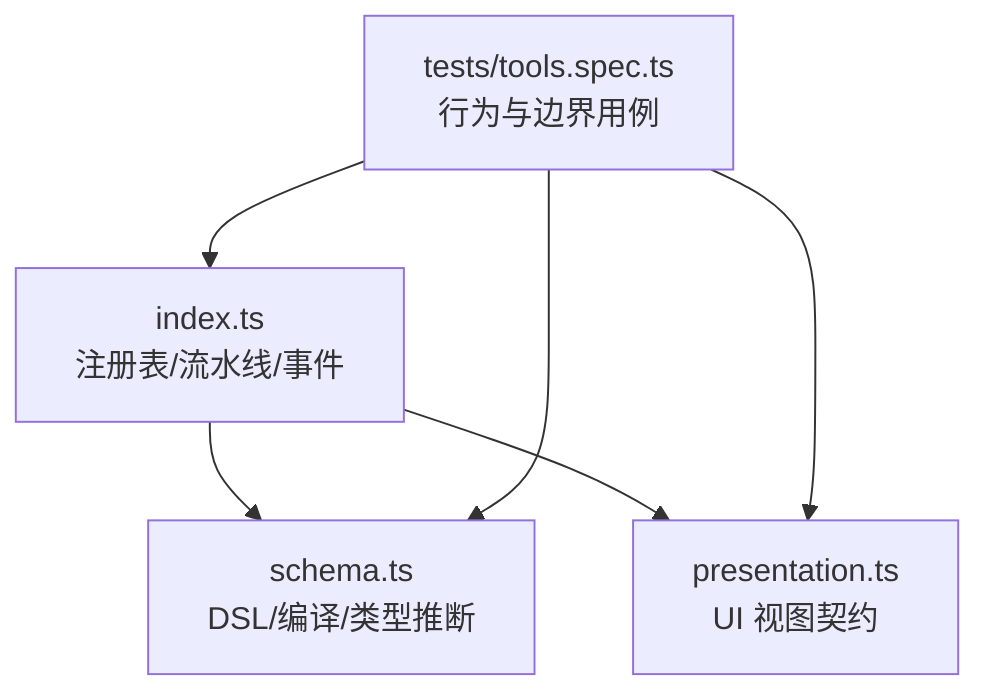
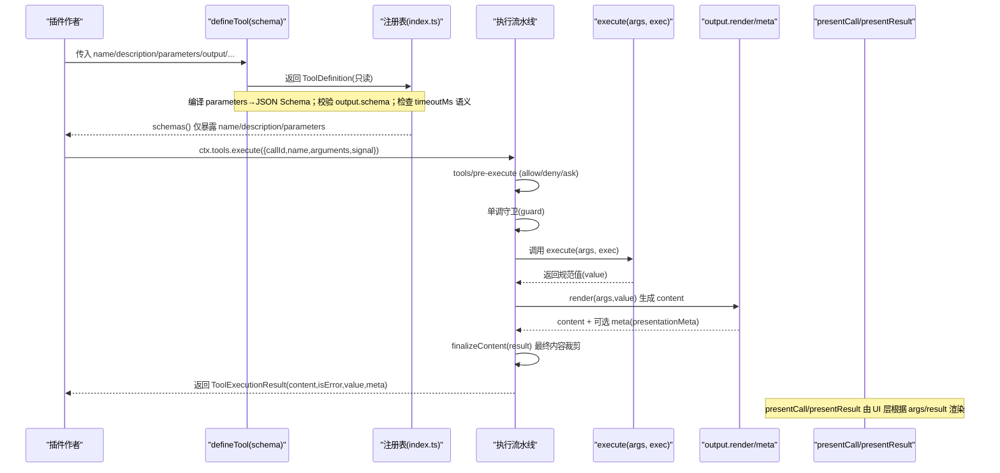
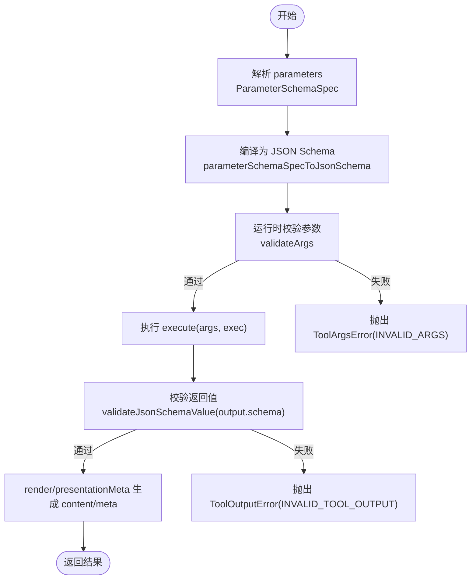
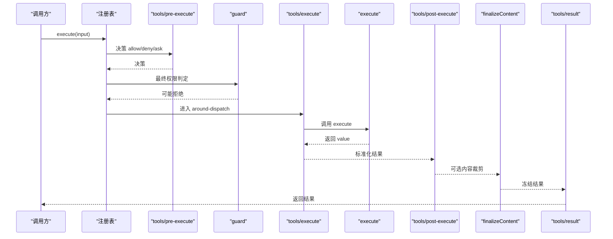
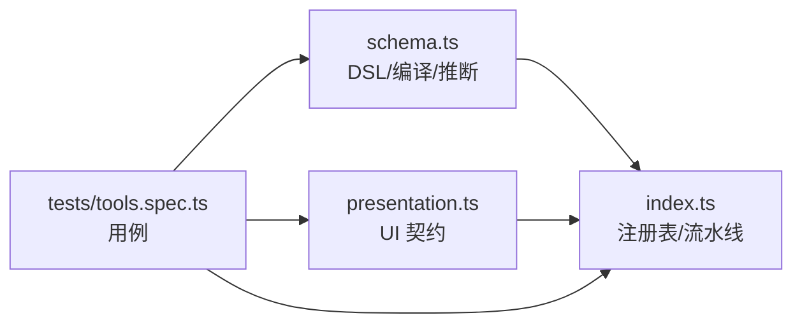

# 工具定义语法

<cite>
**本文引用的文件**
- [packages/core/tools/src/index.ts](file://packages/core/tools/src/index.ts)
- [packages/core/tools/src/schema.ts](file://packages/core/tools/src/schema.ts)
- [packages/core/tools/src/presentation.ts](file://packages/core/tools/src/presentation.ts)
- [packages/core/tools/tests/tools.spec.ts](file://packages/core/tools/tests/tools.spec.ts)
- [docs/subsystems/tools.md](file://docs/subsystems/tools.md)
- [website/.generated/en/reference/subsystems/tools.md](file://website/.generated/en/reference/subsystems/tools.md)
</cite>

## 目录
1. [简介](#简介)
2. [项目结构](#项目结构)
3. [核心组件](#核心组件)
4. [架构总览](#架构总览)
5. [详细组件分析](#详细组件分析)
6. [依赖关系分析](#依赖关系分析)
7. [性能与并发特性](#性能与并发特性)
8. [故障排查指南](#故障排查指南)
9. [结论](#结论)
10. [附录：参数与输出类型推断速查](#附录参数与输出类型推断速查)

## 简介
本文件面向插件作者与工具开发者，系统化说明 defineTool API 的完整语法、类型约束、执行流程与最佳实践。重点覆盖：
- 必需参数：name、description、parameters、output（含 schema、render、presentationMeta）
- 可选参数：timeoutMs、isConcurrencySafe、finalizeContent、presentCall、presentResult
- TypeScript 类型推断机制：通过 parameters 与 output.schema 获得强类型的 execute 入参与返回值
- 常见错误与调试技巧：参数校验失败、输出校验失败、超时与取消、UI 展示异常等

## 项目结构
工具子系统位于 packages/core/tools，核心由以下模块组成：
- index.ts：注册表、执行流水线、事件水落流、导出 defineTool 及相关类型
- schema.ts：统一的 JSON 值 Schema DSL、参数/输出编译、defineTool 辅助函数与类型推断
- presentation.ts：工具在 UI 中的“待处理/已完成”视图契约（card 标签渲染意图）
- tests/tools.spec.ts：大量用例验证 defineTool 行为、Schema 转换、超时、错误路径等

图表来源
- [packages/core/tools/src/index.ts:1-200](file://packages/core/tools/src/index.ts#L1-L200)
- [packages/core/tools/src/schema.ts:1-200](file://packages/core/tools/src/schema.ts#L1-L200)
- [packages/core/tools/tests/tools.spec.ts:1-200](file://packages/core/tools/tests/tools.spec.ts#L1-L200)

章节来源
- [packages/core/tools/src/index.ts:1-200](file://packages/core/tools/src/index.ts#L1-L200)
- [packages/core/tools/src/schema.ts:1-200](file://packages/core/tools/src/schema.ts#L1-L200)
- [packages/core/tools/tests/tools.spec.ts:1-200](file://packages/core/tools/tests/tools.spec.ts#L1-L200)

## 核心组件
- ToolDefinition：已注册工具的完整描述，包含面向模型的 ToolSchema 以及执行与展示相关字段
- ToolOutputDefinition：规范输出契约，声明 schema、render、presentationMeta
- defineTool：作者侧便捷入口，负责参数校验、Schema 编译、类型推断与注册前检查
- 执行流水线：pre-execute → guard → execute（around-dispatch）→ post-execute → finalizeContent → result
- 展示契约：presentCall（待处理）、presentResult（已完成），以 card 标签统一表达

章节来源
- [docs/subsystems/tools.md:9-96](file://docs/subsystems/tools.md#L9-L96)
- [website/.generated/en/reference/subsystems/tools.md:12-97](file://website/.generated/en/reference/subsystems/tools.md#L12-L97)

## 架构总览
下图展示了 defineTool 到执行与展示的端到端流程，包括参数校验、输出校验、超时控制、并行策略与 UI 呈现。

图表来源
- [packages/core/tools/src/index.ts:142-200](file://packages/core/tools/src/index.ts#L142-L200)
- [packages/core/tools/src/schema.ts:177-200](file://packages/core/tools/src/schema.ts#L177-L200)
- [docs/subsystems/tools.md:170-408](file://docs/subsystems/tools.md#L170-L408)

## 详细组件分析

### defineTool 参数详解与类型约束
- name：字符串，工具唯一标识
- description：字符串，面向模型的工具用途说明
- parameters：ParameterSchemaSpec，隐式开放对象属性映射，每个属性可标注 required: true 表示必填
  - 支持 string/number/integer/boolean/null/array/object/json/oneOf
  - 编译为 JSON Schema 并用于运行时 validateArgs 校验
- output：ToolOutputDefinition
  - schema：JsonSchemaNode，对 execute 返回值进行严格校验
  - render：(args, value) => ContentBlock[]，将规范值投影为模型/原生内容
  - presentationMeta?：(args, value) => JsonValue，顶层调用时计算元数据（如 diff、搜索摘要）
- execute(args, exec)：异步函数，接收未知类型参数（由 defineTool 校验后收窄），返回符合 output.schema 的值
- timeoutMs?：正有限毫秒数，作为协作式超时预算，不会发送到模型；由 tools/execute 包装器强制
- isConcurrencySafe?(args)：纯同步分类器，精确返回 true 才允许与兄弟调用并行
- finalizeContent?(exec, result)：同步最后一步内容变换，必须幂等且不抛错，可裁剪内容或保留 undefined
- presentCall?(args)：待处理状态 UI 视图（card 标签）
- presentResult?(args, result)：已完成状态 UI 视图（card 标签）

章节来源
- [docs/subsystems/tools.md:9-96](file://docs/subsystems/tools.md#L9-L96)
- [website/.generated/en/reference/subsystems/tools.md:12-97](file://website/.generated/en/reference/subsystems/tools.md#L12-L97)
- [packages/core/tools/src/schema.ts:1-200](file://packages/core/tools/src/schema.ts#L1-L200)

### 参数 Schema 与类型推断
- ParameterSchemaSpec 是隐式开放对象根，required 标记在属性级
- InferArgs
 依据 required 生成必填/可选键的类型
- InferValue<S> 基于 output.schema 推导 execute 返回值与 render/presentationMeta 的参数类型
- 精确推断上限为 16 层容器，之后回退为 JsonValue，避免耗尽 TS 实例化栈
- 编译产物与运行时校验共享同一份声明，保证一致性

图表来源
- [packages/core/tools/src/schema.ts:177-200](file://packages/core/tools/src/schema.ts#L177-L200)
- [docs/subsystems/tools.md:149-151](file://docs/subsystems/tools.md#L149-L151)

章节来源
- [docs/subsystems/tools.md:98-151](file://docs/subsystems/tools.md#L98-L151)
- [website/.generated/en/reference/subsystems/tools.md:101-155](file://website/.generated/en/reference/subsystems/tools.md#L101-L155)
- [packages/core/tools/tests/tools.spec.ts:2047-2163](file://packages/core/tools/tests/tools.spec.ts#L2047-L2163)

### 执行流水线与会话事件
- pre-execute：允许/拒绝/请求审批
- guard：单调守卫，只能减少权限
- execute（around-dispatch）：可替换 signal，实现超时/重试/指标
- post-execute：接受/替换 content/value 或阻断为错误
- finalizeContent：工具自定义最终内容裁剪
- result：不可变最终结果通知

图表来源
- [packages/core/tools/src/index.ts:142-200](file://packages/core/tools/src/index.ts#L142-L200)
- [docs/subsystems/tools.md:170-408](file://docs/subsystems/tools.md#L170-L408)

章节来源
- [packages/core/tools/src/index.ts:142-200](file://packages/core/tools/src/index.ts#L142-L200)
- [docs/subsystems/tools.md:170-408](file://docs/subsystems/tools.md#L170-L408)

### UI 展示契约（presentCall / presentResult）
- 使用 card 标签的统一视图契约，跨客户端/宿主无关
- 待处理视图：generic/terminal/diff 等
- 完成视图：generic/terminal/diff/search/read/web 等
- presentCall/presentResult 必须是纯函数且无副作用，以便回放与直播一致

章节来源
- [docs/subsystems/tools.md:459-468](file://docs/subsystems/tools.md#L459-L468)
- [packages/core/tools/src/presentation.ts](file://packages/core/tools/src/presentation.ts)

### 示例：从简单到复杂
- 简单字符串处理工具：定义 parameters.text 为 string，output.schema 为 string，render 直接转 text 块
- 复合工具：parameters 嵌套 object，output.schema 为 object/array/scalar/null，presentationMeta 提供结构化元数据（如 diffs、search 摘要）
- 带超时与并行：设置 timeoutMs 为正有限值；isConcurrencySafe 返回 true 以加入并行池

注意：为避免泄露实现细节，此处不粘贴代码片段，请参考下列源码路径查看具体用法与断言。

章节来源
- [packages/core/tools/tests/tools.spec.ts:23-34](file://packages/core/tools/tests/tools.spec.ts#L23-L34)
- [packages/core/tools/tests/tools.spec.ts:2047-2163](file://packages/core/tools/tests/tools.spec.ts#L2047-L2163)
- [packages/core/tools/tests/tools.spec.ts:2685-2716](file://packages/core/tools/tests/tools.spec.ts#L2685-L2716)

## 依赖关系分析
- defineTool 依赖 schema.ts 的 DSL 与编译逻辑，确保参数与输出的一致性
- 注册表 index.ts 维护 ToolDefinition，并通过 schemas() 暴露最小化的模型可见字段
- 执行流水线通过 events.waterfall 扩展点注入超时、重试、审计、结果裁剪等能力
- presentation.ts 提供中性 UI 契约，解耦宿主与客户端

图表来源
- [packages/core/tools/src/index.ts:1-200](file://packages/core/tools/src/index.ts#L1-L200)
- [packages/core/tools/src/schema.ts:1-200](file://packages/core/tools/src/schema.ts#L1-L200)
- [packages/core/tools/tests/tools.spec.ts:1-200](file://packages/core/tools/tests/tools.spec.ts#L1-L200)

章节来源
- [packages/core/tools/src/index.ts:1-200](file://packages/core/tools/src/index.ts#L1-L200)
- [packages/core/tools/src/schema.ts:1-200](file://packages/core/tools/src/schema.ts#L1-L200)

## 性能与并发特性
- 超时控制：timeoutMs 为正有限毫秒数，由 tools/execute 包装器强制执行；未声明则无截止
- 并行执行：isConcurrencySafe 精确返回 true 才可加入并行组；要求不修改父级状态，共享状态需并发安全
- 类型推断深度：InferValue 限制在 16 层容器内保持精确，超出回退为 JsonValue，避免 TS 栈溢出
- 序列化与冻结：成功结果会被快照、校验并冻结，保证回放与持久化一致性

章节来源
- [docs/subsystems/tools.md:53-74](file://docs/subsystems/tools.md#L53-L74)
- [docs/subsystems/tools.md:149-151](file://docs/subsystems/tools.md#L149-L151)
- [packages/core/tools/tests/tools.spec.ts:2685-2716](file://packages/core/tools/tests/tools.spec.ts#L2685-L2716)

## 故障排查指南
- 参数不匹配：抛出 ToolArgsError（INVALID_ARGS），检查 parameters 中 required 与类型是否一致
- 输出无效：抛出 ToolOutputError（INVALID_TOOL_OUTPUT），检查 output.schema 与 execute 返回值
- 超时：若 timeoutMs 非正有限数会报错；确保 execute 内部转发 exec.signal 并在取消时尽快归零
- UI 展示异常：ensure presentCall/presentResult 为纯函数；presentationMeta 必须返回可序列化的 JsonValue
- 回调泄漏：schemas() 仅暴露 name/description/parameters，其他字段不会到达模型

章节来源
- [docs/subsystems/tools.md:149-151](file://docs/subsystems/tools.md#L149-L151)
- [packages/core/tools/tests/tools.spec.ts:132-197](file://packages/core/tools/tests/tools.spec.ts#L132-L197)
- [packages/core/tools/tests/tools.spec.ts:2685-2716](file://packages/core/tools/tests/tools.spec.ts#L2685-L2716)

## 结论
defineTool 通过统一的 JSON 值 Schema DSL 将参数与输出的类型推断、编译与运行时校验打通，配合可扩展的执行流水线与中性 UI 契约，使工具开发具备强类型、可观测、可组合与可展示的能力。遵循本文的最佳实践可获得更健壮、高效且易维护的工具实现。

## 附录：参数与输出类型推断速查
- parameters 中每个属性的 required: true 会映射为 execute 入参的必填键
- output.schema 决定 execute 返回值与 render/presentationMeta 的类型
- { type: 'json' } 推导为 JsonValue，并编译为无约束的原始 schema
- 深层嵌套超过 16 层容器时，类型回退为 JsonValue，但运行时仍按完整 schema 校验

章节来源
- [docs/subsystems/tools.md:98-151](file://docs/subsystems/tools.md#L98-L151)
- [website/.generated/en/reference/subsystems/tools.md:101-155](file://website/.generated/en/reference/subsystems/tools.md#L101-L155)
- [packages/core/tools/tests/tools.spec.ts:2047-2163](file://packages/core/tools/tests/tools.spec.ts#L2047-L2163)