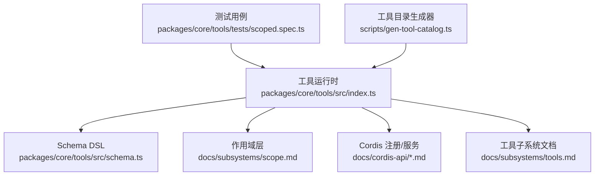
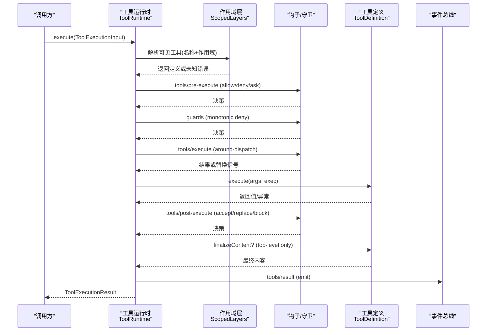
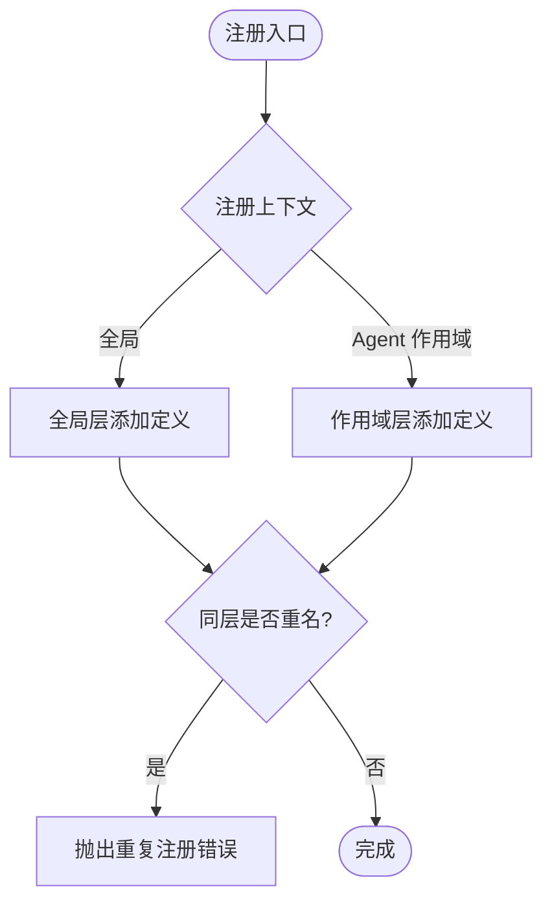
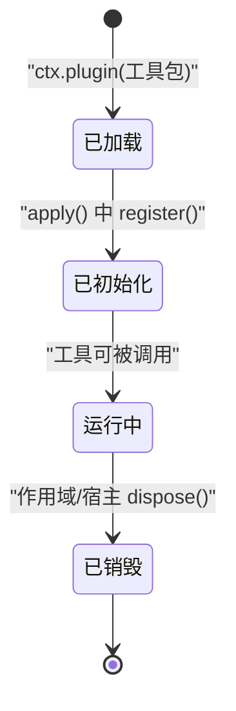
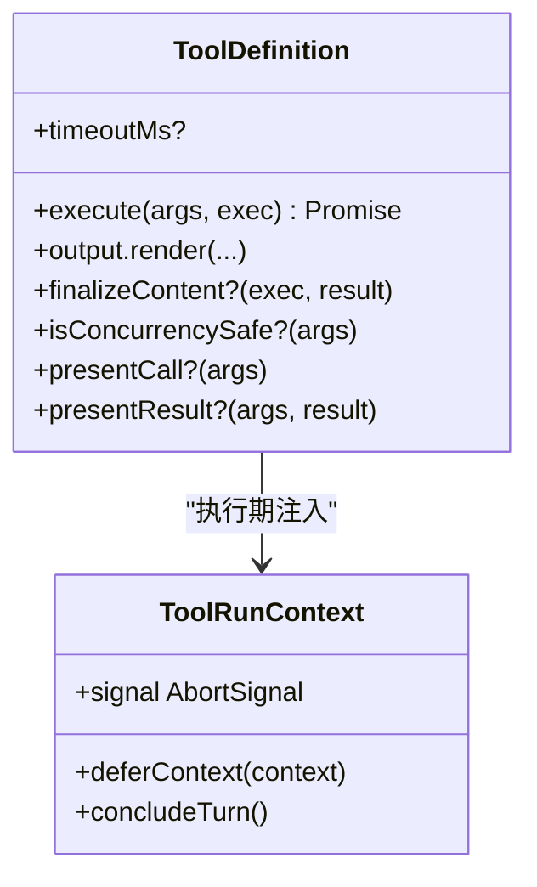
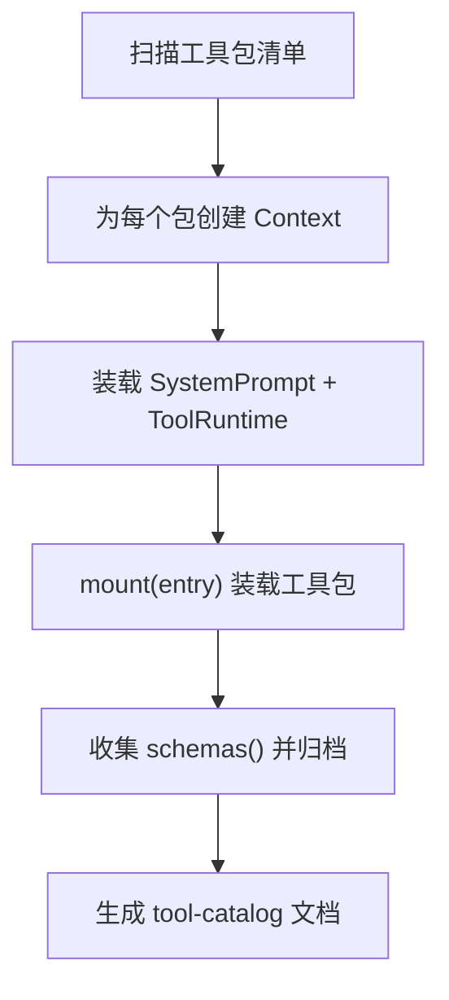
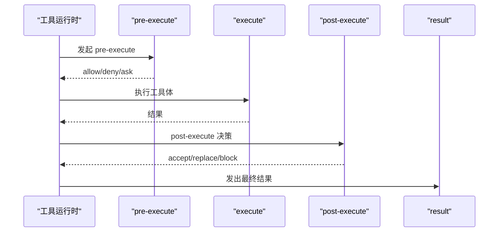
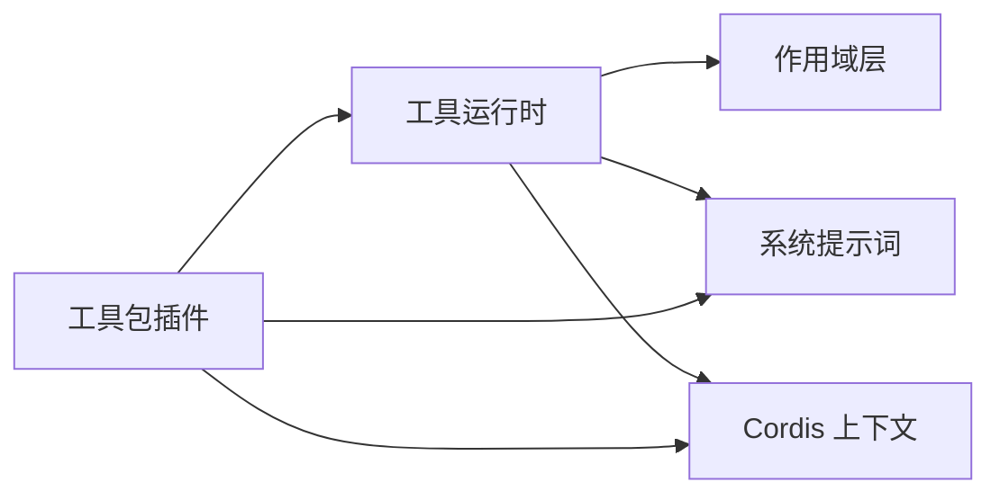

# 工具注册与管理

<cite>
**本文引用的文件**
- [packages/core/tools/src/index.ts](file://packages/core/tools/src/index.ts)
- [packages/core/tools/src/schema.ts](file://packages/core/tools/src/schema.ts)
- [docs/subsystems/tools.md](file://docs/subsystems/tools.md)
- [docs/cordis-api/registry.md](file://docs/cordis-api/registry.md)
- [docs/cordis-api/context.md](file://docs/cordis-api/context.md)
- [docs/cordis-api/service.md](file://docs/cordis-api/service.md)
- [docs/subsystems/scope.md](file://docs/subsystems/scope.md)
- [.agents/notes/implemented/architecture/2026-07-08-agent-scope-contexts.md](file://.agents/notes/implemented/architecture/2026-07-08-agent-scope-contexts.md)
- [packages/core/tools/tests/scoped.spec.ts](file://packages/core/tools/tests/scoped.spec.ts)
- [scripts/gen-tool-catalog.ts](file://scripts/gen-tool-catalog.ts)
</cite>

## 目录
1. [简介](#简介)
2. [项目结构](#项目结构)
3. [核心组件](#核心组件)
4. [架构总览](#架构总览)
5. [详细组件分析](#详细组件分析)
6. [依赖关系分析](#依赖关系分析)
7. [性能考量](#性能考量)
8. [故障排查指南](#故障排查指南)
9. [结论](#结论)
10. [附录](#附录)

## 简介
本文件系统性说明工具（Tool）的注册与管理体系，覆盖以下主题：
- 全局注册与按 Agent 作用域注册的两种方式
- 工具生命周期：加载、初始化、销毁
- 依赖注入机制与执行期上下文访问
- 工具发现与自动加载
- 命名规范、版本管理与冲突解决策略
- 调试与监控方法

## 项目结构
工具子系统由“工具运行时”“工具定义 DSL”“作用域层”“Cordis 插件/服务框架”共同组成。关键位置如下：
- 工具运行时与管线：packages/core/tools/src/index.ts
- 工具参数/输出 Schema DSL：packages/core/tools/src/schema.ts
- 作用域与可见性：docs/subsystems/scope.md
- Cordis 注册与服务：docs/cordis-api/registry.md, docs/cordis-api/context.md, docs/cordis-api/service.md
- 工具子系统文档：docs/subsystems/tools.md
- 测试用例（作用域/限制/冲突）：packages/core/tools/tests/scoped.spec.ts
- 工具目录生成器（自动发现）：scripts/gen-tool-catalog.ts

图表来源
- [packages/core/tools/src/index.ts:826-837](file://packages/core/tools/src/index.ts#L826-L837)
- [packages/core/tools/src/schema.ts:1-120](file://packages/core/tools/src/schema.ts#L1-L120)
- [docs/subsystems/scope.md:1-60](file://docs/subsystems/scope.md#L1-L60)
- [docs/cordis-api/registry.md:1-153](file://docs/cordis-api/registry.md#L1-L153)
- [docs/subsystems/tools.md:1-120](file://docs/subsystems/tools.md#L1-L120)
- [packages/core/tools/tests/scoped.spec.ts:87-136](file://packages/core/tools/tests/scoped.spec.ts#L87-L136)
- [scripts/gen-tool-catalog.ts:693-730](file://scripts/gen-tool-catalog.ts#L693-L730)

章节来源
- [packages/core/tools/src/index.ts:826-837](file://packages/core/tools/src/index.ts#L826-L837)
- [docs/subsystems/tools.md:1-120](file://docs/subsystems/tools.md#L1-L120)

## 核心组件
- 工具运行时（ToolRuntime）：提供注册、查询、执行、模式切换、事件总线等能力；维护基于作用域的可见性层。
- 工具定义（ToolDefinition）：包含模型可见的 schema、执行函数、输出投影、可选内容终态处理、并发安全标记、UI 呈现等。
- Schema DSL：统一的参数/输出类型声明与编译校验，确保模型侧 JSON Schema 与执行侧类型一致。
- 作用域（Scope）：以 ScopeKey 为路由键，实现“全局 + 每 Agent 作用域”的叠加与遮蔽。
- Cordis 插件/服务：通过 ctx.plugin/inject/provide 完成服务装配与生命周期管理。

章节来源
- [docs/subsystems/tools.md:9-152](file://docs/subsystems/tools.md#L9-L152)
- [packages/core/tools/src/index.ts:826-837](file://packages/core/tools/src/index.ts#L826-L837)
- [docs/cordis-api/registry.md:1-153](file://docs/cordis-api/registry.md#L1-L153)
- [docs/subsystems/scope.md:1-60](file://docs/subsystems/scope.md#L1-L60)

## 架构总览
工具注册与执行的关键路径：
- 注册阶段：通过 ctx.tools.register 在全局或 Agent 作用域注册 ToolDefinition；同一层内同名重复会报错；作用域内的注册可遮蔽全局同名工具。
- 可见性：通过 ScopedLayers 组合“全局层 + 各作用域层”，读取时按链自底向上合并，作用域层优先。
- 执行阶段：ctx.tools.execute 进入预执行水线（tools/pre-execute）、守卫（guards）、环绕包装（tools/execute）、后处理（tools/post-execute）、定义级 finalizeContent，最终产出不可变结果并触发 tools/result。
- 模式切换：presentAs 可在作用域上切换“native/code/both”展示模式，影响模型可见的工具集合与提示词片段。

图表来源
- [packages/core/tools/src/index.ts:142-200](file://packages/core/tools/src/index.ts#L142-L200)
- [docs/subsystems/tools.md:170-405](file://docs/subsystems/tools.md#L170-L405)
- [packages/core/tools/src/index.ts:811-814](file://packages/core/tools/src/index.ts#L811-L814)

章节来源
- [docs/subsystems/tools.md:170-405](file://docs/subsystems/tools.md#L170-L405)
- [packages/core/tools/src/index.ts:142-200](file://packages/core/tools/src/index.ts#L142-L200)

## 详细组件分析

### 工具注册：全局与作用域
- 全局注册：在部署根上下文使用 ctx.tools.register 注册，对所有作用域可见（除非被限制）。
- 作用域注册：在 Agent 作用域上下文（agent.ctx）中注册，仅对该 Agent 可见，并可遮蔽全局同名工具。
- 限制：scope.ctx.tools.restrict 可对当前作用域屏蔽部分全局工具；允许列表与拒绝列表可叠加。
- 冲突：同一层内重复注册同名工具会抛出错误；跨层可通过作用域遮蔽。

图表来源
- [packages/core/tools/tests/scoped.spec.ts:87-117](file://packages/core/tools/tests/scoped.spec.ts#L87-L117)
- [docs/subsystems/tools.md:498-513](file://docs/subsystems/tools.md#L498-L513)

章节来源
- [packages/core/tools/tests/scoped.spec.ts:87-136](file://packages/core/tools/tests/scoped.spec.ts#L87-L136)
- [docs/subsystems/tools.md:498-513](file://docs/subsystems/tools.md#L498-L513)
- [.agents/notes/implemented/architecture/2026-07-08-agent-scope-contexts.md:61-97](file://.agents/notes/implemented/architecture/2026-07-08-agent-scope-contexts.md#L61-L97)

### 工具生命周期：加载、初始化、销毁
- 加载：通过 Cordis 插件机制（ctx.plugin）装载工具包；工具包通常导出 { inject, Config, apply } 或函数/类形式。
- 初始化：工具包在 apply 中调用 ctx.tools.register 完成注册；非 native 模式下还会注册系统提示词片段（如 code-only 规则与 SDK 片段）。
- 销毁：作用域 dispose 会回滚该作用域的所有注册；全局注册需显式卸载或通过宿主生命周期管理。

图表来源
- [docs/cordis-api/registry.md:35-56](file://docs/cordis-api/registry.md#L35-L56)
- [packages/core/tools/src/index.ts:826-837](file://packages/core/tools/src/index.ts#L826-L837)
- [packages/core/tools/tests/scoped.spec.ts:109-117](file://packages/core/tools/tests/scoped.spec.ts#L109-L117)

章节来源
- [docs/cordis-api/registry.md:35-56](file://docs/cordis-api/registry.md#L35-L56)
- [packages/core/tools/src/index.ts:826-837](file://packages/core/tools/src/index.ts#L826-L837)
- [packages/core/tools/tests/scoped.spec.ts:109-117](file://packages/core/tools/tests/scoped.spec.ts#L109-L117)

### 依赖注入与执行期上下文
- 依赖声明：工具包通过 inject 声明所需服务（数组或对象形式），Cordis 保证在依赖可用时再运行插件体。
- 执行期上下文：工具 execute 接收 ToolRunContext，包含执行身份、取消信号、deferContext、concludeTurn 等能力。
- 服务访问：工具通过 ctx 获取其他服务（如 shell、fs、jobs 等），这些服务由宿主或插件提供。

图表来源
- [docs/subsystems/tools.md:25-93](file://docs/subsystems/tools.md#L25-L93)
- [docs/subsystems/tools.md:214-241](file://docs/subsystems/tools.md#L214-L241)
- [docs/cordis-api/registry.md:123-153](file://docs/cordis-api/registry.md#L123-L153)

章节来源
- [docs/subsystems/tools.md:25-93](file://docs/subsystems/tools.md#L25-L93)
- [docs/subsystems/tools.md:214-241](file://docs/subsystems/tools.md#L214-L241)
- [docs/cordis-api/registry.md:123-153](file://docs/cordis-api/registry.md#L123-L153)

### 工具发现与自动加载
- 目录生成器：scripts/gen-tool-catalog.ts 会枚举 shipped 工具包，启动独立 Context，装载 SystemPrompt 与 ToolRuntime，再挂载各工具包，收集 ctx.tools.schemas() 生成文档目录。
- 作用：确保每个工具包都被引导并暴露其模型可见 schema；缺失条目会在验证阶段失败，避免“静默未记录”。

图表来源
- [scripts/gen-tool-catalog.ts:693-730](file://scripts/gen-tool-catalog.ts#L693-L730)

章节来源
- [scripts/gen-tool-catalog.ts:693-730](file://scripts/gen-tool-catalog.ts#L693-L730)

### 最佳实践：命名、版本与冲突
- 命名规范
  - 使用稳定、可读、领域相关的工具名；避免单字母或易混淆缩写。
  - 多提供者场景下，通过配置化 toolName 区分不同后端（例如 subagent vs subagent_acp）。
- 版本管理
  - 对可能变更行为的工具，采用语义化版本并在描述中注明破坏性更新。
  - 通过作用域隔离新旧版本，逐步迁移。
- 冲突解决
  - 同一层内禁止重复注册同名工具；如需覆盖，应在上层作用域注册并明确遮蔽。
  - 使用 restrict 精确控制某作用域可见的全局工具集，避免误用。

章节来源
- [packages/subagent/tool-subagent/tests/tool-subagent.spec.ts:204-224](file://packages/subagent/tool-subagent/tests/tool-subagent.spec.ts#L204-L224)
- [packages/core/tools/tests/scoped.spec.ts:87-117](file://packages/core/tools/tests/scoped.spec.ts#L87-L117)
- [docs/subsystems/tools.md:498-513](file://docs/subsystems/tools.md#L498-L513)

### 调试与监控
- 执行管道事件
  - tools/pre-execute：允许/拒绝/请求审批前拦截。
  - tools/execute：超时、重试、指标埋点等环绕逻辑。
  - tools/post-execute：接受/替换/阻断结果。
  - tools/result：观察最终冻结结果。
- 代码模式日志
  - tools/code-dispatch-log：可替换 run_code 子调用的持久化日志副本内容（不影响程序值与模型可见结果）。
- 变更通知
  - tools/change：工具注册/注销或作用域限制变化时触发（非作用域过滤，便于全局监听）。

图表来源
- [packages/core/tools/src/index.ts:142-200](file://packages/core/tools/src/index.ts#L142-L200)
- [docs/subsystems/tools.md:576-720](file://docs/subsystems/tools.md#L576-L720)

章节来源
- [packages/core/tools/src/index.ts:142-200](file://packages/core/tools/src/index.ts#L142-L200)
- [docs/subsystems/tools.md:576-720](file://docs/subsystems/tools.md#L576-L720)

## 依赖关系分析
- 工具运行时依赖：
  - 作用域层（ScopedLayers）：维护全局与各作用域的注册表与可见性。
  - 系统提示词（systemPrompt）：根据模式注入 code-only 规则与 SDK 片段。
  - Cordis 上下文：用于插件加载、服务提供与事件分发。
- 工具包依赖：
  - 通过 inject 声明所需服务（如 tools、systemPrompt、shell、fs、jobs 等）。
  - 在 apply 中完成注册与副作用初始化。

图表来源
- [packages/core/tools/src/index.ts:826-837](file://packages/core/tools/src/index.ts#L826-L837)
- [docs/cordis-api/registry.md:35-56](file://docs/cordis-api/registry.md#L35-L56)

章节来源
- [packages/core/tools/src/index.ts:826-837](file://packages/core/tools/src/index.ts#L826-L837)
- [docs/cordis-api/registry.md:35-56](file://docs/cordis-api/registry.md#L35-L56)

## 性能考量
- 并行与独占：工具可通过 isConcurrencySafe 声明是否允许与兄弟调用并行；否则走独占模式形成顺序屏障。
- 超时预算：timeoutMs 为协作式超时预算，配合执行包装器进行超时策略。
- 子调用并行：code-mode 下的 run_code 支持 maxParallelSubCalls 控制子调用并发度。
- 结果冻结：最终结果在观察者前深冻结，避免后续修改导致不一致。

章节来源
- [docs/subsystems/tools.md:53-74](file://docs/subsystems/tools.md#L53-L74)
- [packages/core/tools/src/index.ts:826-837](file://packages/core/tools/src/index.ts#L826-L837)

## 故障排查指南
- 常见错误
  - 未知工具：名称不存在或被作用域限制隐藏。
  - 重复注册：同一层内重复注册同名工具。
  - 参数不合法：参数不符合 Schema 定义。
  - 输出不合法：执行返回值不符合 output.schema。
- 定位步骤
  - 检查 tools/pre-execute 是否 deny/ask。
  - 检查 guards 是否返回拒绝原因。
  - 检查 tools/post-execute 是否 block。
  - 查看 tools/result 的最终结果与错误信息。
  - 若涉及 run_code，检查 tools/code-dispatch-log 的持久化日志副本。

章节来源
- [docs/subsystems/tools.md:170-405](file://docs/subsystems/tools.md#L170-L405)
- [packages/core/tools/tests/scoped.spec.ts:87-117](file://packages/core/tools/tests/scoped.spec.ts#L87-L117)

## 结论
本系统通过“全局 + 作用域”的双层注册模型、严格的 Schema 约束、可扩展的执行水线与事件总线，提供了高内聚、低耦合、可观测的工具注册与管理能力。借助 Cordis 插件体系与作用域抽象，既能满足复杂部署的多 Agent 隔离需求，也能保持统一的工具契约与可观测性。

## 附录
- 快速上手建议
  - 在 Agent 作用域内注册专属工具，避免污染全局。
  - 使用 restrict 精确控制可见工具集。
  - 通过 tools/* 事件进行审计与监控。
  - 利用 Schema DSL 严格定义输入输出，减少运行时错误。
- 参考
  - 工具子系统文档：docs/subsystems/tools.md
  - 作用域文档：docs/subsystems/scope.md
  - Cordis 注册与服务：docs/cordis-api/registry.md, docs/cordis-api/context.md, docs/cordis-api/service.md