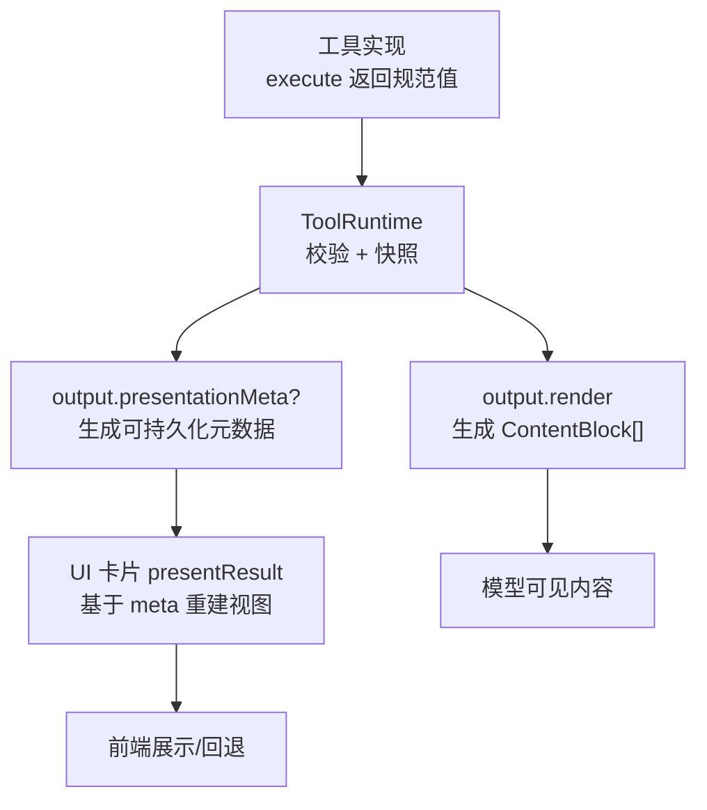
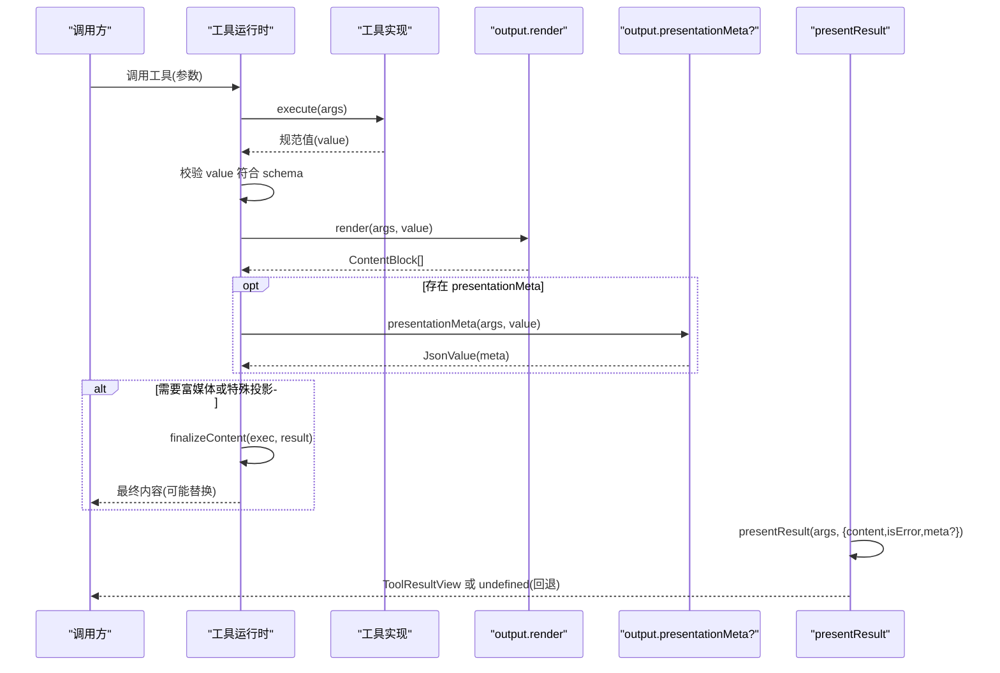
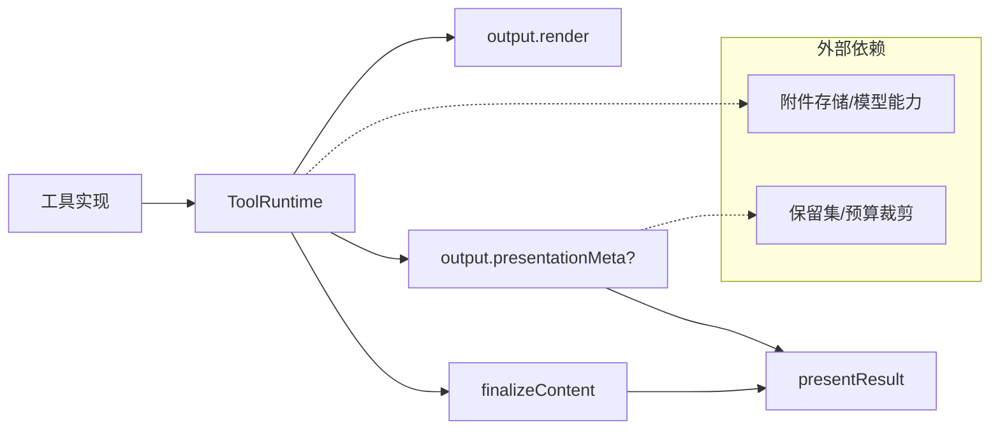
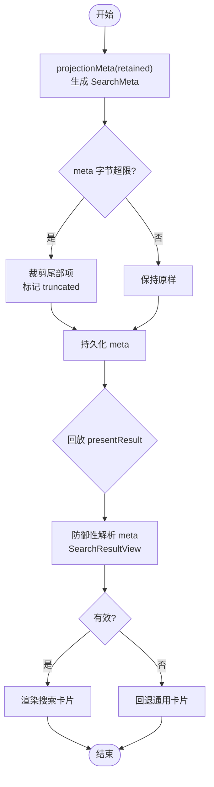

# 输出序列化与渲染

<cite>
**本文引用的文件**
- [packages/core/tools/src/presentation.ts](file://packages/core/tools/src/presentation.ts)
- [packages/mcp/mcp-client/src/tools.ts](file://packages/mcp/mcp-client/src/tools.ts)
- [packages/fs/tool-fs-search/src/presentation.ts](file://packages/fs/tool-fs-search/src/presentation.ts)
- [docs/cookbook/adding-a-tool.md](file://docs/cookbook/adding-a-tool.md)
- [website/.generated/reference/subsystems/tools.md](file://website/.generated/reference/subsystems/tools.md)
- [packages/client/connection/src/client/fixture.ts](file://packages/client/connection/src/client/fixture.ts)
</cite>

## 目录
1. [简介](#简介)
2. [项目结构](#项目结构)
3. [核心组件](#核心组件)
4. [架构总览](#架构总览)
5. [详细组件分析](#详细组件分析)
6. [依赖关系分析](#依赖关系分析)
7. [性能考虑](#性能考虑)
8. [故障排查指南](#故障排查指南)
9. [结论](#结论)
10. [附录](#附录)

## 简介
本文件聚焦“工具输出序列化与渲染”的完整链路：从工具返回的规范值，到模型可见的 ContentBlock[]，再到 UI 卡片（presentCall/presentResult）与持久化元数据 presentationMeta。文档解释 output.schema 的定义方式、render 的实现要求、presentationMeta 的作用、presentResult 的使用方式，并提供覆盖简单类型、复杂对象与富媒体内容的序列化示例路径与最佳实践。

## 项目结构
围绕输出序列化与渲染的关键位置如下：
- 工具输出契约与渲染意图定义：packages/core/tools/src/presentation.ts
- MCP 工具桥接与输出 schema/render/finalizeContent：packages/mcp/mcp-client/src/tools.ts
- 搜索类工具的 presentationMeta 投影与 presentResult 还原：packages/fs/tool-fs-search/src/presentation.ts
- 工具作者指南（output.schema、render、presentCall/presentResult、presentationMeta 的设计原则）：docs/cookbook/adding-a-tool.md
- 工具系统参考（ToolOutputDefinition 等）：website/.generated/reference/subsystems/tools.md
- 客户端侧对 search/read 等结果的呈现示例：packages/client/connection/src/client/fixture.ts

图表来源
- [packages/core/tools/src/presentation.ts:120-390](file://packages/core/tools/src/presentation.ts#L120-L390)
- [packages/mcp/mcp-client/src/tools.ts:244-291](file://packages/mcp/mcp-client/src/tools.ts#L244-L291)
- [packages/fs/tool-fs-search/src/presentation.ts:119-206](file://packages/fs/tool-fs-search/src/presentation.ts#L119-L206)
- [docs/cookbook/adding-a-tool.md:65-88](file://docs/cookbook/adding-a-tool.md#L65-L88)

章节来源
- [packages/core/tools/src/presentation.ts:1-390](file://packages/core/tools/src/presentation.ts#L1-L390)
- [packages/mcp/mcp-client/src/tools.ts:244-291](file://packages/mcp/mcp-client/src/tools.ts#L244-L291)
- [packages/fs/tool-fs-search/src/presentation.ts:1-206](file://packages/fs/tool-fs-search/src/presentation.ts#L1-L206)
- [docs/cookbook/adding-a-tool.md:65-88](file://docs/cookbook/adding-a-tool.md#L65-L88)
- [website/.generated/reference/subsystems/tools.md:12-26](file://website/.generated/reference/subsystems/tools.md#L12-L26)

## 核心组件
- ToolOutputDefinition：每个工具必须声明 output.schema、output.render，以及可选的 output.presentationMeta。schema 约束 execute 返回的规范值；render 将规范值转换为模型可见的 ContentBlock[]；presentationMeta 用于为 UI 卡片提供可持久化的元数据。
- ToolCallView / ToolResultView：纯展示意图，用于 presentCall/presentResult 描述 PENDING 与 COMPLETED 状态的卡片形状（generic、terminal、diff、search、read、web）。
- MCP 工具桥接：封装 output.schema/render，并在执行时准备最终内容（如图片富媒体），通过 finalizeContent 在结果阶段替换默认文本投影。
- 搜索工具 presentation：将保留的匹配/路径集合投影为 SearchMeta，并通过 presentResult 从 meta 恢复结构化搜索结果视图。

章节来源
- [website/.generated/reference/subsystems/tools.md:12-26](file://website/.generated/reference/subsystems/tools.md#L12-L26)
- [packages/core/tools/src/presentation.ts:120-390](file://packages/core/tools/src/presentation.ts#L120-L390)
- [packages/mcp/mcp-client/src/tools.ts:244-291](file://packages/mcp/mcp-client/src/tools.ts#L244-L291)
- [packages/fs/tool-fs-search/src/presentation.ts:119-206](file://packages/fs/tool-fs-search/src/presentation.ts#L119-L206)

## 架构总览
下图展示了“工具执行 → 输出序列化 → 渲染与卡片”的端到端流程，包括错误分支与富媒体处理。

图表来源
- [packages/mcp/mcp-client/src/tools.ts:244-291](file://packages/mcp/mcp-client/src/tools.ts#L244-L291)
- [packages/core/tools/src/presentation.ts:120-390](file://packages/core/tools/src/presentation.ts#L120-L390)
- [packages/fs/tool-fs-search/src/presentation.ts:119-206](file://packages/fs/tool-fs-search/src/presentation.ts#L119-L206)
- [docs/cookbook/adding-a-tool.md:65-88](file://docs/cookbook/adding-a-tool.md#L65-L88)

## 详细组件分析

### output.schema 定义与返回值类型约束
- 设计原则：output.schema 应作为“程序化 API”，直接暴露句柄与字段；当标量、数组或 null 就是真实结果时，允许相应根类型；人类可读的解释放在 output.render。
- 约束与校验：注册时会拒绝缺失 output 或未受支持的原始 schema；执行后会对 value 进行无损 JSON 快照与 schema 校验，不匹配会报错。
- 典型形态：
  - 简单类型：字符串、数字、布尔、null、数组、对象。
  - 复杂对象：包含嵌套字段、枚举、联合等。
  - 富媒体：MCP 桥接中 content 数组可含 image/audio/resource 等块，由 bridge 负责安全解码与持久化，并生成文本回退。

章节来源
- [docs/cookbook/adding-a-tool.md:65-69](file://docs/cookbook/adding-a-tool.md#L65-L69)
- [website/.generated/reference/subsystems/tools.md:12-26](file://website/.generated/reference/subsystems/tools.md#L12-L26)
- [packages/mcp/mcp-client/src/tools.ts:274-291](file://packages/mcp/mcp-client/src/tools.ts#L274-L291)

### output.render 实现要求与 ContentBlock[] 转换
- 职责：将 validated 的 value 转换为模型可见的 ContentBlock[]。应保持纯函数、无副作用，便于回放一致。
- 常见模式：
  - 文本：将 value 转为 text 块。
  - 富媒体：MCP 桥接将 image/audio/resource 等映射为文本提示或附件引用，同时保留原始 value 供程序调用者使用。
  - 空结果：若无内容，需给出有意义的占位说明。
- 注意：不要把 UI 专属格式（如 diff、终端围栏代码块）放入 render；这些属于 presentResult 的职责。

章节来源
- [packages/mcp/mcp-client/src/tools.ts:274-291](file://packages/mcp/mcp-client/src/tools.ts#L274-L291)
- [packages/mcp/mcp-client/src/tools.ts:489-559](file://packages/mcp/mcp-client/src/tools.ts#L489-L559)
- [docs/cookbook/adding-a-tool.md:65-88](file://docs/cookbook/adding-a-tool.md#L65-L88)

### presentationMeta 的作用与用法
- 作用：从同一规范值派生“可持久化的元数据”，用于 UI 卡片在回放时重建结构化视图（例如 diff hunks、搜索匹配分组、读取窗口信息、Web 检索来源等）。
- 特性：纯函数、仅顶层调用计算、随 tool/result 持久化，presentResult 据此恢复视图；若 meta 缺失或损坏，presentResult 应降级为通用卡片而不抛错。
- 示例：搜索工具将保留的匹配/路径序列化为 SearchMeta，并在 presentResult 中防御性解析为 SearchResultView。

章节来源
- [packages/fs/tool-fs-search/src/presentation.ts:1-27](file://packages/fs/tool-fs-search/src/presentation.ts#L1-L27)
- [packages/fs/tool-fs-search/src/presentation.ts:119-206](file://packages/fs/tool-fs-search/src/presentation.ts#L119-L206)
- [docs/cookbook/adding-a-tool.md:65-88](file://docs/cookbook/adding-a-tool.md#L65-L88)

### presentResult 自定义结果展示界面
- 职责：根据 args 与 result（含 content、isError、meta?）返回 ToolResultView 或 undefined（回退到通用卡片）。
- 支持卡片：
  - generic：标题与内容。
  - terminal：原始输出与退出码/信号。
  - diff：已应用的变更 hunk。
  - search：按文件分组的匹配或扁平路径列表，带 truncated/total。
  - read：行号、语言、窗口范围等。
  - web：搜索来源或抓取摘要。
- 规则：必须纯函数；对旧日志或损坏 meta 要健壮降级；不要在 presentResult 中做 I/O。

章节来源
- [packages/core/tools/src/presentation.ts:120-390](file://packages/core/tools/src/presentation.ts#L120-L390)
- [packages/client/connection/src/client/fixture.ts:675-699](file://packages/client/connection/src/client/fixture.ts#L675-L699)
- [docs/cookbook/adding-a-tool.md:65-88](file://docs/cookbook/adding-a-tool.md#L65-L88)

### 富媒体与 finalizeContent
- MCP 桥接在执行时检测 content 是否包含图像，必要时将图像保存到附件存储，并生成 image 类型的 ContentBlock；失败则回退为文本提示。
- finalizeContent 在结果阶段比较 value 与 fallback，若一致且非错误，则用富媒体投影替换默认文本投影。

章节来源
- [packages/mcp/mcp-client/src/tools.ts:244-291](file://packages/mcp/mcp-client/src/tools.ts#L244-L291)
- [packages/mcp/mcp-client/src/tools.ts:393-487](file://packages/mcp/mcp-client/src/tools.ts#L393-L487)

### 输出序列化示例（路径指引）
- 简单数据类型（字符串）：参见工具作者指南中的最小示例，其 output.schema 为 string，render 返回 text 块。
- 复杂对象结构：MCP 桥接构造 object schema，包含 content 与 structuredContent 两个属性，render 提取文本。
- 富媒体内容：MCP 桥接将 image/audio/resource 等块映射为附件或文本提示，并通过 finalizeContent 注入富媒体投影。

章节来源
- [docs/cookbook/adding-a-tool.md:65-69](file://docs/cookbook/adding-a-tool.md#L65-L69)
- [packages/mcp/mcp-client/src/tools.ts:274-291](file://packages/mcp/mcp-client/src/tools.ts#L274-L291)
- [packages/mcp/mcp-client/src/tools.ts:489-559](file://packages/mcp/mcp-client/src/tools.ts#L489-L559)

## 依赖关系分析
- 工具实现依赖 ToolRuntime 提供的执行上下文与输出契约。
- MCP 桥接依赖 LLM 附件服务与模型能力探测，以决定是否保存图像并生成富媒体投影。
- 搜索工具 presentation 依赖保留集（RetainedItems）与字节预算裁剪，确保 meta 大小可控。
- UI 层消费 ToolResultView 并回退到通用卡片。

图表来源
- [packages/mcp/mcp-client/src/tools.ts:244-291](file://packages/mcp/mcp-client/src/tools.ts#L244-L291)
- [packages/fs/tool-fs-search/src/presentation.ts:119-206](file://packages/fs/tool-fs-search/src/presentation.ts#L119-L206)

章节来源
- [packages/mcp/mcp-client/src/tools.ts:244-291](file://packages/mcp/mcp-client/src/tools.ts#L244-L291)
- [packages/fs/tool-fs-search/src/presentation.ts:119-206](file://packages/fs/tool-fs-search/src/presentation.ts#L119-L206)

## 性能考虑
- 避免在 render/presentationMeta/presentResult 中进行 I/O、随机或时钟操作，保证回放一致性。
- 控制 meta 大小：搜索工具通过 capMetaBytes 限制序列化后的 meta 字节数，避免会话日志膨胀。
- 富媒体投影仅在必要时执行（检测到图像），失败时快速回退为文本，减少开销。
- 只让外层 run_code 日志/结果进入可配置输出上限与 spill 管线，内部中间值不设字节上限但需关注进程内存。

章节来源
- [packages/fs/tool-fs-search/src/presentation.ts:91-117](file://packages/fs/tool-fs-search/src/presentation.ts#L91-L117)
- [packages/mcp/mcp-client/src/tools.ts:393-487](file://packages/mcp/mcp-client/src/tools.ts#L393-L487)
- [docs/cookbook/adding-a-tool.md:65-69](file://docs/cookbook/adding-a-tool.md#L65-L69)

## 故障排查指南
- 输出无效或类型不匹配：检查 output.schema 与 execute 返回值是否一致；注册与执行期会抛出 INVALID_TOOL_OUTPUT。
- 回放崩溃：确保 presentResult 对缺失/损坏 meta 返回 undefined 而非抛错；搜索工具演示了防御性窄化。
- 富媒体未显示：确认模型支持图像输入、附件存储可用；否则回退为文本提示。
- 搜索卡片不完整：检查 truncated/total 是否正确设置；meta 被截断时应显示“部分结果”。

章节来源
- [packages/core/tools/tests/tools.spec.ts:233-260](file://packages/core/tools/tests/tools.spec.ts#L233-L260)
- [packages/fs/tool-fs-search/src/presentation.ts:174-206](file://packages/fs/tool-fs-search/src/presentation.ts#L174-L206)
- [packages/mcp/mcp-client/src/tools.ts:393-487](file://packages/mcp/mcp-client/src/tools.ts#L393-L487)

## 结论
- 统一的 output.schema/render/presentationMeta 契约使工具既能提供稳定的程序化返回值，又能灵活地面向模型与 UI 分别渲染。
- presentResult 提供强大的 UI 卡片能力，结合 presentationMeta 可在回放中重现结构化视图。
- 通过严格的校验、纯函数设计与预算裁剪，系统在功能性与性能之间取得平衡。

## 附录

### 关键流程图：搜索工具 meta 投影与 presentResult 还原

图表来源
- [packages/fs/tool-fs-search/src/presentation.ts:119-206](file://packages/fs/tool-fs-search/src/presentation.ts#L119-L206)