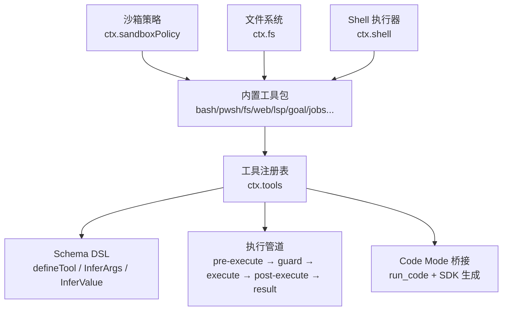
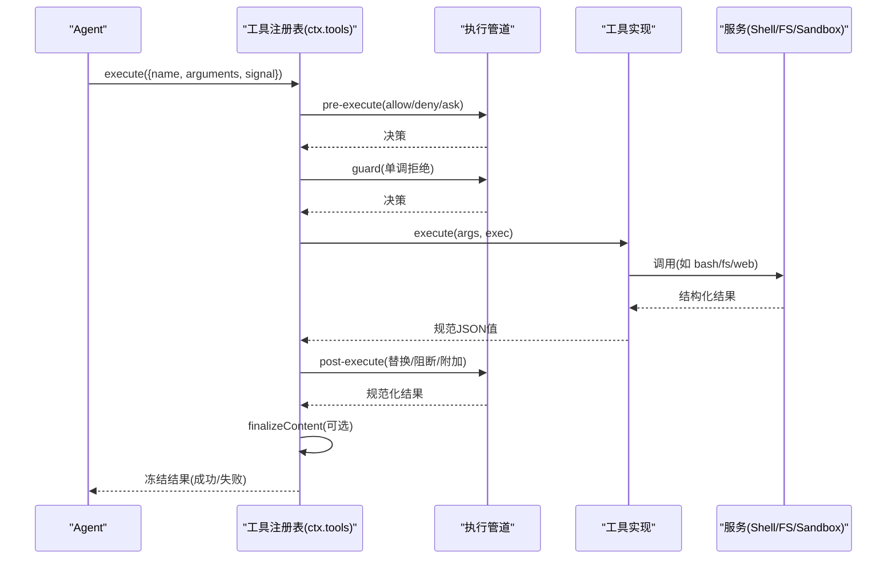
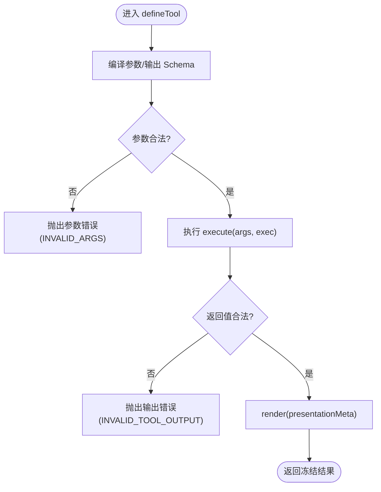
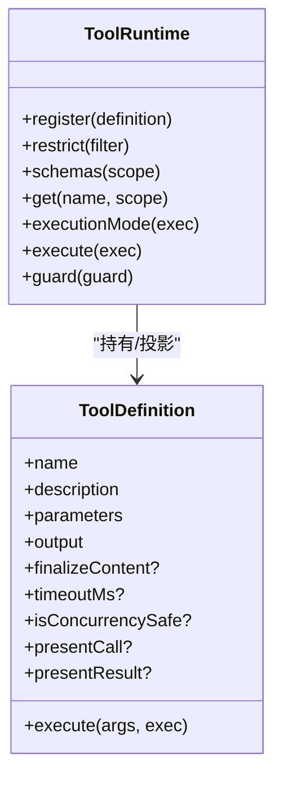
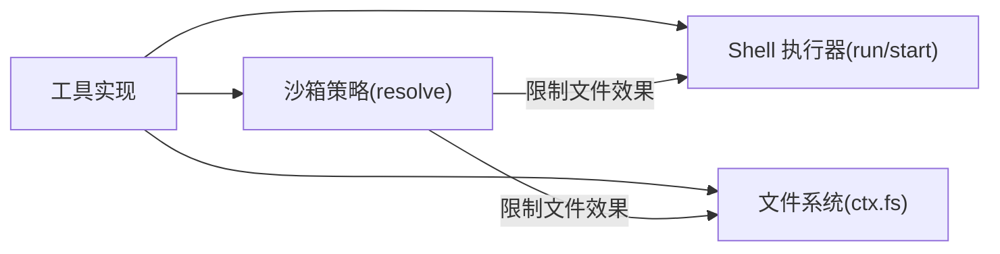
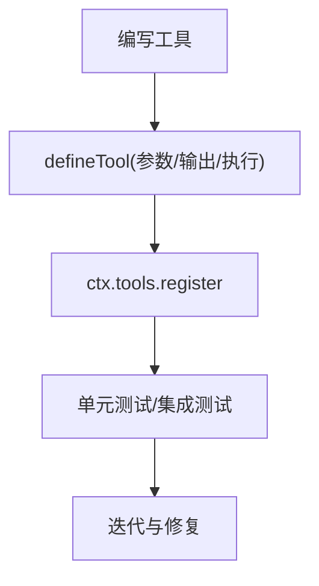
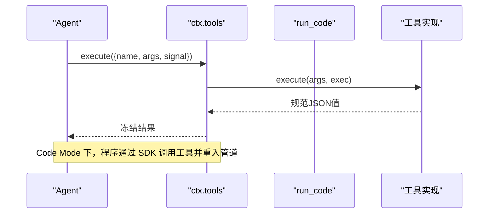
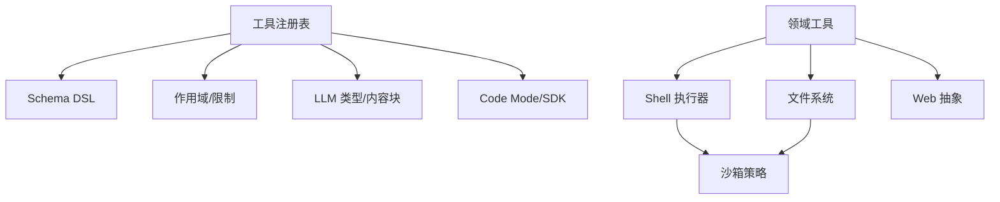

# 工具系统

<cite>
**本文引用的文件**
- [packages/core/tools/src/index.ts](file://packages/core/tools/src/index.ts)
- [packages/core/tools/src/schema.ts](file://packages/core/tools/src/schema.ts)
- [packages/core/tools/src/presentation.ts](file://packages/core/tools/src/presentation.ts)
- [packages/core/tools/src/code-mode.ts](file://packages/core/tools/src/code-mode.ts)
- [docs/subsystems/tools.md](file://docs/subsystems/tools.md)
- [docs/tool-catalog.md](file://docs/tool-catalog.md)
- [docs/subsystems/sandbox.md](file://docs/subsystems/sandbox.md)
- [docs/subsystems/shell.md](file://docs/subsystems/shell.md)
- [docs/subsystems/filesystem.md](file://docs/subsystems/filesystem.md)
- [docs/cookbook/adding-a-tool.md](file://docs/cookbook/adding-a-tool.md)
</cite>

## 目录
1. [简介](#简介)
2. [项目结构](#项目结构)
3. [核心组件](#核心组件)
4. [架构总览](#架构总览)
5. [详细组件分析](#详细组件分析)
6. [依赖关系分析](#依赖关系分析)
7. [性能考量](#性能考量)
8. [故障排查指南](#故障排查指南)
9. [结论](#结论)
10. [附录](#附录)

## 简介
本文件系统文档面向希望理解并扩展“工具系统”的开发者与集成者。内容覆盖：类型安全的工具定义机制（参数校验、返回值序列化、错误处理）、工具的注册流程、依赖注入与执行环境隔离、内置工具能力（文件系统、Shell 命令、网络请求等）、权限控制与沙箱策略、自定义工具开发指南与测试方法，以及工具与 Agent 的集成模式、调用方式与性能优化技巧。

## 项目结构
- 核心工具框架位于 packages/core/tools，提供工具注册表、执行管道、类型化 Schema DSL、UI 呈现词汇与 Code Mode 桥接。
- 各领域工具以独立包形式实现（如 shell、fs、web、lsp、goal、jobs 等），通过 ctx.tools.register 暴露模型可见的工具。
- 文档子系统 docs 提供工具系统、沙箱、Shell、文件系统、工具目录与添加工具的指南。

图表来源
- [packages/core/tools/src/index.ts:1-200](file://packages/core/tools/src/index.ts#L1-L200)
- [packages/core/tools/src/schema.ts:1-200](file://packages/core/tools/src/schema.ts#L1-L200)
- [docs/subsystems/tools.md:1-120](file://docs/subsystems/tools.md#L1-L120)

章节来源
- [packages/core/tools/src/index.ts:1-200](file://packages/core/tools/src/index.ts#L1-L200)
- [docs/subsystems/tools.md:1-120](file://docs/subsystems/tools.md#L1-L120)

## 核心组件
- 工具定义与 Schema DSL
  - defineTool 将参数 Schema 编译为 JSON Schema，并在运行时严格校验；输出 Schema 用于返回值的序列化与 UI 呈现元数据推导。
  - 支持 string/number/integer/boolean/null/array/object/json/oneOf，对象节点必须显式声明 additionalProperties。
- 工具注册与可见性
  - ctx.tools.register 注册工具；ctx.tools.restrict 按作用域限制全局工具；ctx.tools.schemas 仅暴露模型可见字段（name/description/parameters）。
- 执行管道
  - tools/pre-execute：允许/拒绝/询问（审批）
  - 单调守卫（guard）：最终不可逆的拒绝
  - tools/execute：超时、重试、指标等环绕包装
  - tools/post-execute：替换内容或值、附加上下文、阻断结果
  - finalizeContent：定义级最终内容投影（仅在顶层调用）
  - tools/result：观察冻结的最终结果
- 并发与调度
  - isConcurrencySafe 标记可并行；executionMode 决定 exclusive/parallel 调度。
- 呈现与 UI
  - presentCall/presentResult 返回中性 card 标签视图（generic/terminal/diff/search/read/web），与具体 UI 解耦。

章节来源
- [packages/core/tools/src/schema.ts:1-200](file://packages/core/tools/src/schema.ts#L1-L200)
- [packages/core/tools/src/index.ts:1-200](file://packages/core/tools/src/index.ts#L1-L200)
- [docs/subsystems/tools.md:96-152](file://docs/subsystems/tools.md#L96-L152)
- [docs/subsystems/tools.md:153-173](file://docs/subsystems/tools.md#L153-L173)
- [docs/subsystems/tools.md:170-375](file://docs/subsystems/tools.md#L170-L375)
- [docs/subsystems/tools.md:459-468](file://docs/subsystems/tools.md#L459-L468)

## 架构总览
工具系统由“注册表 + 管道 + 领域工具 + 策略/服务”构成。Agent 通过 ctx.tools.execute 发起调用，经过预执行策略、守卫、执行包装、后置策略与最终结果观察，再交由工具实现完成实际工作。沙箱与 Shell/FS 等服务在工具层被消费，保证安全与可观测性。

图表来源
- [packages/core/tools/src/index.ts:140-200](file://packages/core/tools/src/index.ts#L140-L200)
- [docs/subsystems/tools.md:170-375](file://docs/subsystems/tools.md#L170-L375)

## 详细组件分析

### 类型安全的工具定义与参数验证
- 统一 Schema DSL：作者使用 ValueSchemaSpec 描述参数与输出，compile 为受支持的原始 JSON Schema 子集，运行时进行严格校验。
- 类型推断：InferArgs/InferValue 从 Schema 推导 TypeScript 类型，支持最多 16 层容器深度，超出回退到 JsonValue。
- 参数校验：defineTool 在 execute 前对 model 传入的参数进行严格校验，不匹配抛出工具参数错误；输出值也按 output.schema 校验。
- 错误路径：非法参数/非法输出均走工具错误路径，保持统一的错误语义与可观测性。

图表来源
- [packages/core/tools/src/schema.ts:1-200](file://packages/core/tools/src/schema.ts#L1-L200)
- [docs/subsystems/tools.md:98-152](file://docs/subsystems/tools.md#L98-L152)

章节来源
- [packages/core/tools/src/schema.ts:1-200](file://packages/core/tools/src/schema.ts#L1-L200)
- [docs/subsystems/tools.md:98-152](file://docs/subsystems/tools.md#L98-L152)

### 工具注册流程与作用域/权限
- 注册：ctx.tools.register(definition)，同一层重复名或保留名会失败；scoped 注册可遮蔽全局。
- 限制：ctx.tools.restrict(filter) 对全局工具进行 allow/deny 过滤，scoped 注册不受影响。
- 可见性：ctx.tools.schemas(scope) 仅暴露模型可见字段，避免泄露执行回调。
- 守卫：ctx.tools.guard(guard) 注册单调守卫，后续监听无法撤销拒绝。

图表来源
- [packages/core/tools/src/index.ts:1-200](file://packages/core/tools/src/index.ts#L1-L200)
- [docs/subsystems/tools.md:478-574](file://docs/subsystems/tools.md#L478-L574)

章节来源
- [packages/core/tools/src/index.ts:1-200](file://packages/core/tools/src/index.ts#L1-L200)
- [docs/subsystems/tools.md:153-173](file://docs/subsystems/tools.md#L153-L173)
- [docs/subsystems/tools.md:478-574](file://docs/subsystems/tools.md#L478-L574)

### 执行环境与隔离（沙箱/Shell/FS）
- 沙箱：ctx.sandboxPolicy.resolve() 解析每调用策略（read-only/workspace-write/danger-full-access），后端实现 bwrap/Landlock/Seatbelt/ACL 等；工具/Shell 消费该策略以限制文件效果。
- Shell：ctx.shell 抽象执行器，resolve/run/start 分离请求与规格；支持前台/后台进程、超时、信号、输出截断与溢出转储；bash/pwsh 工具基于此实现。
- 文件系统：ctx.fs 抽象提供者，原子读写/编辑、版本守卫、目录枚举；tool-fs 作为模型可见消费端，配合 fs-observation-policy 实现读前写/编辑策略。

图表来源
- [docs/subsystems/sandbox.md:9-95](file://docs/subsystems/sandbox.md#L9-L95)
- [docs/subsystems/shell.md:13-104](file://docs/subsystems/shell.md#L13-L104)
- [docs/subsystems/filesystem.md:11-116](file://docs/subsystems/filesystem.md#L11-L116)

章节来源
- [docs/subsystems/sandbox.md:9-95](file://docs/subsystems/sandbox.md#L9-L95)
- [docs/subsystems/shell.md:13-104](file://docs/subsystems/shell.md#L13-L104)
- [docs/subsystems/filesystem.md:11-116](file://docs/subsystems/filesystem.md#L11-L116)

### 内置工具概览
- 文件系统操作：read/write/edit/read_image，带窗口化读取、原子写入、版本守卫与观察策略。
- Shell 命令执行：bash/pwsh，前台/后台运行、超时、信号、输出截断与溢出转储；持久化终端工具提供会话状态。
- 网络请求：web_fetch/web_search，通过 ctx.web 抽象屏蔽后端差异，稳定模型可见 Schema。
- 其他：lsp、goal、jobs、cordis 动态包、subagent 等，均在工具目录中登记并可被 Agent 调用。

章节来源
- [docs/tool-catalog.md:16-45](file://docs/tool-catalog.md#L16-L45)
- [docs/tool-catalog.md:180-266](file://docs/tool-catalog.md#L180-L266)
- [docs/tool-catalog.md:629-745](file://docs/tool-catalog.md#L629-L745)
- [docs/tool-catalog.md:746-800](file://docs/tool-catalog.md#L746-L800)

### 权限控制、沙箱与安全策略
- 权限门控：tools/pre-execute 允许/拒绝/询问；guard 提供单调拒绝；scopes 与 restrict 控制可见性。
- 沙箱：按调用解析策略，限制文件效果；shell/fs 消费策略，拒绝时报告明确原因与模式。
- 安全边界：工具执行体不得直接访问敏感上下文；通过 ctx.* 服务与事件门限进行最小权限访问；Code Mode 下 run_code 为唯一入口，其余工具需经 SDK 重入管道。

章节来源
- [docs/subsystems/tools.md:170-375](file://docs/subsystems/tools.md#L170-L375)
- [docs/subsystems/sandbox.md:41-95](file://docs/subsystems/sandbox.md#L41-L95)
- [docs/tool-catalog.md:120-151](file://docs/tool-catalog.md#L120-L151)

### 自定义工具开发指南与测试
- 最小形态：使用 defineTool 声明 name/description/parameters/output/execute；参数与输出类型自动推断。
- 执行契约：args 已校验；返回规范 JSON；尊重 exec.signal；presentationMeta 提供可回放 UI 元数据；exec.agent 用于异步通知。
- 长任务：通过 ctx.jobs.start 注册后台任务，返回句柄；前台任务耦合 exec.signal。
- 测试：遵循仓库测试策略；对 schema、执行、呈现、策略钩子进行单测与快照测试。

图表来源
- [docs/cookbook/adding-a-tool.md:7-66](file://docs/cookbook/adding-a-tool.md#L7-L66)

章节来源
- [docs/cookbook/adding-a-tool.md:7-66](file://docs/cookbook/adding-a-tool.md#L7-L66)

### 工具与 Agent 的集成模式与调用方式
- Agent 通过 ctx.tools.execute 发起调用；注册表分配 token、冻结参数、执行管道、最终结果观察。
- Code Mode：run_code 是唯一可直接调用的工具，程序内通过 SDK 绑定调用其他工具，重入完整管道并与父结果关联。
- 并发：isConcurrencySafe=true 且无副作用时可并行；否则形成排他屏障。

图表来源
- [packages/core/tools/src/index.ts:140-200](file://packages/core/tools/src/index.ts#L140-L200)
- [docs/subsystems/tools.md:170-375](file://docs/subsystems/tools.md#L170-L375)
- [docs/tool-catalog.md:120-151](file://docs/tool-catalog.md#L120-L151)

章节来源
- [packages/core/tools/src/index.ts:140-200](file://packages/core/tools/src/index.ts#L140-L200)
- [docs/subsystems/tools.md:170-375](file://docs/subsystems/tools.md#L170-L375)
- [docs/tool-catalog.md:120-151](file://docs/tool-catalog.md#L120-L151)

## 依赖关系分析
- 工具注册表依赖 Schema DSL、Scope、LLM 类型、Session 快照、Code Runtime 语言映射等。
- 领域工具依赖 Shell/FS/Web 等服务；这些服务又依赖沙箱策略与底层实现。
- 文档与目录由生成脚本维护，确保新工具不被遗漏。

图表来源
- [packages/core/tools/src/index.ts:1-200](file://packages/core/tools/src/index.ts#L1-L200)
- [docs/tool-catalog.md:16-45](file://docs/tool-catalog.md#L16-L45)

章节来源
- [packages/core/tools/src/index.ts:1-200](file://packages/core/tools/src/index.ts#L1-L200)
- [docs/tool-catalog.md:16-45](file://docs/tool-catalog.md#L16-L45)

## 性能考量
- 并发调度：尽量将无副作用的工具标记为 isConcurrencySafe=true，以获得并行执行；否则使用 exclusive 保障顺序。
- 超时与取消：声明 timeoutMs，并通过 exec.signal 协作取消；around-dispatch 包装可实现统一超时/重试/指标。
- 输出控制：大输出采用截断与溢出转储（Shell/FS/grep/glob），避免阻塞与内存膨胀。
- 渲染成本：presentCall/presentResult 应为纯函数，避免 I/O；presentationMeta 仅承载可回放元数据。

[本节为通用指导，无需特定文件引用]

## 故障排查指南
- 参数错误：检查 parameters 与 required 标注；确认 enum/const 值与类型一致。
- 输出错误：确保 execute 返回值符合 output.schema；renderer 与 presentationMeta 不抛异常。
- 权限拒绝：查看 tools/pre-execute 与 guard 是否拒绝；必要时通过审批流程提升权限。
- 沙箱拒绝：根据 ShellSandboxInfo 与 denial signatures 判断是否为沙箱拦截；调整 sandbox mode 或重新申请。
- 工具不存在：未知工具名会返回 UNKNOWN_TOOL；确认注册与作用域可见性。

章节来源
- [docs/subsystems/tools.md:170-375](file://docs/subsystems/tools.md#L170-L375)
- [docs/subsystems/sandbox.md:152-157](file://docs/subsystems/sandbox.md#L152-L157)
- [docs/subsystems/shell.md:141-166](file://docs/subsystems/shell.md#L141-L166)

## 结论
工具系统通过类型安全的 Schema DSL、严格的执行管道与可扩展的策略钩子，提供了高内聚、低耦合、可审计与可演进的扩展点。结合沙箱与服务抽象，既能满足复杂业务需求，又能保障安全与稳定性。建议优先使用内置工具与标准模式，按需扩展自定义工具，并通过测试与监控持续优化。

[本节为总结，无需特定文件引用]

## 附录
- 参考文档
  - 工具系统：docs/subsystems/tools.md
  - 工具目录：docs/tool-catalog.md
  - 沙箱：docs/subsystems/sandbox.md
  - Shell：docs/subsystems/shell.md
  - 文件系统：docs/subsystems/filesystem.md
  - 添加工具：docs/cookbook/adding-a-tool.md

[本节为索引，无需特定文件引用]