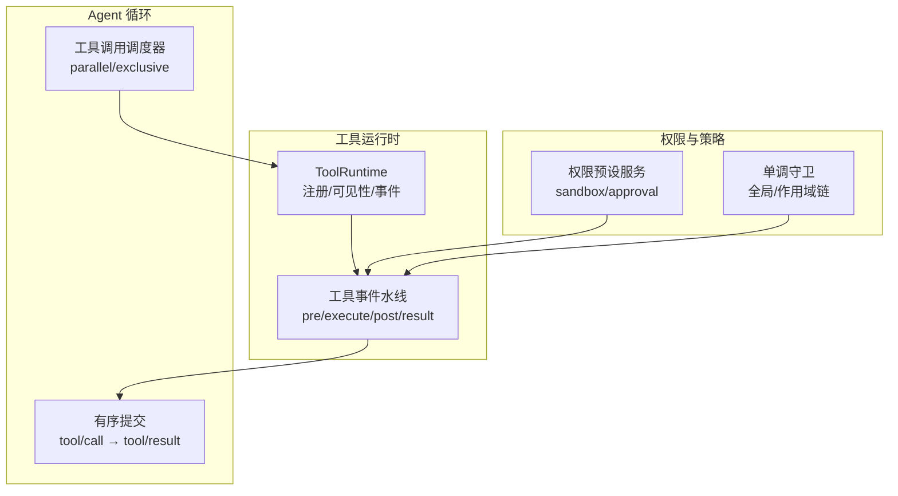
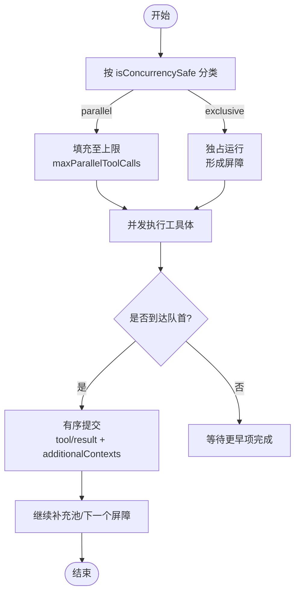
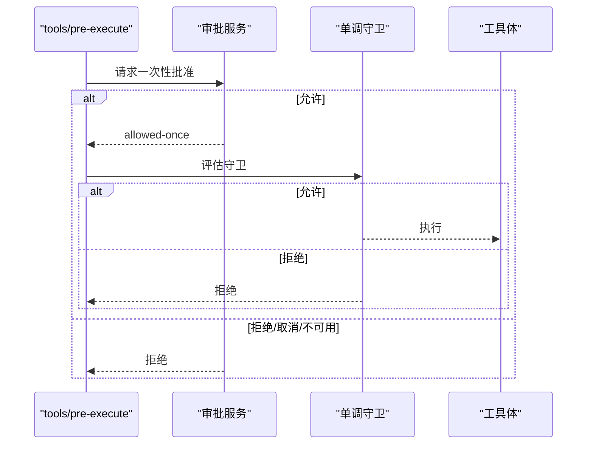
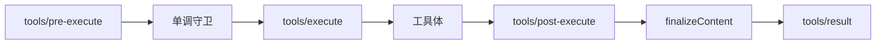
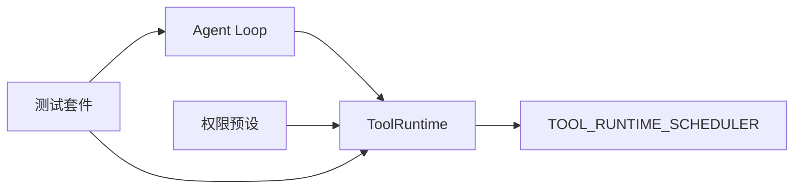

# 执行管道与生命周期

<cite>
**本文引用的文件**
- [packages/core/tools/src/index.ts](file://packages/core/tools/src/index.ts)
- [packages/core/agent-loop/src/tool-calls.ts](file://packages/core/agent-loop/src/tool-calls.ts)
- [docs/tool-execution-pipeline.md](file://docs/tool-execution-pipeline.md)
- [docs/subsystems/tools.md](file://docs/subsystems/tools.md)
- [packages/interaction/permission-presets/src/index.ts](file://packages/interaction/permission-presets/src/index.ts)
- [apps/web/tests/permission-policy-context.e2e.ts](file://apps/web/tests/permission-policy-context.e2e.ts)
- [packages/core/tools/tests/tools.spec.ts](file://packages/core/tools/tests/tools.spec.ts)
- [packages/core/tools/tests/scoped.spec.ts](file://packages/core/tools/tests/scoped.spec.ts)
- [packages/core/tools/tests/code-mode.spec.ts](file://packages/core/tools/tests/code-mode.spec.ts)
</cite>

## 目录
1. [简介](#简介)
2. [项目结构](#项目结构)
3. [核心组件](#核心组件)
4. [架构总览](#架构总览)
5. [详细组件分析](#详细组件分析)
6. [依赖关系分析](#依赖关系分析)
7. [性能考量](#性能考量)
8. [故障排查指南](#故障排查指南)
9. [结论](#结论)
10. [附录](#附录)

## 简介
本文件系统性阐述工具调用的完整生命周期与执行管道，覆盖从模型侧发起调用到结果最终化的全过程：预处理（tools/pre-execute）、权限守卫（monotonic guards）、around-dispatch 包装器（tools/execute）、工具执行体、post-execute 处理、定义级 finalizeContent、以及最终结果呈现（tools/result）。同时说明并发控制（并行与独占）、取消信号与超时控制、以及如何扩展管道（中间件/拦截器），并给出性能监控、错误恢复与调试建议。

## 项目结构
围绕“工具执行”的关键代码分布在以下位置：
- 工具注册与执行管道：packages/core/tools/src/index.ts
- Agent Loop 调度与批提交：packages/core/agent-loop/src/tool-calls.ts
- 官方流程文档与图示：docs/tool-execution-pipeline.md、docs/subsystems/tools.md
- 权限策略与审批集成：packages/interaction/permission-presets/src/index.ts
- 行为验证测试：packages/core/tools/tests/*.spec.ts



图表来源
- [packages/core/tools/src/index.ts:787-837](file://packages/core/tools/src/index.ts#L787-L837)
- [packages/core/agent-loop/src/tool-calls.ts:59-101](file://packages/core/agent-loop/src/tool-calls.ts#L59-L101)
- [packages/interaction/permission-presets/src/index.ts:379-433](file://packages/interaction/permission-presets/src/index.ts#L379-L433)

章节来源
- [packages/core/tools/src/index.ts:787-1200](file://packages/core/tools/src/index.ts#L787-L1200)
- [packages/core/agent-loop/src/tool-calls.ts:59-290](file://packages/core/agent-loop/src/tool-calls.ts#L59-L290)
- [docs/tool-execution-pipeline.md:1-63](file://docs/tool-execution-pipeline.md#L1-L63)
- [docs/subsystems/tools.md:170-405](file://docs/subsystems/tools.md#L170-L405)

## 核心组件
- ToolRuntime：工具注册、可见性解析、执行入口、事件水线编排、内容最终化与结果冻结。
- Agent Loop 调度器：按模型顺序组织调用，支持 parallel 与 exclusive 分组，负责有序提交与上下文注入。
- 权限与审批：通过 tools/pre-execute 的 ask 与 monotonic guards 实现细粒度访问控制；权限预设可动态切换 sandbox 与 approval 策略。
- 事件水线：
  - tools/pre-execute：允许/拒绝/询问（ask）
  - tools/execute：around-dispatch（超时、重试、指标）
  - tools/post-execute：接受/替换/附加上下文/阻断
  - tools/result：不可变最终结果观察点
  - tools/code-dispatch-log：Code Mode 子调用的日志内容改写

章节来源
- [packages/core/tools/src/index.ts:137-208](file://packages/core/tools/src/index.ts#L137-L208)
- [docs/subsystems/tools.md:170-405](file://docs/subsystems/tools.md#L170-L405)

## 架构总览
下图展示一次工具调用从进入 Agent Loop 到最终结果落盘的完整路径，包括水线阶段、守卫、around-dispatch、工具体、post-execute、finalizeContent 与 result 观察点。

```mermaid
sequenceDiagram
participant Loop as "Agent 循环"
participant Reg as "ToolRuntime"
participant Pre as "tools/pre-execute"
participant Guard as "单调守卫"
participant Exec as "tools/execute"
participant Body as "工具执行体"
participant Post as "tools/post-execute"
participant Final as "finalizeContent"
participant Obs as "tools/result"
Loop->>Reg : 准备执行(prepare)
Reg->>Pre : 执行水线(allow/deny/ask)
Pre-->>Reg : 决策
alt 允许
Reg->>Guard : 评估守卫
Guard-->>Reg : 允许或拒绝
alt 允许
Reg->>Exec : around-dispatch(next)
Exec->>Body : 执行(可替换signal)
Body-->>Exec : 结构化值
Exec-->>Reg : 标准化结果
Reg->>Post : 后处理(accept/replace/block)
Post-->>Reg : 决策
Reg->>Final : 最终内容变换
Final-->>Reg : 内容
Reg->>Obs : 通知不可变结果
Obs-->>Loop : 记录tool/result
else 拒绝
Reg-->>Loop : 失败结果
end
else 拒绝/询问未通过
Reg-->>Loop : 失败结果
end
```

图表来源
- [docs/tool-execution-pipeline.md:8-58](file://docs/tool-execution-pipeline.md#L8-L58)
- [packages/core/tools/src/index.ts:137-208](file://packages/core/tools/src/index.ts#L137-L208)
- [packages/core/agent-loop/src/tool-calls.ts:145-160](file://packages/core/agent-loop/src/tool-calls.ts#L145-L160)

## 详细组件分析

### 执行水线与生命周期
- 预处理（tools/pre-execute）：可 allow/deny/ask。ask 需经审批服务返回 allowed-once 才放行；缺失审批能力时降级为拒绝。异步监听器必须检查 exec.signal，并在等待后由注册表重新检查取消。
- 权限守卫（monotonic guards）：在 pre-execute 之后、工具体之前运行，任何匹配守卫均可拒绝，但无法强制放行已被其他守卫拒绝的请求。
- Around-dispatch（tools/execute）：用于超时、重试、指标等横切关注点。next() 返回标准化结果；监听器仅能替换 signal，不能移除它；注册表会在调用工具体前将原始 caller signal 融合进来。
- 工具执行体：接收已冻结的参数与执行上下文，必须协作式响应取消信号并保证在退出时达到静默状态。
- 后处理（tools/post-execute）：可 accept/replace/additionalContexts/block。block 会将纠正反馈转为错误结果。
- 定义级 finalizeContent：最后一次内容转换，必须在同步且无副作用的前提下完成，确保内容不变量。
- 最终结果（tools/result）：观察者收到深冻结的最终结果快照，失败被隔离。

章节来源
- [packages/core/tools/src/index.ts:137-208](file://packages/core/tools/src/index.ts#L137-L208)
- [docs/subsystems/tools.md:170-405](file://docs/subsystems/tools.md#L170-L405)

### 并发控制：并行与独占
- 分类依据：工具声明 isConcurrencySafe(args) 精确返回 true 才可加入并行组；否则视为独占。未知、隐藏、无效或抛异常的分类器均保守地视为独占。
- 调度策略：Agent Loop 对一组调用先分类，再构建滚动池。exclusive 调用形成屏障，会排空当前池并单独运行，直到自身提交完成；parallel 调用在上限 maxParallelToolCalls 内重叠执行。
- 有序提交：无论并发如何，tool/call 与 tool/result 始终按模型顺序追加；additionalContexts 在 tool/result 之后按 FIFO 注入下一轮。
- Code Mode 子调用：run_code 桥接层复用同一调度约定，受 maxParallelSubCalls 限制，start 事件仅在真正启动时追加，结算事件保持启动顺序。



图表来源
- [packages/core/agent-loop/src/tool-calls.ts:59-101](file://packages/core/agent-loop/src/tool-calls.ts#L59-L101)
- [packages/core/agent-loop/src/tool-calls.ts:121-246](file://packages/core/agent-loop/src/tool-calls.ts#L121-L246)
- [docs/subsystems/tools.md:243-253](file://docs/subsystems/tools.md#L243-L253)

章节来源
- [packages/core/agent-loop/src/tool-calls.ts:59-290](file://packages/core/agent-loop/src/tool-calls.ts#L59-L290)
- [packages/core/tools/tests/code-mode.spec.ts:537-565](file://packages/core/tools/tests/code-mode.spec.ts#L537-L565)

### 取消信号与超时控制
- 取消传播：caller 提供的 AbortSignal 贯穿整个管道；tools/execute 监听器可替换 signal，但注册表会在调用工具体前将其与原始 caller signal 融合，确保取消不会被剥离。
- 中止语义：
  - 在工具体尚未启动时被取消：记录 ABORTED_BEFORE_DISPATCH。
  - 在工具体已启动后被取消：成功结果会被替换为 ABORTED；已启动的工作仍会排尽。
- 超时：工具可通过 timeoutMs 声明协作式超时预算，由外部 tools/execute 包装器（如 dsh-tool-call-timeout-policy）强制执行；该字段不会暴露给模型。

章节来源
- [packages/core/tools/src/index.ts:221-269](file://packages/core/tools/src/index.ts#L221-L269)
- [packages/core/tools/src/index.ts:468-472](file://packages/core/tools/src/index.ts#L468-L472)
- [packages/core/agent-loop/src/tool-calls.ts:248-259](file://packages/core/agent-loop/src/tool-calls.ts#L248-L259)

### 权限检查与审批
- 审批流：pre-execute 可返回 ask，交由审批服务决定 allowed-once；若缺失审批能力或用户拒绝/取消，则降级为拒绝。
- 权限预设：可动态切换 sandbox 模式与 approval 策略，并在会话中持久化；E2E 验证了不同预设下的策略上下文正确注入。
- 守卫链：全局与作用域链上的守卫叠加，任一守卫均可拒绝；守卫为单调的，无法将拒绝翻转为允许。



图表来源
- [packages/core/tools/src/index.ts:137-152](file://packages/core/tools/src/index.ts#L137-L152)
- [packages/interaction/permission-presets/src/index.ts:379-433](file://packages/interaction/permission-presets/src/index.ts#L379-L433)
- [apps/web/tests/permission-policy-context.e2e.ts:124-143](file://apps/web/tests/permission-policy-context.e2e.ts#L124-L143)

章节来源
- [packages/interaction/permission-presets/src/index.ts:379-433](file://packages/interaction/permission-presets/src/index.ts#L379-L433)
- [apps/web/tests/permission-policy-context.e2e.ts:124-143](file://apps/web/tests/permission-policy-context.e2e.ts#L124-L143)
- [packages/core/tools/tests/scoped.spec.ts:284-316](file://packages/core/tools/tests/scoped.spec.ts#L284-L316)

### 结果最终化与呈现
- 规范化与快照：注册表在 post-execute 前后对候选结果进行快照与校验，非 JSON 可序列化或投影失败会转为 isError 的安全结果。
- finalizeContent：定义级最后一次内容转换，必须同步、无副作用、不抛异常；即使 pipeline 失败也会调用一次。
- 最终观察：tools/result 接收深冻结的执行与结果，适合遥测、审计与 UI 回放；观察者失败被隔离。

章节来源
- [packages/core/tools/src/index.ts:524-639](file://packages/core/tools/src/index.ts#L524-L639)
- [docs/subsystems/tools.md:370-405](file://docs/subsystems/tools.md#L370-L405)

### 扩展点：自定义中间件与拦截器
- 在 tools/pre-execute 中实现策略门控、审计、输入校验等。
- 在 tools/execute 中实现超时、重试、指标采集、信号包装等横切逻辑。
- 在 tools/post-execute 中实现结果增强、敏感信息遮蔽、上下文注入或阻断。
- 在 tools/code-dispatch-log 中对 Code Mode 子调用的日志内容进行轻量改写（不影响程序值与模型可见结果）。



图表来源
- [packages/core/tools/src/index.ts:137-208](file://packages/core/tools/src/index.ts#L137-L208)
- [docs/subsystems/tools.md:170-405](file://docs/subsystems/tools.md#L170-L405)

章节来源
- [packages/core/tools/tests/tools.spec.ts:1030-1058](file://packages/core/tools/tests/tools.spec.ts#L1030-L1058)

## 依赖关系分析
- ToolRuntime 依赖 Agent Loop 的调度接口（TOOL_RUNTIME_SCHEDULER）以分离 prepare/dispatch/finalize/finish 阶段。
- Agent Loop 依赖 ToolRuntime 的 executionMode 进行分类，并维护有序提交与上下文注入。
- 权限预设服务通过 session 事件影响 approval 与 sandbox，进而影响 pre-execute 与守卫的决策。
- 测试用例验证了守卫顺序、独占屏障、post-execute 组合等行为契约。



图表来源
- [packages/core/tools/src/index.ts:795-801](file://packages/core/tools/src/index.ts#L795-L801)
- [packages/core/agent-loop/src/tool-calls.ts:164-196](file://packages/core/agent-loop/src/tool-calls.ts#L164-L196)
- [packages/interaction/permission-presets/src/index.ts:379-433](file://packages/interaction/permission-presets/src/index.ts#L379-L433)

章节来源
- [packages/core/tools/src/index.ts:787-1200](file://packages/core/tools/src/index.ts#L787-L1200)
- [packages/core/agent-loop/src/tool-calls.ts:59-290](file://packages/core/agent-loop/src/tool-calls.ts#L59-L290)

## 性能考量
- 并发上限：maxParallelToolCalls 限制单步中的并发度；maxParallelSubCalls 限制 run_code 子调用并发。合理设置可避免资源争用与配额耗尽。
- 有序提交成本：为保证回放一致性，结果按模型顺序提交，快速结果可能等待慢项；UI 可在前端显示待处理进度。
- 钩子开销：每个水线都会产生函数调用与可能的 I/O；应最小化阻塞操作，必要时使用异步且可取消的 I/O。
- 快照与冻结：结果与执行对象在关键边界进行快照与冻结，带来一定内存与 CPU 开销；应避免在 finalizeContent 中进行昂贵计算。

[本节为通用指导，不直接分析具体文件]

## 故障排查指南
- 常见错误码与语义：
  - UNKNOWN_TOOL：模型请求的工具未注册或被隐藏。
  - INVALID_ARGS / INVALID_TOOL_OUTPUT：参数或输出不符合声明的 JSON Schema。
  - ABORTED_BEFORE_DISPATCH / ABORTED：取消在不同阶段的语义区分。
- 定位步骤：
  - 检查 tools/pre-execute 是否返回 deny/ask；确认审批服务可用性与策略。
  - 检查单调守卫是否拒绝；通过 scoped 注册逐步缩小范围。
  - 在 tools/execute 中增加指标与日志，确认超时/重试是否生效。
  - 在 tools/post-execute 中捕获 block 分支，确认纠正反馈是否正确生成。
  - 检查 finalizeContent 是否抛出或返回非 JSON 可序列化数据。
- 调试技巧：
  - 使用 tools/result 观察最终冻结结果，便于回放与比对。
  - 借助 Code Mode 的 tools/code-dispatch-log 调整子调用日志内容，便于问题复现。
  - 通过测试用例（如独占屏障、post-execute 组合）验证预期行为。

章节来源
- [packages/core/tools/src/index.ts:468-522](file://packages/core/tools/src/index.ts#L468-L522)
- [packages/core/tools/tests/tools.spec.ts:1030-1058](file://packages/core/tools/tests/tools.spec.ts#L1030-L1058)
- [packages/core/tools/tests/scoped.spec.ts:284-316](file://packages/core/tools/tests/scoped.spec.ts#L284-L316)

## 结论
工具执行管道以水线为核心，结合单调守卫与 around-dispatch，提供了可扩展、可观测、可恢复的执行环境。Agent Loop 的并发调度在保证模型顺序的同时最大化吞吐。通过合理的权限策略、取消与超时控制、以及完善的最终化与观察点，系统能够在复杂场景下保持稳定与可诊断性。扩展点清晰，便于按需添加中间件与拦截器以满足业务需求。

[本节为总结，不直接分析具体文件]

## 附录
- 参考流程图：工具执行管线概览
- 关键类型与事件：见 docs/subsystems/tools.md 的 Cordis API 生成段
- 行为验证：参见相关测试用例

[本节为索引与导航，不直接分析具体文件]