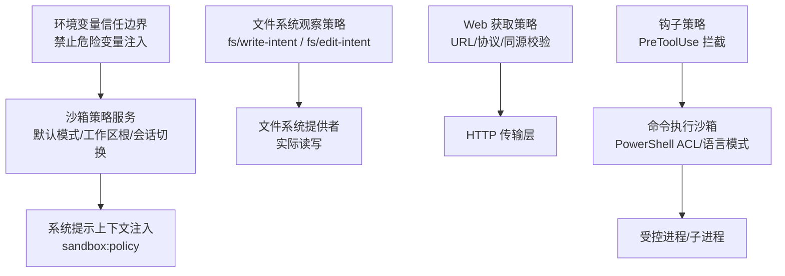
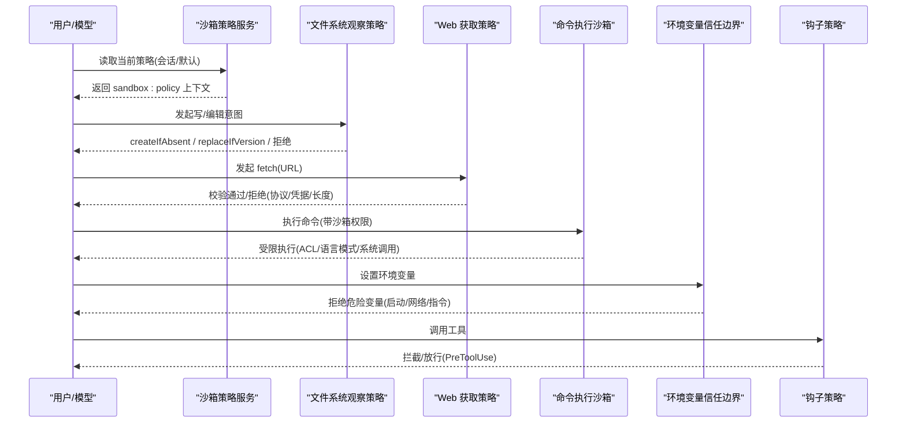
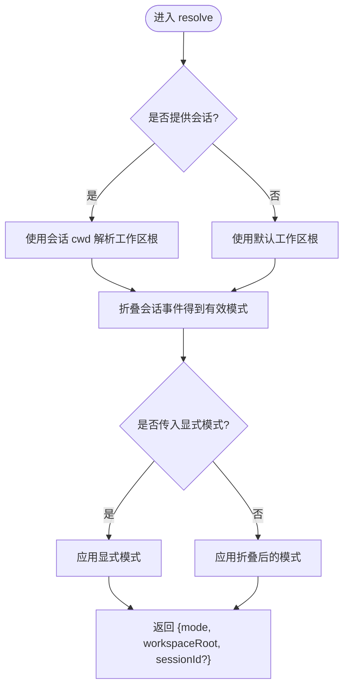
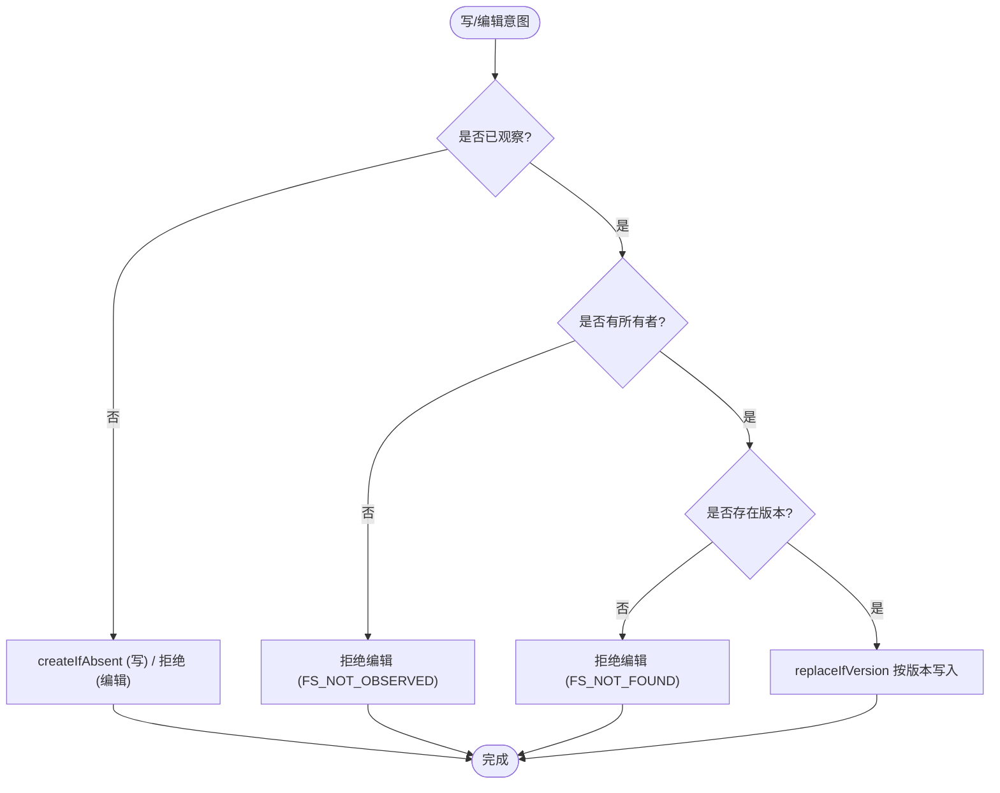
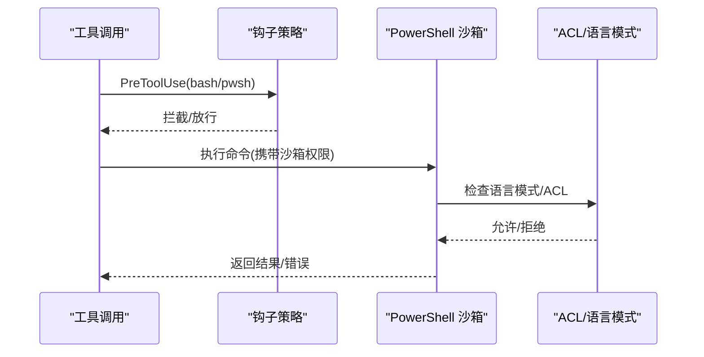
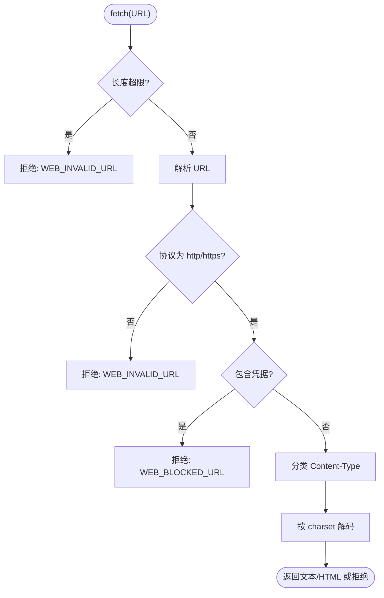
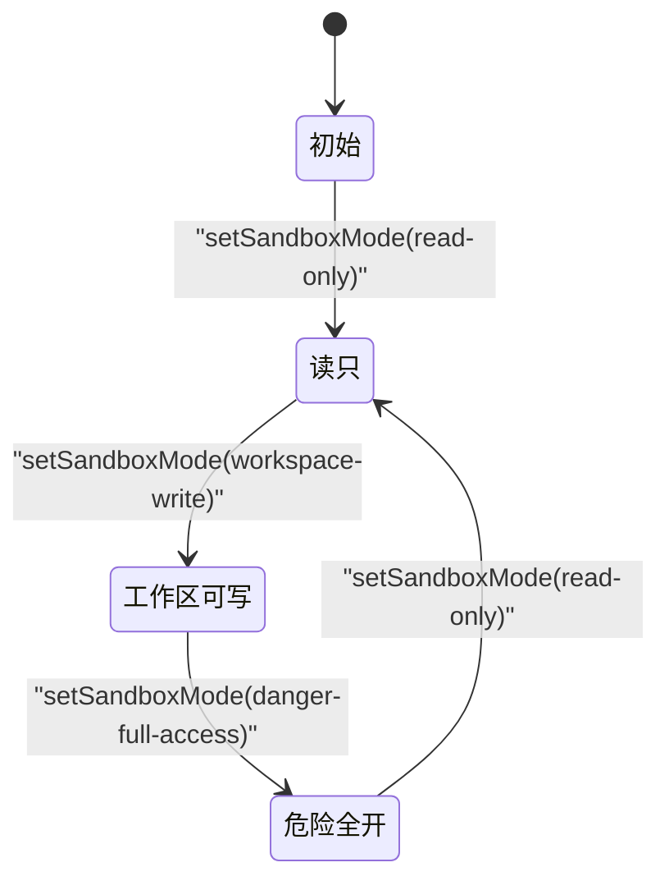
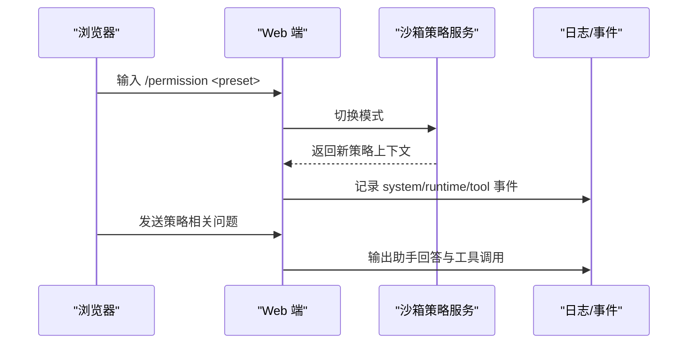
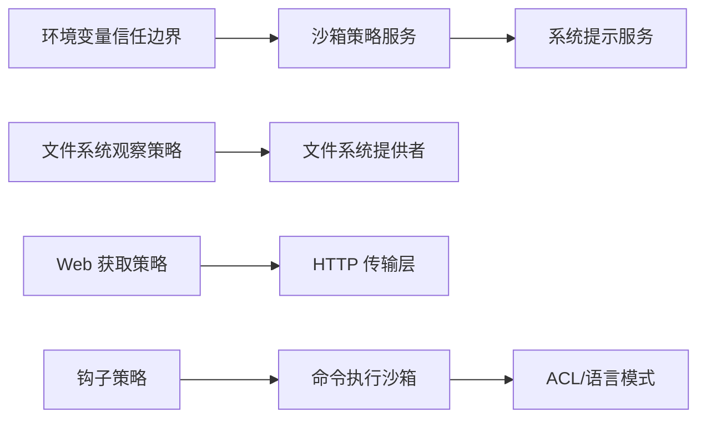

# 安全策略配置

<cite>
**本文引用的文件**
- [packages/sandbox/sandbox-policy/tests/policy.spec.ts](file://packages/sandbox/sandbox-policy/tests/policy.spec.ts)
- [packages/fs/fs-observation-policy/tests/policy.spec.ts](file://packages/fs/fs-observation-policy/tests/policy.spec.ts)
- [apps/web/tests/permission-policy-context.e2e.ts](file://apps/web/tests/permission-policy-context.e2e.ts)
- [packages/shell/tool-pwsh/tests/tools.spec.ts](file://packages/shell/tool-pwsh/tests/tools.spec.ts)
- [packages/shell/pwsh-sandbox/tests/acl.e2e.ts](file://packages/shell/pwsh-sandbox/tests/acl.e2e.ts)
- [packages/sandbox/sandbox-windows-acl/tests/probe.spec.ts](file://packages/sandbox/sandbox-windows-acl/tests/probe.spec.ts)
- [packages/sandbox/sandbox-windows-acl/tests/runner.spec.ts](file://packages/sandbox/sandbox-windows-acl/tests/runner.spec.ts)
- [packages/web/web-fetch-http/src/policy.ts](file://packages/web/web-fetch-http/src/policy.ts)
- [.agents/notes/implemented/architecture/2026-08-04-configuration-source-ownership.md](file://.agents/notes/implemented/architecture/2026-08-04-configuration-source-ownership.md)
- [examples/acp-agent/tests/snapshots/hook-cc-pretool-deny/workspace/hooks.json](file://examples/acp-agent/tests/snapshots/hook-cc-pretool-deny/workspace/hooks.json)
</cite>

## 目录
1. [简介](#简介)
2. [项目结构](#项目结构)
3. [核心组件](#核心组件)
4. [架构总览](#架构总览)
5. [详细组件分析](#详细组件分析)
6. [依赖关系分析](#依赖关系分析)
7. [性能考虑](#性能考虑)
8. [故障排查指南](#故障排查指南)
9. [结论](#结论)
10. [附录](#附录)

## 简介
本文件面向“安全策略配置”的完整实践，覆盖策略定义语法与格式、规则编写与优先级管理、冲突解决；文件访问策略（路径模式匹配、读写权限控制、敏感文件保护）；命令执行策略（命令白名单、参数校验、执行环境限制）；网络访问策略（URL过滤、协议限制、代理相关变量管控）；部署与管理（版本控制、热更新、回滚）；以及测试方法与调试技巧（验证工具与日志分析）。内容基于仓库中已实现的沙箱策略、文件系统观察策略、Web 获取策略、PowerShell 沙箱行为与环境隔离等源码与测试用例进行归纳说明。

## 项目结构
与安全策略相关的代码主要分布在以下模块：
- 沙箱策略服务：提供默认模式与工作区根解析、会话级模式切换、系统提示上下文注入。
- 文件系统观察策略：通过事件水线决定写意图与编辑意图，实现“先观察后修改”的并发安全。
- Web 获取策略：对 URL 合法性、协议、凭据、重定向同源等进行前置校验与响应类型分类。
- 命令执行与平台沙箱：PowerShell 沙箱在 Windows 上通过 ACL 限制工作区与临时目录写入，并限制系统调用与命名管道等能力。
- 环境变量与启动信任边界：拒绝从 .env 或外部来源设置影响进程启动、网络与指令加载的关键变量。
- 钩子策略：通过 PreToolUse 钩子在工具使用前拦截并阻断特定命令。

**图示来源**
- [packages/sandbox/sandbox-policy/tests/policy.spec.ts:42-141](file://packages/sandbox/sandbox-policy/tests/policy.spec.ts#L42-L141)
- [packages/fs/fs-observation-policy/tests/policy.spec.ts:17-213](file://packages/fs/fs-observation-policy/tests/policy.spec.ts#L17-L213)
- [packages/web/web-fetch-http/src/policy.ts:24-71](file://packages/web/web-fetch-http/src/policy.ts#L24-L71)
- [packages/shell/pwsh-sandbox/tests/acl.e2e.ts:90-106](file://packages/shell/pwsh-sandbox/tests/acl.e2e.ts#L90-L106)
- [.agents/notes/implemented/architecture/2026-08-04-configuration-source-ownership.md:45-47](file://.agents/notes/implemented/architecture/2026-08-04-configuration-source-ownership.md#L45-L47)
- [examples/acp-agent/tests/snapshots/hook-cc-pretool-deny/workspace/hooks.json:1-12](file://examples/acp-agent/tests/snapshots/hook-cc-pretool-deny/workspace/hooks.json#L1-L12)

**章节来源**
- [packages/sandbox/sandbox-policy/tests/policy.spec.ts:42-141](file://packages/sandbox/sandbox-policy/tests/policy.spec.ts#L42-L141)
- [packages/fs/fs-observation-policy/tests/policy.spec.ts:17-213](file://packages/fs/fs-observation-policy/tests/policy.spec.ts#L17-L213)
- [packages/web/web-fetch-http/src/policy.ts:24-71](file://packages/web/web-fetch-http/src/policy.ts#L24-L71)
- [packages/shell/pwsh-sandbox/tests/acl.e2e.ts:90-106](file://packages/shell/pwsh-sandbox/tests/acl.e2e.ts#L90-L106)
- [.agents/notes/implemented/architecture/2026-08-04-configuration-source-ownership.md:45-47](file://.agents/notes/implemented/architecture/2026-08-04-configuration-source-ownership.md#L45-L47)
- [examples/acp-agent/tests/snapshots/hook-cc-pretool-deny/workspace/hooks.json:1-12](file://examples/acp-agent/tests/snapshots/hook-cc-pretool-deny/workspace/hooks.json#L1-L12)

## 核心组件
- 沙箱策略服务
  - 暴露默认模式与工作区根，支持会话级模式覆盖，并将当前策略以“sandbox:policy”上下文注入系统提示。
  - 模式集合为固定枚举，加载时校验非法值；支持按会话持久化切换并在恢复时重建有效模式。
- 文件系统观察策略
  - 通过“fs/write-intent”和“fs/edit-intent”水线决策：未观察目标默认创建；已观察目标按版本替换；无所有者或未被观察则拒绝编辑。
  - 多所有者隔离，每个所有者独立记录观测版本；首次命中短路与“先观察后修改”保证一致性。
- Web 获取策略
  - 仅允许 http/https，拒绝 URL 内嵌凭据，限制 URL 长度；重定向跨源需重新授权；响应体类型分类与字符集解码。
- 命令执行与平台沙箱
  - PowerShell 沙箱在 Windows 上通过 ACL 限制工作区与私有临时目录可写，拒绝逃逸与外部临时目录写入；受限模式下禁用命名管道与部分系统调用。
- 环境变量信任边界
  - 拒绝从 .env 或外部来源设置影响进程启动、网络与指令加载的关键变量（含 DSH_* 命名空间），防止绕过审批与沙箱。
- 钩子策略
  - 通过 PreToolUse 钩子在工具使用前拦截并阻断特定命令（如 bash），实现会话级策略性禁用。

**章节来源**
- [packages/sandbox/sandbox-policy/tests/policy.spec.ts:42-141](file://packages/sandbox/sandbox-policy/tests/policy.spec.ts#L42-L141)
- [packages/fs/fs-observation-policy/tests/policy.spec.ts:17-213](file://packages/fs/fs-observation-policy/tests/policy.spec.ts#L17-L213)
- [packages/web/web-fetch-http/src/policy.ts:24-71](file://packages/web/web-fetch-http/src/policy.ts#L24-L71)
- [packages/shell/pwsh-sandbox/tests/acl.e2e.ts:90-106](file://packages/shell/pwsh-sandbox/tests/acl.e2e.ts#L90-L106)
- [packages/sandbox/sandbox-windows-acl/tests/probe.spec.ts:68-82](file://packages/sandbox/sandbox-windows-acl/tests/probe.spec.ts#L68-L82)
- [packages/sandbox/sandbox-windows-acl/tests/runner.spec.ts:125-140](file://packages/sandbox/sandbox-windows-acl/tests/runner.spec.ts#L125-L140)
- [.agents/notes/implemented/architecture/2026-08-04-configuration-source-ownership.md:45-47](file://.agents/notes/implemented/architecture/2026-08-04-configuration-source-ownership.md#L45-L47)
- [examples/acp-agent/tests/snapshots/hook-cc-pretool-deny/workspace/hooks.json:1-12](file://examples/acp-agent/tests/snapshots/hook-cc-pretool-deny/workspace/hooks.json#L1-L12)

## 架构总览
下图展示策略在运行时的交互：沙箱策略服务将当前策略注入系统提示；文件系统观察策略在水线中决定写/编辑意图；Web 获取策略在请求前校验 URL 与协议；命令执行通过平台沙箱限制能力；环境变量信任边界阻止危险注入；钩子策略在工具使用前拦截。

**图示来源**
- [packages/sandbox/sandbox-policy/tests/policy.spec.ts:144-207](file://packages/sandbox/sandbox-policy/tests/policy.spec.ts#L144-L207)
- [packages/fs/fs-observation-policy/tests/policy.spec.ts:47-213](file://packages/fs/fs-observation-policy/tests/policy.spec.ts#L47-L213)
- [packages/web/web-fetch-http/src/policy.ts:24-71](file://packages/web/web-fetch-http/src/policy.ts#L24-L71)
- [packages/shell/pwsh-sandbox/tests/acl.e2e.ts:90-106](file://packages/shell/pwsh-sandbox/tests/acl.e2e.ts#L90-L106)
- [.agents/notes/implemented/architecture/2026-08-04-configuration-source-ownership.md:45-47](file://.agents/notes/implemented/architecture/2026-08-04-configuration-source-ownership.md#L45-L47)
- [examples/acp-agent/tests/snapshots/hook-cc-pretool-deny/workspace/hooks.json:1-12](file://examples/acp-agent/tests/snapshots/hook-cc-pretool-deny/workspace/hooks.json#L1-L12)

## 详细组件分析

### 沙箱策略服务（模式、优先级、冲突解决）
- 默认模式与工作区根
  - 默认读-only，工作区根解析为绝对路径；可通过配置覆盖默认模式与工作区根。
- 会话级模式覆盖
  - 通过会话事件流维护“sandbox/mode”，每次切换追加一条事件；有效模式取最后一次切换结果；恢复会话时从事件重建。
- 优先级与冲突
  - 会话级覆盖优先于默认模式；若同时传入显式模式参数，则以该参数为准，但仍保留会话的工作区根语义。
- 系统提示上下文
  - 将当前策略渲染为“sandbox:policy”文本，随系统提示下发给模型，确保模型知晓当前文件策略与审批策略。

**图示来源**
- [packages/sandbox/sandbox-policy/tests/policy.spec.ts:55-119](file://packages/sandbox/sandbox-policy/tests/policy.spec.ts#L55-L119)
- [packages/sandbox/sandbox-policy/tests/policy.spec.ts:210-230](file://packages/sandbox/sandbox-policy/tests/policy.spec.ts#L210-L230)

**章节来源**
- [packages/sandbox/sandbox-policy/tests/policy.spec.ts:42-141](file://packages/sandbox/sandbox-policy/tests/policy.spec.ts#L42-L141)
- [packages/sandbox/sandbox-policy/tests/policy.spec.ts:144-207](file://packages/sandbox/sandbox-policy/tests/policy.spec.ts#L144-L207)
- [packages/sandbox/sandbox-policy/tests/policy.spec.ts:210-230](file://packages/sandbox/sandbox-policy/tests/policy.spec.ts#L210-L230)

### 文件系统访问策略（路径模式、读写权限、敏感文件保护）
- 路径模式匹配
  - 通过“fs/observed”事件记录目标存在性与版本；写意图在未观察时创建，在观察时按版本替换；编辑意图要求有所有者且已观察。
- 读写权限控制
  - 无所有者或未被观察的目标无法编辑；多所有者隔离，各自维护观测版本；首次命中短路后续决策器。
- 敏感文件保护
  - 结合平台沙箱（Windows ACL）限制工作区外写入与逃逸路径；受限模式下拒绝系统调用与命名管道；只读模式禁止所有写入。

**图示来源**
- [packages/fs/fs-observation-policy/tests/policy.spec.ts:47-110](file://packages/fs/fs-observation-policy/tests/policy.spec.ts#L47-L110)
- [packages/fs/fs-observation-policy/tests/policy.spec.ts:112-152](file://packages/fs/fs-observation-policy/tests/policy.spec.ts#L112-L152)
- [packages/shell/pwsh-sandbox/tests/acl.e2e.ts:90-106](file://packages/shell/pwsh-sandbox/tests/acl.e2e.ts#L90-L106)
- [packages/sandbox/sandbox-windows-acl/tests/probe.spec.ts:68-82](file://packages/sandbox/sandbox-windows-acl/tests/probe.spec.ts#L68-L82)

**章节来源**
- [packages/fs/fs-observation-policy/tests/policy.spec.ts:17-213](file://packages/fs/fs-observation-policy/tests/policy.spec.ts#L17-L213)
- [packages/shell/pwsh-sandbox/tests/acl.e2e.ts:90-106](file://packages/shell/pwsh-sandbox/tests/acl.e2e.ts#L90-L106)
- [packages/sandbox/sandbox-windows-acl/tests/probe.spec.ts:68-82](file://packages/sandbox/sandbox-windows-acl/tests/probe.spec.ts#L68-L82)

### 命令执行策略（白名单、参数验证、执行环境限制）
- 命令白名单
  - 通过钩子策略在 PreToolUse 阶段拦截特定命令（如 bash），实现会话级禁用。
- 参数验证
  - 工具 schema 声明沙箱权限字段枚举（workspace-write、danger-full-access），并要求 justification；缺失或不合法将导致错误。
- 执行环境限制
  - PowerShell 沙箱在受限模式下使用受限语言模式；禁止打开命名管道；ACL 限制工作区与临时目录写入，拒绝逃逸路径；只读模式禁止所有写入。

**图示来源**
- [examples/acp-agent/tests/snapshots/hook-cc-pretool-deny/workspace/hooks.json:1-12](file://examples/acp-agent/tests/snapshots/hook-cc-pretool-deny/workspace/hooks.json#L1-L12)
- [packages/shell/tool-pwsh/tests/tools.spec.ts:555-573](file://packages/shell/tool-pwsh/tests/tools.spec.ts#L555-L573)
- [packages/shell/pwsh-sandbox/tests/acl.e2e.ts:90-106](file://packages/shell/pwsh-sandbox/tests/acl.e2e.ts#L90-L106)
- [packages/sandbox/sandbox-windows-acl/tests/runner.spec.ts:125-140](file://packages/sandbox/sandbox-windows-acl/tests/runner.spec.ts#L125-L140)

**章节来源**
- [examples/acp-agent/tests/snapshots/hook-cc-pretool-deny/workspace/hooks.json:1-12](file://examples/acp-agent/tests/snapshots/hook-cc-pretool-deny/workspace/hooks.json#L1-L12)
- [packages/shell/tool-pwsh/tests/tools.spec.ts:555-573](file://packages/shell/tool-pwsh/tests/tools.spec.ts#L555-L573)
- [packages/shell/pwsh-sandbox/tests/acl.e2e.ts:90-106](file://packages/shell/pwsh-sandbox/tests/acl.e2e.ts#L90-L106)
- [packages/sandbox/sandbox-windows-acl/tests/runner.spec.ts:125-140](file://packages/sandbox/sandbox-windows-acl/tests/runner.spec.ts#L125-L140)

### 网络访问策略（URL 过滤、协议限制、代理配置）
- URL 过滤
  - 仅允许 http/https；拒绝 URL 内嵌用户名/密码；限制 URL 最大长度；重定向跨源需重新授权。
- 协议限制
  - 非 http/https 直接拒绝；响应体类型分类为 html/text，其他二进制不支持。
- 代理配置
  - 启动阶段拒绝从 .env 或外部来源设置代理与 CA 相关变量（大小写不敏感），防止绕过网络信任边界。

**图示来源**
- [packages/web/web-fetch-http/src/policy.ts:24-71](file://packages/web/web-fetch-http/src/policy.ts#L24-L71)
- [.agents/notes/implemented/architecture/2026-08-04-configuration-source-ownership.md:45-47](file://.agents/notes/implemented/architecture/2026-08-04-configuration-source-ownership.md#L45-L47)

**章节来源**
- [packages/web/web-fetch-http/src/policy.ts:24-71](file://packages/web/web-fetch-http/src/policy.ts#L24-L71)
- [.agents/notes/implemented/architecture/2026-08-04-configuration-source-ownership.md:45-47](file://.agents/notes/implemented/architecture/2026-08-04-configuration-source-ownership.md#L45-L47)

### 部署与管理（版本控制、热更新、回滚）
- 版本控制
  - 沙箱策略模式通过会话事件流持久化（sandbox/mode），恢复会话时可重建有效模式；系统提示上下文稳定且不泄露主机临时路径。
- 热更新
  - 插件 fiber 支持 dispose 释放状态，避免 HMR 残留；文件系统观察策略在 dispose 后不再持有观测状态，新实例从零开始。
- 回滚机制
  - 通过再次切换模式事件实现回滚；有效模式始终取最后一次切换结果；系统提示上下文反映最新策略。

**图示来源**
- [packages/sandbox/sandbox-policy/tests/policy.spec.ts:184-207](file://packages/sandbox/sandbox-policy/tests/policy.spec.ts#L184-L207)
- [packages/fs/fs-observation-policy/tests/policy.spec.ts:215-236](file://packages/fs/fs-observation-policy/tests/policy.spec.ts#L215-L236)

**章节来源**
- [packages/sandbox/sandbox-policy/tests/policy.spec.ts:184-207](file://packages/sandbox/sandbox-policy/tests/policy.spec.ts#L184-L207)
- [packages/fs/fs-observation-policy/tests/policy.spec.ts:215-236](file://packages/fs/fs-observation-policy/tests/policy.spec.ts#L215-L236)

### 测试方法与调试技巧
- 策略验证工具
  - 使用 Web e2e 场景驱动真实浏览器，通过 /permission 命令切换三种预设，断言系统提示上下文、运行时上下文与工具调用序列，确保策略在模型可见之前生效。
- 日志分析
  - 通过会话事件流提取 request/header、user/message、assistant/message、tool/call、tool/result 等事件，定位策略生效点与拒绝原因（如 read-only 下的文件访问被拒）。
- 平台沙箱探针
  - 使用 PowerShell 探针在工作区、隔离临时目录、逃逸路径与敏感文件上进行读写与系统调用探测，验证 ACL 与语言模式约束。

**图示来源**
- [apps/web/tests/permission-policy-context.e2e.ts:91-164](file://apps/web/tests/permission-policy-context.e2e.ts#L91-L164)
- [packages/sandbox/sandbox-windows-acl/tests/probe.spec.ts:68-82](file://packages/sandbox/sandbox-windows-acl/tests/probe.spec.ts#L68-L82)

**章节来源**
- [apps/web/tests/permission-policy-context.e2e.ts:91-164](file://apps/web/tests/permission-policy-context.e2e.ts#L91-L164)
- [packages/sandbox/sandbox-windows-acl/tests/probe.spec.ts:68-82](file://packages/sandbox/sandbox-windows-acl/tests/probe.spec.ts#L68-L82)

## 依赖关系分析
- 沙箱策略服务依赖系统提示服务注入上下文；文件系统观察策略通过事件水线与文件系统提供者协作；Web 获取策略依赖 Web 错误类型与传输层；命令执行依赖平台沙箱与 ACL；环境变量信任边界在加载阶段拦截危险变量；钩子策略在工具调用前介入。

**图示来源**
- [packages/sandbox/sandbox-policy/tests/policy.spec.ts:144-207](file://packages/sandbox/sandbox-policy/tests/policy.spec.ts#L144-L207)
- [packages/fs/fs-observation-policy/tests/policy.spec.ts:17-213](file://packages/fs/fs-observation-policy/tests/policy.spec.ts#L17-L213)
- [packages/web/web-fetch-http/src/policy.ts:24-71](file://packages/web/web-fetch-http/src/policy.ts#L24-L71)
- [packages/shell/pwsh-sandbox/tests/acl.e2e.ts:90-106](file://packages/shell/pwsh-sandbox/tests/acl.e2e.ts#L90-L106)
- [.agents/notes/implemented/architecture/2026-08-04-configuration-source-ownership.md:45-47](file://.agents/notes/implemented/architecture/2026-08-04-configuration-source-ownership.md#L45-L47)
- [examples/acp-agent/tests/snapshots/hook-cc-pretool-deny/workspace/hooks.json:1-12](file://examples/acp-agent/tests/snapshots/hook-cc-pretool-deny/workspace/hooks.json#L1-L12)

**章节来源**
- [packages/sandbox/sandbox-policy/tests/policy.spec.ts:144-207](file://packages/sandbox/sandbox-policy/tests/policy.spec.ts#L144-L207)
- [packages/fs/fs-observation-policy/tests/policy.spec.ts:17-213](file://packages/fs/fs-observation-policy/tests/policy.spec.ts#L17-L213)
- [packages/web/web-fetch-http/src/policy.ts:24-71](file://packages/web/web-fetch-http/src/policy.ts#L24-L71)
- [packages/shell/pwsh-sandbox/tests/acl.e2e.ts:90-106](file://packages/shell/pwsh-sandbox/tests/acl.e2e.ts#L90-L106)
- [.agents/notes/implemented/architecture/2026-08-04-configuration-source-ownership.md:45-47](file://.agents/notes/implemented/architecture/2026-08-04-configuration-source-ownership.md#L45-L47)
- [examples/acp-agent/tests/snapshots/hook-cc-pretool-deny/workspace/hooks.json:1-12](file://examples/acp-agent/tests/snapshots/hook-cc-pretool-deny/workspace/hooks.json#L1-L12)

## 性能考虑
- 文件系统观察策略采用“首次命中短路”与“单槽位记录”，减少后续决策开销；多所有者隔离避免锁竞争。
- Web 获取策略在纯策略层完成 URL 与类型判断，避免不必要的网络往返；重定向跨源强制重新授权，降低误用风险。
- 沙箱策略在服务层缓存默认模式与工作区根，会话级切换通过事件流高效折叠，避免重复解析。

[本节为通用指导，无需具体文件引用]

## 故障排查指南
- 常见错误码
  - 文件系统：FS_NOT_OBSERVED（未观察）、FS_NOT_FOUND（观察到不存在）、EACCES（权限不足）。
  - Web：WEB_INVALID_URL（非法 URL）、WEB_BLOCKED_URL（含凭据）、WEB_UNSUPPORTED_CONTENT_TYPE（不支持的字符集）。
- 调试步骤
  - 检查会话事件流中的 sandbox/mode 切换与系统提示上下文是否正确注入。
  - 使用 PowerShell 探针在工作区、临时目录、逃逸路径与敏感文件上进行读写与系统调用探测，确认 ACL 与语言模式约束。
  - 审查钩子策略是否拦截了预期命令（如 bash）。
  - 确认环境变量信任边界是否拒绝了危险变量（代理、CA、DSH_* 等）。

**章节来源**
- [packages/fs/fs-observation-policy/tests/policy.spec.ts:82-110](file://packages/fs/fs-observation-policy/tests/policy.spec.ts#L82-L110)
- [packages/web/web-fetch-http/src/policy.ts:24-71](file://packages/web/web-fetch-http/src/policy.ts#L24-L71)
- [packages/sandbox/sandbox-windows-acl/tests/runner.spec.ts:125-140](file://packages/sandbox/sandbox-windows-acl/tests/runner.spec.ts#L125-L140)
- [examples/acp-agent/tests/snapshots/hook-cc-pretool-deny/workspace/hooks.json:1-12](file://examples/acp-agent/tests/snapshots/hook-cc-pretool-deny/workspace/hooks.json#L1-L12)
- [.agents/notes/implemented/architecture/2026-08-04-configuration-source-ownership.md:45-47](file://.agents/notes/implemented/architecture/2026-08-04-configuration-source-ownership.md#L45-L47)

## 结论
本仓库实现了分层、可组合的安全策略体系：沙箱策略服务提供模式与工作区根管理；文件系统观察策略保障并发一致性与所有权隔离；Web 获取策略严格限制协议与凭据；命令执行通过平台沙箱与环境变量信任边界强化执行安全；钩子策略实现会话级命令拦截。通过事件流与系统提示上下文，策略在模型可见之前生效，并提供版本化、热更新与回滚能力。测试与调试围绕事件流与平台探针展开，便于快速定位问题。

[本节为总结，无需具体文件引用]

## 附录
- 策略模式枚举：read-only、workspace-write、danger-full-access。
- 关键水线：fs/write-intent、fs/edit-intent。
- 关键上下文：sandbox:policy（系统提示注入）。
- 关键错误：FS_NOT_OBSERVED、FS_NOT_FOUND、WEB_INVALID_URL、WEB_BLOCKED_URL、WEB_UNSUPPORTED_CONTENT_TYPE。

[本节为参考信息，无需具体文件引用]