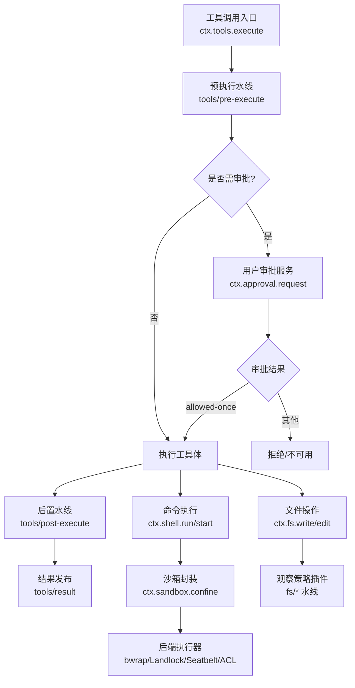
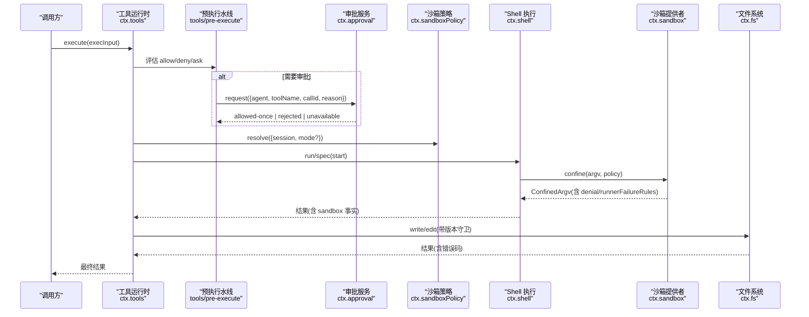
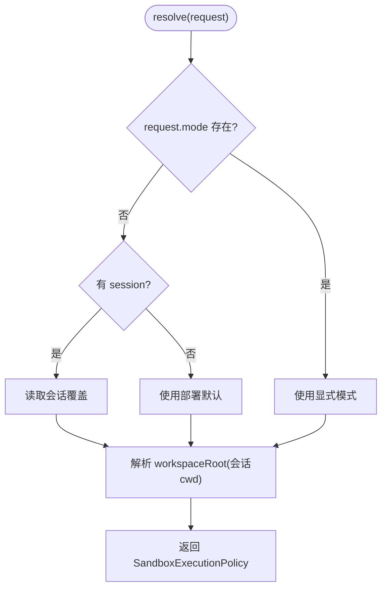
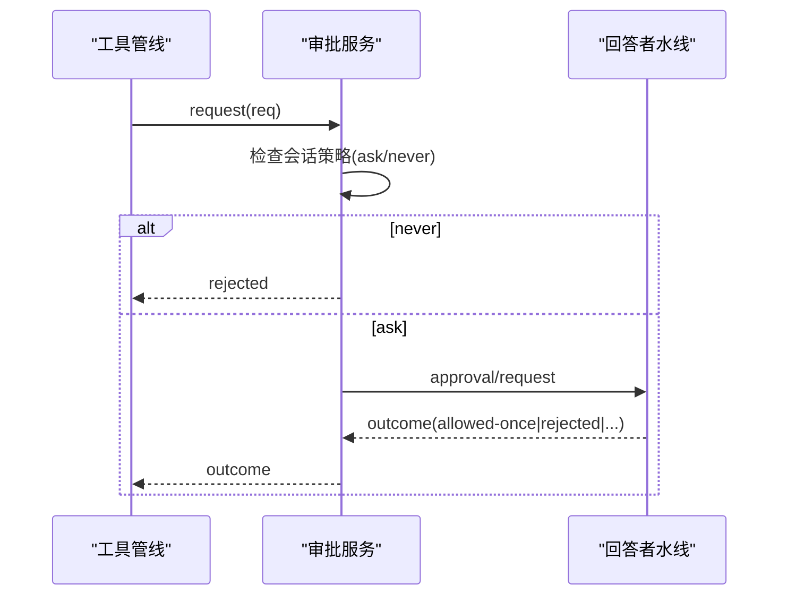
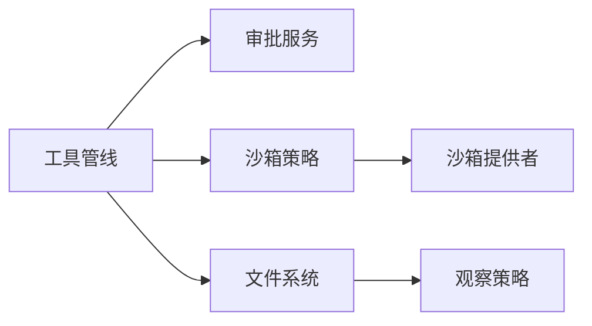

# 权限控制与安全

<cite>
**本文引用的文件**
- [packages/sandbox/sandbox-policy/src/index.ts](file://packages/sandbox/sandbox-policy/src/index.ts)
- [packages/interaction/user-approval/src/index.ts](file://packages/interaction/user-approval/src/index.ts)
- [packages/interaction/permission-presets/src/index.ts](file://packages/interaction/permission-presets/src/index.ts)
- [packages/core/tools/src/index.ts](file://packages/core/tools/src/index.ts)
- [docs/subsystems/sandbox.md](file://docs/subsystems/sandbox.md)
- [docs/subsystems/approval.md](file://docs/subsystems/approval.md)
- [docs/subsystems/tools.md](file://docs/subsystems/tools.md)
- [docs/subsystems/shell.md](file://docs/subsystems/shell.md)
- [docs/subsystems/filesystem.md](file://docs/subsystems/filesystem.md)
- [apps/web/tests/permission-policy-context.e2e.ts](file://apps/web/tests/permission-policy-context.e2e.ts)
</cite>

## 目录
1. [简介](#简介)
2. [项目结构](#项目结构)
3. [核心组件](#核心组件)
4. [架构总览](#架构总览)
5. [详细组件分析](#详细组件分析)
6. [依赖关系分析](#依赖关系分析)
7. [性能与可扩展性](#性能与可扩展性)
8. [故障排查指南](#故障排查指南)
9. [结论](#结论)
10. [附录：配置与最佳实践](#附录配置与最佳实践)

## 简介
本文件系统性阐述工具调用与执行过程中的权限控制与安全机制，覆盖以下主题：
- 基于角色的访问控制、动态权限检查与上下文感知的授权决策
- 安全策略的配置与执行：文件访问策略、命令执行策略、网络访问策略（通过沙箱模式与审批策略组合）
- 沙箱机制：进程隔离、资源限制、文件系统虚拟化
- 用户审批流程：交互式确认、批量审批、条件审批
- 细粒度权限规则：路径级访问控制、命令级白名单
- 安全最佳实践与常见威胁防护
- 安全审计与日志记录

## 项目结构
权限与安全由多个子系统协作完成：
- 沙箱策略服务：统一解析每次调用的沙箱模式与工作区根，注入系统提示以告知模型当前策略
- 用户审批服务：提供“ask/never”策略、可插拔回答者水线、审计事件对
- 权限预设：将沙箱模式与审批策略打包为可选的“预设”，便于客户端一键切换
- 工具执行管线：在 pre-execute/guard/post-execute 等阶段进行允许/拒绝/询问与结果处理
- 文件系统能力：读写编辑操作配合观察策略实现“读前写/编辑”的原子性与新鲜度校验
- Shell 执行：命令执行与沙箱模式结合，支持前台/后台进程、输出截断与转储

图表来源
- [packages/core/tools/src/index.ts:142-197](file://packages/core/tools/src/index.ts#L142-L197)
- [packages/interaction/user-approval/src/index.ts:24-73](file://packages/interaction/user-approval/src/index.ts#L24-L73)
- [docs/subsystems/sandbox.md:9-31](file://docs/subsystems/sandbox.md#L9-L31)
- [docs/subsystems/filesystem.md:181-243](file://docs/subsystems/filesystem.md#L181-L243)

章节来源
- [packages/core/tools/src/index.ts:142-197](file://packages/core/tools/src/index.ts#L142-L197)
- [docs/subsystems/sandbox.md:9-31](file://docs/subsystems/sandbox.md#L9-L31)
- [docs/subsystems/filesystem.md:181-243](file://docs/subsystems/filesystem.md#L181-L243)

## 核心组件
- 沙箱策略服务（SandboxPolicyService）
  - 职责：维护部署默认模式与工作区根；按会话与请求解析每调用一次的策略；向系统提示注入当前策略文本
  - 关键点：优先级为“显式批准模式 > 会话覆盖 > 部署默认”；工作区根来自会话不可变 cwd 或配置回退
- 用户审批服务（ApprovalService）
  - 职责：应用会话策略（ask/never），调度回答者水线，产出封闭结果（allowed-once/rejected/cancelled/unavailable），并追加审计事件对
  - 关键点：仅在打开的 turn 内发起审批；失败关闭；可被 AbortSignal 取消
- 权限预设（PermissionPresetService）
  - 职责：将沙箱模式与审批策略打包为预设；记录用户选择；写入各自设置项；提供投影与命令接口
  - 关键点：仅当值变化时写入；保留“custom”派生状态；要求 shell 具备沙箱能力
- 工具执行管线（ToolRuntime）
  - 职责：注册工具、作用域可见性、pre-execute/guard/post-execute 水线、执行模式（parallel/exclusive）、最终结果发布
  - 关键点：参数冻结、身份令牌、信号融合、结果冻结与持久化

章节来源
- [packages/sandbox/sandbox-policy/src/index.ts:60-151](file://packages/sandbox/sandbox-policy/src/index.ts#L60-L151)
- [packages/interaction/user-approval/src/index.ts:81-147](file://packages/interaction/user-approval/src/index.ts#L81-L147)
- [packages/interaction/permission-presets/src/index.ts:154-199](file://packages/interaction/permission-presets/src/index.ts#L154-L199)
- [packages/core/tools/src/index.ts:142-197](file://packages/core/tools/src/index.ts#L142-L197)

## 架构总览
下图展示了从工具调用到执行落地的完整链路，包括审批、沙箱与文件系统策略。

图表来源
- [packages/core/tools/src/index.ts:142-197](file://packages/core/tools/src/index.ts#L142-L197)
- [packages/interaction/user-approval/src/index.ts:247-276](file://packages/interaction/user-approval/src/index.ts#L247-L276)
- [packages/sandbox/sandbox-policy/src/index.ts:126-151](file://packages/sandbox/sandbox-policy/src/index.ts#L126-L151)
- [docs/subsystems/sandbox.md:152-157](file://docs/subsystems/sandbox.md#L152-L157)
- [docs/subsystems/filesystem.md:114-180](file://docs/subsystems/filesystem.md#L114-L180)

## 详细组件分析

### 沙箱策略与服务
- 策略解析
  - 输入：会话与可选的已批准模式覆盖
  - 输出：包含 mode、workspaceRoot、sessionId 的执行策略
  - 优先级：显式模式 > 会话覆盖 > 部署默认；工作区根优先使用会话 cwd
- 系统提示注入
  - 在服务构造时将当前策略渲染为自然语言，供模型理解当前文件策略
- 后端对接
  - 受限模式通过 ctx.sandbox.confine 包装 argv；非受限模式直接 spawn 原始命令

图表来源
- [packages/sandbox/sandbox-policy/src/index.ts:126-151](file://packages/sandbox/sandbox-policy/src/index.ts#L126-L151)

章节来源
- [packages/sandbox/sandbox-policy/src/index.ts:60-151](file://packages/sandbox/sandbox-policy/src/index.ts#L60-L151)
- [docs/subsystems/sandbox.md:9-31](file://docs/subsystems/sandbox.md#L9-L31)

### 用户审批流程
- 策略
  - ask：委派给回答者水线，无可用回答者则失败关闭
  - never：直接拒绝，不触发任何交互
- 生命周期
  - 仅在打开的 turn 内发起；追加 asked/decided 审计事件对
  - 支持 AbortSignal 取消，超时或异常归一化为 unavailable
- 集成点
  - 工具预执行阶段可发出 ask；审批通过后继续执行
  - 沙箱升级（如更宽的文件访问）可通过审批字段一次性提升

图表来源
- [packages/interaction/user-approval/src/index.ts:247-344](file://packages/interaction/user-approval/src/index.ts#L247-L344)

章节来源
- [docs/subsystems/approval.md:9-88](file://docs/subsystems/approval.md#L9-L88)
- [packages/interaction/user-approval/src/index.ts:81-147](file://packages/interaction/user-approval/src/index.ts#L81-L147)

### 权限预设
- 预设表
  - 将沙箱模式与审批策略绑定为命名预设（如 workspace-write + ask；danger-full-access + never）
  - 支持自定义描述与显示名
- 切换逻辑
  - 仅当值变化时写入对应设置项
  - 记录 permission/preset 事件用于回放与界面展示
- 约束
  - 要求 shell 具备沙箱能力；禁止使用保留名 custom

章节来源
- [packages/interaction/permission-presets/src/index.ts:154-199](file://packages/interaction/permission-presets/src/index.ts#L154-L199)
- [packages/interaction/permission-presets/src/index.ts:375-430](file://packages/interaction/permission-presets/src/index.ts#L375-L430)

### 工具执行管线与权限水线
- 预执行水线（tools/pre-execute）
  - 允许/拒绝/询问；缺少审批通道时 ask 转为拒绝
- 单调守卫（ToolGuard）
  - 只能减少权限，不能恢复已被拒绝的调用
- 后置水线（tools/post-execute）
  - 接受/替换内容或值、阻断并生成纠正反馈
- 结果发布（tools/result）
  - 冻结的最终结果，供观测与持久化

章节来源
- [docs/subsystems/tools.md:153-172](file://docs/subsystems/tools.md#L153-L172)
- [packages/core/tools/src/index.ts:142-197](file://packages/core/tools/src/index.ts#L142-L197)

### 文件系统策略与路径级控制
- 目标与元数据
  - 通过 FsTarget/FsInfo/FsPathInfo 抽象路径与元信息，避免暴露底层实现细节
- 写/编辑守卫
  - createIfAbsent 与 replaceIfVersion 保证原子性与新鲜度
  - 未观察到的目标拒绝写/编辑，防止竞态
- 观察策略
  - fs/write-intent、fs/edit-intent 单槽位决策水线
  - fs/observed 同步记录存在/不存在及版本
- 错误分类
  - FS_SANDBOX_DENIED、FS_PERMISSION_DENIED、FS_STALE_VERSION 等稳定错误码

章节来源
- [docs/subsystems/filesystem.md:11-180](file://docs/subsystems/filesystem.md#L11-L180)
- [docs/subsystems/filesystem.md:181-270](file://docs/subsystems/filesystem.md#L181-L270)

### 命令执行策略与沙箱
- 请求与规范分离
  - ShellExecRequest 经 resolve() 得到 ShellExecSpec，填充必填字段与上限
- 前台/后台
  - 前台返回 ShellRunResult（exitCode/signal/timedOut/aborted/stdout/stderr/sandbox）
  - 后台返回 ShellProcess（done/readOutput/kill/sandbox）
- 沙箱事实
  - 报告实际运行模式、是否被拒绝、执行完整性、runner 是否失败
- 失败分类
  - runnerFailed 与 denial 区分基础设施失败与策略拒绝

章节来源
- [docs/subsystems/shell.md:13-166](file://docs/subsystems/shell.md#L13-L166)

### 网络访问策略
- 沙箱模式仅管控文件效果，不包含网络与进程可见性
- 如需网络限制，应通过部署级网络代理、出站白名单或容器/微虚拟机边界实现（不在本仓库沙箱词汇范围内）

章节来源
- [docs/subsystems/sandbox.md:9-31](file://docs/subsystems/sandbox.md#L9-L31)

## 依赖关系分析
- 松耦合与高内聚
  - 沙箱策略服务独立于具体执行器；工具管线通过水线与守卫扩展权限逻辑
  - 文件系统策略通过事件解耦观察者与执行者
- 关键依赖链
  - tools → approval → answerers
  - tools → sandboxPolicy → sandbox provider
  - tools → fs → observation policy
- 潜在循环
  - 各组件通过事件与上下文解耦，未见直接循环导入

图表来源
- [packages/core/tools/src/index.ts:142-197](file://packages/core/tools/src/index.ts#L142-L197)
- [packages/sandbox/sandbox-policy/src/index.ts:126-151](file://packages/sandbox/sandbox-policy/src/index.ts#L126-L151)
- [docs/subsystems/filesystem.md:181-243](file://docs/subsystems/filesystem.md#L181-L243)

## 性能与可扩展性
- 策略解析开销低：每次调用仅读取会话事件与配置，无额外 I/O
- 审批水线可插拔：新增回答者不影响既有流程，失败关闭保障稳定性
- 文件系统操作无超时：避免无法强制中止的系统调用；通过信号实现尽力而为取消
- 沙箱后端可替换：不同平台后端共享统一策略与失败分类

[本节为通用指导，无需特定文件引用]

## 故障排查指南
- 沙箱拒绝
  - 现象：stderr 出现拒绝标记；结果中包含 denied 标志
  - 处理：根据 denialSignatures 判断是否为策略拒绝；必要时通过审批申请更宽模式重试
- Runner 失败
  - 现象：runnerFailed 为真；可能由于环境 ACL 缺口或内核 ABI 不支持
  - 处理：降级为 partial 执行或更换后端；记录 enforcement 完整性
- 审批不可用
  - 现象：unavailable；可能无回答者或处于非 open turn
  - 处理：确保在 turn 内发起；配置至少一个回答者或切换到 never 策略
- 文件新鲜度冲突
  - 现象：FS_STALE_VERSION；编辑/写入版本不匹配
  - 处理：重新读取最新内容后重试；确保先 read 再 write/edit

章节来源
- [docs/subsystems/sandbox.md:96-157](file://docs/subsystems/sandbox.md#L96-L157)
- [docs/subsystems/filesystem.md:244-270](file://docs/subsystems/filesystem.md#L244-L270)
- [packages/interaction/user-approval/src/index.ts:247-344](file://packages/interaction/user-approval/src/index.ts#L247-L344)

## 结论
该权限与安全体系通过“策略即代码”的方式，将沙箱模式、审批策略与工具执行管线深度整合：
- 沙箱策略集中管理，保证一致性与可审计性
- 审批流程支持交互与自动化，满足多场景需求
- 文件系统策略通过观察与版本守卫，确保原子性与一致性
- 工具管线提供灵活的扩展点，便于企业定制策略与合规要求

[本节为总结，无需特定文件引用]

## 附录：配置与最佳实践

### 安全策略配置要点
- 部署默认
  - 沙箱模式默认 read-only；如需工作区写入需显式配置
  - 审批策略默认 ask；CI/无人值守场景建议 never
- 会话级覆盖
  - 通过预设或命令切换；变更会记录事件，便于回放与审计
- 路径级控制
  - 使用文件系统观察策略实现“读前写/编辑”；对未知目标拒绝写/编辑
- 命令级白名单
  - 通过工具注册与 restrict 过滤全局工具集；结合 ToolGuard 做最终拒绝

章节来源
- [packages/sandbox/sandbox-policy/src/index.ts:60-110](file://packages/sandbox/sandbox-policy/src/index.ts#L60-L110)
- [packages/interaction/permission-presets/src/index.ts:154-199](file://packages/interaction/permission-presets/src/index.ts#L154-L199)
- [docs/subsystems/tools.md:153-172](file://docs/subsystems/tools.md#L153-L172)

### 细粒度权限规则示例
- 路径级别
  - 仅允许在工作区根与后端临时区域写入；其他路径被沙箱拒绝
- 命令级别
  - 仅允许有限命令集合；危险命令通过 deny 列表移除
- 条件审批
  - 对高风险操作启用 ask；低风险操作允许直接执行

章节来源
- [docs/subsystems/sandbox.md:9-31](file://docs/subsystems/sandbox.md#L9-L31)
- [docs/subsystems/tools.md:153-172](file://docs/subsystems/tools.md#L153-L172)

### 安全最佳实践
- 最小权限原则：默认 read-only，按需放宽
- 失败关闭：审批不可用时拒绝而非放行
- 审计先行：所有审批与策略变更均记录事件，便于追溯
- 分层防御：沙箱 + 审批 + 文件系统策略组合，降低单点失效风险
- 可观测性：利用工具结果与沙箱事实定位问题

章节来源
- [docs/subsystems/approval.md:9-88](file://docs/subsystems/approval.md#L9-L88)
- [docs/subsystems/sandbox.md:9-31](file://docs/subsystems/sandbox.md#L9-L31)
- [docs/subsystems/filesystem.md:181-270](file://docs/subsystems/filesystem.md#L181-L270)

### 常见威胁与防护
- 越权写入：通过沙箱模式与文件系统版本守卫阻止
- 命令滥用：工具白名单 + 沙箱模式限制
- 凭据泄露：shell 环境变量清理与受控 DSH_* 变量
- 拒绝服务：超时与取消信号；输出截断与转储

章节来源
- [docs/subsystems/shell.md:13-166](file://docs/subsystems/shell.md#L13-L166)
- [docs/subsystems/filesystem.md:244-270](file://docs/subsystems/filesystem.md#L244-L270)

### 安全审计与日志记录
- 审批审计：approval/asked + approval/decided 成对记录
- 策略变更：sandbox/mode、approval/policy、permission/preset 事件
- 工具结果：tools/result 冻结快照，便于回放与取证

章节来源
- [packages/interaction/user-approval/src/index.ts:24-73](file://packages/interaction/user-approval/src/index.ts#L24-L73)
- [packages/interaction/permission-presets/src/index.ts:42-52](file://packages/interaction/permission-presets/src/index.ts#L42-L52)
- [packages/core/tools/src/index.ts:190-197](file://packages/core/tools/src/index.ts#L190-L197)

### 端到端验证参考
- 行为验证：在测试中确认只读模式下写操作被拒绝、审批被触发、策略生效
- 断言要点：包含沙箱拒绝标记、审批事件、以及工作区文件未被修改

章节来源
- [apps/web/tests/permission-policy-context.e2e.ts:145-163](file://apps/web/tests/permission-policy-context.e2e.ts#L145-L163)