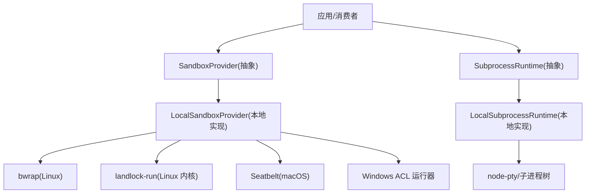
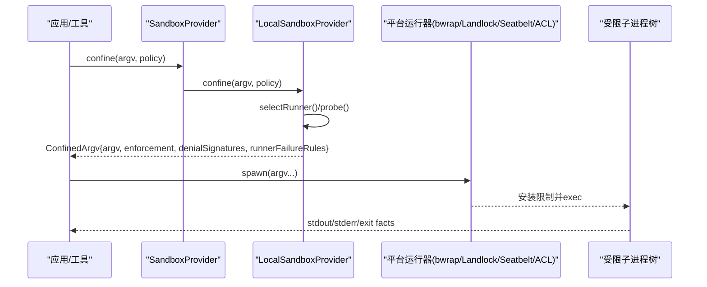
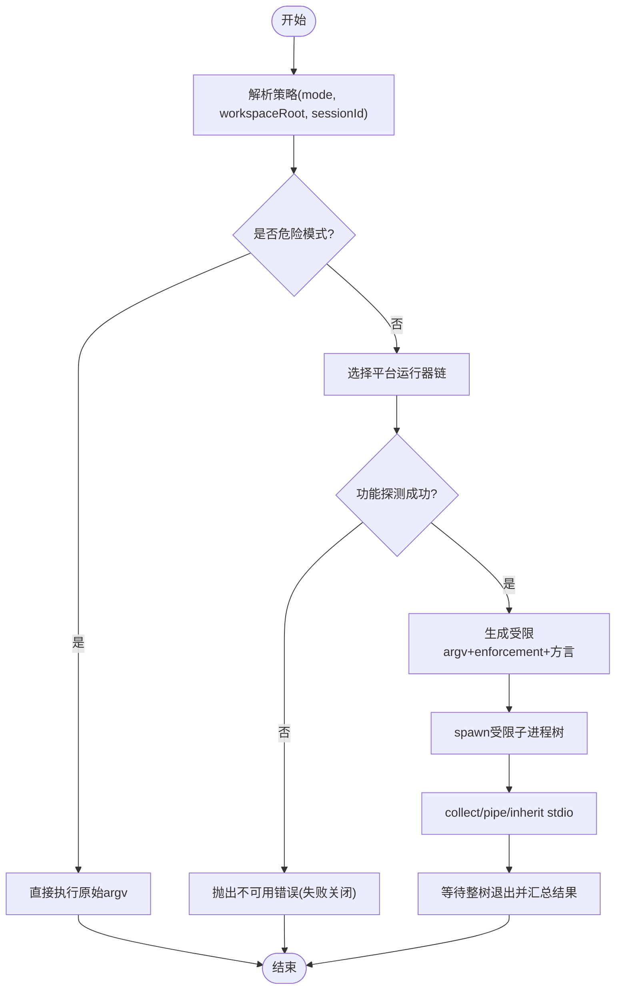
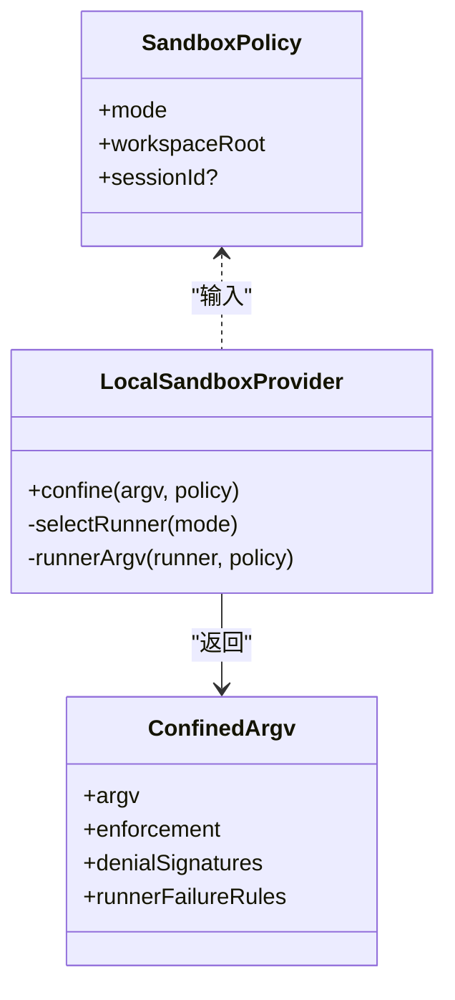
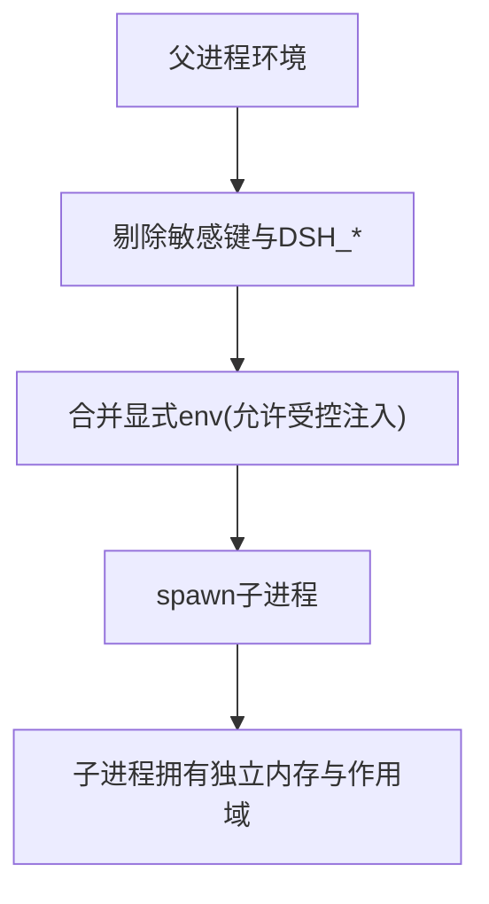
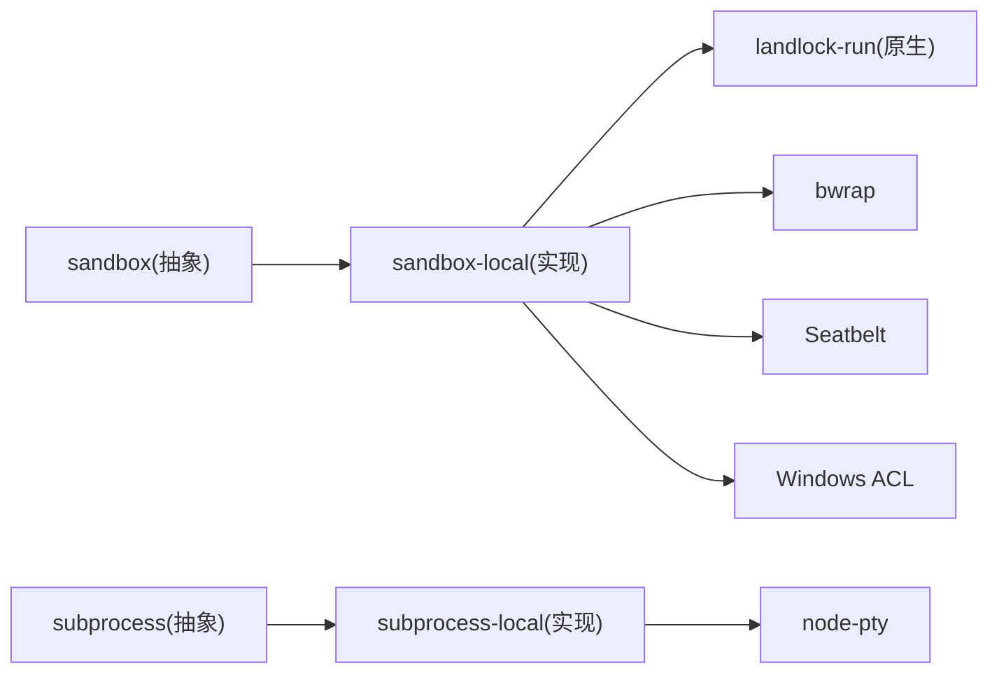

# 沙箱隔离机制

<cite>
**本文引用的文件**
- [packages/sandbox/sandbox/src/index.ts](file://packages/sandbox/sandbox/src/index.ts)
- [packages/sandbox/sandbox-local/src/index.ts](file://packages/sandbox/sandbox-local/src/index.ts)
- [native/landlock-run/packages/entry/src/main.c](file://native/landlock-run/packages/entry/src/main.c)
- [native/landlock-run/README.md](file://native/landlock-run/README.md)
- [docs/subsystems/sandbox.md](file://docs/subsystems/sandbox.md)
- [docs/subsystems/subprocess.md](file://docs/subsystems/subprocess.md)
- [packages/subprocess/subprocess/src/index.ts](file://packages/subprocess/subprocess/src/index.ts)
- [packages/subprocess/subprocess-local/src/index.ts](file://packages/subprocess/subprocess-local/src/index.ts)
- [packages/sandbox/sandbox-windows-acl/src/acl.ts](file://packages/sandbox/sandbox-windows-acl/src/acl.ts)
</cite>

## 目录
1. [简介](#简介)
2. [项目结构](#项目结构)
3. [核心组件](#核心组件)
4. [架构总览](#架构总览)
5. [详细组件分析](#详细组件分析)
6. [依赖关系分析](#依赖关系分析)
7. [性能考量](#性能考量)
8. [故障排除指南](#故障排除指南)
9. [结论](#结论)
10. [附录](#附录)

## 简介
本文件系统性阐述该仓库中的“沙箱隔离机制”，覆盖进程隔离、文件系统虚拟化、内存与安全边界、网络访问控制策略、环境配置与调优，以及常见威胁防护与排障。重点围绕以下能力：
- 进程隔离：子进程管理、资源限制、系统调用过滤（Linux Landlock、macOS Seatbelt、Windows ACL）。
- 文件系统虚拟化：虚拟映射、路径重定向、访问审计（以 bwrap/Landlock/ACL 为核心）。
- 内存与安全边界：变量作用域隔离、数据泄露防护（通过环境变量清洗与最小暴露面）。
- 网络访问控制：出站连接限制、域名白名单、流量监控（在沙箱语义中由模式与后端共同约束）。
- 配置与调优：资源配额、安全策略、性能优化建议。
- 威胁防护与排障：典型攻击面与问题定位方法。

## 项目结构
沙箱相关代码分布在多个包与原生组件中，形成“抽象接口 + 本地实现 + 平台后端”的分层结构：
- 抽象服务定义：SandboxProvider、SubprocessRuntime 等，统一对外契约。
- 本地提供者：LocalSandboxProvider、LocalSubprocessRuntime，负责平台选择、探针、参数拼装与生命周期管理。
- 平台后端：bwrap（Linux）、Landlock（Linux 内核子系统）、Seatbelt（macOS）、Windows ACL（受限令牌与 DACL）。
- 原生执行器：landlock-run（C 语言），直接调用内核 Landlock UAPI，完成自限制后 exec。

**图表来源**
- [packages/sandbox/sandbox/src/index.ts:152-176](file://packages/sandbox/sandbox/src/index.ts#L152-L176)
- [packages/sandbox/sandbox-local/src/index.ts:159-187](file://packages/sandbox/sandbox-local/src/index.ts#L159-L187)
- [native/landlock-run/README.md:1-48](file://native/landlock-run/README.md#L1-L48)
- [packages/subprocess/subprocess/src/index.ts:74-140](file://packages/subprocess/subprocess/src/index.ts#L74-L140)
- [packages/subprocess/subprocess-local/src/index.ts:37-102](file://packages/subprocess/subprocess-local/src/index.ts#L37-L102)

**章节来源**
- [docs/subsystems/sandbox.md:1-219](file://docs/subsystems/sandbox.md#L1-L219)
- [docs/subsystems/subprocess.md:1-325](file://docs/subsystems/subprocess.md#L1-L325)

## 核心组件
- 沙箱抽象与模式
  - SandboxMode：read-only、workspace-write、danger-full-access；仅前两种可发送给提供程序进行限制。
  - ConfinedSandboxMode：非危险模式的限定集合。
  - SandboxExecutionPolicy/SandboxPolicy：每调用解析的完整文件影响策略，包含工作区根与可选会话标识。
  - ConfinedArgv：返回被包装的 argv、后端实现的强制完整性（full/partial）、拒绝特征与运行器失败规则。
- 本地沙箱提供者
  - LocalSandboxProvider：按平台选择 runner 链（Linux 优先 bwrap，其次 Landlock；macOS Seatbelt；Windows ACL），功能探测并缓存结果，输出 denial 方言与 runner 失败规则。
- 子进程运行时
  - SubprocessRuntime/SubprocessHandle：统一的子进程生命周期、stdio 处置、收集输出、终止升级（SIGTERM→grace→SIGKILL）与整树观察。
  - LocalSubprocessRuntime：具体实现，含可执行查找、环境清洗、PTY 分配与清理。

**章节来源**
- [packages/sandbox/sandbox/src/index.ts:23-176](file://packages/sandbox/sandbox/src/index.ts#L23-L176)
- [packages/sandbox/sandbox-local/src/index.ts:250-568](file://packages/sandbox/sandbox-local/src/index.ts#L250-L568)
- [packages/subprocess/subprocess/src/index.ts:37-140](file://packages/subprocess/subprocess/src/index.ts#L37-L140)
- [packages/subprocess/subprocess-local/src/index.ts:37-196](file://packages/subprocess/subprocess-local/src/index.ts#L37-L196)

## 架构总览
下图展示一次受限执行的端到端流程：消费者解析策略 → 调用 confine 获取受限 argv → 启动子进程树 → 后端实施文件/系统调用限制 → 输出与退出事实上报。

**图表来源**
- [packages/sandbox/sandbox/src/index.ts:152-176](file://packages/sandbox/sandbox/src/index.ts#L152-L176)
- [packages/sandbox/sandbox-local/src/index.ts:316-343](file://packages/sandbox/sandbox-local/src/index.ts#L316-L343)
- [native/landlock-run/README.md:25-48](file://native/landlock-run/README.md#L25-L48)

## 详细组件分析

### 进程隔离与子进程管理
- 策略解析与传递
  - 每次调用解析 SandboxPolicy，携带 mode、workspaceRoot、sessionId（用于后端区分会话级状态）。
  - 只有 confined 模式进入 ctx.sandbox；danger-full-access 直接绕过限制。
- 运行器选择与探测
  - Linux：先尝试 bwrap（挂载视图接近模式语义），再回退到 Landlock（内核子系统）。
  - macOS：Seatbelt。
  - Windows：ACL 受限令牌运行器（报告 partial 强制，因 Everyone/hard-link 边界）。
- 失败关闭原则
  - 无可用后端或运行器拒绝时抛出不可用错误，绝不静默放行未受限命令。
- 子进程树管理
  - 统一 terminate 升级序列与 waitForExit 整树观察；收集输出支持溢出转储与偏移读取。

**图表来源**
- [packages/sandbox/sandbox/src/index.ts:23-72](file://packages/sandbox/sandbox/src/index.ts#L23-L72)
- [packages/sandbox/sandbox-local/src/index.ts:492-539](file://packages/sandbox/sandbox-local/src/index.ts#L492-L539)
- [docs/subsystems/subprocess.md:89-174](file://docs/subsystems/subprocess.md#L89-L174)

**章节来源**
- [docs/subsystems/sandbox.md:9-157](file://docs/subsystems/sandbox.md#L9-L157)
- [packages/sandbox/sandbox-local/src/index.ts:159-187](file://packages/sandbox/sandbox-local/src/index.ts#L159-L187)
- [docs/subsystems/subprocess.md:132-239](file://docs/subsystems/subprocess.md#L132-L239)

### 文件系统虚拟化与访问审计
- 虚拟映射与路径重定向
  - bwrap：通过只读绑定与设备/proc 挂载构建受限视图。
  - Landlock：基于内核 allow-list 的文件系统访问位掩码，按 ABI 协商能力集。
  - Windows ACL：为工作区与临时目录建立 DACL，结合受限令牌限制写权限。
- 访问审计
  - 各后端输出特定 denial 方言（如 EROFS/EACCES/EPERM 文本），供上层识别“被沙箱拒绝”而非“命令失败”。
  - 运行器失败规则（runnerFailureRules）将“运行器自身失败”与“命令被拒绝”区分开。

**图表来源**
- [packages/sandbox/sandbox/src/index.ts:39-116](file://packages/sandbox/sandbox/src/index.ts#L39-L116)
- [packages/sandbox/sandbox-local/src/index.ts:316-343](file://packages/sandbox/sandbox-local/src/index.ts#L316-L343)

**章节来源**
- [packages/sandbox/sandbox-local/src/index.ts:200-240](file://packages/sandbox/sandbox-local/src/index.ts#L200-L240)
- [docs/subsystems/sandbox.md:96-157](file://docs/subsystems/sandbox.md#L96-L157)

### 内存隔离与安全边界
- 环境变量清洗
  - 子进程环境会剔除敏感键（KEY/PASSWORD/SECRET/TOKEN）与 Harness 内部命名空间（DSH_*），避免凭据泄漏。
  - 显式传入 env 会在清洗后的基线之上合并，允许受控转发。
- 变量作用域隔离
  - 子进程拥有独立地址空间；父进程状态不会隐式继承。
- 数据泄露防护
  - 通过最小化 PATH、HOME、locale 等必要变量保留，同时剥离身份与密钥类变量。
  - 终端/PTY 场景下，文本传输与前台进程组信号由提供者封装，减少误暴露面。

**图表来源**
- [packages/subprocess/subprocess/src/index.ts:37-66](file://packages/subprocess/subprocess/src/index.ts#L37-L66)
- [docs/subsystems/subprocess.md:13-41](file://docs/subsystems/subprocess.md#L13-L41)

**章节来源**
- [packages/subprocess/subprocess/src/index.ts:37-66](file://packages/subprocess/subprocess/src/index.ts#L37-L66)
- [docs/subsystems/subprocess.md:13-41](file://docs/subsystems/subprocess.md#L13-L41)

### 网络访问控制策略
- 出站连接限制
  - 当前沙箱模式词汇聚焦于“文件效果”；网络可见性不在模式词汇内。实际出站限制通常由容器/微VM/远端执行等“兄弟能力缝”承担，或通过外部网络代理/防火墙策略配合。
- 域名白名单与流量监控
  - 若需细粒度网络控制，建议在部署层（容器网络策略、eBPF、网关）实现白名单与流量观测，并在沙箱策略中通过模式与后端组合确保不意外获得网络能力。

[本节为概念性说明，不直接分析具体文件]

### 配置沙箱环境
- 资源配额设置
  - 子进程收集输出支持 maxBytes 与 spill 文件，防止内存膨胀；graceMs 控制优雅终止窗口。
- 安全策略配置
  - 使用 read-only 或 workspace-write 模式；danger-full-access 仅在必要时且明确授权时使用。
  - 自定义 runnerCommand 与 runnerFailureSignatures 以适配第三方运行器。
- 性能调优
  - 合理设置 probeTimeoutMs，避免探测阻塞。
  - 利用平台首选运行器（Linux 优先 bwrap）以获得更贴近模式语义的挂载视图。
  - 对频繁短生命周期任务，考虑复用会话级临时目录（Windows ACL 已内置 per-session 私有临时目录）。

**章节来源**
- [docs/subsystems/subprocess.md:41-68](file://docs/subsystems/subprocess.md#L41-L68)
- [packages/sandbox/sandbox-local/src/index.ts:43-65](file://packages/sandbox/sandbox-local/src/index.ts#L43-L65)
- [packages/subprocess/subprocess-local/src/index.ts:146-184](file://packages/subprocess/subprocess-local/src/index.ts#L146-L184)

## 依赖关系分析
- 模块耦合
  - sandbox 抽象与 local 实现解耦，便于替换后端。
  - subprocess 抽象与 local 实现分离，便于远程/本地不同实现。
- 外部依赖
  - landlock-run：C 语言原生二进制，直接调用内核 Landlock UAPI。
  - node-pty：PTY 分配与终端会话管理。
  - Windows ACL：受限令牌与 DACL 操作。

**图表来源**
- [packages/sandbox/sandbox/src/index.ts:152-176](file://packages/sandbox/sandbox/src/index.ts#L152-L176)
- [packages/sandbox/sandbox-local/src/index.ts:159-187](file://packages/sandbox/sandbox-local/src/index.ts#L159-L187)
- [native/landlock-run/README.md:1-48](file://native/landlock-run/README.md#L1-L48)
- [packages/subprocess/subprocess-local/src/index.ts:16-28](file://packages/subprocess/subprocess-local/src/index.ts#L16-L28)

**章节来源**
- [packages/sandbox/sandbox-local/src/index.ts:159-187](file://packages/sandbox/sandbox-local/src/index.ts#L159-L187)
- [packages/subprocess/subprocess-local/src/index.ts:16-28](file://packages/subprocess/subprocess-local/src/index.ts#L16-L28)

## 性能考量
- 探测与选择
  - 首次选择运行器时会进行功能探测，结果缓存以避免重复开销。
- 输出收集
  - 使用偏移读取与 spill 文件，避免大输出导致内存压力；合理设置 maxBytes。
- 终止与回收
  - 整树终止与等待，确保无僵尸进程；host exit 时强制清理。
- 平台差异
  - Linux 优先 bwrap 可获得更接近模式语义的挂载视图；Landlock 提供内核级 allow-list 但可能因 ABI 降级为 partial。

[本节为通用指导，不直接分析具体文件]

## 故障排除指南
- 无法找到可用后端
  - 现象：抛出不可用错误（SANDBOX_UNAVAILABLE）。
  - 处理：安装 bwrap 或启用 Landlock 内核；macOS 确保 sandbox-exec 可用；Windows 确保 ACL 受限令牌运行器可启动。
- 运行器失败 vs 命令被拒绝
  - 现象：子进程非零退出。
  - 处理：先匹配 runnerFailureRules（含信息行排除与致命签名），再匹配 denialSignatures；前者表示运行器失败，后者表示命令被沙箱拒绝。
- Landlock 部分强制
  - 现象：提示 older ABI / partial enforcement。
  - 处理：接受 partial 语义或升级内核；注意某些访问位不受旧 ABI 治理。
- Windows ACL 权限问题
  - 现象：Access denied 或路径访问失败。
  - 处理：检查工作区 SID 与临时目录 SID 是否正确授予；确认临时目录位于工作区之外；关注硬链接别名带来的边界。

**章节来源**
- [packages/sandbox/sandbox/src/index.ts:118-144](file://packages/sandbox/sandbox/src/index.ts#L118-L144)
- [packages/sandbox/sandbox-local/src/index.ts:200-240](file://packages/sandbox/sandbox-local/src/index.ts#L200-L240)
- [native/landlock-run/packages/entry/src/main.c:230-299](file://native/landlock-run/packages/entry/src/main.c#L230-L299)
- [packages/sandbox/sandbox-windows-acl/src/acl.ts:46-58](file://packages/sandbox/sandbox-windows-acl/src/acl.ts#L46-L58)

## 结论
该沙箱体系通过“抽象 + 本地实现 + 多平台后端”的分层设计，提供了跨平台的进程隔离与文件访问控制能力。其关键优势包括：
- 明确的模式词汇与每调用策略，保证一致的安全语义。
- 失败关闭与结构化诊断，避免静默降级。
- 子进程生命周期与环境清洗，降低泄露与资源泄漏风险。
- 可扩展的后端选择与探测机制，兼顾兼容性与安全性。

在生产环境中，建议结合部署层的网络策略与资源配额，进一步补齐网络与计算资源的限制面，形成完整的隔离闭环。

## 附录
- 术语
  - 模式：read-only、workspace-write、danger-full-access。
  - 强制完整性：full（完全治理）、partial（部分治理，如旧 ABI 或 ACL 边界）。
  - 拒绝方言：各后端产生的 stderr 片段，用于识别“被沙箱拒绝”。
- 参考
  - 沙箱子系统文档与子进程文档提供完整 API 与行为约定。

[本节为补充说明，不直接分析具体文件]