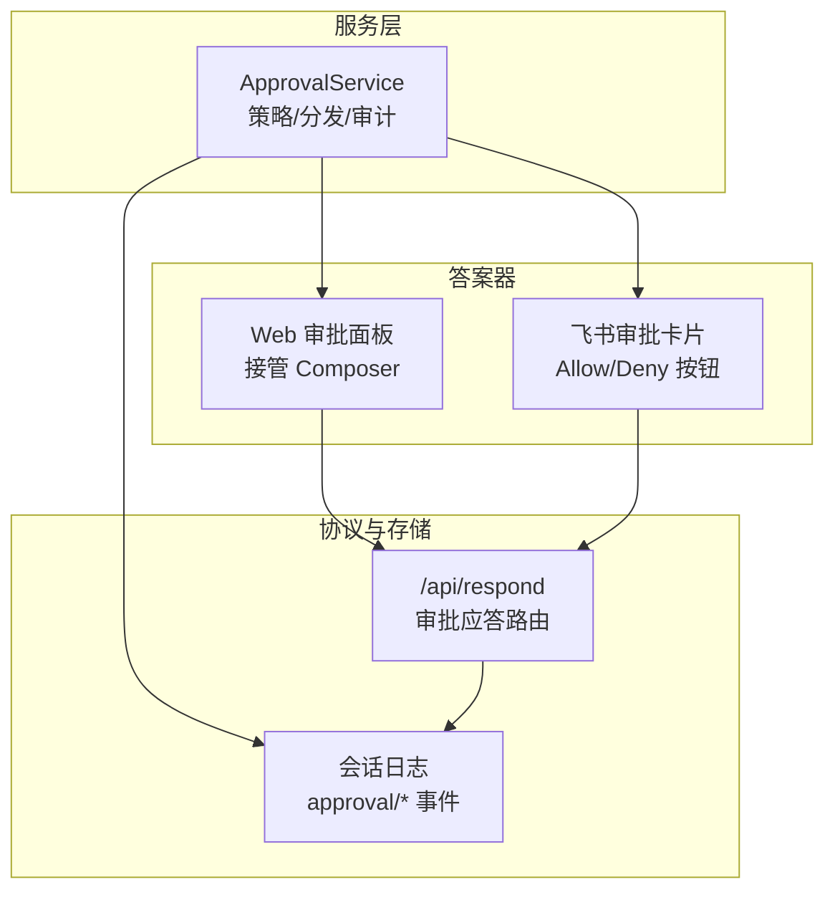
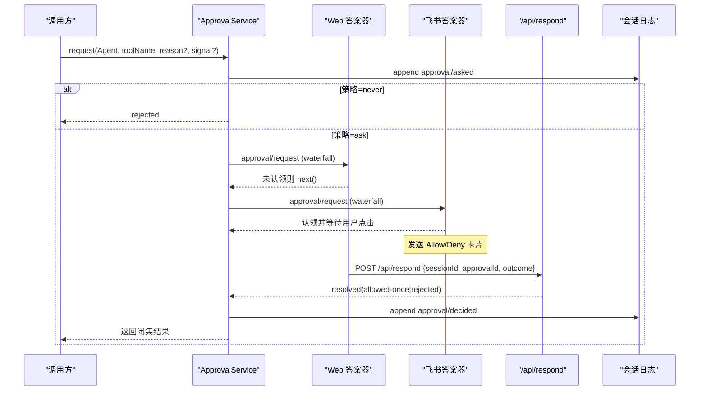
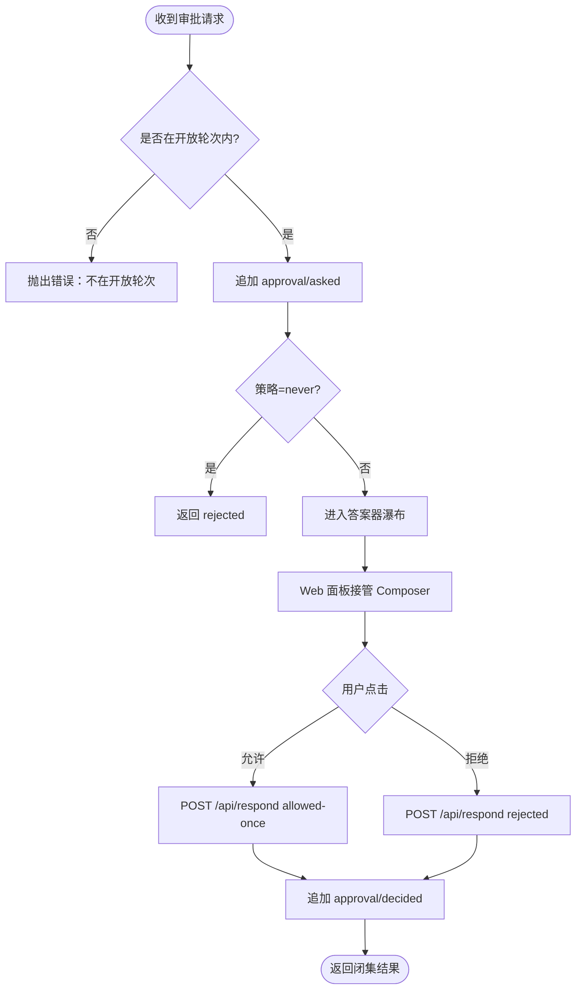
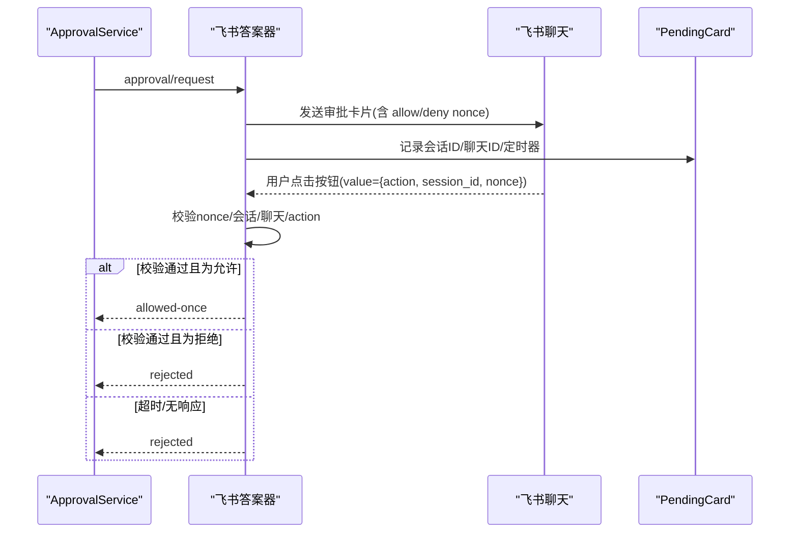
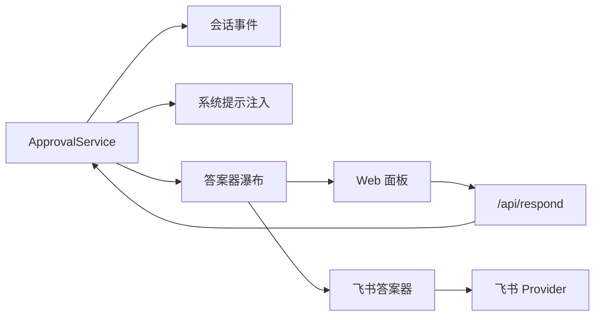

# 用户审批流程

<cite>
**本文引用的文件**
- [packages/interaction/user-approval/src/index.ts](file://packages/interaction/user-approval/src/index.ts)
- [docs/subsystems/approval.md](file://docs/subsystems/approval.md)
- [packages/feishu/feishu-approval/src/index.ts](file://packages/feishu/feishu-approval/src/index.ts)
- [apps/web/tests/approval-composer.e2e.ts](file://apps/web/tests/approval-composer.e2e.ts)
- [packages/host/apiproxy/src/api/approvals.schema.ts](file://packages/host/apiproxy/src/api/approvals.schema.ts)
- [packages/host/apiproxy/src/api/approvals.ts](file://packages/host/apiproxy/src/api/approvals.ts)
</cite>

## 目录
1. [简介](#简介)
2. [项目结构](#项目结构)
3. [核心组件](#核心组件)
4. [架构总览](#架构总览)
5. [详细组件分析](#详细组件分析)
6. [依赖关系分析](#依赖关系分析)
7. [性能与可扩展性](#性能与可扩展性)
8. [故障排查指南](#故障排查指南)
9. [结论](#结论)
10. [附录：配置与集成要点](#附录：配置与集成要点)

## 简介
本文件系统化梳理“用户审批流程”的机制与实现，覆盖以下目标：
- 交互式确认机制：触发条件、界面呈现与响应处理。
- 批量审批能力：多任务队列、优先级管理与批量操作支持。
- 条件审批策略：基于上下文的动态规则、时间约束与风险评估。
- 审批状态管理：待审批队列、历史记录与审计日志。
- 自定义审批流程：审批规则定义、通知机制与第三方系统集成。
- 最佳实践与常见问题解决方案。

## 项目结构
审批能力由“服务层 + 答案器（Answerer）+ 持久化审计事件 + 多通道 UI 应答”构成：
- 服务层：ApprovalService 负责策略判定、审计事件追加、瀑布式分发到答案器。
- 答案器：Web 宿主与飞书渠道分别提供交互面板或卡片，完成用户决策并回写结果。
- 审计事件：approval/asked、approval/decided、approval/policy 作为会话日志的一部分，保证可回放与可审计。
- Web 协议桥接：通过 /api/respond 将客户端的允许/拒绝结果映射为服务侧的最终决定。

图表来源
- [packages/interaction/user-approval/src/index.ts:192-348](file://packages/interaction/user-approval/src/index.ts#L192-L348)
- [packages/feishu/feishu-approval/src/index.ts:121-359](file://packages/feishu/feishu-approval/src/index.ts#L121-L359)
- [packages/host/apiproxy/src/api/approvals.ts:1-22](file://packages/host/apiproxy/src/api/approvals.ts#L1-L22)

章节来源
- [docs/subsystems/approval.md:1-171](file://docs/subsystems/approval.md#L1-L171)
- [packages/interaction/user-approval/src/index.ts:192-348](file://packages/interaction/user-approval/src/index.ts#L192-L348)

## 核心组件
- ApprovalService：封装审批策略（ask/never）、审计事件追加、瀑布分发、信号取消与结果归一化。
- 答案器链：Web 面板与飞书卡片以 waterfall 模式注册，按范围过滤（agent 作用域），首个返回确定值的答案器即锁定结果。
- 审计事件：approval/asked、approval/decided、approval/policy 仅落盘，不进入模型对话；策略变更通过运行时上下文快照对模型可见。
- Web 协议桥接：POST /api/respond 携带 ApprovalResponsePayload，经 schema 校验后广播 resolved 帧，最终写入会话日志。

章节来源
- [packages/interaction/user-approval/src/index.ts:192-348](file://packages/interaction/user-approval/src/index.ts#L192-L348)
- [docs/subsystems/approval.md:100-171](file://docs/subsystems/approval.md#L100-L171)
- [packages/host/apiproxy/src/api/approvals.schema.ts:1-22](file://packages/host/apiproxy/src/api/approvals.schema.ts#L1-L22)
- [packages/host/apiproxy/src/api/approvals.ts:1-22](file://packages/host/apiproxy/src/api/approvals.ts#L1-L22)

## 架构总览
审批请求从调用方进入 ApprovalService，先应用会话策略，再进入答案器瀑布；UI 答案器在 Web 或飞书渠道呈现交互，用户点击后通过协议或服务内部通道回写结果，服务追加审计事件并返回闭集结果。

图表来源
- [packages/interaction/user-approval/src/index.ts:257-344](file://packages/interaction/user-approval/src/index.ts#L257-L344)
- [packages/feishu/feishu-approval/src/index.ts:278-343](file://packages/feishu/feishu-approval/src/index.ts#L278-L343)
- [packages/host/apiproxy/src/api/approvals.ts:1-22](file://packages/host/apiproxy/src/api/approvals.ts#L1-L22)

## 详细组件分析

### 交互式确认机制（Web 面板）
- 触发条件：工具执行被沙箱拒绝或需要权限升级时，调用方发起审批请求。
- 界面呈现：Web 端以“接管 Composer”的方式展示审批面板，包含理由标题、配对命令与一次性拒绝/允许按钮；长命令区域具备滚动与高度上限，确保按钮始终可见。
- 响应处理：用户点击后，通过 POST /api/respond 提交结果；服务端校验载荷并广播 resolved 帧，最终落盘审计事件。

图表来源
- [packages/interaction/user-approval/src/index.ts:257-344](file://packages/interaction/user-approval/src/index.ts#L257-L344)
- [apps/web/tests/approval-composer.e2e.ts:72-177](file://apps/web/tests/approval-composer.e2e.ts#L72-L177)

章节来源
- [apps/web/tests/approval-composer.e2e.ts:72-177](file://apps/web/tests/approval-composer.e2e.ts#L72-L177)
- [packages/interaction/user-approval/src/index.ts:257-344](file://packages/interaction/user-approval/src/index.ts#L257-L344)

### 交互式确认机制（飞书卡片）
- 触发条件：绑定到飞书聊天会话的 Agent 产生审批请求。
- 界面呈现：向聊天发送交互式卡片，包含工具名、原因摘要与“允许一次/拒绝”按钮；卡片附带一次性 nonce，防止重放与伪造。
- 响应处理：用户点击按钮后，服务端校验 nonce、会话与聊天 ID，匹配到对应 PendingCard 并结算结果；超时自动拒绝；达到并发上限时委托下一个答案器。

图表来源
- [packages/feishu/feishu-approval/src/index.ts:121-359](file://packages/feishu/feishu-approval/src/index.ts#L121-L359)

章节来源
- [packages/feishu/feishu-approval/src/index.ts:121-359](file://packages/feishu/feishu-approval/src/index.ts#L121-L359)

### 批量审批功能（多任务队列、优先级与批量操作）
- 多任务队列：服务层通过 waterfall 支持多个答案器并行注册；每个审批请求独立生成唯一 id，并在会话日志中成对记录 asked/decided，天然支持并发与隔离。
- 优先级管理：答案器可通过 prepend 优先注册，从而更早参与决策；例如 Web 面板通常优先于通用捕获者，确保关键交互不被吞掉。
- 批量操作支持：当前设计聚焦“单请求闭环”，但可通过外部编排（如工作流或批处理器）聚合多个审批请求，统一调度与重试；对于飞书渠道，存在最大并发卡片限制，超出时委托下一个答案器以避免内存膨胀。

章节来源
- [packages/interaction/user-approval/src/index.ts:304-344](file://packages/interaction/user-approval/src/index.ts#L304-L344)
- [packages/feishu/feishu-approval/src/index.ts:275-343](file://packages/feishu/feishu-approval/src/index.ts#L275-L343)

### 条件审批策略（上下文、时间与风险）
- 上下文驱动：策略来源于会话日志中的 last policy 事件，结合服务默认策略形成有效策略；策略变更会注入系统提示上下文，使模型感知当前审批行为。
- 时间约束：飞书卡片支持超时配置，超时自动拒绝；Web 面板受轮次生命周期约束，轮次结束前必须给出决定。
- 风险评估：可在上游调用方附加 reason 字段用于展示与审计；答案器可据此实施更细粒度的风控（例如高风险操作要求更高确认）。

章节来源
- [packages/interaction/user-approval/src/index.ts:192-217](file://packages/interaction/user-approval/src/index.ts#L192-L217)
- [packages/feishu/feishu-approval/src/index.ts:46-64](file://packages/feishu/feishu-approval/src/index.ts#L46-L64)

### 审批状态管理（待审批队列、历史与审计）
- 待审批队列：服务层维护 ask/decided 的成对关系；答案器侧维护 PendingCard 表（飞书）或 Web 面板状态（Web），确保幂等与防重放。
- 历史记录：所有审批相关事件均写入会话日志，支持回放与审计；策略切换事件亦持久化，便于重建状态。
- 审计日志：approval/asked、approval/decided、approval/policy 均为 log-only 事件，不参与模型对话，但影响运行时上下文快照。

章节来源
- [packages/interaction/user-approval/src/index.ts:34-73](file://packages/interaction/user-approval/src/index.ts#L34-L73)
- [docs/subsystems/approval.md:84-140](file://docs/subsystems/approval.md#L84-L140)

## 依赖关系分析
- ApprovalService 依赖：
  - 会话事件：turn/start、turn/end 用于判断开放轮次；approval/* 事件用于审计与策略折叠。
  - 系统提示注入：将策略变化暴露给模型。
  - 答案器瀑布：scope-targeted 分发，按 agent 作用域过滤。
- 飞书答案器依赖：
  - Feishu 消息与卡片收发、provider 生命周期事件。
  - 会话绑定：根据 agent/session 树推导聊天 ID。
- Web 协议桥接：
  - /api/respond 接收客户端审批结果，校验载荷并广播 resolved 帧。

图表来源
- [packages/interaction/user-approval/src/index.ts:192-348](file://packages/interaction/user-approval/src/index.ts#L192-L348)
- [packages/feishu/feishu-approval/src/index.ts:121-359](file://packages/feishu/feishu-approval/src/index.ts#L121-L359)
- [packages/host/apiproxy/src/api/approvals.ts:1-22](file://packages/host/apiproxy/src/api/approvals.ts#L1-L22)

章节来源
- [packages/interaction/user-approval/src/index.ts:192-348](file://packages/interaction/user-approval/src/index.ts#L192-L348)
- [packages/feishu/feishu-approval/src/index.ts:121-359](file://packages/feishu/feishu-approval/src/index.ts#L121-L359)
- [packages/host/apiproxy/src/api/approvals.ts:1-22](file://packages/host/apiproxy/src/api/approvals.ts#L1-L22)

## 性能与可扩展性
- 并发控制：飞书答案器对 PendingCard 数量设置上限，避免无限增长；超出时委托下一个答案器，保障稳定性。
- 超时与取消：支持 AbortSignal 取消；超时自动拒绝；轮次结束时未决请求将被回收。
- 可扩展点：
  - 新增答案器：通过订阅 approval/request 并返回闭集结果即可接入新渠道。
  - 策略扩展：在会话日志追加策略事件，或通过服务默认策略进行部署级控制。
  - 批量编排：在上游工作流中聚合多个审批请求，统一调度与重试。

章节来源
- [packages/feishu/feishu-approval/src/index.ts:71-79](file://packages/feishu/feishu-approval/src/index.ts#L71-L79)
- [packages/interaction/user-approval/src/index.ts:304-344](file://packages/interaction/user-approval/src/index.ts#L304-L344)

## 故障排查指南
- 常见错误与定位：
  - 非开放轮次调用：当未在 turn/start..turn/end 范围内发起审批，会抛出错误；需在正确的轮次内调用。
  - 答案器缺失或异常：若无答案器认领或答案器抛错，结果归一化为 unavailable；检查答案器注册与作用域。
  - 飞书卡片投递失败：若无法送达聊天，将委托下一个答案器；检查 provider 可用性与 fallbackChatId。
  - 策略无效：策略值必须为 ask 或 never；非法值会在写入日志前抛出类型错误。
- 调试建议：
  - 查看会话日志中的 approval/* 事件，确认 asked/decided 是否成对出现。
  - 检查 Web 面板是否成功接管 Composer，以及 /api/respond 是否被正确调用。
  - 在飞书渠道核对 nonce、session_id、chat_id 与 action 的一致性。

章节来源
- [packages/interaction/user-approval/src/index.ts:257-276](file://packages/interaction/user-approval/src/index.ts#L257-L276)
- [packages/feishu/feishu-approval/src/index.ts:184-205](file://packages/feishu/feishu-approval/src/index.ts#L184-L205)
- [packages/interaction/user-approval/src/index.ts:142-147](file://packages/interaction/user-approval/src/index.ts#L142-L147)

## 结论
该审批体系以“策略前置 + 瀑布答案器 + 审计日志 + 多通道交互”为核心，既保证了安全与可审计，又提供了灵活的扩展点。通过 Web 面板与飞书卡片的组合，覆盖了本地与远程审批场景；借助会话日志与运行时上下文，实现了策略的动态可见与回放一致性。建议在复杂场景中结合上游编排实现批量审批与风险控制，并通过合理的超时与并发限制保障系统稳定性。

## 附录：配置与集成要点
- 策略配置：
  - 服务默认策略：ask 或 never；会话可通过追加 approval/policy 事件覆盖。
  - 策略变更会通过系统提示上下文对模型可见，确保行为一致。
- 飞书渠道：
  - timeoutMs：卡片等待时长，超时自动拒绝。
  - fallbackChatId：无绑定聊天时的兜底聊天 ID。
- Web 协议：
  - /api/respond：承载客户端审批结果，需符合 ApprovalResponsePayload 的 schema。
  - 结果通过 resolved 帧广播，并最终写入会话日志。
- 集成第三方审批系统：
  - 通过新增答案器订阅 approval/request，将外部审批结果映射为闭集结果。
  - 使用 callId 关联已展示的调用上下文，避免重复渲染参数。
  - 利用 reason 字段传递业务上下文，辅助风险评估与审计。

章节来源
- [packages/interaction/user-approval/src/index.ts:192-217](file://packages/interaction/user-approval/src/index.ts#L192-L217)
- [packages/feishu/feishu-approval/src/index.ts:46-64](file://packages/feishu/feishu-approval/src/index.ts#L46-L64)
- [packages/host/apiproxy/src/api/approvals.schema.ts:1-22](file://packages/host/apiproxy/src/api/approvals.schema.ts#L1-L22)
- [packages/host/apiproxy/src/api/approvals.ts:1-22](file://packages/host/apiproxy/src/api/approvals.ts#L1-L22)