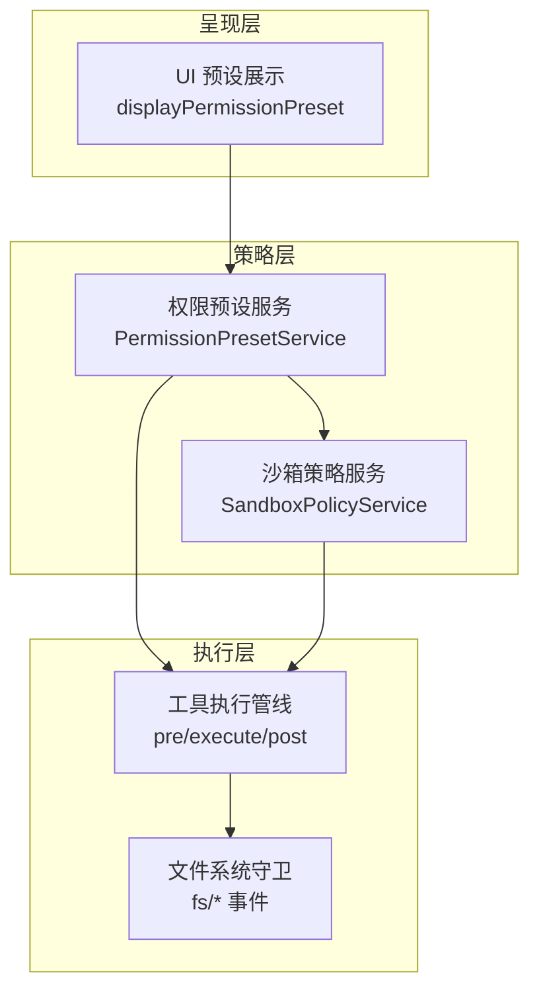
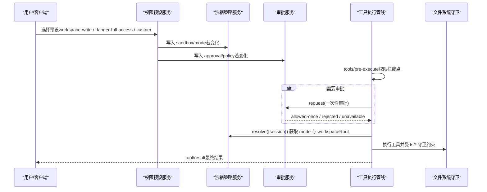
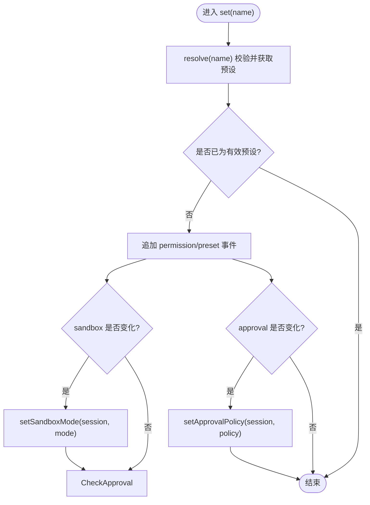
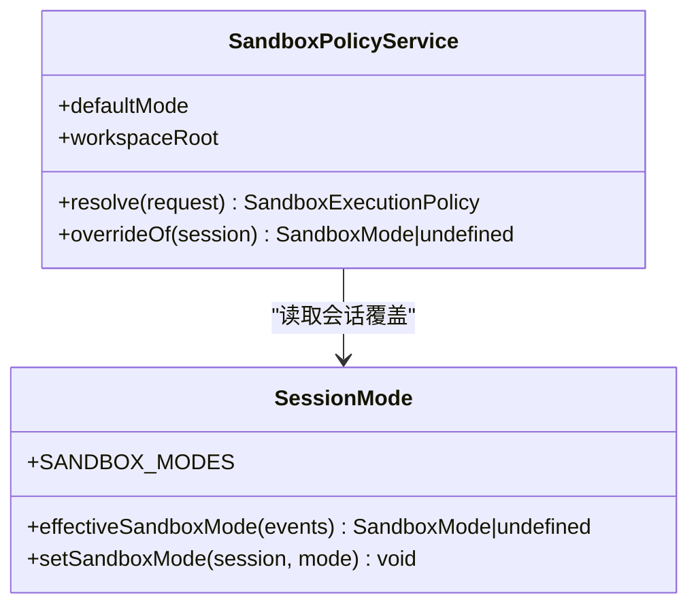
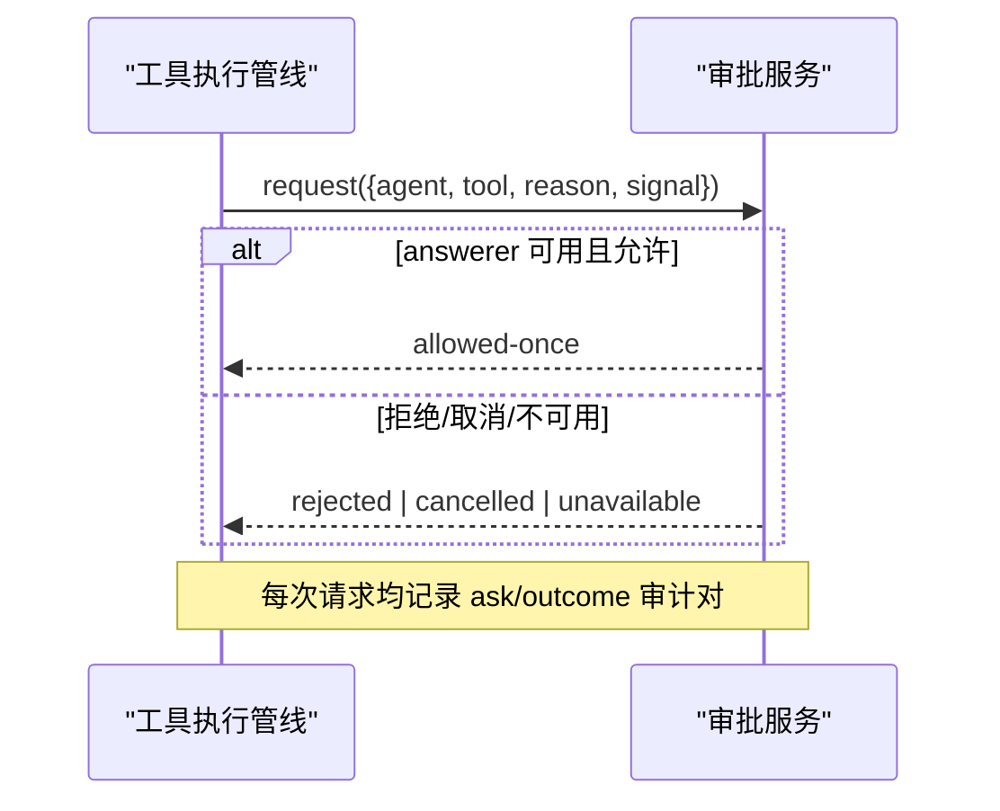
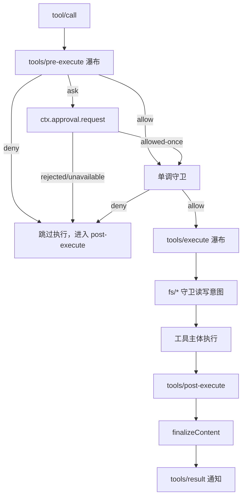
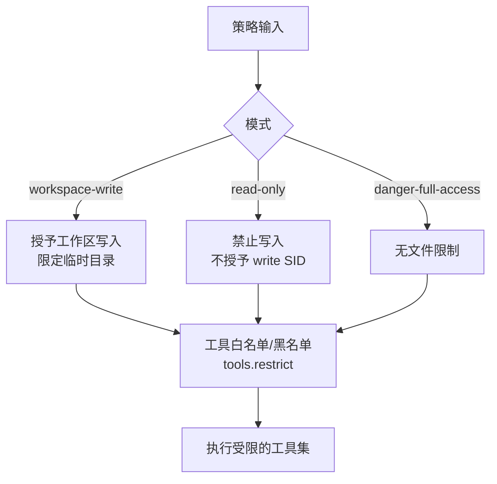
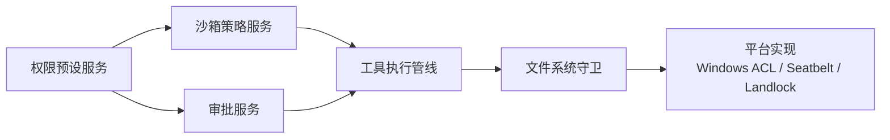

# 访问控制机制

<cite>
**本文引用的文件**
- [packages/interaction/permission-presets/src/index.ts](file://packages/interaction/permission-presets/src/index.ts)
- [docs/subsystems/permission-presets.md](file://docs/subsystems/permission-presets.md)
- [packages/sandbox/sandbox-policy/src/index.ts](file://packages/sandbox/sandbox-policy/src/index.ts)
- [packages/sandbox/sandbox-policy/src/session-mode.ts](file://packages/sandbox/sandbox-policy/src/session-mode.ts)
- [docs/tool-execution-pipeline.md](file://docs/tool-execution-pipeline.md)
- [packages/core/tools/tests/invariant.spec.ts](file://packages/core/tools/tests/invariant.spec.ts)
- [packages/core/tools/tests/code-mode.spec.ts](file://packages/core/tools/tests/code-mode.spec.ts)
- [packages/client/ui-permission-presets/src/client/presentation.ts](file://packages/client/ui-permission-presets/src/client/presentation.ts)
- [packages/sandbox/sandbox-windows-acl/src/acl.ts](file://packages/sandbox/sandbox-windows-acl/src/acl.ts)
- [packages/sandbox/sandbox-windows-acl/src/index.ts](file://packages/sandbox/sandbox-windows-acl/src/index.ts)
- [packages/sandbox/sandbox-local/tests/seatbelt.e2e.ts](file://packages/sandbox/sandbox-local/tests/seatbelt.e2e.ts)
- [packages/fs/fs-local/tests/win32.spec.ts](file://packages/fs/fs-local/tests/win32.spec.ts)
- [packages/sandbox/sandbox-windows-acl/tests/acl.spec.ts](file://packages/sandbox/sandbox-windows-acl/tests/acl.spec.ts)
- [packages/sandbox/sandbox-windows-acl/tests/runner.spec.ts](file://packages/sandbox/sandbox-windows-acl/tests/runner.spec.ts)
- [docs/subsystems/approval.md](file://docs/subsystems/approval.md)
</cite>

## 目录
1. [简介](#简介)
2. [项目结构](#项目结构)
3. [核心组件](#核心组件)
4. [架构总览](#架构总览)
5. [详细组件分析](#详细组件分析)
6. [依赖关系分析](#依赖关系分析)
7. [性能考虑](#性能考虑)
8. [故障排查指南](#故障排查指南)
9. [结论](#结论)
10. [附录](#附录)

## 简介
本文件系统性阐述该仓库中的访问控制机制，围绕基于角色的访问控制（RBAC）思想、动态权限检查、工具调用预执行管道与细粒度访问规则配置展开。重点覆盖：
- 角色与预设：通过“权限预设”将沙箱模式与审批策略组合为可切换的“角色式”选项。
- 动态授权：上下文感知的决策、条件评估与实时验证贯穿工具执行全链路。
- 预执行管道：在工具实际执行前进行拦截、决策与错误处理。
- 细粒度规则：路径级文件访问、命令级白名单与资源使用限制的配置与实践。
- 最佳实践：安全策略编写、调试方法与常见问题定位。

## 项目结构
访问控制相关能力分布在多个包中，形成“策略—执行—呈现”的分层：
- 策略层：sandbox-policy 提供沙箱模式与根目录的统一解析；permission-presets 将沙箱模式与审批策略打包为“预设”。
- 执行层：工具执行管线（pre-execute / execute / post-execute）串联审批、沙箱、文件系统守卫等。
- 呈现层：UI 侧对预设名称与展示进行适配，便于用户选择与理解。

**图表来源**
- [packages/interaction/permission-presets/src/index.ts:159-434](file://packages/interaction/permission-presets/src/index.ts#L159-L434)
- [packages/sandbox/sandbox-policy/src/index.ts:91-155](file://packages/sandbox/sandbox-policy/src/index.ts#L91-L155)
- [docs/tool-execution-pipeline.md:1-63](file://docs/tool-execution-pipeline.md#L1-L63)
- [packages/client/ui-permission-presets/src/client/presentation.ts:1-22](file://packages/client/ui-permission-presets/src/client/presentation.ts#L1-L22)

**章节来源**
- [packages/interaction/permission-presets/src/index.ts:159-434](file://packages/interaction/permission-presets/src/index.ts#L159-L434)
- [packages/sandbox/sandbox-policy/src/index.ts:91-155](file://packages/sandbox/sandbox-policy/src/index.ts#L91-L155)
- [docs/tool-execution-pipeline.md:1-63](file://docs/tool-execution-pipeline.md#L1-L63)
- [packages/client/ui-permission-presets/src/client/presentation.ts:1-22](file://packages/client/ui-permission-presets/src/client/presentation.ts#L1-L22)

## 核心组件
- 权限预设服务（PermissionPresetService）
  - 职责：维护预设表（沙箱模式 + 审批策略），提供当前预设推导、设置写入、会话初始化注入默认权限。
  - 关键行为：current/selectFor/resolve/set；session 创建时 pin 初始权限；变更时仅写差异的 knob。
- 沙箱策略服务（SandboxPolicyService）
  - 职责：统一解析部署默认模式、工作区根目录与每会话覆盖；向系统提示注入策略上下文。
  - 关键行为：resolve(request) 返回包含 mode/workspaceRoot/sessionId 的策略对象。
- 会话级沙箱模式（session-mode）
  - 职责：以 session 日志作为唯一状态源，提供 effectiveSandboxMode/setSandboxMode。
- 审批服务（ApprovalService）
  - 职责：按会话策略发起一次性审批请求，记录 ask/outcome 审计对，暴露 setPolicy/overrideOf。
- 工具执行管线
  - 职责：tools/pre-execute → 单调守卫 → tools/execute → fs 守卫 → tools/post-execute → finalizeContent → tools/result。
- UI 预设展示
  - 职责：将机器值映射为用户可读标签（如“Full access”）。

**章节来源**
- [packages/interaction/permission-presets/src/index.ts:159-434](file://packages/interaction/permission-presets/src/index.ts#L159-L434)
- [packages/sandbox/sandbox-policy/src/index.ts:91-155](file://packages/sandbox/sandbox-policy/src/index.ts#L91-L155)
- [packages/sandbox/sandbox-policy/src/session-mode.ts:1-72](file://packages/sandbox/sandbox-policy/src/session-mode.ts#L1-L72)
- [docs/subsystems/approval.md:100-140](file://docs/subsystems/approval.md#L100-L140)
- [docs/tool-execution-pipeline.md:1-63](file://docs/tool-execution-pipeline.md#L1-L63)
- [packages/client/ui-permission-presets/src/client/presentation.ts:1-22](file://packages/client/ui-permission-presets/src/client/presentation.ts#L1-L22)

## 架构总览
下图展示了从用户选择预设到工具执行的完整流程，包括策略解析、审批流与沙箱边界。

**图表来源**
- [packages/interaction/permission-presets/src/index.ts:375-434](file://packages/interaction/permission-presets/src/index.ts#L375-L434)
- [packages/sandbox/sandbox-policy/src/index.ts:126-155](file://packages/sandbox/sandbox-policy/src/index.ts#L126-L155)
- [docs/tool-execution-pipeline.md:1-63](file://docs/tool-execution-pipeline.md#L1-L63)
- [docs/subsystems/approval.md:100-140](file://docs/subsystems/approval.md#L100-L140)

## 详细组件分析

### 权限预设与“角色式”访问控制
- 预设表：每个预设绑定一组（沙箱模式, 审批策略），并提供可选的用户可见 name/description。
- 当前预设推导：优先保留用户上次选择（当仍匹配），否则按声明顺序匹配，否则返回 derived “custom”。
- 设置写入：set(session, name) 仅在值变化时写入对应 knob，并追加 log-only 的 permission/preset 事件。
- 会话初始化：pinInitialPermission 保证新会话具备默认权限事实，避免未定义状态。

**图表来源**
- [packages/interaction/permission-presets/src/index.ts:375-434](file://packages/interaction/permission-presets/src/index.ts#L375-L434)

**章节来源**
- [packages/interaction/permission-presets/src/index.ts:159-434](file://packages/interaction/permission-presets/src/index.ts#L159-L434)
- [docs/subsystems/permission-presets.md:1-132](file://docs/subsystems/permission-presets.md#L1-L132)

### 沙箱策略与会话模式
- 策略解析：resolve(request) 优先级为“显式覆盖 > 会话覆盖 > 部署默认”，同时计算 workspaceRoot。
- 会话模式：effectiveSandboxMode 从 session 事件日志倒序取最后一个 sandbox/mode；setSandboxMode 追加事件。
- 系统提示：将当前策略渲染为模型可见上下文，确保回放一致。

**图表来源**
- [packages/sandbox/sandbox-policy/src/index.ts:91-155](file://packages/sandbox/sandbox-policy/src/index.ts#L91-L155)
- [packages/sandbox/sandbox-policy/src/session-mode.ts:1-72](file://packages/sandbox/sandbox-policy/src/session-mode.ts#L1-L72)

**章节来源**
- [packages/sandbox/sandbox-policy/src/index.ts:91-155](file://packages/sandbox/sandbox-policy/src/index.ts#L91-L155)
- [packages/sandbox/sandbox-policy/src/session-mode.ts:1-72](file://packages/sandbox/sandbox-policy/src/session-mode.ts#L1-L72)

### 审批策略与一次性授权
- 策略切换：setPolicy(agent, policy) 将策略变更排队至下一模型步骤，保证可观测性。
- 一次性请求：request(req) 在打开的 turn 内发起，answerer 缺失或异常归一化为 unavailable（fail closed）。
- 审计对：每次 ask/outcome 成对记录，确保可回放与一致性。

**图表来源**
- [docs/subsystems/approval.md:100-140](file://docs/subsystems/approval.md#L100-L140)

**章节来源**
- [docs/subsystems/approval.md:100-140](file://docs/subsystems/approval.md#L100-L140)

### 工具调用的预执行管道（pre-execute pipeline）
- 阶段顺序：tools/pre-execute → 单调守卫 → tools/execute → fs 守卫 → tools/post-execute → finalizeContent → tools/result。
- 权限拦截点：pre-execute 用于权限、沙箱、钩子；throw 会短路后续阶段并产出 isError 结果。
- 幂等与冻结：测试用例表明结果对象会被冻结，重复/乱序阶段会被拒绝。

**图表来源**
- [docs/tool-execution-pipeline.md:1-63](file://docs/tool-execution-pipeline.md#L1-L63)
- [packages/core/tools/tests/invariant.spec.ts:40-70](file://packages/core/tools/tests/invariant.spec.ts#L40-L70)
- [packages/core/tools/tests/code-mode.spec.ts:970-999](file://packages/core/tools/tests/code-mode.spec.ts#L970-L999)

**章节来源**
- [docs/tool-execution-pipeline.md:1-63](file://docs/tool-execution-pipeline.md#L1-L63)
- [packages/core/tools/tests/invariant.spec.ts:40-70](file://packages/core/tools/tests/invariant.spec.ts#L40-L70)
- [packages/core/tools/tests/code-mode.spec.ts:970-999](file://packages/core/tools/tests/code-mode.spec.ts#L970-L999)

### 细粒度访问规则与平台实现
- 路径级文件访问控制
  - Windows ACL：授予 capability SID 的 GRANT_MASK（Write+Delete，不含 WRITE_DAC/WRITE_OWNER），防止越权修改 DACL。
  - 只读/工作区写入：read-only 不接受 temp/write SID；workspace-write 要求显式临时目录或 null。
  - 硬链接边界：工作区硬链接可能将授予传播到外部目标，需在设计上接受此特性。
- 命令级执行白名单与资源限制
  - 通过 tools.restrict 的 allow/deny 列表对工具集合进行交集过滤，并在注册期编译过滤值。
  - 结合沙箱模式限制命令执行范围（例如 read-only 禁止写操作）。
- 资源使用限制
  - 通过审批策略与沙箱模式组合，限制网络/进程/文件系统的访问面；超时、重试、指标收集在 execute 瀑布中完成。

**图表来源**
- [packages/sandbox/sandbox-windows-acl/src/acl.ts:215-244](file://packages/sandbox/sandbox-windows-acl/src/acl.ts#L215-L244)
- [packages/sandbox/sandbox-windows-acl/src/index.ts:180-251](file://packages/sandbox/sandbox-windows-acl/src/index.ts#L180-L251)
- [packages/sandbox/sandbox-local/tests/seatbelt.e2e.ts:98-112](file://packages/sandbox/sandbox-local/tests/seatbelt.e2e.ts#L98-L112)
- [packages/fs/fs-local/tests/win32.spec.ts:92-123](file://packages/fs/fs-local/tests/win32.spec.ts#L92-L123)
- [packages/sandbox/sandbox-windows-acl/tests/runner.spec.ts:414-435](file://packages/sandbox/sandbox-windows-acl/tests/runner.spec.ts#L414-L435)

**章节来源**
- [packages/sandbox/sandbox-windows-acl/src/acl.ts:215-244](file://packages/sandbox/sandbox-windows-acl/src/acl.ts#L215-L244)
- [packages/sandbox/sandbox-windows-acl/src/index.ts:180-251](file://packages/sandbox/sandbox-windows-acl/src/index.ts#L180-L251)
- [packages/sandbox/sandbox-local/tests/seatbelt.e2e.ts:98-112](file://packages/sandbox/sandbox-local/tests/seatbelt.e2e.ts#L98-L112)
- [packages/fs/fs-local/tests/win32.spec.ts:92-123](file://packages/fs/fs-local/tests/win32.spec.ts#L92-L123)
- [packages/sandbox/sandbox-windows-acl/tests/runner.spec.ts:414-435](file://packages/sandbox/sandbox-windows-acl/tests/runner.spec.ts#L414-L435)

### 配置示例与最佳实践
- 预设配置
  - 预设表：至少包含 workspace-write（工作区写入 + 询问）与 danger-full-access（完全访问 + 从不询问）。
  - 默认预设：为新会话指定默认预设；若推导无法匹配则必须显式配置 defaultPreset。
- 策略编写建议
  - 最小权限原则：默认 read-only，按需提升为 workspace-write，谨慎使用 danger-full-access。
  - 审批策略：默认 ask，仅在可信环境使用 never。
  - 工具白名单：通过 restrict 精确列出允许的工具名，避免宽泛放行。
- 调试方法
  - 观察 session 事件：permission/preset、sandbox/mode、approval/policy 的顺序与内容。
  - 检查 pre-execute 抛错：若抛出异常，工具体不会执行，post-execute 也不会触发，结果标记为 isError。
  - 平台差异：Windows ACL 授予不包含 WRITE_DAC/WRITE_OWNER；硬链接可能导致外部目标被间接授予。

**章节来源**
- [packages/interaction/permission-presets/src/index.ts:159-226](file://packages/interaction/permission-presets/src/index.ts#L159-L226)
- [packages/core/tools/tests/code-mode.spec.ts:970-999](file://packages/core/tools/tests/code-mode.spec.ts#L970-L999)
- [packages/sandbox/sandbox-windows-acl/tests/acl.spec.ts:300-318](file://packages/sandbox/sandbox-windows-acl/tests/acl.spec.ts#L300-L318)

## 依赖关系分析
- 松耦合：策略与服务解耦，执行管线通过 ctx 注入与事件消费协作。
- 单一事实源：会话日志作为模式与审批的唯一状态载体，支持回放与重启恢复。
- 外部依赖：平台特定实现（Windows ACL、Seatbelt/Landlock）由沙箱提供者承担，策略层保持抽象。

**图表来源**
- [packages/interaction/permission-presets/src/index.ts:159-434](file://packages/interaction/permission-presets/src/index.ts#L159-L434)
- [packages/sandbox/sandbox-policy/src/index.ts:91-155](file://packages/sandbox/sandbox-policy/src/index.ts#L91-L155)
- [docs/tool-execution-pipeline.md:1-63](file://docs/tool-execution-pipeline.md#L1-L63)

**章节来源**
- [packages/interaction/permission-presets/src/index.ts:159-434](file://packages/interaction/permission-presets/src/index.ts#L159-L434)
- [packages/sandbox/sandbox-policy/src/index.ts:91-155](file://packages/sandbox/sandbox-policy/src/index.ts#L91-L155)
- [docs/tool-execution-pipeline.md:1-63](file://docs/tool-execution-pipeline.md#L1-L63)

## 性能考虑
- 策略解析开销低：resolve 仅读取会话 cwd 与最后一条模式事件，时间复杂度 O(1)。
- 预设切换幂等：仅在值变化时写入事件，避免冗余 I/O。
- 平台 ACL 优化：grantWrite 在已有精确 ACE 时跳过重应用，减少大工作区上的继承开销。
- 审批批处理：审批为一次性请求，避免频繁交互；UI 侧缓存 PendingWait 身份，减少重复路由。

[本节为通用指导，无需具体文件引用]

## 故障排查指南
- 预设无效或未生效
  - 检查是否存在未知 preset 名称；确认 defaultPreset 不为 derived “custom”。
  - 查看 session 事件：permission/preset、sandbox/mode、approval/policy 是否按预期追加。
- 工具执行被拒绝
  - 检查 pre-execute 是否抛出异常；若抛出，后续阶段不会执行，结果标记为 isError。
  - 检查审批回答器是否可用；不可用时归一化为 unavailable（fail closed）。
- 平台权限问题
  - Windows：确认未授予 WRITE_DAC/WRITE_OWNER；检查硬链接场景下的间接授予。
  - 临时目录：workspace-write 必须提供有效的私有临时目录或 null；read-only 不接受 temp 目录。

**章节来源**
- [packages/interaction/permission-presets/src/index.ts:185-226](file://packages/interaction/permission-presets/src/index.ts#L185-L226)
- [packages/core/tools/tests/code-mode.spec.ts:970-999](file://packages/core/tools/tests/code-mode.spec.ts#L970-L999)
- [packages/sandbox/sandbox-windows-acl/tests/acl.spec.ts:300-318](file://packages/sandbox/sandbox-windows-acl/tests/acl.spec.ts#L300-L318)
- [packages/sandbox/sandbox-windows-acl/src/index.ts:180-251](file://packages/sandbox/sandbox-windows-acl/src/index.ts#L180-L251)

## 结论
该访问控制机制以“预设”为角色入口，将沙箱模式与审批策略组合为可切换的安全策略；通过会话日志驱动的策略解析与审批审计，实现上下文感知、可回放、可审计的动态授权。工具执行管线在 pre-execute 处集中拦截，结合平台级文件系统守卫，形成端到端的细粒度访问控制。遵循最小权限原则、明确默认策略与严格白名单，可在保障安全的同时提升可用性。

## 附录
- 术语
  - 预设：沙箱模式与审批策略的组合项，供用户选择。
  - 模式：read-only / workspace-write / danger-full-access。
  - 审批策略：ask / never 等，控制是否需要一次性授权。
- 参考
  - 权限预设文档：[docs/subsystems/permission-presets.md](file://docs/subsystems/permission-presets.md)
  - 工具执行管线文档：[docs/tool-execution-pipeline.md](file://docs/tool-execution-pipeline.md)
  - 审批子系统文档：[docs/subsystems/approval.md](file://docs/subsystems/approval.md)