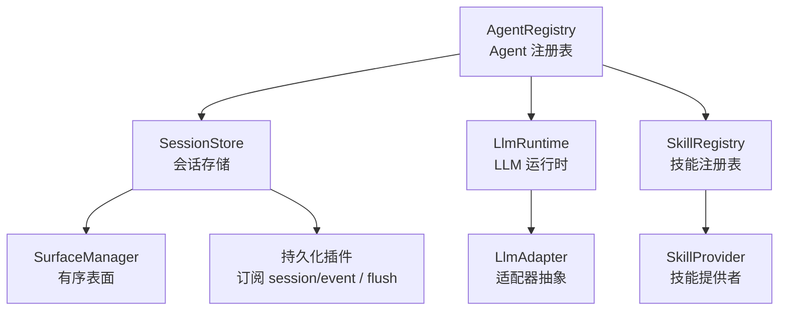
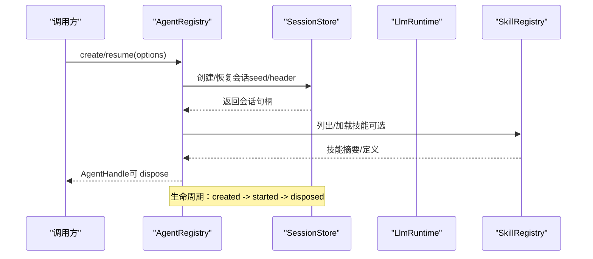
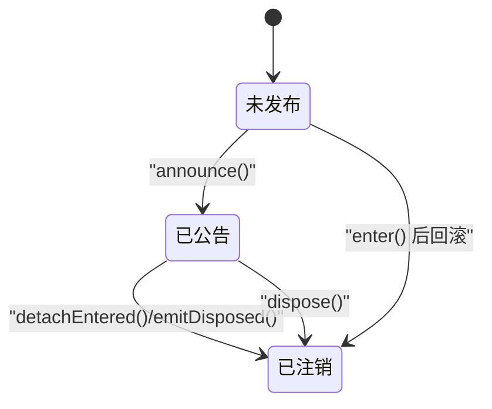
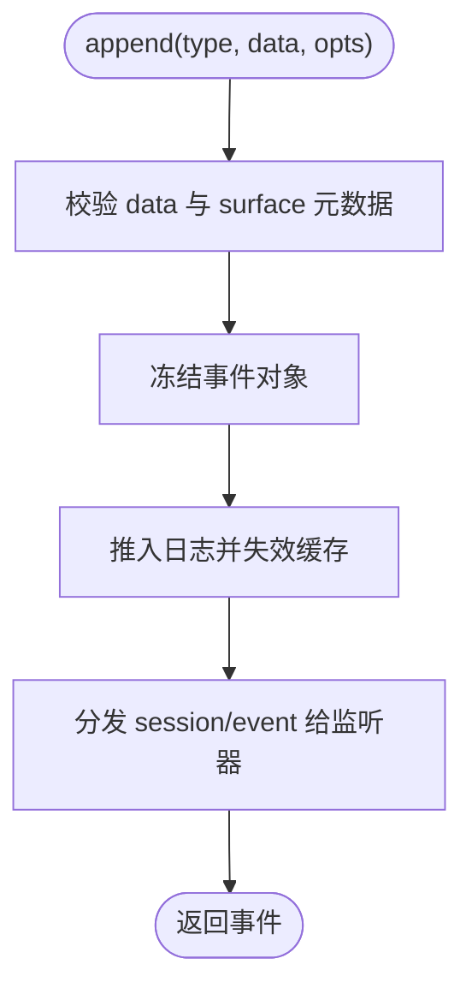
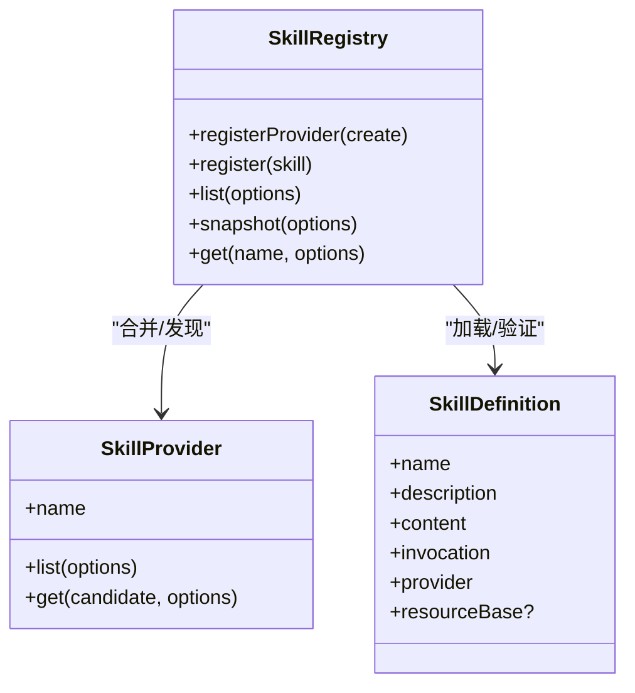
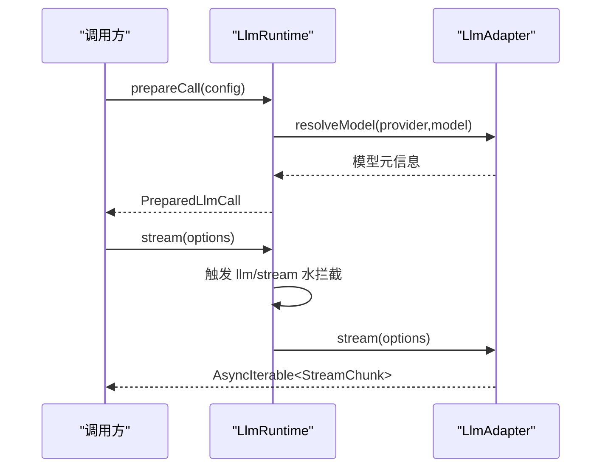
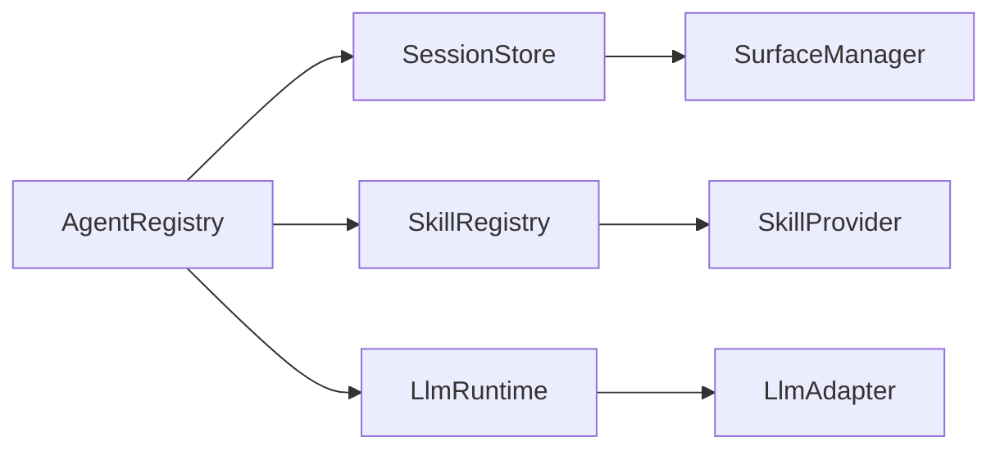

# 核心模块

<cite>
**本文引用的文件**
- [packages/core/agent/src/index.ts](file://packages/core/agent/src/index.ts)
- [packages/core/session/src/index.ts](file://packages/core/session/src/index.ts)
- [packages/llm/llm/src/index.ts](file://packages/llm/llm/src/index.ts)
- [packages/skill/skill/src/index.ts](file://packages/skill/skill/src/index.ts)
</cite>

## 目录
1. [简介](#简介)
2. [项目结构](#项目结构)
3. [核心组件](#核心组件)
4. [架构总览](#架构总览)
5. [详细组件分析](#详细组件分析)
6. [依赖关系分析](#依赖关系分析)
7. [性能考量](#性能考量)
8. [故障排查指南](#故障排查指南)
9. [结论](#结论)
10. [附录：API 参考与配置](#附录api-参考与配置)

## 简介
本文件面向 DeepSeek Harness 的核心模块，聚焦以下目标：
- Agent 核心模块的生命周期管理、状态机与消息处理管道
- 会话管理的事件日志系统、持久化存储与查询投影
- 工具系统的类型安全定义、执行环境与权限控制机制
- LLM 适配器的接口规范、流式响应处理与多模型支持
- 各模块的 API 参考、配置选项与使用示例
- 模块间集成模式与最佳实践

## 项目结构
DeepSeek Harness 采用插件化与服务化架构，核心能力分布在 packages 下：
- core/agent：Agent 注册表、创建/恢复流程、发起者上下文与作用域
- core/session：事件溯源会话、追加日志、表面投影与派生消息
- llm/llm：LLM 运行时、适配器注册、流式调用与水拦截器
- skill/skill：技能提供者注册、分层合并、加载与渲染

图表来源
- [packages/core/agent/src/index.ts:256-707](file://packages/core/agent/src/index.ts#L256-L707)
- [packages/core/session/src/index.ts:425-758](file://packages/core/session/src/index.ts#L425-L758)
- [packages/llm/llm/src/index.ts:284-800](file://packages/llm/llm/src/index.ts#L284-L800)
- [packages/skill/skill/src/index.ts:357-661](file://packages/skill/skill/src/index.ts#L357-L661)

章节来源
- [packages/core/agent/src/index.ts:256-707](file://packages/core/agent/src/index.ts#L256-L707)
- [packages/core/session/src/index.ts:425-758](file://packages/core/session/src/index.ts#L425-L758)
- [packages/llm/llm/src/index.ts:284-800](file://packages/llm/llm/src/index.ts#L284-L800)
- [packages/skill/skill/src/index.ts:357-661](file://packages/skill/skill/src/index.ts#L357-L661)

## 核心组件
- Agent 注册表（AgentRegistry）：负责 Agent 的创建、恢复、注册、公告与销毁；维护进程内发起者上下文与作用域链。
- 会话服务（Session/SessionStore）：事件溯源的不可变日志、有序表面投影、派生 LLM 消息历史；通过事件总线暴露 session/event 与 session/flush。
- LLM 运行时（LlmRuntime/LlmAdapter）：适配器注册、模型发现、重试策略、准备调用与流式输出；提供 llm/stream 水拦截器。
- 技能注册表（SkillRegistry/SkillProvider）：分层合并技能目录、按优先级选择、按需加载并渲染为模型可见内容。

章节来源
- [packages/core/agent/src/index.ts:256-707](file://packages/core/agent/src/index.ts#L256-L707)
- [packages/core/session/src/index.ts:425-758](file://packages/core/session/src/index.ts#L425-L758)
- [packages/llm/llm/src/index.ts:180-800](file://packages/llm/llm/src/index.ts#L180-L800)
- [packages/skill/skill/src/index.ts:357-661](file://packages/skill/skill/src/index.ts#L357-L661)

## 架构总览
下图展示 Agent 驱动循环中，Agent 与 Session、LLM、Skill 的交互关系。

图表来源
- [packages/core/agent/src/index.ts:405-430](file://packages/core/agent/src/index.ts#L405-L430)
- [packages/core/session/src/index.ts:482-548](file://packages/core/session/src/index.ts#L482-L548)
- [packages/skill/skill/src/index.ts:471-518](file://packages/skill/skill/src/index.ts#L471-L518)

## 详细组件分析

### Agent 核心模块：生命周期、状态机与消息处理
- 生命周期
  - create：通过工厂创建 Agent 与 Session，完成 setup 与提交，发布 agent/created、session/created、agent/session-start，然后启动循环。
  - resume：先加载持久化会话，再执行 setup 并提交，遵循相同发布顺序。
  - register/announce：将已构造的 Agent 插入注册表并发布；dispose 时发出 agent/disposed。
- 状态机
  - AgentEntry：id、agent、owner、carrier、announced、announcing、detachRequested。
  - InitiatorRun：active、parent，用于跟踪发起者边界。
- 消息处理
  - withInitiator/withoutInitiator：建立或清除进程内发起者作用域，用于因果归属与审计。
  - currentInitiator/requireInitiator：读取当前发起者或强制要求存在。
- 错误与回滚
  - 在 announce 同步阶段抛出会回滚发布；异步监听拒绝被捕获并记录。

图表来源
- [packages/core/agent/src/index.ts:474-576](file://packages/core/agent/src/index.ts#L474-L576)
- [packages/core/agent/src/index.ts:619-703](file://packages/core/agent/src/index.ts#L619-L703)

章节来源
- [packages/core/agent/src/index.ts:256-707](file://packages/core/agent/src/index.ts#L256-L707)

### 会话管理：事件日志、持久化与查询投影
- 事件溯源
  - append：校验数据 JSON 可序列化、表面元数据、请求头兼容性，冻结写入，通知观察者。
  - events：返回不可变快照；seq 始终等于 log.length。
- 有序表面与派生消息
  - SurfaceManager：维护消息产生事件的有序序列，支持替换与折叠。
  - deriveMessages：基于 surface.nodes 生成 LLM 消息历史，缓存增量更新。
- 持久化
  - 通过 session/event 与 session/flush 事件由插件实现落盘；不在此层耦合具体存储。
- 恢复与种子
  - fromRestore/create：严格校验事件信封、序列连续性、头部版本与字段。

图表来源
- [packages/core/session/src/index.ts:604-655](file://packages/core/session/src/index.ts#L604-L655)

章节来源
- [packages/core/session/src/index.ts:96-379](file://packages/core/session/src/index.ts#L96-L379)
- [packages/core/session/src/index.ts:425-758](file://packages/core/session/src/index.ts#L425-L758)

### 工具系统：类型安全、执行环境与权限控制
- 类型安全
  - SkillDefinition/SkillCandidate/SkillRegistration：强类型描述技能元数据、候选与注册项。
  - 名称语法校验、描述必填、invocation 布尔策略等。
- 执行环境
  - SkillProvider.list/get：异步发现与按需加载；支持 cwd 工作区与 AbortSignal 取消。
  - renderSkillContent：将技能渲染为模型可见的指令块，资源基址提示。
- 权限控制
  - SkillInvocationPolicy：modelInvocable/userInvocable 控制模型与用户侧是否可调用。
  - 分层合并：全局层与范围层叠加，最近层覆盖同名条目；层内按 rank 排序。
- 缓存与失效
  - collectCache：按 cwd + scopeChain + revision 缓存；变更时递增 revision 并清空缓存。

图表来源
- [packages/skill/skill/src/index.ts:357-661](file://packages/skill/skill/src/index.ts#L357-L661)
- [packages/skill/skill/src/index.ts:85-101](file://packages/skill/skill/src/index.ts#L85-L101)
- [packages/skill/skill/src/index.ts:247-268](file://packages/skill/skill/src/index.ts#L247-L268)

章节来源
- [packages/skill/skill/src/index.ts:20-229](file://packages/skill/skill/src/index.ts#L20-L229)
- [packages/skill/skill/src/index.ts:357-661](file://packages/skill/skill/src/index.ts#L357-L661)

### LLM 适配器：接口规范、流式响应与多模型支持
- 适配器抽象
  - LlmAdapter：providerInfo、listModels、resolveModel、stream（必需）。
- 运行时
  - LlmRuntime：registerAdapter/registerConfigurableProviders、discoverModels、prepareCall、resolveCallConfig。
  - PreparedLlmCall：冻结配置、重试策略、上下文、adapterDefaults 与 stream 入口。
- 流式与水拦截
  - llm/stream 事件：所有流式调用可被拦截，支持重试、回放、路由。
- 多模型与能力
  - resolveModelInfo：校验 provider/model 元数据、上下文窗口、默认 maxTokens、推理努力等。
  - listModels：去重与校验模型目录。

图表来源
- [packages/llm/llm/src/index.ts:180-233](file://packages/llm/llm/src/index.ts#L180-L233)
- [packages/llm/llm/src/index.ts:284-800](file://packages/llm/llm/src/index.ts#L284-L800)

章节来源
- [packages/llm/llm/src/index.ts:180-800](file://packages/llm/llm/src/index.ts#L180-L800)

## 依赖关系分析
- AgentRegistry 依赖 SessionStore（创建/恢复会话）、SkillRegistry（可选技能注入）、LlmRuntime（驱动循环中的模型调用）。
- SessionStore 依赖 SurfaceManager 进行有序表面投影，并通过事件总线暴露 session/event、session/flush。
- LlmRuntime 依赖 LlmAdapter 实现具体提供商；通过水拦截器扩展重试/回放/路由。
- SkillRegistry 依赖 SkillProvider 实现不同来源的技能发现与加载。

图表来源
- [packages/core/agent/src/index.ts:256-707](file://packages/core/agent/src/index.ts#L256-L707)
- [packages/core/session/src/index.ts:425-758](file://packages/core/session/src/index.ts#L425-L758)
- [packages/llm/llm/src/index.ts:284-800](file://packages/llm/llm/src/index.ts#L284-L800)
- [packages/skill/skill/src/index.ts:357-661](file://packages/skill/skill/src/index.ts#L357-L661)

章节来源
- [packages/core/agent/src/index.ts:256-707](file://packages/core/agent/src/index.ts#L256-L707)
- [packages/core/session/src/index.ts:425-758](file://packages/core/session/src/index.ts#L425-L758)
- [packages/llm/llm/src/index.ts:284-800](file://packages/llm/llm/src/index.ts#L284-L800)
- [packages/skill/skill/src/index.ts:357-661](file://packages/skill/skill/src/index.ts#L357-L661)

## 性能考量
- 会话日志
  - append 路径避免 I/O 阻塞，仅内存追加；持久化通过事件异步落盘。
  - deriveMessages 增量缓存，仅在 surface 节点变化时重建。
- 技能目录
  - collectCache 按维度缓存，减少重复发现成本；变更时统一失效。
- LLM 调用
  - prepareCall 冻结配置与上下文，避免后续修改；retryPolicy 在注册时捕获，减少重复计算。
  - llm/stream 水拦截允许短路或缓存中间结果。

[本节为通用指导，无需特定文件引用]

## 故障排查指南
- Agent 相关
  - 无工厂：create/resume 前需注册工厂；否则抛出“no agent factory registered”。
  - 重复注册：同一 id 的 Agent 不能重复进入注册表。
  - 发起者作用域：关闭/销毁期间禁止新建发起者边界。
- 会话相关
  - 种子事件：必须从 seq=0 连续；不支持的请求头格式会被拒绝。
  - 非 JSON 可序列化数据：append 会直接失败。
  - 监听器异常：session/event 与 session/disposed 监听器抛错会被记录但不影响主流程。
- LLM 相关
  - 适配器冲突：重复 provider 注册会失败。
  - 模型元数据非法：resolveModelInfo/listModels 对返回数据进行严格校验。
  - API Key 无效：断言为空或包含不可携带字符时会给出明确诊断。
- 技能相关
  - 名称非法或描述缺失：注册/加载时校验失败。
  - 并发变更：catalog 变更导致缓存失效，消费者应重试。

章节来源
- [packages/core/agent/src/index.ts:216-220](file://packages/core/agent/src/index.ts#L216-L220)
- [packages/core/agent/src/index.ts:474-576](file://packages/core/agent/src/index.ts#L474-L576)
- [packages/core/session/src/index.ts:212-372](file://packages/core/session/src/index.ts#L212-L372)
- [packages/core/session/src/index.ts:604-655](file://packages/core/session/src/index.ts#L604-L655)
- [packages/llm/llm/src/index.ts:137-152](file://packages/llm/llm/src/index.ts#L137-L152)
- [packages/llm/llm/src/index.ts:338-413](file://packages/llm/llm/src/index.ts#L338-L413)
- [packages/llm/llm/src/index.ts:581-718](file://packages/llm/llm/src/index.ts#L581-L718)
- [packages/skill/skill/src/index.ts:708-768](file://packages/skill/skill/src/index.ts#L708-L768)

## 结论
DeepSeek Harness 的核心模块以事件溯源、作用域与插件化为基础，提供了高内聚、低耦合的 Agent 生命周期管理、会话日志与投影、技能目录与 LLM 适配器体系。通过严格的类型校验、不可变数据与可扩展的水拦截器，系统在可靠性、可观测性与可演进性方面具备良好基础。建议在生产环境中结合持久化插件、监控与限流策略，充分利用其流式与投影能力。

[本节为总结性内容，无需特定文件引用]

## 附录：API 参考与配置

### AgentRegistry（Agent 注册表）
- 关键方法
  - create(options): Promise<AgentHandle>
  - resume(options): Promise<AgentHandle>
  - register(agent): () => void
  - enter(agent, owner): () => void
  - announce(agent): void
  - get(id): Agent | undefined
  - roots(): Agent[]
  - withInitiator(agent, operation): T
  - withoutInitiator(operation): T
- 配置与事件
  - 通过 setFactory 注册工厂（由 loop 插件提供）
  - 事件：agent/created、agent/disposed（通过内部事件分发）
- 使用示例（路径）
  - 创建 Agent：[packages/core/agent/src/index.ts:405-415](file://packages/core/agent/src/index.ts#L405-L415)
  - 恢复 Agent：[packages/core/agent/src/index.ts:424-430](file://packages/core/agent/src/index.ts#L424-L430)
  - 注册与公告：[packages/core/agent/src/index.ts:450-576](file://packages/core/agent/src/index.ts#L450-L576)

章节来源
- [packages/core/agent/src/index.ts:256-707](file://packages/core/agent/src/index.ts#L256-L707)

### SessionStore（会话存储）
- 关键方法
  - Session.create(id, seed?, header?): Session
  - Session.fromRestore(id, seed, header): Session
  - session.append(type, data, opts?): SessionEvent
  - session.events: readonly SessionEvent[]
  - session.seq: number
  - session.requestHeader(): EpochHeader | undefined
  - session.requestContext(): RequestContext | undefined
  - session.deriveMessages(): Message[]
- 事件
  - session/created、session/disposed、session/event、session/flush
- 使用示例（路径）
  - 创建/恢复会话：[packages/core/session/src/index.ts:482-548](file://packages/core/session/src/index.ts#L482-L548)
  - 追加事件：[packages/core/session/src/index.ts:604-655](file://packages/core/session/src/index.ts#L604-L655)
  - 派生消息：[packages/core/session/src/index.ts:726-747](file://packages/core/session/src/index.ts#L726-L747)

章节来源
- [packages/core/session/src/index.ts:96-379](file://packages/core/session/src/index.ts#L96-L379)
- [packages/core/session/src/index.ts:425-758](file://packages/core/session/src/index.ts#L425-L758)

### LlmRuntime（LLM 运行时）
- 关键方法
  - registerAdapter(providers, adapter): AdapterRegistrationHandle
  - registerConfigurableProviders(entries): DirectoryRegistrationHandle
  - discoverModels(settingsNs, request): Promise<LlmDiscoveredModel[]>
  - listProviders(): LlmProviderInfo[]
  - listModels(provider): Promise<LlmModelInfo[]>
  - resolveModelInfo(provider, model, signal?): Promise<LlmResolvedModelInfo>
  - resolveCallConfig(config, signal?): Promise<LlmCallConfig>
  - prepareCall(config, signal?): Promise<PreparedLlmCall>
- 事件
  - llm/stream（水拦截器）
- 使用示例（路径）
  - 注册适配器：[packages/llm/llm/src/index.ts:338-413](file://packages/llm/llm/src/index.ts#L338-L413)
  - 发现模型：[packages/llm/llm/src/index.ts:504-559](file://packages/llm/llm/src/index.ts#L504-L559)
  - 准备调用与流式：[packages/llm/llm/src/index.ts:779-800](file://packages/llm/llm/src/index.ts#L779-L800)

章节来源
- [packages/llm/llm/src/index.ts:180-800](file://packages/llm/llm/src/index.ts#L180-L800)

### SkillRegistry（技能注册表）
- 关键方法
  - registerProvider(create): () => void
  - register(skill): () => void
  - list(options): Promise<SkillSummary[]>
  - snapshot(options): Promise<SkillCatalogSnapshot>
  - get(name, options): Promise<SkillDefinition | undefined>
- 配置
  - Config.collectCacheMaxEntries：缓存条目上限
- 使用示例（路径）
  - 注册提供者：[packages/skill/skill/src/index.ts:391-429](file://packages/skill/skill/src/index.ts#L391-L429)
  - 列出/快照：[packages/skill/skill/src/index.ts:471-490](file://packages/skill/skill/src/index.ts#L471-L490)
  - 加载技能：[packages/skill/skill/src/index.ts:501-518](file://packages/skill/skill/src/index.ts#L501-L518)

章节来源
- [packages/skill/skill/src/index.ts:20-229](file://packages/skill/skill/src/index.ts#L20-L229)
- [packages/skill/skill/src/index.ts:357-661](file://packages/skill/skill/src/index.ts#L357-L661)