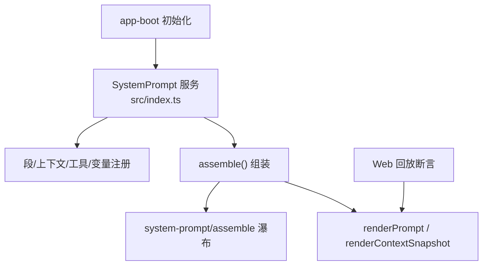
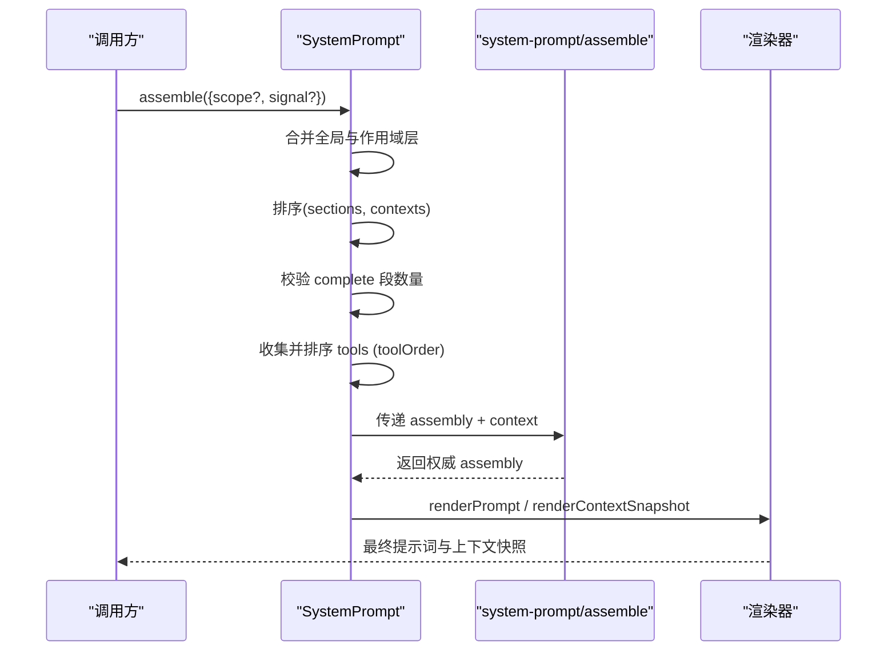
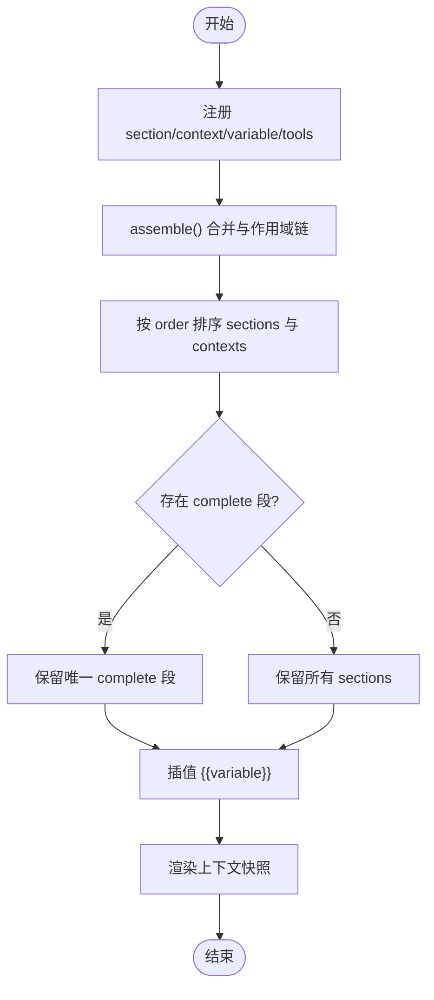
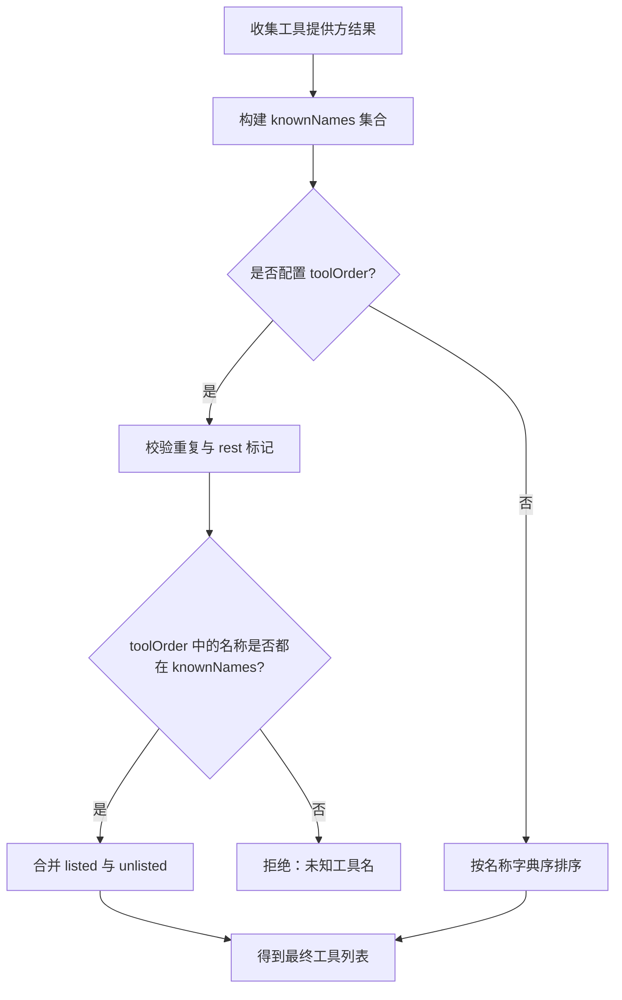
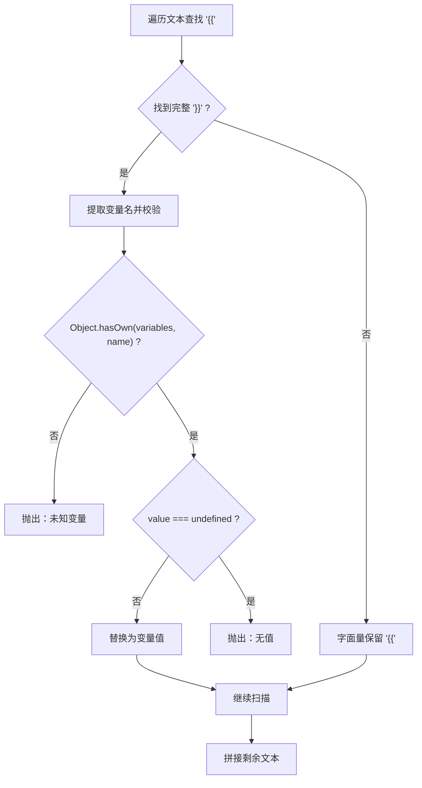
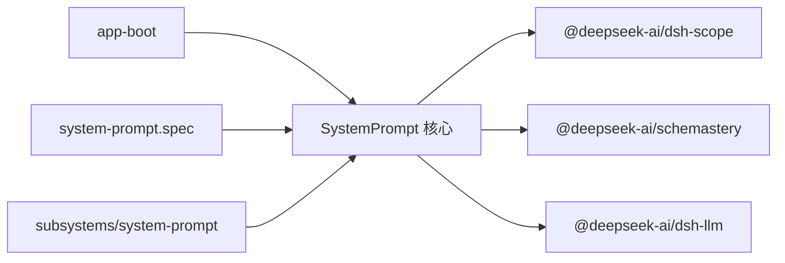

# 系统提示词

<cite>
**本文引用的文件**
- [packages/core/system-prompt/src/index.ts](file://packages/core/system-prompt/src/index.ts)
- [packages/core/system-prompt/README.md](file://packages/core/system-prompt/README.md)
- [packages/core/system-prompt/README.zh.md](file://packages/core/system-prompt/README.zh.md)
- [docs/subsystems/system-prompt.md](file://docs/subsystems/system-prompt.md)
- [docs/subsystems/system-prompt.zh.md](file://docs/subsystems/system-prompt.zh.md)
- [packages/core/system-prompt/tests/system-prompt.spec.ts](file://packages/core/system-prompt/tests/system-prompt.spec.ts)
- [packages/boot/app-boot/src/index.ts](file://packages/boot/app-boot/src/index.ts)
- [examples/headless-agent/tests/harness.ts](file://examples/headless-agent/tests/harness.ts)
- [apps/web/tests/replay-round-trip.e2e.ts](file://apps/web/tests/replay-round-trip.e2e.ts)
- [scripts/translation-prompt.ts](file://scripts/translation-prompt.ts)
</cite>

## 目录
1. [简介](#简介)
2. [项目结构](#项目结构)
3. [核心组件](#核心组件)
4. [架构总览](#架构总览)
5. [详细组件分析](#详细组件分析)
6. [依赖关系分析](#依赖关系分析)
7. [性能与缓存](#性能与缓存)
8. [故障排查](#故障排查)
9. [结论](#结论)
10. [附录：配置示例与调试方法](#附录：配置示例与调试方法)

## 简介
本模块负责在每次模型调用前，将“系统提示词”的静态段落、动态上下文、工具描述与变量进行统一组装与渲染。它提供：
- 有序段注册（section）与排序拼接
- 动态上下文（context）贡献与快照渲染
- 工具 schema 收集与可配置顺序
- 严格变量插值（{{name}}）
- 作用域覆盖（全局与 agent 级）
- 协作式装配瀑布（waterfall）扩展点
- 完整提示词模式（complete 段）

该机制使不同插件可以安全地贡献提示词片段、运行时上下文和工具能力，同时保证最终交付给模型的输入是确定且可审计的。

**章节来源**
- [packages/core/system-prompt/src/index.ts:1-120](file://packages/core/system-prompt/src/index.ts#L1-L120)
- [packages/core/system-prompt/README.zh.md:1-48](file://packages/core/system-prompt/README.zh.md#L1-L48)

## 项目结构
- 核心实现位于 packages/core/system-prompt/src/index.ts，暴露 SystemPrompt 服务与渲染函数。
- 文档定义子系统类型与事件契约于 docs/subsystems/system-prompt.*。
- README 说明配置项、API、模型体验与限制。
- 测试用例覆盖注册、排序、变量插值、complete 段、工具顺序等关键行为。
- 启动流程通过 app-boot 注入默认 persona，并在 Web 回放中校验系统提示词一致性。

**图表来源**
- [packages/core/system-prompt/src/index.ts:337-546](file://packages/core/system-prompt/src/index.ts#L337-L546)
- [packages/boot/app-boot/src/index.ts:813-817](file://packages/boot/app-boot/src/index.ts#L813-L817)
- [apps/web/tests/replay-round-trip.e2e.ts:28-87](file://apps/web/tests/replay-round-trip.e2e.ts#L28-L87)

**章节来源**
- [packages/core/system-prompt/src/index.ts:337-546](file://packages/core/system-prompt/src/index.ts#L337-L546)
- [packages/boot/app-boot/src/index.ts:813-817](file://packages/boot/app-boot/src/index.ts#L813-L817)
- [apps/web/tests/replay-round-trip.e2e.ts:28-87](file://apps/web/tests/replay-round-trip.e2e.ts#L28-L87)

## 核心组件
- SystemPrompt：注册表与服务，管理段、上下文、工具 schema、变量与作用域层。
- PromptSection/PromptContext：提示词段与动态上下文的注册契约。
- ToolProviderResult：工具提供方结果，包含可见 schema 与已知名称全集。
- AssembleContext：一次 assemble 的上下文，支持 scope 与 signal。
- PromptAssembly：一次组装的结果，包含 sections、contexts、tools、variables。
- 渲染器：renderPrompt、renderContextSnapshot、joinContextSections。

这些类型与 API 由源码与子系统文档共同定义，确保跨包一致性与可演进性。

**章节来源**
- [packages/core/system-prompt/src/index.ts:41-120](file://packages/core/system-prompt/src/index.ts#L41-L120)
- [docs/subsystems/system-prompt.zh.md:9-85](file://docs/subsystems/system-prompt.zh.md#L9-L85)

## 架构总览
系统提示词的构建分为四个阶段：
1. 收集：合并全局与当前作用域的段、上下文、工具提供方与变量。
2. 排序与约束：按 order 排序；校验 complete 段唯一性；应用 toolOrder。
3. 变换：执行 system-prompt/assemble 瀑布，允许监听器修改 assembly。
4. 渲染：对 section/context 文本进行 {{variable}} 插值，生成最终提示词与上下文快照。

**图表来源**
- [packages/core/system-prompt/src/index.ts:467-546](file://packages/core/system-prompt/src/index.ts#L467-L546)
- [docs/subsystems/system-prompt.zh.md:161-207](file://docs/subsystems/system-prompt.zh.md#L161-L207)

## 详细组件分析

### 段与动态上下文
- 段（section）：每个段有 name、order、text（可为函数）、可选 complete。order 升序拼接；complete 为 true 时，在 waterfall 后成为唯一系统提示词段。
- 动态上下文（context）：用于生成“当前运行时上下文”快照，按 order 升序连接；可通过 suppressRuntimeContext 抑制。
- 变量（variable）：以 {{name}} 引用，严格匹配已注册变量名与值；未注册或 undefined 会抛出错误。

**图表来源**
- [packages/core/system-prompt/src/index.ts:381-455](file://packages/core/system-prompt/src/index.ts#L381-L455)
- [packages/core/system-prompt/src/index.ts:504-541](file://packages/core/system-prompt/src/index.ts#L504-L541)

**章节来源**
- [packages/core/system-prompt/src/index.ts:52-85](file://packages/core/system-prompt/src/index.ts#L52-L85)
- [packages/core/system-prompt/src/index.ts:212-255](file://packages/core/system-prompt/src/index.ts#L212-L255)
- [packages/core/system-prompt/tests/system-prompt.spec.ts:80-101](file://packages/core/system-prompt/tests/system-prompt.spec.ts#L80-L101)

### 工具 schema 与顺序
- 工具提供方返回 schemas 与 knownNames；knownNames 用于 toolOrder 校验。
- toolOrder 必须包含恰好一个 '<unlisted-tools>' 占位符；未列工具按字典序插入该位置。
- 若 toolOrder 列出未注册的工具名，或在提供方返回保留名称时会拒绝。

**图表来源**
- [packages/core/system-prompt/src/index.ts:146-178](file://packages/core/system-prompt/src/index.ts#L146-L178)
- [packages/core/system-prompt/src/index.ts:487-503](file://packages/core/system-prompt/src/index.ts#L487-L503)

**章节来源**
- [packages/core/system-prompt/src/index.ts:103-109](file://packages/core/system-prompt/src/index.ts#L103-L109)
- [packages/core/system-prompt/src/index.ts:185-202](file://packages/core/system-prompt/src/index.ts#L185-L202)
- [packages/core/system-prompt/README.zh.md:7-14](file://packages/core/system-prompt/README.zh.md#L7-L14)

### 变量插值与模板系统
- 变量名需匹配正则，引用必须是完整的 {{name}} 组。
- 未注册变量、值为 undefined、格式错误的引用都会抛出错误。
- 替换后的值不再二次扫描，避免递归插值。

**图表来源**
- [packages/core/system-prompt/src/index.ts:257-295](file://packages/core/system-prompt/src/index.ts#L257-L295)

**章节来源**
- [packages/core/system-prompt/src/index.ts:204-217](file://packages/core/system-prompt/src/index.ts#L204-L217)
- [packages/core/system-prompt/tests/system-prompt.spec.ts:335-356](file://packages/core/system-prompt/tests/system-prompt.spec.ts#L335-L356)
- [packages/core/system-prompt/tests/system-prompt.spec.ts:461-486](file://packages/core/system-prompt/tests/system-prompt.spec.ts#L461-L486)

### 作用域与生命周期
- 通过 ScopedLayers 维护全局与 agent 级作用域；scoped 条目遮蔽同名 global。
- 注册与释放通过 effect 管理，fiber 销毁时自动移除贡献。
- system-prompt/change 事件在注册/释放时触发，便于 UI 或缓存失效。

**章节来源**
- [packages/core/system-prompt/src/index.ts:303-335](file://packages/core/system-prompt/src/index.ts#L303-L335)
- [packages/core/system-prompt/src/index.ts:337-371](file://packages/core/system-prompt/src/index.ts#L337-L371)
- [packages/core/system-prompt/tests/system-prompt.spec.ts:119-142](file://packages/core/system-prompt/tests/system-prompt.spec.ts#L119-L142)

### 与工具描述、工作空间上下文的集成
- 工具描述通过 tools(provider) 贡献，schema 参与组装并可被 toolOrder 控制。
- 工作空间指令与上下文通过其他服务贡献到 dynamic context，形成“当前运行时上下文”快照。
- 审批策略等运行时状态也可作为 context 贡献，随会话变化而更新。

**章节来源**
- [packages/core/system-prompt/src/index.ts:423-436](file://packages/core/system-prompt/src/index.ts#L423-L436)
- [docs/subsystems/system-prompt.zh.md:71-85](file://docs/subsystems/system-prompt.zh.md#L71-L85)
- [packages/interaction/user-approval/tests/approval.spec.ts:472-514](file://packages/interaction/user-approval/tests/approval.spec.ts#L472-L514)

### 版本管理与稳定性
- 提示词文本与工具 schema 属于“可执行行为”，变更会影响 KV Cache 命中与前缀稳定性。
- 通过 toolOrder 与 order 约定保证确定性；complete 段约束确保最终输出稳定。
- 翻译提示词脚本使用严格占位符校验，保障模板与数据契约一致。

**章节来源**
- [packages/core/system-prompt/README.zh.md:67-92](file://packages/core/system-prompt/README.zh.md#L67-L92)
- [scripts/translation-prompt.ts:112-133](file://scripts/translation-prompt.ts#L112-L133)

## 依赖关系分析
- SystemPrompt 依赖 Cordis 上下文与服务框架、Scope 作用域库、Schema 校验库以及 LLM 的类型定义。
- 启动流程通过 app-boot 注入默认 persona；Web 回放通过断言验证系统提示词一致性。
- 测试用例覆盖注册、排序、变量插值、complete 段、工具顺序等关键路径。

**图表来源**
- [packages/core/system-prompt/src/index.ts:7-11](file://packages/core/system-prompt/src/index.ts#L7-L11)
- [packages/boot/app-boot/src/index.ts:813-817](file://packages/boot/app-boot/src/index.ts#L813-L817)
- [packages/core/system-prompt/tests/system-prompt.spec.ts:1-15](file://packages/core/system-prompt/tests/system-prompt.spec.ts#L1-L15)

**章节来源**
- [packages/core/system-prompt/src/index.ts:7-11](file://packages/core/system-prompt/src/index.ts#L7-L11)
- [packages/boot/app-boot/src/index.ts:813-817](file://packages/boot/app-boot/src/index.ts#L813-L817)

## 性能与缓存
- Token 成本：身份与 persona 固定开销；插件文本与 schema 随请求重复。
- KV Cache：只要 identity、persona、变量、段文本与顺序完全相同，前缀保持稳定；任何变更可能从首个变化 token 起失效。
- 工具 schema 同样影响 KV Cache；限制或重排会改变缓存形状但语义不变。
- includeRuntimeContext=false 可抑制动态上下文求值，减少不必要计算。

**章节来源**
- [packages/core/system-prompt/README.zh.md:63-85](file://packages/core/system-prompt/README.zh.md#L63-L85)

## 故障排查
- 重复段名或无效 order：注册时立即抛出，避免污染后续组装。
- 多个 complete 段：组装时拒绝，防止冲突。
- 工具顺序配置错误：加载时校验重复与 rest 标记；组装时校验未知工具名。
- 变量引用错误：未知变量、未定义值、格式错误均抛出，明确失败优于静默。
- 作用域泄漏：fiber 释放后贡献自动移除，HMR 安全。

**章节来源**
- [packages/core/system-prompt/src/index.ts:381-455](file://packages/core/system-prompt/src/index.ts#L381-L455)
- [packages/core/system-prompt/src/index.ts:504-541](file://packages/core/system-prompt/src/index.ts#L504-L541)
- [packages/core/system-prompt/tests/system-prompt.spec.ts:144-172](file://packages/core/system-prompt/tests/system-prompt.spec.ts#L144-L172)

## 结论
系统提示词模块通过严格的注册、排序、插值与约束机制，提供了可扩展、可观测、可缓存的提示词组装能力。开发者可以通过段、上下文、工具与变量组合出稳定的模型输入，并利用 waterfall 进行协作式增强。配合 toolOrder 与 order 约定，可实现确定的模型体验与高效的 KV Cache 复用。

[本节不直接分析具体文件]

## 附录：配置示例与调试方法

### 配置要点
- includeHarnessIdentity：是否包含固定开场白。
- includeRuntimeContext：是否包含动态上下文。
- persona：部署级 persona 模板，支持 {{model}}/{{cwd}} 等变量。
- toolOrder：显式工具顺序，必须包含 '<unlisted-tools>' 占位符。

**章节来源**
- [packages/core/system-prompt/README.zh.md:7-14](file://packages/core/system-prompt/README.zh.md#L7-L14)

### 典型用法
- 注册段与上下文：按 order 组织，支持函数式文本。
- 注册变量：在段文本中以 {{name}} 引用。
- 注册工具：提供 schemas 与 knownNames，受 toolOrder 控制。
- 使用 complete 段：声明完整系统提示词，waterfall 后生效。

**章节来源**
- [packages/core/system-prompt/tests/system-prompt.spec.ts:80-101](file://packages/core/system-prompt/tests/system-prompt.spec.ts#L80-L101)
- [packages/core/system-prompt/tests/system-prompt.spec.ts:335-356](file://packages/core/system-prompt/tests/system-prompt.spec.ts#L335-L356)
- [packages/core/system-prompt/tests/system-prompt.spec.ts:461-486](file://packages/core/system-prompt/tests/system-prompt.spec.ts#L461-L486)

### 调试建议
- 使用 renderPrompt 与 renderContextSnapshot 查看最终输出。
- 通过 system-prompt/assemble 瀑布监听器观察 assembly 变化。
- 检查 toolOrder 与 knownNames 是否一致，避免组装失败。
- 在 Web 回放中比对 system-prompt.expected.md 确认一致性。

**章节来源**
- [packages/core/system-prompt/src/index.ts:212-255](file://packages/core/system-prompt/src/index.ts#L212-L255)
- [docs/subsystems/system-prompt.zh.md:161-207](file://docs/subsystems/system-prompt.zh.md#L161-L207)
- [apps/web/tests/replay-round-trip.e2e.ts:28-87](file://apps/web/tests/replay-round-trip.e2e.ts#L28-L87)

### 最佳实践
- 指令设计：将固定身份与 persona 分离，工具引导按 band 划分 order。
- 格式规范：使用严格 {{name}} 引用，避免未注册变量。
- 效果评估：关注 KV Cache 命中率与 token 成本，保持前缀稳定。
- 自定义扩展：通过 section/context/tools/variable 扩展，必要时使用 complete 段。

**章节来源**
- [packages/core/system-prompt/README.zh.md:40-48](file://packages/core/system-prompt/README.zh.md#L40-L48)
- [packages/core/system-prompt/README.zh.md:63-92](file://packages/core/system-prompt/README.zh.md#L63-L92)