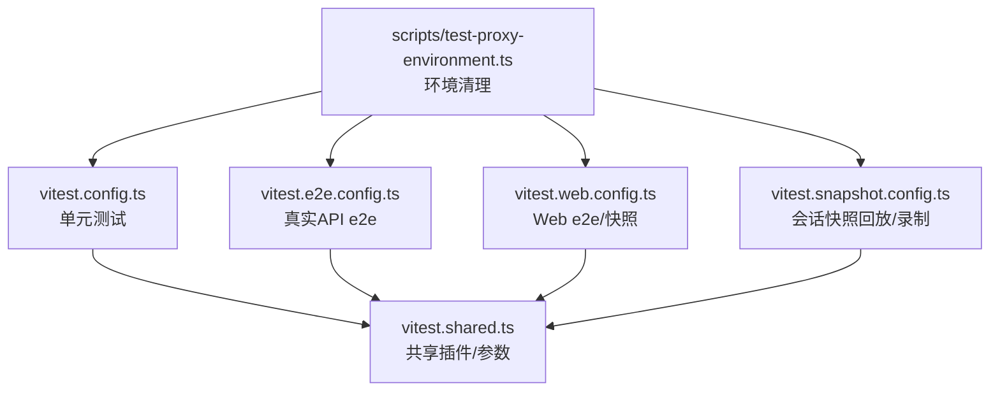
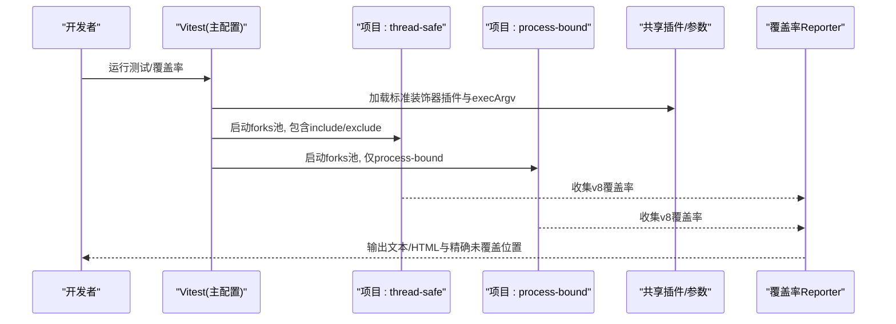
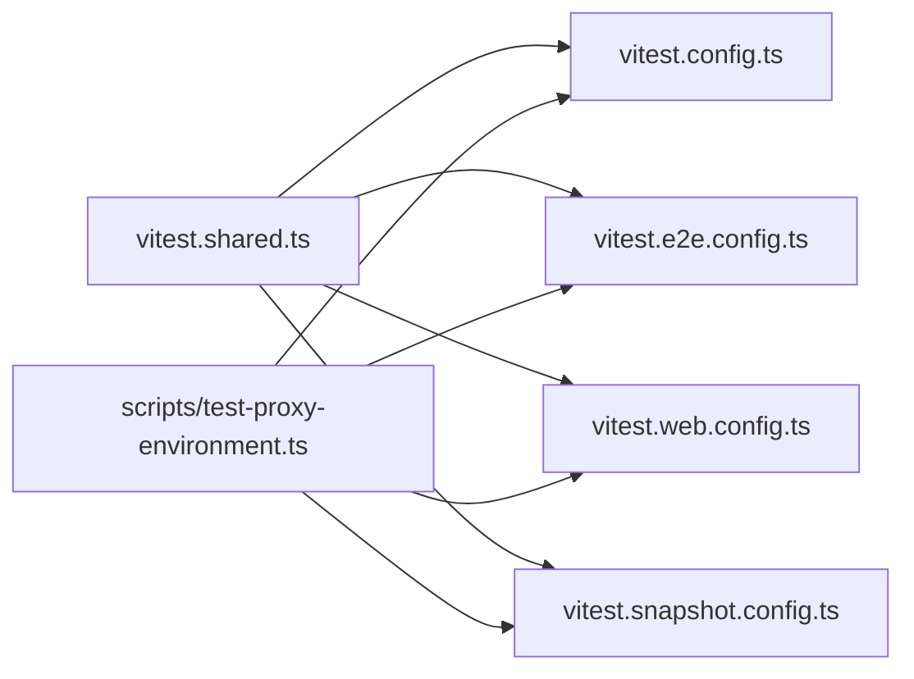

# 单元测试与集成测试

<cite>
**本文引用的文件**
- [vitest.config.ts](file://vitest.config.ts)
- [vitest.e2e.config.ts](file://vitest.e2e.config.ts)
- [vitest.web.config.ts](file://vitest.web.config.ts)
- [vitest.snapshot.config.ts](file://vitest.snapshot.config.ts)
- [vitest.shared.ts](file://vitest.shared.ts)
- [scripts/test-proxy-environment.ts](file://scripts/test-proxy-environment.ts)
- [docs/testing.md](file://docs/testing.md)
- [apps/cli/tests/args.spec.ts](file://apps/cli/tests/args.spec.ts)
- [packages/acp/acp/tests/bridge.spec.ts](file://packages/acp/acp/tests/bridge.spec.ts)
- [vitest.web.perf.config.ts](file://vitest.web.perf.config.ts)
- [scripts/coverage-uncovered-locations.cjs](file://scripts/coverage-uncovered-locations.cjs)
</cite>

## 目录
1. [简介](#简介)
2. [项目结构](#项目结构)
3. [核心组件](#核心组件)
4. [架构总览](#架构总览)
5. [详细组件分析](#详细组件分析)
6. [依赖关系分析](#依赖关系分析)
7. [性能考虑](#性能考虑)
8. [故障排查指南](#故障排查指南)
9. [结论](#结论)
10. [附录](#附录)

## 简介
本仓库采用多配置、分层级的测试体系，围绕 Vitest 构建：
- 单元测试：针对包与脚本的 .spec.ts，强调边缘路径、并发竞态与回归用例。
- 覆盖率门禁：对源码进行逐文件 100% 覆盖要求，并输出精确未覆盖位置。
- 真实 API e2e：调用外部模型或第三方服务，支持凭据开关与重试。
- 快照与回放：基于记录会话的无密钥回放，以及浏览器 UI 快照对比。
- Web 专用测试：面向前端构建产物与浏览器交互场景。
- 性能测试：独立入口，开启内存诊断与更长超时。

该文档聚焦于如何在本仓库中编写有效的单元测试与集成测试，涵盖 Vitest 配置与使用、测试组织与命名约定、断言与异步处理、Mock 策略、夹具管理、并发与性能测试最佳实践，以及覆盖率报告生成与分析方法。

## 项目结构
测试相关的关键配置文件集中在根目录，按用途拆分：
- vitest.config.ts：默认单元测试入口，包含双项目（线程安全 vs 进程绑定）、覆盖率阈值与排除规则。
- vitest.e2e.config.ts：真实 API e2e 测试，加载 .env，限制并发与重试。
- vitest.web.config.ts：Web 端 e2e/快照，串行执行，较长超时。
- vitest.snapshot.config.ts：会话快照回放/录制/刷新，控制并发与写入模式。
- vitest.shared.ts：共享插件与 execArgv 设置（装饰器预处理、禁用 webstorage）。
- scripts/test-proxy-environment.ts：清理代理环境变量，确保测试隔离。

图表来源
- [vitest.config.ts:158-200](file://vitest.config.ts#L158-L200)
- [vitest.e2e.config.ts:31-61](file://vitest.e2e.config.ts#L31-L61)
- [vitest.web.config.ts:16-37](file://vitest.web.config.ts#L16-L37)
- [vitest.snapshot.config.ts:39-67](file://vitest.snapshot.config.ts#L39-L67)
- [vitest.shared.ts:1-43](file://vitest.shared.ts#L1-L43)
- [scripts/test-proxy-environment.ts:26-63](file://scripts/test-proxy-environment.ts#L26-L63)

章节来源
- [vitest.config.ts:158-200](file://vitest.config.ts#L158-L200)
- [vitest.e2e.config.ts:31-61](file://vitest.e2e.config.ts#L31-L61)
- [vitest.web.config.ts:16-37](file://vitest.web.config.ts#L16-L37)
- [vitest.snapshot.config.ts:39-67](file://vitest.snapshot.config.ts#L39-L67)
- [vitest.shared.ts:1-43](file://vitest.shared.ts#L1-L43)
- [scripts/test-proxy-environment.ts:26-63](file://scripts/test-proxy-environment.ts#L26-L63)

## 核心组件
- 测试入口与项目划分
  - 默认单元测试通过 vitest.config.ts 定义两个项目：thread-safe（通用）与 process-bound（进程绑定），均使用 forks 池以避免 Node 线程问题。
  - include/exclude 控制匹配范围与平台不支持的套件。
- 覆盖率门禁
  - 使用 v8 提供者，逐文件 100% 阈值；CI 下输出文本与自定义 reporter 以打印精确未覆盖位置；本地额外生成 HTML。
- 真实 API e2e
  - 自动加载 .env，testTimeout/hookTimeout 更大，retry=2，文件级并行受 DSH_E2E_MAX_WORKERS 控制。
- Web 与快照
  - Web 测试串行执行，避免 HMR/动态生命周期干扰；快照回放可并行但写入需串行，由环境变量控制。
- 共享初始化
  - setupFiles 统一注入 test-proxy-environment 与 test-invariants，保证网络代理与不变量检查一致。

章节来源
- [vitest.config.ts:158-200](file://vitest.config.ts#L158-L200)
- [vitest.config.ts:201-373](file://vitest.config.ts#L201-L373)
- [vitest.e2e.config.ts:31-61](file://vitest.e2e.config.ts#L31-L61)
- [vitest.web.config.ts:16-37](file://vitest.web.config.ts#L16-L37)
- [vitest.snapshot.config.ts:39-67](file://vitest.snapshot.config.ts#L39-L67)
- [vitest.shared.ts:1-43](file://vitest.shared.ts#L1-L43)
- [scripts/test-proxy-environment.ts:26-63](file://scripts/test-proxy-environment.ts#L26-L63)

## 架构总览
下图展示了从测试运行到各层级的执行流程与关键配置点。

图表来源
- [vitest.config.ts:158-200](file://vitest.config.ts#L158-L200)
- [vitest.config.ts:201-373](file://vitest.config.ts#L201-L373)
- [vitest.shared.ts:1-43](file://vitest.shared.ts#L1-L43)

## 详细组件分析

### 单元测试：结构与命名约定
- 文件组织
  - 包内测试位于 packages/*/tests/*.spec.ts，脚本测试位于 scripts/**/*.spec.ts。
  - 测试与代码同域放置，便于维护与 HMR 安全。
- 命名约定
  - 单元测试以 .spec.ts 结尾；e2e 以 .e2e.ts；快照以 .snapshot.ts；性能以 .perf.ts。
- 示例参考
  - CLI 参数解析测试：[apps/cli/tests/args.spec.ts](file://apps/cli/tests/args.spec.ts)
  - ACP 桥接测试：[packages/acp/acp/tests/bridge.spec.ts](file://packages/acp/acp/tests/bridge.spec.ts)

章节来源
- [vitest.config.ts:121-125](file://vitest.config.ts#L121-L125)
- [apps/cli/tests/args.spec.ts:1-107](file://apps/cli/tests/args.spec.ts#L1-L107)
- [packages/acp/acp/tests/bridge.spec.ts:1-200](file://packages/acp/acp/tests/bridge.spec.ts#L1-L200)

### 断言库与异步测试
- 断言库
  - 使用 Vitest 内置 expect 与 vi 进行断言与 Mock。
- 异步测试
  - 使用 async/await 与 vi.waitFor 等待状态稳定（如会话更新、工具调用完成）。
- 示例参考
  - 在 ACP 桥接测试中使用 vi.waitFor 等待流式更新与状态变更。

章节来源
- [packages/acp/acp/tests/bridge.spec.ts:79-132](file://packages/acp/acp/tests/bridge.spec.ts#L79-L132)

### Mock 对象与外部依赖模拟
- 策略
  - 优先使用真实实现，仅在昂贵或非确定性边界（LLM 适配器、网络、时钟）使用 Mock。
  - 使用 vi.spyOn/vi.mock 拦截窄范围调用，保持下游链路真实。
- 示例参考
  - 在 CLI 参数测试中 mock process.exit/stdout/stderr 以捕获退出码与输出。
  - 在 ACP 测试中 mock 会话持久化与 Agent 行为以验证协议交互。

章节来源
- [apps/cli/tests/args.spec.ts:6-21](file://apps/cli/tests/args.spec.ts#L6-L21)
- [packages/acp/acp/tests/bridge.spec.ts:134-164](file://packages/acp/acp/tests/bridge.spec.ts#L134-L164)

### 集成测试：服务间交互、数据库操作与外部依赖
- 真实 API e2e
  - 通过 vitest.e2e.config.ts 启用，加载 .env，设置较大超时与重试，控制并发。
- 会话快照回放
  - 通过 vitest.snapshot.config.ts 进行无密钥回放，必要时切换为 record/refresh 模式。
- 示例参考
  - ACP 桥接测试涉及会话创建、提示、关闭、恢复等端到端流程。

章节来源
- [vitest.e2e.config.ts:31-61](file://vitest.e2e.config.ts#L31-L61)
- [vitest.snapshot.config.ts:39-67](file://vitest.snapshot.config.ts#L39-L67)
- [packages/acp/acp/tests/bridge.spec.ts:79-191](file://packages/acp/acp/tests/bridge.spec.ts#L79-L191)

### 测试夹具（fixtures）的管理与使用
- 原则
  - 每个测试拥有独立临时目录与唯一标识，避免共享可变状态。
  - 资源分配原子化：先申请再使用，失败时清理；afterEach 兜底释放。
- 实践
  - 使用 mkdtemp 创建私有临时根；端口绑定后读取实际地址；会话/数据库使用唯一命名空间。
  - 将共享夹具放在 tests/harness.ts，避免跨 spec 重复注册。
- 参考
  - CI 可靠性技能文档提供资源分配与隔离规范。

章节来源
- [.agents/skills/dsh-ci-test-reliability/SKILL.md:31-54](file://.agents/skills/dsh-ci-test-reliability/SKILL.md#L31-L54)

### 性能测试与并发测试最佳实践
- 并发控制
  - 默认单元测试使用 forks 池；e2e 通过 DSH_E2E_MAX_WORKERS 控制文件级并行；快照回放可并行但写入串行。
- 性能测试入口
  - vitest.web.perf.config.ts 启用 --expose-gc，延长超时，专注内存与响应性指标。
- 建议
  - 将高基数诊断放入手动清单；默认 lanes 保持快速；用确定性测试保障发布计数与顺序。

章节来源
- [vitest.config.ts:167-199](file://vitest.config.ts#L167-L199)
- [vitest.e2e.config.ts:50-61](file://vitest.e2e.config.ts#L50-L61)
- [vitest.snapshot.config.ts:54-67](file://vitest.snapshot.config.ts#L54-L67)
- [vitest.web.perf.config.ts:1-21](file://vitest.web.perf.config.ts#L1-L21)

### 覆盖率报告生成与分析
- 配置要点
  - 使用 v8 提供者，逐文件 100% 阈值；CI 输出文本与自定义 reporter，本地额外 HTML。
  - 通过 exclude 列表剔除类型文件、入口脚本与暂不覆盖的客户端区域。
- 精确未覆盖位置
  - 自定义 istanbul reporter 输出 <path>:<line>:<col> uncovered <kind>，便于定位。
- 使用方式
  - 运行覆盖率门禁任务；在 CI 与本地均可查看结果；分区模式下跳过阈值。

章节来源
- [vitest.config.ts:201-373](file://vitest.config.ts#L201-L373)
- [scripts/coverage-uncovered-locations.cjs:1-200](file://scripts/coverage-uncovered-locations.cjs#L1-L200)

## 依赖关系分析
- 配置耦合
  - 所有 Vitest 配置共享 vitest.shared.ts 提供的装饰器插件与 execArgv，确保一致性与稳定性。
- 环境隔离
  - 通过 scripts/test-proxy-environment.ts 清理代理环境变量，避免跨测试污染。
- 平台适配
  - 根据平台排除不支持的套件与覆盖率范围，保证 Windows/macOS/Linux 一致性。

图表来源
- [vitest.shared.ts:1-43](file://vitest.shared.ts#L1-L43)
- [vitest.config.ts:158-200](file://vitest.config.ts#L158-L200)
- [vitest.e2e.config.ts:31-61](file://vitest.e2e.config.ts#L31-L61)
- [vitest.web.config.ts:16-37](file://vitest.web.config.ts#L16-L37)
- [vitest.snapshot.config.ts:39-67](file://vitest.snapshot.config.ts#L39-L67)
- [scripts/test-proxy-environment.ts:26-63](file://scripts/test-proxy-environment.ts#L26-L63)

章节来源
- [vitest.shared.ts:1-43](file://vitest.shared.ts#L1-L43)
- [vitest.config.ts:158-200](file://vitest.config.ts#L158-L200)
- [vitest.e2e.config.ts:31-61](file://vitest.e2e.config.ts#L31-L61)
- [vitest.web.config.ts:16-37](file://vitest.web.config.ts#L16-L37)
- [vitest.snapshot.config.ts:39-67](file://vitest.snapshot.config.ts#L39-L67)
- [scripts/test-proxy-environment.ts:26-63](file://scripts/test-proxy-environment.ts#L26-L63)

## 性能考虑
- 并发与隔离
  - 使用 forks 池避免 Node 线程问题；进程绑定测试单独项目隔离。
  - e2e 与快照并发受环境变量控制，避免共享配额竞争。
- 超时预算
  - e2e/web/snapshot 分别设置更长的 testTimeout/hookTimeout，适应外部依赖与浏览器场景。
- 性能测试
  - 专用 perf 配置启用内存诊断，关注响应性与内存占用；默认 lanes 保持快速。

章节来源
- [vitest.config.ts:167-199](file://vitest.config.ts#L167-L199)
- [vitest.e2e.config.ts:50-61](file://vitest.e2e.config.ts#L50-L61)
- [vitest.web.config.ts:31-37](file://vitest.web.config.ts#L31-L37)
- [vitest.snapshot.config.ts:54-67](file://vitest.snapshot.config.ts#L54-L67)
- [vitest.web.perf.config.ts:1-21](file://vitest.web.perf.config.ts#L1-L21)

## 故障排查指南
- 覆盖率失败
  - 查看 CI 日志中的精确未覆盖位置记录；定位具体行与分支；补充测试或合理豁免。
- 网络/代理污染
  - 确认 setupFiles 已引入 test-proxy-environment；检查环境变量是否被清理。
- 平台相关问题
  - 确认 exclude 列表正确排除了不支持的套件；Windows/macOS 差异已通过配置处理。
- 并发不稳定
  - 降低 e2e/snapshot 并发；确保资源独占与 afterAll/afterEach 清理。

章节来源
- [vitest.config.ts:201-373](file://vitest.config.ts#L201-L373)
- [scripts/test-proxy-environment.ts:26-63](file://scripts/test-proxy-environment.ts#L26-L63)
- [vitest.e2e.config.ts:50-61](file://vitest.e2e.config.ts#L50-L61)
- [vitest.snapshot.config.ts:54-67](file://vitest.snapshot.config.ts#L54-L67)

## 结论
本仓库的测试体系以 Vitest 为核心，通过多配置分层、严格覆盖率门禁、真实 API e2e、会话快照回放与 Web 专用测试，构建了从单元到集成的完整质量保障。遵循资源隔离、最小 Mock、真实路径优先与并发可控的原则，可有效提升测试稳定性与可维护性。结合精确覆盖率报告与性能测试入口，能够在保证速度的同时提供深入的质量洞察。

## 附录
- 测试策略与层级说明参见 docs/testing.md。
- 典型测试文件参考：
  - CLI 参数解析：[apps/cli/tests/args.spec.ts](file://apps/cli/tests/args.spec.ts)
  - ACP 桥接端到端：[packages/acp/acp/tests/bridge.spec.ts](file://packages/acp/acp/tests/bridge.spec.ts)

章节来源
- [docs/testing.md:1-55](file://docs/testing.md#L1-L55)
- [apps/cli/tests/args.spec.ts:1-107](file://apps/cli/tests/args.spec.ts#L1-L107)
- [packages/acp/acp/tests/bridge.spec.ts:1-200](file://packages/acp/acp/tests/bridge.spec.ts#L1-L200)